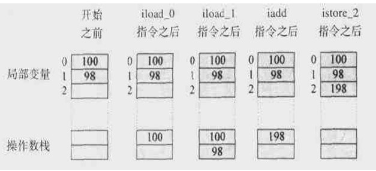
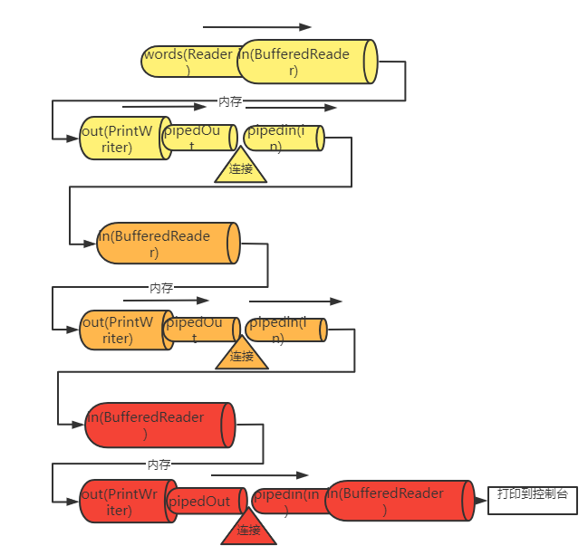

# 一、Java

## 1.1 Java程序运行原理

Java程序由编译器进行编译，产生一种中间代码，称为Java字节码。然后在用JVM（解释器为Java JVM的实现）解释为底层机器码，再执行。运行原理如下：


Java字节码使用“一次编程，到处运行”成为可能


## 1.2 Java平台

Java平台由两部分组成：`Java虚拟机`与`Java API`。Java平台时Java程序与底层平台隔离。如图所示：


## 1.3 Java特征

1. 简单性

   ​		语法语义比较简单

2. 面向对象

3. ==分布式特征==

   ​		分布具有两层含义：一是数据分布，二是操作分布（计算分布）

4. 半编译半解释特征

5. 强壮性

   ​		提供自动垃圾回收进行内存管理；是一门强类型语言

6. 安全性

   `1.内存分配及布局由Java运行系统规定。`

   ​		内存布局依赖于Java运行系统所在的软硬件平台的特性。Java编译器是通过`符号指针`来引用内存，由Java运行系统再运行时将`符号指针`解释为`实际的内存地址`，Java程序员不能强制引用内存指针。Java程序无法破坏不属于它的内存空间。

   `2.运行系统执行基于数字签名技术的代码认证、字节码验证与代码访问权限控制的安全控制模型。`

7. 体系结构中立

   ​		不针对具体平台结构。比如Java的基本数据类型不会随目标的变化而变化，`一个整型总是32位`，一个长整型总是64位。比如Java语言环境提供了一个用于访问底层操作系统功能的可扩展库：java.lang、java.util、java.io等

8. 可移植性

9. 高性能

   ​		由于字节码与机器码十分接近，使得字节码到机器码的转换十分快捷。

10. 多线程

11. 动态特征

## 1.4 Java运行系统

java运行系统是各平台厂商对JVM的具体实现。对于Java种的两类应用程序存在两2种不同类型的运行系统：对于Java应用，`运行系统是Java解释器`；而对于Java Applet，`运行系统是指Java兼容的Web浏览器`，该浏览器中包含了支持Applet运行的环境。

Java运行环境一般包括以下几部分：`类装配器`、`字节码验证器`、`解释器`、`代码生成器`和`运行支持库`。


Java运行系统运行的是字节码即.class文件。执行字节码的过程可分为如下3步：

1. 代码的装入

   ​		由类装配器装入程序运行时需要的所有代码，其中包括程序代码中调用到的所有类。当==**装入**==了运行程序需要的==**所有类**==后，运行系统便可以==**确定**==整个可执行程序的==**内存布局**==。

2. 代码的验证

   ​		由字节码检验器进行安全检查，以确保代码不违反Java的安全性规则，同时字节码验证器还可发现操作数栈溢出、非法数据类型转化等多种错误。

3. 代码的执行

   ​		`即时编译`（Just-in-Time）方式：由代码生成器先将字节码编译为本机代码，然后再全速执行本机代码。这种运行方式效率高。

   ​		`解释执行方式`：解释器每次把一小段代码转换成本机代码并执行，如此往复完成Java字节码的所有操作。


## ==**1.5 Java虚拟机（JVM）**==

JVM工作原理图如下：


首先Java源文件经过前端编译器（javac或ECJ）将.java文件编译为Java字节码文件，如下：

```terminal
javac Friut.java
```

执行下面语句，完成了上面红色方框中的工作。JRE的加载器从硬盘中读取class文件，载入到系统分配给JVM的内存区域--运行数据区（Runtime Data Areas). 然后执行引擎解释或者编译类文件，转化成特定CPU的机器码，CPU执行机器码，至此完成整个过程。

```terminal
java com.company.Friut
```


> appletviewel.exe(小程序浏览器)：一种执行HTML文件上的Java小程序类的Java浏览器;
>
> javadoc.exe：根据Java源代码及其说明语句生成的HTML文档;
>
> jdb.exe：Java调试器，可以逐行地执行程序、设置断点和检查变量;
>
> javah.exe：产生可以调用Java过程的C过程，或建立能被Java程序调用的C过程的头文件;
>
> ==javap.exe==：Java反汇编器，显示编译类文件中的可访问功能和数据，同时显示字节代码含义;
>
> javac.exe：Java编译器，将Java源代码换成字节代;
>
> java.exe：Java解释器，直接从类文件执行Java应用程序代码;

### 1.5.1 虚拟机中的类加载器

#### 1. 层级结构

类加载器层次结构如下（父子关系如下）：


* Bootstrap class loader：==当运行java虚拟机时，这个类加载器被创建==，它加载一些基本的java API，包括Object这个类。需要注意的是，这个类加载器不是用java语言写的，而是用==C/C++写的。==
* Extension class loader: 这个加载器加载除了基本API之外的一些拓展类，包括一些与安全性能相关的类。
* System Class Loader: 它加载应用程序中的类，也就是在你的classpath中配置的类。
* User-Defined Class Loader: 这是开发人员通过拓展ClassLoader类定义的自定义加载器，加载自定义的一些类。

#### 2. 委派模式（Delegation Mode）

仔细看上面的层次结构，当JVM加载一个类的时候，下层的加载器会将任务委托给上一层类加载器，上一层加载检查它的命名空间中是否已经加载这个类，如果已经加载，直接使用这个类。如果没有加载，继续往上委托直到顶部。`检查完了之后，按照相反的顺序进行加载`，如果Bootstrap加载器找不到这个类，则往下委托，直到找到类文件。对于某个特定的类加载器来说，一个Java类只能被载入一次，也就是说在Java虚拟机中，类的完整标识是（classLoader，package，className）。一个类可以被不同的类加载器加载。


==**注意**==

下层的加载器能够看到上层加载器中的类，反之则不行，也就是是说委托只能从下到上。

类加载器可以加载一个类，但是它不能卸载一个类。但是类加载器可以被删除或者被创建。

==**完成之后**==，执行以下流程：


* Loading：类加载，将文件系统中的Class文件载入到JVM内存（运行数据区域）
* Verifying：检查载入的类文件是否符合Java规范和虚拟机规范
* Preparing：为这个类分配所需要的内存，确定这个类的属性、方法等所需的数据结构。（Prepare a data structure that assigns the memory required by classes and indicates the fields, methods, and interfaces defined in the class.）
* Resolving：将该类常量池中的`符号引用`都改变为`直接引用`。
* Initialing：初始化类的局部变量，为静态域赋值，同时执行静态初始化块。


### 1.5.2 运行数据区域

###### Runtime Data Areas：当运行一个JVM示例时，系统将分配给它一块内存区域（这块内存区域的大小可以设置的），这一内存区域由JVM自己来管理。从这一块内存中分出一块用来存储一些运行数据，例如创建的对象，传递给方法的参数，局部变量，返回值等等。分出来的这一块就称为运行数据区域。运行数据区域可以划分为6大块：Java栈、程序计数寄存器（PC寄存器）、本地方法栈（Native Method Stack）、Java堆、方法区域、运行常量池（Runtime Constant Pool）。运行常量池本应该属于方法区，但是由于其重要性，JVM规范将其独立出来说明。其中，前面3各区域（PC寄存器、Java栈、本地方法栈）是每个线程独自拥有的，后三者则是整个JVM实例中的所有线程共有的。这六大块如下图所示：


#### 1 PC计数器：

每一个线程都拥有一个PC计数器，当线程启动（start）时，PC计数器被创建，这个计数器存放当前正在被执行的字节码指令（JVM指令）的地址。

#### 2 Java栈：

同样的，Java栈也是每个线程单独拥有，线程启动时创建。这个栈中存放着一系列的栈帧（Stack Frame），JVM只能进行压入（Push）和弹出（Pop）栈帧这两种操作。每当调用一个方法时，JVM就往栈里压入一个栈帧，方法结束返回时弹出栈帧。如果方法执行时出现异常，可以调用printStackTrace等方法来查看栈的情况。栈的示意图如下：


每个栈帧包含三个部分：本地变量数组，操作数栈，方法所属类的常量池引用。

==**本地变量数组：**==局部（本地）变量数组中，从0开始按顺序存放方法所属对象的引用、传递给方法的参数、局部变量。

例子如下

```java
public void dosomething(int a,double b,Object o){。。。}
```

这个方法栈帧中包括如下局部变量：

```yaml
0:this
1:a
2,3:b
4:0
```

其中double类型的b需要两个连续的索引。取值的时候，取出的是2这个索引中的值。如果是静态方法，则数组第0个不存放this引用，而是直接存储传递的参数。

==**操作数栈：**==

操作数栈中存放方法执行时的一些`中间变量`，JVM在执行方法时压入或者弹出这些变量。其实，操作数栈是方法真正工作的地方，执行方法时，局部变量数组与操作数栈根据方法定义进行数据交换。例如，执行以下代码时，操作数栈的情况如下：

```java
int a = 90;
int b = 10;
int c = a + b;
```



==**栈帧中数据引用：**==

除了局部变量数组和操作数栈之外，栈帧还需要一个常量池的引用。当JVM执行到需要常量池的数据时，就是通过这个引用来访问常量池的。栈帧中的数据还要负责处理方法的返回和异常。如果通过return返回，则将该方法的栈帧从Java栈中弹出。如果方法有返回值，则将返回值压入到调用该方法的方法的操作数栈中。另外，数据区中还保存中该方法可能的异常表的引用。

------------------------------------------------
#### 3 本地方法栈

当程序通过JNI（Java Native Interface）调用本地方法（如C或者C++代码）时，就根据本地方法的语言类型建立相应的栈。

#### 4 方法区域

方法区域是一个JVM实例中的所有线程共享的，当启动一个JVM实例时，方法区域被创建。它用于存运行放常量池、有关域和方法的信息、静态变量、类和方法的字节码。不同的JVM实现方式在实现方法区域的时候会有所区别。Oracle的HotSpot称之为永久区域（Permanent Area）或者永久代（Permanent Generation）。
#### 5 运行常量池

这个区域存放类和接口的常量，除此之外，它还存放方法和域的所有引用。当一个方法或者域被引用的时候，JVM就通过运行常量池中的这些引用来查找方法和域在内存中的的实际地址。
#### 6 堆（Heap）

堆中存放的是程序创建的对象或者实例。这个区域对JVM的性能影响很大。垃圾回收机制处理的正是这一块内存区域。

所以，类加载器加载其实就是根据编译后的Class文件，将java字节码载入JVM内存，并完成对运行数据处的初始化工作，供执行引擎执行。

### 1.5.3 执行引擎（Execution  Engine）

类加载器将字节码载入内存之后，执行引擎以Java 字节码指令为单元，读取Java字节码。问题是，现在的java字节码机器是读不懂的，因此还必须想办法将字节码转化成平台相关的机器码。这个过程可以由解释器来执行，也可以由即时编译器（JIT Compiler）来完成。


版权声明：本文为CSDN博主「Lust-Ring」的原创文章，遵循CC 4.0 BY-SA版权协议，转载请附上原文出处链接及本声明。
原文链接：https://blog.csdn.net/bingduanlbd/article/details/8363734

## 1.6 JavaAPI

* java.lang——核心类组成，包括基本数据类型和出错处理方法等。
* java.io——标准输入输出库，提供系统通过数据流
* java.util——包含集合类，如Map，Set，List，日期与时间等相关的类
* java.net——提供实现网络应用所需的类
* java.awt——是抽象窗口工具类
* java.awt.event——图形化用户界面中的事件处理
* java.applet——提供创建Applet以及实现Applet相关操作所必需的类
* java.sql——支持通过JDBC的数据库访问操作

# 二、Java语言基础

## 2.1 标识符

==**Java标识符命名规则：**==

* 标识符是以字母，“_”（下划线），或“$”开始的一个字符序列
* 数字不能作为标识符的第一个字符
* 标识符不能是Java语言的关键字（==**包装类名可以**==）
* 标识符大小写敏感，且长度没有限定

Java==**标识符风格约定**==：

* `类名`、`接口名`采用`大骆驼拼写法。`
* `变量名`和`方法名`采用`小骆驼拼写法`，并且“_”与“$”不能作为它们的第一个字符。_
* _`常量`采用字母完全大写加单词用“_”隔开的写法。
* `方法名`应该用动词。


## 2.2 关键字

48个关键字：

abstract、assert、boolean、break、byte、case、catch、char、vlass、continue、default、do、double、else、enum、extends、final、finally、float、for、implements、import、int、interface、instanceof、long、native、new、package、private、protected、public、return、short、static、strictfp、super、switch、synchronized、this、throw、throws、transient、try、void、volatile、while

具体作用待处理

## 2.3 数据类型与类型转换

|    种类    |        类型         | 默认值                             |      转化规则      |
| :--------: | :-----------------: | ---------------------------------- | :----------------: |
|   逻辑型   |       boolean       | false                              | 布尔值不能转成数字 |
|   文本型   |        char         | \u0000                             | char可自动转成int  |
|    整型    | byte short int long | 0 默认int类型                      | int可自动转成char  |
|   浮点型   |    float double     | 0.0 默认double类型 0.0f为float类型 |                    |
| 所用引用型 |   类、接口、数组    | null                               |                    |


### 2.3.1逻辑型

boolean 1位

### 2.3.2 逻辑型文本型

char 16位

java转义字符序列：

| **符号** |       **字符含义**       |
| :------: | :----------------------: |
|    \n    |       换行 (0x0a)        |
|    \r    |       回车 (0x0d)        |
|    \f    |       换页符(0x0c)       |
|    \b    |       退格 (0x08)        |
|    \s    |       空格 (0x20)        |
|    \t    |          制表符          |
|   `\"`   |          双引号          |
|   `\'`   |          单引号          |
|   `\\`   |          反斜杠          |
|   \ddd   |     八进制字符 (ddd)     |
|  \uxxxx  | 16进制Unicode字符 (xxxx) |

### 2.3.3 整型

byte 8位 short 16位 int 32位 long 64位

### 2.3.4 浮点型

float 16位 double 64位

`浮点常量`默认double类型

### 2.3.5 字符类型

char 16位

### 2.3.6 复合数据类型

一般地将用户定义的新类型称为复合数据类型，新类型以`类`和`接口`的形式定义。

### 2.3.7 ==**类型转换**==

设`低优先级类型`为`位数低`的`类型`，则：

* 低优先级类型转换为高优先级类型将`自动转换`。

  * ①所有的byte,short,char型的值将被提升为int型；

    ②如果有一个操作数是long型，计算结果是long型；

    ③如果有一个操作数是float型，计算结果是float型；

    ④如果有一个操作数是double型，计算结果是double型；

    而声明为final的变量会被JVM优化

* 高优先级类型转换为低优先级类型将`强制转换`。


引用类型造型 待处理

### 2.3.8 类型转换具体实现

## 2.4 变量

### 2.4.1变量类型

* 基本类型

  系统直接给该变量分配空间

  ```java
  int a;
  a=12;
  ```

* 引用类型

  只是给该变量分配引用空间，数据空间未分配。且引用变量声明后必须通过实例化开辟数据空间。

  ```java
  Mydate today;
  today.day=14 //报错
  ```

### 2.4.2 根据作用域划分变量

1. 局部变量

2. 类成员变量

   类成员变量又分 ==待处理==p40

3. 方法参数

4. 异常处理器（catch语句块）参数

### 2.4.3 ==**变量初始化**==

`类成员变量`是系统`自动初始化的`（根据默认值初始化），`局部变量`则是使用前`手动赋初值`。（局部变量不赋予初值会报错）

## 2.5 运算符与表达式

### 2.5.1 运算符

| 优先级 |                      运算符                      | 结合性       |
| :----: | :----------------------------------------------: | ------------ |
|   1    |                    ()、[]、{}                    |              |
|   2    |                !、+、-、~、++、--                | ==从右向左== |
|   3    |                     *、/、%                      |              |
|   4    |                       +、-                       |              |
|   5    |                    «、»、>>>                     |              |
|   6    |             <、<=、>、>=、instanceof             |              |
|   7    |                      ==、!=                      |              |
|   8    |                        &                         |              |
|   9    |                        ^                         |              |
|   10   |                        \|                        |              |
|   11   |                        &&                        |              |
|   12   |                       \|\|                       |              |
|   13   |                        ?:                        | ==从右向左== |
|   14   | =、+=、-=、*=、/=、&=、\|=、^=、~=、«=、»=、>>>= | ==从右向左== |

### 2.5.2 表达式

==两个操作数全是byte型或short型，表达式结果也是int。==

==&&，||：称为短路与、或运算==

&，|：称为不断路与、或运算

==对象（op1） instanceof 对象类型（op2）：如果op1是op2的实例，则返回 true==（测试对象类型）

## 2.4 语句

1. 表达式语句

2. 声明语句

3. 程序流控制语句

   

## 2.5 程序流控制

**while**

```java
while(){};
```

**do while**

```java
do{}while();
```

**for**

```java
for(;;)
```

```
for(类型 临时名:集合或数组){} 
```

**if else**

```java
if(){}else{}
```

```java
if(){}
else if(){}
[...]
else{}
```

**switch**

case语句==不能使用null==，但支持以下类型：==**char、byte、short、int**== 和 ==**Character、Byte、Short、Integer 、 String Enum 类型**==

==default可选,可以放在case的上与下==

```java
switch(){case 1: break; default: break; }
```

**break**

结束循环体

**continue**

结束本次循环

## 2.6 ==**数组**==

数组声明

```java
//C C++ java 标准格式
char a[];
//java 特有格式
char[] a1;
```

数组创建与初始化

```java
new char[20];
```

多维数组

```java
int a[][];
// 行列
a=new int[4][4];
```

不规则数组

```java
int a[][]=new int[2][];
a[0]=new int[10];
a[1]=new int[5];
```

## 2.7 ==**基本类型的对象**==

## 2.8 ==**Object**==

# 三、java面向对象特征

## 3.1 OOP（**面向对象程序设计**）描述

* ==**抽象**==
* ==**封装**==

 隐藏对象的属性和实现细节，仅对外公开接口，控制在程序中属性的读和修改的访问级别

* ==**继承**==

类单继承，接口多继承

* ==**多态**==

对外一个接口，内部多种实现。通过方法的重载实现`编译时多态`，而通过类之间的继承、方法的重写以及`晚联编技术`实现`运行时多态`。

==**晚[联编](####联编)（晚绑定）**==：当向一个对象发消息时，所调用的代码直到运行时刻才确定。

## 3.2类的定义

```java
类的声明
public class Dog{
    类的成员变量
    public int sex;
    类的构造方法
    public Dog(int sex){
        this.sex=sex;
    }
    类的成员方法
    public void eatFood(){
        System.out.println("eat shit");
	}
}
```

### 3.2.1 成员变量

声明在类中的变量，完整声明格式如下：

```java
[public|protected|private][static][final][transient][volatile] type varibleName
```


1. 第一个[]中为访问权限修饰符
2. static用来限时该成员变量为类变量，还是实例变量（static 修饰 为类变量）
3. `final`用来声明一个`常量`
4. `transient`用来声明一个`暂时性变量`，表示该变量并不属于对象的[永久状态]()。
5. volatile修饰的变量，用于并发线程共享，系统将采取更优的控制方法提高并发执行的效率。

### 3.2.2 成员方法

声明在类中的方法，且不与类同名，完整声明格式如下：

```java
[<accessLevel>][static][final|abstract][native][synchronized]<return_type><name>([argument_list])[throws <exception_list>]{<block>}
```

1. 第一个[]中为访问权限修饰符，与成员变量相同。
2. static用来限时该成员方法为类方法，还是实例方法（static 修饰 为类方法）
3. final指明该方法不能重写
4. native表明方法是用其他语言实现。
5. synchronized用来控制多个并发线程对共享数据的访问。

#### 1 方法参数传递方式

1. ==**8大基本类型数据按值传递的方式**==
2. ==**对象、数组按引用传递的方式**==

#### 2 可变参数列表

使用可变参数表，可以使方法具有数目不定的多个参数。格式为：

```
类型... 参数名
```

使用如下：

```java
public class Calculation{
	public static void toDisplay(int... sums){
		for(int sum : sums){
			System.out.println(sum);
		}
    }
	public static void main(String args[]){
			Calculation.toDisplay(10,2,5,7,9,5,3);
        Calculation.toDisplay(10,2,5);
    }
}
```

使用条件与注意事项：

* 可变参数只能作为方法参数列表中最后一个参数。
* 编写API尽量少用，尽量不重载。
* 调用API尽量多用，更易读。

### 3.2.3 方法重载

[3.5.3 方法重写](###3.5.3 方法的重写)

java编译时多态

例如：

```java
public void println()
public void println(boolean x)
public void println(char x)
public void println( int x,String x)

```

重载条件：

* **方法名相同**，**返回类型不同** **参数列表不同：{数量不同、顺序不同、类型不同}；**
* 方法重载与返回值类型没有关系
* 方法重载和修饰符列表无关

### 3.2.4 构造方法

完整声明如下：

```java
[<accessLevel>]<class_name>([<argument_list>]){
    [<statements>]
}
```

使用条件：

1. 必须与类名同名
2. 不能有返回值
3. 用户不能直接调用，需new自动调用

#### 1 重载构造方法

例如：

```java
public A(){}
public A(int a){}
```

使用条件：

* 方法名相同，**参数列表不同：{数量不同、顺序不同、类型不同}；**
* 方法重载和修饰符、列表无关

### 3.2.5 ==访问控制==

3种访问控制修饰符如下：

|  修饰符\权限  |  类  | 同包子类（包的一部分） | 同包非子类（包的一部分） | 异包子类（子类） | 异包非子类（全局） |
| :-----------: | :--: | :--------------------: | :----------------------: | :--------------: | :----------------: |
|  **private**  |  ♥   |                        |                          |                  |                    |
|  **default**  |  ♥   |           ♥            |            ♥             |                  |                    |
| **protected** |  ♥   |           ♥            |            ♥             |        ♥         |                    |
|  **public**   |  ♥   |           ♥            |            ♥             |        ♥         |         ♥          |

普通类：只能public、default。

接口：只能public、default。

内部类：public、protected、default

==**被protected修饰的成员对于本包和其子类可见**==的`精确描述`

* 父类的protected成员是包内可见的，并且对子类可见；

* 若子类与父类不在同一包中，那么在子类中，子类实例可以访问其从父类继承而来的protected方法，而不能访问父类实例的protected方法

#### 1 继承访问控制

==**public、protected**==修饰的方法可以被子类继承，同一个包下，默认的也可以被继承。如果子类重写，要修改方法的访问权限，==**子类方法的访问权限必须比父类大**==

### 3.2.6初始化过程

**1.** **初始化==父类==中的静态成员变量和静态代码块** **；** 

**2.** **初始化==子类==中的静态成员变量和静态代码块** **；** 

**3.初始化==父类==的普通成员变量和代码块，再执行==父类的构造方法==；**

**4.初始化==子类==的普通成员变量和代码块，再执行子类的构造方法；**

## 3.3 ==**内部类**==

丰富待处理

在Java中，可以将一个类定义在另一个类里面或者一个方法里面，这样的类称为`内部类`。广泛意义上的内部类一般来说包括这四种：`成员内部类`、`局部内部类`、`匿名内部类`和`静态内部类`。

### 3.3.1 成员内部类（实例内部类）

内部类作为外部类的成员使用。

* 内==**部类能访问外部类所有的成员（包括static）**==。==**但外部类要访问内部类必须创建内部类实例**==（==**外部类内可直接创建内部类实例，非外部类需间接创建外部类**==。）
* 由于成员内部类看起来像是外部类的一个成员，所以可以像类的成员一样拥有==**多种权限修饰**==（如果用protected修饰，则只能在同一个包下或者`继承外部类`的情况下访问）（也可以用static）。

代码例子如下：

```java
package com.company;

public class Main {
    public int a=1;
    public static int b=2;

    public Main(){
        new MainSon().useOuterClass();
    }
    public class MainSon{
        public int c=3;
        public void useOuterClass(){
            System.out.println(a);
            System.out.println(b);
            System.out.println(b);
        }
    }
    public static void main(String[] args) {
	// write your code here
        new Main().new MainSon().useOuterClass();
    }
}
```

### 3.3.2 局部内部类

局部内部类是定义`在一个方法或者一个作用域里面的类`，它和成员内部类的区别在于局部内部类的`访问仅限`于`方法内`或者`该作用域内`。局部内部类就像是方法里的一个局部变量一样，==**不能拥有访问修饰符public、protected、private以及static修饰符。**==

```java
class People{
    public People() {
         
    }
}
 
class Man{
    public Man(){
         
    }
     
    public People getWoman(){
        class Woman extends People{   //局部内部类
            int age =0;
        }
        return new Woman();
    }
}
```

### 3.3.3 匿名内部类

没有类名的局部类（本地类）。

实现分两种：

**匿名子类（继承父类）**

```java
class Animal {
    private String name;

    public Animal(String name) {
        this.name = name;
    }

    public void printAnimalName() {
        System.out.println(bird.name);
    }
}
public class AnimalTest {
    public static void main(String[] args) {

        // 鸟类，匿名子类，继承自Animal类，可以覆写父类方法
    Animal bird = new Animal("布谷鸟") {

        @Override
        public void printAnimalName() {
            accessTest();   　　　　　　　　// 访问外部类成员
            System.out.println(ANIMAL);  // 访问外部类final修饰的变量
            super.printAnimalName();
        }
    };
    }
}
```

**实现接口的匿名类****

```java
interface HelloWorld {
	public void greet();
	public void greetSomeone(String someone);
 }

public class HelloWorldTest {
    public static void main(String[] args) {
         HelloWorld spanishGreeting = new HelloWorld() {
             String name = "mundo";
             public void greet() {
                 greetSomeone("mundo");
             }
             public void greetSomeone(String someone) {
                 name = someone;
                 System.out.println("Hola, " + name);
             }
         };
    }
}
```

### 3.3.4 静态内部类

静态内部类也是定义在另一个类里面的类，只不过在类的前面多了一个关键字static。静态内部类是==**不需要依赖于外部类的**==，这点和类的静态成员属性有点类似，并且它不能使用外部类的非static成员变量或者方法。

```java
public class Test {
    public static void main(String[] args)  {
        Outter.Inner inner = new Outter.Inner();
    }
}
 
class Outter {
    public Outter() {
         
    }
     
    static class Inner {
        public Inner() {
             
        }
    }
}
```

### ==**3.3.5Lambda表达式**==

有空先 待处理

## 3.4 对象生命周期

对象生命周期包括了对象的创建、对象的使用以及对象的清除。主要对==**对象的清除**==作讲解：

1. ==**垃圾收集器**==

收集机制为：被确认不存在任何引用的对象。

Java运行系统中的垃圾收集器周期性地释放不再被引用的对象所占有的内存，自动执行内存回收。但垃圾收集器却以`较低优先级`在系统空闲周期中执行，因此`垃圾收集速度比较慢`。在某些情况下，也可以通过调用System类的gc（）方法，即调用`System.gc（）`显示执行垃圾收集。**例如：在产生大量废弃对象的代码段后或在需要大量内存的代码段前，可以显示进行垃圾收集。**

2. ==**对象的最终初始化处理**==

一个对象在被收集之前，垃圾收集器将调用对象`finalize（）方法`，以使对象自己能够做最后的清理，释放占有的资源，这个过程称为`对象的最终化`。但一些对象使用了不在垃圾收集器控制范围内的本地资源，则需要实现该方法。例如：

```java
protected finalize()throws throwable{
    ..
        super.finalize();
}
```

> 如果重写了该方法，则需要最后调用super.finalize()方法。
>

## 3.5 继承呈现

### 3.5.1 类的继承

java类的继承是`单继承`（不能继承多个父类，类似一个父亲多个儿子），且Object是所有类的父类（==**根意义上的父类别搞错**==）。

例子如下：

```java
public class Main{
    public static void main(String args[]){
        Fruit f=new Fruit();
        System.out.println(f.Name);
        System.out.println(f.new Apple().Name);
    }
}
class Fruit{
    protected String Name="fruit";

    class Apple extends Fruit{
        public String Name="apple";
    }
}

```

### 3.5.2 super关键字

super关键字指向所在类的父类。super([args])指调用父类的构造器。

### 3.5.3 方法的重写

[3.2.3 方法重载](###3.2.3 方法重载)

使用规则：

1. 子类中重写的父类方法`返回值类型`必须与父类方法`相同`。

2. 子类中重写方法的访问权限不能缩小。

3. 子类中重写方法不能抛出新的异常。

4. 子类与父类成员变量或方法（`方法名字`、`参数个数`、`返回值类型`、`参数类型`）是相同的，才能被定义为重写。

5. **方法名相同，参数类型、个数相同**

   **子类返回类型小于等于父类方法返回类型，**

   **子类抛出异常小于等于父类方法抛出异常，**

   **子类访问权限大于等于父类方法访问权限。**


## ==**3.6 多态呈现**==

==**什么是多态？**==

同一操作作用于不同的对象，可以有不同的解释，产生不同的执行结果，这就是多态性。

==**什么是编译时多态？**==

Java在编译时能够确定执行**重载**方法中的哪一个。

==**什么是运行时多态？**==

**只能在运行时刻根据该变量指向的具体对象类型确定，这就是运行时多态。比如父类变量存放子类对象。**

final关键字能够影响晚[联编](####联编)。

***\*编译时类型\****：由声明该变量时使用的类型决定

***\*运行时类型\****：由该变量指向的对象类型决定

==**代码上。运行时多态怎么实现？**==

**方法重写**和**上塑造型**

==**代码上。编译时多态怎么实现？**==

### 3.6.1 隐藏和覆盖

接口、抽象类、类的隐藏和覆盖讨论  待处理

==**覆盖**==：子类`重写`父类的`实例方法`

（1）==**方法不能交叉覆盖**==：子类实例方法不能覆盖父类的静态方法（编译时报错）；

==**隐藏**==：父类和子类拥有`相同名字`的`属性`和子类`重写`父类的`静态方法`

（1）==**当发生隐藏的时候，声明类型是什么类，就调用对应类的属性或者方法，而不会发生动态绑定**==

（2） ==**属性只能被隐藏，不能被覆盖**==

（3）==**变量可以交叉隐藏**==：子类实例变量/静态变量可以隐藏父类的实例/静态变量

3、隐藏和覆盖的区别

（1）`被隐藏的属性或静态方法`，上塑造型后，==**访问**==的是==**父类中的属性**==

  在无强制转换时子类要访问父类的属性使用super关键字

（2）被覆盖的实例方法，上塑造型后，==**访问**==的是==**子类中的方法**==

     子类要是想访问父类的方法，可以使用super关键字

RTTI(run time type identification，运行时类型检查)

RTTI只针对覆盖，不针对隐藏：因为覆盖是动态绑定，是受RTTI约束的，隐藏不受RTTI约束

运行时类型为引用变量所指向的对象的类型，编译时类型是引用变量自身的类型
### 3.6.2 上塑造型

**将一种类型（子类）对象的引用转换成另一种类型（父类对象引用），就称为上塑造型**。（子类特有的部分（方法和属性）会被隐藏，下塑造型回到原来类型可恢复）

```java
package com.example;

import java.util.Set;
import java.util.TreeSet;

class Father {
    public int i = 1;
    public static String name="Father";
    public void say(){
        System.out.println("case Father");
    }
    public static void toPrint(){
        System.out.println("static Father");
    }
}
class Son extends Father{
    public int a = 3;
    public int i = 2;
    public  String name="Son";
    public void say(){
        System.out.println("case Son");
    }
    public static void toPrint(){
        System.out.println("static Son");
    }
}
public class Test {
    public static void main(String[] args) {
        Father f = new Father();
        Son s=(Son)f;
        System.out.println(f.i);//属性隐藏
        f.say();//实例方法覆盖
        System.out.println(f.name);//属性交叉隐藏
        f.toPrint();//静态方法隐藏
        //System.out.println(f.a); 子类特有部分被隐藏
        System.out.println(s.i);
        s.say();
        System.out.println(s.name);
        s.toPrint();
        System.out.println(s.a);

    }
}
```

### 3.6.3 下塑造型（对象类型强制转换）

**必须先上塑造型再向下塑造型**

```java
public class Test {
    public static void main(String[] args) {
               Father f = new Son();
               Son s = (Son)f;
               System.out.println(s.i);
               s.say();
    }
}
```

# ==**四、Java高级特征**==

## 4.1 static关键字

### 4.1.1 类变量/静态变量

有static修饰的变量为静态变量。

==**静态变量特点：**==

* **静态变量只在系统加载其所在类时分配空间并初始化。**
* **创建该类的实例时将不再分配空间，所有的实例将==共享==类的`静态变量`。**
* **依附于类，不能使用this**

==**作用：**==

**可以用来在实例之间进行通信和跟踪该类实例的数目。**

### 4.1.2 类方法/静态方法

有static修饰的方法为静态方法。

==**静态方法特点：**==

* **静态方法只允许访问静态成员，不能访问实例成员（条件：仅限本类成员）。**
* **依附于类，不能使用this**
* **子类不能==重写==父类静态方法**

### 4.1.3 静态初始化程序

不属于任何方法体并被static关键字修饰的语句块，例子如下：

```java
class A{
    static{
        ...
    }
}
```

静态语句块常用来初始化类变量，所以叫**静态初始化程序**。

什么时候运行？

==**静态语句块在类加载时运行。**==


### 4.1.4 静态类

==**静态类只能是静态内部类**==，==**静态类在外部声明不通过。**==


## 4.2 final 关键字

### 4.2.1 final 类

final修饰的类不能被继承。

### 4.2.2 final 方法

final修饰的方法不能被重写。

### 4.2.3 final 变量

final修饰的变量一赋值就不能更改

### 4.2.4 ==**其他**==

==**接口**==和==**抽象类**==不能被final修饰。（无意义）

## 4.3 抽象类/方法 abstract

被abstract修饰的类或方法叫抽象类或抽象方法。

特点：

* 有构造方法、普通成员、可派生抽象子类。
* 抽象类不能被实例化
* 抽象类的子类实现了抽象类的抽象方法，则可以创建实例，且构造方法默认加上这句super();
* 有抽象方法必须有抽象类，反过来不行。
* 常用protected修饰，子类方便，外类安全。
* 支持多态（利用多态机制，通过抽象类中的通用接口处理类体系中的所有类）

## 4.4 接口

### 4.4.1 接口定义

```java
[public | abstract(本身是抽象的加不加无所谓)] interface InterfaceName [extends listofSuperInterface]{}
```

特点：

* ==**接口是一种特殊的抽象类**==
* 在接口中定义的常量默认拥有==**public、static、final属**==性。
* 在接口中声明的方法默认具有==**public、abstract属性。**==
*  如果子接口定义了和父接口相同的变量和相同的方法，则父接口中的常量被隐藏，方法被重写。
* 接口中的成员不能使用的修饰符：transient，volatile，synchronized。private，protected。
* 实现该接口的类都可认为是接口的“子类”，因此声明为某个接口类型的变量，==**可以指向该接口“子类”的实例。**==
* 可以多重继承接口
* ==**静态方法只能被接口调用**==

接口方法声明如下：

```java
returnType methodName([paramlist]);
```

## 4.5 包

包定义：

```java
package com.java.example;	
```

* package 语句在每个Java程序中只能有一条，一个类只能属于一个包。
* package语句必须在程序的第一行
* 包名以“.”为分隔符。

引入包：

```java
import pkg1[.pkg2[.pkg ...]].(classname|*)
```

引入静态成员：

```java
static import java.lang.Math.PI
```

包名的根路径由CLASSPATH环境变量指出：

```
CLASSPATH=C:\jdk1.4.2\lib;.;c:\mypkg;
```

## 4.6 泛型

泛型即泛化技术，是在JDK1.5中引入的中哟语言特征。泛型技术可以通过一种类型或方法操纵各种类型的对象，而同时又提供了`编译时的类型安全保证`。在之后版本，java对JDK中的集合类应用了泛型。

作用：泛型使得很多程序中的错误能够在编译时刻被发现，从而增加了代码的正确性和稳定性。


### 4.6.1 定义与使用泛化类型

也就是定义具有泛化结构的类或接口。定义如下：

```java
public class MyBox<T>{
	private T t;
	public void add(T t){
        this.t=t;
    }
	public T get(){
		return t;
	}
}
```

使用如下：

```java
public class MyBoxTest{
	public static void main(String args[]){
        MyBox<Integer> aBox=new MyBox<Integer>();
        aBox.add(new Integer(1000));
        Integer i=aBox.get();
        System.out.println("The Integer is:"+i);
    }
}
```

### 4.6.2 类型参数命名习惯

* E——Element，表示元素，一般在JDK的集合类中使用。
* K——Key，表示键值。
* N——Number，表示数字
* T——Type，表示类型
* V——Value，表示值
* S，U，V等——可被用作一个泛化类型的第二个，第三个，第四个类型参数。

### 4.6.3 泛化中的子类

在Java中，父类的变量可以指向子类的对象，因为子类被认为是与父类兼容的类型，因此在泛型中`任然适用`。例如：

```java
MyBox<Number> box=new MyBox<Number>();
box.add(new Integer(10));
box.add(new Double(10.1));
```

### 4.6.4 通配符

Java运行在泛型的类型形参中使用通配符（wildcards），以提高程序的灵活性。（==**支持泛型中的子类，实现多态**==）

==通配符“**？**”==替代泛型尖括号中的具体类型，表示一种未知类型的笼子，例如：

```java
Cage<?>   可认为是Cage<Animal>,Cage<Butterfly>,Cage<Fruit>的父类
```

`? extends Animal`的含义是Animal或其某种未知的子类，也可以理解为“某种动物”。

`Cage<? extends Animal>`泛指Animal及其子类的笼子，是Cage<Butterfly>,Cage<Lion>的父类

### 4.6.5 泛化方法

* Java中，不仅可以对实例方法进行泛化，也可以对静态方法、构造方法进行泛化，即==**所有方法**==都可以定义为泛化方法。

* 泛化方法中类型参数的优势是可以表达==**多个参数**==或==**返回值**==之间的类型==**依赖关系**==。如果方法中并不存在类型之间的依赖关系，则可以不适用泛化方法，而使用通配符。

例如：

```java
泛化方法 不符合第二条：单个参数，且返回值不依赖于参数类型。
interface Collection<E>{
    <T>boolean containsAll(Collection<T> c);
    <T extends E> boolean addAll(Collection<T> c);
}
通配符：符合第二条
interface Collection<E>{
    boolean containsAll(Collection<?> c);
    boolean addAll(Collection<? extends E> c);
}

```

==**区别**==

**通配符**

?泛型对象是==**只读的**==，不可修改，因为?类型是不确定的，可以代表范围内任意类型；

**泛化方法**

而泛型方法中的泛型参数对象==**是可修改的**==，因为类型参数T是确定的（在调用方法时确定），因为T可以用范围内任意类型指定；


### 4.6.6 类型擦除

Java虚拟机中，并没有泛型类型的对象。泛型是通过编译器执行一个被称为`类型擦除的前端转换类`实现的。

类型擦除可以理解成一种源程序到源程序的转换，即把带泛型的程序转换为不包含泛型的版本。

一般擦除进行以下处理：

* 用泛型的原生类型替代泛型。如下：（对照4.6.1例子）

```java
public class MyBox{
	private Object t;
	public void add(Object t){
        this.t=t;
    }
	public Object get(){
		return t;
	}
}
```

* 对于含泛型的表达式，用原生类型替换泛型。例如：

> List<String>的原生类型是List。类型擦除中，List<String>被转换成List。对于泛型方法的调用。如果擦除后返回值的类型与泛型声明的类型不一致，则会插入相应的强制类型转换

* 对于泛化方法的擦除，是将方法声明中的类型参数声明去掉，并进行类型变量的替换。例如：

  ```java
  public static <T extends Comparable>T min(T[] a)
  ```

  类型擦除后转换为：

  ```java
  public static Comparable min(comparable[] a)
  ```

  

## ==**4.7 集合类**== 

一个集合对象或一个容器表示了一组对象，集合中的对象称为元素。集合框架图如下： （←不知道是啥，可忽略）


下图是对上图Queue、Set相关的体系结构进行的更改、补充 丰富待处理

![MZUR6LW@R$LD[27QY]~8F_R](Java.assets/MZUR6LW@R$LD[27QY]~8F_R.png)

==**接口**==：是代表集合的抽象数据类型。例如**`Collection`**、**`List`**、`Set`、`Map`等，以便于以不同的方式操作集合对象。

==**实现类：**==是集合接口的具体实现。例如：`Vector`、`ArrayList`、`LinkedList`、`HashSet`、`HashMap`。

==**算法：**==实现集合接口对象的方法执行一些有用的计算，如搜索和排序。

### 4.7.1集合类描述

#### 接口与类的结构

（   表示格式： `接口`、**抽象类**、==**实现类**== 不常用类 ）

* `iterator`：不是一个集合，它是一种用于==访问集合的方法==，可用于迭代 ArrayList 和 HashSet 等集合。（使用的是游标遍历）
  
  * `ListIterator`： 用于允许程序员沿任一方向遍历列表的列表的迭代器
  
* `Iterable`

  * `Collection`
    * `List` 是一个`有序集合`，称为列表或序列。`元素可重复`。
      * Vector
      * Stack
      * ==**ArrayList**==
      * AttributeList 
      * RoleList 
      * RoleUnresolvedList 
      * CopyOnWriteArrayList
    * `Set` `不能`包含`重复的元素`，`无序对象`。
      * ==**HashSet**==
      * ==**LinkedHashSet**==
      * JobStateReasons 
      * CopyOnWriteArraySet
      * EnumSet
      * `SortedSet`
        * `NavigableSet`
          * ConcurrentSkipListSet
          * ==**TreeSet**==
      * ConcurrentHashMap.KeySetView<K,V>  静态
    * `Queue`
      * PriorityQueue
      * `Deque` 和 `List`
        * ==**LinkedList**==

* `Map`

  * `SortedMap`

    * `NavigableMap`
      * ==**TreeMap**==

  * ==**HashMap**==

  * ==**LinkedHashMap**==

  * Hashtable

    

* #### 抽象类与类的结构

  （   表示格式： `接口`、**抽象类**、==**实现类**== 不常用类 ）

* Object

  * 
  * ConcurrentHashMap.KeySetView<K,V>  静态
  * CopyOnWriteArrayList
  * **AbstractCollection**
    * **AbstractList**
      * Vector：是同步的（支持并发）也就是线程安全的。顺序表 （不常用）
        * Stack：栈 （不常用）
      * ==**ArrayList**==：==非同步== 顺序表  
        * AttributeList 
        * RoleList 
        * RoleUnresolvedList 
      * **AbstractSequentialList**：**只支持按次序访问**
        * ==**LinkedList**==： ==非同步==  双向链表 
    * **AbstractSet **
      * ==**HashSet**==：只允许一个值为`null`的元素。==非同步== ==不是键值对== ==无序无索引== 哈希表（数组+单向链表+红黑树）**空间换时间的玩意，占地面积大，存取速度快。(哈希表)**
        * ==**LinkedHashSet**==：  ==可预测的迭代顺序==  ==非同步==。==有序无索引== 哈希表（数组+双向链表+红黑树）当链表长度超过阈值（8）时，链表将转换为红黑树。（数组弄哈希冲突）
        * JobStateReasons 
      * ConcurrentSkipListSet
      * CopyOnWriteArraySet
      * EnumSet
      * ==**TreeSet**==： 红黑树 ==有序无索引==
    * **AbstractQueue**
      * PriorityQueue
    * **AbstractMap**   ==key不允许重复但可以为null，value可以重复。==
      * ==**TreeMap**== **(该类 implements** `SortedMap`)  ==有序==
      * ==**HashMap**==：散列表，内容是键值对(key-value)映射。是无序的，即不会记录插入的顺序。==非同步== ==无序== 。哈希表（数组+单向链表+红黑树）
        * ==**LinkedHashMap**==：==有序== 哈希表（数组+双向链表+红黑树）
      * WeakMapHashMap：
      * **Dictionary**
        * Hashtable： 过时不用
      * IdentityHashMap：

* `Map`：实现键值到值得映射。
  * * 


   其它：：：

   ==**Conllections**==

   ==**Arrays**==

   `Comparable`

   `Comparator`

### 4.7.2集合类运用

（   表示格式： `接口`、**抽象类**、==**实现类**== 不常用类 ）

* `Iterator` （建立在所有集合）

   * [default](####虚拟扩展方法 ) void forEachRemaining(Consumer<? super E> action) 在集合上执行给定操作  
   * E next()  返回迭代中的下一个元素。 
   * boolean hasNext()  检测集合中是否有元素。

   - [default](####虚拟扩展方法 )  void remove()  从底层集合中删除此迭代器返回的最后一个元素（可选操作）。 
   - [default](####虚拟扩展方法 ) void forEachRemaining(Consumer<? super E> action) 
     对每个剩余元素执行给定的操作，直到所有元素都被处理或动作引发异常。  
   - boolean hasNext() 
     如果迭代具有更多元素，则返回 true 。  
   - E next() 
     返回迭代中的下一个元素。  
   - [default](####虚拟扩展方法 ) void remove() 
     从底层集合中删除此迭代器返回的最后一个元素（可选操作）。  

   * ```java
     public static void main(String args[]){
               //线程安全 这种同步效率低，不建议使用
             List lists = Collections.synchronizedList(new ArrayList<String>());
             //List lists = new ArrayList<String>();
             lists.add("s1");
             lists.add("s2");
             lists.add("s3");
             Iterator<String> it=lists.iterator();
            while(it.hasNext()){
                System.out.println(it.next());
                it.remove();
            }
             System.out.println(it);
             System.out.println(lists);
         }
     ```

* `Iterator` `ListIterator`（建立在所有集合）

   * void add(E) 在游标 前面 插入一个元素

   * void set(E e)  用 指定的元素替换由 [next()](../../java/util/ListIterator.html#next--)或 [previous()](../../java/util/ListIterator.html#previous--)返回的元素。 

   * boolean hasPrevious()  返回 true如果遍历反向列表，列表迭代器有多个元素。

   * E previous()  返回列表中的上一个元素，并向后移动光标位置。 

   * int nextIndex()  返回调用 [next()](../../java/util/ListIterator.html#next--)返回的元素的索引。 

   * int previousIndex()  返回调用 [previous()](../../java/util/ListIterator.html#previous--)返回的元素的索引。 

   * boolean hasNext() 
      返回 true如果遍历正向列表，列表迭代器有多个元素。  

   * boolean hasPrevious() 
      返回 true如果遍历反向列表，列表迭代器有多个元素。  

   * E next() 
      返回列表中的下一个元素，并且前进光标位置。  

   * void remove() 
      从列表中删除由 next()或 previous()返回的最后一个元素（可选操作）。  

   * ```java
      public static void main(String args[]){
              //线程安全 这种同步效率低，不建议使用
              List lists = Collections.synchronizedList(new ArrayList<String>());
              //List lists = new ArrayList<String>();
              lists.add("s1");
              lists.add("s2");
              lists.add("s3");
              ListIterator<String> it=lists.listIterator();
              while(it.hasNext()){
                  System.out.println();
                  System.out.println(it.nextIndex()+"  "+it.previousIndex());
                  System.out.println(it.next());
              }
              System.out.println();
              while(it.hasPrevious()){
                  System.out.println(it.previous());
                  //it.add("0"); 会无限循环
              }
              System.out.println(it);
              System.out.println(lists);
              it.set("ssr");
              it.add("sss");
              System.out.println(lists);
          }
      ```
   
* `Iterable` 

   * [default](####虚拟扩展方法 ) void forEach(Consumer<? super T> action)  在集合上执行给定操作 跟1.8的 new java.util.stream有关） 类似如下 待处理

   * ```java
      public static void main(String[] args) {
             Stream<String> stream = Stream.of("Java", "C", "Python", "Hadoop", "Spark");
             stream.forEach(name-> System.out.println(name));
         }
     ```

   * **Iterator<T> Iterator() 返回迭代器**  

   * [default](####虚拟扩展方法 ) Spliterator<T> spliterator()  在[Iterable描述](../../java/util/Spliterator.html)的元素上创建一个`Iterable`。 ？？待处理 在流那块

* 使用List接口变量指向 Vector 过时

* List  Stack 过时    替代它的是： `Deque` ==**LinkedList**==

* `List`  ==**ArrayList**== 

   * ```java
      public static void main(String args[]){
              //线程安全 这种同步效率低，不建议使用
             List lists = Collections.synchronizedList(new ArrayList<String>());
             //List lists = new ArrayList<String>();
             System.out.println(lists.add("ss"));
             System.out.println(lists.add("ss"));
             System.out.println(lists.add(null));
             System.out.println(lists.add("null"));
             System.out.println(lists.toString());
             System.out.println(lists.remove(null));
             System.out.println(lists.remove(null));
             System.out.println(lists.remove("null"));
             System.out.println(lists.toString());
             System.out.println(lists.set(1,"aa"));
             System.out.println(lists.get(1));
             System.out.println(lists.toString());
             lists.clear();
             System.out.println(lists.toString());
         }
     ```

* `List`  ==**LinkedList**== 略

* `Queue`  ==**LinkedList**==

  * boolean offer(E e)  添加元素 （入队）

  * E peek()  检索但不删除此队列的头，如果此队列为空，则返回 `null` 。 （查看队头元素）

  * E poll()  检索并删除此队列的头，如果此队列为空，则返回 `null` 。（出队）

  * ```java
      public static void main(String[] args) {
             //add()和remove()方法在失败的时候会抛出异常(不推荐)
             Queue<String> queue = new LinkedList<String>();
             //添加元素
             queue.offer("a");
             queue.offer("b");
             queue.offer("c");
             queue.offer("d");
             queue.offer("e");
             for(String q : queue){
                 System.out.println(q);
             }
             System.out.println("===");
             System.out.println("poll="+queue.poll()); //返回第一个元素，并在队列中删除
             for(String q : queue){
                 System.out.println(q);
             }
             System.out.println("===");
             System.out.println("element="+queue.element()); //返回第一个元素 
             for(String q : queue){
                 System.out.println(q);
             }
             System.out.println("===");
             System.out.println("peek="+queue.peek()); //返回第一个元素 
             for(String q : queue){
                 System.out.println(q);
             }
         }
     }
     ```
  
*   `Deque` ==**LinkedList**==             Stack

  * void push(E e) （压栈） addFirst

  * E peek()（查看栈头）

  * E pop()（出栈）removeFirst

  * ```java
    public static void main(String args[]){
        Deque<String> stack =new LinkedList<String>();
        stack.push("a");
        stack.push("b");
        stack.push("c");
        stack.push("d");
        System.out.println(stack);
        stack.pop();
        System.out.println(stack);
        System.out.println(stack.peek());
    }
    ```

* 

* `Set` ==**HashSet**==  **无序集合实现** 

  * ```java
    public static void main(String args[]){
           //线程安全
           Set setLists = Collections.synchronizedSet(new HashSet<String>());
           //Set setLists = new HashSet<String>();
           System.out.println(setLists.add("ss"));
           System.out.println(setLists.add("ss"));
           System.out.println(setLists.add(null));
           System.out.println(setLists.add("null"));
           System.out.println(setLists.toString());
           System.out.println(setLists.remove(null));
           System.out.println(setLists.remove(null));
           System.out.println(setLists.remove("null"));
           System.out.println(setLists.toString());
       }
    ```

  `Set` ==**LinkedHashSet**==

  * 和HashSet差不多

* `NavigableSet` ==**TreeSet**==

   * ```java
      public class HelloWorld {
          public final static int a =1;
      
          public static void main(String[] args) {
              TreeSet<String>  treeSet = new TreeSet<String>(new TreeSetComparator());
              treeSet.add("First");
              treeSet.add("Second");
              treeSet.add("Third");
              Iterator<String> itr = treeSet.iterator();
              while (itr.hasNext()) {
                 System.out.println(itr.next());
              }
              System.out.println(
                      treeSet.comparator()
                              .compare(treeSet.first(),treeSet.last())
              );
          }
      }
      class TreeSetComparator implements Comparator{
      
          @Override
          public int compare(Object o1, Object o2) {
              String s1=(String) o1;
              String s2=(String) o2;
              return s1.compareTo(s2);
          }
      }
      ```

* ==**TreeMap**==

   * ```java
       public static void main(String[] args) {
            System.out.println("TreeMap 实例！\n");
            TreeMap tMap = new TreeMap();
            tMap.put(1, "Sunday");
            tMap.put(2, "Monday");
            tMap.put(3, "Tuesday");
            tMap.put(4, "Wednesday");
            tMap.put(5, "Thursday");
            tMap.put(6, "Friday");
            tMap.put(7, "Saturday");
            System.out.println("TreeMap 键：" 
            + tMap.keySet());
            System.out.println("TreeMap 值：" 
            + tMap.values());
            System.out.println("键为 5 的值为: " + tMap.get(5)+ "\n");
            System.out.println("第一个键: " + tMap.firstKey() 
            + " Value: " 
            + tMap.get(tMap.firstKey()) + "\n");
            System.out.println("最后一个键: " + tMap.lastKey() 
            + " Value: "+ tMap.get(tMap.lastKey()) + "\n");
            System.out.println("移除第一个数据: " 
            + tMap.remove(tMap.firstKey()));
            System.out.println("现在 TreeMap 键为: " 
            + tMap.keySet());
            System.out.println("现在 TreeMap 包含: " 
            + tMap.values() + "\n");
            System.out.println("移除最后一个数据: " 
            + tMap.remove(tMap.lastKey()));
            System.out.println("现在 TreeMap 键为: " 
            + tMap.keySet());
            System.out.println("现在 TreeMap 包含: " 
            + tMap.values());
         }
      ```

* ==**HashMap**==

  * ```java
    public static void main(String args[]){
        HashMap<Integer, String> Sites = new HashMap<Integer, String>();
        // 添加键值对
        Sites.put(1, "Google");
        Sites.put(2, "Runoob");
        Sites.put(3, "Taobao");
        Sites.put(4, "Zhihu");
        Sites.remove(4);
        System.out.println(Sites.get(3));
        System.out.println(Sites);
    }
    ```

* ==**LinkedHashMap**== 略

### 4.7.3 集合类并发测试

```java
public class TestThread {
    private static List<String> arrayList = Collections.synchronizedList(new ArrayList<String>());
    private static List<String> copyOnWriteArrayList = new CopyOnWriteArrayList<String>();
    private static CountDownLatch cdl1 = new CountDownLatch(2);
    private static CountDownLatch cdl2 = new CountDownLatch(2);
    private static CountDownLatch cdl3 = new CountDownLatch(2);
    private static CountDownLatch cdl4 = new CountDownLatch(2);
     private static CountDownLatch cdl5 = new CountDownLatch(2);
     private static CountDownLatch cdl6 = new CountDownLatch(2);
    private static MyArrayList myList=new TestThread.MyArrayList<String>();
    private static class MyArrayList<E> extends ArrayList<E>{
         @Override
         public boolean add(E e) {
             synchronized (this){
                 return super.add(e);
             }

         }

         @Override
         public E remove(int index) {
             synchronized (this){
                 return super.remove(index);
             }
         }

     }
    //ArrayList写线程
    static class ArrayAddThread extends Thread{

        @Override
        public void run() {
            // TODO Auto-generated method stub
            for(int i=0;i<50000;i++) {
                arrayList.add(String.valueOf(i));
            }
            cdl1.countDown();
        }
    }
    //ArrayList读线程
    static class ArrayGetThread extends Thread{

        @Override
        public void run() {
            // TODO Auto-generated method stub
            int size = arrayList.size();
            for(int i=0;i<size;i++) {
                arrayList.get(i);
            }
            cdl2.countDown();
        }

    }
    //CopyOnWriteArrayList写线程
    static class CopyAddThread extends Thread{

        @Override
        public void run() {
            // TODO Auto-generated method stub
            for(int i=0;i<50000;i++) {
                copyOnWriteArrayList.add(String.valueOf(i));
            }
            cdl3.countDown();
        }

    }

    //CopyOnWriteArrayList读线程
    static class CopyGetThread extends Thread{

        @Override
        public void run() {
            // TODO Auto-generated method stub
            int size = copyOnWriteArrayList.size();
            for(int i=0;i<size;i++) {
                copyOnWriteArrayList.get(i);
            }
            cdl4.countDown();
        }

    }
     //myList写线程
     static class Array1AddThread extends Thread{

         @Override
         public void run() {
             // TODO Auto-generated method stub
             for(int i=0;i<50000;i++) {
                 myList.add(String.valueOf(i));
             }
             cdl5.countDown();
         }
     }
     //myList读线程
     static class Array1GetThread extends Thread{

         @Override
         public void run() {
             // TODO Auto-generated method stub
             int size = myList.size();
             for(int i=0;i<size;i++) {
                 myList.get(i);
             }
             cdl6.countDown();
         }

     }
    public static void main(String[] args) throws InterruptedException {
        long start1 = System.currentTimeMillis();
        new ArrayAddThread().start();
        new ArrayAddThread().start();
        cdl1.await();
        long end1 = System.currentTimeMillis();
        System.out.println("ArrayList写操作时间："+(end1-start1));

        long start3 = System.currentTimeMillis();
        new CopyAddThread().start();
        new CopyAddThread().start();
        cdl3.await();
        long end3 = System.currentTimeMillis();
        System.out.println("CopyOnWriteArrayList的写操作时间："+(end3-start3));

        long start5 = System.currentTimeMillis();
        new Array1AddThread().start();
        new Array1AddThread().start();
        cdl5.await();
        long end5 = System.currentTimeMillis();
        System.out.println("myList写操作时间："+(end5-start5));

        long start2 = System.currentTimeMillis();
        new ArrayGetThread().start();
        new ArrayGetThread().start();
        cdl2.await();
        long end2 = System.currentTimeMillis();
        System.out.println("ArrayList读操作时间："+(end2-start2));


        long start4 = System.currentTimeMillis();
        new CopyGetThread().start();
        new CopyGetThread().start();
        cdl4.await();
        long end4 = System.currentTimeMillis();
        System.out.println("CopyOnWriteArrayList的读操作时间："+(end4-start4));

        long start6 = System.currentTimeMillis();
        new Array1GetThread().start();
        new Array1GetThread().start();
        cdl6.await();
        long end6 = System.currentTimeMillis();
        System.out.println("myList读操作时间："+(end6-start6));

    }

}
ArrayList写操作时间：15
CopyOnWriteArrayList的写操作时间：2421
myList写操作时间：17
ArrayList读操作时间：11
CopyOnWriteArrayList的读操作时间：8
myList读操作时间：6

```


## 4.8枚举类

==**定义：**==

* 被enum关键字修饰的类型就是枚举类型。

* 如果枚举不添加任何方法，枚举值默认为==**从0开始**==的有序数值。

==**优点：**==

将常量组织起来，统一进行管理。

==**场景：**==

错误码、状态机等。

==**本质：**==

枚举的本质是java.lang.Enum的子类

==**常用方法**==：

* values()返回enum 实例的数组（xxx[]），而且该数组中的元素严格保持在enum中声明时的顺序。
* name()返回实例名
* ordinal()返回实例声明的次序，从0开始。
* getDeclaringClass()返回实例所属的enum类型。
* equals()判断是否为同一个对象。

==**特点**==：

* 除了不能继承，基本上可以将enum看做一个常规的类
* Java不允许使用“=”为枚举常量赋值。
* enum可以通过方法来显示赋值。
* enum可以添加普通方法、静态方法、抽象方法、构造方法。
* 枚举可以实现接口
* 枚举不可以继承，因为多重继承。

工具类：

* EnumSet
* EnumMap

枚举类成员必须写在成员属性和成员方法的前面 待处理

例子如下：

```java
public enum WeekEnum {
    // 在第一行显式地列出7个枚举实例(枚举值)，系统会自动添加 public static final 修饰
    SUNDAY, MONDAY, TUESDAY, WEDNESDAY, THURSDAY, FRIDAY, SATURDAY;
} 
```


```java
enum Coin{
枚举成员
    PENNY(1),
    NICKEL(5),
    DIME(10),
    QUARTER(25);
成员属性
    private final int value;
成员构造方法
    Coin(int value){
        this.value=value;
    }
成员方法
    public int value(){
        return value;
    }
}
enum CoinColor{COPPER,NICKEL,SILVER}
public class CoinTest{
    public static void main(String args[]){
        for(Coin c:Coin.values()){
            System.out.print(c+":"c.value()+",");
            switch(c){
                case PENNY:
                    System.out.println(CoinColor.COPPER);
                    break;
                case NICKEL:
                    System.out.println(CoinColor.NICKEL);
                    break;
                case QUARTER:
                    System.out.println(CoinColor.SILVER);
                    break;
            }
		}
    }
}
```

内容丰富待处理

## 4.9 包装类和自动装箱拆箱

### 4.9.1 包装类

Wrapper类即包装类用来把基本数据类型表示成类。基本数据类型的包装类如下：

| 基本数据类型 |  Wrapper  |
| :----------: | :-------: |
|   boolean    |  Boolean  |
|     byte     |   Byte    |
|     char     | Character |
|    short     |   Short   |
|     int      |  Integer  |
|     long     |   Long    |
|    float     |   Float   |
|    double    |  Double   |
|              |           |

### 4.9.2 自动装箱与拆箱

实例：

```java
public class AutoBoxingTest{
    public static void main(String args[]){
        Integer x,y;
        int c;
        //自动装箱
        x=22;
        y=15;
        if(c=x.compareTo(y)==0){
            System.out.println("x is equal to y");
        }else{
            if(c<0){
                System.out.println("x is less than y");
            }else{
                System.out.println("x is greater than y");
            }
            //自动拆箱
            System.out.println("The sum of xand y is"+(x+y));
        }
    }
   }
```

## 4.10 ==**常量池**== 待处理

JVM常量池主要分为**Class文件常量池、运行时常量池，全局字符串常量池，以及基本类型包装类对象常量池**。

[(14条消息) JVM常量池浅析_稚枭天卓-CSDN博客_jvm 常量池](https://blog.csdn.net/u013630349/article/details/102768581)

### 4.10.1==**class文件常量池**==

主要存放两大常量：==**字面量**==和==**符号引用**==。

1. ==**字面量**==：

   ```java
   public String s = "abc";
   ```

   以及用final修饰的成员变量，包括静态变量、实例变量和局部变量。

2. ==**符号引用**==：
   * 类和接口的全限定名，也就是`java/lang/String;`将类名中原来的"."替换为"/"得到的
   * 字段的名称和描述符
   * 方法和参数描述符，也即参数类型+返回值

### 4.10.2==**运行时常量池**==

当类被加载时，就包含了class文件常量池进入运行时常量池的过程。该过程执行常量池优化（class文件常量池相同的数据合并成一份）、符号引用翻译成直接引用、使其具有动态性。

可使用代码生成常量放入运行时常量池：

```java
String.intern()
```

### 4.10.3 ==**全局字符串常量池**==

[对String Intern()方法的理解 - he_jia - 博客园 (cnblogs.com)](https://www.cnblogs.com/hejiayang/p/14505366.html) 

##### （1）Java中创建字符串对象的两种方式

```java
String s1="ss"; //编译时期已经确定，堆的常量池上

String s2=new String("ss");//运行时期确定，堆上和堆的常量池上 两个对象

System.out.println(s1 == s2);//false 地址不同
```

常见题目：

```java
String s1 = "Hello";
String s2 = "Hello";
String s3 = "Hel" + "lo";
String s4 = "Hel" + new String("lo");
String s5 = new String("Hello");
String s7 = "H";
String s8 = "ello";
String s9 = s7 + s8;

System.out.println(s1 == s2);  // true
System.out.println(s1 == s3);  // true
System.out.println(s1 == s4);  // false
System.out.println(s1 == s9);  // false
```

##### （2）String"字面量" 是何时进入字符串常量池的?

JVM规范里Class文件的常量池项的类型，有两种东西：

- `CONSTANT_Utf8_info`
- `CONSTANT_String_info`


> CONSTANT_Utf8会在类加载的过程中就全部创建出来，而CONSTANT_String则是lazy resolve的，在第一次引用该项的ldc指令被第一次执行到的时候才会resolve。在尚未resolve的时候，HotSpot VM把它的类型叫做JVM_CONSTANT_UnresolvedString，内容跟Class文件里一样只是一个index；等到resolve过后这个项的常量类型就会变成最终的JVM_CONSTANT_String。

> 字面量在运行时常量池，不会进入字符串常量池，在执行Idc指令时，会触发lazy resolution这个动作

> 在遇到String类型常量时，resolve的过程如果发现StringTable已经有了内容匹配的java.lang.String的引用，则直接返回这个引用，反之，如果StringTable里尚未有内容匹配的String实例的引用，则会在Java堆里创建一个对应内容的String对象，然后在StringTable记录下这个引用，并返回这个引用出去。

##### （3）String.intern()的用法

实际上，就是去拿String的内容去Stringtable里查表，如果存在，则返回引用，不存在，就把该对象的"引用"存在Stringtable表里。

### 4.10.4==**基本类型包装类对象常量池**==

> 基本类型的包装类（以下是包装类得范围）
>
> Boolean，Byte，Short，Integer，Long，Character，Float，Double
>
> Boolean：==true，false==
>
> Byte，Character：==\u0000--\u007f (0——127)==
>
> Short，Integer，Long：==-128~127==
>
> Float，Double：没有缓存==（没有常量池）==

## 4.11 Object类

看完线程在看这里比较好[ 九、线程编程](#九、线程编程)

protected Object clone(); 返回这个对象的克隆

boolean equals(OBject obj) 指定该对象是否等于调用方法的对象。Object类该方法的源码：

```java
 public boolean equals(Object obj) {
        return (this == obj);
    }
```

protected void finalize() 当垃圾收集确定不再有对象该对象的引用时，垃圾收集器将调用该对象的该方法。

Class<?> getClass() 返回这个对象的运行时类。

int hashCode()返回对象的哈希码值。

void notify（）唤醒正在这个对象的监视器等待的单个线程。

void notifyAll() 唤醒在正在这个对象的监视器等待的所有线程。

String toString() 源码：

```java
public String toString() {
    return getClass().getName() + "@" + Integer.toHexString(hashCode());
}
```

void wait() 导致当前线程在监视器中等待，直到监视器中另一个的线程调用该对象的notify()方法和notifyAll()方法进行唤醒。

void wait(long timeout)

void wait(long timeout,int nanos)

# 五、异常处理

==**异常**==

在程序运行时打断正常程序流程的任何不正常的情况称为错误或异常。

例如：

* 试图打开的文件不存在
* 网络连接中断
* 操作符越界
* 要加载的类找不到等。

异常类层次如下：


具体异常介绍略

## 5.1 异常处理方法

### 5.1.1 捕获并处理异常

使用 try catch finally语句

```java
try{
	Java statements
}catch(MyExceptionType e){//抓住产生的异常
    Java statements
}finally{
    //不管有没有异常都会抛出
}
```

### 5.1.2  将方法中产生的异常抛出

==**声明异常**==

异常声明是在方法的声明中使用throws子句进行声明的：

```java
public void main()throws ExceptionName
```

==**抛出异常**==

```java
throw new EmptyStackException();//生成异常并抛出
```

## 5.2 自定义异常类

例子实现了Client与Server之间连接的类，定义一个描述连接超时的异常。

```java
public class ServerTimeOutException extends Exception{
    private string reason;
    private int port;
    public ServerTimeOutException(String reason,int port){
        this.reason=reason;
        this.port=port;
    }
    public String getReason(){
        return reason;
    }
    public int getPort(){
        return port;
    }
}
```

```java
throw new ServerTimeOutException("Could not connect",80);
```

## 5.3 断言

编写代码时，我们总是会做出一些假设，断言就是用于在代码中捕捉这些假设。程序员相信在程序中的某个特定点该表达式值为真，可以在任何时候启用和禁用断言验证，因此可以在==测试==时==启用==断言而在==部署==时==禁用==断言。同样，程序投入运行后，最终用户在遇到问题时可以重新启用断言。

==**第一种定义形式**==

```java
assert expression;
```

expression是boolean类型的表达式。当为false状态时，==则程序处于不正确的状态，系统将抛出一个没有任何详细信息的==`AssertionError`==类型的错误，并退出。true则程序继续进行==。

==**第二种定义形式**==

```java
assert expression1 : expression2;
```

`expression1`是布尔类型。`expression2`可以是boolean、char、double、float、int和long基本类型的值或一个Object类型的对象。==当==`expression1`==为false时，则系统将计算出==`expression2`==的值==，==然后以这个值为参数调用AssertionError类的构造方法，创建一个包含详细描述信息的AssertionError对象抛出并退出==。为true时，程序继续运行。

例子如下：

```java
 public static void main(String args[]){
        assert false : "哈哈哈哈";
       }
```

断言语句运行时默认不执行，需要打开【-enableassertions(简写为-ea)】：

```terminal
java -ea com.company.Main
```

关闭 【-disableassertions(简写为-da)】:

```terminal
java -da com.company.Main
```

断言检查控制：

```terminal
java -ea:<className>   打开指定类的断言检查
java -ea:<packageName>	打开指定包的断言检查
java -ea:...			打开默认包（无包名）的断言检查
java -ea:<className>...	打开指定包及其子包的断言检查

```

应用场景例子：

1. 保证控制流的正确性

   ```java
   default: assert false:"Hey,that is not a valid month!";break;
   ```

2. 检查私有方法输入参数的有效性

   ```java
   assert parameter1 !=null : "parameter is null in test()"
   ```

3. 检查程序不变量。

   程序不变量是在程序某个特定点或某些特定点都保持为真的一种特性。例如y=4*x+3;x>abs(y);数组a不包含重复元素等。通过分析程序关键点上的不变量，可以检测到程序运行中的异常。

   例如程序不变量：x>=0 代码如下：

   ```java
   if(x>0){
       
   }else{
       assert(x==0);
       ...
   }
   ```

   

# 六、IO、流与文件

[Java I/O简介 - LiuXi | Blog](https://liuxi.name/blog/20171023/java-io-summary.html)

## 6.1流式输入输出

### 6.1.1流的概念

Java中，流式从源到目的地的字节的有序序列。流中的字节一举先进先出，具有严格顺序，因此流式I/O是一种顺序存取方式。

==**节点流：**==以特定源如磁盘文件、内存某区域或线程之间的管道为端点构造的输入/输出流

==**过滤流：**==以其他已经存在的流为端点构造的输入/输出流，称为过滤流或处理流，对相连的另一个流进行某种转换。

==**字节流：**==流中的数据以8位字节位单位进行读写，以InputStream与OutputStream为基础类。

==**字符流：**==流中的数据以16位字符位单位进行读写，以Reader与Writer为 基础类。

### 6.1.2 字节流

InputStream和OutputStream是字节流的两个顶层父类。

1. 输入字节流（阴影为节点流，其他为过滤流）

   

==**基本读方法：**==

* int read() 读一个字节作为方法的返回值，如果返回值是-1，则表示文件结束。

* int read(byte[] b) 将读入的数据放在一个字节数组中，并返回所读的==字节数==。

* int read(byte[] b  int off, int len) 将读取==len==个字节，从==b==[==off==]开始存储。

* void close() 当输入流中的数据读取完毕后，使用该方法关闭流。对于==过滤流==，则把最顶层的关闭，会自动自顶向下关闭所有流。

* int available() 返回输入流中还有多少可读的字节。在读取大块数据前，常使用该方法测试。

* long skip(long n)跳过(扔掉)指定数量的字节。

  ==**回读**==

  *  boolean markSupported() 测试打开的流是否支持回读（标记和重置方法）。
  * void mark(int readlimt) 标记当前位置，并保证在mark以后最多可以读取readlimit字节数据，mark标记仍有效。
  * void reset() 将此流重新定位到上次在此输入流上调用`mark`方法时的位置。 

2. 输出字节流


==**基本写方法：**==

* void write(int c) 向输出流中写一个字节。
* void write(byte[] b) 向输出流写一个字节数组。
* void write(byte[] b,int off,int len)将写入==len==个字节，从==b==[==off==]开始写入
* void close()  。。。
* void flush() 该方法将强制将`缓存的输出数据`写出去。防止因为缓冲区未满产生的死锁。

### 6.1.3 字符流

1. 输入字符流


==**基本读方法：**==

* 和输入流基本一样
* 多个方法 boolean ready() 测试当前流是否准备好进行读。

2. 输出字符流


## 6.2 流式I/O种类

<center><b>表 6.1 Java节点流分类与描述</b></center>

|      类型       |                           流类名称                           |                描述                |
| :-------------: | :----------------------------------------------------------: | :--------------------------------: |
| Memory(内存I/O) | ByteArrayInputStream<br />ByteArrayOutputStream<br />CharArrayReader<br />CharArrayWriter<br /> |       从/向内存数组读写数据        |
| Memory(内存I/O) | StringBufferInputStream<br />StringReader<br />StringWriter<br /> |      从/向内存字符串读写数据       |
|  Pipe(管道I/O)  | PipedInputStream<br />PipedOutputStream<br />PipedReader<br />PipedWriter<br /> |        实现管道的输入和输出        |
|  File(文件I/O)  | FileInputStream<br />FilteOutputStream<br />FileReader<br />FileWriter<br /> | 统称为文件流，对文件进行读写操作。 |

<center><b>表 6.2 Java过滤流分类与描述</b></center>

|                   类型                   |                           流类名称                           |                             描述                             |
| :--------------------------------------: | :----------------------------------------------------------: | :----------------------------------------------------------: |
|      Object Serialization(对象I/O)       |        ObjectInputStream<br />ObjectInputStream<br />        |                     实现对象的输入/输出                      |
|        Data Conversion(数据转换)         |         DataInputStream<br />DataOutputStream<br />          |                    按基本数据类型读写数据                    |
|            Printing（打印流）            |              PrintStream<br />PrintWriter<br />              |            `包含方便的打印方法`，是最简单的输出流            |
|            Buffering(缓存I/O)            | BufferedInputStream<br />BufferedOutputStream<br />BufferedReader<br />BufferedWriter<br /> | 在读入或写出时，对数据进行缓存，以减少I/O的次数。缓存流一般比相类似的非缓存流`效率高`，并且常与其他流一起使用 |
|            Filtering(流过滤)             | FilterInputStream<br />FilterOutputStream<br />FilterReader<br />FilterWriter<br /> | 是抽象类，`定义了过滤流的通用方法`。这些方法将在数据读写时继续时进行过滤 |
|          Concatenation(流连接)           |                     SequenceInputStream                      |                 把多个输入流连接成一个输入流                 |
|           Counting(流数据计数)           |      LineNumberReader<br />LineNumberInputStream<br />       |                     在读入数据时对行计数                     |
|          Peeking Ahead(流预读)           |           PushbackInputStream<br />PushbackReader            |                    通过缓存机制，进行预读                    |
| Converting between Bytes(字节与字符转换) |       InputStreamReader<br />OutputStreamWriter<br />        | InputStreamReader按照一定的编码/解码标准将InputStream中的字节转换为字符；OutputStreamWriter进行反向转换，即把字符转换为字节 |
|                                          |                                                              |                                                              |

## 6.3 I/O流套接

过滤流都为最外层（最终流是过滤流）

## 6.4 常用流

### 6.4.1 文件流

```java
package com.company;

import java.io.*;

public class Main {
    public static void main(String args[]) throws IOException {
        File inputFile = new File("F:\\a.txt");
        File outputFile = new File("F:\\b.txt");

        FileInputStream in = new FileInputStream(inputFile);
        FileOutputStream out = new FileOutputStream(outputFile);

        int c;
        while ((c = in.read()) != -1)
            out.write(c);
        in.close();
        out.flush();
        out.close();
    }
}
```

### 6.4.2 缓存流 

* 通过减少系统资源的读写次数来加快程序的执行。
* 增加了一个好用的方法 readLine();读一行 ==**末尾返回null**==

```java
public class Main {
    public static void main(String args[]) throws IOException {
        FileReader fileReader =new FileReader("F:\\\\a.txt");
        Reader reader =sort(reverse(fileReader));
        BufferedReader in=new BufferedReader(reader);
        String input;
        while((input=in.readLine())!=null){
            System.out.println(input);
        }
        in.close();
    }
    public static Reader reverse(Reader source) throws IOException {
        BufferedReader in=new BufferedReader(source);
        PipedWriter pipedOut=new PipedWriter();
        PipedReader pipedIn=new PipedReader(pipedOut);
        PrintWriter out=new PrintWriter(pipedOut);
        new ReverseThread(out,in).start();
        //pipeIn为主线程输入流（读取）
        return pipedIn;

    }
    public static Reader sort(Reader source) throws IOException {
        BufferedReader in=new BufferedReader(source);
        PipedWriter pipedOut=new PipedWriter();
        PipedReader pipedIn=new PipedReader(pipedOut);
        PrintWriter out=new PrintWriter(pipedOut);
        new SortThread(out,in).start();
        return pipedIn;

    }
}

//单词字母逆序类包含线程
class ReverseThread extends Thread {
    private PrintWriter out = null;
    private BufferedReader in = null;

    public ReverseThread(PrintWriter out, BufferedReader in) {
        this.out = out;
        this.in = in;
    }

    public void run(){
        if(out!=null&&in!=null){
            try {
                String input;
                while ((input = in.readLine()) != null) {
                    out.println(reverseIt(input));
                    out.flush();
                }

                out.close();

            }catch (IOException e){
                System.out.println("ReverseThread run:" +e);
            }
        }
    }

    //逆序算法
    private String reverseIt(String source){
        int i,len=source.length();
        StringBuffer dest=new StringBuffer(len);
        for(i=(len-1);i>=0;i--){
            dest.append(source.charAt(i));
        }
        return dest.toString();
    }
}
//单词排序类包含线程
class SortThread extends Thread{
    private PrintWriter out=null;
    private BufferedReader in=null;

    public SortThread(PrintWriter out,BufferedReader in){
        this.out=out;
        this.in=in;
    }
    public void run(){
        int MAXWORDS=50;
        if(out!=null&&in!=null){
            try{
                String[] listOfWords=new String[MAXWORDS];
                int numwords=0;
                while((listOfWords[numwords]=in.readLine())!=null){
                    numwords++;
                }
                quicksort(listOfWords,0,numwords-1);
                for(int i=0;i<numwords;i++){
                    out.println(listOfWords[i]);
                }
                out.flush();
                out.close();

            }catch (IOException e){
                System.err.println("SortThread run:"+e);
            }
        }
    }
    //排序算法
    private static void quicksort(String[] a,int lo0,int hi0){
        int lo=lo0;
        int hi=hi0;
        if(lo>=hi){
            return;
        }
        String mid=a[(lo+hi)/2];
        while (lo<hi){
            while (lo<hi&& a[lo].compareTo(mid)<0)
                lo++;
            while(lo<hi&&a[hi].compareTo(mid)>0)
                hi--;
            if(lo<hi){
                String T=a[lo];
                a[lo]=a[hi];
                a[hi]=T;
                lo++;
                hi--;

            }
        }
        if(hi<lo){
            int T=hi;
            hi=lo;
            lo=T;
        }
        quicksort(a, lo0, lo);
        quicksort(a, lo==lo0 ? lo+1:lo, hi0);
    }
}
```

### 6.4.3 管道流（线程之间通信）

[管道扩展](####管道)

管道流可以实现线程间数据的直接传输。与共享缓冲区方法相比，==**不需要线程同步**==，节省内存并提高了程序的运行效率。核心图如下：




```java
package com.company;

import java.io.*;
import java.util.Scanner;

import static com.sun.jmx.snmp.agent.SnmpMibNode.sort;
import static jdk.nashorn.internal.objects.NativeArray.reverse;

//文本数据
//apple
//image
//condication
public class Main {
    public static void main(String args[]) throws IOException {
        FileReader fileReader =new FileReader("F:\\a.txt");
        Reader reader =reverse(sort(reverse(fileReader)));
        BufferedReader in１=new BufferedReader(reader);
        String input;
        while((input=in１.readLine())!=null){
            System.out.println(input);
        }
        in.close();
    }
    public static Reader reverse(Reader source) throws IOException {
        BufferedReader in=new BufferedReader(source);
        PipedWriter pipedOut=new PipedWriter();
        PipedReader pipedIn=new PipedReader(pipedOut);
        PrintWriter out=new PrintWriter(pipedOut);
        new ReverseThread(out,in).start();
        //pipeIn为主线程输入流（读取）
        return pipedIn;

    }
    public static Reader sort(Reader source) throws IOException {
        BufferedReader in=new BufferedReader(source);
        PipedWriter pipedOut=new PipedWriter();
        PipedReader pipedIn=new PipedReader(pipedOut);
        PrintWriter out=new PrintWriter(pipedOut);
        new SortThread(out,in).start();
        return pipedIn;

    }
}

//单词字母逆序类包含线程
class ReverseThread extends Thread {
    private PrintWriter out = null;
    private BufferedReader in = null;

    public ReverseThread(PrintWriter out, BufferedReader in) {
        this.out = out;
        this.in = in;
    }

    public void run(){
        if(out!=null&&in!=null){
            try {
                String input;
                while ((input = in.readLine()) != null) {
                    out.println(reverseIt(input));
                    out.flush();
                }

                out.close();

            }catch (IOException e){
                System.out.println("ReverseThread run:" +e);
            }
        }
    }

    //单词字母逆序算法
    private String reverseIt(String source){
        int i,len=source.length();
        StringBuffer dest=new StringBuffer(len);
        for(i=(len-1);i>=0;i--){
            dest.append(source.charAt(i));
        }
        return dest.toString();
    }
}
//单词排序类包含线程
class SortThread extends Thread{
    private PrintWriter out=null;
    private BufferedReader in=null;

    public SortThread(PrintWriter out,BufferedReader in){
        this.out=out;
        this.in=in;
    }
    public void run(){
        int MAXWORDS=50;
        if(out!=null&&in!=null){
            try{
                String[] listOfWords=new String[MAXWORDS];
                int numwords=0;
                while((listOfWords[numwords]=in.readLine())!=null){
                    numwords++;
                }
                quicksort(listOfWords,0,numwords-1);
                for(int i=0;i<numwords;i++){
                    out.println(listOfWords[i]);
                }
                out.flush();
                out.close();

            }catch (IOException e){
                System.err.println("SortThread run:"+e);
            }
        }
    }
    //排序算法
    private static void quicksort(String[] a,int lo0,int hi0){
        int lo=lo0;
        int hi=hi0;
        if(lo>=hi){
            return;
        }
        String mid=a[(lo+hi)/2];
        while (lo<hi){
            while (lo<hi&& a[lo].compareTo(mid)<0)
                lo++;
            while(lo<hi&&a[hi].compareTo(mid)>0)
                hi--;
            if(lo<hi){
                String T=a[lo];
                a[lo]=a[hi];
                a[hi]=T;
                lo++;
                hi--;

            }
        }
        if(hi<lo){
            int T=hi;
            hi=lo;
            lo=T;
        }
        quicksort(a, lo0, lo);
        quicksort(a, lo==lo0 ? lo+1:lo, hi0);
    }
}


```

### 6.4.4 数据流


#### DataInputStream

| `boolean` | `readBoolean()`  读取一个输入字节，并返回 `true`如果该字节不为零，  `false`如果该字节是零。 |
| --------- | ------------------------------------------------------------ |
| `byte`    | `readByte()`  读取并返回一个输入字节。                       |
| `char`    | `readChar()`  读取两个输入字节并返回一个 `char`值。          |
| `double`  | `readDouble()`  读取八个输入字节并返回一个 `double`值。      |
| `float`   | `readFloat()`  读取四个输入字节并返回一个 `float`值。        |
| `void`    | `readFully(byte[] b)`  从输入流读取一些字节，并将它们存储到缓冲区数组 `b` 。 |
| `void`    | `readFully(byte[] b,  int off, int len)`  从输入流读取 `len`个字节。 |
| `int`     | `readInt()`  读取四个输入字节并返回一个 `int`值。            |
| `String`  | `readUTF()`  读取已使用 [modified UTF-8]格式编码的字符串。   |
| `String`  | 已弃用 <br/>此方法无法将字节正确转换为字符。 从JDK 1.1开始，读取文本行的BufferedReader.readLine()方法是通过BufferedReader.readLine()方法。 使用DataInputStream类读取行的程序可以转换为使用BufferedReader类替换以下形式的代码： <br/>     `DataInputStream d = new DataInputStream(in);`<br/> 与： <br/>     `BufferedReader d   = new BufferedReader(new InputStreamReader(in));`<br/> |

#### DataOutputStream

写入的是二进制文件哦

| `void` | `writeBoolean(boolean v)`  将 `boolean`写入底层输出流作为1字节值。 |
| ------ | ------------------------------------------------------------ |
| `void` | `writeByte(int v)`  将 `byte`作为1字节值写入底层输出流。     |
| `void` | `writeBytes(String s)`  将字符串作为字节序列写入基础输出流。 |
| `void` | `writeChar(int v)`  将 `char`写入底层输出流作为2字节值，高字节优先。 |
| `void` | `writeChars(String s)`  将字符串写入底层输出流作为一系列字符。 |
| `void` | `writeDouble(double v)`  双参数传递给转换 `long`使用 `doubleToLongBits`方法在类  `Double` ，然后写入该 `long`值基础输出流作为8字节的数量，高字节。 |
| `void` | `writeFloat(float v)`  浮子参数的转换 `int`使用 `floatToIntBits`方法在类  `Float` ，然后写入该 `int`值基础输出流作为一个4字节的数量，高字节。 |
| `void` | `writeInt(int v)`  将底层输出流写入 `int`作为四字节，高位字节。 |
| `void` | `writeLong(long v)`  将 `long`写入底层输出流，为8字节，高字节为首。 |
| `void` | `writeShort(int v)`  将 `short`写入底层输出流作为两个字节，高字节优先。 |
| `void` | `writeUTF(String str)`  使用 [modified  UTF-8](DataInput.html#modified-utf-8)编码以机器无关的方式将字符串写入基础输出流。 |

```java
public static void main(String args[]) throws IOException {
    //文件是二进制文件
    //new File不会创建文件，但是如果被套上流，不管有没有写入数据，都会创建文件。
    DataOutputStream out =new DataOutputStream(new BufferedOutputStream(new FileOutputStream(new File("F:\\invoice1.txt"))));
    double[] prices={19.99,9.99,15.99,3.99,4.99};
    int[] units={12,8,13,29,50};
    String[] descs={"Java T-shirt","Java Mug","Duke Juggling Dolls","Java Pin","Java Key Chain"};
    for(int i=0;i<prices.length;i++){
        out.writeDouble(prices[i]);
        out.writeChar('\t');
        out.writeInt(units[i]);
        out.writeChar('\t');
        out.writeUTF(descs[i]);
        out.writeChar('\t');
    }
    out.flush();
    out.close();
    DataInputStream in =new DataInputStream(new BufferedInputStream(new FileInputStream("F:\\invoice1.txt")));
    double price;
    int unit;
    String desc;
    double total=0.0;
    for(int i=0;i<prices.length;i++){
        price=in.readDouble();
        in.readChar();
        unit=in.readInt();
        in.readChar();
        desc=in.readUTF();
        in.readChar();
        System.out.println("您订购了"+unit+"价格为"+price+"的"+desc);
    }
    in.close();
}
```

#### 6.4.5 标准输入\输出

* 标准输入是键盘，标准输出是控制台。
* System类提供了三个常量流：**System.in** **System.out** **System.err**

**System.in** (`InputStream`对象)

**System.out** （`PrintStream`对象）

例子如下：

```java
public class inout {
    public static void main(String[] args) throws IOException {
        String goal;
        BufferedReader in =new BufferedReader(new InputStreamReader(System.in));
        System.out.println("Please input：");
        goal=in.readLine();
        while (!goal.equals("exit")){
            System.out.println("read："+goal);
            goal=in.readLine();
            }
        System.out.println("End of Inputting");
        in.close();
    }
}
```

## 6.5 文件 File

new File不会创建文件，但是如果被套上流，不管有没有写入数据，==**都会创建文件**==。

| `String[]` | `list()`  返回一个字符串数组，命名由此抽象路径名表示的目录中的文件和目录。 |
| ---------- | ------------------------------------------------------------ |
| `boolean`  | `delete()`  删除由此抽象路径名表示的文件或目录。             |

```java
public static void main(String args[]){
    //args[0]存在文件 args[1]不存在文件
    File old =new File(args[0]);
    File rname =new File(args[1]);
    System.out.println("源文件信息：");
    //调用自定义函数
    System.out.println("重命名前：");
    fileData(old);
    //old重命名为rname的文件名
    System.out.println("重命名："+old.renameTo(rname));
    System.out.println("重命名后：");
    fileData(rname);
}
private static void fileData(File f){
    System.out.println(
            "绝对路径："+f.getAbsolutePath()+
                    "\n能读："+f.canRead()+
                    "\n能写："+f.canWrite()+
                    "\n文件名："+f.getName()+
                    "\n父目录："+f.getParent()+
                    "\n文件长度："+f.length()+
                    "\n最近的修改时间："+new Date(f.lastModified())+
                    "\n是目录："+f.isDirectory()+
                    "\n是文件："+f.isFile()+
                    "\n现在时间："+new Date(new Date().getTime())+
                    "\n存在："+f.exists()
    );
}
```

### 6.5.1创建新文件

```java
public static void main(String[] args) throws IOException {
    String fileName = "test.txt";
    System.out.println("File.separator:" + File.separator);
    File testFile = new File("D:" + File.separator + "filepath" + File.separator + "test" + File.separator + fileName);
    File fileParent = testFile.getParentFile();//返回的是File类型,可以调用exsit()等方法
    String fileParentPath = testFile.getParent();//返回的是String类型
    System.out.println("fileParent:" + fileParent);
    System.out.println("fileParentPath:" + fileParentPath);
    if (!fileParent.exists()) {
        fileParent.mkdirs();// 能创建多级目录
    }
    if (!testFile.exists())
        testFile.createNewFile();//有路径才能创建文件
    System.out.println(testFile);

    String path = testFile.getPath();
    String absolutePath = testFile.getAbsolutePath();//得到文件/文件夹的绝对路径
    String getFileName = testFile.getName();//得到文件/文件夹的名字
    System.out.println("path:"+path);
    System.out.println("absolutePath:"+absolutePath);
    System.out.println("getFileName:"+getFileName);
}
```

## 6.6 随机存取文件 RandomAccessFile

使用指针，不是流，实现DataInput和DataOutput接口，能使用`readLine()`

- - | `void`           | `close()`  关闭此随机访问文件流并释放与流相关联的任何系统资源。 |
    | ---------------- | ------------------------------------------------------------ |
    | `FileChannel`    | `getChannel()`  返回与此文件关联的唯一的[`FileChannel`](../../java/nio/channels/FileChannel.html)对象。 |
    | `FileDescriptor` | `getFD()`  返回与此流关联的不透明文件描述符对象。            |
    | `long`           | `getFilePointer()`  返回此文件中的当前偏移量。               |
    | `long`           | `length()`  返回此文件的长度。                               |
    | `int`            | `read()`  从该文件读取一个字节的数据。                       |
    | `int`            | `read(byte[] b)`  从该文件读取最多 `b.length`字节的数据到字节数组。 |
    | `int`            | `read(byte[] b,  int off, int len)`  从该文件读取最多 `len`个字节的数据到字节数组。 |
    | `boolean`        | `readBoolean()`  从此文件读取一个 `boolean` 。               |
    | `byte`           | `readByte()`  从此文件中读取一个带符号的八位值。             |
    | `char`           | `readChar()`  从此文件中读取一个字符。                       |
    | `double`         | `readDouble()`  从此文件读取 `double` 。                     |
    | `float`          | `readFloat()`  从此文件读取一个 `float` 。                   |
    | `void`           | `readFully(byte[] b)`  从此文件读取 `b.length`字节到字节数组，从当前文件指针开始。 |
    | `void`           | `readFully(byte[] b,  int off, int len)`  从此文件中读取 `len`个字节到字节数组，从当前文件指针开始。 |
    | `int`            | `readInt()`  从该文件读取一个带符号的32位整数。              |
    | `String`         | `readLine()`  从此文件中读取下一行文本。                     |
    | `long`           | `readLong()`  从该文件中读取一个带符号的64位整数。           |
    | `short`          | `readShort()`  从此文件中读取一个已签名的16位数字。          |
    | `int`            | `readUnsignedByte()`  从此文件中读取一个无符号的八位数字。   |
    | `int`            | `readUnsignedShort()`  从该文件中读取一个无符号的16位数字。  |
    | `String`         | `readUTF()`  从该文件读取字符串。                            |
    | `void`           | `seek(long pos)`  设置文件指针偏移，从该文件的开头测量，发生下一次读取或写入。 |
    | `void`           | `setLength(long newLength)`  设置此文件的长度。              |
    | `int`            | `skipBytes(int n)`  尝试跳过 `n`字节的输入丢弃跳过的字节。   |
    | `void`           | `write(byte[] b)`  从指定的字节数组写入 `b.length`个字节到该文件，从当前文件指针开始。 |
    | `void`           | `write(byte[] b,  int off, int len)`  从指定的字节数组写入 `len`个字节，从偏移量 `off`开始写入此文件。 |
    | `void`           | `write(int b)`  将指定的字节写入此文件。                     |
    | `void`           | `writeBoolean(boolean v)`  将 `boolean`写入文件作为一个字节值。 |
    | `void`           | `writeByte(int v)`  将 `byte`写入文件作为单字节值。          |
    | `void`           | `writeBytes(String s)`  将字符串作为字节序列写入文件。       |
    | `void`           | `writeChar(int v)`  将 `char`写入文件作为两字节值，高字节为先。 |
    | `void`           | `writeChars(String s)`  将一个字符串作为字符序列写入文件。   |
    | `void`           | `writeDouble(double v)`  双参数传递给转换 `long`使用 `doubleToLongBits`方法在类  `Double` ，然后写入该 `long`值到该文件作为一个八字节的数量，高字节。 |
    | `void`           | `writeFloat(float v)`  浮子参数的转换 `int`使用 `floatToIntBits`方法在类  `Float` ，然后写入该 `int`值到该文件作为一个四字节数量，高字节。 |
    | `void`           | `writeInt(int v)`  将 `int`写入文件为四个字节，高字节 `int` 。 |
    | `void`           | `writeLong(long v)`  将 `long`写入文件为八个字节，高字节为先。 |
    | `void`           | `writeShort(int v)`  将 `short`写入文件作为两个字节，高字节优先。 |
    | `void`           | `writeUTF(String str)`  以机器无关的方式使用 [modified  UTF-8](DataInput.html#modified-utf-8)编码将字符串写入文件。 |

随机存取文件对象创建的参数mode

> r ——只读
>
> rw——读写
>
> rwd——读写，并要求文件内容更新同步到底层存储设备
>
> rws——和rwd基本相同，同时可以更新文件的`元数据`

```java
   public static void main(String args[]) throws IOException {
        long startTime=System.currentTimeMillis();
        long filePoint = 0;
        String goal;
        System.out.println("获取配置文件所在目录路径"+RandomAccessFileTest.class.getClassLoader().getResource(""));
        System.out.println("获取工作目录"+System.getProperty("user.dir"));
        System.out.println("获取所在目录"+RandomAccessFileTest.class.getResource(""));
        RandomAccessFile file = new RandomAccessFile(System.getProperty("user.dir")+
                File.separator+"src"+
                File.separator+"main"+
                File.separator+"java"+
                File.separator+"com"+
                File.separator+"example"+
                File.separator+"RandomAccessFileTest.java", "r");
        long fileLength=file.length();
        while(filePoint<fileLength){
            goal=file.readLine();
            System.out.println(goal);
            filePoint=file.getFilePointer();
        }
        long endTime= System.currentTimeMillis();
        System.out.println(endTime-startTime);
        file.close();
    }
```


## 6.7对象的串行化

将Java程序中得对象保存在`外存`中，称为`对象永久化`。对象永久化得关键是将它得状态以一种`串行格式表示出来`，以便以后读该对象时能够把它重构出来。因此对Java对象得读写的过程被称为对象`串行化`。

* 会串行化`串行化对象`的引用对象。

### 6.7.1对象串行化方法

==**保存对象**==：

运行两遍不会追加，会覆盖

```java
public class SerializeDate {
    Date d;
    Date b;
    SerializeDate() throws IOException {

        File file=new File("date.ser");
        if(!file.exists()){
            file.createNewFile();
        }
        FileOutputStream f=new FileOutputStream(file);
        ObjectOutputStream s=new ObjectOutputStream(f);
        s.writeObject(d=new Date());
        s.writeObject(b=new Date());
        //readObject结束符判断
        s.writeObject(null);
        f.flush();
        f.close();
    }
    public static void main(String args[]) throws IOException {
        SerializeDate b=new SerializeDate();
        System.out.println(b.d.toString());
        System.out.println(b.b.toString());
    }
}
```

==**读取对象**==：

```java
public class SerializeDate {
    Date d=null;
    private SerializeDate() throws IOException, ClassNotFoundException {
        FileInputStream f=new FileInputStream("date.ser");
        ObjectInputStream s=new ObjectInputStream(f);
        while((d=(Date)s.readObject())!=null){
            System.out.println(d);
        }
        f.close();
    }
    public static void main(String args[]) throws IOException, ClassNotFoundException {
        SerializeDate b=new SerializeDate();

    }
}
```

### 6.7.2构造可串行化对象的类

```java
class D implements Serializable{
    int a;
    int b;
    public int getA() {
        return a;
    }
    public void setA(int a) {
        this.a = a;
    }

    public int getB() {
        return b;
    }
    public void setB(int b) {
        this.b = b;
    }
}
```

### 6.7.3定制串行化

==**部分定制串行化**==

定制自己的

文件数据敏感

解决：`transient`或`static`类型的数据项是==**不能进行串行化和反串行化**==

```java
class Employee implements Serializable{
    int id;
    int age;
    String name;

    public Employee(int id,  int age,String name) {
        this.id = id;
        this.age = age;
        this.name = name;

    }
    private void writeObject(ObjectOutputStream out) throws IOException {
        Date savedDate=new Date();
        out.writeInt(id);
        out.writeInt(age);
        out.writeUTF(name);
        out.writeInt(savedDate.getYear()-1);
    }
    private void readObject(ObjectInputStream in) throws IOException {
        Date readDate=new Date();
        int savedYear;
        id=in.readInt();
        age=in.readInt();
        name=in.readUTF();
        savedYear=in.readInt();
        age+=(readDate.getYear()-savedYear);
    }
    @Override
    public String toString() {
        return "ObjectSerial{" +
                "id=" + id +
                ", name='" + name + '\'' +
                ", age=" + age +
                '}';
    }
}
public class ObjectSerial{
    public static void main(String args[]) throws IOException, ClassNotFoundException {
        Employee employee=new Employee(123456,23,"Tom");
        ObjectOutputStream out =new ObjectOutputStream(new BufferedOutputStream(new FileOutputStream("date.ser")));
        out.writeObject(employee);
        out.flush();
        out.close();
        ObjectInputStream in =new ObjectInputStream(new BufferedInputStream(new FileInputStream("date.ser")));
        Employee tmp=(Employee)in.readObject();
        System.out.println(tmp);
    }
}
```

==**完全定制串行化**==

定制自己的和父类的

* 文件数据敏感
* 权限敏感public 方法

解决：`transient`或`static`类型的数据项是==**不能进行串行化和反串行化**==

Externalizable extends Serializable

```java
class Employee{
        int id;
        int age;
        String name;
    public Employee(){}

    public Employee(int id,  int age,String name) {
        this.id = id;
        this.age = age;
        this.name = name;

    }
    @Override
    public String toString() {
        return "ObjectSerial{" +
                "id=" + id +
                ", name='" + name + '\'' +
                ", age=" + age +
                '}';
    }
}
class Manager extends Employee implements Externalizable{
    String position;

    public Manager(int id, int age, String name, String position) {
        super(id, age, name);
        this.position = position;
    }
	//没有就报InvalidClassException: no valid constructor 原因跟Externalizable有关
    public Manager() {
    }
    @Override
    public void writeExternal(ObjectOutput out) throws IOException {
        Date savedDate=new Date();
        out.writeInt(id);
        out.writeInt(age);
        out.writeUTF(name);
        out.writeInt(savedDate.getYear()-1);
        out.writeUTF(position);
    }

    @Override
    public void readExternal(ObjectInput in) throws IOException, ClassNotFoundException {
        Date readDate=new Date();
        int savedYear;
        id=in.readInt();
        age=in.readInt();
        name=in.readUTF();
        savedYear=in.readInt();
        position=in.readUTF();
        age+=(readDate.getYear()-savedYear);

    }

    @Override
    public String toString() {
        return "Manager{" +
                "id=" + id +
                ", age=" + age +
                ", name='" + name + '\'' +
                ", position='" + position + '\'' +
                '}';
    }
}

public class ObjectExternal{
    public static void main(String args[]) throws IOException, ClassNotFoundException {
        Manager manager=new Manager(123456,23,"Tom","柳州");
        ObjectOutputStream out =new ObjectOutputStream(new BufferedOutputStream(new FileOutputStream("date.ser")));
        out.writeObject(manager);
        out.flush();
        out.close();
        ObjectInputStream in =new ObjectInputStream(new BufferedInputStream(new FileInputStream("date.ser")));
        Manager tmp=(Manager)in.readObject();
        System.out.println(tmp);
    }
}
```

默认串行化机制 defaultReadObject(); 待处理

# 七、GUI编程

　略

7.1 swing

7.2 JavaFx

# 八、Applet（小程序）编程

Applet是能够嵌入到HTML页面中，并能够在浏览器中运行的Java类。Applet自身不能运行，必须嵌入在其它应用程序中运行。

过时了可以了解下

## 8.1 Applet基本概念

Applet是能够嵌入到HTML页面中，并能够在浏览器中运行的Java类。Applet自身不能运行，必须嵌入在其他应用程序（如Web浏览器或appletViewer）中运行。是==**java.awt.panel**==类的直接子类。

例子：

```java
public class HelloWorldApplet extends Applet {

    @Override
    public void paint(Graphics g) {
        g.drawString("Hello World!",25 , 25);
    }
}
```

```html
<!DOCTYPE html>
<html>
  <head>
  
    <title>HelloWorld</title>
  </head>
  <body>
  <applet code ="HelloWorldApplet.class" width=150 height=25></applet>
</body>
</html>

```


### 8.1.1 applet生命周期

```java
public class HelloWorldApplet extends Applet {
    StringBuffer buffer;
    @Override
    public void paint(Graphics g) {
        g.drawRect(0,0, getSize().width-1 , getSize().height-1);
        g.drawString(buffer.toString(),5,15);
    }

    @Override
    public void init() {
        super.init();
        buffer =new StringBuffer();
        addItem("初始化");
    }

    @Override
    public void start() {
        super.start();
        addItem("启动");
    }

    @Override
    public void stop() {
        super.stop();
        addItem("停止运行");
    }

    @Override
    public void destroy() {
        super.destroy();
        addItem("卸载");
    }
    void addItem(String newWord){
        System.out.println(newWord);
        buffer.append(newWord);

    }

}

初始化
启动
停止运行 
卸载 
初始化 
启动 
停止运行 
卸载
```

==**applet加载：**==

初始化 启动

==**applet重新加载：**==

停止运行 卸载 初始化 启动 

==**退出浏览器：**==

停止运行 卸载

### 8.1.2 一些方法

==**生命周期方法**==上面演示过了不在赘述

==**HTML标记方法**==

| `URL getDocumentBase()` | 返回包含Applet的HTML文件URL |
| ----------------------- | --------------------------- |
| `URL getDocumentBase()` | 返回Applet主类的URL         |

==**多媒体支持方法**==

|           `Image getImage(URL url)`           | 返回能够显示在屏幕上的图像对象。 |
| :-------------------------------------------: | :------------------------------: |
|     `Image getImage(URL url,String name)`     | 返回能够显示在屏幕上的图像对象。 |
|       `AudioClip getaudioClip(URL url)`       |         获取指定声音数据         |
| `AudioClip getaudioClip(URL url,String name)` |         获取指定声音数据         |
|             `void play(URL url)`              |        演播指定的声音文件        |
|       `void play(URL url,String name)`        |        演播指定的声音文件        |


==**applet显示方法**==

| `void paint(Graphics g)`  |     涂上容器     |
| :-----------------------: | :--------------: |
| `void update(Graphics g)` |     更新容器     |
|    `void repaint（）`     | 重新编辑这个组件 |

### 8.1.3 applet 元素

```html
<applet
 	[codebase=codebaseURl]
    code="appletFile"
	[alt=alternateText]
	[name=appletInstanceName]
	width=pixels
	height=pixels
	[align=alignment]
	[vspace=pixels]
	[hspace=pixels]
	>
	[<param name=appletParameter 1 value=value>]
	[<param name=appletParameter 2 value=value>]
	...
	[alternateHTML]
</applet>
```

## 8.2 applet GUI应用

### 8.2.1 基于AWT

### 8.2.2 基于Swing

### 8.2.3 applet与application

Applet与Application是Java的两种应用程序形式。


# 九、线程编程

[4.11 Object类](#4.11 Object类)

进程：是由代码、数据、内核状态和一组寄存器组成。是一个内核级的实体。

线程：是由表示程序运行状态的寄存器（如程序计数器、栈指针）以及堆栈组成，线程不包含进程地址空间中的代码和数据，线程是计算过程的某一时刻的状态。线程也被称为轻型进程。是一个用户级的实体。

## 9.1 Java线程模型

* 一个虚拟的CPU
* 该CPU执行的代码
  * 代码可与其它线程共享，也可不共享。
* 代码所操作的数据
  * 代码与数据是独立的。数据可与其它线程共享，也可不共享。

## 9.2 线程创建方式

线程体：由代码和数据构成。线程体决定了线程的行为。

虚拟CPU是在创建线程时由系统==**自动封装**==进Thread类的实例中，而线程体要应用程序通过一个对象传递给Thread类的构造函数。Java中的==**线程体是由线程类的run()方法定义**==，在该方法中定义线程的具体行为。线程由run（）方法开始执行。

通过继承方式

```java
public class TestThread extends Thread{
    private int i;
    private String name;

    public TestThread(String name) {
        this.name = name;
    }

    public static void main(String args[]){
        TestThread th1=new TestThread("a：");
        TestThread th2=new TestThread("b：");
        th1.start();
        th2.start();
    }
    @Override
    public void run() {
        while(true){
            System.out.println(name+ ++i);
            if(i==5){
                break;
            }
        }
    }
}

```

通过实现接口方式

```java
public class TestRunnable implements Runnable {
    private int i;
    private String name;

    public TestRunnable(String name) {
        this.name = name;
    }

    @Override
    public void run() {
        while(true){
            System.out.println(name+ ++i);
            if(i==5){
                break;
            }
        }
    }
    public static void main(String args[]){
        //放入提供线程体的对象
        Thread th1=new Thread(new TestRunnable("a："));
        Thread th2=new Thread(new TestRunnable("b："));
        th1.start();
        th2.start();
    }
}
```

==**比较：**==

继承方式：代码简单，并可以在run（）方法中直接调用线程的其它方法

接口方式：符合面向对象设计的思想。由于Thread类是虚拟CPU的封装，所以其子类应该是关于CPU的行为类。（通常来说大都是不相关的）

## 9.3 线程的调度与线程控制

线程调度：在单个CPU上以某种顺序运行多个线程，称为线程的调度。

### 9.3.1 线程的优先级与调度策略

* 新建线程继承创建它的父线程的优先级。
* 主线程具有普通优先级。

==**线程优先级常量：**==

MIN_PRIORITY=1

MAX_PRIORITY=5

NORM_PRIORITY=10

==**设置和获取线程优先级的方法（基于Thread类）：**==

| `int`  | `getPriority()`  返回此线程的优先级                 |
| ------ | --------------------------------------------------- |
| `void` | `setPriority(int newPriority)` 更改此线程的优先级。 |

==**调度策略：**==

* **低优先级的线程被高优先级的线程抢占运行。直到它中止运行，或其它高优先级的线程成为可运行的。**

* 方案：按优先级设置多个线程等待池。JVM先运行高优先级池中的线程，高优先级等待池`空后`，才考虑低优先级等待池。

### 9.3.2 线程的基本控制

==**static void sleep(int millsecond)**== 线程将暂时停止一段时间,能够把CPU让给优先级比其低的线程。休眠时间以指定的毫秒数。

static void sleep(int millsecond,int nanosecond) 休眠时间以指定的毫秒数与纳秒数之和。

==**static void yield()**== 对调度程序的一个暗示，即当前线程愿意==**让出**==当前使用的处理器。 如果没有与当前线程相同的、低的优先级线程，当前线程将继续运行。

==**void join()**== t.join() 等待`线程t`结束在继续运行当前线程。

void join(int millsecond) 

void join(int millsecond,int nanosecond) 

==**void interrupt()**==  线程t在调用sleep(),join(),wait()等方法被阻塞时，则调用该方法将中断t的阻塞状态，并且t将接收到`InterruptException异常。`

==**static boolean interrupt()**== 测试当前线程是否中断。 

==**static Thread currentThread()**== 返回对当前正在执行的线程对象的引用。

==**boolean isAlive()**== 测试这个线程是否活着。

void stop() 停止线程 不安全 弃用 弃用原因 待处理

void suspend() void resume() 一个暂停，一个恢复 弃用 ，弃用原因：容易死锁

### 9.3.2 对象锁

一个程序的各个并发线程中堆同一个对象进行防高温的代码段，称为临界区（critical sections）。在Java语言中，临界区可以是一个语句块或是一个方法，并且用synchronized关键字标识。

* 对象锁返还问题

  * synchronized（）语句块执行完，或出现异常，或当持有锁的线程调用对象的wait方法，将释放对象锁。

* 共享数据的所有访问都必须作为临界区。

* synchronized保护的共享数据必须是私有的。

* 如果方法体整个都在synchronized语句块中，则可以把关键字放在方法的声明中。(性能会受到点影响)

  * ```java
    public synchronized void push(char c){
    	data[id]=c;
    	id++;
    }
    ```

对象锁例子如下：

```java
import java.util.Arrays;
//线程控制了顺序
class MyStack<E> {
    private int id;
    private Object[] data={};//{} {}.length=0
    public boolean push(E tmp){
        synchronized (this){
            if(data.length==id){
                data=Arrays.copyOf(data, data.length+1);
            }
            data[id++]=tmp;
            return true;
        }
    }
    @SuppressWarnings("unchecked")
    public E pop(){
        synchronized (this){
            if(id>0){
                E e=(E) data[--id];
                data=Arrays.copyOf(data, data.length-1);
                return e;
            }
            return null;
        }
    }
    @Override
    public String toString() {
        return Arrays.toString(data);
    }
}
public class Test {
    public static void main(String args[]) throws ClassNotFoundException, InterruptedException {
        MyStack stack=new MyStack();
        Thread th1=new Thread(new Runnable() {
            @Override
            public void run() {
                Thread th2=new Thread(new Runnable() {
                    @Override
                    public void run() {
                        stack.push("bb");
                        stack.push("cc");
                        System.out.println(stack.pop());
                    }
                });
                th2.start();
                try {
                    th2.join();
                } catch (InterruptedException e) {
                    e.printStackTrace();
                }
                stack.push(1);
                stack.push("aa");
                stack.push("bb");
            }
        });
        th1.start();
        th1.join();
        System.out.println(stack.toString());
    }
}

```

## 9.4 线程的状态与生命周期


1. 新建状态（new）：创建线程
2. 可运行状态（Runnable）
3. 运行状态（Running）
4. 阻塞状态（Blocked）

## 9.5 其它支持线程类与方法

1. **java.lang.Thread**
2. **java.lang.Runnable**
3. **java.lang.Object**
4. **java.lang.ThreadGroup**
5. **java.lang.ThreadDeath**
6. **java.util.concurrent.CountDownLatch** 

# 十、网络编程

支持类

TCP：

URL、URLConnection、Socket、ServerSocket

UDP：

DatagramPacket、DatagramSocket、MulticastSocket

## 10.1 URL通信机制

### 10.1.1 URL类

URL类表示统一资源定位符，指向万维网上的“资源”的指针。资源可以是文件或目录，或更复杂的对象的引用。例如对数据库或搜索引擎的查询。

组成部分：（两个组成部分用`:\\`分隔。localhost:8080/index.html#sss）

* 协议标识：https

* 资源名称：
  * 主机名：localhost（`localhost`表示为`127.0.0.1` 用`/`分隔文件名。用`:`分隔端口号）
  * 文件名：文件路径以及文件名。/index（结尾处`/`是`/index.html`的简略写法）
  * 端口号：8080 (可选)
  * 引用：#sss（可选）

解析与读取URL地址：

```java
public static void main(String args[]) throws IOException {
        ArrayList<URL> urls=new ArrayList<URL>();
        urls.add(new URL("http://www.baidu.com#sss"));
        urls.add(new URL("http://localhost:8080/"));
        urls.add(new URL("http://java.sun.com:80/docs/books/tutorial/index.html"));
        for(URL url : urls){
            System.out.println(
                    url.getProtocol()+" "+
                    url.getHost()+" "+
                    url.getPort()+" "+//返回-1
                    url.getFile()+" "+//返回空字符串
                    url.getRef()+" "//返回null
            );
        }
        BufferedReader in = new BufferedReader(new InputStreamReader(urls.get(0).openStream()));
        String tmp;
        while((tmp=in.readLine())!=null){
            System.out.println(tmp);
        }
    }
```

### 10.1.2 URLConnection与HttpURLConnection

URLConnection是对应用程序与URL之间建立的连接的`抽象`。通过它可以对URL所表示的资源进行`读写`操作。建立在==**HTTP协议的应用层**==。(==**与Servlet交互的**==，Servlet能完成CGI能完成的功能)

==**URLConnection读取：**==

```java
public static void main(String args[]) throws IOException {
        URL url =new URL("http://www.baidu.com/");
        URLConnection urlConnection=url.openConnection();
        //默认true
        System.out.println(urlConnection.getDoInput());
        //默认false
        System.out.println(urlConnection.getDoOutput());
        BufferedReader in=new BufferedReader(new InputStreamReader(urlConnection.getInputStream()));
        String tmp;
        while((tmp=in.readLine())!=null){
            System.out.println(tmp);
        }
        in.close();
    }
```

==**HttpURLConnection写入：**==（与Servlet进行交互）

流程如下：

* 创建URL对象，打开URL连接对象。

  * ```java
    URL url=new URL("http://www.baidu.com");
            HttpURLConnection conn=(HttpURLConnection) url.openConnection();
    ```

* **设置连接参数**（或设置请求头）

  * setAllowUserInteraction

  * setDoInput

  * setDoOutput

  * setIfModifiedSince  待处理

  * setUseCaches

  * setDefaultAllowUserInteraction

  * setDefaultUseCaches

  * 请求头设置方法：

  * setRequestProperty(key,value)

  * addRequestProperty(key,value)

  * ```java
     		  //默认GET
            conn.setRequestMethod("POST");
            //默认true
            conn.setDoInput(true);
            //默认false
            conn.setDoOutput(true);
            conn.setUseCaches(false);
            conn.setRequestProperty("Content-type", "application/x-java-serialized-object");
            urlCon.setConnectTimeout(30000);  
            urlCon.setReadTimeout(30000);  
    ```

    

* **建立连接**与**准备好发送请求的数据**

  * ```java
    		  conn.connect();
    //此处getOutputStream会隐含的进行connect，上一句可以不写。
            ObjectOutputStream out =new ObjectOutputStream(new BufferedOutputStream(conn.getOutputStream()));
            out.writeObject("测试数据");
            out.flush();
            out.close();
    ```

* 发送请求并获取响应

  * 获取响应

  * getContent

  * getHeaderField

  * getContentEncoding

  * getContentLength

  * getContentType

  * getDate

  * getExpiration

  * getLastModifed 

  * ```java
    //此处getInputStream会发送请求。获取响应
    	InputStream in =conn.getInputStream();
            System.out.println(conn.getResponseCode());
            System.out.println(conn.getContent());
            //System.out.println(conn.getHeaderField(""));
            System.out.println(conn.getContentEncoding());
            System.out.println(conn.getLastModified());
            in.close();
            conn.disconnect();
    ```

### ==**10.1.3 HTTPConnection应用**==

模拟登录：==**这个地方有点深了，以后在弄吧。。。 待处理**==

## 10.2 Socket通信机制

socket是传输层与应用层之间的一个接口，对TCP/IP的封装，网络上的两个程序通过一个双向的通信连接实现数据的交换，这个连接的一端称为一个socket。

套接字连接过程：

​	服务器监听、客户端请求、连接确认。

### 10.2.1 基于TCP的Socket实现

Socket("localhost", 8088) 客户端

ServerSocket(8088) 服务器监听

==**C**==

```java
package communication;

import java.io.*;
import java.net.InetSocketAddress;
import java.net.Socket;

public class C {
    public static void main(String args[]) {
        PrintWriter out = null;
        BufferedReader in = null;
        try {
            Socket socket = new Socket("localhost", 8088);
            //如果不使用上面这个连接 则用connect通过下面方式连接
//            Socket socket=new Socket();
//            InetSocketAddress socketAddress= (InetSocketAddress) socket.getLocalSocketAddress();
//            socket.connect(socketAddress);
            out = new PrintWriter(new BufferedWriter(new OutputStreamWriter(socket.getOutputStream(), "UTF-8")));
            String tmp = "我是客户端";
            out.println(tmp);
            out.flush();
            in = new BufferedReader(new InputStreamReader(socket.getInputStream(), "UTF-8"));
            while ((tmp = in.readLine()) != null) {
                System.out.println("服务器说："+tmp);
            }
        }catch (IOException e){
            e.printStackTrace();
        }finally {
            if(out!=null){
                out.close();
            }
            if(in!=null){
                try {
                    in.close();
                } catch (IOException e) {
                    e.printStackTrace();
                }
            }


        }
    }
}
```

==**S**==

```java
public class S{
    public static void main(String args[]){
            //监听
        ServerSocket s= null;
        try {
            s = new ServerSocket(8088);
        } catch (IOException e) {
            e.printStackTrace();
        }
        //直到监听到客户端请求，不然一直阻塞。
            while(true){
                Socket socket= null;
                try {
                    socket = s.accept();
                } catch (IOException e) {
                    e.printStackTrace();
                }
                Thread thread=new Thread(new SThread(socket));
                thread.start();
                InetSocketAddress socketAddress= (InetSocketAddress) socket.getRemoteSocketAddress();
                System.out.println("当前客户端为："+socketAddress);
            }

    }
}

```

==**ServerThread**==

```java
package communication;

import java.io.*;
import java.net.Socket;

public class SThread implements Runnable{
    private Socket socket;

    public SThread(Socket socket) {
        this.socket = socket;
    }

    @Override
    public void run() {
        PrintWriter out=null;
        BufferedReader in=null;
        try {
            out = new PrintWriter(new BufferedWriter(new OutputStreamWriter(socket.getOutputStream(), "UTF-8")));
            String tmp = "我是服务器";
            out.println(tmp);
            out.flush();
            in = new BufferedReader(new InputStreamReader(socket.getInputStream(), "UTF-8"));
            while ((tmp = in.readLine()) != null) {
                System.out.println("客户端："+tmp);
            }
        }catch (IOException e){
            e.printStackTrace();
        }finally {
            if(out!=null){
                out.close();
            }
            if(in!=null) {
                try {
                    in.close();
                } catch (IOException e) {
                    e.printStackTrace();
                }
            }
        }
    }
}

```

### 10.2.2 基于UDP的Socket实现

DatagramPacket(byte[] buf,  int length, SocketAddress address)  发送类型包

DatagramPacket(byte[] buf,  int length)  接收类型包

DatagramSocket() 发送类型套接字

DatagramSocket() 接收类型套接字

==**C**==

```java
public class C {
    public static void main(String args[]) throws IOException {
        String sendMsg="www";
        //InetAddress addr=InetAddress.getByName("localhost");
        InetSocketAddress addr=new InetSocketAddress("localhost",8080);
        DatagramPacket packet=new DatagramPacket(sendMsg.getBytes(),sendMsg.getBytes().length,addr/*,8080*/);
        DatagramSocket socket=new DatagramSocket();
        socket.send(packet);
        socket.close();

    }
}
```

==**S**==

```java
public class S {
    public static void main(String args[])throws IOException{

        byte bytes[] =new byte[1024];
        DatagramPacket packet=new DatagramPacket(bytes,bytes.length);
        DatagramSocket socket=new DatagramSocket(8080);
        socket.receive(packet);
        socket.close();
        String receive=new String(bytes);
        System.out.println("客户说:"+receive);
    }
}
```

## 10.5 P2P打洞原理

[P2P学习（二）P2P中的NAT穿越(打洞)方案详解 - 山上有风景 - 博客园 (cnblogs.com)](https://www.cnblogs.com/ssyfj/p/14791980.html)

打洞成功率的因素在于[NAT介绍及NAT设备类型 - changxun - 博客园 (cnblogs.com)](https://www.cnblogs.com/sixloop/p/what_is_nat.html)

Netty 是一个异步事件驱动的网络应用程序框架，用于快速开发可维护的高性能协议服务器和客户端。

框架Netty[GitHub - netty/netty: Netty project - an event-driven asynchronous network application framework](https://github.com/netty/netty)

#### 反向链接技术

1. 运用在一种特殊的p2p场景（也是最简单的）：==**通信双方有一方为NAT设备后**==。

通信原理：由于B是外网地址，A可以直接TCP连接B。反过来不允许。只能通过服务器==**转发**==B连接A的==**请求**==给A，驱使A主动连接B。需要第三方的服务（也就是服务器，需让A注册在服务器中）。如图3所示：


### 10.5.1 基于UDP打洞技术（3种情况）

#### UDP打洞原理	

UDP打洞技术是通过中间服务器的协助在各自的NAT网关上==**建立相关的表项**==，使P2P连接的双方发送的报文能够直接穿透对方的NAT网关，从而实现P2P客户端互连。==**俗称在NAT上打洞**==。

#### 集中服务器作用

1. 服务器角度：记录要连接双发的信息。客户端连接角度：了解要连接的对方信息，并中转自己的信息。

2. 判断客户端是否在NAT之后。通过比较两对地址是否相等，相等则不是在NAT设备之后。
3. 原理：记录客户端两对地址二元组信息（IP地址:UDP端口）==**一对是实际的内网地址**==，==**另一对是NAT转换后的外网地址**==。

#### P2P会话建立原理

1. A和B分别UDP连接服务器。（记录）
2. A不知道B，向服务器索要。
3. 接下来为会话的正式建立过程：
4. 服务器发送B的两对二元组地址信息给A，并转发A的两对二元组地址信息给B。双方都知道对方了。
5.  A开始向B的地址二元组发送UDP数据包，==**并且A会自动锁定第一个给出响应的B的地址二元组**==。同理B也一样。（双方发送与先后顺序无关）

#### 三种情况

==**双方位于同一NAT设备之后**==（最简单的）


建立会话中，A和B发往对方==**公网**==地址二元组信息的UDP数据包==**不一定**==会被对方收到，取决于NAT设备是否支持hairpin translation（端口回流）。（A->NAT内网接口1->NAT外网接口1->NAT外网接口2->NAT内网接口2->B）可以防止能内部攻击。 待处理

建立会话中，A和B发往对方==**内网**==地址二元组信息的UDP数据包一定会被对方收到。无需路由很快。（很快 待处理 大概是交换机吧）

==**双方位于不同NAT设备之后**==（普遍的）

建立会话中，A与B==**外网**==互通数据中，当双方==**互相发送**==（异步）==**打洞数据包**==到目标映射的外网，由于是未经授权的会拒绝掉，发送方的NAT就会建立映射：即目标方发往发送方的数据可以通过。双方打洞完后，开始真正的互通数据。

==**内网**==不能直接互通数据。

==**双方位于两层或多层NAT设备之后**==（分属不同的内网）

和第一种相似，只是迭代多点。也是用Hairpin技术。

### 10.5.2 基于UDP打洞实现

[udp穿透简单讲解和实现(Java) - 无脑仔的小明 - 博客园 (cnblogs.com)](https://www.cnblogs.com/wunaozai/p/5545150.html)

# 十一、JDBC  待处理

# 类、接口的应用与描述

#### CountDownLatch （类）

#### Array （类）

```java
public static void main(String args[]) throws ClassNotFoundException {
    int[] x = {4, 4};
    Class type = x.getClass().getComponentType();
    //获取二维数组
    Object two = Array.newInstance(type, x);
//    dimensions 维度
    //Object two = Array.newInstance(type, 4,4);
    //获取角标为3的一维数组
    Object one = Array.get(two, 3);
    //放入二维数组中角标为1的一维数组
    Array.set(two, 1, new int[]{1, 2, 3, 4});
    //放入一维数组中角标为3的一个元素位置。
    Array.set(one, 3, 9);
    System.out.println(two.getClass());
    System.out.println(one.getClass());
    int[][] a = (int[][]) two;
    //System.out.println(Arrays.toString(a)); 输出的是对象id不是对象数据。
    for (int i = 0; i < 4; i++) {
        for (int j = 0; j < 4; j++) {
            System.out.println("[" + i + "][" + j + "]=" + a[i][j]);
        }
    }
}
```

#### Graphics （类）

#### Consumer

#### StringBuilder

#### Spliterator

#### Predicate

#### Comparator （接口）

实现方式：`接口实现`、`匿名内部类实现`

以下为接口实现：

```java
class TreeSetComparator implements Comparator{
@Override
public int compare(Object o1, Object o2) {
    String s1=(String) o1;
    String s2=(String) o2;
    return s1.compareTo(s2);
	}
}
```
#### Scanner （类）扫描流

- 例如，该代码允许用户从`System.in`读取一个数字： 

  > ```java
  >      Scanner sc = new Scanner(System.in);
  >      int i = sc.nextInt();
  >  
  > ```

  另一个例子，该代码允许从文件`myNumbers`中的条目分配`long`类型： 

  > ```java
  >       Scanner sc = new Scanner(new File("myNumbers"));
  >       while (sc.hasNextLong()) {
  >           long aLong = sc.nextLong();
  >       }
  >  
  > ```

  扫描仪也可以使用除空格之外的分隔符。 此示例从字符串读取几个项目： 

  > ```java
  >      String input = "1 fish 2 fish red fish blue fish";
  >      Scanner s = new Scanner(input).useDelimiter("\\s*fish\\s*");
  >      System.out.println(s.nextInt());
  >      System.out.println(s.nextInt());
  >      System.out.println(s.next());
  >      System.out.println(s.next());
  >      s.close();
  >  
  > ```

  打印以下输出： 

  > ```
  >      1
  >      2
  >      red
  >      blue
  > ```

# 项目文件详解

# 深入理解Class对象（不全面以后搞 待处理）

[什么是RRTI？](####RRTI)

## Class对象概念

​		在Java中用来表示运行时类型信息的对应类就是Class类，Class类也是一个实实在在的类，存在于JDK的java.lang包中，源码如下：

```java
public final class Class<T> implements java.io.Serializable,GenericDeclaration,Type, AnnotatedElement {
    private static final int ANNOTATION= 0x00002000;
    private static final int ENUM      = 0x00004000;
    private static final int SYNTHETIC = 0x00001000;private static native void registerNatives();
static {
    registerNatives();
}

/*
 * Private constructor. Only the Java Virtual Machine creates Class objects.（私有构造，只能由JVM创建该类）
 * This constructor is not used and prevents the default constructor being
 * generated.
 */
private Class(ClassLoader loader) {
    // Initialize final field for classLoader.  The initialization value of non-null
    // prevents future JIT optimizations from assuming this final field is null.
    classLoader = loader;
}
```

该类的描述如下：

* 手动编写的类被编译后会产生一个Class对象，`它表示的是创建的类的类型信息，且该对象保存在同名的.class文件中（（这是其中一种保存方式的）编译后的字节码文件 ）`。比如创建一个Shapes类，编译Shapes类后就会创建其包含Shapes类相关类型信息的Class对象，并保存在Shapes.class字节码文件中。
* 每个通过关键字class标识的类，在内存中有且只有一个与之对应的Class对象来描述其类型信息，`无论创建多少个实例对象，其依据的都是用一个Class对象`。
* jClass类存有私有构造函数，因此对应`Class对象只能有JVM创建和加载`
* Class类的对象作用是`运行时提供`或获得某个对象的类型信息（反射）


## Class对象加载

实际上所有的类都是在对其第一次使用时动态加载到JVM中的，加载的时机是？对类的静态成员引用（并且不是编译器常量）（大概）。


> - 加载：类加载过程的一个阶段：通过一个类的完全限定查找此类字节码文件，并利用字节码文件创建一个Class对象
> - 链接：验证字节码的安全性和完整性，准备阶段正式为静态域分配存储空间，注意此时只是分配静态成员变量的存储空间，不包含实例成员变量，如果必要的话，解析这个类创建的对其他类的所有引用。
> - 初始化：类加载最后阶段，若该类具有超类，则对其进行初始化，执行静态初始化器和静态初始化成员变量。完成这个阶段后类也就加载到内存中(Class对象在加载阶段已被创建)，此时可以对类进行各种必要的操作了（如new对象，调用静态成员等）。

初始化类的需求场景：

* 使用new关键字实例化对象时、读取或者设置一个类的静态字段(不包含编译期常量)以及调用静态方法的时候，必须触发类加载的初始化过程(类加载过程最终阶段)。

* 使用反射包(java.lang.reflect)的方法对类进行反射调用时，如果类还没有被初始化，则需先进行初始化，这点对反射很重要。

* 当初始化一个类的时候，如果其父类还没进行初始化则需先触发其父类的初始化。

* 当Java虚拟机启动时，用户需要指定一个要执行的主类(包含main方法的类)，虚拟机会先初始化这个主类

* 当使用JDK 1.7 的动态语言支持时，如果一个java.lang.invoke.MethodHandle 实例最后解析结果为REF_getStatic、REF_putStatic、REF_invokeStatic的方法句柄，并且这个方法句柄对应类没有初始化时，必须触发其初始化。

  

## Class对象获取方式

> * Class.forName(“com.example.A”)方法
> * Class字面量A.class（`不触发最后的加载阶段`）
> * boolean.class == Boolean.TYPE;
>   char.class == Character.TYPE;
>   byte.class == Byte.TYPE;
>   short.class == Short.TYPE;
>   int.class == Integer.TYPE;
>   long.class == Long.TYPE;
>   float.class == Float.TYPE;
>   double.class == Double.TYPE;
>   void.class == Void.TYPE;
> * 继承自Object类的getClass方法

类型转化问题

```java
Animal animal= new Dog();
//这两句等同于Dog dog = (Dog) animal;
Class<Dog> dogType = Dog.class;
Dog dog = dogType.cast(animal)
    

```

```java
public T cast(Object obj) {
    if (obj != null && !isInstance(obj))
         throw new ClassCastException(cannotCastMsg(obj));
     return (T) obj;
  }
```

## 反射技术

​		==反射机制是在运行状态中，对于任意一个类，都能够知道这个类的所有属性和方法==。在Java中，Class类与java.lang.reflect类库一起对反射技术进行了全力的支持。reflect类库中，通过`Constructor、Field、Method、Array`类来反映Class对象的所表示的构造器、属性（包括私有）、方法（包括私有）、数组。

​		


# Java注解

## 声明注解与元注解

​		==注解==：从`JDK5`开始,Java增加对元数据的支持，也就是注解，注解与注释是有一定区别的，可以把注解理解为代码里的特殊标记，这些标记可以在编译，类加载，运行时被读取，并执行相应的处理。通过注解开发人员可以在不改变原有代码和逻辑的情况下在源代码中嵌入补充信息。

​		==元注解==：标记其他注解的注解。

​		@Test声明如下：

~~~java
//表名该注解只能用于方法上
@Target(ElementType.METHOD)
/*@Target(value={CONSTRUCTOR, FIELD, LOCAL_VARIABLE, METHOD, PACKAGE, PARAMETER, TYPE})*/
//生存期是运行时
@Retention(RetentionPolicy.RUNTIME)
public @interface Test{
    
}


~~~

​		==标记注解==不包含成员/元素，它仅用于标记声明。其中`ElementType`是枚举类型，值包括

~~~java
public enum ElementType {
    /**标明该注解可以用于类、接口（包括注解类型）或enum声明*/
    TYPE,
    /** 标明该注解可以用于字段(域)声明，包括enum实例 */
    FIELD,
    /** 标明该注解可以用于方法声明 */
    METHOD,
    /** 标明该注解可以用于参数声明 */
    PARAMETER,
    /** 标明注解可以用于构造函数声明 */
    CONSTRUCTOR,
    /** 标明注解可以用于局部变量声明 */
    LOCAL_VARIABLE,
    /** 标明注解可以用于注解声明(应用于另一个注解上)*/
    ANNOTATION_TYPE,
    /** 标明注解可以用于包声明 */
    PACKAGE,
    /**
     * 标明注解可以用于类型参数声明（1.8新加入）
     * @since 1.8
     */
    TYPE_PARAMETER,
    /**
     * 类型使用声明（1.8新加入)
     * @since 1.8
     */
    TYPE_USE
}
~~~

​		`@Retention`是用来约束注解的生命周期,值有源码级别（source），类文件级别（class）或者运行时级别（runtime）。

含义如下：

1. ==**SOURCE：**==注解将被编译器丢弃（该类型的注解信息只会保留在源码里，源码经过编译后，注解信息会被丢弃，不会保留在编译好的class文件里）

2. ==**CLASS：**==注解在class文件中可用，但会被`VM`丢弃（该类型的注解信息会保留在源码里和class文件里，在执行的时候，不会加载到虚拟机中），请注意，当注解未定义Retention值时，默认值是CLASS。例如Java内置注解，`@Override`、`@Deprecated`对应`RetentionPolicy.SOURCE`，`@SuppressWarnning`对应`RetentionPolicy.RUNTIME`等

3. ==**RUNTIME：**==注解信息将在运行期(`JVM`)也保留，因此可以通过`反射机制`读取注解的信息（源码、class文件和执行的时候都有注解的信息），如`SpringMVC`中的`@Controller`、`@Autowired`、`@RequestMapping`等。

------------------------------------------------


​		该注解编译好后，会生成`Test.class`文件。

## 注解元素及其数据类型

​		定义一个名为`DBTable`的注解，声明一个String类型的`name元素`，其默认值为空字符，但是必须注意到对应任何元素的声明应采用方法的声明方式，同时可选择使用default提供默认值，定义如下：

~~~java

@Target(ElementType.TYPE)//只能应用于类上
@Retention(RetentionPolicy.RUNTIME)//保存到运行时
public @interface DBTable {
    String name() default "";
}

@Target(ElementType.TYPE)
@Retention(RetentionPolicy.RUNTIME)
@interface Reference{
    boolean next() default false;
}
public @interface AnnotationElementDemo {
    //枚举类型
    enum Status {FIXED,NORMAL};

    //声明枚举
    Status status() default Status.FIXED;

    //布尔类型
    boolean showSupport() default false;

    //String类型
    String name()default "";

    //class类型
    Class<?> testCase() default Void.class;

    //注解嵌套
    Reference reference() default @Reference(next=true);

    //数组类型
    long[] value();
}
~~~

==数据类型==

- `所有基本类型（int,float,boolean,byte,double,char,long,short）`
- `String`

- `Class`

- `enum`

- `Annotation`

- `上述类型的数组`


==编译器对默认值的限制==

​		对于非基本类型的元素，无论是在源代码中声明，还是在注解接口中定义默认值，都不能以null作为值，这就是限制。为了绕开这个限制，只能定义一些特殊的值，例如空字符串或负数，表示某个元素不存在。

==注解不支持继承==

​		注解在编译后，编译器会让它自动继承`java.lang.annotation.Annotation`接口。

## Java内置注解与其它元注解

内置注解主要有三个：

==@Override==：用于标明此方法覆盖了父类的方法，源码如下

```java
@Target(ElementType.METHOD)
@Retention(RetentionPolicy.SOURCE)
public @interface Override {
}
```

==@Deprecated==：用于标明已经过时的方法或类，源码如下，关于@Documented稍后分析：

```java
@Documented
@Retention(RetentionPolicy.RUNTIME)
@Target(value={CONSTRUCTOR, FIELD, LOCAL_VARIABLE, METHOD, PACKAGE, PARAMETER, TYPE})
public @interface Deprecated {
}
```

==@SuppressWarnnings==:用于有选择的关闭编译器对类、方法、成员变量、变量初始化的警告，其实现源码如下：

```java
@Target({TYPE, FIELD, METHOD, PARAMETER, CONSTRUCTOR, LOCAL_VARIABLE})
@Retention(RetentionPolicy.SOURCE)
public @interface SuppressWarnings {
    String[] value();
}
```


其内部有一个String数组，主要接收值如下：

> `deprecation`：使用了不赞成使用的类或方法时的警告；
> `unchecked`：执行了未检查的转换时的警告，例如当使用集合时没有用泛型 (Generics) 来指定集合保存的类型; 
> `fallthrough`：当 Switch 程序块直接通往下一种情况而没有 Break 时的警告;
> `path`：在类路径、源文件路径等中有不存在的路径时的警告; 
> `serial`：当在可序列化的类上缺少 serialVersionUID 定义时的警告; 
> `finally`：任何 finally 子句不能正常完成时的警告; 
> `all`：关于以上所有情况的警告。

两种元注解：

==@Documented==：被修饰的注解会生成到javadoc中。

==@Inherited==：可以让子类Class对象使用getAnnotations()获取父类被@Inherited修饰的注解。

## 注解与反射机制

​		前面经过反编译后，我们知道Java所有注解都继承了Annotation接口，也就是说　Java使用Annotation接口代表注解元素，该接口是所有Annotation类型的父接口。`同时为了运行时能准确获取到注解的相关信息，Java在java.lang.reflect 反射包下新增了AnnotatedElement接口`，它主要用于表示目前正在 VM 中运行的程序中已使用注解的元素，通过该接口提供的方法可以利用反射技术地读取注解的信息，如反射包的Constructor类、Field类、Method类、Package类和Class类`都`实现了`AnnotatedElement接口`。

AnnotatedElement接口方法的使用：

```java
package com.example;

import java.lang.annotation.*;
import java.util.Arrays;
@Inherited
@Target(ElementType.TYPE)
@Retention(RetentionPolicy.RUNTIME)
@interface DocumentA{

}
@Target(ElementType.TYPE)
@Retention(RetentionPolicy.RUNTIME)
@interface DocumentB{

}
@DocumentA
class A{

}
@DocumentB
public class Annotation1 extends A{
    public static void main(String[] args){
        Class<?> clazz=Annotation1.class;
        //指定注解
        DocumentA documentA=clazz.getAnnotation(DocumentA.class);
        System.out.println("DocumentA:"+documentA);
        //获取该类和其父类的所有注解
        Annotation[] annotations=clazz.getAnnotations();
        System.out.println("annotations:"+ Arrays.toString(annotations));
        Annotation[] annotations1=clazz.getDeclaredAnnotations();
        System.out.println("annotations1:"+Arrays.toString(annotations1));
        boolean b=clazz.isAnnotationPresent(DocumentA.class);
        System.out.println("b:"+b);
        //没继承注解的话为false
        

    }
}

```

## 运行时注解处理器

利用注解与反射机制组装数据库SQL的构建语句的过程

```java
/**
 * Created by wuzejian on 2017/5/18.
 * 表注解
 */
@Target(ElementType.TYPE)//只能应用于类上
@Retention(RetentionPolicy.RUNTIME)//保存到运行时
public @interface DBTable {
    String name() default "";
}


/**
 * Created by wuzejian on 2017/5/18.
 * 注解Integer类型的字段
 */
@Target(ElementType.FIELD)
@Retention(RetentionPolicy.RUNTIME)
public @interface SQLInteger {
    //该字段对应数据库表列名
    String name() default "";
    //嵌套注解
    Constraints constraint() default @Constraints;
}


/**
 * Created by wuzejian on 2017/5/18.
 * 注解String类型的字段
 */
@Target(ElementType.FIELD)
@Retention(RetentionPolicy.RUNTIME)
public @interface SQLString {

    //对应数据库表的列名
    String name() default "";

    //列类型分配的长度，如varchar(30)的30
    int value() default 0;

    Constraints constraint() default @Constraints;
}


/**
 * Created by wuzejian on 2017/5/18.
 * 约束注解
 */

@Target(ElementType.FIELD)//只能应用在字段上
@Retention(RetentionPolicy.RUNTIME)
public @interface Constraints {
    //判断是否作为主键约束
    boolean primaryKey() default false;
    //判断是否允许为null
    boolean allowNull() default false;
    //判断是否唯一
    boolean unique() default false;
}

/**
 * Created by wuzejian on 2017/5/18.
 * 数据库表Member对应实例类bean
 */
@DBTable(name = "MEMBER")
public class Member {
    //主键ID
    @SQLString(name = "ID",value = 50, constraint = @Constraints(primaryKey = true))
    private String id;

    @SQLString(name = "NAME" , value = 30)
    private String name;

    @SQLInteger(name = "AGE")
    private int age;

    @SQLString(name = "DESCRIPTION" ,value = 150 , constraint = @Constraints(allowNull = true))
    private String description;//个人描述

   //省略set get.....
}
```

```java
package com.zejian.annotationdemo;
import java.lang.annotation.Annotation;
import java.lang.reflect.Field;
import java.util.ArrayList;
import java.util.List;

/**
 * Created by zejian on 2017/5/13.
 * Blog : http://blog.csdn.net/javazejian [原文地址,请尊重原创]
 * 运行时注解处理器，构造表创建语句
 */
public class TableCreator {

  public static String createTableSql(String className) throws ClassNotFoundException {
    Class<?> cl = Class.forName(className);
    DBTable dbTable = cl.getAnnotation(DBTable.class);
    //如果没有表注解，直接返回
    if(dbTable == null) {
      System.out.println(
              "No DBTable annotations in class " + className);
      return null;
    }
    String tableName = dbTable.name();
    // If the name is empty, use the Class name:
    if(tableName.length() < 1)
      tableName = cl.getName().toUpperCase();
    List<String> columnDefs = new ArrayList<String>();
    //通过Class类API获取到所有成员字段
    for(Field field : cl.getDeclaredFields()) {
      String columnName = null;
      //获取字段上的注解
      Annotation[] anns = field.getDeclaredAnnotations();
      if(anns.length < 1)
        continue; // Not a db table column

      //判断注解类型
      if(anns[0] instanceof SQLInteger) {
        SQLInteger sInt = (SQLInteger) anns[0];
        //获取字段对应列名称，如果没有就是使用字段名称替代
        if(sInt.name().length() < 1)
          columnName = field.getName().toUpperCase();
        else
          columnName = sInt.name();
        //构建语句
        columnDefs.add(columnName + " INT" +
                getConstraints(sInt.constraint()));
      }
      //判断String类型
      if(anns[0] instanceof SQLString) {
        SQLString sString = (SQLString) anns[0];
        // Use field name if name not specified.
        if(sString.name().length() < 1)
          columnName = field.getName().toUpperCase();
        else
          columnName = sString.name();
        columnDefs.add(columnName + " VARCHAR(" +
                sString.value() + ")" +
                getConstraints(sString.constraint()));
      }


    }
    //数据库表构建语句
    StringBuilder createCommand = new StringBuilder(
            "CREATE TABLE " + tableName + "(");
    for(String columnDef : columnDefs)
      createCommand.append("\n    " + columnDef + ",");

    // Remove trailing comma
    String tableCreate = createCommand.substring(
            0, createCommand.length() - 1) + ");";
    return tableCreate;
  }


    /**
     * 判断该字段是否有其他约束
     * @param con
     * @return
     */
  private static String getConstraints(Constraints con) {
    String constraints = "";
    if(!con.allowNull())
      constraints += " NOT NULL";
    if(con.primaryKey())
      constraints += " PRIMARY KEY";
    if(con.unique())
      constraints += " UNIQUE";
    return constraints;
  }

  public static void main(String[] args) throws Exception {
    String[] arg={"com.zejian.annotationdemo.Member"};
    for(String className : arg) {
      System.out.println("Table Creation SQL for " +
              className + " is :\n" + createTableSql(className));
    }

    /**
     * 输出结果：
     Table Creation SQL for com.zejian.annotationdemo.Member is :
     CREATE TABLE MEMBER(
     ID VARCHAR(50) NOT NULL PRIMARY KEY,
     NAME VARCHAR(30) NOT NULL,
     AGE INT NOT NULL,
     DESCRIPTION VARCHAR(150)
     );
     */
  }
}
```

## Java8中注解新增

### 元注解@Repeatable

它表示在同一个位置重复相同的注解。

```java
package com.zejian.annotationdemo;

import java.lang.annotation.*;

/**
 * Created by zejian on 2017/5/20.
 * Blog : http://blog.csdn.net/javazejian [原文地址,请尊重原创]
 */
//使用Java8新增@Repeatable原注解
@Target({ElementType.TYPE,ElementType.FIELD,ElementType.METHOD})
@Retention(RetentionPolicy.RUNTIME)
@Repeatable(FilterPaths.class)//参数指明接收的注解class
public @interface FilterPath {
    String  value();
}

@Target(ElementType.TYPE)
@Retention(RetentionPolicy.RUNTIME)
@interface FilterPaths {
    FilterPath[] value();
}

//使用案例
@FilterPath("/web/update")
@FilterPath("/web/add")
@FilterPath("/web/delete")
class AA{ }
```


* 为了处理上述的新增注解，Java8还在AnnotatedElement接口新增了`getDeclaredAnnotationsByType()` 和 `getAnnotationsByType()`两个方法并在接口给出了默认实现，在指定@Repeatable的注解时，可以通过这两个方法获取到注解相关信息。
* 旧版API中的`getDeclaredAnnotation()`和 `getAnnotation()`是不对@Repeatable注解处理的(`除非该注解没有在同一个声明上重复出现`)。
* 当 getAnnotationsByType()方法调用时，其内部先执行了getDeclaredAnnotationsByType方法，只有当前类不存在指定注解时，getAnnotationsByType()才会继续从其父类寻找，但请注意如果`@FilterPath和@FilterPaths`没有使用了`@Inherited`的话，仍然无法获取。

```java
package com.example;

import java.lang.annotation.*;

/**
 * Created by zejian on 2017/5/20.
 * Blog : http://blog.csdn.net/javazejian [原文地址,请尊重原创]
 */
//使用Java8新增@Repeatable原注解
@Target({ElementType.TYPE, ElementType.FIELD,ElementType.METHOD})
@Retention(RetentionPolicy.RUNTIME)
@Inherited //添加可继承元注解
@Repeatable(FilterPaths.class)
public @interface FilterPath {
    String  value();
}


@Target(ElementType.TYPE)
@Retention(RetentionPolicy.RUNTIME)
@Inherited //添加可继承元注解
@interface FilterPaths {
    FilterPath[] value();
}

@FilterPath("/web/list")
@FilterPath("/web/getList")
class CC { }

//@FilterPath("/web/update")
//@FilterPath("/web/add")
//@FilterPath("/web/delete")
//AA上不使用@FilterPath注解,getAnnotationsByType将会从父类查询
class AA extends CC{
    public static void main(String[] args) {

        Class<?> clazz = AA.class;
        //通过getAnnotationsByType方法获取所有重复注解
        FilterPath[] annotationsByType = clazz.getAnnotationsByType(FilterPath.class);
        FilterPath[] annotationsByType2 = clazz.getDeclaredAnnotationsByType(FilterPath.class);
        if (annotationsByType != null) {
            for (FilterPath filter : annotationsByType) {
                System.out.println("1:"+filter.value());
            }
        }

        System.out.println("-----------------");

        if (annotationsByType2 != null) {
            for (FilterPath filter : annotationsByType2) {
                System.out.println("2:"+filter.value());
            }
        }


        System.out.println("使用getAnnotation的结果:"+clazz.getAnnotation(FilterPath.class));


        /**
         * 执行结果(当前类没有@FilterPath,getAnnotationsByType方法从CC父类寻找)
         1:/web/list
         1:/web/getList
         -----------------
         使用getAnnotation的结果:null
         */
    }
}
```

### 新增两种Element Type

1. ==TYPE_PARAMETER==：用于标注类型参数。
2. ==TYPE_USE==：用于标注任意类型(不包括class、import)。

```java
//TYPE_PARAMETER 标注在类型参数上
class D<@Parameter T> { }

//TYPE_USE则可以用于标注任意类型(不包括class)
//用于父类或者接口
class Image implements @Rectangular Shape { }

//用于构造函数
new @Path String("/usr/bin")

//用于强制转换和instanceof检查,注意这些注解中用于外部工具，它们不会对类型转换或者instanceof的检查行为带来任何影响。
String path=(@Path String)input;
if(input instanceof @Path String)

//用于指定异常
public Person read() throws @Localized IOException.

//用于通配符绑定
List<@ReadOnly ? extends Person>
List<? extends @ReadOnly Person>

@NotNull String.class //非法，不能标注class
import java.lang.@NotNull String //非法，不能标注import
```


​		TYPE_USE，类型注解用来支持在Java的程序中做强类型检查，配合第三方插件工具（如Checker Framework），可以在编译期检测出runtime error（如UnsupportedOperationException、NullPointerException异常），避免异常延续到运行期才发现，从而提高代码质量，这就是类型注解的主要作用。


# 附  录

#### 联编

将一个方法调用和一个方法体连接到一起，就称为联编。

#### RRTI

RRTI（Run-Time Type Identification）运行时类型识别

#### POJO

全称为：Plain Ordinary Java Object，即简单普通的java对象。一般用在数据层映射到数据库表的类，类的属性与表字段一一对应。

#### PO

全称为：Persistant Object，即持久化对象。可以理解为数据库中的一条数据即一个BO对象，也可以理解为POJO经过持久化后的对象。

#### DTO

全称为：Data Transfer Object，即数据传输对象。一般用于向数据层外围提供仅需的数据，如查询一个表有50个字段，界面或服务只需要用到其中的某些字段，DTO就包装出去的对象。可用于隐藏数据层字段定义，也可以提高系统性能，减少不必要字段的传输损耗。

#### DAO

全称为：Data Access Object，即数据访问对象。就是一般所说的DAO层，用于连接数据库与外层之间的桥梁，并且持久化数据层对象。

#### BO

全称为：Business Object，即业务对象。一般用在业务层，当业务比较复杂，用到比较多的业务对象时，可用BO类组合封装所有的对象一并传递。

#### VO

全称为：Value Object，有的也称为View Object，即值对象或页面对象。一般用于web层向view层封装并提供需要展现的数据。

#### 访问控制总结

#### static总结

常量池 待处理

#### 虚拟扩展方法

**（Virtual extension methods）**。通常也称之为 **defender 方法**，它目前可以添加到接口中，为声明的方法提供默认的实现。

简单地说，Java接口现在可以有非抽象方法了。*Default* 方法带来的好处是，往接口新增一个*Default* 方法，而不破坏现有的实现架构。

*尽管如此，Default* 方法不适合过多使用，但是对于Java集合API的优化升级，并达到无缝地结合Lambda表达式来说，*Default* 方法是至关重要的特性。


default方法只能被实例调用，并且调用在继承结构中离实例类最近的接口default方法

#### 管道

管道分为有名管道和无名管道

#### 编码问题

作者：[宇翔XGT](https://www.nowcoder.com/profile/7101879)

我看下面一些评论对ANSI编码解释都有些许错误，现在解释一下ANSI编码：不同的国家和地区制定了不同的标准，由此产生了 GB2312、GBK、Big5、Shift_JIS 等各自的编码标准。这些使用 1 至 4 个[字节](https://baike.baidu.com/item/字节)来代表一个字符的各种汉字延伸编码方式，称为 ANSI 编码。在简体中文Windows操作系统中，ANSI 编码代表 GBK 编码；在日文Windows操作系统中，ANSI 编码代表 Shift_JIS 编码。 不同 ANSI 编码之间互不兼容，当信息在国际间交流时，无法将属于两种语言的文字，存储在同一段 ANSI 编码的文本中。 当然对于ANSI编码而言，0x00~0x7F之间的[字符](https://baike.baidu.com/item/字符)，依旧是1个字节代表1个字符。这一点是ANSI编码与[Unicode](https://baike.baidu.com/item/Unicode)编码之间最大也最明显的区别。

sum(int… a) 用sum(1,2,3)调用或者sum(x)（x为数组）调用

#### 监视器

[java锁与监视器概念 为什么wait、notify、notifyAll定义在Object中 多线程中篇（九） - noteless - 博客园 (cnblogs.com)](https://www.cnblogs.com/noteless/p/10394054.html)

“为什么wait、notify、notifyAll 都是Object的方法”？

Java中所有的类和对象逻辑上都对应有一个锁和监视器，也就是说在Java中一切对象都可以用来线程的同步、所以这些管程（监视器）的“过程”方法定义在Object中一点也不奇怪

只要理解了锁和监视器的概念，就可以清晰地明白了

#### Hairpin技术

Hairpin技术又被称为Hairpin NAT、Loopback NAT或Hairpin Translation。Hairpin技术需要NAT网关支持，它能够让两台位于同一台NAT网关后面的主机，通过对方的公网地址和端口相互访问，NAT网关会根据一系列规则，将对内部主机发往其NAT公网IP地址的报文进行转换，并从私网接口发送给目标主机。

# ==**未完成 常量池 深入Class对象 URLConnection JDBC**==

