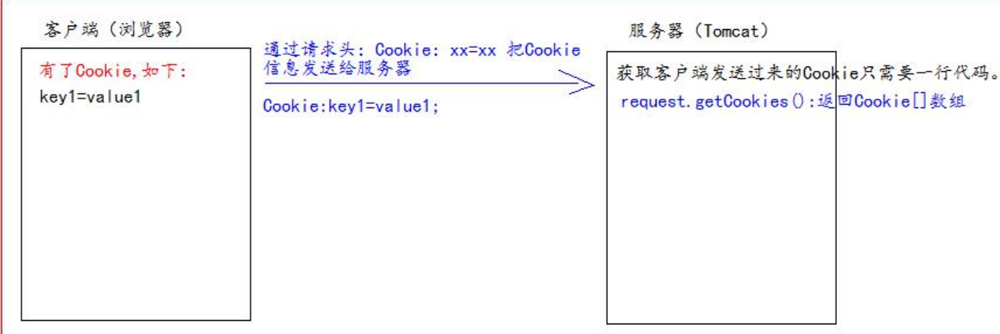
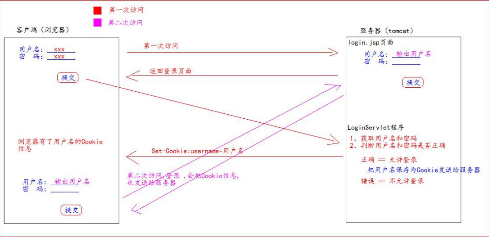
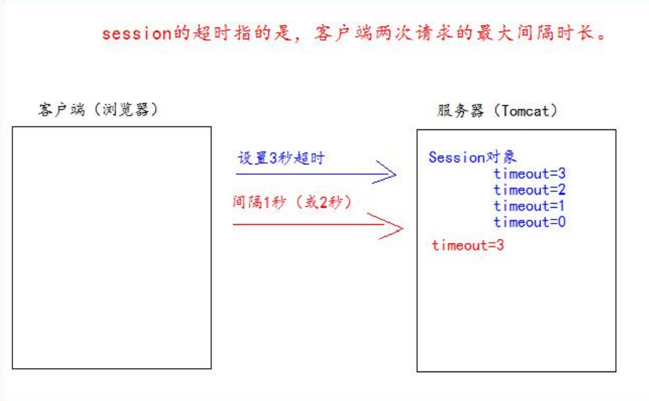
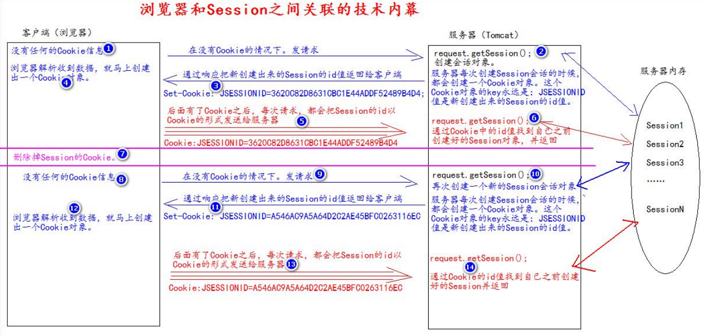
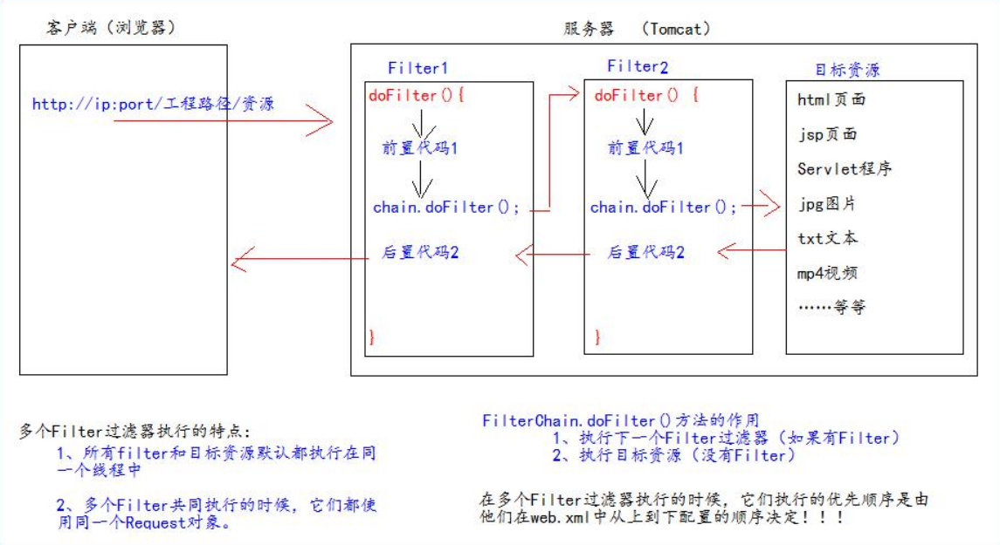
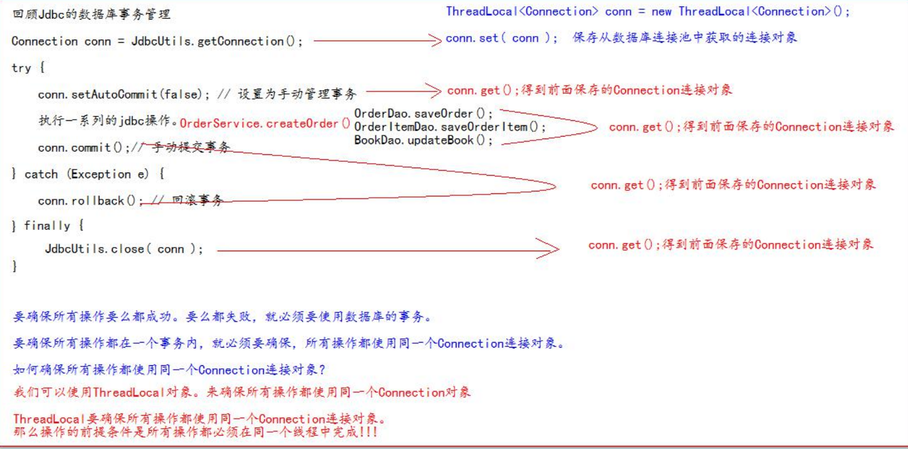
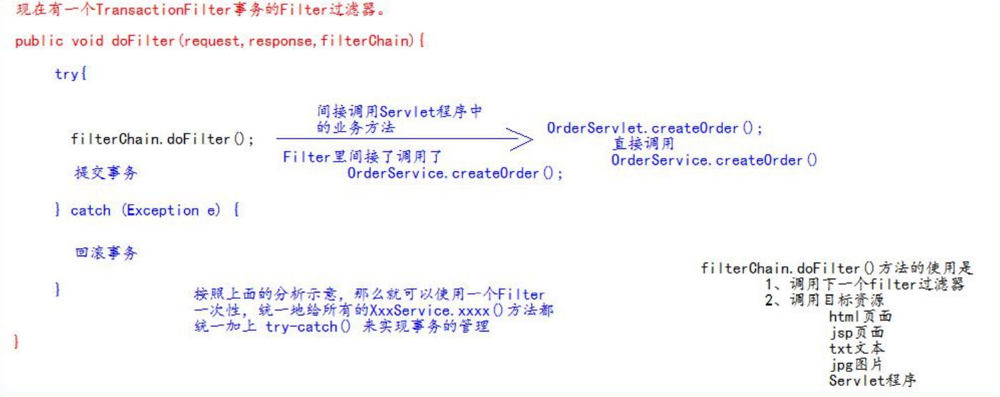
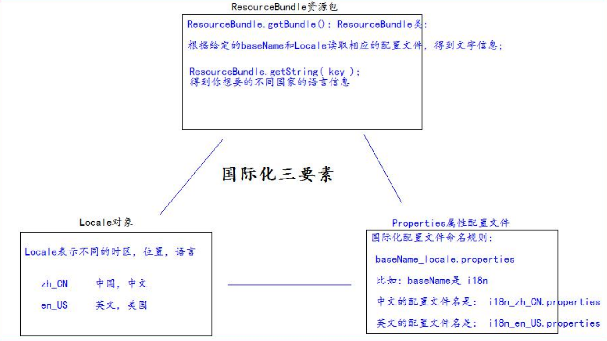

# Servlet

## 一、Servlet 介绍

1. Servlet 是 JavaEE 规范 (接口) 之一

1. Servlet 是 JavaWeb 三大组件之一，三大组件分别是 Servlet 程序、Filter 过滤器、Listener 监听器

1. Servlet 是运行在服务器上的一个 Java 程序，可以接收客户端发来的请求，并响应数据给客户端

### 手动实现 Servlet 程序

1. 编写一个类实现 Servlet 接口，并重写 service 方法处理请求、响应数据

1. 在 WEB-INF 文件夹中的 web.xml 文件中配置 Servlet 程序的访问地址


代码演示：1. 在 src 下创建一个 TestServlet 类

```java
public class TestServlet implements Servlet {
    @Override
    public void service(ServletRequest servletRequest, ServletResponse servletResponse) throws ServletException, IOException {
        System.out.println("TestServlet被访问了!");
    }
}
```

代码演示：2. 在 web.xml 中的配置

```xml
<?xml version="1.0" encoding="UTF-8"?>
<web-app xmlns="http://xmlns.jcp.org/xml/ns/javaee"
         xmlns:xsi="http://www.w3.org/2001/XMLSchema-instance"
         xsi:schemaLocation="http://xmlns.jcp.org/xml/ns/javaee http://xmlns.jcp.org/xml/ns/javaee/web-app_4_0.xsd"
         version="4.0">
    <!--内容写在<web-app></web-app>中-->
    <!--servlet标签给Tomcat配置Servlet程序-->
    <servlet>
        <!--servlet-name标签给Servlet程序起一个别名(一般是类名)-->
        <servlet-name>TestServlet</servlet-name>
        <!--servlet-class标签是Servlet程序的全类名-->
        <servlet-class>com.qizegao.servlet.TestServlet</servlet-class>
    </servlet>
    <!--servlet-mapping标签是servlet的映射，给Servlet程序配置访问地址-->
    <servlet-mapping>
        <!--此时servlet-name标签要与上一个servlet-name标签中相同-->
        <servlet-name>TestServlet</servlet-name>
        <!--url-pattern标签配置访问地址:
            /在服务器解析时表示为Tomcat的工程路径(在Edit Configurations中修改)，
            /Test代表默认路径/Test，即http://localhost:8080/MyTest/Test，
            也就是说在浏览器的地址栏中输入上述路径访问到的是TestServlet类-->
        <url-pattern>/Test</url-pattern> //任意起名，用这个名字来访问指定类
    </servlet-mapping>
</web-app>
运行结果：
点击绿色按钮开启Tomcat服务器之后，会自动打开默认的地址http://localhost:8080/MyTest，
在地址栏继续输入/Test，会执行指定类的service方法，控制台输出：TestServlet被访问了!
```

### Servlet 程序的访问原理


### Servlet 程序的常见错误

#### 1. url-pattern 中配置的路径没有以斜杠打头


#### 2. servlet-name 中的两个映射值不一致


#### 3. servlet-class 标签的全类名配置错误


### Servlet 的生命周期

Servlet 程序被访问以后按以下顺序执行：

1. 执行 Servlet 程序的构造方法

1. 执行 init 方法

1. 执行 service 方法

1. 执行 destroy 方法
   其中 1 和 2 是在初次访问并创建 Servlet 程序时会执行 (每次启动服务只执行一次)，第 3 步每次刷新 (访问) 都会执行，第 4 步点击停止时会执行一次

### GET 和 POST 请求的不同处理

代码演示：1. 在 src 目录下创建此类

```java
public class TestServlet implements Servlet {
    @Override
    public void service(ServletRequest servletRequest, ServletResponse servletResponse) 
        throws ServletException, IOException {
        //转换的原因：HttpServletRequest有getMethod方法，可以得到请求的类型
        HttpServletRequest httpServletRequest = (HttpServletRequest) servletRequest;
        
        String method = httpServletRequest.getMethod();
        
        //method值为GET或POST，取决于表单提交的method
        if (method.equals("POST")){
            System.out.println("POST方式");
        } else if (method.equals("GET")) {
            System.out.println("GET方式");
        }
    }
```

代码演示：2. 在 web 目录下创建 Test.html 页面

```html
<body>
    <form action="http://localhost:8080/MyTest/Test" method="post">
        <!--action属性值与web.xml中的<url-pattern>标签内容一致，用于访问到service方法-->
        <input type="submit">
    </form>
</body>
```

运行结果：服务器启动之后，在浏览器的地址栏中的后缀加上 Test.html，即可访问此页面，点击提交标签，即可跳转到 http://localhost:8080/MyTest/Test，执行 service 方法，控制台输出：POST 方式

### 继承 HttpServlet 类实现 Servlet 程序

在实际的项目开发中，都是使用继承 HttpServlet 类实现 Servlet 程序的方式，步骤如下：

1. 编写一个类继承 HttpServlet 类

1. 根据需求重写 doGet 或 doPost 方法，由 service 方法根据表单的 method 属性值调用二者之一

1. 到 web.xml 中配置 Servlet 程序的访问地址


代码演示：1. 在 src 目录下创建此类

```java
public class TestServlet2 extends HttpServlet {
    @Override
    protected void doGet(HttpServletRequest req, HttpServletResponse resp) throws ServletException, IOException {
        System.out.println("doGet方法执行");
    }
    @Override
    protected void doPost(HttpServletRequest req, HttpServletResponse resp) throws ServletException, IOException {
        System.out.println("doPost方法执行");
    }
}
//HttpServlet的service方法会根据method方式调用二者之一
```

代码演示：2. 在 web.xml 中继续写配置

```xml
<!--不用删除原来的servlet标签，在<web-app>标签中继续写servlet标签-->
<servlet>
    <servlet-name>TestServlet2</servlet-name>
    <servlet-class>com.qizegao.servlet.TestServlet2</servlet-class>
</servlet>
<servlet-mapping>
    <servlet-name>TestServlet2</servlet-name>
    <url-pattern>/Test2</url-pattern>
</servlet-mapping>
```

代码演示：3. 在 web 中创建 Test.html 页面

```html
<body>
    <form action="http://localhost:8080/MyTest/Test2" method="post">
        <!--action属性值与web.xml中的<url-pattern>标签内容一致，用于访问到service方法-->
        <input type="submit">
    </form>
</body>
```

运行结果：服务器启动之后，在浏览器的地址栏中的后缀加上 Test.html，即可访问此页面，点击提交标签， 即可跳转到[http://localhost:8080/MyTest/Test2，执行 service 方法，进而执行 doPost 方法](http://localhost:8080/MyTest/Test2，执行service方法，进而执行doPost方法)

### 使用 IDEA 创建 Servlet 程序


创建之后，会在包下创建此类 (类名为全类名中的类名)，此类继承于 HttpServlet 类，其中有 doGet 和 doPost 方法 (无函数体)，并自动的在 web.xml 文件中补充新的标签，但无标签，需自己补充

### Servlet 接口的继承体系


### servlet映射规则以及顺序

 <font color='orange'>1.精确路径匹配。</font>例子：比如servletA 的url-pattern为 /test，servletB的url-pattern为 /*  ，这个时候，如果我访问的url为http://localhost/test  ，这个时候容器就会先进行精确路径匹配，发现/test正好被servletA精确匹配，那么就去调用servletA，也不会去理会其他的servlet了。**
** 

  <font color='orange'>2.最长路径匹配。</font>例子：servletA的url-pattern为/test/*，而servletB的url-pattern为/test/a/*，此时访问http://localhost/test/a时，容器会选择路径最长的servlet来匹配，也就是这里的servletB。 

 <font color='orange'> 3.扩展匹配</font>，如果url最后一段包含扩展，容器将会根据扩展选择合适的servlet。例子：servletA的url-pattern：*.action 

  4.如果前面三条规则都没有找到一个servlet，容器会根据url选择对应的请求资源。如果应用定义了一个**default servlet**，则容器会将请求丢给default servlet（什么是default servlet？请见:[web.xml文件中缺省映射路径"/"问题以及客户端访问web资源的匹配规则](http://blog.csdn.net/xh16319/article/details/8014065)）。

## 二、ServletConfig 接口

从名字来看，得知此接口中是 Servlet 程序的配置信息

- Servlet 程序和 ServletConfig 对象都是由 Tomcat 负责创建，编程人员负责使用
- Servlet 程序默认是第一次访问时创建，每个 Servlet 程序创建时对应的创建 ServletConfig 对 象，二者相互对应，某个 Servlet 程序只可以获得他对应的 ServletConfig 对象，无法获得别的 Servlet 程序的 ServletConfig 对象

#### ServletConfig 接口的三大作用

- <font color='orange'>可以获取 Servlet 程序的别名</font> (即 web.xml 的的内容)
- <font color='orange'>可以获取 web.xml 的初始化参数的值</font>

- <font color='orange'>可以获取 ServletContext 对象</font>


代码演示：1. 在 web.xml 中继续写配置 (写在标签中)

```xml
<servlet>
    <servlet-name>TestServlet4</servlet-name>
    <servlet-class>com.qizegao.servlet.TestServlet4</servlet-class>
    <!--<init-param>是初始化参数，每个servlet标签中都可以有，一个servlet标签中可以有多个-->
    <init-param>
        <!--参数名-->
        <param-name>username</param-name>
        <!--参数值-->
        <param-value>root</param-value>
    </init-param>
    <init-param>
        <param-name>url</param-name>
        <param-value>jdbc:mysql:localhost:3306/test</param-value>
    </init-param>
</servlet>
<servlet-mapping>
    <servlet-name>TestServlet4</servlet-name>
    <url-pattern>/Test4</url-pattern>
</servlet-mapping>
```

代码演示：2. 在 src 目录下创建此类

```java
public class TestServlet4 extends HttpServlet {
    @Override  //使用init方法的原因：1.一定会执行 2.参数中有ServletConfig对象
    public void init(ServletConfig config) throws ServletException {
        super.init(config);
        //1.获取Servlet程序的别名
        System.out.println("此程序的别名是：" + config.getServletName());
        //2.获取初始化参数init-param，该方法获取指定的参数名的值
        System.out.println("初始化参数username的值是：" 
                           + config.getInitParameter("username"));
        System.out.println("初始化参数url的值是：" + config.getInitParameter("url"));
        //3.获取ServletContext对象
        System.out.println(config.getServletContext());
    }
    /*运行结果(浏览器地址栏输入http://localhost:8080/MyTest/Test4)：
      此程序的别名是：TestServlet4
      初始化参数username的值是：root
      初始化参数url的值是：jdbc:mysql:localhost:3306/test
      org.apache.catalina.core.ApplicationContextFacade@64d62c61 */
}
```

注意：重写 init 方法时，必须要在函数体内写：super.init(config);
原因：父类 GenericServlet 中的 init 方法将参数 config 保存起来，子类若不调用则无法保存

## 三、ServletContext 接口

1. <font color='orange'>ServletContext 接口表示 Servlet 上下文对象</font>

1. <font color='orange'>一个 web 工程只有一个 ServletContext 对象实例</font>

1. ServletContext <font color='orange'>是在 web 工程启动时创建，在 web 工程停止时销毁</font>

1. ServletContext 对象是一个域对象
   域对象：<font color='orange'>像 Map 一样存取数据的对象称为域对象，域指的是存取数据的操作范围，</font>

ServletContext 的域是整个 web 工程


1. **ServletContext 接口的四个作用**

- 获取 web.xml 中配置的<font color='orange'>上下文参数标签中的值</font>
- 获取<font color='orange'>当前工程的路径</font>，格式：/ 工程路径，也就是 Edit Configurations 中 Deployment 中的 Application context 的内容 (即地址中 8080 之后，具体的打开的页面之前的内容)

- 获取工程部署后在硬盘上的绝对路径
- 像 Map 一样存取数据


代码演示：1. 在 web.xml 中继续写配置 (在标签中)

```xml
<!--<context-param>标签中是上下文参数，属于整个web工程-->
<!--可以有多个，写在第一个<servlet>标签之外(之上)-->
<context-param>
    <param-name>username</param-name>
    <param-value>root</param-value>
</context-param>
<context-param>
    <param-name>password</param-name>
    <param-value>root</param-value>
</context-param>
<!--并写出下方的类对应的<servlet标签>-->
```

代码演示：2. 在 src 目录下创建此类

```java
public class MyContextServlet extends HttpServlet {
    //默认执行doGet方法，故只重写doGet方法
    @Override
    protected void doGet(HttpServletRequest request, HttpServletResponse response) 
        throws ServletException, IOException {
        //GenericServlet类中有public ServletConfig getServletConfig()方法，返回this.config
        ServletContext servletContext = getServletConfig().getServletContext();
        
        //1.获取web.xml中配置的上下文参数<context-param>标签中的值
        String username = servletContext.getInitParameter("username");
        System.out.println("context-param参数的username值是" + username);
        /* 运行结果：context-param参数的username值是root */
        System.out.println("context-param参数的password值是" 
                           + servletContext.getInitParameter("password"));
        /* 运行结果：context-param参数的password值是root */
        
        //2.获取当前工程的路径
        System.out.println("当前工程路径：" + servletContext.getContextPath());
        /* 运行结果：当前工程路径：/MyTest */
        
        //3.获取工程部署后在硬盘上的绝对路径
        /* /斜杠(默认路径)对应IDEA代码的web目录 */
        System.out.println("工程部署的路径是:" + servletContext.getRealPath("/"));
        /* 运行结果：E:\IDEA WorkSpace\FirstWeb\out\artifacts\FirstWeb_war_exploded\ */
        //在web目录下创建一个css文件夹
        System.out.println("工程下css目录的绝对路径是:" 
                           + servletContext.getRealPath("/css"));
        /* 运行结果：E:\IDEA WorkSpace\FirstWeb\out\artifacts\FirstWeb_war_exploded\css */
        //在web目录下创建一个img文件夹，里面放1.gif文件
        System.out.println("工程下img目录1.gif的绝对路径是:" 
                           + servletContext.getRealPath("/img/1.gif"));
        /* 输出：E:\IDEA WorkSpace\FirstWeb\out\artifacts\FirstWeb_war_exploded\img\1.gif*/
    }
}
//记得要在浏览器的地址栏输入http://localhost:8080/MyTest/MyContextServlet才可访问到此类
```

代码演示：3. 在 src 中创建此类，并在 web.xml 中写对应的配置信息

```java
public class Servlet extends HttpServlet {
    @Override
    protected void doGet(HttpServletRequest request, HttpServletResponse response) 
        throws ServletException, IOException {
        //GenericServlet类中有public ServletContext getServletContext()方法，
        //return this.getServletConfig().getServletContext();
        ServletContext servletContext = getServletContext();
        System.out.println(servletContext);
        /* 输出：org.apache.catalina.core.ApplicationContextFacade@2711c490 */
        servletContext.setAttribute("key1","value1");
        System.out.println(servletContext.getAttribute("key1"));
        /* 输出：value1 */
    }
}
```

注意：一个 web 工程只会创建一个 ServletContext 对象实例，换其他类输出 servletContext 得到的结果与上述相同，且一旦给此对象赋值，即使换另一个类 getAttribute(key1)，得到的结果也是 value1

## 四、HTTP 协议

**含义**

所谓协议指的是双方或多方相互约定好，都要遵守的规则，而 HTTP 协议指的是客户端和 服务器之间通信时发送的数据需要遵守的规则，HTTP 协议中的数据又称为报文

### 请求的 HTTP 协议格式

请求分为 GET 请求和 POST 请求两种：

(1) <font color='orange'>GET 请求</font>：由<font color='orange'>请求行、请求头两部分组成</font>，如下图所示：


内容分析：
请求行：
①请求的方式：GET
②请求的资源路径：/06_servlet/a.html
③请求的协议的版本号：HTTP/1.1


请求头：
①Accept：告诉服务器，客户端可以接收的数据类型
②Accept-Language：告诉服务器，客户端可以接收的语言类型：
zh_CN：中文中国
en_US：英文美国
③User-Agent：代表客户端浏览器的信息
④Accept-Encoding：告诉服务器，客户端可以接收的数据编码 (压缩) 格式
⑤Host：表示请求时的服务器 ip 和端口号
⑥Connection：告诉服务器，当前连接如何处理：
Keep-Alive：回传完数据不要马上关闭，保持一小段时间的连接
Closed：回传完数据马上关闭


(2) <font color='orange'>POST</font> 请求：由<font color='orange'>请求行、请求头、空行、请求体</font>组成，如下图所示：


内容分析 (仅分析与 GET 请求的不同之处)：
请求头：
①Referer：表示请求发起时，浏览器地址栏中的地址
②Content-Type：表示发送的数据的类型：
i. <font color='orange'>application/x-www-form-ur lencoded：</font>表示<font color='red'>提交的数据的格式是 name=value&name=value，然后对其进行 url 编码，url 编码是把非英文内容转换为：%xx%xx</font>
ii. <font color='orange'>multipart/form-data</font>：表示以多段的形式提交数据给服务器，<font color='orange'>即以流的形式提交，用于上传</font>
③Content-Length：表示发送的数据的长度
④Cache-Control：表示如何控制缓存，no-cache 不缓存


> 补充：
>
> 1. XMLHttpRequest规范不支持get、delete携带请求体，HTTP规范没说不能用。
> 2. put、delete 所有现代浏览器都支持
> 3. *form表单*只*支持*get和post的方式提交
>
> 

### 响应的 HTTP 协议格式


### 常见的响应码

200 表示请求成功
302 表示请求重定向
404 表示服务器收到请求，但是请求的数据不存在（请求地址错误）
500 表示服务器收到请求，但是服务器内部错误（代码错误）


### MIME 类型说明

MIME 是 HTTP 协议中的数据类型，格式是：大类型 / 小类型，并与某一种文件的扩展名相对应：


### 谷歌浏览器查看 HTTP 协议

首先点击 F12：


1. ~~到目前为止除了 form 标签中 method=post 之外，其余均为 GET 请求~~

1. ~~标签不一定与标签相邻，只要根据能对应上即可~~

1. ~~默认地址值与工程路径是两个概念，上述只是将默认地址值修改为工程路径，即上述斜杠 等代表访问到的是工程路径：[http://localhost:8080 / 工程名，而非默认路径~](http://localhost:8080/工程名，而非默认路径)~~

## 五、HttpServletRequest 类

1. HttpServletRequest 类的作用
   每次只要有请求进入 Tomcat 服务器，Tomcat 服务器就会把请求发来的 HTTP 协议信息解析好封装到 Request 对象中，然后传递到 service 方法中 (调用 doGet 或 doPost 方法) 供编程人员使用，<font color='orange'>编程人员通过 HttpServletRequest 对象，可以获取到请求的所有信息</font>

1. HttpServletRequest 类的常用方法
   `**getRequestURI()**`：获取请求的资源路径
   `**getRequestURL()**`：获取请求的绝对路径 
   `**getRemoteHost()**`：获取客户端的 ip 地址
   `**getHeader()**`：获取请求头
   `**getParameter()**`：获取请求的参数
   `**getParameterValues()**`：获取请求的参数 (多个值时使用)
   `**getMethod()**`：获取请求的方式 (GET 或 POST)
   `**setAttribute(key, value)**`：设置域数据
   `**getAttribute(key)**`：获取域数据
   `**getRequestDispatcher()**`：获取请求转发对象


代码示例 (在 src 下创建此类)：

```java
public class RequestAPI extends HttpServlet {
    @Override
    protected void doGet(HttpServletRequest request, HttpServletResponse response) throws ServletException, IOException {
        //1.获取请求的资源路径
        String requestURI = request.getRequestURI();
        
        //2.获取请求的绝对路径
        StringBuffer requestURL = request.getRequestURL();
        
        //3.获取客户端的ip地址
        String requestRemoteHost = request.getRemoteHost();
        
        //4.获取请求头
        String requestHeader = request.getHeader("User-Agent");
        
        //5.获取请求的方式
        String requestMethod = request.getMethod();
        
        //输出
        System.out.println(requestURI); /* /MyTest/RequestAPI */
        System.out.println(requestURL); /* http://localhost:8080/MyTest/RequestAPI */
        System.out.println(requestHeader); //Mozilla/5.0 (Windows NT 10.0; Win64; x64)...
        System.out.println(requestMethod); //GET
        System.out.println(requestRemoteHost); //127.0.0.1
        /*在IDEA中，使用localhost访问时得到的客户端ip地址是127.0.0.1
                   使用真实ip访问时，得到的客户端地址是真实的客户端ip地址 */
    }
}
```


1. 获取请求参数
   代码示例：1. 在 web 目录下创建 form.html 页面 (不可在 WEB-INF 中创建，无法访问到)：


```html
<!DOCTYPE html>
<html lang="en">
<head>
    <meta charset="UTF-8">
    <title>form</title>
</head>
<body>
    <form action="http://localhost:8080/MyTest/RequestAPI2" method="post">
        用户名：<input type="text" name="username"><br/>
        密码：<input type="password" name="password"><br/>
        兴趣爱好：<input type="checkbox" name="hobby" value="cpp">C++
                 <input type="checkbox" name="hobby" value="Java">Java
                 <input type="checkbox" name="hobby" value="JS">JavaScript<br/>
                 <input type="submit">
    </form>
</body>
</html>
```


代码示例：2. 在 src 下创建此类


```java
public class RequestAPI2 extends HttpServlet {
    @Override
    protected void doPost(HttpServletRequest request, HttpServletResponse response) throws ServletException, IOException {
        //doPost方法会出现中文请求乱码问题
        //需要在获取任何参数之前修改字符编码集，而不仅仅获取中文参数时才修改：
        request.setCharacterEncoding("UTF-8");
        //获取请求的参数(此方法参数中放name属性值，得到value属性值)
        String username = request.getParameter("username");
        String password = request.getParameter("password");
        //获取请求的参数的多个值
        String[] hobbies = request.getParameterValues("hobby");
        //输出
        System.out.println("用户名：" + username);
        System.out.println("密码：" + password);
        //将数组转换为集合输出
        System.out.println("兴趣爱好：" + Arrays.asList(hobbies));
    }
}
```


运行结果：
(在 web.xml 文件中创建对应的配置，在浏览器的地址栏输 http://localhost:8080/MyTest/form.html )


注意：doGet 请求的中文乱码问题的解决：


### 请求转发

请求转发指的是服务器收到请求之后，从一个资源跳转到另一个资源的操作，如图所示：


代码示例：1. 在 src 下创建此类，并在 web.xml 中配置相应的数据


```java
public class Servlet1 extends HttpServlet {
    @Override
    protected void doGet(HttpServletRequest request, HttpServletResponse response) throws ServletException, IOException {
        //获取请求的参数(查看办事的材料)
        String username = request.getParameter("username");
        System.out.println("在Servlet1(柜台1)中查看参数(材料):" + username);
        
        //给材料盖章
        request.setAttribute("key1","柜台1的章");
        
        //获得通向Servlet2的路径(请求转发对象)
        //参数必须以斜杠打头，斜杠代表http://localhost:8080/工程名/，对应IDEA代码的web目录
        RequestDispatcher requestDispatcher = request.getRequestDispatcher("/Servlet2");
        
        //可以转发到WEB-INF目录下：request.getRequestDispatcher("/WEB-INF/xxx");
        //通过得到的路径走向Servlet2(柜台2)
        //forward方法将当前资源的request和response转发到该requestDispatcher指定的资源
        requestDispatcher.forward(request, response);
        
        //使得Servlet2中的request和response与Servlet1一致
    }
}
```


代码示例：2. 在 src 下创建此类，并在 web.xml 中配置相应的数据


```java
public class Servlet2 extends HttpServlet {
    @Override
    protected void doGet(HttpServletRequest request, HttpServletResponse response) throws ServletException, IOException {
        //获取请求的参数(查看办事的材料)
        String username = request.getParameter("username");
        System.out.println("在Servlet2(柜台2)中查看参数(材料):" + username);
        //查看是否有柜台1的章
        Object key1 = request.getAttribute("key1");
        System.out.println("柜台1的章为：" + key1);
        //出处理自己的业务
        System.out.println("Servlet2处理业务");
    }
}
```


运行结果：
(在浏览器的地址栏中输入：http://localhost:8080/MyTest/Servlet1?username=jaychou)


<font color='orange'>可以得出地址栏的内容不发生变化，但页面自动跳转 (访问)</font>
到了请求转发对象 Servlet2 中，即显示
[http://localhost:8080/MyTest/Servlet2 的页面](http://localhost:8080/MyTest/Servlet2的页面)

### base 标签的作用

代码示例：1. 在 web 目录下创建 a 文件夹下创建 b 文件夹下创建 c.html

```html
<head>
    <meta charset="UTF-8">
    <title>Title</title>
</head>
<body>
    这是a下的b下的c.html<br/>
    <a href="../../index.html">跳到web下的index.html</a>
</body>
```


代码示例：2. 在 web 目录下创建 index.html

```html
<head>							
    <meta charset="UTF-8">
    <title>Title</title>
</head>
<body>
    这是web下的index.html页面<br/>
    <a href="a/b/c.html">跳转到a下的b下的c.html</a>
</body>
```

运行结果：两个页面可以来回跳转


分析：当在 c.html 页面准备点击进行跳转时浏览器的地址栏是http://localhost:63342/FirstWeb/MyTest/web/a/b/c.html，
跳转到 index.html 页面时的 a 标签路径是…/…/index.html，<font color='orange'>所有相对路径在跳转时都会参照当前浏览器地址栏中的地址来进行跳转</font>，此时跳转的路径是[http://localhost:63342/FirstWeb/MyTest/web/a/b/c.html…/…/index.html，进行抵消之后，剩余的路径是 http://localhost:63342/FirstWeb/MyTest/web/index.html，路径正确，跳转成功。](http://localhost:63342/FirstWeb/MyTest/web/a/b/c.html…/…/index.html，进行抵消之后，剩余的路径是http://localhost:63342/FirstWeb/MyTest/web/index.html，路径正确，跳转成功。)


代码示例：1. 在 web 目录下创建 a 文件夹下创建 b 文件夹下创建 c.html

```html
<head>
    <meta charset="UTF-8">
    <title>Title</title>
</head>
<body>
    这是a下的b下的c.html<br/>
    <a href="../../index.html">跳到web下的index.html</a>
</body>
```


代码示例：2. 在 src 下创建此类，并在 web.xml 中配置

```java
public class Forward extends HttpServlet {
    @Override
    protected void doGet(HttpServletRequest request, HttpServletResponse response) throws ServletException, IOException {
        request.getRequestDispatcher("a/b/c.html").forward(request,response);
    }
}
```

代码示例：3. 在 web 目录下创建 index.html

```html
<head>
    <meta charset="UTF-8">
    <title>Title</title>
</head>
<body>
    这是web下的index.html页面<br/>
    <a href= http://localhost:8080/MyTest/Forward>请求转发：a/b/c.html</a>
</body>
```


分析：在地址栏输入http://localhost:63342/FirstWeb/MyTest/web/index.html，点击后成功跳转到 http://localhost:8080/MyTest/Forward，此时的页面是：


点击之后无法跳转，根据以上原因，要跳转的地址是[http://localhost:8080/MyTest/Forward…/…/index.html，抵消之后为 http://localhost:8080/…/index.html，这是错误的路径，因此跳转失败。解决方案如下：](http://localhost:8080/MyTest/Forward…/…/index.html，抵消之后为http://localhost:8080/…/index.html，这是错误的路径，因此跳转失败。解决方案如下：)


base 标签可以设置当前页面中所有相对路径跳转时参照指定的路径来进行跳转，在 href 属性中设置指定路径


代码示例：4. 将上述 c.html 文件修改为如下即可成功跳转

```html
<head>
    <meta charset="UTF-8">
    <title>Title</title>
    <!--base标签写在<title>标签之后-->
    <base href="http://localhost:8080/MyTest/a/b/">
</head>
<body>
    这是a下的b下的c.html<br/>
    <a href="../../index.html">跳到web下的index.html</a>
</body>
```

注：实际开发中都使用绝对路径，而不简单的使用相对路径

## 六、HttpServletResponse 类

1. HttpServletResponse 类的作用
   每次只要有请求进入 Tomcat 服务器，Tomcat 服务器就会创建一个 Response 对象传递给 Servlet 程序。HttpServletResponse 表示所有响应的信息 (HttpServletRequest 表示请求发来的信息)，可以通过 HttpServletResponse 对象设置返回给客户端的信息

1. 两个输出流的说明
   字节流 getOutputStream(); <font color='orange'>常用于下载 (传递) 二进制数据</font>
   字符流 getWriter(); <font color='orange'>常用于回传字符串</font>
   注：<font color='orange'>同一个 HttpServletResponse 对象两个流不可同时使用，只可二选一</font>，否则报错：
   

1. 从服务器往客户端 (浏览器) 回传字符串数据


代码示例：在 src 下创建此类并在 web.xml 中进行配置

```java
public class ResponseIO extends HttpServlet {
    @Override
    protected void doGet(HttpServletRequest request, HttpServletResponse response) throws ServletException, IOException {
        //防止中文乱码问题，在获取流对象之前调用此方法：
        //同时设置服务器和客户端都使用UTF-8字符集
        response.setContentType("text/html; charset=UTF-8");
        //获取流对象
        PrintWriter writer = response.getWriter();
        writer.write("I Love China！");
    }
}
```

运行结果：


### 请求重定向

请求重定向指的是客户端给服务器发送请求，然后服务器通知客户端去访问自己的新地址 (之前的地址可能被废弃) 叫请求重定向


代码示例：1. 在 src 下创建此类并在 web.xml 中进行配置

```java
public class Response1 extends HttpServlet {

    @Override
    protected void doGet(HttpServletRequest req, HttpServletResponse resp) 
        throws ServletException, IOException {
        System.out.println("曾到此一游 Response1 ");


        // 设置响应状态码302 ，表示重定向，（已搬迁）
		// resp.setStatus(302);

        // 设置响应头，说明 新的地址在哪里
        // resp.setHeader("Location", "http://localhost:8080/07_servlet/response2");
        // resp.setHeader("Location", "http://localhost:8080/07_servlet/WEB-INF/form.html");    // 不可以
		// resp.setHeader("Location", "http://www.baidu.com");

        resp.sendRedirect("http://localhost:8080/07_servlet/response2");
    }
}
```

代码示例：2. 在 src 下创建此类并在 web.xml 中进行配置

```java
public class Response2 extends HttpServlet {
    @Override
    protected void doGet(HttpServletRequest request, HttpServletResponse response) throws ServletException, IOException {
        response.getWriter().write("Response2's result!");
    }
}
```

运行结果：在地址栏输入http://localhost:8080/MyTest/Response1，得到：


并在控制台输出：会访问到 Response1

注：


1. 在 Response1 中使用以下代码替代两个步骤可得到<font color='orange'>同样的效果</font> (<font color='orange'>推荐使用此方法</font>)：
   response.sendRedirect(“http://localhost:8080/MyTest/Response2”);

1. 在 Response1 中 request.setAttribute(“key1”, “value1”);
   在 Response2 中 req.getAttribute(“key1”); <font color='orange'>无法得到 key1 的值</font>，结果为 null

### 相对路径 绝对路径

**相对路径**

不以 / 开头的路径就是相对路径

访问：http://localhost:80/bookstore/upload/upload.jsp

超链接<a href="index.jsp"></a>

要去的是：http://localhost:80/bookstore/upload/index.jsp

**不要使用相对路径**

**绝对路径**

以 / 开头的路径

访问：http://localhost:80/bookstore/upload/upload.jsp

超链接<a href="/index.jsp"></a>

要去的是：http://localhost:80/index.jsp

**推荐使用绝对路径**


#### / 在不同情况下的不同意义

- “/” 若被浏览器解析，得到的地址是：http://ip:port/
- “/” 若被服务器解析，得到的地址是：http://ip:port / 工程路径

- - web.xml 中 /servlet1
  - servletContext.getRealPath("/");

- - request.getRequestDispatcher("/");

- 特殊情况：response.sendRedirect("/"); 把斜杠发送到浏览器解析，得到 http://ip:port/

### 乱码问题

解决get请求乱码问题，Tomcat—conf—server.xml

```java
    <Connector port="8080" protocol="HTTP/1.1"
               connectionTimeout="20000"
               URIEncoding="UTF-8"
               redirectPort="8443" />
```

解决post请求乱码问题，需要在request.getParameter() 之前设置，因为请求到达后不调用前方法，tomcat并不急着解析请求内容

```java
request.getCharacterEncoding("UTF-8");
```

解决响应乱码问题

```java
response.setContentType("text/html; charset=UTF-8");
```

[
](https://blog.csdn.net/weixin_49343190/article/details/107878144)


# 文件的上传和下载

## 一、文件的上传介绍

1. 要有一个form标签，method = post请求方式，原因：文件的长度一般都会超过get请求的限制
2. form标签的<font color='orange'>encType</font>属性值必须为<font color='orange'>multipart/form-data</font>

1. 在form标签中使用input标签，type = file添加上传的文件
2. 在form标签中使用input标签，type = submit提交到服务器

1. 编写Servlet程序接收、处理上传的文件

注意：encType = multipart/form-data表示提交的数据以多段(每一个表单项表示一个数据段)的形式 进行拼接，然后以二进制流的形式发送给服务器

### 在web目录下创建Upload.jsp

```html
<%@ page contentType="text/html;charset=UTF-8" language="java" %>
<html>
<head>
    <title>upload</title>
</head>
<body>

<form action="http://localhost:8080/09_el_jstl/upload" method="post" enctype="multipart/form-data">
    <table>
        <tr>
            <td>用户名：</td>
            <td><input type="text" name="username"/></td>
        </tr>
        <tr>
            <td>头&nbsp;&nbsp;&nbsp;像：</td>
            <td><input type="file" name="photo"/></td>

        </tr>
        <tr>
            <td><input type="submit" value="上传"/></td>
        </tr>
    </table>
</form>

</body>
</html>
```


注意：谷歌浏览器中上传的文件的数据显示的是空行，但服务器可以接收到数据

### 创建Servlet程序upLoadServlet.java

首先导入两个jar包 (fileupload包依赖io包)


#### 两个jar包中常用的类 (导入的jar包是commons的)

ServletFileUpload类，用于解析上传的数据

```
**public static final boolean isMultipartContent(HttpServletRequest request)**
```

如果上传的数据是多段的形式，返回true，只有多段的数据才是文件上传的

```
**public ServletFileUpload()**
```

空参构造器

```java
**public ServletFileUpload(FileItemFactory fileItemFactory)**
```

参数为工厂实现类的构造器

```java
**public List parseRequest(HttpServletRequest request)**
```

解析上传的数据，返回包含每一个表单项的List集合

FileItem类，表示每一个表单项

```java
**public boolean isFormField()**
```

如果当前表单项是<font color='orange'>普通表单项，返回true，文件类型返回false</font>

```java
**public String getFieldName()**
```

获取当前表单项的name属性值

```java
**public String getString()**
```

获取当前表单项的value属性值，<font color='orange'>参数为”UTF-8”可解决乱码问题</font>

```java
**public String getName()**
```

获取上传的文件名

```
**public void write(File file)**
```

将上传的文件<font color='orange'>写到参数File所指向的硬盘位置</font>

```java
import org.apache.commons.fileupload.FileItem;
import org.apache.commons.fileupload.FileItemFactory;
import org.apache.commons.fileupload.disk.DiskFileItemFactory;
import org.apache.commons.fileupload.servlet.ServletFileUpload;

import javax.servlet.*;
import javax.servlet.http.*;
import java.io.File;
import java.io.IOException;
import java.util.List;

public class UplaodServlet extends HttpServlet {

    /**
     * 用来处理上传的数据
     */
    @Override
    protected void doPost(HttpServletRequest request, HttpServletResponse response) 
        throws ServletException, IOException {
        //1 先判断上传的数据是否多段数据（只有是多段的数据，才是文件上传的）
        if (ServletFileUpload.isMultipartContent(request)) {

            // 创建FileItemFactory工厂实现类
            FileItemFactory fileItemFactory = new DiskFileItemFactory();
            // 创建用于解析上传数据的工具类ServletFileUpload类
            ServletFileUpload servletFileUpload = new ServletFileUpload(fileItemFactory);
            try {
                // 解析上传的数据，得到每一个表单项FileItem
                List<FileItem> list = servletFileUpload.parseRequest(request);

                // 循环判断，每一个表单项，是普通类型，还是上传的文件
                for (FileItem fileItem : list) {
                    if (fileItem.isFormField()) {
                        // 普通表单项
                        System.out.println("表单项的name属性值：" + 		
                                           fileItem.getFieldName());
                        // 参数UTF-8.解决乱码问题
                        System.out.println("表单项的value属性值：" + 
                                           fileItem.getString("UTF-8"));

                    } else {
                        // 上传的文件
                        System.out.println("表单项的name属性值：" + 
                                           fileItem.getFieldName());
                        System.out.println("上传的文件名：" + fileItem.getName());
                        fileItem.write(new File("G:\\" + fileItem.getName()));
                    }
                }
            } catch (Exception e) {
                e.printStackTrace();
            }
        }
    }
}
```

在web.xml中编写servlet标签

```java
<servlet>
        <servlet-name>UploadServlet</servlet-name>
        <servlet-class>com.atguigu.servlet.UplaodServlet</servlet-class>
</servlet>
<servlet-mapping>
        <servlet-name>UploadServlet</servlet-name>
        <url-pattern>/upload</url-pattern>
</servlet-mapping>
```

## 二、文件下载的过程


- 获取要下载的<font color='orange'>文件名</font>
- 获取要下载的<font color='orange'>文件类型</font>

- <font color='orange'>将获取的文件类型告诉客户端</font>
- <font color='orange'>告诉客户端收到的数据用于下载使用</font>

- <font color='orange'>获取要下载的文件并回传给客户端</font>

### 文件下载过程详解

1. 获取要下载的文件名：<font color='orange'>使用String定义要下载的文件名</font>	
2. 获取要下载的文件类型：

通过<font color='orange'>ServletContext</font>的<font color='green'>getMimeType()</font>参数是要下载的文件所在路径，返回值是<font color='orange'>String类型</font>

1. 将获取的文件类型告诉客户端：

通过response的<font color='orange'>setContentType()</font>参数是第二步的结果，无返回值

1. 告诉客户端收到的数据用于下载使用(<font color='red'>没有此步则内容直接显示在页面上</font>)：

通过<font color='orange'>response.setHeader()</font>

参数是<font color='orange'>"Content-Disposition", “attachment; fileName=xxx.xxx"</font>

注意：

Content-Disposition	响应头表示客户端收到的数据如何处理

<font color='orange'>attachment</font>			表示附件，用于下载

<font color='orange'>filename</font>				表示下载的文件名，<font color='orange'>可以与原文件名不同</font>

1. 获取要下载的文件并回传给客户端：

回传给客户端通过导入的io包的IOUtils.`**copy(InputStream input, OutputStream output)**`

通过ServletContext的`**getResourceAsStream()**`参数是要下载的文件路径，得到输入流

通过response.`**getOutputStream()**`得到响应的输出流

### 中文名下载文件的乱码问题

**原因**

response.setHeader(“Content-Disposition”, “attachment; fileName=中文名.jpg”);

如果下载的文件是中文名，会发现下载的文件无法正常显示汉字，原因是响应头中不能有汉字

**解决**

1. 当浏览器是<font color='orange'>IE浏览器或谷歌浏览器</font>：

需要使用<font color='orange'>URLEncoder类</font>先对中文名进行UTF-8编码，因为IE浏览器和谷歌浏览器收到含有 编码的字符串后会以UTF-8字符集进行解码显示

1. 当浏览器是火狐浏览器：<font color='orange'>使用BASE64编解码</font>

BASE64编解码

```java
import sun.misc.BASE64Decoder;
import sun.misc.BASE64Encoder;

public class Base64Test {
    public static void main(String[] args) throws Exception {
        String content = "这是需要Base64编码的内容";

        // 创建一个Base64编码器
        BASE64Encoder base64Encoder = new BASE64Encoder();

        // 执行Base64编码操作
        String encodedString = base64Encoder.encode(content.getBytes("UTF-8"));
        System.out.println( encodedString );


        // 创建Base64解码器
        BASE64Decoder base64Decoder = new BASE64Decoder();

        // 解码操作
        byte[] bytes = base64Decoder.decodeBuffer(encodedString);
        String str = new String(bytes, "UTF-8");
        System.out.println(str);
    }
}
```

火狐浏览器下载文件乱码问题的解决

需要对中文名进行BASE64编码操作：

这时候需要把请求头 Content-Disposition: attachment; filename=中文名

编码成为 Content-Disposition: attachment; filename==?charset?B?xxxx?=

对 =?charset?B?xxxxx?= 的说明：

- =?		表示编码内容的开始
- charset	表示字符集(UTF-8、GBK等)
- B		表示BASE64编码
- xxxx		表示BASE64编码后的内容
- ?=		表示编码内容的结束

```java
import org.apache.commons.io.IOUtils;
import sun.misc.BASE64Encoder;

import javax.servlet.*;
import javax.servlet.http.*;
import java.io.IOException;
import java.io.InputStream;
import java.net.URLEncoder;

public class DownloadServlet extends HttpServlet {

    @Override
    protected void doGet(HttpServletRequest request, HttpServletResponse response) 
        throws ServletException, IOException {
        // 1、获取要下载的文件名
        String downloadFile = "1.jpg";

        // 2、通过ServletContext对象读取要下载的文件内容
        ServletContext servletContext = getServletContext();

        // 获取要下载的文件类型
        String mimeType = servletContext.getMimeType("/file/" + downloadFile);
        System.out.println("下载的文件类型" + mimeType);

        // 3、在回传前，通过响应头告诉客户端返回的数据类型
        response.setContentType(mimeType);
		//结果是image/jpeg
        // 4、还要告诉客户端收到的数据是用于下载使用（还是使用响应头）
        // Content-Disposition响应头，表示收到的数据怎么处理
        // attachment表示附件，表示下载使用
        // filename= 表示指定下载的文件名
        // url编码是把汉字转换成为%xx%xx的格式
        if (request.getParameter("User-Agent").contains("Firefox")) {
            // 如果是火狐浏览器,使用BASE64编码
            // =?charset?B?xxxxx?=
            // =?   表示编码内容的开始
            // charset  表示字符集
            // B        表示BASE64编码
            // xxxx     表示文件名BASE64编码后的内容
            // ?=   表示编码内容的结束
            //新的浏览器已经支持urlb
            response.setHeader("Content-Disposition", "attachment; filename==?UTF-8?B?"
                    + new BASE64Encoder().encode("美女.jpg".getBytes("UTF-8")) + "?=");
        } else {
            // 如果不是火狐，是IE或谷歌，使用URL编码操作
            response.setHeader("Content-Disposition", "attachment; filename="
                    + URLEncoder.encode("美女.jpg", "UTF-8"));
        }

        // 5、把下载的文件内容回传给客户端
        // 读取输入流中全部的数据，复制给输出流，输出给客户端
        InputStream resourceAsStream = servletContext.getResourceAsStream("/file/" 
                                       + downloadFile);
        ServletOutputStream outputStream = response.getOutputStream();
        IOUtils.copy(resourceAsStream, outputStream);
    }
}
```


# 上传

```html
<!DOCTYPE html>
<html lang="en" xmlns:th="http://www.thymeleaf.org">
<head>
    <meta charset="UTF-8">
    <title>Title</title>
</head>
<body>
<form th:action="@{/sss}" method="post" enctype="multipart/form-data">
    用户名：<input type="text" name="username"><br>
    密码：<input type="password" name="password"><br>
    性别：<input type="radio" name="sex" value="男">男<input type="radio" name="sex" value="女">女<br>
    年龄：<input type="text" name="age"><br>
    邮箱：<input type="text" name="email"><br>
    上传图片：<input type="file" name="img"><br>
    <input type="submit">
</form>
</body>
</html>
```

```java
package com.example.mvc;

import org.apache.commons.fileupload.FileItem;
import org.apache.commons.fileupload.FileItemFactory;
import org.apache.commons.fileupload.disk.DiskFileItemFactory;
import org.apache.commons.fileupload.servlet.ServletFileUpload;
import sun.plugin.util.UIUtil;

import javax.servlet.ServletContext;
import javax.servlet.ServletException;
import javax.servlet.annotation.WebServlet;
import javax.servlet.http.HttpServlet;
import javax.servlet.http.HttpServletRequest;
import javax.servlet.http.HttpServletResponse;
import java.io.File;
import java.io.IOException;
import java.util.List;
import java.util.UUID;

@WebServlet(name = "Servlet1")
public class Servlet1 extends HttpServlet {

    @Override
    protected void doPost(HttpServletRequest req, HttpServletResponse resp) throws ServletException, IOException {
        if(ServletFileUpload.isMultipartContent(req)){
            FileItemFactory fileItemFactory=new DiskFileItemFactory();
            ServletFileUpload servletFileUpload=new ServletFileUpload(fileItemFactory);
            try {
                List<FileItem> fileItems = servletFileUpload.parseRequest(req);
                for (FileItem fileItem : fileItems) {
                    if (fileItem.isFormField()){
                        System.out.println(fileItem.getFieldName());
                    }else {
                        fileItem.write(new File("F:\\data\\knowledge_data\\知识\\md\\"+ UUID.randomUUID()+fileItem.getName()));
                    }
                }
            } catch (Exception e) {
                e.printStackTrace();
            }

        }
    }
}

```


# Cookie&Session

## 1、Cookie 

> api 在 javaEE 规范中，是java的扩展（javax）https://blog.csdn.net/Neuf_Soleil/article/details/80962686

## a）什么是Cookie？

1. Cookie翻译过来是饼干的意思
2. Cookie是服务器通知客户端保存键值对的一种技术
3. 客户端有了Cookie后，每次请求都发送给服务器
   1. 每个Cookie的大小不能超过4kb
   2. Cookie是服务器通知客户端保存键值对的一种技术
   3. 客户端有了Cookie后，每次请求都发送给服务器
   4. 每个Cookie的大小不能超过4kb

## b）如何创建Cookie


```java
protected void createCookie(HttpServletRequest req, HttpServletResponse resp) throws ServletException,
IOException {
//1 创建 Cookie 对象
Cookie cookie = new Cookie("key4", "value4");
//2 通知客户端保存 Cookie
resp.addCookie(cookie);
//1 创建 Cookie 对象
Cookie cookie1 = new Cookie("key5", "value5");
//2 通知客户端保存 Cookie
resp.addCookie(cookie1);
resp.getWriter().write("Cookie 创建成功");
}
```


## c)服务器如何获取 Cookie

服务器获取客户端的 Cookie 只需要一行代码：req.getCookies():Cookie[]



Cookie 的工具类：


```java
public class CookieUtils {
/**
* 查找指定名称的 Cookie 对象
* @param name
* @param cookies
* @return
*/
public static Cookie findCookie(String name , Cookie[] cookies){
if (name == null || cookies == null || cookies.length == 0) {
return null;
}
for (Cookie cookie : cookies) {
if (name.equals(cookie.getName())) {
return cookie;
}
}
return null;
}
}
```

Servlet 程序中的代码

```java
protected void getCookie(HttpServletRequest req, HttpServletResponse resp) throws ServletException,
IOException {
Cookie[] cookies = req.getCookies();
for (Cookie cookie : cookies) {
// getName 方法返回 Cookie 的 key（名）
// getValue 方法返回 Cookie 的 value 值
resp.getWriter().write("Cookie[" + cookie.getName() + "=" + cookie.getValue() + "] <br/>");
}
Cookie iWantCookie = CookieUtils.findCookie("key1", cookies);
// for (Cookie cookie : cookies) {
// if ("key2".equals(cookie.getName())) {
// iWantCookie = cookie;
// break;
// }
// }
// 如果不等于 null，说明赋过值，也就是找到了需要的 Cookie
if (iWantCookie != null) {
resp.getWriter().write("找到了需要的 Cookie");
}
}
```

## d)Cookie 值的修改

方案一：

1. 先创建一个要修改的同名（指的就是key）的Cookie对象
2. 在构造器，同时赋予新的Cookie值。
3. 调用response.addCookie(Cookie);

```java
// 方案一：
// 1、先创建一个要修改的同名的 Cookie 对象
// 2、在构造器，同时赋于新的 Cookie 值。
Cookie cookie = new Cookie("key1","newValue1");
// 3、调用 response.addCookie( Cookie ); 通知 客户端 保存修改
resp.addCookie(cookie);
```

 方案二：

1. 先查找到需要修改的Cookie对象

2. 对用setValue()方法赋予新的Cookie值

3. 调用response.addCookie()通知客户端保存修改

   ```java
   Cookie cookie = CookieUtils.findCookie("key2",req.getookies());
   if(cookie!=null){
       Cookie.setValue("newValue2")
           resp.addCookie(cookie);
   }
   ```

   ## e)Cookie生命控制

   Cookie的生命控制指的是如何管理Cookie什么时候被销毁（删除）

   setMaxAge()

   正数，表示在指定的秒数后过期

   负数，表示浏览器一关，Cookie就会被删除（默认值是1）

   零，表示马上删除Cookie

   ```java
   /**
   * 设置存活 1 个小时的 Cooie
   * @param req
   * @param resp
   * @throws ServletException
   * @throws IOException
   */
   protected void life3600(HttpServletRequest req, HttpServletResponse resp) throws ServletException,
   IOException {
   Cookie cookie = new Cookie("life3600", "life3600");
   cookie.setMaxAge(60 * 60); // 设置 Cookie 一小时之后被删除。无效
   resp.addCookie(cookie);
   resp.getWriter().write("已经创建了一个存活一小时的 Cookie");
   }
   /**
   * 马上删除一个 Cookie
   * @param req
   * @param resp
   * @throws ServletException
   * @throws IOException
   */
   protected void deleteNow(HttpServletRequest req, HttpServletResponse resp) throws ServletException,
   IOException {
   // 先找到你要删除的 Cookie 对象
   Cookie cookie = CookieUtils.findCookie("key4", req.getCookies());
   if (cookie != null) {
   // 调用 setMaxAge(0);
   cookie.setMaxAge(0); // 表示马上删除，都不需要等待浏览器关闭
   // 调用 response.addCookie(cookie);
   resp.addCookie(cookie);
   resp.getWriter().write("key4 的 Cookie 已经被删除");
   }
   }
   /**
   * 默认的会话级别的 Cookie
   * @param req
   * @param resp
   * @throws ServletException
   * @throws IOException
   */
   protected void defaultLife(HttpServletRequest req, HttpServletResponse resp) throws ServletException,
   IOException {
   Cookie cookie = new Cookie("defalutLife","defaultLife");
   cookie.setMaxAge(-1);//设置存活时间
   resp.addCookie(cookie);
   }
   ```

   

   ## f)Cookie有效路径Path的设置

   Cookie的path属性可以有效的过滤哪些Cookie可以发送给服务器，哪些不发

   path属性是通过请求的地址来进行有效的过滤

   CookieA path=/工程路径

   CookieB path=/工程路径/abc

   请求地址如下：

   http://ip:port/工程路径/a.html

   ​	CookieA 发送

   ​	CookieB 不发送

   http://ip:port/工程路径/abc/a.html

   ​	CookieA  发送

   ​	CookieB 发送

   ```java
   protected void testPath(HttpServletRequest req, HttpServletResponse resp) throws ServletException,
   IOException {
   Cookie cookie = new Cookie("path1", "path1");
   // getContextPath() ===>>>> 得到工程路径
   cookie.setPath( req.getContextPath() + "/abc" ); // ===>>>> /工程路径/abc
   resp.addCookie(cookie);
   resp.getWriter().write("创建了一个带有 Path 路径的 Cookie");
   }
   ```

## g) Cookie 练习---免输入用户名登录



login.jsp 页

```html
<form action="http://localhost:8080/13_cookie_session/loginServlet" method="get">
用户名：<input type="text" name="username" value="${cookie.username.value}"> <br>
密码：<input type="password" name="password"> <br>
<input type="submit" value="登录">
</form>
```


LoginServlet 程


```java
@Override
protected void doGet(HttpServletRequest req, HttpServletResponse resp) throws ServletException,
IOException {
String username = req.getParameter("username");
String password = req.getParameter("password");
if ("wzg168".equals(username) && "123456".equals(password)) {
//登录 成功
Cookie cookie = new Cookie("username", username);
cookie.setMaxAge(60 * 60 * 24 * 7);//当前 Cookie 一周内有效
resp.addCookie(cookie);
System.out.println("登录 成功");
} else {
// 登录 失败
System.out.println("登录 失败");
}
}
```


# 2、Session

## a)什么是Session会话？

1. Session就是一个接口（HttpSession）
2. Session就是会话它是用来维护一个客户端和服务器之间关联的一种技术
3. 每个客户端都有自己的一个Session会话
4. Session会话中，我们经常用来保存用户登录之后的信息

## b)如何创建Session和获取（id 号，是否为新）

如何创建和获取Session。它们的API是一样的。

request.getSession()

​	第一次调用是：创建Session。

​	之后调用都是：获取前面创建好的Session会话对象

isNew()；判断到底是不是刚创建出来的

​	true 表示刚创建

​	false 表示获取之前创建

每个会话都有一个身份证号。也就是ID值。而且这个ID是唯一的

getId()得到Session的会话id值

## c)Session域数据的存取

```java
/**
* 往 Session 中保存数据
* @param req
* @param resp
* @throws ServletException
* @throws IOException
*/
protected void setAttribute(HttpServletRequest req, HttpServletResponse resp) throws ServletException,
IOException {
req.getSession().setAttribute("key1", "value1");
resp.getWriter().write("已经往 Session 中保存了数据");
}
/**
* 获取 Session 域中的数据
* @param req
* @param resp
* @throws ServletException
* @throws IOException
*/
protected void getAttribute(HttpServletRequest req, HttpServletResponse resp) throws ServletException,
IOException {
Object attribute = req.getSession().getAttribute("key1");
resp.getWriter().write("从 Session 中获取出 key1 的数据是：" + attribute);
}
```

d)Session生命周期控制

public void setMaxInactiveInterval(int interval)设置Session的超时时间（以秒为单位），超过指定的时长，Session就会被销毁

​	值为正数的时候，设定Session的超时时长。

​	值为负数表示永不超时（极少使用）

public int getMaxInactiveInterval()获取Session的超时时间

public void invalidate() 让当前Session会话马上超时无效。

Session默认超时时长是多少！

Session默认的超时时间长为30分钟

因为在Tomcat服务器的配置文件web.xml中默认有以下的配置，他就表示配置了当前tomcat服务器下所有的Session超时配置默认时长为：30分钟

```xml
<session-config>
	<session-timeout>30</session-timeout>
</session-config>
```

如果说。你希望你的web工程，默认的Session的超时时长为其它时长。你可以在你自己的web.xml配置文件中做以上相同的配置。就可以修改你的web工程所有Session的默认超时时长。

```xml
<session-config>
	<session-timeout>20</session-timeout>
</session-config>
```

<font color='orange'>如果你只想修改个别Session的超时时长。就i可以使用上面的API。setMaxInactiveInterval（int interval）来进行单独</font>

Session超时的概念介绍：



示例代码：

```java
protected void life3(HttpServletRequest req, HttpServletResponse resp) throws ServletException,
IOException {
// 先获取 Session 对象
HttpSession session = req.getSession();
// 设置当前 Session3 秒后超时
session.setMaxInactiveInterval(3);
resp.getWriter().write("当前 Session 已经设置为 3 秒后超时");
}
```

Session 马上被超时示例：

```java
protected void deleteNow(HttpServletRequest req, HttpServletResponse resp) throws ServletException,
IOException {
// 先获取 Session 对象
HttpSession session = req.getSession();
// 让 Session 会话马上超时
session.invalidate();
resp.getWriter().write("Session 已经设置为超时（无效）");
}
```

## d)浏览器和Session之间关联的技术内幕

Session技术，底层其实是基于Cookie技术来实现的



# Filter

## 1、Filter什么是过滤器

1、它是JavaWeb的三大组件之一。三大组件分别是Servlet程序、Listener监听器、Filter过滤器

2、它是JavaEE的规范，也就是接口

3、它的作用是：拦截请求，过滤响应

拦截请求常见的应用场景有：

1. 权限检查
2. 日记操作
3. 事务管理

## 2、Filter 的初体验

要求：在你的 web 工程下，有一个 admin 目录。这个 admin 目录下的所有资源（html 页面、jpg 图片、jsp 文件、等等）都必 须是用户登录之后才允许访问。

思考：根据之前我们学过内容。我们知道，用户登录之后都会把用户登录的信息保存到 Session 域中。所以要检查用户是否 登录，可以判断 Session 中否包含有用户登录的信息即可！！

```jsp
<%
Object user = session.getAttribute("user");
// 如果等于 null，说明还没有登录
if (user == null) {
request.getRequestDispatcher("/login.jsp").forward(request,response);
return;
}
%>
```

Filter 的代码：

```java
public class AdminFilter implements Filter {
/**
* doFilter 方法，专门用于拦截请求。可以做权限检查
*/
@Override
public void doFilter(ServletRequest servletRequest, ServletResponse servletResponse, FilterChain
filterChain) throws IOException, ServletException {
HttpServletRequest httpServletRequest = (HttpServletRequest) servletRequest;
HttpSession session = httpServletRequest.getSession();
Object user = session.getAttribute("user");
// 如果等于 null，说明还没有登录
if (user == null) {
servletRequest.getRequestDispatcher("/login.jsp").forward(servletRequest,servletResponse);
return;
} else {
// 让程序继续往下访问用户的目标资源
filterChain.doFilter(servletRequest,servletResponse);
}
}
}
```

web.xml 中的配置：

```xml
<!--filter 标签用于配置一个 Filter 过滤器-->
<filter>
<!--给 filter 起一个别名-->
    <filter-name>AdminFilter</filter-name>
    <!--配置 filter 的全类名-->
    <filter-class>com.atguigu.filter.AdminFilter</filter-class>
</filter>
<!--filter-mapping 配置 Filter 过滤器的拦截路径-->
<filter-mapping>
<!--filter-name 表示当前的拦截路径给哪个 filter 使用-->
    <filter-name>AdminFilter</filter-name>
    <!--url-pattern 配置拦截路径
    / 表示请求地址为：http://ip:port/工程路径/ 映射到 IDEA 的 web 目录
    /admin/* 表示请求地址为：http://ip:port/工程路径/admin/*
    -->
    <url-pattern>/admin/*</url-pattern>
</filter-mapping>
```

Filter 过滤器的使用步骤： 

1、编写一个类去实现 Filter 接口 

2、实现过滤方法 doFilter() 

3、到 web.xml 中去配置 Filter 的拦截路径

### 完整的用户登录

login.jsp 页面 == 登录表单

```html
这是登录页面。login.jsp 页面 <br>
<form action="http://localhost:8080/15_filter/loginServlet" method="get">
用户名：<input type="text" name="username"/> <br>
密 码：<input type="password" name="password"/> <br>
<input type="submit" />
</form>
```

LoginServlet 程序

```java
public class LoginServlet extends HttpServlet {
@Override
protected void doGet(HttpServletRequest req, HttpServletResponse resp) throws ServletException,
IOException {
resp.setContentType("text/html; charset=UTF-8");
String username = req.getParameter("username");
String password = req.getParameter("password");
if ("wzg168".equals(username) && "123456".equals(password)) {
req.getSession().setAttribute("user",username);
resp.getWriter().write("登录 成功！！！");
} else {
req.getRequestDispatcher("/login.jsp").forward(req,resp);
}
}
}

```

## 3、Filter 的生命周期

Filter的生命周期包含几个方法

1、构造器方法

2、init初始化方法

​	第1，2步，在web工程启动的时候执行（Filter已经创建）

3、doFilter过滤方法

​	第3步，每次拦截到请求，就会执行

4、destroy销毁

​	第4步，停止web工程的时候，就会执行（停止web工程，也会销毁Filter过滤器）

## 4、FilterConfig类

FilterConfig类，它是Filter过滤器的配置文件类。

Tomcat每次创建Filter的时候，也会同时创建一个FilterConfig类，这里包含了Filter配置文件的配置信息。

FilterConfig类的作用是获取filter过滤器的配置内容

​	1、获取Filter的名称filter-name的内容

​	2、获取在Filter中配置的init-param初始化参数

​	3、获取ServletContext对象

java代码：

```java
@Override
public void init(FilterConfig filterConfig)throws ServletException{
    System.out.println("2.Filter的init（FilterConfig filterConfig）初始化");
    //1、获取 Filter 的名称 filter-name 的内容
    System.out.println("filter-name 的值是：" + filterConfig.getFilterName());
//    2、获取在 web.xml 中配置的 init-param 初始化参
    System.out.println("初始化参数username的值是："+filterConfig.getInitParameter("username"));
    System.out.println("初始化参数url的值是："+filterConfig.getInitParameter("url"));
    // 3、获取 ServletContext 对
    System.out.println(filterConfig.getServletContext());
}
```


web.xml配置：

```xml
<!--filter 标签用于配置一个 Filter 过滤器-->
<filter>
<!--给 filter 起一个别名-->
<filter-name>AdminFilter</filter-name>
<!--配置 filter 的全类名-->
<filter-class>com.atguigu.filter.AdminFilter</filter-class>
<init-param>
<param-name>username</param-name>
<param-value>root</param-value>
</init-param>
<init-param>
<param-name>url</param-name>
<param-value>jdbc:mysql://localhost3306/test</param-value>
</init-param>
</filter>
```

## 5、FilterChain过滤器链

Filter 过滤器

Chain 链 链条

FilterChain 就是过滤器链（多个过滤器如何一起工作）



当Filter2的<font color='orange'>chain.doFilter()</font>和<font color='orange'>后置代码2</font>注释后，执行顺序为前置代码1、chain.doFilter()、前置代码2、后置代码1 

## 6、Filter的拦截路径

### –精确匹配

```xml
<url-pattern>/admin/*</url-pattern>
```

### –后缀名匹配

```xml
<url-pattern>*.html</url-pattern>
```

以上配置的路径，表示请求地址必须以.html结尾才会拦截到

```xml
<url-pattern>*.do</url-pattern>
```

以上配置的路径，表示请求地址必须以.do 结尾才会拦截到

```xml
<url-pattern>*.action</url-pattern>
```

以上配置的路径，表示请求地址必须以.action结尾才会拦截到

Filter过滤器它只关心请求的地址是否匹配，不关心请求的资源是否存在！！！

> 注意：
>
> filter的执行顺序与<font color='orange'><filter-mapping></font>顺序有关

## 7、ThreadLocal 的使用

ThreadLocal 的作用，它可以解决多线程的数据安全问题

ThreadLocal 它可以给当前线程关联一个数据（可以是普通变量，可以是对象，也可以是数组，集合）

ThreadLocal 

1、ThreadLocal 可以为当前线<font color='orange'>程关联一个数据</font>。（它可以像 Map 一样存取数据，key 为当前线程） 

2、每一个 ThreadLocal 对象，<font color='orange'>只能为当前线程关联一个数据</font>，如果要为当前线程关联<font color='orange'>多个数据</font>，<font color='orange'>就需要使用多个 ThreadLocal 对象实例。 </font>

3、每个 ThreadLocal 对象实例定义的时候，一般都是<font color='orange'> static 类型</font>

 4、ThreadLocal 中保存数据，在线程销毁后。<font color='orange'>会由 JVM 虚拟自动释放</font>。


测试类：

```java
public class OrderService {
public void createOrder(){
String name = Thread.currentThread().getName();
System.out.println("OrderService 当前线程[" + name + "]中保存的数据是：" +
ThreadLocalTest.threadLocal.get());
new OrderDao().saveOrder();
}
}
public class OrderDao {
public void saveOrder(){
String name = Thread.currentThread().getName();
System.out.println("OrderDao 当前线程[" + name + "]中保存的数据是：" +
ThreadLocalTest.threadLocal.get());
}
}
public class ThreadLocalTest {
// public static Map<String,Object> data = new Hashtable<String,Object>();
public static ThreadLocal<Object> threadLocal = new ThreadLocal<Object>();
private static Random random = new Random();
public static class Task implements Runnable {
@Override
public void run() {
// 在 Run 方法中，随机生成一个变量（线程要关联的数据），然后以当前线程名为 key 保存到 map 中
Integer i = random.nextInt(1000);
// 获取当前线程名
String name = Thread.currentThread().getName();
System.out.println("线程["+name+"]生成的随机数是：" + i);
// data.put(name,i);
threadLocal.set(i);
try {
Thread.sleep(3000);
} catch (InterruptedException e) {
e.printStackTrace();
}
new OrderService().createOrder();
// 在 Run 方法结束之前，以当前线程名获取出数据并打印。查看是否可以取出操作
// Object o = data.get(name);
Object o = threadLocal.get();
System.out.println("在线程["+name+"]快结束时取出关联的数据是：" + o);
}
}
public static void main(String[] args) {
for (int i = 0; i < 3; i++){
new Thread(new Task()).start();
}
}
}
```

## 8、使用 Filter 和 ThreadLocal 组合管理事务

### 8.1、使用 ThreadLocal 来确保所有 dao 操作都在同一个 Connection 连接对象中完 成

原理分析图：



JdbcUtils 工具类的修改：

```java
public class JdbcUtils {
private static DruidDataSource dataSource;
private static ThreadLocal<Connection> conns = new ThreadLocal<Connection>();
static {
try {
Properties properties = new Properties();
// 读取 jdbc.properties 属性配置文件
InputStream inputStream =
JdbcUtils.class.getClassLoader().getResourceAsStream("jdbc.properties");
// 从流中加载数据
properties.load(inputStream);
// 创建 数据库连接 池
dataSource = (DruidDataSource) DruidDataSourceFactory.createDataSource(properties);
} catch (Exception e) {
e.printStackTrace();
}
}
/**
* 获取数据库连接池中的连接
* @return 如果返回 null,说明获取连接失败<br/>有值就是获取连接成功
*/
public static Connection getConnection(){
Connection conn = conns.get();
if (conn == null) {
try {
conn = dataSource.getConnection();//从数据库连接池中获取连接
conns.set(conn); // 保存到 ThreadLocal 对象中，供后面的 jdbc 操作使用
conn.setAutoCommit(false); // 设置为手动管理事务
} catch (SQLException e) {
e.printStackTrace();
}
}
return conn;
}
/**
* 提交事务，并关闭释放连接
*/
public static void commitAndClose(){
Connection connection = conns.get();
if (connection != null) { // 如果不等于 null，说明 之前使用过连接，操作过数据库
try {
connection.commit(); // 提交 事务
} catch (SQLException e) {
e.printStackTrace();
} finally {
try {
connection.close(); // 关闭连接，资源资源
} catch (SQLException e) {
e.printStackTrace();
}
}
}
// 一定要执行 remove 操作，否则就会出错。（因为 Tomcat 服务器底层使用了线程池技术）
conns.remove();
}
/**
* 回滚事务，并关闭释放连接
*/
public static void rollbackAndClose(){
Connection connection = conns.get();
if (connection != null) { // 如果不等于 null，说明 之前使用过连接，操作过数据库
try {
connection.rollback();//回滚事务
} catch (SQLException e) {
e.printStackTrace();
} finally {
try {
connection.close(); // 关闭连接，资源资源
} catch (SQLException e) {
e.printStackTrace();
}
}
}
// 一定要执行 remove 操作，否则就会出错。（因为 Tomcat 服务器底层使用了线程池技术）
conns.remove();
}
/**
* 关闭连接，放回数据库连接池
* @param conn
public static void close(Connection conn){
if (conn != null) {
try {
conn.close();
} catch (SQLException e) {
e.printStackTrace();
}
}
} */
}
```

修改 BaseDao

```java
public abstract class BaseDao {
//使用 DbUtils 操作数据库
private QueryRunner queryRunner = new QueryRunner();
/**
* update() 方法用来执行：Insert\Update\Delete 语句
*
* @return 如果返回-1,说明执行失败<br/>返回其他表示影响的行数
*/
public int update(String sql, Object... args) {
System.out.println(" BaseDao 程序在[" +Thread.currentThread().getName() + "]中");
Connection connection = JdbcUtils.getConnection();
try {
return queryRunner.update(connection, sql, args);
} catch (SQLException e) {
e.printStackTrace();
throw new RuntimeException(e);
}
}
/**
* 查询返回一个 javaBean 的 sql 语句
*
* @param type 返回的对象类型
* @param sql 执行的 sql 语句
* @param args sql 对应的参数值
* @param <T> 返回的类型的泛型
* @return
*/
public <T> T queryForOne(Class<T> type, String sql, Object... args) {
Connection con = JdbcUtils.getConnection();
try {
return queryRunner.query(con, sql, new BeanHandler<T>(type), args);
} catch (SQLException e) {
e.printStackTrace();
throw new RuntimeException(e);
}
}
/**
* 查询返回多个 javaBean 的 sql 语句
*
* @param type 返回的对象类型
* @param sql 执行的 sql 语句
* @param args sql 对应的参数值
* @param <T> 返回的类型的泛型
* @return
*/
public <T> List<T> queryForList(Class<T> type, String sql, Object... args) {
Connection con = JdbcUtils.getConnection();
try {
return queryRunner.query(con, sql, new BeanListHandler<T>(type), args);
} catch (SQLException e) {
e.printStackTrace();
throw new RuntimeException(e);
}
}
/**
* 执行返回一行一列的 sql 语句
* @param sql 执行的 sql 语句
* @param args sql 对应的参数值
* @return
*/
public Object queryForSingleValue(String sql, Object... args){
Connection conn = JdbcUtils.getConnection();
try {
return queryRunner.query(conn, sql, new ScalarHandler(), args);
} catch (SQLException e) {
e.printStackTrace();
throw new RuntimeException(e);
}
}
}
```

### 8.2、使用 Filter 过滤器统一给所有的 Service 方法都加上 try-catch。来进行实现的 管理。

原理分析图：



Filter 类代码：

```java
public class TransactionFilter implements Filter {
@Override
public void doFilter(ServletRequest servletRequest, ServletResponse servletResponse, FilterChain
filterChain) throws IOException, ServletException {
try {
filterChain.doFilter(servletRequest,servletResponse);
JdbcUtils.commitAndClose();// 提交事务
} catch (Exception e) {
JdbcUtils.rollbackAndClose();//回滚事务
e.printStackTrace();
}
}

```

在 web.xml 中的配置：

```xml
<filter>
<filter-name>TransactionFilter</filter-name>
<filter-class>com.atguigu.filter.TransactionFilter</filter-class>
</filter>
<filter-mapping>
<filter-name>TransactionFilter</filter-name>
<!-- /* 表示当前工程下所有请求 -->
<url-pattern>/*</url-pattern>
</filter-mapping>
```

一定要记得把 BaseServlet 中的异常往外抛给 Filter 过滤器

```java
public abstract class BaseServlet extends HttpServlet {
@Override
protected void doGet(HttpServletRequest req, HttpServletResponse resp) throws ServletException,
IOException {
doPost(req, resp);
}
protected void doPost(HttpServletRequest req, HttpServletResponse resp) throws ServletException,
IOException {
// 解决 post 请求中文乱码问题
// 一定要在获取请求参数之前调用才有效
req.setCharacterEncoding("UTF-8");
String action = req.getParameter("action");
try {
// 获取 action 业务鉴别字符串，获取相应的业务 方法反射对象
Method method = this.getClass().getDeclaredMethod(action, HttpServletRequest.class,
HttpServletResponse.class);
// System.out.println(method);
// 调用目标业务 方法
method.invoke(this, req, resp);
} catch (Exception e) {
e.printStackTrace();
throw new RuntimeException(e);// 把异常抛给 Filter 过滤器
}
}
}
```

### 8.3、将所有异常都统一交给 Tomcat，让 Tomcat 展示友好的错误信息页面。

在 web.xml 中我们可以通过错误页面配置来进行管理。

```xml
<!--error-page 标签配置，服务器出错之后，自动跳转的页面-->
<error-page>
<!--error-code 是错误类型-->
<error-code>500</error-code>
<!--location 标签表示。要跳转去的页面路径-->
<location>/pages/error/error500.jsp</location>
</error-page>
<!--error-page 标签配置，服务器出错之后，自动跳转的页面-->
<error-page>
<!--error-code 是错误类型-->
<error-code>404</error-code>
<!--location 标签表示。要跳转去的页面路径-->
<location>/pages/error/error404.jsp</location>
</error-page>
```

#  JSON

JSON (JavaScript Object Notation) 是一种轻量级的数据交换格式。易于人阅读和编写。同时也易于机器解析和生成。JSON 采用完全独立于语言的文本格式，而且很多语言都提供了对 json 的支持（包括 C, C++, C#, Java, JavaScript, Perl, Python 等）。 这样就使得 JSON 成为理想的数据交换格式。

json 是一种轻量级的数据交换格式。

轻量级指的是跟 xml 做比较

数据交换指的是客户端和服务器之间业务数据的传递格式。

## 1、JSON 在 JavaScript 中的使用。

### 1.1、json 的定义

 json 是由键值对组成，并且由花括号（大括号）包围。每个键由引号引起来，键和值之间使用冒号进行分隔， 多组键值对之间进行逗号进行分隔。

 json 定义示例

```js
var jsonObj = {
"key1":12,
"key2":"abc",
"key3":true,
"key4":[11,"arr",false],
"key5":{
"key5_1" : 551,
"key5_2" : "key5_2_value"
},
"key6":[{
"key6_1_1":6611,
"key6_1_2":"key6_1_2_value"
},{
"key6_2_1":6621,
"key6_2_2":"key6_2_2_value"
}]
};
```

### 1.2、json 的访

json 本身是一个对象。

 json 中的 key 我们可以理解为是对象中的一个属性。

 json 中的 key 访问就跟访问对象的属性一样： json 对象.key 

json 访问示例

```js
alert(typeof(jsonObj));// object json 就是一个对象
alert(jsonObj.key1); //12
alert(jsonObj.key2); // abc
alert(jsonObj.key3); // true
alert(jsonObj.key4);// 得到数组[11,"arr",false]
// json 中 数组值的遍历
for(var i = 0; i < jsonObj.key4.length; i++) {
alert(jsonObj.key4[i]);
}
alert(jsonObj.key5.key5_1);//551
alert(jsonObj.key5.key5_2);//key5_2_value
alert( jsonObj.key6 );// 得到 json 数组
// 取出来每一个元素都是 json 对象
var jsonItem = jsonObj.key6[0];
// alert( jsonItem.key6_1_1 ); //6611
alert( jsonItem.key6_1_2 ); //key6_1_2_val
```

### 1.3、json 的两个常用方法

json 的存在有两种形式。

一种是：对象的形式存在，我们叫它 json 对象。 

一种是：字符串的形式存在，我们叫它 json 字符

一般我们要操作 json 中的数据的时候，需要 json 对象的格式

一般我们要在客户端和服务器之间进行数据交换的时候，使用 json


JSON.stringify() 把 json 对象转换成为 json 字符串

JSON.parse() 把 json 字符串转换成为 json 对


示例代码：

```js
// 把 json 对象转换成为 json 字符串
var jsonObjString = JSON.stringify(jsonObj); // 特别像 Java 中对象的 toString
alert(jsonObjString)
// 把 json 字符串。转换成为 json 对象
var jsonObj2 = JSON.parse(jsonObjString);
alert(jsonObj2.key1);// 12
alert(jsonObj2.key2);// ab
```

## 2、JSON 在 java 中的使用

### 2.1javaBean 和 json 的互转

```java
@Test
public void test1(){
Person person = new Person(1,"国哥好帅!");
// 创建 Gson 对象实例
Gson gson = new Gson();
// toJson 方法可以把 java 对象转换成为 json 字符串
String personJsonString = gson.toJson(person);
System.out.println(personJsonString);
// fromJson 把 json 字符串转换回 Java 对象
// 第一个参数是 json 字符串
// 第二个参数是转换回去的 Java 对象类型
Person person1 = gson.fromJson(personJsonString, Person.class);
System.out.println(person1);
}
```

### 2.2、List 和 json 的互转

```java
// 1.2.2、List 和 json 的互转
@Test
public void test2() {
List<Person> personList = new ArrayList<>();
personList.add(new Person(1, "国哥"));
personList.add(new Person(2, "康师傅"));
Gson gson = new Gson();
// 把 List 转换为 json 字符串
String personListJsonString = gson.toJson(personList);
System.out.println(personListJsonString);
    //PersonLIstType继承TypeToken
List<Person> list = gson.fromJson(personListJsonString, new PersonListType().getType());
System.out.println(list);
Person person = list.get(0);
System.out.println(person);
}
```

2.3、map 和 json 的互转

```java
// 1.2.3、map 和 json 的互转
@Test
public void test3(){
Map<Integer,Person> personMap = new HashMap<>();
personMap.put(1, new Person(1, "国哥好帅"));
personMap.put(2, new Person(2, "康师傅也好帅"));
Gson gson = new Gson();
// 把 map 集合转换成为 json 字符串
String personMapJsonString = gson.toJson(personMap);
System.out.println(personMapJsonString);
// Map<Integer,Person> personMap2 = gson.fromJson(personMapJsonString, new
PersonMapType().getType());
Map<Integer,Person> personMap2 = gson.fromJson(personMapJsonString, new
TypeToken<HashMap<Integer,Person>>(){}.getType());
System.out.println(personMap2);
Person p = personMap2.get(1);
System.out.println(p);
}
```

# AJAX 请求

## 1、什么是 AJAX 请求

AJAX 即“Asynchronous Javascript And XML”（异步 JavaScript 和 XML），是指一种创建交互式网页应用的网页开发 技术。

ajax 是一种浏览器通过 js 异步发起请求，局部更新页面的技术。

Ajax 请求的局部更新，浏览器地址栏不会发生变化

局部更新不会舍弃原来页面的内容

原生 AJAX 请求的示例：

## 2、原生 AJAX 请求的示例：

```html
<!DOCTYPE html PUBLIC "-//W3C//DTD HTML 4.01 Transitional//EN" "http://www.w3.org/TR/html4/loose.dtd">
<html>
<head>
<meta http-equiv="pragma" content="no-cache" />
<meta http-equiv="cache-control" content="no-cache" />
<meta http-equiv="Expires" content="0" />
<meta http-equiv="Content-Type" content="text/html; charset=UTF-8">
<title>Insert title here</title>
<script type="text/javascript">
// 在这里使用 javaScript 语言发起 Ajax 请求，访问服务器 AjaxServlet 中 javaScriptAjax
function ajaxRequest() {
// 1、我们首先要创建 XMLHttpRequest
var xmlhttprequest = new XMLHttpRequest();
// 2、调用 open 方法设置请求参数
xmlhttprequest.open("GET","http://localhost:8080/16_json_ajax_i18n/ajaxServlet?action=javaScriptAj
ax",true)
// 4、在 send 方法前绑定 onreadystatechange 事件，处理请求完成后的操作。
xmlhttprequest.onreadystatechange = function(){
if (xmlhttprequest.readyState == 4 && xmlhttprequest.status == 200) {
var jsonObj = JSON.parse(xmlhttprequest.responseText);
// 把响应的数据显示在页面上
document.getElementById("div01").innerHTML = "编号：" + jsonObj.id + " , 姓名：" +
jsonObj.name;
}
}
// 3、调用 send 方法发送请求
xmlhttprequest.send();
}
</script>
</head>
<body>
<button onclick="ajaxRequest()">ajax request</button>
<div id="div01">
</div>
</body>
</html>

```

3、jQuery 中的 AJAX 请求

$.ajax 方法

 url 表示请求的地址

 type 表示请求的类型 GET 或 POST 请求 

data 表示发送给服务器的数据

​	格式有两种：

​		一：name=value&name=value

​		二：{key:value}

success 请求成功，响应的回调函数

dataType 响应的数据类型

​	常用的数据类型有： 

​		text 表示纯文本 

​		xml 表示 xml 数据 

​		json 表示 json 对象

```js
$("#ajaxBtn").click(function(){
$.ajax({
url:"http://localhost:8080/16_json_ajax_i18n/ajaxServlet",
// data:"action=jQueryAjax",
data:{action:"jQueryAjax"},
type:"GET",
success:function (data) {
// alert("服务器返回的数据是：" + data);
// var jsonObj = JSON.parse(data);
$("#msg").html("编号：" + data.id + " , 姓名：" + data.name);
},
dataType : "json"
});
});
```

`$.get 方法和$​.post 方法`

​	url 请求的 url 地址 

​	data 发送的数据 

​	callback 成功的回调函数 

​	type 返回的数据类型


```JS
// ajax--get 请求
$("#getBtn").click(function(){
$.get("http://localhost:8080/16_json_ajax_i18n/ajaxServlet","action=jQueryGet",function (data) {
$("#msg").html(" get 编号：" + data.id + " , 姓名：" + data.name);
},"json");
});
// ajax--post 请求
$("#postBtn").click(function(){
$.post("http://localhost:8080/16_json_ajax_i18n/ajaxServlet","action=jQueryPost",function (data)
{
$("#msg").html(" post 编号：" + data.id + " , 姓名：" + data.name);
},"json");
});
```

$.getJSON 方法 

​	url 请求的 url 地址 

​	data 发送给服务器的数据

​	 callback 成功的回调函数

```JS
// ajax--getJson 请求
$("#getJSONBtn").click(function(){
$.getJSON("http://localhost:8080/16_json_ajax_i18n/ajaxServlet","action=jQueryGetJSON",function
(data) {
$("#msg").html(" getJSON 编号：" + data.id + " , 姓名：" + data.name);
});
});
```

表单序列化 serialize() 

serialize()可以把表单中所有表单项的内容都获取到，并以  name=value&name=value 的形式进行拼接。

```JS
// ajax 请求
$("#submit").click(function(){
// 把参数序列化
$.getJSON("http://localhost:8080/16_json_ajax_i18n/ajaxServlet","action=jQuerySerialize&" +
$("#form01").serialize(),function (data) {
$("#msg").html(" Serialize 编号：" + data.id + " , 姓名：" + data.name);
});
});
```

# i18n 国际化

## 1、什么是 i18n 国际化？ 

 国际化（Internationalization）指的是同一个网站可以支持多种不同的语言，以方便不同国家，不同语种的用户访问。 

 关于国际化我们想到的最简单的方案就是为不同的国家创建不同的网站，比如苹果公司，他的英文官网是： http://www.apple.com 而中国官网是 http://www.apple.com/cn 

 苹果公司这种方案并不适合全部公司，而我们希望相同的一个网站，而不同人访问的时候可以根据用户所在的区域显示 不同的语言文字，而网站的布局样式等不发生改变。 

 于是就有了我们说的国际化，国际化总的来说就是同一个网站不同国家的人来访问可以显示出不同的语言。但实际上这 种需求并不强烈，一般真的有国际化需求的公司，主流采用的依然是苹果公司的那种方案，为不同的国家创建不同的页 面。所以国际化的内容我们了解一下即可。

  国际化的英文 Internationalization，但是由于拼写过长，老外想了一个简单的写法叫做 I18N，代表的是 Internationalization 这个单词，以 I 开头，以 N 结尾，而中间是 18 个字母，所以简写为 I18N。以后我们说 I18N 和国际化是一个意思。

## 2、国际化相关要素介绍



## 3、国际化资源 properties 测试

配置两个语言的配置文件：

 i18n_en_US.properties 英文

```properties
username=username
password=password
sex=sex
age=age
regist=regist
boy=boy
email=email
girl=girl
reset=reset
submit=submit
```

i18n_zh_CN.properties 中文

```properties
username=用户名
password=密码
sex=性别
age=年龄
regist=注册
boy=男
girl=女
email=邮箱
reset=重置
submit=提交
```

国际化测试代码：

```JAVA
public class I18nTest {
@Test
public void testLocale(){
// 获取你系统默认的语言。国家信息
// Locale locale = Locale.getDefault();
// System.out.println(locale);
// for (Locale availableLocale : Locale.getAvailableLocales()) {
// System.out.println(availableLocale);
// }
// 获取中文，中文的常量的 Locale 对象
System.out.println(Locale.CHINA);
// 获取英文，美国的常量的 Locale 对象
System.out.println(Locale.US);
}
@Test
public void testI18n(){
// 得到我们需要的 Locale 对象
Locale locale = Locale.CHINA;
// 通过指定的 basename 和 Locale 对象，读取 相应的配置文件
ResourceBundle bundle = ResourceBundle.getBundle("i18n", locale);
System.out.println("username：" + bundle.getString("username"));
System.out.println("password：" + bundle.getString("password"));
System.out.println("Sex：" + bundle.getString("sex"));
System.out.println("age：" + bundle.getString("age"));
}
}
```

## 4、通过请求头国际化页面

```JSP
<%@ page import="java.util.Locale" %>
<%@ page import="java.util.ResourceBundle" %>
<%@ page language="java" contentType="text/html; charset=UTF-8"
pageEncoding="UTF-8"%>
<!DOCTYPE html PUBLIC "-//W3C//DTD HTML 4.01 Transitional//EN" "http://www.w3.org/TR/html4/loose.dtd">
<html>
<head>
<meta http-equiv="pragma" content="no-cache" />
<meta http-equiv="cache-control" content="no-cache" />
<meta http-equiv="Expires" content="0" />
<meta http-equiv="Content-Type" content="text/html; charset=UTF-8">
<title>Insert title here</title>
</head>
<body>
<%
// 从请求头中获取 Locale 信息（语言）
Locale locale = request.getLocale();
System.out.println(locale);
// 获取读取包（根据 指定的 baseName 和 Locale 读取 语言信息）
ResourceBundle i18n = ResourceBundle.getBundle("i18n", locale);
%>
<a href="">中文</a>|
<a href="">english</a>
<center>
<h1><%=i18n.getString("regist")%></h1>
<table>
<form>
<tr>
<td><%=i18n.getString("username")%></td>
<td><input name="username" type="text" /></td>
</tr>
<tr>
<td><%=i18n.getString("password")%></td>
<td><input type="password" /></td>
</tr>
<tr>
<td><%=i18n.getString("sex")%></td>
<td>
<input type="radio" /><%=i18n.getString("boy")%>
<input type="radio" /><%=i18n.getString("girl")%>
</td>
</tr>
<tr>
<td><%=i18n.getString("email")%></td>
<td><input type="text" /></td>
</tr>
<tr>
<td colspan="2" align="center">
<input type="reset" value="<%=i18n.getString("reset")%>" />&nbsp;&nbsp;
<input type="submit" value="<%=i18n.getString("submit")%>" /></td>
</tr>
</form>
</table>
<br /> <br /> <br /> <br />
</center>
国际化测试：
<br /> 1、访问页面，通过浏览器设置，请求头信息确定国际化语言。
<br /> 2、通过左上角，手动切换语言
</body>
</html>
```


5、通过显示的选择语言类型进行国际化

```JSP
<%@ page import="java.util.Locale" %>
<%@ page import="java.util.ResourceBundle" %>
<%@ page language="java" contentType="text/html; charset=UTF-8"
pageEncoding="UTF-8"%>
<!DOCTYPE html PUBLIC "-//W3C//DTD HTML 4.01 Transitional//EN" "http://www.w3.org/TR/html4/loose.dtd">
<html>
<head>
<meta http-equiv="pragma" content="no-cache" />
<meta http-equiv="cache-control" content="no-cache" />
<meta http-equiv="Expires" content="0" />
<meta http-equiv="Content-Type" content="text/html; charset=UTF-8">
<title>Insert title here</title>
</head>
<body>
<%
// 从请求头中获取 Locale 信息（语言）
Locale locale = null;
String country = request.getParameter("country");
if ("cn".equals(country)) {
locale = Locale.CHINA;
} else if ("usa".equals(country)) {
locale = Locale.US;
} else {
locale = request.getLocale();
}
System.out.println(locale);
// 获取读取包（根据 指定的 baseName 和 Locale 读取 语言信息）
ResourceBundle i18n = ResourceBundle.getBundle("i18n", locale);
%>
<a href="i18n.jsp?country=cn">中文</a>|
<a href="i18n.jsp?country=usa">english</a>
<center>
<h1><%=i18n.getString("regist")%></h1>
<table>
<form>
<tr>
<td><%=i18n.getString("username")%></td>
<td><input name="username" type="text" /></td>
</tr>
<tr>
<td><%=i18n.getString("password")%></td>
<td><input type="password" /></td>
</tr>
<tr>
<td><%=i18n.getString("sex")%></td>
<td>
<input type="radio" /><%=i18n.getString("boy")%>
<input type="radio" /><%=i18n.getString("girl")%>
</td>
</tr>
<tr>
<td><%=i18n.getString("email")%></td>
<td><input type="text" /></td>
</tr>
<tr>
<td colspan="2" align="center">
<input type="reset" value="<%=i18n.getString("reset")%>" />&nbsp;&nbsp;
<input type="submit" value="<%=i18n.getString("submit")%>" /></td>
</tr>
</form>
</table>
<br /> <br /> <br /> <br />
</center>
国际化测试：
<br /> 1、访问页面，通过浏览器设置，请求头信息确定国际化语言。
<br /> 2、通过左上角，手动切换语言
</body>
</html>
```

## 6、JSTL 标签库实现国际化

```JSP
<%--1 使用标签设置 Locale 信息--%>
<fmt:setLocale value="" />
<%--2 使用标签设置 baseName--%>
<fmt:setBundle basename=""/>
<%--3 输出指定 key 的国际化信息--%>
<fmt:message key="" />
```


```JSP
<%@ taglib prefix="fmt" uri="http://java.sun.com/jsp/jstl/fmt" %>
<%@ page language="java" contentType="text/html; charset=UTF-8"
pageEncoding="UTF-8"%>
<!DOCTYPE html PUBLIC "-//W3C//DTD HTML 4.01 Transitional//EN" "http://www.w3.org/TR/html4/loose.dtd">
<html>
<head>
<meta http-equiv="pragma" content="no-cache" />
<meta http-equiv="cache-control" content="no-cache" />
<meta http-equiv="Expires" content="0" />
<meta http-equiv="Content-Type" content="text/html; charset=UTF-8">
<title>Insert title here</title>
</head>
<body>
<%--1 使用标签设置 Locale 信息--%>
<fmt:setLocale value="${param.locale}" />
<%--2 使用标签设置 baseName--%>
<fmt:setBundle basename="i18n"/>
<a href="i18n_fmt.jsp?locale=zh_CN">中文</a>|
<a href="i18n_fmt.jsp?locale=en_US">english</a>
<center>
<h1><fmt:message key="regist" /></h1>
<table>
<form>
<tr>
<td><fmt:message key="username" /></td>
<td><input name="username" type="text" /></td>
</tr>
<tr>
<td><fmt:message key="password" /></td>
<td><input type="password" /></td>
</tr>
<tr>
<td><fmt:message key="sex" /></td>
<td>
<input type="radio" /><fmt:message key="boy" />
<input type="radio" /><fmt:message key="girl" />
</td>
</tr>
<tr>
<td><fmt:message key="email" /></td>
<td><input type="text" /></td>
</tr>
<tr>
<td colspan="2" align="center">
<input type="reset" value="<fmt:message key="reset" />" />&nbsp;&nbsp;
<input type="submit" value="<fmt:message key="submit" />" /></td>
</tr>
</form>
</table>
<br /> <br /> <br /> <br />
</center>
</body>
</html>
```

