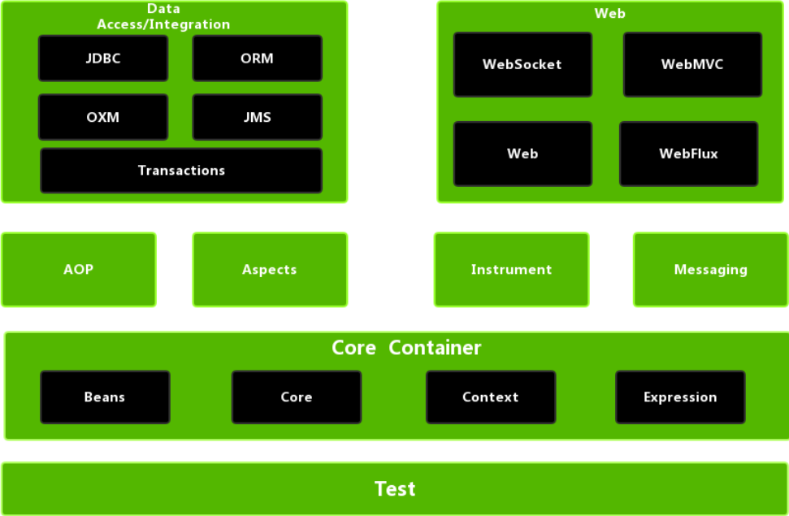
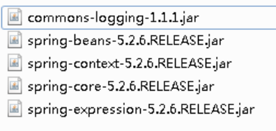
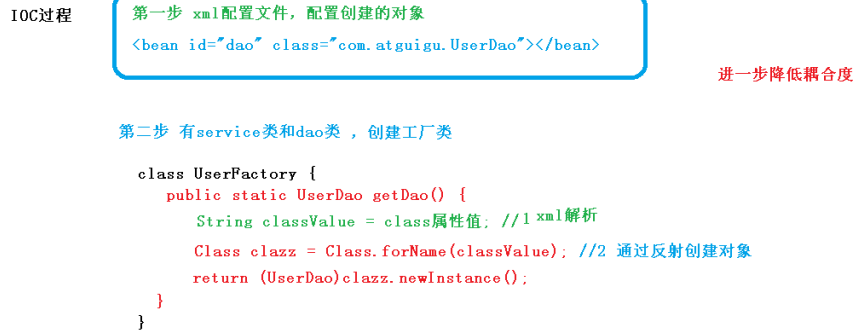
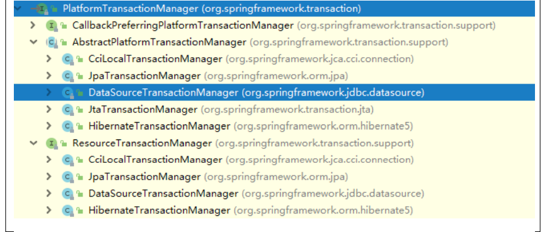
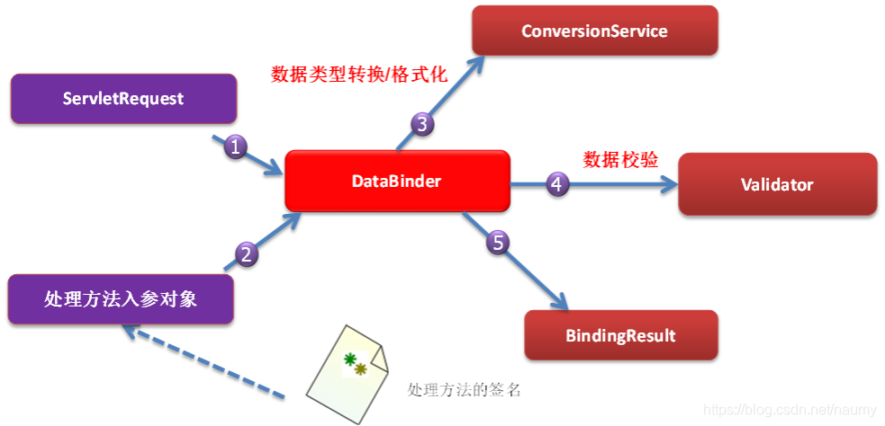
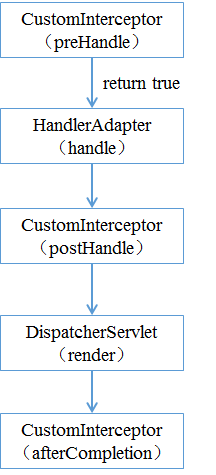
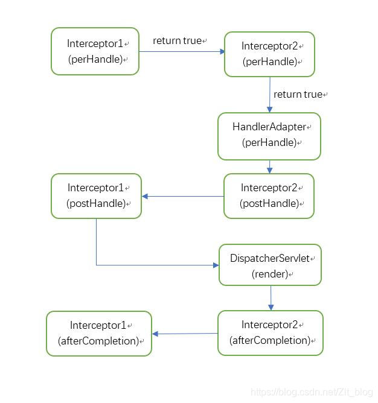

什么是Java EE？		

Java EE，Java 平台企业版（·Java Platform Enterprise Edition·），之前称为Java 2 Platform,Enterprise Edition (J2EE)，2018年3月更名为 Jakarta EE(这个名称应该还没有得到群众认可)。是 Sun 公司为企业级应用推出的标准平台，用来开发B/S架构软件。Java EE 可以说是一个框架，也可以说是一种规范。

# 一、Spring——框架入门

## 1.1 Spring概述

- Spring 是轻量级的开源的JavaEE框架
- Spring 可以解决企业应用开发的复杂性
- Spring 有两个核心部分：IOC 和 Aop
  1. IOC：控制反转，把创建对象过程交给Spring进行管理
  2. AOP：面向切面，不修改源代码进行功能增强
- Spring特点
  1. 方便解耦，简化开发
  2. Aop编程支持
  3. 方便程序测试
  4. 方便和其它框架进行整合
  5. 方便进行事务操作
  6. 降低API开发难度
  7. Java 源码是经典学习范例：
     1. Spring的源码设计精妙、结构清晰、匠心独运，处处体现着大师对Java设计模式灵活运用以及对Java技术的高深造诣。Spring框架源码无疑是Java技术的最佳实践范例。如果想在短时间内迅速提高自己的Java技术水平和应用开发水平，学习和研究Spring源码将会使你收到意想不到的效果。

### 1.1.1 Spring体系结构



<center><b>图1.1 Spring体系结构图</b></center>


==Core Container（核心容器）：==
Spring 的核心容器是其他模块建立的基础，由 Beans 模块、Core 核心模块、Context 上下文模块和 Expression Language 表达式语言模块组成。

* `Beans` 模块：提供了 BeanFactory，是工厂模式的经典实现，Spring 将管理对象称为 Bean。

* `Core` 核心模块：提供了 Spring 框架的基本组成部分，包括 [IoC和 DI](##1.2.3 IoC and DI) 功能。

* `Context` 上下文模块：建立在核心和 Beans 模块的基础之上，它是访问定义和配置任何对象的媒介。ApplicationContext 接口是上下文模块的焦点。

* （SpEL）Spring Expression Language 模块：是运行时查询和操作对象图的强大的表达式语言。

* Context-support模块：提供了对第三方库嵌入Spring应用的集成支持，比如缓存（EhCache 、Guava、JCache）、邮件服务（JavaMail）、任务调度（CommonJ、Quartz）和模板引擎（FreeMarker、JasperReports、速率）。


==Data Access/Integration（数据访问／集成）：==

数据访问/集成层包括 JDBC、ORM、OXM、JMS 和 Transactions 模块。

* `JDBC` 模块：提供了一个 JDBC 的抽象层，大幅度减少了在开发过程中对数据库操作的编码。

* ORM 模块：对流行的对象关系映射 API，包括 JPA、JDO、Hibernate 和 iBatis 提供了的集成层。

* OXM 模块：提供了一个支持对象/XML 映射的抽象层实现，如 JAXB、Castor、XMLBeans、JiBX 和 XStream。

* JMS 模块：指 Java 消息服务，包含的功能为生产和消费的信息。

* Transactions 事务模块：支持编程和声明式事务管理实现特殊接口类，并为所有的[POJO](####POJO)。


==web：==

Spring 的 Web 层包括 Web、Servlet、Struts 和 Portlet 组件。

- Web 模块：提供了基本的 Web 开发集成特性，例如多文件上传功能、使用的 Servlet 监听器的<a href="#IoC">IoC</a> 容器初始化以及 Web 应用上下文。
- Servlet模块：包括 Spring 模型—视图—控制器（MVC）实现 Web 应用程序。
- [Struts](####Struts) 模块：包含支持类内的 Spring 应用程序，集成了经典的 Struts Web 层。
- [Portlet](####Portlet) 模块：提供了在 Portlet 环境中使用 MVC实现，类似 Web-Servlet 模块的功能。

​		

==其他模块：==

Spring的其他模块还有 AOP、Aspects、Instrumentation 以及 Test 模块。

- `AOP` 模块：提供了面向切面编程实现，允许定义方法拦截器和切入点，将代码按照功能进行分离，以降低耦合性。
- `Aspects` 模块：提供与 [AspectJ](####AspectJ) 的集成，是一个功能强大且成熟的面向切面编程（AOP）框架。
- Instrumentation 模块：提供了类工具的支持和类加载器的实现，可以在特定的应用服务器中使用。
- Test 模块：支持 Spring 组件，使用 JUnit 或 [TestNG](####TestNG) 框架的测试。





# 二、IOC——spring核心

## 2.1 IOC思想

**IOC是一种设计思想，DI是实现IOC的一种方式。**

**控制反转是一种通过描述（XML或注解）并通过第三方去生产或获取特定对象的方式。在Spring中实现控制反转的是IOC容器，其实现方法是依赖注入。**

控制：传统应用程序的对象由程序自身控制，使用Spring后，对象由Spring控制。

反转：程序本身不创建对象

**依赖注入，就是注入属性**

## 2.2 什么是 IOC

（1）控制反转：把对象创建和对象之间的调用过程，交给 Spring 进行管理（**Spring创建、管理、装配Bean**）

（2）使用 IOC 目的：<font color='orange'>为了耦合度降低</font>

（3）做入门案例就是 IOC 实现

## 2.3 IOC实现原理

### 1、IOC 底层原理

**（1）xml 解析、工厂模式、反射**




### 2、IOC（BeanFactory 接口）

> #### Spring 提供 IOC 容器实现两种方式：（两个接口） 

1. BeanFactory：IOC 容器基本实现，是 Spring 内部的使用接口
   1. 不提供开发人员进行使用 * 加载配置文件时候不会创建对象，<font color='orange'>在获取对象（使用）才去创建对象</font> （<font color='red'>懒加载</font>）
2. ApplicationContext：BeanFactory 接口的<font color='orange'>子接口</font>，提供更多更强大的功能
   1. 一般由开发人 员进行使用 * 加载配置文件时候就会把在配置文件对象进行创建 (<font color='red'>快加载</font>)

3、ApplicationContext 接口<font color='orange'>有实现类</font> 


## 2.4、IOC 操作 Bean 管理（Spring Bean的实例化）

#### ==构造器实例化==

```java
package com.mengma.instance.constructor;
public class Person1 {
}

```


```xml
 <bean id="person1" class="com.mengma.instance.constructor.Person1" />
<!--通过默认构造器实例化-->
```

上述文件中，首先在 test() 方法中定义了 Spring 配置文件的路径，然后 Spring 容器会加载配置文件。在加载的同时，Spring 容器会通过实现类 Person1 中<font color='orange'>默认的无参构造函数对 Bean 进行实例化</font>。

#### ==静态工厂方式实例化==

```java
public class MyBeanFactory {
    // 创建Bean实例的静态工厂方法
    public static Person2 createBean() {
        return new Person2();
    }
}
```

```xml
<bean id="person2" class="com.mengma.instance.static_factory.MyBeanFactory"
        factory-method="createBean" />
```

上述代码中，定义了一个 id 为 person2 的 Bean，其中 class 属性指定了其对应的工厂实现类为 MyBeanFactory，而 factory-method 属性用于告诉 Spring 容器调用工厂类中的 createBean() 方法获取 Bean 的实例。

#### ==实例工厂方式实例化==

```java
public class MyBeanFactory {
    public MyBeanFactory() {
        System.out.println("person3工厂实例化中");
    }
    // 创建Bean的方法
    public Person3 createBean() {
        return new Person3();
    }
}
```

```xml
 <bean id="myBeanFactory" class="com.mengma.instance.factory.MyBeanFactory" />
    <!-- factory-bean属性指定一个实例工厂，factory-method属性确定使用工厂中的哪个方法 -->
    <bean id="person3" factory-bean="myBeanFactory" factory-method="createBean" />
</beans>
```

## 2.5 IOC 操作 Bean 管理（Bean的作用域与生命周期）

### 1、Bean的作用域

Spring 3中为Bean定义了5中作用域，分别为singleton（单例）、prototype（原型）、request、session和global session，5种作用域说明如下：

1. ==singleton==：<font color='orange'>单例模式</font>，Spring IoC容器中只会存在一个共享的Bean实例，无论有多少个Bean引用它，始终指向同一对象。Singleton作用域是Spring中的缺省作用域，也可以显示的将Bean定义为singleton模式，配置为：

   ```xml
   <bean id="userDao" class="com.ioc.UserDaoImpl" scope="singleton"/>
   ```

2. ==prototype==:<font color='orange'>原型模式</font>，每次通过Spring容器获取prototype定义的bean时，容器都将创建一个新的Bean实例，每个Bean实例都有自己的属性和状态。（而singleton全局只有一个对象。根据经验，对有状态的bean使用prototype作用域，而对无状态的bean使用singleton作用域。）

3. ==request==：在一次Http请求中，容器会返回该Bean的同一实例。而对不同的Http请求则会产生新的Bean，而且该bean仅在当前Http Request内有效。针对每一次Http请求，Spring容器根据该bean的定义创建一个全新的实例，且该实例仅在当前Http请求内有效，而其它请求无法看到当前请求中状态的变化，当当前Http请求结束，该bean实例也将会被销毁。

   ```xml
   <bean id="loginAction" class="com.cnblogs.Login" scope="request"/>
   ```

4. ==session==：在一次Http Session中，容器会返回该Bean的同一实例。而对不同的Session请求则会创建新的实例，该bean实例仅在当前Session内有效。同Http请求相同，每一次session请求创建新的实例，而不同的实例之间不共享属性，且实例仅在自己的session请求内有效，请求结束，则实例将被销毁。

   ```xml
   <bean id="userPreference" class="com.ioc.UserPreference" scope="session"/>
   ```

5. ==global Session==：在一个全局的Http Session中，容器会返回该Bean的同一个实例，仅在使用[portlet](####portlet) context时有效。

6. ==application==：为每个ServletContext对象创建一个实例。仅在Web相关的ApplicationContext中生效。

7. ==websocket==：为每个websocket对象创建一个实例。仅在Web相关的ApplicationContext中生效。

### 2、bean 生命周期

（1）通过构造器创建 bean 实例（无参数构造） 

（2）为 bean 的属性设置值和对其他 bean 引用（调用 set 方法） 

（3）把 bean 实例传递 bean 后置处理器的方法 postProcessBeforeInitialization  

（4）调用 bean 的初始化的方法（需要进行配置初始化的方法） 

（5）把 bean 实例传递 bean 后置处理器的方法 postProcessAfterInitialization 

（6）bean 可以使用了（对象获取到了） 

（7）当容器关闭时候，调用 bean 的销毁的方法（需要进行配置销毁的方法）

```java
public class Orders {
 //无参数构造
 public Orders() {
 System.out.println("第一步 执行无参数构造创建 bean 实例");
 }
 private String oname;
 public void setOname(String oname) {
 this.oname = oname;
 System.out.println("第二步 调用 set 方法设置属性值");
 }
 //创建执行的初始化的方法
 public void initMethod() {
 System.out.println("第三步 执行初始化的方法");
 }
 //创建执行的销毁的方法
 public void destroyMethod() {
 System.out.println("第五步 执行销毁的方法");
 }
}


```

```java

public class MyBeanPost implements BeanPostProcessor {
 @Override
 public Object postProcessBeforeInitialization(Object bean, String beanName) 
throws BeansException {
 System.out.println("在初始化之前执行的方法");
 return bean;
 }
 @Override
 public Object postProcessAfterInitialization(Object bean, String beanName) 
throws BeansException {
 System.out.println("在初始化之后执行的方法");
 return bean;
 }
```

```xml
<bean id="orders" class="com.atguigu.spring5.bean.Orders" initmethod="initMethod" destroy-method="destroyMethod">
 <property name="oname" value="手机"></property>
</bean>
<!--配置处理器-->
<bean id="myBeanPost" class="com.atguigu.spring5.bean.MyBeanPost"></bean>
```

```java
 @Test
 public void testBean3() {
// ApplicationContext context =
// new ClassPathXmlApplicationContext("bean4.xml");
 ClassPathXmlApplicationContext context =
 new ClassPathXmlApplicationContext("bean4.xml");
 Orders orders = context.getBean("orders", Orders.class);
 System.out.println("第四步 获取创建 bean 实例对象");
 System.out.println(orders);
 //手动让 bean 实例销毁
 context.close();
 }
```


## 2.6 IOC 操作Bean管理（基于XML方式）

### 1. 基于 xml 方式创建对象 

默认是执行<font color='red'>无参数构造方法</font>完成对象创建

```xml
<bean id="user" class="com.example.spring5.User"></bean>
```

### 2. 基于 xml 方式注入属性

#### 1、使用 <font color='orange'>set 方法</font>进行注入

```java
public class Book {
 //创建属性
 private String bname;
 private String bauthor;
 //创建属性对应的 set 方法
 public void setBname(String bname) {
 this.bname = bname;
 }
 public void setBauthor(String bauthor) {
 this.bauthor = bauthor;
 }
}

```

```xml
<bean id="book" class="com.atguigu.spring5.Book">
 <!--使用 property 完成属性注入
 name：类里面属性名称
 value：向属性注入的值
 -->
 <property name="bname" value="易筋经"></property>
 <property name="bauthor" value="达摩老祖"></property>
</bean>
```


#### 2、使用有<font color='orange'>参数构造</font>进行注入


```java
public class Orders {
 //属性
 private String oname;
 private String address;
 //有参数构造
 public Orders(String oname,String address) {
 this.oname = oname;
 this.address = address;
 }
}

```


```xml
<bean id="orders" class="com.atguigu.spring5.Orders">
 <constructor-arg name="oname" value="电脑"></constructor-arg>
 <constructor-arg name="address" value="China"></constructor-arg>
</bean>

```

#### p 名称空间注入（简化）

1. ```java
   public class Book {
    //创建属性
    private String bname;
    private String bauthor;
    //创建属性对应的 set 方法
    public void setBname(String bname) {
    this.bname = bname;
    }
    public void setBauthor(String bauthor) {
    this.bauthor = bauthor;
    }
   }
   
   ```

2.  `xmlns:p="http://www.springframework.org/schema/p"`添加到 `<beans>`

3. ```xml
   <bean id="book" class="com.atguigu.spring5.Book" p:bname="九阳神功" 
   p:bauthor="无名氏"></bean>
   ```

   

#### c  名称空间注入（简化）

#### 注入属性-外部 bean（bean间依赖 组合）

1. ```java
   //另外一个接口
   public interface UserDao{
       public void add();
   }
   //另外一个类
   public class UserDaoImpl impelements UserDao{
       public void add(){
           System.out.println("dao add............");
       }
   }
   
   //另外一个类
   public class UserService {
    //创建 UserDao 类型属性，生成 set 方法
    private UserDao userDao;
    public void setUserDao(UserDao userDao) {
    this.userDao = userDao;
    }
    public void add() {
    System.out.println("service add...............");
    userDao.add();
    }
   }
   
   ```

   

2. ```xml
   <!--1 service 和 dao 对象创建-->
   <bean id="userService" class="com.atguigu.spring5.service.UserService">
    <!--注入 userDao 对象
    name 属性：类里面属性名称
    ref 属性：创建 userDao 对象 bean 标签 id 值
    -->
    <property name="userDao" ref="userDaoImpl"></property>
   </bean>
   <bean id="userDaoImpl" class="com.atguigu.spring5.dao.UserDaoImpl"></bean>
   ```

   

#### 注入属性-内部 bean（bean间依赖 组合）

1. ```java
   //部门类//另外一个类
   public class Dept {
    private String dname;
    public void setDname(String dname) {
    this.dname = dname;
    }
   }
   //员工类//另外一个类
   public class Emp {
    private String ename;
    private String gender;
    //员工属于某一个部门，使用对象形式表示
    private Dept dept;
    public void setDept(Dept dept) {
    this.dept = dept;
    }
    public void setEname(String ename) {
    this.ename = ename;
    }
    public void setGender(String gender) {
    this.gender = gender;
    }
   }
   
   ```

   

2. ```xml
   <bean id="emp" class="com.atguigu.spring5.bean.Emp">
    <!--设置两个普通属性-->
    <property name="ename" value="lucy"></property>
    <property name="gender" value="女"></property>
    <!--设置对象类型属性-->
    <property name="dept">
    <bean id="dept" class="com.atguigu.spring5.bean.Dept">
    <property name="dname" value="安保部"></property>
    </bean>
    </property>
   </bean>
   
   ```

#### 注入属性-级联赋值 

1. 第一种

```xml
<bean id="emp" class="com.atguigu.spring5.bean.Emp">
 <!--设置两个普通属性-->
 <property name="ename" value="lucy"></property>
 <property name="gender" value="女"></property>
 <!--级联赋值-->
 <property name="dept" ref="dept"></property>
</bean>
<bean id="dept" class="com.atguigu.spring5.bean.Dept">
 <property name="dname" value="财务部"></property>
</bean>
```

2. 第二种

```xml
<property name="gender" value="女"></property>
 <!--级联赋值-->
 <property name="dept" ref="dept"></property>
 <property name="dept.dname" value="技术部"></property>
</bean>
<bean id="dept" class="com.atguigu.spring5.bean.Dept">
 <property name="dname" value="财务部"></property>
</bean>
```

#### 字面量

1. null 值

   ```xml
   <property name="address">
    <null/>
   </property>
   ```

2. 属性值包含特殊符号

   ```xml
   <!--属性值包含特殊符号
    1 把<>进行转义 &lt; &gt;
    2 把带特殊符号内容写到 CDATA
   -->
   <property name="address">
    <value><![CDATA[<<南京>>]]></value>
   </property>
   ```

#### 注入数组、List、Map、Set类型属性

1. ```java
   public class Stu {
    //1 数组类型属性
    private String[] courses;
    //2 list 集合类型属性
    private List<String> list;
    //3 map 集合类型属性
    private Map<String,String> maps;
    //4 set 集合类型属性
    private Set<String> sets;
    public void setSets(Set<String> sets) {
    this.sets = sets;
    }
    public void setCourses(String[] courses) {
    this.courses = courses;
    }
    public void setList(List<String> list) {
    this.list = list;
    }
    public void setMaps(Map<String, String> maps) {
    this.maps = maps;
    }
   }
   
   ```

   

2. ```xml
   <bean id="stu" class="com.atguigu.spring5.collectiontype.Stu">
    <!--数组类型属性注入-->
    <property name="courses">
    <array>
    <value>java 课程</value>
    <value>数据库课程</value>
    </array>
    </property>
    <!--list 类型属性注入-->
    <property name="list">
    <list>
    <value>张三</value>
    <value>小三</value>
    </list>
    </property>
    <!--map 类型属性注入-->
    <property name="maps">
    <map>
    <entry key="JAVA" value="java"></entry>
    <entry key="PHP" value="php"></entry>
    </map>
    </property>
    <!--set 类型属性注入-->
    <property name="sets">
    <set>
    <value>MySQL</value>
    <value>Redis</value>
    </set>
    </property>
   </bean>
   ```

#### 在集合里面设置对象类型值

1. ​         

   ```xml
   <bean id="course1" class="com.atguigu.spring5.collectiontype.Course">
    <property name="cname" value="Spring5 框架"></property>
   </bean>
   <bean id="course2" class="com.atguigu.spring5.collectiontype.Course">
    <property name="cname" value="MyBatis 框架"></property>
   </bean>
   <!--注入 list 集合类型，值是对象-->
   <property name="courseList">
    <list>
    <ref bean="course1"></ref>
    <ref bean="course2"></ref>
    </list>
   </property>
   
   ```

   

#### 把集合注入部分提取出来

1. ```xml
   <?xml version="1.0" encoding="UTF-8"?>
   <beans xmlns="http://www.springframework.org/schema/beans"
    xmlns:xsi="http://www.w3.org/2001/XMLSchema-instance"
    xmlns:p="http://www.springframework.org/schema/p"
    <!--xmlns:util="http://www.springframework.org/schema/util"-->
    xsi:schemaLocation="http://www.springframework.org/schema/beans 
   http://www.springframework.org/schema/beans/spring-beans.xsd
   <!-- http://www.springframework.org/schema/util -->
   <!--http://www.springframework.org/schema/util/spring-util.xsd-->">
   ```

   

2. ```xml
   <util:list id="bookList">
    <value>易筋经</value>
    <value>九阴真经</value>
    <value>九阳神功</value>
   </util:list>
   <!--2 提取 list 集合类型属性注入使用-->
   <bean id="book" class="com.atguigu.spring5.collectiontype.Book">
    <property name="list" ref="bookList"></property>
   </bean>
   
   ```

   

## 2.7 IOC 操作 Bean 管理（FactoryBean）

1. Spring 有两种类型 bean，一种普通 bean，另外一种工厂 bean（FactoryBean）
   1. 普通 bean：在配置文件中定义 bean 类型就是返回类型 
   2. 工厂 bean：在配置文件定义 bean 类型可以和返回类型不一样

```java 
public class MyBean implements FactoryBean<Course> {
 //定义返回 bean
 @Override
 public Course getObject() throws Exception {
 Course course = new Course();
 course.setCname("abc");
 return course;
 }
 @Override
 public Class<?> getObjectType() {
 return null;
 }
 @Override
 public boolean isSingleton() {
 return false;
 }
}


```

```java
@Test
public void test3() {
 ApplicationContext context =
 new ClassPathXmlApplicationContext("bean3.xml");
 Course course = context.getBean("myBean", Course.class);
 System.out.println(course);
}
```

```xml
<bean id="myBean" class="com.atguigu.spring5.factorybean.MyBean">
</bean>
```

## 2.8 IOC 操作 Bean 管理（xml 自动装配）

1、什么是自动装配 

（1）根据指定装配规则（属性名称或者属性类型），Spring 自动将匹配的属性值进行注入

```xml
<!--（1）根据属性名称自动注入-->
<!--实现自动装配
 bean 标签属性 autowire，配置自动装配
 autowire 属性常用两个值：
 byName 根据属性名称注入 ，注入值 bean 的 id 值和类属性名称一样
 byType 根据属性类型注入
-->
<bean id="emp" class="com.atguigu.spring5.autowire.Emp" autowire="byName">
 <!--<property name="dept" ref="dept"></property>-->
</bean>
<bean id="dept" class="com.atguigu.spring5.autowire.Dept"></bean>
<!--（2）根据属性类型自动注入-->
<!--实现自动装配
 bean 标签属性 autowire，配置自动装配
 autowire 属性常用两个值：
 byName 根据属性名称注入 ，注入值 bean 的 id 值和类属性名称一样
 byType 根据属性类型注入
-->
<bean id="emp" class="com.atguigu.spring5.autowire.Emp" autowire="byType">
 <!--<property name="dept" ref="dept"></property>-->
</bean>
<bean id="dept" class="com.atguigu.spring5.autowire.Dept"></bean>

```


## 2.9 IOC 操作 Bean 管理(外部属性文件)


```xml
<beans xmlns="http://www.springframework.org/schema/beans" 
 xmlns:xsi="http://www.w3.org/2001/XMLSchema-instance" 
 xmlns:p="http://www.springframework.org/schema/p" 
 xmlns:util="http://www.springframework.org/schema/util" 
 xmlns:context="http://www.springframework.org/schema/context" 
 xsi:schemaLocation="http://www.springframework.org/schema/beans 
http://www.springframework.org/schema/beans/spring-beans.xsd 
 http://www.springframework.org/schema/util 
http://www.springframework.org/schema/util/spring-util.xsd 
 http://www.springframework.org/schema/context 
http://www.springframework.org/schema/context/spring-context.xsd">
<!--引入外部属性文件-->
<context:property-placeholder location="classpath:jdbc.properties"/>
<!--配置连接池-->
<bean id="dataSource" class="com.alibaba.druid.pool.DruidDataSource">
 <property name="driverClassName" value="${prop.driverClass}"></property>
 <property name="url" value="${prop.url}"></property>
 <property name="username" value="${prop.userName}"></property>
 <property name="password" value="${prop.password}"></property>
</bean>

```

```properties
jdbc.driver=com.mysql.jdbc.Driver
jdbc.url=jdbc:mysql://localhost:3306/userDb
jdbc.username=root
jdbc.password=root
```


## 2.10 IOC 操作 Bean 管理(基于注解方式)


### 1、对象创建

==**@Component**==

该注解是一个泛化的概念，仅仅表示一个组件对象（Bean），可以作用在任何层次上。

==**@Repository**==

该注解用于将数据访问层（DAO）的类标识为Bean，即注解数据访问层Bean，其功能与@Component相同。

==**@Service**==

该注解用于标注一个业务逻辑组件类（Service层），其功能与@Component相同。

==**@Controller**==

该注解用于标注一个控制器组件类（Spring MVC的Controller），其功能与@Component相同。

<font color='orange'>上面的功能一样，都是用来创建bean实例的</font>，<font color='orange'>value默认值</font>（id）是类名的<font color='orange'>驼峰命名</font>。

```java
//1
public interface UserDao {

    public void add();
}
//2
@Repository
public class UserDaoImpl implements UserDao{
    @Override
    public void add() {
        System.out.println("dao add......");
    }
}

//3
public interface UserService{
    public void add();
}
```

在上面几个注解中，虽然@Repository、@Service和@Controller等注解的功能与@Component注解相同，但为了使类的标注更加清晰（层次化），在实际开发中推荐使用@Repository标注数据访问层（DAO层）、使用@Service标注业务逻辑层（Service层）、使用@Controller标注控制器层（控制层）。

**<font color='orange'>@Bean</font>**

通常注入方法参数，或注解。

### 2、注入属性


==**@Autowired**==

根据属性<font color='orange'>类型</font>进行自动装配（注入对象类型的属性）

```java
//3 可选
@Service
public class UserServiceImpl implements UserService{
    @Autowired
    private UserDao userDao;
    @Override
    public void add() {
        System.out.println("service....other");
        userDao.add();
    }
}

```

==**@Qualifier**==（注入对象类型的属性）

根据<font color='orange'>名称</font>进行注入，这个@Qualifier 注解的使用，和上面@Autowired <font color='orange'>一起使用</font>

```java

@Service
public class UserServiceImpl implements UserService{
    @Autowired//根据类型进行注入
    @Qualifier("userDaoImpl")//根据名称（id）进行注入 value必须写
    private UserDao userDao;
    @Override
    public void add(){
        System.out.println("service....other");
        userDao.add();
    }
}

```

<font color='orange'>根据名称（id）进行注入 value必须写，不能默认</font>

==**@Resource(name=“”,type=“”)**==

可以根据类型注入，可以根据名称注入（默认）。<font color='red'>不是Spring中的注解</font>。（注入对象类型的属性）（<font color='orange'>不建议使用</font>）

==**@Value**==

（注入普通类型的属性）

```java
@Value(value = "abc") 
private String name;
```


### 3、扫描注解

1、第一种方式：xml配置文件中开启注解扫描

```xml
<context:component-scan base-package="com.atguigu"></context:component-scan>
```

```java
public void add() {
 ApplicationContext context =
 new ClassPathXmlApplicationContext("beans.xml");
 UserServiceImpl course = context.getBean("userServiceImpl", UserServiceImpl.class);
 System.out.println(course);
}
```

<font color='orange'>（xml的细节配置：）</font>（可选）

```xml
<!--示例 1
 use-default-filters="false" 表示现在不使用默认 filter，自己配置 filter
 context:include-filter ，设置扫描哪些内容
-->
<context:component-scan base-package="com.atguigu" use-defaultfilters="false">
 <context:include-filter type="annotation" 
 
expression="org.springframework.stereotype.Controller"/>
</context:component-scan>
<!--示例 2
 下面配置扫描包所有内容
 context:exclude-filter： 设置哪些内容不进行扫描
-->
<context:component-scan base-package="com.atguigu">
 <context:exclude-filter type="annotation" 
 
expression="org.springframework.stereotype.Controller"/>
</context:component-scan>
```

2、第二种方式：创建配置类，替代 xml 配置文件 （完全注解开发）

```java
@Configuration //作为配置类，替代 xml 配置文件 
@ComponentScan("com.example.spring")
public class Myconfig {
}
```

```java
 @Test
    public void add(){
        ApplicationContext applicationContext =new AnnotationConfigApplicationContext(Myconfig.class);
        UserServiceImpl userServiceImpl = applicationContext.getBean("userServiceImpl", UserServiceImpl.class);
        userServiceImpl.add();
    }
```


# 注意 1


大概原因如下：


# 三、Spring AOP——Spring核心

## 3.1 什么是 AOP 

面向切面编程（方面），利用 AOP 可以对业务逻辑的各个部分进行隔离，从而使得 业务逻辑各部分之间的耦合度降低，提高程序的可重用性，同时提高了开发的效率。 

通俗描述：不通过修改源代码方式，在主干功能里面添加新功能

> ##   AOP术语

1. **连接点（Joinpoint）**

   类里面哪些方法可以被增强，这些方法称为连接点

2. **切入点**（Pointcut）

   实际被真正增强的方法，称为切入点

3. **通知（增强）（Advice）**

   1. 实际增强的逻辑部分称为通知（增强）
   2. 通知有多种类型
      1. 前置通知
      2. 后置通知
      3. 环绕通知
      4. 异常通知
      5. 最终通知

4. **切面**

   是动作

   1. 把通知应用到切入点过程。
   2. 通常会有进行切面的类。

5. **Weaving（织入）**

   是过程。描述：将切面代码插入到目标对象上，从而生成代理对象的过程。

## 3.2 AOP（底层原理）

[什么是ASM？](####ASM)

有两种情况动态代理：

1.  第一种 有接口情况，使用 <font color='red'>JDK 动态代理</font> <font color='orange'> 创建接口实现类</font>代理对象，增强类的方法 
2. 第二种 没有接口情况，使用 <font color='red'>CGLIB 动态代理</font>  <font color='orange'>创建子类</font>的代理对象，增强类的方法

### 3.2.1 JDK动态代理（java类实现）

利用拦截器(拦截器必须实现InvocationHanlder)加上反射机制生成一个实现<font color='orange'>代理接口</font>的匿名类，在调用具体方法前调用Invoke来处理<font color='orange'>。包在（java里）</font>

例子如下：

~~~java

public interface IVehical {
    void run();
}
public class Car implements IVehical {
    public void run() {
        System.out.println("Car会跑");
    }
}
import java.lang.reflect.InvocationHandler;
import java.lang.reflect.Method;
public class VehicalInvacationHandler implements InvocationHandler {
    private final IVehical vehical;
    public VehicalInvacationHandler(IVehical vehical){
        this.vehical = vehical;
    }
 
    public Object invoke(Object proxy, Method method, Object[] args) throws Throwable {
        System.out.println("---------before-------");
        Object invoke = method.invoke(vehical, args);
        System.out.println("---------after-------");
 
        return invoke;
    }
}


 
import java.lang.reflect.Proxy;
 

public class App {
    public static void main(String[] args) {
        IVehical car = new Car();
        /*
        newProxyInstance(目标类加载器，目标类实现的接口，拦截类)
        */
        IVehical vehical = (IVehical)Proxy.newProxyInstance(car.getClass().getClassLoader(), Car.class.getInterfaces(), new VehicalInvacationHandler(car));
        vehical.run();
    }
}
~~~

### 3.2.2 CGLIB动态代理（Spring类实现）

是一个基于ASM的字节码生成库，它允许我们在运行时对字节码进行修改和动态生成。CGLIB通过<font color='orange'>继承方式</font>实现代理，在子类中采用方法拦截的技术拦截所有父类方法的调用并顺势织入横切逻辑。<font color='orange'>包在（Spring里）</font>

例子如下：

~~~java
public class Dog{
    
    final public void run(String name) {
        System.out.println("狗"+name+"----run");
    }
    
    public void eat() {
        System.out.println("狗----eat");
    }
}
//类是在Spring的，MethodInterceptor api找不到
public class MyMethodInterceptor implements MethodInterceptor{

    @Override
    public Object intercept(Object obj, Method method, Object[] args, MethodProxy proxy) throws Throwable {
        System.out.println("这里是对目标类进行增强！！！");
        //注意这里的方法调用，不是用反射哦！！！
        Object object = proxy.invokeSuper(obj, args);
        return object;
    }  
}

public class CgLibProxy {
    public static void main(String[] args) {
        //在指定目录下生成动态代理类，我们可以反编译看一下里面到底是一些什么东西
        System.setProperty(DebuggingClassWriter.DEBUG_LOCATION_PROPERTY, "D:\\java\\java_workapace");
        
        //创建Enhancer对象，类似于JDK动态代理的Proxy类，下一步就是设置几个参数
        Enhancer enhancer = new Enhancer();
        //设置新类的父类
        enhancer.setSuperclass(Dog.class);
        //设置回调函数
        enhancer.setCallback(new MyMethodInterceptor());
        
        //如果需要，生成一个新类，并使用指定的回调函数(如果有的话)来创建一个新的对象实例。
        /*Generate a new class if necessary and uses the specified callbacks (if any) to create a new object instance.*/
        Dog proxyDog = (Dog)enhancer.create();
        //调用代理类的eat方法
        proxyDog.eat();       
    }
}
~~~

## ~~3.3 动态代理实现（ProxyFactoryBean实现）~~

Spring AOP<font color='orange'>默认使用JDK动态代理</font>的方式来实现的，在Spring中，使用`ProxyFactoryBean`是创建AOP代理的最**基本方式**。

<font color='orange'>可通过设置proxyTargetClass切换动态代理实现方式。</font>

> ### 3.3.1 Spring 通知类型
>

1. 环绕通知 org.aopalliance.intercept.**MethodInterceptor**

2. 前置通知 org.springframework.aop.**MethodBeforeAdvice **

3. 后置通知 org.springframework.aop.**AfterReturningAdvice**

4. 异常通知 org.springframework.aop.**ThrowsAdvice**

5. 引介通知 org.springframework.aop.**IntroductionInterceptor**
6. 最终通知

> ### 3.3.2 ProxyFactoryBean
>

（我日好像没注解 待定）

ProxyFactoryBean是FactoryBean的实现类，FactoryBean负责实例化一个Bean而<font color='orange'>ProxyFactoryBean负责</font>为其他Bean<font color='orange'>创建代理实例</font>。它的常用属性如下：


|                   属性名称                   |                             描述                             |
| :------------------------------------------: | :----------------------------------------------------------: |
|                    target                    |                        代理的目标对象                        |
|                proxyInterface                | 代理要实现的接口，如果是多个接口，可以使用以下格式赋值<br /> |
| <font color='orange'>proxyTargetClass</font> | <font color='orange'>是否对类代理而不是接口，设置为true时，使用CGLIB代理</font> |
|               interceptorNames               |                    需要织入的目标的Advice                    |
|                  singleton                   |      返回的代理是否为单实例，默认为true（即返回单实例）      |
|                   optimize                   |                当设置为true时，强制使用CGLIB                 |

```java
package com.aop.jdk;
import com.ioc.UserDao;

//目标类
public class UserDaoImpl implements UseDao {
    @Override
    public void addUser() {
        System.out.println("添加用户");
    }

    @Override
    public void deleteUser() {
        System.out.println("删除用户");
    }
}

```

```java
public class MyAspect implements MethodInterceptor{
    @Override
    public Object invoke(MethodInvocation mi) throws Throwable {
        check_Permission();
        //执行目标方法
        Object obj = mi.proceed();
        log();
        return obj;
    }
    public void check_Permission(){
        System.out.println("模拟检查权限。。。");
    }
    public void log(){
        System.out.println("模拟记录日志。。。");
    }

}

```

```xml
<?xml version="1.0" encoding="UTF-8"?>
<beans xmlns="http://www.springframework.org/schema/beans"
       xmlns:xsi="http://www.w3.org/2001/XMLSchema-instance"

       xsi:schemaLocation="http://www.springframework.org/schema/beans
	                    http://www.springframework.org/schema/beans/spring-beans-3.0.xsd
	                   "
       default-lazy-init="false">
	<!--目标类-->
	<bean id="userDao" class="com.aop.factorybean.UserDaoImpl"></bean>
	<!--切面类-->
	<bean id="myAspect" class="com.aop.factorybean.MyAspect"></bean>
    <!--代理对象-->
	<bean id="userDaoProxy" class="org.springframework.aop.framework.ProxyFactoryBean">
		<!--指定代理实现的接口 不知道是不是可以没有-->
		<property name="proxyInterfaces" value="com.aop.factorybean.UseDao"></property>
		<!--指定目标对象-->
		<property name="target" ref="userDao"></property>
		<!--指定切面，植入环绕通知-->
		<property name="interceptorNames" value="myAspect"></property>
		<!--指定代理方式，true:使用cglib,false(默认):使用jdk动态代理-->
		<property name="proxyTargetClass" value="true"></property>
	</bean>
</beans>

```

```java
public class ProxyFactoryBeanTest {
    public static void main(String[] args) {
        ApplicationContext applicationContext = new ClassPathXmlApplicationContext("factorybean.xml");
        UserDaoImpl userDao = (UserDaoImpl) applicationContext.getBean("userDaoProxy");
        userDao.addUser();
        userDao.deleteUser();
    }
}

```

## 3.3 AspectJ开发（==**静态代理**== 非 Spring AOP ）

AspectJ是一个基于Java语言的AOP框架，在`编译阶段`生成 AOP 代理类，是静态代理的增强。并且现Spring支持AspectJ。

### 3.3.1 ~~基于XML声明式AspectJ~~


<center><b>图3.1 &lt;aop:aspect&gt;子元素</b></center>

1. **配置切面**

 配置切面使用<aop:aspect>元素，配置<aop:aspect>元素时，通常指定id和ref两个属性，如表3-1所示：

<center><b>表 3-1 &lt;aop:aspect&gt元素的属性及其描述</b></center>

| 属性名称 |             描述             |
| :------: | :--------------------------: |
|    id    | 用于定义该切面的唯一标识名称 |
|   ref    |  用于引用普通的Spring Bean   |

2. **配置切入点**

在Spring的配置文件中，切入点是通过<aop:pointcut>元素来定义的。当<aop:pointcut>元素作为<aop:config>元素的子元素定义时，表示该切入点是全局切入点，它可被多个切面所共享；当<aop:pointcut>为<aop:aspect>元素的子元素时，表示该切入点只对当前切面有效。在定义<aop:pointcut>元素时，通常会指定id和expression两个属性，如表表3-2所示：

<center><b>表 3-2 &lt;aop:pointcut&gt;元素的属性及其描述</b></center>

|  属性名称  |               描述               |
| :--------: | :------------------------------: |
|     id     |   用于指定切入点的唯一标识名称   |
| expression | 用于指定切入点关联的切入点表达式 |

`切入点表达式`：

3. **配置通知**

在配置通知中，分别使用<aop:aspect>的子元素配置5种常用通知，这五个子元素不支持使用子元素，但在使用时可以指定一些属性，如表3-3所示：

<center><b>表 3-3 通知的常用属性及其描述</b></center>

| 属性名称  |                             描述                             |
| :-------: | :----------------------------------------------------------: |
| pointcut  | 该属性指定一个切入点表达式，Spring将在匹配该表达式的连接点织入通知。 |
| point-ref | 该属性指定一个存在的切入点名称。通常pointcut和point-ref两个属性只使用其中一个。 |
|  method   | 概述性指定一个方法名，指定将切面Bean中的该方法转换为增强处理 |
| throwing  | 该属性只对<after-throwing>元素有效，它用于指定一个形参名，异常通知可以通知该形参名`访问`目标所`抛出的异常`。（注意如果没异常，将不会执行增强） |
| returning | 该属性只对<after-returning>属性有效，它用于指定一个形参名，后置通知可以通过该形参名`访问目标`的`返回值`。 |

例子如下：

**目标接口**：

```java
public interface UserDao {
    public String doEat(String name);
}

```

**目标类**：

```java
public class UserDaoImpl implements UserDao{
    public String doEat(String name) {
        System.out.println(name+" eating "); return name;
    }
}
```


**切面：**

```java
package com.example;

import org.aopalliance.intercept.Joinpoint;
import org.aspectj.lang.JoinPoint;
import org.aspectj.lang.ProceedingJoinPoint;
public class MyAspect{
    //前置通知
    public void myBefore(JoinPoint joinPoint){
        System.out.println("前置通知：模拟执行权限检查...");
        System.out.println("目标类是："+joinPoint.getTarget());
        System.out.println(",被植入增强处理的目标方法为："+joinPoint.getSignature().getName());
    }
    //后置通知
    public void myAfterReturning(JoinPoint joinPoint,Object returnVal){
        System.out.println("后置通知：模拟记录日志...");
        System.out.println(",被植入增强处理的目标方法为："+joinPoint.getSignature().getName());
         System.out.println("返回值："+returnVal);
    }
    //环绕通知
    public Object myAround(ProceedingJoinPoint proceedingJoinPoint) throws Throwable {
        System.out.println("环绕开始：执行目标方法之前，模拟开启事务...");
        //执行当前目标方法
        Object obj = proceedingJoinPoint.proceed();
        System.out.println("环绕结束：执行目标方法之后，模拟关闭事务...");
        return obj;
    }
    //异常通知
    public void myAfterThrowing(JoinPoint joinPoint,Throwable e){
        System.out.println("异常通知："+"出错了"+e.getMessage());
    }
    //最终通知
    public void myAfter(){
        System.out.println("最终通知：模拟方法结束后的释放资源...");
    }
}
```

**applicationContext.xml配置文件：**

```xml
<?xml version="1.0" encoding="UTF-8"?>
<beans xmlns="http://www.springframework.org/schema/beans"
       xmlns:xsi="http://www.w3.org/2001/XMLSchema-instance" xmlns:aop="http://www.springframework.org/schema/aop"
       xsi:schemaLocation="http://www.springframework.org/schema/beans http://www.springframework.org/schema/beans/spring-beans.xsd http://www.springframework.org/schema/aop https://www.springframework.org/schema/aop/spring-aop.xsd">
    <!--目标类-->
    <bean id="userDao" class="com.example.dao.UserDaoImpl"/>
    <!--切面-->
    <bean id="myAspect" class="com.example.MyAspect"/>

    <!--aop编程-->
    <aop:config>
        <!--配置切面-->
        <aop:aspect ref="myAspect">
        <!--配置切入点-->
            <aop:pointcut id="myPointcut"  expression="execution(* com.example.dao.*.*(..))"/>
            <!--前置通知-->
            <aop:before method="myBefore" pointcut-ref="myPointcut"/>
            <!--后置通知    -->
            <aop:after-returning method="myAfterReturning" pointcut-ref="myPointcut" returning="returnVal"/>
            <!--环绕通知-->
            <aop:around method="myAround" pointcut-ref="myPointcut"/>
            <!--异常通知-->
            <aop:after-throwing method="myAfterThrowing" pointcut-ref="myPointcut" throwing="e"/>

            <!--最终通知-->
            <aop:after method="myAfter" pointcut-ref="myPointcut"/>
        </aop:aspect>
        </aop:config>
        </beans>
```

**测试类和测试结果：**

```java
public class UserDaoTest {
    public static void main(String args[]){
        String xmlPath="applicationContext.xml";
        ApplicationContext applicationContext =new ClassPathXmlApplicationContext(xmlPath);
        UserDao userDao = (UserDao) applicationContext.getBean("userDao");
        userDao.doEat("ss");
    }
}

前置通知：模拟执行权限检查...
目标类是：com.example.dao.UserDaoImpl@29176cc1
,被植入增强处理的目标方法为：doEat
环绕开始：执行目标方法之前，模拟开启事务...
ss eating 
最终通知：模拟方法结束后的释放资源...
环绕结束：执行目标方法之后，模拟关闭事务...
后置通知：模拟记录日志...
,被植入增强处理的目标方法为：doEat
返回值：ss


```

### 3.3.2基于注解声明式AspectJ ♥♥♥♥

启用 <font color='orange'>@AspectJ</font> 注解有以下两种方法：

**1）使用<font color='orange'>@Configuration</font>和<font color='orange'>@EnableAspectJAutoProxy</font>注解**

```
@Configuration @EnableAspectJAutoProxypublic class Appconfig {}
```

**2）基于XML配置**

在 XML 文件中添加以下内容启用 @AspectJ。

<font color='orange'>&lt;aop:aspectj-autoproxy /&gt;</font>


|                           注解名称                           |                             描述                             |
| :----------------------------------------------------------: | :----------------------------------------------------------: |
|             <font color='orange'>@Aspect</font>              |                       用于定义一个切面                       |
|            <font color='orange'>@Pointcut</font>             | 用于定义切入点表达式。`在使用时还需定义一个包含名字和任意参数的方法签名来表示切入点名称`。实际上，这个方法签名就是一个返回值为void，且方法体为空的普通的方法 |
|             <font color='orange'>@Before</font>              | 用于定义前置通知，相当于BeforeAdvice。需要一个value来指定切入点 |
|          <font color='orange'>@AfterReturing</font>          | 用于定义后置通知，相当于AfterReturingAdvice.需要一个returning指定目标方法的返回值（类型对应就行）（value略） |
|             <font color='orange'>@Around</font>              |    用于定义环绕通知，相当于MethodInterceptor。（value略）    |
|         <font color='orange'>@After-Throwing</font>          | 用于定义异常通知来处理程序中未处理的异常，相当于ThrowAdvice。需要一个throwing指定目标抛出的异常（value略） |
|              <font color='orange'>@After</font>              |               用于定义最终final通知（value略）               |
|                       @DeclareParents                        |       用于定义引介通知，相当于IntroductionInterceptor        |
|              <font color='orange'>@Order</font>              | 需求：有多个增强类多同一个方法进行增强，设置增强类优先级。                                                （1）在增强类上面添加注解 (数字类型值)，数字类型值<font color='orange'>越小优先级越高</font> |
| <font color='orange'>@EnableAspectJAutoProxy(proxyTargetClass = true)</font> | 启动基于注解的声明式AJ支持,proxyTargetClass默认为false（jdk代理），为true（cglib代理） |

**切入点表达式** 

切入点表达式作用：知道对哪个类里面的哪个方法进行增强 语法结构： execution([权限修饰符] [返回类型] [类全路径] [方法名称]([参数列表]) ) 

1. 举例 1：对 com.atguigu.dao.BookDao 类里面的 add 进行增强 execution(* com.atguigu.dao.BookDao.add(..)) 
2. 举例 2：对 com.atguigu.dao.BookDao 类里面的所有的方法进行增强 execution(* com.atguigu.dao.BookDao.* (..)) 
3. 举例 3：对 com.atguigu.dao 包里面所有类，类里面所有方法进行增强 execution(* com.atguigu.dao.*.* (..))

例子如下：

**1目标接口：**

```java
public interface UserDao {
    public String doEat(String name);
}

```

**2被增强的类：**

```java
@Repository("userDao")
public class UserDaoImpl implements UserDao{
    public String doEat(String name) {
        System.out.println(name+" eating "); return name;
    }
}

```

**3增强类：**

```java
@Component
@Aspect
public class UserDaoImplProxy{
    //切入点
    @Pointcut("execution(* com.example.dao.*.*(..))")
    public void myPointCut(){}
    //前置通知
    @Before("myPointCut()")
    public void myBefore(JoinPoint joinPoint){
        System.out.println("前置通知：模拟执行权限检查...");
        System.out.println("目标类是："+joinPoint.getTarget());
        System.out.println(",被植入增强处理的目标方法为："+joinPoint.getSignature().getName());
    }
    //后置通知
    @AfterReturning(value="myPointCut()",returning="returnVal")
    public void myAfterReturning(JoinPoint joinPoint,Object returnVal){
        System.out.println("后置通知：模拟记录日志...");
        System.out.println(",被植入增强处理的目标方法为："+joinPoint.getSignature().getName());
        System.out.println("返回值："+returnVal);
    }
    //环绕通知
    @Around("myPointCut()")
    public Object myAround(ProceedingJoinPoint proceedingJoinPoint) throws Throwable {
        System.out.println("环绕开始：执行目标方法之前，模拟开启事务...");
        //执行当前目标方法
        Object obj = proceedingJoinPoint.proceed();
        System.out.println("环绕结束：执行目标方法之后，模拟关闭事务...");
        return obj;
    }
    //异常通知
    @AfterThrowing(value="myPointCut()",throwing="e")
    public void myAfterThrowing(JoinPoint joinPoint,Throwable e){
        System.out.println("异常通知："+"出错了"+e.getMessage());
    }
    //最终通知
    @After("myPointCut()")
    public void myAfter(){
        System.out.println("最终通知：模拟方法结束后的释放资源...");
    }
}
```

~~**4applicationContext.xml配置文件：**~~(麻烦)

```java
<?xml version="1.0" encoding="UTF-8"?>
<beans xmlns="http://www.springframework.org/schema/beans"
       xmlns:xsi="http://www.w3.org/2001/XMLSchema-instance" xmlns:aop="http://www.springframework.org/schema/aop"
       xmlns:context="http://www.springframework.org/schema/context"
       xsi:schemaLocation="http://www.springframework.org/schema/beans http://www.springframework.org/schema/beans/spring-beans.xsd http://www.springframework.org/schema/aop https://www.springframework.org/schema/aop/spring-aop.xsd http://www.springframework.org/schema/context https://www.springframework.org/schema/context/spring-context.xsd">
<!--指定扫描包，使注解生效-->
<context:component-scan base-package="com.example"/>
<!--启动基于注解的声明式AJ支持-->
<aop:aspectj-autoproxy/>
</beans>
```

**5配置类**（简化）

```java
@Configuration
@ComponentScan(basePackages = {"com.atguigu"})
@EnableAspectJAutoProxy(proxyTargetClass = true)
```

**测试类和测试结果：**

```java
public class UserDaoTest {
    public static void main(String args[]){
        String xmlPath="applicationContext.xml";
        ApplicationContext applicationContext =new AnnotationconfigApplicationContext("com.xxx.xxx");
        UserDao userDao = (UserDao) applicationContext.getBean("userDao");
        userDao.doEat("ss");
    }
}
环绕开始：执行目标方法之前，模拟开启事务...
前置通知：模拟执行权限检查...
目标类是：com.example.dao.UserDaoImpl@682b2fa
,被植入增强处理的目标方法为：doEat
ss eating 
环绕结束：执行目标方法之后，模拟关闭事务...
最终通知：模拟方法结束后的释放资源...
后置通知：模拟记录日志...
,被植入增强处理的目标方法为：doEat
返回值：ss


```

# 注意 2

这里有个<font color='red'>环绕通知</font>在<font color='red'>最终通知</font>的后面的<font color='orange'>问题</font>，还有asjectj静态使用动态的问题

# 四、Spring DB 开发——辅助

[什么是Spring JDBC？](####Spring JDBC)

> #### 主要类：JdbcTemplate


## 4.2 Spring JdbcTemplate类 ♥♥♥♥

### 4.2.1 插入、更新、删除

**update()**

完成插入、更新和删除数据的操作。

```java
JdbcTemplate jdbcTemplate=(JdbcTemplate) ctx.getBean("jdbcTemplate");
String sql="insert into user (name,deptid) values (?,?)";
int count= jdbcTemplate.update(sql, new Object[]{"caoyc",3});
System.out.println(count);
```

**batchUpdate()**

批量执行

```java
String sql="insert into user (name,deptid) values (?,?)";

List<Object[]> batchArgs=new ArrayList<Object[]>();
batchArgs.add(new Object[]{"caoyc",6});
batchArgs.add(new Object[]{"zhh",8});
batchArgs.add(new Object[]{"cjx",8});

jdbcTemplate.batchUpdate(sql, batchArgs);
```

### 4.2.2 查询

query() 多查

```java
String sql = "select num,name,age from student where id > ?";
RowMapper<stu> rowMapper = new BeanPropertyRowMapper<stu>(stu.class);
List<stu> s = jdbcTemplate.query(sql, rowMapper,0);//最后一个参数为id值
System.out.println(s);
```

queryForObject() 单查

```java
String sql="select id,name,deptid from user where id=?";
RowMapper<User> rowMapper=new BeanPropertyRowMapper<User>(User.class);
User user= jdbcTemplate.queryForObject(sql, rowMapper,52);
```

### 4.2.3 其它 

执行SQL语句的功能。

```java
jdbcTemplate.execute("create table xxx(......)");
```


## 4.1 Spring JDBC

### 4.1.1 基于xml的方式 ♥♥♥♥

> #### 数据池控制属性：

**initialPoolSize：初始化连接数量**

**minPoolSize：最小连接数量**

**maxPoolSize：最大连接数量**

**acquireIncrement: 当连接池用完之后一次性获取的连接数量**

**idleConnectionTestPeriod:根据一定的时间间隔检查连接池的连接数量 单位为秒**

**maxIdleTime：最大空闲时间 单位为秒**

**maxStatements:最大的maxStatements连接数量**

**maxStatementsPerConnection:最大语句缓存**


```xml
<context:property-placeholder location="classpath:db.properties"/>
    <bean id="dataSource" class="com.alibaba.druid.pool.DruidDataSource"
          destroy-method="close">
        <property name="url" value="${jdbc.url}" />
        <property name="username" value="${jdbc.user}" />
        <property name="password" value="${jdbc.password}"/>
        <property name="driverClassName" value="${jdbc.driverClass}" />
    </bean>

    <bean id="jdbcTemplate" class="org.springframework.jdbc.core.JdbcTemplate">
        <property name="dataSource" ref="dataSource"></property>
    </bean>
```

db.properties：

```properties
jdbc.user=root
jdbc.password=123456
jdbc.driverClass=com.mysql.jdbc.Driver
jjdbc.url=jdbc:mysql://localhost:3306/db
```

```java
public class JdbcTemplateTest{
    public static void main(String[] args){
        ApplicationContext applicationContext=new AnnotationConfigApplicationContext(MyConfig.class);
        JdbcTemplate jdbcTemplate=applicationContext.getBean("jdbcTemplate");
    }
}
```

### ~~4.1.2 基于注解的方式（没有）~~


# 五、Spring tx管理——实现

[什么是事务？](####事务)

[事务管理核心接口](####事务管理核心接口)

指作为单个逻辑工作单元执行的一系列操作，要么完全地执行，要么完全地不执行。 简单的说，事务就是并发控制的单位，是用户定义的一个操作序列。

事务四个特性（ACID）

（1）原子性 

（2）一致性 

（3）隔离性 

（4）持久性

提供一个接口，代表事务管理器，这个接口针对不同的框架提供不同的实现类




<center><b>图5.1 <tx:advice>元素及其子元素</b></center>


<center><b>图5.2 传播行为的种类</b></center>


**4、timeout：超时时间** 

（1）事务需要在一定时间内进行提交，如果不提交进行回滚

 （2）默认值是 -1 ，设置时间以秒单位进行计算

 **5、readOnly：是否只读** 

（1）读：查询操作，写：添加修改删除操作 

（2）readOnly 默认值 false，表示可以查询，可以添加修改删除操作 

（3）设置 readOnly 值是 true，设置成 true 之后，只能查询 

**6、rollbackFor：回滚** 

（1）设置出现哪些异常进行事务回滚 

**7、noRollbackFor：不回滚** 

（1）设置出现哪些异常不进行事务回滚


## 5.1 编程式事务管理

是通过<font color='orange'>编写代码实现的事务管理</font>，包括定义事务的开始、正常执行后的事务提交和异常时的事务回滚。


## 5.2 声明式事务管理

是通过<font color='orange'>AOP技术实现的事务管理</font>，其主要思想是将<font color='orange'>事务管理</font>作为一个<font color='orange'>切面</font>单独编写，然后通过AOP技术将事务管理的“切面”代码织入到业务目标类中。

### ~~5.2.1 基于XML方式的声明式事务~~（有错 待处理）

applicationContext.xml：

```xml
<!--1.配置数据源-->
<context:property-placeholder location="classpath:db.properties"/>
<bean id="dataSource" class="com.mchange.v2.c3p0.ComboPooledDataSource">
    <property name="user" value="${jdbc.user}"></property>
    <property name="password" value="${jdbc.password}"></property>
    <property name="driverClass" value="${jdbc.driverClass}"></property>
    <property name="jdbcUrl" value="${jdbc.jdbcUrl}"></property>
</bean>
<!--2.配置JDBC模板-->
<bean id="jdbcTemplate" class="org.springframework.jdbc.core.JdbcTemplate">
    <property name="dataSource" ref="dataSource"></property>
</bean>
<!-- 3.定义id为accountDao的Bean-->
<bean id="accountDao" class="com.itheima.jdbc.AccountDaoImpl">
	<property name="jdbcTemplate" ref="jdbcTemplate"/>
</bean>


<!--1 创建事务管理器-->
<bean id="transactionManger" class="org.springframework.jdbc.datasource.DataSourceTransactionManager">
    <property name="dataSource" ref="dataSource"/>
</bean>
<!--2 配置通知-->
<tx:advice id="txAdice" transaction-manager="transactionManager">
	<tx:attributes>
    <!--指定哪种规则的方法上面添加事务-->
        <tx:method name="*" propagation="REQUIRED" isolation="DEFAULT" read-only="false"/>
    </tx:attributes>
</tx:advice>


<aop:config>
   <!--配置切入点-->
    <aop:pointcut expression="execution(* com.itheima.jdbc.*.*(..))" id="txPointCut"/>
    <!--配置切面-->
    <aop:advisor advice-ref="txAdvice" pointcut-ref="txPointCut"/>
</aop:config>


<!--开启事务注解-->
<tx:annotation-driven transaction-manager=“transactionManager”/>
```

测试方法：

```java
@Test
public void annotationTest(){
    ApplicationContext applicationContext = new ClassPathXmlApplicationContext("applicationContext-annotation.xml");
    AccountDao accountDao =(AccountDao)applicationContext.getBean("accountDao");
    accountDao.transfer("Jack","Rose",100.0);
    System.out.println("转账成功!");
}
```


### 5.2.2 基于注解方式的声明式事务♥♥♥♥

启用 <font color='orange'>@Transactional</font> 注解有以下两种方法：

**（1）@Configuration和 @EnableTransactionManagement**

（2）**<tx:annotation-driven transaction-manager=“transactionManager”/>**

==**@Transactional**==

<font color='orange'>标注类上，则对   所有方法   有效，</font><font color='red'>标注到方法上则只对   该方法   有效。</font>

目标方法：

```java
@Transactional(propagation=Propagation.REQUIRED,isolation=Isolation.DEFAULT,readOnly=false)
public void transfer(String outUser,String inUser,Double money){
    this.jdbcTemplate.update("update account set balance = balance+?"+"where username= ?",money,inUser)
        int i =1/0;
    this.jdbcTemplate.update("update account set balance = balance-?"+"where username ?",money,outUser)
}
```

测试方法：

```java
@Test
@EnableTransactionManagement
public void annotationTest(){
    ApplicationContext applicationContext = new ClassPathXmlApplicationContext("applicationContext-annotation.xml");
    AccountDao accountDao =(AccountDao)applicationContext.getBean("accountDao");
    accountDao.transfer("Jack","Rose",100.0);
    System.out.println("转账成功!");
}
```


# 六、MyBatis

[什么是MyBatis？](####ORM)

[什么是Hibernate？](####ORM)

[这两个框架的区别在哪？](####ORM)

[SQL注入原理、预防策略和MyBaits防止注入原理](####SQL注入)

## 6.1 MyBatis核心

### 6.1.1 MyBatis工作原理


<center><b>图6.1 MyBatis框架执行流程图 </b></center>

（1）读取MyBatis的配置文件。mybatis-config.xml为MyBatis的全局配置文件，用于配置数据库连接信息。

（2）加载映射文件。映射文件即SQL映射文件，该文件中配置了操作数据库的SQL语句，需要在MyBatis配置文件mybatis-config.xml中加载。mybatis-config.xml 文件可以加载多个映射文件，每个文件对应数据库中的一张表。

（3）构造会话工厂。通过MyBatis的环境配置信息构建会话工厂SqlSessionFactory。

（4）创建会话对象。由会话工厂创建SqlSession对象，该对象中包含了执行SQL语句的所有方法。

（5）**Executor执行器**。MyBatis底层定义了一个Executor接口来操作数据库，它将根据SqlSession传递的参数动态地生成需要执行的SQL语句，同时负责查询缓存的维护。

（6）MappedStatement对象。在Executor接口的执行方法中有一个MappedStatement类型的参数，该参数是对映射信息的封装，用于存储要映射的SQL语句的id、参数等信息。

（7）输入参数映射。输入参数类型可以是Map、List等集合类型，也可以是基本数据类型和POJO类型。输入参数映射过程类似于JDBC对preparedStatement对象设置参数的过程。

（8）输出结果映射。输出结果类型可以是Map、List等集合类型，也可以是基本数据类型和POJO类型。输出结果映射过程类似于JDBC对结果集的解析过程。

### 6.1.2 MyBatis的核心对象

#### （一） SqlSessionFactory

SqlSessionFactory是MyBatis框架中十分重要的对象，它是单个数据库映射关系经过编译后的内存镜像，其主要作用是创建SqlSession。

SqlSessionFactory`对象是线程安全的`，它一旦被创建，在整个应用执行期间都会存在。`如果我们多次地创建同一个数据库的SqlSessionFactory，那么此数据库的资源将很容易被耗尽`，通常每一个数据库都会只对应一个SqlSessionFactory，在构建实例时，建议使用单例模式。

示例代码：

```java
InputStream inputStream =Resources.getResourceAsStream("配置文件位置");
SqlSessionFactory sqlSessionFactory =new SqlSessionFactoryBuilder().build(inputStream);
```

#### （二） SqlSession

SqlSession是MyBatis的另一个重要的对象，他是应用程序与持久层之间执行交互操作的一个单线程对象，`其主要执行持久化操作`。SqlSession对象包含了数据库中所有执行SQL的方法，由于其底层封装了JDBC连接，所以可以用其实例来执行已映射 的SQL语句。

`每个线程都应该有一个自己的SqlSession实例，并且该实例是不能被共享的。`同时SqlSession实例也是`线程不安全的`，因此其使用范围最好在一 次请求或一个方法中，绝不能将其放在一个类的静态字段、实例字段或任何类型的管理范围（如Servlet 的 HttpSession）中使用。

其查询方法如下：（核心源码）

```java
public class MybatisUtils {
	private static SqlSessionFactory sqlSessionFactory = null;
	static {
		try {
			// 1.读取配置文件
			String resource = "mybatis-config.xml";
			InputStream inputStream = Resources.getResourceAsStream(resource);
			// 2.根据配置文件构建sqlSessionFactory
			sqlSessionFactory = new SqlSessionFactoryBuilder().build(inputStream);
		} catch (IOException e) {
			// TODO Auto-generated catch block
			e.printStackTrace();
		}

	}

	public static SqlSession getSession() {
		// 根据sessionFactory创建sqlSession
		return sqlSessionFactory.openSession();
	}
}


public void someToSomeByIdOders() {
		SqlSession sqlSession =MybatisUtils.getSession();
		Orders orders =sqlSession.selectOne("com.itheima.mapper.OrdersMapper.someToSomeByIdOders", 1);
		System.out.println(orders);
	}
```


### 6.1.3 核心配置文件 ♥♥♥♥

#### 1 主要元素


<center><b>图6.2 MyBatis配置文件中的主要元素</b></center>

MyBatis核心配置文件<a name="SqlMapConfig.xml">SqlMapConfig.xml</a>例子如下：

```xml
<configuration>
<!-- 1.配置环境，默认的环境id为mysql -->
<properties resource="db.properties"></properties>
<typeAliases>
 <package name="com.itheima.po"/>
 </typeAliases> 
<!-- <typeAliases>typeAliases alias="customer" type="com.itheima.po.Customer"<typeAliases> -->
 <environments default="mysql">
<!--  1.1配置id为mysql的数据库环境 -->
 <environment id="mysql">
<!--  使用JDBC的事物管理 -->
 <transactionManager type="JDBC"/>
<!--  数据库连接池 -->
 <dataSource type="POOLED">
 <property name="driver" value="${jdbc.driver}"/>
 <property name="url" value="${jdbc.url}"/>
 <property name="username" value="${jdbc.username}"/>
 <property name="password" value="${jdbc.password}"/>
 </dataSource>
 </environment>
 </environments>
<!--  
 2.配置Mapper的位置 -->
 <mappers>
 <mapper resource="com/itheima/mapper/IdCardMapper.xml"/>
 <mapper resource="com/itheima/mapper/OrdersMapper.xml"/>
 <mapper resource="com/itheima/mapper/PersonMapper.xml"/>
 <mapper resource="com/itheima/mapper/UserMapper.xml"/>
 <mapper resource="com/itheima/mapper/ProductMapper.xml"/>
 </mappers>
```

#### 2 &lt;properties&gt;元素

<properties>是一个配置属性的元素，该元素通常用于将内部的配置`外在化。`

示例：

db.properties文件：

```properties
jdbc.driver=com.mysql.jdbc.Driver
jdbc.url=jdbc:mysql://localhost:3306/mybatis
jdbc.username=root
jdbc.password=root
```

mybatis-config.xml

```xml
<properties resource="db.properties"/>

<dataSource type="POOLED">
    <property name="driver" value="${jdbc.driver}"/>
    <property name="url" value="${jdbc.url}"/>
    <property name="username" value="${jdbc.username}"/>
    <property name="password" value="${jdbc.password}"/>
</dataSource>
```


#### 3&lt;setting&gt;元素

<setting>元素主要用于改变MyBastis运行时的行为，例如开启[二级缓存](####二级缓存)、开启[延迟加载](####延迟加载)。

常见配置如表：

<center><b>表6.1 &lt;settings&gt;元素中的常见配置</b></center>

|         设置参数          |                             描述                             |        有效值        |  默认值  |
| :-----------------------: | :----------------------------------------------------------: | :------------------: | :------: |
|       cacheEnabled        |           该配置影响所有映射器中配置的缓存全局开关           |     true\|false      |  false   |
|    lazyLoadingEnabled     | 延迟加载的全局开关。开启时，所有关联对象都会延迟加载。特定关联关系中可以通过设置fetchType属性来覆盖该项的开关状态 |     true\|false      |  false   |
|   aggressiveLazyLoading   | 关联对象属性的延迟加载开关。当启用时，对任意延迟属性的调用会使带有延迟加载属性的对象完整加载；反之，每种属性都会按需加载 |     true\|false      |   true   |
| multipleResultSetsEnabled |         是否允许单一语句返回多结果集（需要兼容驱动）         |     true\|false      |   true   |
|      useColumnLabel       | 使用列标签代替列名。不同的驱动在这方面有不同的表现。具体可参考驱动文档或通过测试两种模式业观察所用驱动的行为 |     true\|false      |   true   |
|      useGenerateKeys      | 允许JDBC支持自动生成主键，需要驱动兼容。如果设置为true，则这个设置强制使用自动生成主键，尽管一些驱动不兼容但仍可正常工作 |     true\|false      |  false   |
|    autoMappingBehavior    | 指定MyBatis应如何自动映射列到字段或属性。NONE表示取消自动映射；PARTIAL`只会自动映射没有定义嵌套结果集映射的结果集`；FULL会自动映射任意复杂的结果集（无论是否嵌套） | NONE、PARTIAL、FULL  | PARTIAL  |
|    defaultExecutorType    | 配置默认的执行器。SIMPLE就是普通的执行器；REUSE执行器会重用预处理语句（prepared statements）；BATCH执行器将重用语句并执行批量更新 | SIMPLE、REUSE、BATCH |  SIMPLE  |
|  defaultStatementTimeout  | 设置超时时间，它决定驱动等待数据库响应的秒数。当没有设置的时候，它取的就是驱动默认的时间 |      任何正整数      | 没有设置 |
| mapUnderscoreToCamelCase  |          是否开启自动驼峰命名规则（camel case）映射          |     true\|false      |  false   |
|      jdbcTypeForNull      | 当没有为参数提供特定的JDBC类型，为空值指定JDBC类型。某些驱动需要指定列的JDBC类型，多数情况直接用一般类型即可，比如NULL、VARCHAR或OTHER | NULL、VARCHAR、OTHER |  OTHER   |

示例如下：

```xml
<settings>
    <setting name="cacheEnabled" vale="true"/>
    <setting name="lazyLoadingEnabled" value="true"/>
    <setting name="multipleResultSetsEnabled" value="true"/>
    <setting name="useColumnLabel" value="true"/>
</settings>
```


#### 4&lt;typeAliases&gt;元素

定义类别名：

```xml
<typeAliases>
    <typeAlias alias="user" type-"com.itheima.po.User"/>
</typeAliases>
```

批量定义包下的类默认别名：

```xml
<typeAliases>
    <package name name="com.itheima.po"/>
    以首字母小写的非限定名来作为它的别名如User的别名为user
</typeAliases>
```

#### 5 &lt;typeHandler&gt;元素

Mybatis在预处理语句（PreparedStatement）中设置一个参数或从结果集（ResultSet）中取出一个值时，都会用其框架内部注册了的typeHandler（类型处理器）进行相关处理。`typeHandler的作用就是将预处理语句中传入的参数从javaType（Java类型）转换为jdbcType（JDBC类型），或者从数据库取出结果时将jdbcType转换为javaType。`

常用的类型处理器如下：

- BooleanTypeHandler：用于 java 类型 boolean，jdbc 类型 bit、boolean

- ByteTypeHandler：用于 java 类型 byte，jdbc 类型 TINYINT

- ShortTypeHandler：用于 java 类型 short，jdbc 类型 SMALLINT

- IntegerTypeHandler：用于 INTEGER 类型

- LongTypeHandler：用于 long 类型

- FloatTypeHandler：用于 FLOAT 类型

- DoubleTypeHandler：用于 double 类型

- StringTypeHandler：用于 java 类型 string，jdbc 类型 CHAR、VARCHAR

- ArrayTypeHandler：用于 jdbc 类型 ARRAY

- BigDecimalTypeHandler：用于 java 类型 BigDecimal，jdbc 类型 REAL、DECIMAL、NUMERIC

- DateTypeHandler：用于 java 类型 Date，jdbc 类型 TIMESTAMP

- DateOnlyTypeHandler：用于 java 类型 Date，jdbc 类型 DATE

- TimeOnlyTypeHandler：用于 java 类型 Date，jdbc 类型 TIME

  

当不能满足实际需求时，注册自定义类型处理器：

1. **注册一个类的类型处理器**

   ```xml
   <typeHandlers>
       <typeHandler handler="com.itheima.type.CustomtypeHandler"/>
   </typeHandlers>
   ```

2. **注册一个包中所有的类型处理器**

   ```xml
   <typeHandlers>
       <package name="com.itheima.type"
   </typeHandlers>
   ```

#### 6 &lt;objectFactory&gt;元素

MyBatis框架每次创建结果对象的新实例时，都会使用一个对象工厂（ObjectFactory）的实例来完成。`Mybatis中默认的ObjectFactory的作用就是实例化目标类`，它既可以通过默认构造方法实例化，也可以在参数映射存在的时候通过参数构造方法来实例化。

使用自定义对象工厂，实例如下：

自定义工厂类：

```java
public class MyObjectFactory extends DefaultObjectFactory{
    private static final long serialVersionUID =-4114845625429965832L;
    public <T> T create(Class<T> type){
        return super.create(type);
    }
    public <T> T create(Class<T> type,List<Class<?>> constructorArgTypes,List<Object> constructorArgs){
        return super.create(type,constructorArgTypes,constructorArgs);
	}
    public void setProperties(Properties properties){
        super.setProperties(properties);
    }
    public <T> boolean isCollection(Class<T> type){
        return Collection.class.isAssignableFrom(type);
    }
}
```

配置文件配置对象工厂为自定义工厂：

```xml
<objectFactory type="com.itheima.factory.MyObjectFactory">
    <property name="name" value="MyObjectFactory"/>
</objectFactory>
```

#### 7 &lt;plugins&gt;元素

略（待处理）

#### 8 &lt;environments&gt;元素

可以通过<environments>元素配置多种数据源，即`配置多种数据库。`

```xml
<environments default="development">
    <environment id="development">
    使用JDBC事务管理
        <transactionManager type="JDBC" />
        配置数据源
        <dataSource type="POOLED">
            <property name="driver" value="${jdbc.driver}"/>
            <property name="url" value="${jdbc.url}"/>
            <property name="username" value="${jdbc.username}"/>
            <property name="password" value="${jdbc.password}"/>
        </dataSource>
    </environment>
    <environment id="xxxx">...</environment>
</environments>
```

在MyBatis中，可以配置两种类型的==事务管理器==，分别时JDBC和MANAGED，描述如下：

`JDBC`：此配置直接使用了JDBC的提交和回滚设置，它依赖于从数据源得到的连接来管理事务的作用域。

`MANAGED`：此配置从来不提交或回滚一个连接，而是让容器来管理事务的整个生命周期。在默认情况下，它会关闭连接，但一些容器并不希望这样，为此可以将closeConnect属性设置为false来阻止它默认的关闭行为。

MyBatis框架提供了`UNPOOLED`、`POOLED`和`JNDI`三种==数据源类型==，具体如下：

1. UNPOOLED

   它对没有性能要求的简单应用程序时一个很好的选择。

   额外配置属性有defaultTransactionIsolationLevel（默认的连接事务隔离级别）

2. POOLED

   

   <center><b>图6.3 POOLED数据源可额外配置的属性</b></center>

3. JNDI

   此数据源可以在EJB(企业java beans)或应用服务器等容器中使用。容器可以集中或在外部配置数据源，然后放置一个JNDI上下文的引用。

   配置JNDI数据源时，只需要配置两个属性，如图所示：

   

   

   <center><b>图6.4 JNDI数据源需要配置的属性</b></center>


#### 9 &lt;mappers&gt;元素

<mappers>元素用于指定MyBatis映射文件的位置。

1. 使用类路径引入

   ```xml
   <mappers>
       <mapper resource="com/itheima/mapper/UserMapper.xml"/>
   </mappers>
   ```

2. 使用本地文件路径引入

   ```xml
   <mappers>
       <mapper url="file:///D:/com/itheima/mapper/UserMapper.xml"/>
   </mappers>
   ```

3. 使用接口类引入

   ```xml
   <mappers>
       <mapper class="com.itheima.mapper.UserMapper"/>
   </mappers>
   ```

4. 使用包名引入

   ```xml
   <mappers>
       <mapper package="com.itheima.mapper"/>
   </mappers>
   ```

### 6.1.4 核心映射文件

#### 1主要元素


<center><b>图6.5 映射文件的主要元素</b></center>

#### 2&lt;select&gt;元素

```xml
<select id="findCustomerById" parameterType="Integer" resultType="com.itheima.po.Customer">
</select>
```

<center><b>表6.2 &lt;select&gt;元素的常用属性</b></center>

|     属性      |                             说明                             |
| :-----------: | :----------------------------------------------------------: |
|      id       | 表示命名空间中的唯一标识符，常与命名空间组合起来使用。组合后如果不唯一，MyBatis会抛出异常 |
| parameterType | 该属性表示传入SQL语句的参数类型的全限定名或者别名。因为MyBatis可以通过TypeHandler推断出具体传入语句的参数。器默认值是unset（依赖于驱动） |
|   resultMap   | 表示外部resultMap的命名引用。返回时可以使用resultType或resultMap。 |
|  flushCache   | 表示在调用SQL语句之后，是否需要MyBatis清空之前查询的本地缓存和二级缓存。其值为布尔类型（true\|false），默认为false。如果设置为true，则任何时候只要SQL语句被调用，都会清空本地缓存和二级缓存 |
|   useCache    | 用于控制二级缓存的开启和关闭。其值为布尔类型（true\|false），默认值true，表示将查询结果存入二级缓存 |
|    timeout    |  用于设置超时参数，单位为秒。超时时将抛出异常（数字123456）  |
|   fetchSize   |     获取记录的总条数设定，其默认值是unset（依赖于驱动）      |
| statementType | 用于设置MyBatis使用哪个JDBC的Statement工作，其值为STATEMENT、PREPARED（默认值）或CALLABLE，分别对应JDBC中的Statement、PreparedStatement和CallableStatement |
| resultSetType | 表示结果集的类型。其值可设置为FORWARD_ONLY、SCROLL_SENSITIVE或SCROLL_INSENSITIVE，它的默认值是unset（依赖于驱动） |

#### 3&lt;insert&gt;元素

<center><b>表6.3 &lt;insert&gt;元素中的属性</b></center>

|       属性       |                             说明                             |
| :--------------: | :----------------------------------------------------------: |
|   keyProperty    | （仅对insert和update有用）此属性的作用是将插入或更新操作时的返回值赋给PO类的某个属性，通常会设置为主键对应的属性。如果需要设置联合主键，可以在多个值之间用逗号隔开（`用于接收自增长id值并返回到指定的PO类的属性`） |
|    keyColumn     | （仅对insert和update有用）此属性用于设置第几列时主键，当主键列不是表中的第一列时需要设置。在需要主键联合时，值可以用逗号隔开（`比keyProperty只有指定作用吧`（==大概==）） |
| useGeneratedKeys | （仅对insert和update有用）此属性会使MyBatis使用JDBC的getGeneratedKeys()方法来获取由`数据库内部生产`的主键，如MySQL和SQL Server等自动递增的字段，其默认值为false |

#### 4&lt;update&gt;元素

```xml
<update id="updateRoleInfoById" parameterType="com.framework.modules.member.entity.RoleInfoEntity">
        update t_role_info
        set
        role_name=#{role_name},status=#{status},scribe=#{scribe},update_time=sysdate()
        where role_id=#{role_id}
    </update>
```


#### 5&lt;delete&gt;元素

```xml
<delete id="mulDeleteRoleInfoById" parameterType="java.util.List">
    delete from t_role_info
    where 1=1 and
    <foreach collection="list" item="item" separator=" or ">
        role_id=#{item}
    </foreach>
</delete>
```

#### 6&lt;sql&gt;元素

抽取重复使用的列，提高效率。

```xml
<sql id="customerColumns">id,username,jobs,phone</sql>


select <include refid="customerColumns"/> from t_customer
where id=#{id}
```

#### 7&lt;resultMap&gt;元素 ♥♥♥♥

它表示结果映射集，主要作用是`定义映射规则`、`级联的更新`以及`定义类型转化器`等。

<resultMap>中的一些子元素：

```xml
<resultMap>
    <constructor>类在实例化时，用来注入结果到构造方法中
        <idArg/>ID参数；标记结果作为ID
        <arg/>注入到构造方法的一个普通结果
    </constructor>
    <id/>用于表示哪个列是主键
    <result/>注入到字段或JavaBean属性的普遍结果
    <association property=""/>用于一对一关联
    <collection property=""/>用于一对多关联
    <discriminator jaaType="">使用结果值来决定使用哪个结果映射
        <case value=""/>基于某些值的结果映射
    </discriminator>
</resultMap>
```

例子如下：

```xml
<resultMap type="con.itheima.mapper.UserMapper" id="resultMap">
    <id property="id" column="t_id"/>
    <result property="name" column="t_name"/>
    <result property="age" column="t_age"/>
</resultMap>

<select id="findAllUser" resultMap="resultMap">
    select * from t_user
</select>
```

##### &lt;association&gt;子元素：

用于一对一关联

属性如下：

|   属性    |                             说明                             |
| :-------: | :----------------------------------------------------------: |
| property  |          指定映射到实体类对象属性，与表字段一一对应          |
|  column   |                      指定表中对应的字段                      |
| javaType  |             ==**指定映射到实体对象属性的类型**==             |
|  select   | 指定引入嵌套查询的子SQL语句，该属性用于关联映射中的嵌套查询  |
| fetchType | 指定在关联查询时是否启用延迟加载。值为lazy和eager。默认为lazy |

使用方式为：

```xml
嵌套查询 效率不高，多执行一个sql语句
<association property="idcard" column="card_id" javaType="IdCard"
	select="com.itheima.mapper.IdCardMapper.findCodeById"/>
嵌套结果
<association property="idcard" column="card_id" javaType="IdCard">
	<id property="id" column="card_id"/>
    <result property="code" column="code"/>
</association>
```

##### &lt;collection&gt;元素：

用于一对多关联

属性与<association>相同，其中它的==**ofType**==属性对应<association>的==**javaType**==属性。

待扩展

#### 8&lt;selectKey&gt;元素

通过自定义的语句来设置数据中的主键。(自定义生成主键)

属性如下：

```xml
<selectKey
    keyProperty=
    resultType=
    order=
    statementType=
>
```

实例如下：

```xml
<insert id-"insertCustomer" parameterType="com.itheima.po.Customer">
    <selectKey keyProperty="id" resultType="Integer" order="BEFORE">
        select if(max(id) is null,1,max(id)+1) as newId from t_customer
    </selectKey>
    insert into t_customer(id,username,jobs,phone)
    values(#{id},#{username},#{jobs},#{phone})
</insert>
```

## 6.2 MyBatis动态SQL

MyBatis 3采用了功能强大的基于[OGNL](####OGNL)的表达式来完成动态SQL。

主要元素如下：

|            元素             |                             说明                             |
| :-------------------------: | :----------------------------------------------------------: |
|            <if>             |                             判断                             |
| <choose>(<when><otherwise>) |                            switch                            |
|   <where>、<trim>、<set>    |         辅助元素，用于处理一些SQL拼装、特殊字符问题          |
|          <foreach>          |                           循环语句                           |
|           <bind>            | 从OGNL表达式中创建一个变量，并将其绑定到上下文，常用于模糊查询的sql中 |

元素使用如下：

### 1 &lt;if&gt;元素

```xml
<if test="username != null and username !='' "></if>
```

**<choose>(<when><otherwise>)元素**：

```xml
<choose>
    <when text="username != null and username !=''">
        and username like concat('%',#{username},'%')
    </when>
    <otherwise>
        and phone is not null
    </otherwise>
</choose>
```

### 2 &lt;where&gt;元素

`只有<where>元素内条件成立时，才会在拼接SQL中加入where关键字，否则将不会添加,即使where之后又多余的and 或 or 它也会自动将它们去除。`

```xml
select * from t_customer
<where>
    <if test="username != null and username !='' ">
        and username like concat('%',#{username},'%')
    </if>
    <if test="jobs != null and jobs !='' ">
        and jobs like concat('%',#{jobs},'%')
    </if>

</where>
```

### 3 &lt;trim&gt;元素

mybatis的**trim**标签一般用于去除sql语句中多余的and关键字，逗号，或者给sql语句前拼接 “where“、“set“以及“values(“ 等前缀，或者添加“)“等后缀，可用于选择性插入、更新、删除或者条件查询等操作。

|    **属性**     |                           **描述**                           |
| :-------------: | :----------------------------------------------------------: |
|     prefix      |                     给sql语句拼接的前缀                      |
|     suffix      |                     给sql语句拼接的后缀                      |
| prefixOverrides | 去除sql语句前面的关键字或者字符，该关键字或者字符由prefixOverrides属性指定，假设该属性指定为"AND"，当sql语句的开头为"AND"，trim标签将会去除该"AND" |
| suffixOverrides | 去除sql语句后面的关键字或者字符，该关键字或者字符由suffixOverrides属性指定 |

```xml
select * from t_customer
<trim  prefix="where" prefixOverrides="and">
    <if test="username != null and username !='' ">
        and username like concat('%',#{username},'%')
    </if>
    <if test="jobs != null and jobs !='' ">
        and jobs like concat('%',#{jobs},'%')
    </if>
</trim>
```

### 4 &lt;set>元素

主要作用是在动态包含的SQL语句钱输出一个SET关键字，并将SQL语句中最后一个多余的逗号去除。shilie示例如下：


```xml
update t_customer
<set>
    <if test="username != null and username !='' ">
         username=#{username},
    </if>
    <if test="jobs != null and jobs !='' ">
        jobs=#{jobs},
    </if>
</set>
where id=#{id}
```

### 5 &lt;foreach&gt;元素

```xml
 <update id="mulUpdate_statusToCloseByIds" parameterType="java.util.List">
        update t_role_info
        SET
        status='禁用', update_time=sysdate()
        where 1=1
        and role_id in
        <foreach collection="list" index="index" separator="," item="item" open="(" close=")">
            #{item}
        </foreach>
    </update>
```

collection：属性值有list or array or collection，也可以对应参入的参数名。

index：指当前元素在集合位置的索引。

### 6 &lt;bind&gt;元素

它是用于模糊查询中不同数据库的不同实现方式而存在的同一口径元素。

其属性有：

* name
* value：值为[OGNL](####OGNL)表达式。

使用如下：

```xml
<bind name="patter_name" value="'%'+username+'%'"/>
select * from t_customer
where
username = #{patter_name}
```

## 6.3 MyBatis关联映射

MyBatis关联映射主要用来处理Java对象中的三种映射关系。

java对象关系概述：

**一对一**：

```java
class A{
    B b;
}
class B{
   B b;
}
实际只需要一个关系
```

**一对多：**

```java
class A{
    List<B> b;
}
class{
    A a;
}
实际只需要List关系
```

**多对多：**

```java
class A{
    List<B> b;
}
class B{
    List<A> a;
}
```


### 6.3.1 一对一关联

关联数据库如下：

```mysql
create table tb_idcard(
	id int primary key auto_increment,
    CODE varchar(18)
);

insert into tb_idcard(CODE) values ('152221198711020624'),('152201199008150317');

create table tb_person(
    id int primary key auto_increment,
    name varchar(32),
    age int,
    sex varchar(8),
    card_id int unique,
    foreign key(card_id) references tb_idcard(id)
);

insert into tb_person(name,age,sex,card_id) values
('Rose',29,'女',1),('tom',27,'男',2);

```

POJO如下：

```java
public class Person {
	private Integer id;
	private String name;
	private Integer age;
	private String sex;
	private IdCard	idcard;
}

public class IdCard {
	private Integer id;
	private String code;
}
```

mapper.xml如下：

```xml
IdCardMapper
 <select id="findCodeById" parameterType="IdCard" resultType="IdCard">
 		select * from tb_idcard where id=#{id}
 </select>
 </mapper>


```

```xml
PersonMapper
<select id="oneToOneByIdNest1" parameterType="Integer" resultMap="IdCardWithPersonResult">
    select * from tb_person where id=#{id}
</select>

<resultMap type="person" id="IdCardWithPersonResult">
 	<id property="id" column="id" />
 	<result property="name" column="name"/>
 	<result property="age" column="age"/>
 	<result property="sex" column="sex"/>
    嵌套查询 效率不高，执行了两条SQL 应使用嵌套结果
 	<association property="idcard" column="card_id" javaType="IdCard"
 		select="com.itheima.mapper.IdCardMapper.findCodeById"/>
</resultMap>
测试结果如下：
    DEBUG [main] - ==>  Preparing: select * from tb_person where id=? 
    DEBUG [main] - ==> Parameters: 1(Integer)
    DEBUG [main] - ====>  Preparing: select * from tb_idcard where id=? 
    DEBUG [main] - ====> Parameters: 1(Integer)
    DEBUG [main] - <====      Total: 1
    DEBUG [main] - <==      Total: 1
    Person [id=1, name=Rose, age=29, sex=女, idcard=IdCard [id=1, code=152221198711020624]]

```

### 6.3.2 一对多关联

关联数据库：

```mysql
CREATE TABLE tb_user (
               id int(32) PRIMARY KEY AUTO_INCREMENT,
               username varchar(32),
							 address varchar(256)
        ); 
 INSERT INTO tb_user VALUES (1,'詹姆斯','克利芙兰'); 
 INSERT INTO tb_user VALUES (2,'科比','洛杉矶'); 
 INSERT INTO tb_user VALUES (3,'保罗','洛杉矶'); 
 
 
  CREATE TABLE tb_orders (
               id int(32) PRIMARY KEY AUTO_INCREMENT,
               number varchar(32) not null,
							 user_id int(32)  not null ,
							 FOREIGN KEY(user_id) REFERENCES tb_user(id) 
); 

 INSERT INTO tb_orders VALUES (1,'1000011','1'); 
 INSERT INTO tb_orders VALUES (2,'1000012','1'); 
 INSERT INTO tb_orders VALUES (3,'1000013','2'); 

```

POJO如下：

```java
public class User {
		private Integer id;
		private String username;
		private String address;
		private List<Orders> ordersList;
}

public class Orders {
	private Integer id;
	private String number;
   //private List<Product> productList;
}
```

mapper.xml如下：

```xml
UserMapper
<mapper namespace="com.itheima.mapper.UserMapper">
  <select id="oneToSomeByIdResult" parameterType="Integer" resultMap="OrdersWithUserResult">
  	SELECT u.*,o.id as orders_id,o.number 
  	from tb_user u,tb_orders o 
  	where u.id=user_id 
  	and u.id=#{id}
  </select>
	<resultMap type="user" id="OrdersWithUserResult">
	<id property="id" column="id"/>
	<result property="username" column="username" />
	<result property="address" column="address" />
	<collection property="ordersList" ofType="orders">
		<id property="id" column="orders_id"/>
		<result property="number" column="number"/>
	</collection>
	</resultMap>
  </mapper>
测试结果如下：
    DEBUG [main] - ==>  Preparing: SELECT u.*,o.id as orders_id,o.number from tb_user u,tb_orders o where u.id=user_id and u.id=? 
    DEBUG [main] - ==> Parameters: 1(Integer)
    DEBUG [main] - <==      Total: 2
    User [id=1, username=詹姆斯, address=克利芙兰, ordersList=[Orders [id=1, number=1000011, productList=null], Orders [id=2, number=1000012, productList=null]]]

```


### 6.3.3 多对多关联

关联数据库：

```mysql
CREATE TABLE tb_product (
               id int(32) PRIMARY KEY AUTO_INCREMENT,
               name varchar(32) not null,
							 price double 
); 

 
 INSERT INTO tb_product VALUES (1,'Java 基础入门',44.5); 
 INSERT INTO tb_product VALUES (2,'Java Web程序开发入门',38.5); 
 INSERT INTO tb_product VALUES (3,'SSM框架整合实践',50); 
 

 CREATE TABLE tb_ordersitem (
               id int(32) PRIMARY KEY AUTO_INCREMENT,
							 orders_id int(32),
							 product_id int(32),
             	 FOREIGN KEY(orders_id) REFERENCES tb_orders(id), 
							 FOREIGN KEY(product_id) REFERENCES tb_product(id) 
        ); 
 INSERT INTO tb_ordersitem VALUES (1,'1','1'); 
 INSERT INTO tb_ordersitem VALUES (2,'1','3'); 
 INSERT INTO tb_ordersitem VALUES (3,'3','3'); 
```

POJO如下：

```java
public class Product {
	private Integer id;
	private String  name;
	private Double price;
	private List<Orders> ordersList2;    
}


public class Orders {
	private Integer id;
	private String number;
	private List<Product> productList;
}


```

mapper.xml如下：

```xml
OrdersMapper
<mapper namespace="com.itheima.mapper.OrdersMapper">
   <select id="someToSomeByIdOders" parameterType="Integer" resultMap="OrdersWithProductResult">
 	select o.*,p.id as pid,p.name,p.price
 	from tb_orders o,tb_product p,tb_ordersitem oi
 	where oi.orders_id=o.id
 	and oi.product_id=p.id
 	and o.id=#{id}
 	</select>
 	 <resultMap id="OrdersWithProductResult" type="orders">
 		<id property="id" column="id" />
 		<result property="number" column="number"/>
 		
 		<collection  property="productList" ofType="product">
 		<id property="id" column="pid"/>
 		<result property="name" column="name"/>
 		<result property="price" column="price"/>
 		</collection>
 	</resultMap>
  </mapper>

ProductMapper
<mapper namespace="com.itheima.mapper.ProductMapper">
   <select id="someToSomeByIdProduct" parameterType="Integer" resultMap="OrdersWithProductResult">
 	select p.*,o.id as pid,o.number
 	from tb_orders o,tb_product p,tb_ordersitem oi
 	where oi.orders_id=o.id
 	and oi.product_id=p.id
 	and p.id=#{id}
 	</select>
 	 <resultMap id="OrdersWithProductResult" type="product">
 		<id property="id" column="id" />
		<result property="name" column="name"/>
 		<result property="price" column="price"/>
 		<collection  property="ordersList2" ofType="orders">
 		<id property="id" column="pid"/>
 		 <result property="number" column="number"/>
 		 
 		</collection>
 	</resultMap>
 </mapper>

测试结果如下：
    DEBUG [main] - ==>  Preparing: select o.*,p.id as pid,p.name,p.price from tb_orders o,tb_product p,tb_ordersitem oi where oi.orders_id=o.id and oi.product_id=p.id and o.id=? 
    DEBUG [main] - ==> Parameters: 1(Integer)
    DEBUG [main] - <==      Total: 2
    Orders [id=1, number=1000011, productList=[Product [id=1, name=Java 基础入门, price=44.5, orders=null], Product [id=3, name=SSM框架整合实践, price=50.0, orders=null]]]
    DEBUG [main] - ==>  Preparing: select p.*,o.id as pid,o.number from tb_orders o,tb_product p,tb_ordersitem oi where oi.orders_id=o.id and oi.product_id=p.id and p.id=? 
    DEBUG [main] - ==> Parameters: 1(Integer)
    DEBUG [main] - <==      Total: 1
    Product [id=1, name=Java 基础入门, price=44.5, orders=[Orders [id=1, number=1000011, productList=null]]]

```

## 6.4 MyBatis注解


```java
 in = Resources.getResourceAsStream("SqlMapConfig.xml");
        factory = new SqlSessionFactoryBuilder().build(in);
        session = factory.openSession();
        userDao = session.getMapper(IUserDao.class);

```

```java
public void someToSomeByIdOders() {
		SqlSession sqlSession =MybatisUtils.getSession();
		Orders orders =sqlSession.selectOne("com.itheima.mapper.OrdersMapper.someToSomeByIdOders", 1);
		System.out.println(orders);
	}
```

待处理

|      注解       |                  说明                  |
| :-------------: | :------------------------------------: |
|     @Insert     |                实现新增                |
|     @Delete     |                实现删除                |
|     @Update     |                实现更新                |
|     @Select     |                实现查询                |
|     @Result     |             实现结果集封装             |
|    @Results     | 可以与@Result 一起使用，封装多个结果集 |
|   @ResultMap    |      实现引用@Results 定义的封装       |
|      @One       |          实现一对一结果集封装          |
|      @Many      |          实现一对多结果集封装          |
| @SelectProvider |           实现动态 SQL 映射            |
| @CacheNamespace |         实现注解二级缓存的使用         |

**通过注解方式，就不需要再去编写 UserDao.xml 映射文件了。**

**配置文件不需要注解化，请点击<a href="#SqlMapConfig.xml">SqlMapConfig.xml</a>，查看配置例子详情。**

##### 常用注解，例子如下：

```java
public interface IUserDao {
    /**
     * 查询所有用户
     * @return
     */
    @Select("select * from user")
    List<User> findAll();
    /**
     * 保存用户
     * @param user
     */
    @Insert("insert into user(username,address,sex,birthday)values(#{username},#{address},#{sex},#{birthday})")
    void saveUser(User user);
    /**
     * 更新用户
     * @param user
     */
    @Update("update user set username=#{username},sex=#{sex},birthday=#{birthday},address=#{address} where id=#{id}")
    void updateUser(User user);
    /**
     * 删除用户
     * @param userId
     */
    @Delete("delete from user where id=#{id}")
    void deleteUser(Integer userId);

    /**
     * 根据id查询用户
     * @param userId
     * @return
     */
    @Select("select * from user where id=#{id}")
    User findById(Integer userId);

```


##### 一对一注解：

```java
public interface IAccountDao {

    /**
     * 查询所有账户，并且获取每个账户下的用户信息,一对一
     * @return
     */
    @Select("select * from account")
    @Results(id="accountMap",value = {
            @Result(id = true,column = "id",property = "id"),
            @Result(column = "id",property = "id"),
            @Result(column = "money",property = "money"),
            @Result(property = "user",column = "uid",one=@One(select="com.keafmd.dao.IUserDao.findById",fetchType= FetchType.EAGER))
    })
    List<Account> findAll();

}

```

##### 一对多即多对多注解：

```java
public interface IUserDao {

    /**
     * 查询所有用户
     * @return
     */
    @Select("select * from user")
    @Results(id="userMap",value={
            @Result(id = true,column = "id",property = "userId"),
            @Result(column = "id",property = "userId"),
            @Result(column = "username",property = "userName"),
            @Result(column = "sex",property = "userSex"),
            @Result(column = "birthday",property = "userBirthday"),
            @Result(property = "accounts" ,column = "id",
                    many = @Many(select = "com.keafmd.dao.IAccountDao.findAccountByUid",
                            fetchType = FetchType.LAZY))

    })
    List<User> findAll();
}
```


# 七、MyBatis与Spring整合

## 7.1整合核心

### 7.1.1 SqlSessionTemplate

是mybatis-spring的核心类，它负责管理MyBatis的SqlSession，调用MyBatis的SQL方法。当调用SQL方法时，SqlSessionTemplate将会保证使用的`SqlSession和当前Spring的事务是相关的`。它还管理SqlSession的生命周期，包含必要的关闭、提交和回滚操作。

### 7.1.2 SqlSessionDaoSupport

是一个抽象支持类，它继承了DaoSupport类，主要是作为DAO的基类来使用。可以通过SqlSessionDaoSupport类的`getSqlSession()方法`来获取所需的SqlSession。

## 7.2 传统DAO方式的开发整合


永久层：

```java
package com.itheima.po;
public class Customer {
	private Integer id;
	private String username;
	private String jobs;
	private String phone;
	public Integer getId() {
		return id;
	}
getxx setxx toString 略...
}
```

MyBatis配置文件：

```java
<?xml version="1.0" encoding="UTF-8" ?>
<!DOCTYPE configurationPUBLIC "-//mybatis.org//DTD Config 3.0//EN"
"http://mybatis.org/dtd/mybatis-3-config.dtd">
<configuration>
    <!-- 加载User.xml配置文件 -->
    <mappers>
        <mapper resource="sqlmap/User.xml"/>
    </mappers>
</configuration>
```

Dao接口：

```java
package com.itheima.dao;
import com.itheima.po.Customer;
public interface CustomerDao {
	public Customer findCustomerById(Integer id);
}

```

Mapper文件配置：略。

Spring文件配置：

```xml
<context:property-placehoder location="classpath:db.properties"/>
数据源
<bean id="dataSource" class="org.apache.commons.dbcp2.BasicDataSource">
    <property name="driverClassName" value="${jbdc.driver}"/>
    <property name="url" value="${jbdc.url}"/>
    <property name="username" value="${jbdc.username}"/>
    <property name="password" value="${jbdc.password}"/>
    <property name="maxTatal" value="${jdbc.maxTotal}"/>
    <property name="maxIdle" value="${jdbc.maxIdle}"/>
    <property name="initialSize" value="${jdbc.initialSize}"/>         
</bean>
事务管理器
<bean id="transactionManager" class="org.springframework.jdbc.datasource.DataSourceTransactionManager">
    注入数据源
    <property name="dataSource" ref="dataSource"/>
</bean>
开启事务注解
<tx:annotation-driven transaction-manager="transactionManager" />
配置MyBatis工厂
<bean id="sqlSessionFactory" class="org.mybatis.spring.SqlSessionFactoryBean">
    注入数据源
    <property name="datasource" ref="dataSource"/>
    指定mybatis配置文件位置
    <property name="configLocation" value="classpath:mybatis-config.xml"/>
</bean>
<bean id="customer" class="com.itheima.dao.impl.CustomerDaoImpl">
	ref值是bean中的，name值不知道要不要与变量名对应，但是这里的是方法注入，记住方法注入
    <property name="sqlSessionFactory" ref="sqlSessionFactory"/>
</bean>
    <!--源码： public void setSqlSessionFactory(SqlSessionFactory sqlSessionFactory)--!>
    
    

```

使用核心类SqlSessionDaoSupport获取关联Spring的SqlSession（扫描bean注解略）：

```java
package com.itheima.dao.impl;
@@Component
public class CustomerDaoImpl extends SqlSessionDaoSupport implement CustomerDao{
    public Customer findCustomerById(Integer id){
        return this.getSqlSession().selectOne("com.iheima.po"+".CustomerMapper.findCustomerById",id);
    }
}
```

测试类：通过Spring Bean的容器初始化后获取bean并调用方法进行测试

## 7.3 Mapper接口方式的开发整合

### 7.3.1 基于MapperFactoryBean的整合

MapperFactoryBean是MyBatis-Spring团队提供的一个用于`根据Mapper接口生成Mapper对象的类`。该类在`Spring配置文件`中使用可以配置以下参数：

mapperInterface：用于指定接口

sqlSessionFactory：用于指定SqlSessionFactory

sqlSessionTemplate：用于指定sqlSessionTemplate。如果与sqlSessionFactory同时设定，则只会启用sqlSessionFactory。

开始整合：

永久层：

```java
package com.itheima.po;
public class Customer {
	private Integer id;
	private String username;
	private String jobs;
	private String phone;
	public Integer getId() {
		return id;
	}
getxx setxx toString 略...
}
```

Mapper接口：

```java
package com.itheima.mapper;
import com.itheima.po.Customer;
public interface CustomerMapper{
	public Customer findCustomerById(Integer id);
}

```

Mapper配置文件： 略

MyBatis配置文件：

```java
<?xml version="1.0" encoding="UTF-8" ?>
<!DOCTYPE configurationPUBLIC "-//mybatis.org//DTD Config 3.0//EN"
"http://mybatis.org/dtd/mybatis-3-config.dtd">
<configuration>
    <!-- 加载User.xml配置文件 -->
    <mappers>
        <mapper resource="sqlmap/User.xml"/>
    </mappers>
</configuration>
```

Spring MVC配置文件：

```xml
<context:property-placehoder location="classpath:db.properties"/>
数据源
<bean id="dataSource" class="org.apache.commons.dbcp2.BasicDataSource">
    <property name="driverClassName" value="${jbdc.driver}"/>
    <property name="url" value="${jbdc.url}"/>
    <property name="username" value="${jbdc.username}"/>
    <property name="password" value="${jbdc.password}"/>
    <property name="maxTatal" value="${jdbc.maxTotal}"/>
    <property name="maxIdle" value="${jdbc.maxIdle}"/>
    <property name="initialSize" value="${jdbc.initialSize}"/>         
</bean>
事务管理器
<bean id="transactionManager" class="org.springframework.jdbc.datasource.DataSourceTransactionManager">
    注入数据源
    <property name="dataSource" ref="dataSource"/>
</bean>
开启事务注解
<tx:annotation-driven transaction-manager="transactionManager" />
配置MyBatis工厂
<bean id="sqlSessionFactory" class="org.mybatis.spring.SqlSessionFactoryBean">
    注入数据源
    <property name="datasource" ref="dataSource"/>
    指定mybatis配置文件位置
    <property name="configLocation" value="classpath:mybatis-config.xml"/>
</bean>

Mapper代理开发
<bean id="customerMapper" class="org.mybatis.spring.mapper.MapperFactoryBean">
	<property name="mapperInterface" value="com.itheima.mapper.CustomerMapper"/>
     <property name="sqlSessionFactory" ref="sqlSessionFactory"/>
</bean>

```

使用条件：Mapper.xml文件与Mapper接口的类 路径相同（同一包下）。

### 7.3.2 基于MapperScannerConfigurer的整合♥♥♥♥

MapperScannerConfigurer类在Spring配置文件中使用时可以配置以下几个属性：

* basePackage：指定映射接口文件所在的包路径，当需要扫描多个包时可以使用分号或逗号作为分隔符。指定包路径后，会扫描该包及其子包中的所有文件。
* annotationClass：指定了要扫描的注解名称，只有被注解标识的类才会被配置为映射器。
* sqlSessionFactoryBeanName：指定在Spring中定义的SqlSessionFactory的Bean名称。
* sqlSessionTemplateBeanBeanName：指定在Spring中定义的SqlSessionFactory的Bean名称。
* markerInterface：指定创建映射器的接口


该整合针对上个的`Spring 配置文件臃肿`进行改革，改革后的Spring 配置文件如下：

```xml
Mapper代理开发
<bean class="org.mybatis.spring.mapper.MapperScannerConfigurer">
	<property name="basePackage" value="com.itheima.mapper"/>
</bean>
```

`配置该扫描器后`，MyBatis配置文件中`无需在配置`以下信息：

```xml
<mappers>
        <mapper resource="sqlmap/User.xml"/>
    </mappers>
```

# 八、Spring MVC

[什么是Spring MVC？](####Spring MVC)

## 8.1 Spring MVC 工作流程


1. 用户通过客户客户端向服务器发送请求，请求会被Spring MVC的前端控制器DispatcherServlet所拦截。
2. DispatcherServlet拦截到请求后，会调用HandlerMapping处理器映射器。
3. `处理器映射器`根据请求URL找`到具体的处理器，生成处理器对象`及处理器拦截器。
4. DispatcherServlet会通过返回信息选择合适的HandlerAdapter（处理器适配器）。
5. HandlerAdapter会调用并执行Handler（处理器），这里的处理器指的就是程序中编写的Controller类，也被称之为后端控制器。
6. Controller执行完成后，会返回一个ModelAndView对象，该对象中会包含视图名或包含模型和视图名。
7. HandlerAdapter将ModelAndView对象返回给DispatcherServlet
8. DispatcherServlet会根据ModelAndView对象选择一个合适的ViewResolver（视图解析器）
9. ViewResolver解析后，会向DispatcherServlet中返回具体的View（视图 ）。
10. DispatcherServlet对View进行渲染（即将模型数据填充至视图中）。
11. 视图渲染结果会返回给客户端浏览器显示。


## 8.2 Spring MVC 的核心类和注解

### 8.2.1 DispatcherServlet

前端控制器，用来处理所有的 HTTP 请求和响应。使用时只需将其配置在项目的**web.xml**文件中，配置代码如下：

```xml
<servlet>
    配置前端过滤器
    <servlet-name>springmvc</servlet-name>
    <servlet-class>org.springframework.web.servlet.DispatcherServlet</servlet-class>
    初始化时加载配置文件
    <init-param>
        <param-name>contextConfigLocation</param-name>
        <param-value>classpath:springmvc-config.xml</param-value>
    </init-param>
    表示容器在启动时立即加载
    <load-on-startup>1</load-on-startup>
</servlet>
<servlet-mapping>
    <servlet-name>springmvc</servlet-name>
    <url-pattern>/</url-pattern>
</servlet-mapping>
```

如果没有通过<init-param>元素配置，程序默认到WEB-INF目录下寻找如下方式命名的配置文件:

> **servletName**-servlet.xml

servletName指的是在web.xml中的DispatcherServlet的名称，在如上代码中就为**springmvc**。

### 8.2.2 Controller (控制器)注解类型

使用注解标注控制器类，在**Spring MVC配置文件**中加入:

```xml
<context:component-scan base-package=“com.itheimacontroller”/>
```

### 8.2.3 RequestMapping（请求或方法映射）注解类型

#### 1. ==**RequestMapping注解**==

作用是对控制器内部的对每一个请求的处理，该注解用于映射`一个请求`或`一个方法。`

**标注位置**

1. `标注在方法上`：该方法将成为一个请求处理方法。
2. `标注在类上`：该类中的所有方法都将映射为相对于类级别的请求，也就是父级目录的感觉。

@RequestMapping注解的属性如下：

<center><b>表8.1 @RequestMapping注解的属性</b></center>

|  属性名  |      类型       |                             描述                             |
| :------: | :-------------: | :----------------------------------------------------------: |
|   name   |     String      |                              略                              |
|  value   |    String[]     |                         映射请求路径                         |
|  method  | RequestMethod[] | 可选属性，用于指定该方法`用于处理那种类型的请求方式`，其请求方式包括GET、POST、HEAD、OPTIONS、PUT、PATCH、DELETE和TRACE，例如method=RequestMethod.GET表示只支持GET，如果需要支持多个请求方式需要通过{}写成数组的形式，并且多个请求方式之间是有英文逗号分隔 |
|  params  |    String[]     | 可选属性，用于指定Request中必须包含某些参数的值，才可以通过其标注的方法处理 |
| headers  |    String[]     | 可选属性，用于指定Request中必须包含某些指定的header的值，才可以通过其标注的方法处理 |
| consumes |    String[]     | 可选属性，用于指定处理请求的提交内容类型（content-type）,比如application/json、text/html等 |
| produces |    String[]     | 可选属性，用于指定返回的内容类型，返回的内容类型必须是request请求头（Accept）中所包含的类型。 |

#### 2. ==**组合注解**==

对@RequestMapping注解及其属性进行了详细讲解，并字面化该意思。

组合注解如下：

**@GetMapping**

**@PostMapping**

**@PutMapping**

**@DeleteMapping**

**@PatchMapping**

如`@GetMapping(value="")`替换了``@RequestMapping(method="RequestMethod.GET" value="")`

####  3. 请求处理方法的参数类型和返回类型

扩展待处理

==**String类型的返回值可以跳转视图，但不能携带数据。**==

1. **redirect 重定向**

   ```java
   @RequestMapping(value="/update")
   public String update(HttpServletRequest request,HttpServletResponse response,Model model){
       ...
   	return "redirect:queryUser";
       
   }
   ```

   

2. **forward 请求转发**

   ```java
   @RequestMapping(value="/toEdit")
   public String update(HttpServletRequest request,HttpServletResponse response,Model model){
       ...
   	return "forward:editUser";
       
   }
   ```

   

### 8.2.4 ViewResolver（视图解析器）

```xml
<bean id="viewResolver" class="org.springframework.web.servlet.view.InternalResourceViewResolver">
	<property name="prefix" value="/WEB-INF/jsp/"/>
	<property name="suffix" value=".jsp"/>
</bean>
```

## 8.3 基于注解Spring MVC应用

==**不使用注解时：**==

实现**控制器接口**，代码如下：

```java
public class FirstController implements Controller{
    public ModelAndView handleRequest(HttpServletRequest request,HttpServletResponse response)
        
        ModelAndView mav=new ModelAndView();
    向模型对象中添加数据
        mav.addObject("msg","哈哈哈");
    设置逻辑视图名
        mav.setViewName("/WEB-INF/jsp/first.jsp");
    return mav;
}
```

并在**Spring MVC配置文件**中加入：

```xml
配置处理器Handle，映射“/firstController”请求
<bean name="/firstController" 
class="com.itheima.controller.FirstController"/>
处理器映射器，		将处理器Handle的name作为url进行查找
<bean class="org.springframework.web.servlet.handler.BeanNameUrlHandlerMapping"/>
处理器适配器，		配置对处理器中handleRequest()方法的调用
<bean class="org.springframework.web.servlet.mvc.SimplecontrollerHandlerAdapter"/>
视图解析器
<bean class="org.springframework.web.servlet.view.InternalResourceViewResolver"/>
```

==**使用注解时：**==

**Spring MVC配置文件：**

```xml
<context:component-scan base-package="com.itheima.controller"/>
<bean id="viewResolver" class="org.springframework.web.servlet.view.InternalResourceViewResolver">
	<property name="prefix" value="/WEB-INF/jsp/"/>
	<property name="suffix" value=".jsp"/>
</bean>
```

**Controller类:**

```java
@Controller
@RequestMapping(value="/hello")
public class FirstController{
    @RequestMapping(value="/firstController")
    public String handleRequest(HttpServletRequest request,HttpServletResponse response Model model)throws Exception{
		model.addAttribute("msg","这是我的第一个Spring MVC 程序");
		return "first";
    }
}
```

**两种方式比较：**

Controller接口的实现类只能处理一个单一的请求动作，基于注解的控制器可以同时处理多个请求动作，在使用上更加的灵活。

# 九、Spring 数据绑定

[什么是Spring 数据绑定？](####Spring 数据绑定)

[什么是MVVM？](####MVVM)

## 9.1数据绑定原理



<center><b>图9.1 Spring MVC数据绑定的过程</b></center>

1. Spring MVC 将 ServletRequest对象传递DataBinder。
2. 将处理方法的入参对象传递给DataBinder。
3. DataBinder`调用`ConversionService`组件`进行数据类型转换、数据格式化等工作，并将ServletRequest对象中的消息填充到参数对象中。
4. 调用Validator组件对已经绑定了请求消息数据的参数对象进行数据合法性效验。
5. 效验完成后会生成数据绑定结果BindingResult对象，Spring MVC会将BindingResult对象中的内容赋给处理方法的相应参数。


## 9.2 简单数据绑定

字面意思。

### 9.2.1 绑定默认数据类型

常用的默认参数类型如下：

==**HttpServletRequest：**==通过request对象获取请求信息。

==**HttpServletResponse：**==通过response处理响应信息。

==**HttpSession：**==通过session对象得到session中存储的对象。

==**Model/ModelMap：**==Model是一个接口，ModelMap是一个接口实现，作用是将model数据填充到request域。

例如：

```java
@RequestMapping(value="selectUser")
public String selectUser(HttpServletRequest request){
    String id = request.getParameter("id");
    System.out.print("id="+id);
    return "success";
}
```

### 9.2.2绑定简单数据类型

如 int、String、Double等类型。

例子如下：

```java
@RequestMapping(value="selectUser")
public String selectUser(Integer id){
    System.out.print("id="+id);
    return "success";
}
```

==**注意**==

当前端请求中参数名和后台控制器类方法中的形参名不一样时，会报错，需使用==**@RequestParam**==注解来进行`间接对应`。

例子如下：

```java
@RequestMapping(value="selectUser")
public String selectUser(@RequestParam(value="user_id") Integer id){
    System.out.print("id="+id);
    return "success";
}
```

### 9.2.3 绑定POJO类型

**POJO类：**

```java
public class User{
    private Integer id;
    private String username;
    private Integer password;
    getXXX、setXXX 略
}
```

**UserController类：**

```java
@RequestMapping("/toRegister")
public String toRegister(){
    return "register";
}
@RequestMapping("/registerUser")
public String registerUser(User user){
	String username =user.getUsername();
	Integer password=user.getPassword();
	return "success";
}
```

**register.jsp：**

```jsp
<body>
    <form action="${pageContext.request.contextPath}/registerUser" method="post">
		用户名：<input type="text" name="username"/><br/>
		密&nbsp;&nbsp;码：<input type="text" name="password"/><br/>
		<input type="submit" value="注册"/>
    </form>
</body>
```

==**注意**==

前端请求的参数名（这的`表单内各元素name属性`或是`Aue的对象成员名`）必须与POJO类中的属性名一样，不然后台接收的参数值为null

#### Spring的编码过滤器

```java
import org.springframework.web.filter.CharacterEncodingFilter;
```

### 9.2.4 绑定包装POJO

就是在一个POJO中包含另一个简单POJO。

```java
public class Orders{
    private Integer ordersId;
    private User user;
    getxxx、setxxx 略
}
```


```java
@RequestMapping("/findOrdersWithUser")
public String findOrdersWithUser(Orders orders){
    
}
```

### 9.2.5自定义数据绑定

目的是为了一些特殊类型的参数无法在后台直接转换而提出的，例如日期数据，就需要自定义转换器（Converter ）或格式化（Formatter）来进行数据绑定。

1. **Converter接口**

自定义Converter类需要实现org.sspringframework.core.convert.Converter接口。

```java
public interface Converter<S,T>{
    T convert(S source);
}
T是目标类型
S是源类型
```

**DateConverter类：**

```java
public class DateConverter implements Converter<String,Date>{
    private String datePattern ="yyyy-MM-dd HH:mm:ss";
    @Override
    public Date convert(String source){
        SimpleDateFormat sdf = new SimpleDateFormat(dataPattern);
        try{
            return sdf.parse(source);
        }catch(ParseException e){
            throw new IllegalArgumentException("无效的日期格式，请使用这种格式："+datePattern);
        }
    }
}
```

**Spring MVC配置文件加入：**

```xml
显示的装配自定义类型转换器
<mvc:annotation-driven conversion-service="conversionService"/>
自定义类型转换器配置
<bean id="conversionService" class="org.springframework.context.support.ConversionServiceFactoryBean">
	<propety name="coverters">
		<set>
			<bean class="com.itheima.convert.DateConverter"/>
		</set>
	</propety>
</bean>

```

**控制器类：**

```java
@RequestMapping(value="/customDate")
public String CustomDate(Date date){
	System.out.println("date="+date);
	return "success";
}
```

2. **Formatter接口**

org.springframework.format.Formatter接口。

```java
public interface Formatter<T> extends Printer<T>,Parser<T>{}
```

**DateFormatter类：**

```java
public class DateFormatter implements Formatter<Date>{
    private String datePattern ="yyyy-MM-dd HH:mm:ss";
    private SimleDateFormat simpleDateFormat;
    @Override
    public string print(Date date,Locale locale){
        return new SimpleDateFormat().format(date);
    }
    @Override
    public Date parse(String source,Locale locale){
        simpleDateFormat =new SimpleDateFormat(datePattern);
        return simpleDateFormat.parse(source);
    }
}
```

**Spring MVC配置文件：**

```xml
显示的装配自定义类型转换器
<mvc:annotation-driven conversion-service="conversionService"/>
自定义类型转换器配置
<bean id="conversionService" class="org.springframework.format.support.FormattingConversionServiceFactoryBean">
	<property name="formatters">
		<set>
			<bean class="com.itheima.convert.DateFormatter"/>
		</set>
	</property>
</bean>
```

==**注意**==

Converter的源类型可以是任意类型，Formatter的源类型`只能是String`。

## 9.3复杂数据绑定

### 9.3.1绑定数组

常用于相同名称参数的情况（Aue表现可能有所不同）。

**user.jsp：**

```jsp
<form action="${pageContext.request.contextPath}/deleteUsers" method="post">
    <table width="20%" border=1>
    	<tr>
			<td>选择</td>
			<td>用户名</td>
		</tr>
		<tr>
			<td><input type="checkbox" name="ids" value="1"/></td>
			<td>ha</td>
		</tr>
		<tr>
			<td><input type="checkbox" name="ids" value="2"/></td>
			<td>tom</td>
		</tr>
		<tr>
			<td><input type="checkbox" name="ids" value="3"/></td>
			<td>lucy</td>
		</tr>
    </table>
    <input type="submit" name="删除"/>
</form>
```

**Controller类：**

```java
@RequestMapping("/deleteUsers")
public String deleteUsers(Integer[] ids)
```


### 9.3.2绑定集合

**POJO：**

```java
public class UserVO{
    private List<User> users;
   	getxx、setxxx 略
}
```

**Controller类：**

```java
@ReuqestMapping("/editUsers")
public String editUser(UserVO userList)
```

**jsp：**

```jsp
<form action="${pageContext.request.contextPath}/editUsers">
    <table width="20%" border=1>
    	<tr>
			<td>选择</td>
			<td>用户名</td>
		</tr>
		<tr>
			<td><input type="checkbox" name="users[0].id" value="1"/></td>
			<td><input type="text" name="users[0].username" value="tome"/></td>
		</tr>
		<tr>
			<td><input type="checkbox" name="users[1].id" value="2"/></td>
			<td><input type="text" name="users[1].username" value="tome"/></td>
		</tr>
    </table>
    <input type="submit" name="修改"/>
</form>
```

# 十、JSON数据交互和RESTful支持

[点击这里学习JSON](./JSON.md)

## 10.1 JSON数据交互

### 10.1.1JSON数据转换

MappingJackson2HttpMessageConverter是Spring MVC默认处理JSON格式请求响应的实现类。

通常使用两个重要的JSON格式转换注解，如下：

<center><b>表 10.1 JSON数据交互注解的说明</b><center>

|     注解      |                             说明                             |
| :-----------: | :----------------------------------------------------------: |
| @RequestBody  | 用于将请求体中的数据绑定到方法的形参中。该注解用在`方法的形参上` |
| @ResponseBody | 用于直接返回return==**对象**==。（<font color='red'>将java对象转为json格式的数据</font>。）该注解用在`方法上` |

**Spring MVC配置文件加入：**

```xml
配置注解驱动 json and xml
<mvc:annotation-driven/>
配置静态资源的访问映射，此配置中的文件，将不被前端控制器拦截
<mvc:resources location="/js/" mapping="/js/**"/>

```

`<mvc:annotation-driven/>`配置将自定注册==RequestMappingHandlerMapping==和==RequestMappingHandlerAdapter==两个Bean。并提供对读写XML和JSON等功能的支持。（其可以用Bean配置略）

`<mvc:resources>`用于配置静态资源的访问路径。属性说明如下：

<center><b>表 10.2 &lt;mvc:resources&gt;标签属性及说明</b><center>

|   属性   |                             说明                             |
| :------: | :----------------------------------------------------------: |
| location |   用于定位需要访问的本地静态资源文件路径，具体到某个文件夹   |
| mapping  | 匹配静态资源全路径，其中“/**”表示文件夹及其子文件夹下的某个具体文件 |

**静态资源的访问路径另外两种方式：**

1. 使用&lt;mvc:default-servlet-handler default-servlet-name=“Servlet名称”&gt;标签（org.springframework.web.servlet.resource.DefaultservletHttpRequestHandler 默认请求处理器）

2. 激活Tomcat默认(的时什么 待处理)的Servlet时，需要在web.xml中添加以下内容：

   ```xml
   <servlet-mapping>
   	<servlet-name>default</servlet-name>
   	<url-pattern>*.js</url-pattern>
   </servlet-mapping>
   <servlet-mapping>
   	<servlet-name>default</servlet-name>
   	<url-pattern>*.css</url-pattern>
   </servlet-mapping>
   ...
   ```

   

[点击这里JQuery学习](./JQuery)

[点击这里AJAX学习](./AJAX)

**index.jsp：**(aue的待处理)

```jsp
<script type="text/javascript" src="${pageContext.request.contextPath}/js/jquery-1.11.3.min.js">
</script>
<script type="txt/javascript">
	function testJson(){
		var username= $("#username").val();
		var password= $("password").val();
		$.ajax({
			url:"${pageContext.request.contextPath}/testJson",
			type:"post",
			data:JSON.stringify({username:username,password:password}),
			contentType:"application/json;charset=UTF-8",
			dataType:"json",
			success:function(data){
			if(data!=null){
				alert("您输入的用户名为："+data.username+"密码为："+data.password);
				}
			}
		});
	}
</script>
</head>
<body>
<form>
    用户名：<input type="text" name="username"/><br/>
    密&nbsp;&nbsp;码：<input type="text" name="password"/><br/>
	<input type="button" value="测试JSON交互" onclick="testJson()"/>
</form>    
</body>

```

Controller类：

```java
@RequestMapping("/testJson")
@ResponseBody
public User testJson(@RequestBody User user){
    System.out.println(user);
    //返回JSON格式的响应
    return user;
}
```

@ResponseBody当返回`POJO对象`时，会默认转换为iJSON格式数据进行响应。

## 10.2 RESTful支持

[点击这里学习RESTful](./RESTful.md)

REST指的是一组架构约束条件和原则。

使用RESTful标准，如下：

**Controller类：**

```java
@RequestMapping(value="/user/{id}" method=RequestMethod.GET)
@ResponseBody
public User selectUser(@PathVariable("id") String id)
```

**@PathVariable：**

将请求URL中的变量映射到方法的形参上。如果请求路径为“/user/{id}”，即请求参数中的id和方法形参名称id一样，则==@PathVariable==后面的“`("id")`”可以`省略`。

# 十一、拦截器

## 11.1 拦截器概述

Spring MVC 中的拦截器（Interceptor）类似于Servlet中的过滤器（Filter），它主要用于拦截用户请求并做相应的处理。

### 11.1.1 拦截器的定义

定义分为两种方式：

1. 实现HandlerInterceptor接口，或继承HandlerInterceptor接口的实现类HandlerInterceptorAdapter。
2. 实现WebRequestInterceptor接口，或继承WebRequestInterceptor接口的实现类。

自定义拦截器如下：

**CustomInterceptor类：**

```java
public class CustomInterceptor implements HandleInterceptor{
    @Override
    public boolean preHandle(HttpServletRequest request,HttpServletResponse response,Object handler)throws Exception{
        return false;
    }
    @Override
    public void postHandle(HttpServletRequest request,HttpServletResponse response,Object handler,ModelAndView modelAndView)throws Exception{
   
    }
    @Override
    public void afterCompletion(HttpServletRequest request,HttpServletResponse response,Object handler,Exception ex)throws Exception{
   
    }
}
```

==**preHandle方法：**==

该方法会在控制器方法前执行，其返回值表示是否中断后续操作。true为继续向下执行。

==**postHandle方法：**==

该方法会在控制器方法调用之后，且解析视图之前执行。此方法可以对请求域中的模型和视图做出进一步修改。

==**afterCompletion方法：**==

该方法会在整个请求完成，即视图渲染结束之后执行。此方法可以实现一些资源的清理、记录日志信息等工作。

### 11.1.2拦截器的配置

让自定义拦截器生效。

**Spring MVC配置文件：**

```xml
配置拦截器
<mvc:interceptors>
	<!--使用bean直接定义在<mvc:interceptors>--!下面的Interceptor将拦截所有请求-->
	<bean class="com.itheima.interceptor.CustomInterceptor"/>
	拦截器 1
	<mvc:interceptor>
       生效路径
		<mvc:mapping path="/**"/>
		无效路径
		<mvc:exclude-mapping path=""/>
		<bean class="com.itheima.interceptor.Interceptor1"/>
	</mvc:interceptor>
    拦截器 2
	<mvc:interceptor>
		...
	</mvc:interceptor>
</mvc:interceptors>
```

## 11.2 拦截器的执行流程

单个拦截器执行流程如下：



<center><b>图10.1 单个拦截器的执行流程</b></center>

程序首先会执行拦截器类中的perHandle()方法，如果该方法的返回值为true，则程序会继续向下执行处理器中的方法，否则将不再向下执行`；再业务处理器（即控制器Controller类）处理完请求后`，会执行postHandle()方法，然后通过DispatcherServlet向客户端返回响应；在DispatcherServlet处理完请求后，才会执行afterCompletion()方法。

多个拦截器执行流程如下：



<center><b>图10.1 多个拦截器的执行流程</b></center>

## 11.3 拦截器应用实例

**POJO、Controller：**

略

**Interceptor类：**

```java
public class LoginInterceptor implements HandlerInterceptor {
    @Override
    public boolean preHandle(HttpServletRequest request, HttpServletResponse response, Object handler) throws Exception {
		String url=request.getRequestURL();
		HttpSession session=request.getSession();  
		User user=(User) session.getAttribute("USER_SESSION");
		if(user !=null){
            return true;
        }
		request.setAttribute("msg","您还没有登录，请先登录！");
		request.getRequestDispatcher("/WEB-INF/jsp/login.jsp").forward(request,response);
		return false;
        
    }

    @Override
    public void postHandle(HttpServletRequest request, HttpServletResponse response, Object handler, ModelAndView modelAndView) {

    }

    @Override
    public void afterCompletion(HttpServletRequest request, HttpServletResponse response, Object handler, Exception ex) {

    }
}
```

**Spring MVC配置文件：**

```xml
<mvc:interceptors>
	<mvc:interceptor>
		<mvc:mapping path="/**"/>
		<mvc:exclude-mapping path="/login"/>
		<bean class="com.itheima.interceptor.LoginInterceptor"/>
	</mvc:interceptor>
</mvc:interceptors>
```


# 十二、文件上传和下载

## 12.1 文件上传

Spring MVC对文件上传进行支持，通过MultipartResolver（`多部解析器`）对象实现的。MultipartResovler是一个接口，需要它的实现类CommonsMultipartResolver来完成。在Spring MVC配置文件中定义即可：

**Spring MVC配置文件：**

```xml
<bean id="multipartResolver" class="org.springframework.web.multipart.commons.CommonsMultipartResolver">
	<property name="defaultEncoding" value="UTF-8"/>
	<property name="maxUploadSize" value="2097152"/>
</bean>
```

CommonsMultipartResolver还可配置如下属性：

==maxUploadSize：==上传文件最大长度（以字节为单位）

==maxInMemorySize：==缓存中的最大尺寸

==defaultEncoding：==默认编码格式

==resolveLazily：==推迟文件解析，以便在Controller中捕获文件大小异常

（继上回Spring MVC配置文件）应用案例如下：

**fileUpload.jsp：**

```jsp
<html>
    <head>
        <script>
        	function check(){
                var name=document.getElementById("name").value;
                var file=document.getElementById("file").value;
            }
        </script>
    </head>
    <body>
        <form action="${pageContext.request.contextPath}/fileUpload" method="post" enctype="multipart/form-data" onsubmit="return  check()">
			上传人：<input id="file" type="text" name="name" /><br/>
			请选择文件：<input id="file" type="file" name="uploadfile" multiple="multiple"/><br/>
			<input type="submit" value="上传"/>
        </form>
    </body>
</html>
```

**FileUploadController类：**

```java
@Controller
@requestMapping("fileUpload")
public String handlerFormUpload(@RequestParam("name") String name,@RequestParam("uploadfile") List<MultipartFile> uploadfile,HttpServletRequest request){
    if(!uploadfile.isEmpty()&&uploadfile.size()>0){
        for(MultipartFile file :uploadfile){
            String originalFilename=file.getOriginalFilename();
            //WebRoot中文件在磁盘中的位置
            String dirPath=request.getServletContext().getRealPath("/upload/");
            File filePath=new File(dirPath);
            if(!filePath.exists()){
                filePath.mkdirs();
            }
            String newFileName=name+"_"+UUID.randomUUID()+"_"+originalFilename;
            try{
                file.transferTo(new File(dirPath+newFilename));
            }catch(Exception e){
                
				e.printStackTrace();
				return "error";
            }
        }
        return "success";
    }else{
        return "error";
    }
    
}
```

文件被封装在org.springframework.web.multipart.MultipartFile接口的实现类中。


<center><b>表 12.1 MultipartFile接口中的主要方法</b></center>

|             方法             |                说明                 |
| :--------------------------: | :---------------------------------: |
|      byte[] getBytes()       |   以字节数组的形式返回文件的内容    |
|   String getContentType()    |         返回文件的内容类型          |
| InputStream getInputStream() | 读取文件内容，返回一个InputStream流 |
|       String getName()       |    获取多部件form表单的参数名称     |
| String getOriginalFilename() |       获取上传文件的初始化名        |
|        long getSize()        |    获取上传文件大小，单位是字节     |
|      boolean isEmpty()       |        判断上传文件是否为空         |
|  void transferTo(File file)  |     将上传文件保存到目标目录下      |

默认上传文件所在目录：


`workspace\.metadata\.plugins\org.eclipse.wst.server.core\tmp1\wtpwebapps\chapter16\upload`

## 12.2 文件下载

Spring MVC提供了`ResponseEntity`对象，使用它可以很方便地定义返回的`HttpHeaders`对象和`HttpStatus`对象，即可完成下载文件时所需的配置信息。

应用如下：

**download.jsp：**

```jsp
<a href="${pageContext.request.contextPath}/download?filename=<% =URLEncoder.encode("壁纸.jpg","UTF-8") %> ">
	中文名称文件下载
</a>
```

**FileUploadController类：**

```java
@RequestMapping("/download")
public ResponseEntity<byte[]> fileDownload(HttpServletRequest request,String filename)throws Exception{
    String path =request.getServletContext().getRealPath("/upload");
    File file=new File(path+File.separator+filename);
 	 //解决文件名中文乱码  
    filename=this.getFilename(request,filename);
    HttpHeaders headers =new HttpHeaders();
    //通知浏览器以下载方式打开
    headers.setContentDispositionFormData("attachment",filename);
    //定义以流的形式下载返回文件数据
    headers.setContentType(MediaType.APPLICATION_OCTET_STREAM);
    return new ResponseEntity<byte []>(FileUtils.readFileToByteArray(file),headers,HttpStatus.OK);
    
}
//根据浏览器的不同进行编码设置，返回编码后的文件名
public String getFilename(HTTPServletRequest request,String filename)throws Exception{
    String[] IEBrowserKeyWords={"MSIE","Trident","Edge"};
    String userAgent=request.getHeader("User-Agent");
    for(String keyWord:IEBrowserKeyWords){
        if(userAgent.contains(keyWord)){
            //IE内核浏览器，统一为UTF-8编码显示
            return URLEncoder.encode(filename,"UTF-8");
		}
	}
    //火狐等其他浏览器统一为ISO-88559-1
    return new string(filename.getBytes("UTF-8"),"ISO-88559-1");
}

```

# 十三、SSM框架整合

SSM（Spring Spring MVC MyBatis）。由于Spring MVC 是Spring框架的一部分，所以Spring MVC与Spring不存在整合问题，因此只涉及到`Spring与MyBatis整合`，以及`Spring MVC与MyBatis整合`。

开始整合：

**db.properties文件：**

```properties
jdbc.user=root
jdbc.password=123456
jdbc.driverClass=com.mysql.jdbc.Driver
jdbc.jdbcUrl=jdbc\:mysql\:///test
jdbc.maxTotal=30
jdbc.maxIdle=10
jdbc.initialSize=5
```

**Spring配置文件（applicationContext.xml）：**

```xml
<beans>
<context:property-placehoder location="classpath:db.properties"/>
数据源
<bean id="dataSource" class="org.apache.commons.dbcp2.BasicDataSource">
    <property name="driverClassName" value="${jbdc.driver}"/>
    <property name="url" value="${jbdc.url}"/>
    <property name="username" value="${jbdc.username}"/>
    <property name="password" value="${jbdc.password}"/>
    <property name="maxTatal" value="${jdbc.maxTotal}"/>
    <property name="maxIdle" value="${jdbc.maxIdle}"/>
    <property name="initialSize" value="${jdbc.initialSize}"/>         
</bean>


事务管理器
<bean id="transactionManager" class="org.springframework.jdbc.datasource.DataSourceTransactionManager">
    注入数据源
    <property name="dataSource" ref="dataSource"/>
</bean>
开启事务注解
<tx:annotation-driven transaction-manager="transactionManager" />


配置MyBatis工厂
<bean id="sqlSessionFactory" class="org.mybatis.spring.SqlSessionFactoryBean">
    注入数据源
    <property name="datasource" ref="dataSource"/>
    指定mybatis配置文件位置
    <property name="configLocation" value="classpath:mybatis-config.xml"/>
</bean>


Mapper代理开发
<bean class="org.mybatis.spring.mapper.MapperScannerConfigurer">
	<property name="basePackage" value="com.itheima.dao"/>
</bean>


扫描Service new！(属于扫描bean注解)
<context:component-scan base-package="com.itheima.service"/>
</beans>
```

**MyBatis配置文件（mybatis-config.xml）：**

```xml
<configuration>
    <typeAliases>
    	<package name="com.itheima.po"/>
    </typeAliases>
</configuration>
```

**Spring MVC配置文件（springmvc-config.xml）：**

```xml
<beans>
<context:component-scan base-package="com.itheima.controller"/>
<bean id="viewResolver" class="org.springframework.web.servlet.view.InternalResourceViewResolver">
	<property name="prefix" value="/WEB-INF/jsp/"/>
	<property name="suffix" value=".jsp"/>
</bean>
</beans>

```

**web.xml（文件监听器、编码过滤器以及Spring MVC的前端控制器）：**

```xml
配置加载Spring文件监听器
<context-param>
	<param-name>contextConfigLocation</param-name>
	<param-value>classpath:applicationContext.xml</param-value>
</context-param>
<listener>
	<listener-class>
		org.springframework.web.context.ContextLoaderListener
	</listener-class>
</listener>

编码过滤器
<filter>
    <filter-name>encoding</filter-name>
    <filter-class>
        org.springframework.web.filter.CharacterEncodingFilter
    </filter-class>
    <init-param>
    	<param-name>encoding</param-name>
		<param-value>UTF-8</param-value>
    </init-param>
</filter>
<filter-mapping>
	<filter-name>encoding</filter-name>
	<url-pattern>*.action</url-pattern>
    扩展名匹配
</filter-mapping>


<servlet>
    配置前端过滤器
    <servlet-name>springmvc</servlet-name>
    <servlet-class>org.springframework.web.servlet.DispatcherServlet</servlet-class>
    初始化时加载配置文件
    <init-param>
        <param-name>contextConfigLocation</param-name>
        <param-value>classpath:springmvc-config.xml</param-value>
    </init-param>
    表示容器在启动时立即加载
    <load-on-startup>1</load-on-startup>
</servlet>
<servlet-mapping>
    <servlet-name>springmvc</servlet-name>
    <url-pattern>/</url-pattern>
</servlet-mapping>
```

**Customer类：**

```java
package com.itheima.po;
public class Customer{
    private Integer id;
    private String username;
    private String jobs;
    private String phone;
}
```

**CustomerDao接口：**

```java
package com.itheima.dao;
public interface CustomerDao{
    public Customer findCustomerById(Integer id);
}
```

**映射文件（CustomerDao.xml）：**

```xml
<mapper namespace="com.itheima.dao.CustomerDao">
	<select id="findCustomerById" parameterType="Integer" resultType="Customer">
		select * from t_customer where id = #{id}
	</select>
</mapper>
```

**CustomerService接口：**

```java
package com.itheima.service;
public interface CustomerService{
    public Customer findCustomerById(Integer id);
}
```

**CustomerServiceImpl类：**

```java
package com.itheima.service.impl;
@Service
@Transactional
public class CustomerServiceImpl implements CusomterService{
    @Autowired
    private CustomerDao customerDao;
    public Customer findCustomerById(Integer id){
        return this.customerDao.findcustomerById(id);
    }
}
```

**CustomerController类：**

```java
package com.itheima.controller;
@Controller
public class customerController{
    @AutoWired
    private CustomerService customerService;
    @RequestMapping("/findCustomerById")
    public String findCustomerById(Integer id,Model model){
		Cutomer customer=customerService.findCustomerById(id);
		model.addAttribute("customer",customer);
		return "customer";
    }
}
```

**customer.jsp：**

```jsp
<body>
    <table border=1>
    	<tr>
            <td>编号</td>
            <td>名称</td>
            <td>职业</td>
            <td>电话</td>
		</tr>
       <tr>
            <td>${customer.id}</td>
            <td>${customer.username}</td>
            <td>${customer.jobs}</td>
            <td>${customer.phone}</td>
		</tr> 
    </table>
</body>
```


# 参考文献


#### POJO 

Plain OrdinaryJava Object（。POJO的内在含义是指那些没有从任何类继承、也没有实现任何接口，更没有被其它框架侵入的java对象。


#### Portlet（待理解）

基于java的web组件，由portlet容器管理，并由容器处理请求，生产动态内容。[Portals](###React Portals)使用portlets作为可插拔用户接口组件，提供信息系统的表示层。作为利用servlets进行web应用编程的下一步，portlets实现了web应用的模块化和用户中心化。 portlet规范，即jsr（Java Standardization Request ）168/268，是为了实现portal和portlet的互操作。它定义了portlet和portlet容器之间的和约，让portlet实现个性化、表示和安全的api集。

#### [React](####React) Portals（待做）

(传送门)提供了一种将子节点渲染到存在于父组件以外的 DOM 节点的优秀的方案。

#### React

​		跟vue同等对手

#### Struts

Spring的对手，被干掉了

#### AspectJ（待做）

#### TestNG（待做）

#### Bean 

​	一种规范。

#### java Bean

遵守所有属性为private、提供默认构造方法、提供getter和setter、实现serializable接口（大概没有了）等规范。

#### 

#### 

#### ASM（待做）

ASM是一个多用途的<font color='orange'>Java字节码</font><font color='red'>操控</font>和分析框架。[ASM - 简书 (jianshu.com)](https://www.jianshu.com/p/a1e6b3abd789)

#### 事务

指作为<font color='orange'>单个逻辑工作单元</font>执行的<font color='orange'>一系列操作，</font>要么完全地执行，要么完全地不执行。 简单的说，事务就是并发控制的单位，是用户定义的一个操作序列。

**事务特性：**

- A：原子性（Atomicity） 事务中的操作要么都不做，要么就全做。

- C：一致性（Consistency） 事务执行的结果必须是从数据库从一个一致性状态转换到另一个一致性状态。

- I：隔离性（Isolation） 一个事务的执行不能被其他事务干扰

- D：持久性（Durability） 一个事务一旦提交，它对数据库中数据的改变就应该是永久性的

#### 事务管理核心接口


==**PlatformTransactionManager**==

method如下:

getTransaction

commit

rollback

==**TransactionDefinition**==

method如下：

getName

getIsolationLevel

getPropagationBehavior

getTimeout

isReadOnly

==**TransactionStatus**==

method如下：

flush

hasSavepoint

isCompleted

isNewTransaction

isRollbackOnly

setRollbackOnly

#### Spring JDBC

Spring的JDBC模块负责数据库资源管理和错误处理，大大简化了开发人员对数据库的操作。

#### ORM

**对象关系映射**（英语：**Object Relational Mapping**，简称**ORM**，或**O/RM**，或**O/R mapping**），是一种[程序设计](https://baike.baidu.com/item/程序设计)技术，用于实现[面向对象](https://baike.baidu.com/item/面向对象)编程语言里不同[类型系统](https://baike.baidu.com/item/类型系统/4273825)的[数据](https://baike.baidu.com/item/数据/5947370)之间的转换。常见的ORM框架产品如下：

Hibernate：

Hibernate是一个开放源代码的对象关系映射框架，它对JDBC进行了非常轻量级的对象封装，它将POJO与数据库表建立映射关系，是一个全自动的orm框架，hibernate可以自动生成SQL语句，自动执行，使得Java程序员可以随心所欲的使用对象编程思维来操纵数据库。 Hibernate可以应用在任何使用JDBC的场合，既可以在Java的客户端程序使用，也可以在Servlet/JSP的Web应用中使用，最具革命意义的是，Hibernate可以在应用EJB的JaveEE架构中取代CMP，完成数据持久化的重任。

MyBatis：

MyBatis 是一款优秀的持久层框架，它支持自定义 SQL、存储过程以及高级映射。MyBatis 免除了几乎所有的 JDBC 代码以及设置参数和获取结果集的工作。MyBatis 可以通过简单的 XML 或注解来配置和映射原始类型、接口和 Java POJO（Plain Old Java Objects，普通老式 Java 对象）为数据库中的记录。

这两个框架的区别在哪？

相同点

Hibernate与MyBatis都可以是通过SessionFactoryBuider由XML配置文件生成SessionFactory，然后由SessionFactory 生成Session，最后由Session来开启执行事务和SQL语句。

其中SessionFactoryBuider，SessionFactory，Session的生命周期都是差不多的。Hibernate和MyBatis都支持JDBC和[JTA](####JTA)事务处理。

不同点

（1）hibernate是全自动，而mybatis是半自动

hibernate完全可以通过对象关系模型实现对数据库的操作，拥有完整的JavaBean对象与数据库的映射结构来自动生成sql。而mybatis仅有基本的字段映射，对象数据以及对象实际关系仍然需要通过手写sql来实现和管理。

（2）hibernate数据库移植性远大于mybatis

hibernate通过它强大的映射结构和hql语言，大大降低了对象与数据库（Oracle、MySQL等）的耦合性，而mybatis由于需要手写sql，因此与数据库的耦合性直接取决于程序员写sql的方法，如果sql不具通用性而用了很多某数据库特性的sql语句的话，移植性也会随之降低很多，成本很高。

（3）hibernate拥有完整的日志系统，mybatis则欠缺一些

hibernate日志系统非常健全，涉及广泛，包括：sql记录、关系异常、优化警告、缓存提示、脏数据警告等；而mybatis则除了基本记录功能外，功能薄弱很多。

（4）mybatis相比hibernate需要关心很多细节

hibernate配置要比mybatis复杂的多，学习成本也比mybatis高。但也正因为mybatis使用简单，才导致它要比hibernate关心很多技术细节。mybatis由于不用考虑很多细节，开发模式上与传统jdbc区别很小，因此很容易上手并开发项目，但忽略细节会导致项目前期bug较多，因而开发出相对稳定的软件很慢，而开发出软件却很快。hibernate则正好与之相反。但是如果使用hibernate很熟练的话，实际上开发效率丝毫不差于甚至超越mybatis。

（5）sql直接优化上，mybatis要比hibernate方便很多

由于mybatis的sql都是写在xml里，因此优化sql比hibernate方便很多。而hibernate的sql很多都是自动生成的，无法直接维护sql；虽有hql，但功能还是不及sql强大，见到报表等变态需求时，hql也歇菜，也就是说hql是有局限的；hibernate虽然也支持原生sql，但开发模式上却与orm不同，需要转换思维，因此使用上不是非常方便。总之写sql的灵活度上hibernate不及mybatis。

（6）缓存机制上，hibernate要比mybatis更好一些

MyBatis的二级缓存配置都是在每个具体的表-对象映射中进行详细配置，这样针对不同的表可以自定义不同的缓存机制。并且Mybatis可以在命名空间中共享相同的缓存配置和实例，通过Cache-ref来实现。

而Hibernate对查询对象有着良好的管理机制，用户无需关心SQL。所以在使用二级缓存时如果出现脏数据，系统会报出错误并提示。


#### 二级缓存（待处理）

#### 延迟加载（待处理）

#### OGNL

**对象导航图语言**（Object Graph Navigation Language），简称**OGNL**，是应用于[Java](https://baike.baidu.com/item/Java)中的一个[开源](https://baike.baidu.com/item/开源)的表达式语言（Expression Language），它被集成在[Struts2](https://baike.baidu.com/item/Struts2)等框架中，作用是对[数据](https://baike.baidu.com/item/数据)进行访问，它拥有[类型](https://baike.baidu.com/item/类型)转换、访问[对象](https://baike.baidu.com/item/对象)[方法](https://baike.baidu.com/item/方法)、操作[集合](https://baike.baidu.com/item/集合)对象等功能。

#### SQL注入

[SQL注入是什么，如何避免SQL注入？ (biancheng.net)](http://c.biancheng.net/view/8283.html)

**原理：**

SQL 注入（SQL Injection）是发生在 Web 程序中数据库层的安全漏洞，是网站存在最多也是最简单的漏洞。主要原因是程序对用户输入数据的合法性没有判断和处理，导致攻击者可以在 Web 应用程序中事先定义好的 SQL 语句中添加额外的 SQL 语句，在管理员不知情的情况下实现非法操作，以此来实现欺骗数据库服务器执行非授权的任意查询，从而进一步获取到数据信息。

简而言之，==SQL 注入就是在用户输入的字符串中加入 SQL 语句，如果在设计不良的程序中忽略了检查，那么这些注入进去的 SQL 语句就会被数据库服务器误认为是正常的 SQL 语句而运行，==攻击者就可以执行计划外的命令或访问未被授权的数据。

**预防之参数化查询：**

参数化查询目前被视作是预防 SQL 注入攻击最有效的方法。参数化查询是指在设计与数据库连接并访问数据时，在需要填入数值或数据的地方，使用参数（Parameter）来给值。	

MySQL 的参数格式是以“?”字符加上参数名称而成，如下所示：

```mysql
UPDATE myTable SET c1 = ?c1, c2 = ?c2, c3 = ?c3 WHERE c4 = ?c4
```

在使用参数化查询的情况下，数据库服务器不会将参数的内容视为 SQL 语句的一部分来进行处理，`而是在数据库完成 SQL 语句的编译之后，才套用参数运行。因此就算参数中含有破坏性的指令，也不会被数据库所运行。`

MyBatis怎么预防的？

编写mybatis的映射语句时，尽量采用“#{xxx}”（`底层已经实现sql预编译在传入参数的`）这样的格式。若不得不使用“${xxx}”这样的参数，要手工地做好过滤工作，来防止sql注入攻击。

#### JTA


待处理

#### Spring MVC

是Spring提供的一个实现了Web MVC 设计模式的轻量级Web框架。它与[Struts 2](####Struts)框架一样。都属于MVC框架，但其使用和性能等方面比Struts 2更加优异。

Spring web MVC 框架提供了模型-视图-控制的体系结构和可以用来开发灵活、松散耦合的 web 应用程序的组件。MVC 模式导致了应用程序的不同方面(输入逻辑、业务逻辑和 UI 逻辑)的分离，同时提供了在这些元素之间的松散耦合。

- **模型**封装了应用程序数据，并且通常它们由 POJO 组成。
- **视图**主要用于呈现模型数据，并且通常它生成客户端的浏览器可以解释的 HTML 输出。
- **控制器**主要用于处理用户请求，并且构建合适的模型并将其传递到视图呈现。

其特点如下：

* 是Spring框架的一部分，可以方便地利用Spring所提供的其他功能。
* 灵活性强，易于与其他框架集成
* 提供了一个前端控制器DispatcherServlet，是开发人员无须额外开发控制器对象。
* 可自动绑定用户输入，并能正确的转换数据类型。
* 内置了常见的效验器，可以效验用户输入。如果效验不能通过，那么就会重定向到输入表单。
* 支持国际化。可根据用户区域显示多国语言。
* 支持多种视图技术。它支持JSP、Velocity和FreeMarker等视图技术。
* 使用基于XML的配置文件，在编辑后，不需要重新编译应用程序。


#### Spring 数据绑定

Spring MVC会根据客户端请求参数的不同，将`请求消息中`的`信息`以一定的方式转换并绑定到`控制器类`的`方法参数`中。这种将请求消息数据与后台方法参数==建立连接的过程==就是Spring MVC 中的数据绑定。


#### MVVM

待处理


