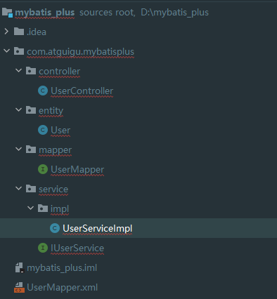

# Mybatis-Plus


# 一、Mybatis-Plus简介


[MyBatis-Plus (opens new window)](https://github.com/baomidou/mybatis-plus)（简称 MP）是一个 [MyBatis (opens new window)](https://www.mybatis.org/mybatis-3/)的增强工具，在 MyBatis 的基础上**只做增强不做改变**，为简化开发、提高效率而生。

## 1.简介 2.特性  3.支持数据库 4.框架结构 5.代码文档地址

[官网简介。]([简介 | MyBatis-Plus](https://www.mybatis-plus.com/guide/#特性))


# 二、入门案例

## 1.开发环境

IDE：idea 2021.3.2

JDK：JDK8+ 

构建工具：maven3.5.4 

MySQL版本：MySQL 8.0.26

Spring Boot：2.6.3 MyBatis-Plus：3.5.1

## 2.创建数据库及表

sql代码如下：

```sql
-- 创建数据库
create database mybatis_plus-test;
use mybatis_plus-test;
-- 创建表
CREATE DATABASE `mybatis_plus` /*!40100 DEFAULT CHARACTER SET utf8mb4 */;
use `mybatis_plus`;
CREATE TABLE `user` (
`id` bigint(20) NOT NULL COMMENT '主键ID',
`name` varchar(30) DEFAULT NULL COMMENT '姓名',
`age` int(11) DEFAULT NULL COMMENT '年龄',
`email` varchar(50) DEFAULT NULL COMMENT '邮箱',
PRIMARY KEY (`id`)
) ENGINE=InnoDB DEFAULT CHARSET=utf8;

-- 添加数据
INSERT INTO user (id, name, age, email) VALUES
(1, 'Jone', 18, 'test1@baomidou.com'),
(2, 'Jack', 20, 'test2@baomidou.com'),
(3, 'Tom', 28, 'test3@baomidou.com'),
(4, 'Sandy', 21, 'test4@baomidou.com'),
(5, 'Billie', 24, 'test5@baomidou.com');
```

## 3.Spring Boot 搭建

使用 Spring Initializr 快速初始化一个 Spring Boot 工程


### a 相关依赖

如何操作？在Mybatis的子项目中找操作文档。

```xml
<?xml version="1.0" encoding="UTF-8"?>
<project xmlns="http://maven.apache.org/POM/4.0.0" xmlns:xsi="http://www.w3.org/2001/XMLSchema-instance"
         xsi:schemaLocation="http://maven.apache.org/POM/4.0.0 https://maven.apache.org/xsd/maven-4.0.0.xsd">
    <modelVersion>4.0.0</modelVersion>
    <parent>
        <groupId>org.springframework.boot</groupId>
        <artifactId>spring-boot-starter-parent</artifactId>
        <version>2.7.0</version>
        <relativePath/> <!-- lookup parent from repository -->
    </parent>
    <groupId>com.example</groupId>
    <artifactId>mybatis_plus_test</artifactId>
    <version>0.0.1-SNAPSHOT</version>
    <name>mybatis_plus_test</name>
    <description>mybatis_plus_test</description>
    <properties>
        <java.version>1.8</java.version>
    </properties>
    <dependencies>
        <dependency>
            <groupId>org.springframework.boot</groupId>
            <artifactId>spring-boot-starter</artifactId>
        </dependency>
        <dependency>
            <groupId>com.baomidou</groupId>
            <artifactId>mybatis-plus-boot-starter</artifactId>
            <version>3.5.1</version>
        </dependency>
        <dependency>
            <groupId>org.projectlombok</groupId>
            <artifactId>lombok</artifactId>
            <optional>true</optional>
        </dependency>
        <dependency>
            <groupId>mysql</groupId>
            <artifactId>mysql-connector-java</artifactId>
            <scope>runtime</scope>
        </dependency>
        <dependency>
            <groupId>org.springframework.boot</groupId>
            <artifactId>spring-boot-starter-test</artifactId>
            <scope>test</scope>
        </dependency>

    </dependencies>

    <build>
        <plugins>
            <plugin>
                <groupId>org.springframework.boot</groupId>
                <artifactId>spring-boot-maven-plugin</artifactId>
                <configuration>
                    <excludes>
                        <exclude>
                            <groupId>org.projectlombok</groupId>
                            <artifactId>lombok</artifactId>
                        </exclude>
                    </excludes>
                </configuration>
            </plugin>
        </plugins>
    </build>

</project>

```

### b 配置application.yml

配置数据源，配置mybatis日志

```yml
#数据源
spring:
  datasource:
    type:  com.zaxxer.hikari.HikariDataSource
    url: jdbc:mysql://localhost:3306/mybatis_plus?TimeZone=&characterEncoding=utf8&useSSL=false
    username: root
    password: 123456
    driver-class-name: com.mysql.cj.jdbc.Driver
#输出日志
mybatis-plus:
  configuration:
    log-impl: org.apache.ibatis.logging.stdout.StdOutImpl

```


### c 启动类Mapper扫描

```java
package com.example.mybatis_plus_test;

import org.mybatis.spring.annotation.MapperScan;
import org.mybatis.spring.annotation.MapperScans;
import org.springframework.boot.SpringApplication;
import org.springframework.boot.autoconfigure.SpringBootApplication;

@SpringBootApplication
@MapperScan("com.example.mybatis_plus_test.mapper")
public class MybatisPlusTestApplication {

    public static void main(String[] args) {
        SpringApplication.run(MybatisPlusTestApplication.class, args);
    }

}

```

### d 实体类及mapper接口编写

**实体类**

```java
package com.example.mybatis_plus_test.pojo;

import lombok.AllArgsConstructor;
import lombok.Data;

@Data
@NoArgsConstructor
@AllArgsConstructor
public class User {
  	
    private Long id;
    private String name;
    private Integer age;
    private String email;

}

```

> 注意
>
> id为Long是由于[雪花算法]()待处理


**mapper接口**

```java
package com.example.mybatis_plus_test.mapper;

import com.baomidou.mybatisplus.core.mapper.BaseMapper;
import com.example.mybatis_plus_test.pojo.User;

public interface UserMapper extends BaseMapper<User> {
}

```

**UserService接口**

```java

```


测试结果：

```java
@SpringBootTest
public class UserMapperTest {
    @Autowired
    public UserMapper userMapper;
    @Test
    public void testCURD(){
        List<User> users = userMapper.selectList(null);
        users.forEach(System.out::println);

    }
}

控制台信息：
  
Creating a new SqlSession
SqlSession [org.apache.ibatis.session.defaults.DefaultSqlSession@5fbdc49b] was not registered for synchronization because synchronization is not active
2022-05-20 23:48:28.307  INFO 8920 --- [           main] com.zaxxer.hikari.HikariDataSource       : HikariPool-1 - Starting...
2022-05-20 23:48:28.639  INFO 8920 --- [           main] com.zaxxer.hikari.HikariDataSource       : HikariPool-1 - Start completed.
JDBC Connection [HikariProxyConnection@439078230 wrapping com.mysql.cj.jdbc.ConnectionImpl@68d7a2df] will not be managed by Spring
==>  Preparing: SELECT id,name,age,email FROM user
==> Parameters: 
<==    Columns: id, name, age, email
<==        Row: 1, Jone, 18, test1@baomidou.com
<==        Row: 2, Jack, 20, test2@baomidou.com
<==        Row: 3, Tom, 28, test3@baomidou.com
<==        Row: 4, Sandy, 21, test4@baomidou.com
<==        Row: 5, Billie, 24, test5@baomidou.com
<==      Total: 5
Closing non transactional SqlSession [org.apache.ibatis.session.defaults.DefaultSqlSession@5fbdc49b]
User(id=1, name=Jone, age=18, email=test1@baomidou.com)
User(id=2, name=Jack, age=20, email=test2@baomidou.com)
User(id=3, name=Tom, age=28, email=test3@baomidou.com)
User(id=4, name=Sandy, age=21, email=test4@baomidou.com)
User(id=5, name=Billie, age=24, email=test5@baomidou.com)
```


# 三、基本CRUD

## 1.Mapper CRUD 接口（BaseMapper）

Mybatis-Plus已实现了BaseMapper接口中的CRUD的方法，直接使用即可。

> 说明:
>
> - 通用 CRUD 封装[BaseMapper (opens new window)](https://gitee.com/baomidou/mybatis-plus/blob/3.0/mybatis-plus-core/src/main/java/com/baomidou/mybatisplus/core/mapper/BaseMapper.java)接口，为 `Mybatis-Plus` 启动时自动解析实体表关系映射转换为 `Mybatis` 内部对象注入容器
> - 泛型 `T` 为任意实体对象
> - 参数 `Serializable` 为任意类型主键 `Mybatis-Plus` 不推荐使用复合主键约定每一张表都有自己的唯一 `id` 主键
> - 对象 `Wrapper` 为 [条件构造器](https://www.mybatis-plus.com/guide/wrapper.html)

```java
package com.example.mybatis_plus_test.mapper;

import com.baomidou.mybatisplus.core.mapper.BaseMapper;
import com.example.mybatis_plus_test.pojo.User;

public interface UserMapper extends BaseMapper<User> {

}

```

### a 已经实现的CRUD

#### Insert

**接口：**

```java
// 插入一条记录
int insert(T entity);
```

测试：

```java
    @Test
    public void testC(){
        //插入只有一个方法
        User user = new User();
        user.setAge(18);
        user.setEmail("1104432863@qq.com");
        user.setName("Tom");
        int insert = userMapper.insert(user);
    }

Creating a new SqlSession
SqlSession [org.apache.ibatis.session.defaults.DefaultSqlSession@62db0521] was not registered for synchronization because synchronization is not active
2022-05-21 00:19:16.461  INFO 12580 --- [           main] com.zaxxer.hikari.HikariDataSource       : HikariPool-1 - Starting...
2022-05-21 00:19:16.682  INFO 12580 --- [           main] com.zaxxer.hikari.HikariDataSource       : HikariPool-1 - Start completed.
JDBC Connection [HikariProxyConnection@1260390769 wrapping com.mysql.cj.jdbc.ConnectionImpl@1a2bcd56] will not be managed by Spring
==>  Preparing: INSERT INTO user ( id, name, age, email ) VALUES ( ?, ?, ?, ? )
==> Parameters: 1527685397552865281(Long), Tom(String), 18(Integer), 1104432863@qq.com(String)
<==    Updates: 1
Closing non transactional SqlSession [org.apache.ibatis.session.defaults.DefaultSqlSession@62db0521]
```

#### Delete

**接口：**

```java
// 根据 entity 条件，删除记录
int delete(@Param(Constants.WRAPPER) Wrapper<T> wrapper);
// 删除（根据ID 批量删除）
int deleteBatchIds(@Param(Constants.COLLECTION) Collection<? extends Serializable> idList);
// 根据 ID 删除
int deleteById(Serializable id);
// 根据 columnMap 条件，删除记录
int deleteByMap(@Param(Constants.COLUMN_MAP) Map<String, Object> columnMap);
```

#### Update

**接口：**

```java
// 根据 whereWrapper 条件，更新记录
int update(@Param(Constants.ENTITY) T updateEntity, @Param(Constants.WRAPPER) Wrapper<T> whereWrapper);
// 根据 ID 修改
int updateById(@Param(Constants.ENTITY) T entity);
```

#### Select

**接口：**

```java
// 根据 ID 查询
T selectById(Serializable id);
// 根据 entity 条件，查询一条记录
T selectOne(@Param(Constants.WRAPPER) Wrapper<T> queryWrapper);

// 查询（根据ID 批量查询）
List<T> selectBatchIds(@Param(Constants.COLLECTION) Collection<? extends Serializable> idList);
// 根据 entity 条件，查询全部记录
List<T> selectList(@Param(Constants.WRAPPER) Wrapper<T> queryWrapper);
// 查询（根据 columnMap 条件）
List<T> selectByMap(@Param(Constants.COLUMN_MAP) Map<String, Object> columnMap);
// 根据 Wrapper 条件，查询全部记录
List<Map<String, Object>> selectMaps(@Param(Constants.WRAPPER) Wrapper<T> queryWrapper);
// 根据 Wrapper 条件，查询全部记录。注意： 只返回第一个字段的值
List<Object> selectObjs(@Param(Constants.WRAPPER) Wrapper<T> queryWrapper);

// 根据 entity 条件，查询全部记录（并翻页）
IPage<T> selectPage(IPage<T> page, @Param(Constants.WRAPPER) Wrapper<T> queryWrapper);
// 根据 Wrapper 条件，查询全部记录（并翻页）
IPage<Map<String, Object>> selectMapsPage(IPage<T> page, @Param(Constants.WRAPPER) Wrapper<T> queryWrapper);
// 根据 Wrapper 条件，查询总记录数
Integer selectCount(@Param(Constants.WRAPPER) Wrapper<T> queryWrapper);
```


## 2.Service CRUD 接口 （IService ServiceImpl）

> - 通用 Service CRUD 封装[IService (opens new window)](https://gitee.com/baomidou/mybatis-plus/blob/3.0/mybatis-plus-extension/src/main/java/com/baomidou/mybatisplus/extension/service/IService.java)接口，进一步封装 CRUD 采用 `get 查询单行` `remove 删除` `list 查询集合` `page 分页` 前缀命名方式区分 `Mapper` 层避免混淆，
> - 泛型 `T` 为任意实体对象
> - 建议如果存在自定义通用 Service 方法的可能，请创建**自己的** `IBaseService` 继承 `Mybatis-Plus` 提供的基类
> - 对象 `Wrapper` 为 [条件构造器](https://www.mybatis-plus.com/guide/wrapper.html)

```java
package com.example.mybatis_plus_test.service;

import com.baomidou.mybatisplus.extension.service.IService;
import com.example.mybatis_plus_test.pojo.User;

public interface IUserService extends IService<User> {
}

```

```java
package com.example.mybatis_plus_test.service.impl;

import com.baomidou.mybatisplus.extension.service.impl.ServiceImpl;
import com.example.mybatis_plus_test.mapper.UserMapper;
import com.example.mybatis_plus_test.pojo.User;
import com.example.mybatis_plus_test.service.IUserService;

public class UserServiceImpl extends ServiceImpl<UserMapper,User> implements IUserService{
}

```

# 四、常用注解

**以下注解遵循 实体类的驼峰命名（包括大小驼峰）转为下划线命名的规则。（下文规则说的是这里的规则）**

## 1、@TableName


目的：保证实体类名与数据库中表名一致，或规则命名符合。（这里规则说的是上文规则）

解决方式：

1. 按照规则命名就行，不需要注解。

2. 通过设置实体类注解@tableName的value为表名

   ```java
   @Data
   @NoArgsConstructor
   @AllArgsConstructor
   @TableName("th_user")
   public class User {
       private Long id;
       private String name;
       private Integer age;
       private String email;
   
   }
   TestResult：
     SELECT id,name,age,email FROM th_user
   ```

   

3. 通过设置全局配置

   ```yml
   mybatis-plus:
     global-config:
       db-config:
         table-prefix: th_
         
         
     TestResult：
     SELECT id,name,age,email FROM th_user
   ```

## 2、@TableId

MyBatis-Plus在实现CRUD时，会==默认==将<font color='green'>实体属性名id</font>作为主键列，并在插入数据时，`默认`==基于雪花算法的策略生成id==

目的：保证实体属性字段与主键字段一致，或规则命名符合。（这里规则说的是上文规则）

解决方式：

1. 按照规则命名就行，不需要注解
   2. 通过在实体主键属性设置注解@TableId的value值为主键字段名

### a @TableId的Type属性

```java
@Getter
public enum IdType {
    /**
     * 数据库ID自增
     * <p>该类型请确保数据库设置了 ID自增 否则无效</p>
     */
    AUTO(0),
    /**
     * 该类型为未设置主键类型(注解里等于跟随全局,全局默认 ASSIGN_ID)
     */
    NONE(1),
    /**
     * 用户输入ID
     * <p>该类型可以通过自己注册自动填充插件进行填充</p>
     */
    INPUT(2),

    /* 以下3种类型、只有当插入对象ID 为空，才自动填充。 */
    /**
     * 分配ID (主键类型为number或string）,
     * 默认实现类 {@link com.baomidou.mybatisplus.core.incrementer.DefaultIdentifierGenerator}(雪花算法)
     *
     * @since 3.3.0
     */
    ASSIGN_ID(3),
    /**
     * 分配UUID (主键类型为 string)
     * 默认实现类 {@link com.baomidou.mybatisplus.core.incrementer.DefaultIdentifierGenerator}(UUID.replace("-",""))
     */
    ASSIGN_UUID(4);

    private final int key;

    IdType(int key) {
        this.key = key;
    }
}

```

### b 雪花算法

> #### 背景

需要选择合适的方案去应对数据规模的增长，以应对主键增长的访问压力和数据量。

数据库的扩展方式主要包括：业务分库、主从复制，数据库分表。

> #### 数据库分表

单表数据拆分有两种方式：垂直分表和水平分表。示意图如下：


1. ##### 垂直分表

垂直分表适合将表中某些不常用且占了大量空间的列拆出去。

1. ##### 水平分表

水平分表适合行数特别大的表，有的公司要求单表行数超过5000万九必须进行分表，这个数字可以作为参考，但并不是绝对标准，关键还是要看表的访问性能。对于一些比较复杂的表，可能超过1000万就要分表了，而对于一些简单的表，即使存储数据超过1亿行，也可以不分表。

但不管怎么样当看到表的数据量达到千万级别时，作为架构师就要警觉起来，因为这很可能时架构的性能瓶颈或者隐患。

<font color='green'>水平分表相比垂直分表，会引入更多的复杂性，例如要求全局唯一的数据id该如何处理：</font>

> ###### 主键自增

①以最常见的用户 ID 为例，可以按照 1000000 的范围大小进行分段，1 ~ 999999 放到表 1中， 1000000 ~ 1999999 放到表2中，以此类推。

②**复杂点：**分段大小的选取。分段太小会导致切分后子表数量过多，增加维护复杂度；分段太大可能会 导致单表依然存在性能问题，一般建议分段大小在 100 万至 2000 万之间，具体需要根据业务选取合适 的分段大小。 

③**优点：**可以随着数据的增加平滑地扩充新的表。例如，现在的用户是 100 万，如果增加到 1000 万， 只需要增加新的表就可以了，原有的数据不需要动。 ④缺点：分布不均匀。假如按照 1000 万来进行分表，有可能某个分段实际存储的数据量只有 1 条，而 另外一个分段实际存储的数据量有 1000 万条。

> ###### 取模

①同样以用户 ID 为例，假如我们一开始就规划了 10 个数据库表，可以简单地用 user_id % 10 的值来 表示数据所属的数据库表编号，ID 为 985 的用户放到编号为 5 的子表中，ID 为 10086 的用户放到编号 为 6 的子表中。 ②复杂点：初始表数量的确定。表数量太多维护比较麻烦，表数量太少又可能导致单表性能存在问题。 ③优点：表分布比较均匀。 ④缺点：扩充新的表很麻烦，所有数据都要重分布。

②**复杂点：**初始表数量的确定。表数量太多维护比较麻烦，表数量太少又可能导致单表性能存在问题。 

③**优点：**表分布比较均匀。 ④缺点：扩充新的表很麻烦，所有数据都要重分布。

> ###### 雪花算法

雪花算法是由Twitter公布的分布式主键生成算法，它能够保证不同表的主键的不重复性，以及相同表的 主键的有序性。

①**核心思想：** 

* 长度共64bit（一个long型）。 

* 首先是一个符号位，1bit标识，由于long基本类型在Java中是带符号的，最高位是符号位，正数是0，负 数是1，所以id一般是正数，最高位是0。

* 41bit时间截(毫秒级)，存储的是时间截的差值（当前时间截 - 开始时间截)，结果约等于69.73年。 
* 10bit作为机器的ID（5个bit是数据中心，5个bit的机器ID，可以部署在1024个节点）。
* 12bit作为毫秒内的流水号（意味着每个节点在每毫秒可以产生 4096 个 ID）。


②**优点：**整体上按照时间自增排序，并且整个分布式系统内不会产生ID碰撞，并且效率较高。


## 3、@TableField

目的：保证实体类属性与数据库中表字段一致，或规则命名符合。

解决方式：

1. 按照规则命名就行，不需要注解
2. 通过设置实体类非主键属性注解@tableField的value为普通字段名

```java
@Data
@NoArgsConstructor
@AllArgsConstructor
public class User {
    private Long id;
    @TableField("name")
    private String xx;
    private Integer age;
    private String email;
}

TestResult:
SELECT id,name AS xx,age,email FROM user
```


## 4、@TableLogic

### a 逻辑删除：

* 物理删除：真实删除，将对应数据从数据库中删除
* 逻辑删除：假删除，修改代表删除的状态字段。
* 使用场景：数据恢复

```java
public @interface TableLogic {

    /**
     * 默认逻辑未删除值（该值可无、会自动获取全局配置）
     */
    String value() default "";

    /**
     * 默认逻辑删除值（该值可无、会自动获取全局配置）
     */
    String delval() default "";
}
```


> 注意

注意以下boolean 类型 和tinyint

### b 实现逻辑删除步骤：

> ###### step 1

执行sql语句，添加状态字段。

```sql
alter table user add column is_delete boolean default false
```

> ###### step 2

```java
@Data
@NoArgsConstructor
@AllArgsConstructor
public class User {
    private Long id;
    private String name;
    private Integer age;
    private String email;
    @TableLogic
    private boolean isDelete;
}

```

> ###### step 3

测试删除功能：（服务层接口或数据访问层接口）

```java
userMapper.deleteById(1529858049893744642L);

TestResult:
UPDATE user SET is_delete=1 WHERE id=? AND is_delete=0
```

测试查询功能：（）

```java
List<User> users = userService.list();

TestResult:
SELECT id,name,age,email,is_delete FROM th_user WHERE is_delete=0
```

# 五、条件构造器

## 1、Wrapper


* Wrapper：条件构造抽象类，最顶端父类
  * Abstractwrapper：
    * QueryWrapper：查询条件封装、查询字段封装等
    * UPdateWrapper：更新条件封装，更新字段封装等
    * AbstractLambdaWrapper：使用Lambda语法
      * LambdaQueryWrapper：
      * LambdaUpdateWrapper：

## 2、QueryWrapper

### a例 组装查询条件

```java
@Test
    public void test01(){
        /**
         * 查询用户名包含a，年龄在20到30之间，并且邮箱不为null的用户信息
         *         SELECT id,name,age,email,is_delete FROM th_user WHERE
         *                 is_delete=0 AND (name LIKE ? AND age BETWEEN ? AND ? AND email IS NOT NULL)
         */
        QueryWrapper<User> wrapper = new QueryWrapper<>( );
        wrapper.like("name","a")
                .between("age",20,30)
                .isNotNull("email");
        List<User> users = userMapper.selectList(wrapper);
        users.forEach(System.out::println);
    }
```

### b例 组装排序条件

```java
    @Test
    public void test02(){
        /**
         * 按年龄降序查询用户，如果年龄相同则按id升序排列
         * SELECT id,name,age,email,is_delete FROM th_user WHERE is_delete=0 ORDER BY age DESC,id ASC
         */
        QueryWrapper<User> queryWrapper=new QueryWrapper<>(  );
        queryWrapper.orderByDesc("age").orderByAsc("id");
        List<User> users = userMapper.selectList(queryWrapper);
        users.forEach(System.out::println);
    }
```


### c例 组装删除条件

```java
@Test
    public void test03(){
        /**
         * 逻辑删除email为空的用户
         * UPDATE th_user SET is_delete=1 WHERE is_delete=0 AND (email IS NULL)
         */
        QueryWrapper<User> objectQueryWrapper = new QueryWrapper<>( );
        objectQueryWrapper.isNull("email");
        int delete = userMapper.delete(objectQueryWrapper);
        System.out.println("受影响的行数："+delete);
    }
```


### d例 条件的优先级

```java
/**条件的优先级
         * 将用户名中包含有a并且（年龄大于20或邮箱为null）的用户信息修改
         * UPDATE th_user SET age=? WHERE is_delete=0 AND (name LIKE ? AND (age > ? OR email IS NULL))
         *
         */
        QueryWrapper<User> objectQueryWrapper = new QueryWrapper<>( );
        objectQueryWrapper.like("name","a")
                .and(i -> i.gt("age",20).or().isNull("email"));
        User user =new User(  );
        user.setAge(200);
        int update = userMapper.update(user, objectQueryWrapper);//注意这是自动填充：该实体类不为空的属性数据填充到set字段
        System.out.println("受影响的行数"+update);
```


### e例 组装select子句

```java
@Test
    public void test06(){
        /**
         * 组装select子句
         */
        //查询用户信息的name字段和age字段
//        SELECT username,age FROM t_user
        QueryWrapper<User> userQueryWrapper=new QueryWrapper<>(  );
        userQueryWrapper.select("name","age");
        List<User> users = userMapper.selectList(userQueryWrapper);
        users.forEach(System.out::println);
    }
```

### f例 实现子查询

```java
    @Test
    public void test022(){
        /**
         * 查询id小于等于3的用户信息
         *
         */
        QueryWrapper<User> queryWrapper=new QueryWrapper<>(  );
        queryWrapper.inSql("id","select id from t_user where id <=3");
        List<User> users = userMapper.selectList(queryWrapper);
        users.forEach(System.out::println);
    }
```

## 3、UpdateWrapper

```java
    @Test
    public void test292(){
        /**
         * updateWrapper
         * 将（年龄大于20或邮箱为null）并且用户名中包含有a的用户信息修改
         * 组装set子句以及修改条件
         *
         */
        UpdateWrapper<User> updateWrapper=new UpdateWrapper<>(  );
        updateWrapper.set("age",18);
        updateWrapper.set("email","110232@qq.com");
        updateWrapper.like("name","a")
                .and(i->i.gt("age",20).or().isNull("email"));
        int result = userMapper.update(null, updateWrapper);
        System.out.println(result);

//UPDATE t_user SET username=?, age=?,email=? WHERE (username LIKE ? AND
//        (age > ? OR email IS NULL))
        //User user = new User();
        //user.setName("张三");
//这里必须要创建User对象，否则无法应用自动填充。如果没有自动填充，可以设置为null
//int result = userMapper.update(user, updateWrapper);
//UPDATE t_user SET age=?,email=? WHERE (username LIKE ? AND (age > ? OR
//        email IS NULL))


    }
```

## 4、condition（组装条件）

在进行更新或查询条件组装前，的一些条件判断。（如判空）

```java
    @Test
    public void test203(){
            //定义查询条件
        String name=null;
        Integer ageBegin=10;
        Integer ageEnd=24;
        QueryWrapper<User> queryWrapper =new QueryWrapper<>(  );
        queryWrapper
                .like(StringUtils.isNotBlank(name),"name","a")
                .ge(ageBegin!=null,"age",ageBegin)
                .le(ageEnd!=null,"age",ageEnd);
        List<User> users = userMapper.selectList(queryWrapper);
        users.forEach(System.out::println);
    }
```

## 5、LambdaQueryWrapper

```java
@Test
public void test09() {
//定义查询条件，有可能为null（用户未输入）
String username = "a";
Integer ageBegin = 10;
Integer ageEnd = 24;
LambdaQueryWrapper<User> queryWrapper = new LambdaQueryWrapper<>();
//避免使用字符串表示字段，防止运行时错误
queryWrapper
.like(StringUtils.isNotBlank(username), User::getName, username)
.ge(ageBegin != null, User::getAge, ageBegin)
.le(ageEnd != null, User::getAge, ageEnd);
List<User> users = userMapper.selectList(queryWrapper);
users.forEach(System.out::println);
}
```

## 6、LambdaUpdateWrapper

```java
@Test
public void test10() {
  //组装set子句
  LambdaUpdateWrapper<User> updateWrapper = new LambdaUpdateWrapper<>();
  updateWrapper
  .set(User::getAge, 18)
  .set(User::getEmail, "user@atguigu.com")
  .like(User::getName, "a")
  .and(i -> i.lt(User::getAge, 24).or().isNull(User::getEmail)); //lambda
  表达式内的逻辑优先运算
  User user = new User();
  int result = userMapper.update(user, updateWrapper);
  System.out.println("受影响的行数：" + result);
}

```

# 六、插件

## 1、分页插件

MyBatis Plus自带分页插件，只要简单的配置即可实现分页功能

### a 添加配置类

```java
@Configuration
@MapperScan("com.example.mybatis_plus_test.mapper")
public class MyBatisPlusConfig {

    @Bean
    public MybatisPlusInterceptor mybatisPlusInterceptor(){
        MybatisPlusInterceptor mybatisPlusInterceptor = new MybatisPlusInterceptor( );
        mybatisPlusInterceptor.addInnerInterceptor(new PaginationInnerInterceptor(DbType.MYSQL));
        return mybatisPlusInterceptor;
    }
}
```

### b 测试

```java
@Test
    public void test1232(){
        Page<User> page=new Page<>(2,3  );//当前页和每页显示的条数
        Page<User> page1 = userMapper.selectPage(page, null);
        //page和page1为同一个对象
        System.out.println("xxxxxx:"+page );
        System.out.println("yyyyy:"+page1 );

        List<User> records = page.getRecords( );
        records.forEach(System.out::println);
        System.out.println("获取当前页："+page.getCurrent() );
        System.out.println("每页显示的条数："+page.getSize() );
        System.out.println("总记录数："+page.getTotal() );
        System.out.println("总页数："+page.getPages() );
        System.out.println("是否有上一页："+page.hasPrevious() );
        System.out.println("是否有下一页："+page.hasNext() );


    }
TestResult:

  Creating a new SqlSession
SqlSession [org.apache.ibatis.session.defaults.DefaultSqlSession@481e91b6] was not registered for synchronization because synchronization is not active
2022-06-12 11:27:57.729  INFO 14116 --- [           main] com.zaxxer.hikari.HikariDataSource       : HikariPool-1 - Starting...
2022-06-12 11:27:57.973  INFO 14116 --- [           main] com.zaxxer.hikari.HikariDataSource       : HikariPool-1 - Start completed.
JDBC Connection [HikariProxyConnection@220689785 wrapping com.mysql.cj.jdbc.ConnectionImpl@5db6b845] will not be managed by Spring
==>  Preparing: SELECT COUNT(*) AS total FROM th_user WHERE is_delete = 0
==> Parameters: 
<==    Columns: total
<==        Row: 6
<==      Total: 1
==>  Preparing: SELECT id,name,age,email,is_delete FROM th_user WHERE is_delete=0 LIMIT ?,?
==> Parameters: 3(Long), 3(Long)
<==    Columns: id, name, age, email, is_delete
<==        Row: 4, Sandy, 17, 1109442@qq.com, 0
<==        Row: 5, Billie, 24, test5@baomidou.com, 0
<==        Row: 7, Billi, 24, test5@baomidou.com, 0
<==      Total: 3
Closing non transactional SqlSession [org.apache.ibatis.session.defaults.DefaultSqlSession@481e91b6]
xxxxxx:com.baomidou.mybatisplus.extension.plugins.pagination.Page@4f5b08d
yyyyy:com.baomidou.mybatisplus.extension.plugins.pagination.Page@4f5b08d
User(id=4, name=Sandy, age=17, email=1109442@qq.com, isDelete=false)
User(id=5, name=Billie, age=24, email=test5@baomidou.com, isDelete=false)
User(id=7, name=Billi, age=24, email=test5@baomidou.com, isDelete=false)
获取当前页：2
每页显示的条数：3
总记录数：6
总页数：2
是否有上一页：true
是否有下一页：false

```

## 2、自定义分页功能（如 条件分页）

### 例1：

> #### a 自定义mapper接口

```java
//传递参数 Page 即自动分页,（非必须放在第一位，测过不知道为什么必须。 待处理    ）
public void selectPageVo(@Param("page") Page<User> page,@Param("age") Integer age);
//或
public Page<User> selectPageVo(@Param("page") Page<User> page,@Param("age") Integer age);
```

> #### b mapper文件

```xml
<?xml version="1.0" encoding="UTF-8"?>
<!DOCTYPE mapper PUBLIC "-//mybatis.org//DTD Mapper 3.0//EN" "http://mybatis.org/dtd/mybatis-3-mapper.dtd">
<mapper namespace="com.example.mybatis_plus_test.mapper.UserMapper">
    <select id="selectPageVo" resultType="com.example.mybatis_plus_test.pojo.User">
        select * from th_user where age>#{age}
    </select>
   

< /mapper>
```

> #### c 测试

```java
    @Test
    public void test1233(){
        Page<User> page = new Page<>(2, 2);
        userMapper.selectPageVo(page, 20);
        List<User> list = page.getRecords();
        list.forEach(System.out::println);
        System.out.println("当前页："+page.getCurrent());
        System.out.println("每页显示的条数："+page.getSize());
        System.out.println("总记录数："+page.getTotal());
        System.out.println("总页数："+page.getPages());
        System.out.println("是否有上一页："+page.hasPrevious());
        System.out.println("是否有下一页："+page.hasNext());
    }
```

### 例2：

#### a 自定义mapper接口（如何自定义使用Wrapper）

```java
/**
     * //@Param(Constants.WRAPPER)的值是 ew
     * 
     * @param wrapper
     * @param page
     * @return
     */
public Page<User> selectPageImpl(@Param(Constants.WRAPPER) Wrapper<User> wrapper, @Param("page") Page<User> page);

```

#### b mapper文件

```xml
<?xml version="1.0" encoding="UTF-8"?>
<!DOCTYPE mapper PUBLIC "-//mybatis.org//DTD Mapper 3.0//EN" "http://mybatis.org/dtd/mybatis-3-mapper.dtd">
<mapper namespace="com.example.mybatis_plus_test.mapper.UserMapper">
   
    <select id="selectPageImpl" resultType="com.example.mybatis_plus_test.pojo.User">
        select * from th_user  ${ew.customSqlSegment}
      <!--customSqlSegment 未知 待处理-->
    </select>

</mapper>
```

#### c 测试

```java
 @Test
    public void test123sdd3(){
        Page<User> page = new Page<>(2, 2);
        LambdaQueryWrapper<User> lambdaQueryWrapper=new LambdaQueryWrapper<>(  );
        lambdaQueryWrapper.gt(User::getAge,20);
        userMapper.selectPageImpl(lambdaQueryWrapper,page);
        List<User> list = page.getRecords();
        list.forEach(System.out::println);
        System.out.println("当前页："+page.getCurrent());
        System.out.println("每页显示的条数："+page.getSize());
        System.out.println("总记录数："+page.getTotal());
        System.out.println("总页数："+page.getPages());
        System.out.println("是否有上一页："+page.hasPrevious());
        System.out.println("是否有下一页："+page.hasNext());
    }
```

## 3、乐观锁

### a 场景

> 一件商品，成本价是80元，售价是100元。老板先是通知小李，说你去把商品价格增加50元。小 李正在玩游戏，耽搁了一个小时。正好一个小时后，老板觉得商品价格增加到150元，价格太 高，可能会影响销量。又通知小王，你把商品价格降低30元。 此时，小李和小王同时操作商品后台系统。小李操作的时候，系统先取出商品价格100元；小王 也在操作，取出的商品价格也是100元。小李将价格加了50元，并将100+50=150元存入了数据 库；小王将商品减了30元，并将100-30=70元存入了数据库。是的，如果没有锁，小李的操作就 完全被小王的覆盖了。 现在商品价格是70元，比成本价低10元。几分钟后，这个商品很快出售了1千多件商品，老板亏1 万多。

### b 乐观锁与悲观锁概念


- 乐观锁：乐观锁在操作数据时非常乐观，认为别人不会同时修改数据。因此乐观锁不会上锁，只是在执行更新的时候判断一下在此期间别人是否修改了数据：如果别人修改了数据则放弃操作，否则执行操作。
- 悲观锁：悲观锁在操作数据时比较悲观，认为别人会同时修改数据。因此操作数据时直接把数据锁住，直到操作完成后才会释放锁；上锁期间其他人不能修改数据。
- 实现方式
  - 悲观锁的实现方式是加锁，加锁既可以是对代码块加锁（如Java的synchronized关键字），也可以是对数据加锁（如MySQL中的排它锁）。
  - 乐观锁的实现方式主要有两种：CAS机制和版本号机制，下面详细介绍。


> 上面的故事，如果是乐观锁，小王保存价格前，会检查下价格是否被人修改过了。如果被修改过了，则重新取出的被修改后的价格，150元，这样他会将120元存入数据库。 如果是悲观锁，小李取出数据后，小王只能等小李操作完之后，才能对价格进行操作，也会保证 最终的价格是120元。


### c 乐观锁实现流程

> ##### 数据库中增加商品表

```mysql
CREATE TABLE t_product
(
id BIGINT(20) NOT NULL COMMENT '主键ID',
NAME VARCHAR(30) NULL DEFAULT NULL COMMENT '商品名称',
price INT(11) DEFAULT 0 COMMENT '价格',
VERSION INT(11) DEFAULT 0 COMMENT '乐观锁版本号',
PRIMARY KEY (id)
);

```

> ##### 添加数据

```mysql
INSERT INTO t_product (id, NAME, price) VALUES (1, '外星人笔记本', 100);

```

> ##### 添加实体

```java
package com.atguigu.mybatisplus.entity;
import lombok.Data;
@Data
public class Product {
private Long id;
private String name;
private Integer price;
private Integer version;
}
```

> ##### 添加mapper

```java
public interface ProductMapper extends BaseMapper<Producct>{
}
```

数据库中添加version字段 取出记录时，获取当前version

```mysql
SELECT id,name,price,version FROM product WHERE id=1
```

更新时，version+1，如果where语句中的version版本不对，则更新失败

```mysql
UPDATE product SET price=price+50,version=version+1 WHERE id=1 AND version=1
```


### d Mybatis-Plus实现乐观锁

> ##### 修改实体类

```java
package com.atguigu.mybatisplus.entity;
import com.baomidou.mybatisplus.annotation.Version;
import lombok.Data;
@Data
public class Product {
private Long id;
private String name;
private Integer price;
@Version //关键
private Integer version;
}

```

> ##### 添加乐观锁插件配置

```java
@Configuration
public class MybatisPlusConfig{
  @Bean
  public MybatisPlusInterceptor mybatisPlusInterceptor(){
    //添加分页插件
    interceptor.addInnerInterceptor(new PaginationInnerInterceptor(DbType.MYSQL));
    //添加乐观锁插件
    interceptor.addInnerInterceptor(new OptimisticLockerInnerInterceptor());
  }
}
```

> ##### 流程

```java
@Test
    public void test12323(){
        //小王获取数据
        Product product1 = productMapper.selectById(1L);
        //小李获取数据
        Product product2 = productMapper.selectById(1L);

        product1.setPrice(product1.getPrice()+50);
        //小王修改+50
        int a1 = productMapper.updateById(product1);
        System.out.println("小王修改："+a1 );

        product1.setPrice(product1.getPrice()-30);
        //小李修改+50
        int a2 = productMapper.updateById(product2);
        System.out.println("小李修改："+a2 );
        System.out.println("最终价格："+productMapper.selectById(1L).getPrice() );
    }
```

结果：

```mysql
Creating a new SqlSession
SqlSession [org.apache.ibatis.session.defaults.DefaultSqlSession@6cd164a6] was not registered for synchronization because synchronization is not active
2022-06-16 21:06:12.845  INFO 13204 --- [           main] com.zaxxer.hikari.HikariDataSource       : HikariPool-1 - Starting...
2022-06-16 21:06:13.087  INFO 13204 --- [           main] com.zaxxer.hikari.HikariDataSource       : HikariPool-1 - Start completed.
JDBC Connection [HikariProxyConnection@253558788 wrapping com.mysql.cj.jdbc.ConnectionImpl@6e4f263e] will not be managed by Spring
==>  Preparing: SELECT id,name,price,version FROM t_product WHERE id=?
==> Parameters: 1(Long)
<==    Columns: id, name, price, version
<==        Row: 1, 外星人笔记本, 100, 2
<==      Total: 1
Closing non transactional SqlSession [org.apache.ibatis.session.defaults.DefaultSqlSession@6cd164a6]
Creating a new SqlSession
SqlSession [org.apache.ibatis.session.defaults.DefaultSqlSession@5f254608] was not registered for synchronization because synchronization is not active
JDBC Connection [HikariProxyConnection@787156891 wrapping com.mysql.cj.jdbc.ConnectionImpl@6e4f263e] will not be managed by Spring
==>  Preparing: SELECT id,name,price,version FROM t_product WHERE id=?
==> Parameters: 1(Long)
<==    Columns: id, name, price, version
<==        Row: 1, 外星人笔记本, 100, 2
<==      Total: 1
Closing non transactional SqlSession [org.apache.ibatis.session.defaults.DefaultSqlSession@5f254608]
Creating a new SqlSession
SqlSession [org.apache.ibatis.session.defaults.DefaultSqlSession@55d58825] was not registered for synchronization because synchronization is not active
JDBC Connection [HikariProxyConnection@423095039 wrapping com.mysql.cj.jdbc.ConnectionImpl@6e4f263e] will not be managed by Spring
==>  Preparing: UPDATE t_product SET name=?, price=?, version=? WHERE id=? AND version=?
==> Parameters: 外星人笔记本(String), 150(Integer), 3(Integer), 1(Long), 2(Integer)
<==    Updates: 1
Closing non transactional SqlSession [org.apache.ibatis.session.defaults.DefaultSqlSession@55d58825]
小王修改：1
Creating a new SqlSession
SqlSession [org.apache.ibatis.session.defaults.DefaultSqlSession@2373ad99] was not registered for synchronization because synchronization is not active
JDBC Connection [HikariProxyConnection@862146308 wrapping com.mysql.cj.jdbc.ConnectionImpl@6e4f263e] will not be managed by Spring
==>  Preparing: UPDATE t_product SET name=?, price=?, version=? WHERE id=? AND version=?
==> Parameters: 外星人笔记本(String), 100(Integer), 3(Integer), 1(Long), 2(Integer)
<==    Updates: 0
Closing non transactional SqlSession [org.apache.ibatis.session.defaults.DefaultSqlSession@2373ad99]
小李修改：0
Creating a new SqlSession
SqlSession [org.apache.ibatis.session.defaults.DefaultSqlSession@7601bc96] was not registered for synchronization because synchronization is not active
JDBC Connection [HikariProxyConnection@1218496682 wrapping com.mysql.cj.jdbc.ConnectionImpl@6e4f263e] will not be managed by Spring
==>  Preparing: SELECT id,name,price,version FROM t_product WHERE id=?
==> Parameters: 1(Long)
<==    Columns: id, name, price, version
<==        Row: 1, 外星人笔记本, 150, 3
<==      Total: 1
Closing non transactional SqlSession [org.apache.ibatis.session.defaults.DefaultSqlSession@7601bc96]
最终价格：150
```

# 七、通用枚举

## a、数据库添加字段

```mysql
ALTER TABLE t_user ADD COLUMN sex int DEFAULT 0;
```

## b、添加枚举类

```java
@Getter
public enum SexEnum {
    FEMALE(0,"女"),
    MALE(1,"男");

    @EnumValue//	标注那个属性写入数据库。 					注意：必要
    private Integer sex;
    private String sexName;

    SexEnum(Integer sex, String sexName) {
        this.sex=sex;
        this.sexName=sexName;
    }
}
```

## c、配置扫描通用枚举

application.yml:

```yml
type-enums-package: com.example.mybatis_plus_test.enums
```

## d、修改实体类

字段属性修改为枚举类型。

```java
private SexEnum sex;
```

## e、测试

```java
		@Test
    public void test213(){
        User user = new User( );
        user.setId(2L);
      //
        user.setSex(SexEnum.MALE);
      //
        System.out.println("更新result："+userMapper.updateById(user) );
    }

TestResult:

Creating a new SqlSession
SqlSession [org.apache.ibatis.session.defaults.DefaultSqlSession@39c385d6] was not registered for synchronization because synchronization is not active
2022-06-16 22:08:12.819  INFO 10072 --- [           main] com.zaxxer.hikari.HikariDataSource       : HikariPool-1 - Starting...
2022-06-16 22:08:13.046  INFO 10072 --- [           main] com.zaxxer.hikari.HikariDataSource       : HikariPool-1 - Start completed.
JDBC Connection [HikariProxyConnection@2136291489 wrapping com.mysql.cj.jdbc.ConnectionImpl@72fd8a3c] will not be managed by Spring
==>  Preparing: UPDATE t_user SET sex=? WHERE id=? AND is_delete=0
==> Parameters: true(Boolean), 2(Long)
<==    Updates: 1
Closing non transactional SqlSession [org.apache.ibatis.session.defaults.DefaultSqlSession@39c385d6]
更新result：1

```

# 八、代码生成器

## 1、步骤

1. 引入依赖

   ```xml
   <dependency>
     <groupId>com.baomidou</groupId>
     <artifactId>mybatis-plus-generator</artifactId>
     <version>3.5.1</version>
   </dependency>	
   <dependency>
     <groupId>org.freemarker</groupId>
     <artifactId>freemarker</artifactId>
     <version>2.3.31</version>
   </dependency>
   ```

2. 快速生成

   ```java
   package com.example.mybatis_plus_test;
   
   import com.baomidou.mybatisplus.generator.FastAutoGenerator;
   import com.baomidou.mybatisplus.generator.config.OutputFile;
   import com.baomidou.mybatisplus.generator.engine.FreemarkerTemplateEngine;
   
   import java.util.Collections;
   
   public class FastAutoGenneratorTest {
       public static void main(String[] args) {
           FastAutoGenerator.create(
                   "jdbc:mysql://127.0.0.1:3306/mybatis_plus?" +
                           "characterEncoding=utf-8&userSSL=false", "wujianmin", "123456")
                           .globalConfig(builder -> {
                               builder.author("atguigu") // 设置作者
   //.enableSwagger() // 开启 swagger 模式
                                 .fileOverride() // 覆盖已生成文件
                                 .outputDir("D://mybatis_plus");// 指定输出目录（要存在）
                           })
                           .packageConfig(builder -> {
                               builder.parent("com.atguigu") // 设置父包名
                                       .moduleName("mybatisplus") // 设置父包模块名
                                       .pathInfo(Collections.singletonMap(OutputFile.mapperXml, "D://mybatis_plus"));
   // 设置mapperXml生成路径
                           })
                           .strategyConfig(builder -> {
                               builder.addInclude("th_user") // 设置需要生成的表名
                                       .addTablePrefix("th_", "c_"); // 设置过滤表前缀
                           })
                           .templateEngine(new FreemarkerTemplateEngine()) // 使用Freemarker
   
                           .execute();
       }
   }
   
   
   
   ```

   3. 结果

      
      
      

# 九、 多数据源

* 适用于多种场景：纯粹多库、 读写分离、 一主多从、 混合模式等 

* 目前我们就来模拟一个纯粹多库的一个场景，其他场景类似 

  * 场景说明：

    创建两个库：mybatis_plus（8.0中）、mybatis_plus_1（5.7中）。第一个库表为th_user，第二个库表为th_product，通过测试用例分别读取两个库中表的数据，如果获取成功，则模拟成功。（也可以看log中连接对象是否一样）

    

## 1、创建数据库及表

```mysql
#8.0 version
CREATE DATABASE mybatis_plus;
CREATE TABLE th_user (
`id` bigint(20) NOT NULL COMMENT '主键ID',
`name` varchar(30) DEFAULT NULL COMMENT '姓名',
`age` int(11) DEFAULT NULL COMMENT '年龄',
`email` varchar(50) DEFAULT NULL COMMENT '邮箱',
PRIMARY KEY (`id`)
) ENGINE=InnoDB DEFAULT CHARSET=utf8;
ALTER TABLE th_user ADD COLUMN sex int DEFAULT 0;

INSERT INTO th_user (id, name, age, email) VALUES
(1, 'Jone', 18, 'test1@baomidou.com'),

# 5.7 version
CREATE DATABASE mybatis_plus_1;
CREATE TABLE th_product(
id BIGINT(20) NOT NULL COMMENT '主键ID',
NAME VARCHAR(30) NULL DEFAULT NULL COMMENT '商品名称',
price INT(11) DEFAULT 0 COMMENT '价格',
VERSION INT(11) DEFAULT 0 COMMENT '乐观锁版本号',
PRIMARY KEY (id)
)ENGINE=InnoDB DEFAULT CHARSET=utf8;

INSERT INTO th_product (id, NAME, price) VALUES (1, '外星人笔记本', 100);
```

## 2、引入依赖

```xml
<dependency>
<groupId>com.baomidou</groupId>
<artifactId>dynamic-datasource-spring-boot-starter</artifactId>
<version>3.5.0</version>
</dependency>
```

## 3、配置多数据源

```yml
#数据源
spring:
#  datasource:
#    type:  com.zaxxer.hikari.HikariDataSource
#    url: jdbc:mysql://localhost:3306/prodTest?characterEncoding=utf8&useSSL=false&serverTimezone=GMT%2B8&allowPublicKeyRetrieval=true
#    username: wujianmin
#    password: 123456
#    driver-class-name: com.mysql.cj.jdbc.Driver
  # 配置数据源信息
  datasource:
    # 配置数据源信息
    dynamic:
      # 设置默认的数据源或者数据源组,默认值即为master
      primary: master
      # 严格匹配数据源,默认false.true未匹配到指定数据源时抛异常,false使用默认数据源
      strict: false
      datasource:
        master:
          type:  com.zaxxer.hikari.HikariDataSource
          url: jdbc:mysql://localhost:3306/mybatis_plus?characterEncoding=utf8&useSSL=false&serverTimezone=GMT%2B8&allowPublicKeyRetrieval=true
          username: wujianmin
          password: 123456
          driver-class-name: com.mysql.cj.jdbc.Driver
        db2:
          username: root
          password: 123456
          driver-class-name: com.mysql.cj.jdbc.Driver
          #  最简单的解决方法是在连接后面添加 allowPublicKeyRetrieval=true
#
#  文档中(https://mysql-net.github.io/MySqlConnector/connection-options/)给出的解释是：
#
#  如果用户使用了 sha256_password 认证，密码在传输过程中必须使用 TLS 协议保护，但是如果 RSA 公钥不可用，可以使用服务器提供的公钥；可以在连接中通过 ServerRSAPublicKeyFile 指定服务器的 RSA 公钥，或者AllowPublicKeyRetrieval=True参数以允许客户端从服务器获取公钥；但是需要注意的是 AllowPublicKeyRetrieval=True可能会导致恶意的代理通过中间人攻击(MITM)获取到明文密码，所以默认是关闭的，必须显式开启
#  ————————————————
#  版权声明：本文为CSDN博主「呜呜呜啦啦啦」的原创文章，遵循CC 4.0 BY-SA版权协议，转载请附上原文出处链接及本声明。
#  原文链接：https://blog.csdn.net/u013360850/article/details/80373604
          url: jdbc:mysql://localhost:3307/mybatis_plus_1?characterEncoding=utf8&useSSL=false&serverTimezone=GMT%2B8&allowPublicKeyRetrieval=true

mybatis-plus:
  configuration:
    log-impl: org.apache.ibatis.logging.stdout.StdOutImpl
  global-config:
    db-config:
      table-prefix: th_
      id-type: auto
  mapper-locations: classpath:/mapper/*
  type-aliases-package: com.example.mybatis_plus_test.pojo
  type-enums-package: com.example.mybatis_plus_test.enums
```

## 4、指定所操作的数据源

```java
@Service
@DS("master")
public class UserServiceImpl extends ServiceImpl<UserMapper, User> implements IUserService {
}

@Service
@DS("db2")
public class ProductServiceImpl extends ServiceImpl<ProductMapper,Product> implements IProductService {
}
```

## 5、测试

```java
  private IUserService iUserService;
    @Autowired
    private IProductService iProductService;
    @Test
    public void test(){
        User byId = iUserService.getById(1L);
        Product byId2 = iProductService.getById(1L);
        User byId3 = iUserService.getById(1L);
    }
```

## 6、测试结果：

```java
Creating a new SqlSession
SqlSession [org.apache.ibatis.session.defaults.DefaultSqlSession@57435801] was not registered for synchronization because synchronization is not active
JDBC Connection [HikariProxyConnection@400385823 wrapping com.mysql.cj.jdbc.ConnectionImpl@3bbf6abe] will not be managed by Spring
==>  Preparing: SELECT id,name,age,sex,email,is_delete FROM th_user WHERE id=? AND is_delete=0
==> Parameters: 1(Long)
<==    Columns: id, name, age, sex, email, is_delete
<==        Row: 1, Jone, 18, 0, test1@baomidou.com, 0
<==      Total: 1
Closing non transactional SqlSession [org.apache.ibatis.session.defaults.DefaultSqlSession@57435801]
Creating a new SqlSession
SqlSession [org.apache.ibatis.session.defaults.DefaultSqlSession@41853299] was not registered for synchronization because synchronization is not active
JDBC Connection [HikariProxyConnection@1624510452 wrapping com.mysql.cj.jdbc.ConnectionImpl@2e5b7fba] will not be managed by Spring
==>  Preparing: SELECT id,name,price,version FROM th_product WHERE id=?
==> Parameters: 1(Long)
<==    Columns: id, name, price, version
<==        Row: 1, 外星人笔记本, 100, 0
<==      Total: 1
Closing non transactional SqlSession [org.apache.ibatis.session.defaults.DefaultSqlSession@41853299]
Creating a new SqlSession
SqlSession [org.apache.ibatis.session.defaults.DefaultSqlSession@4f0cab0a] was not registered for synchronization because synchronization is not active
JDBC Connection [HikariProxyConnection@266843824 wrapping com.mysql.cj.jdbc.ConnectionImpl@3bbf6abe] will not be managed by Spring
==>  Preparing: SELECT id,name,age,sex,email,is_delete FROM th_user WHERE id=? AND is_delete=0
==> Parameters: 1(Long)
<==    Columns: id, name, age, sex, email, is_delete
<==        Row: 1, Jone, 18, 0, test1@baomidou.com, 0
<==      Total: 1
Closing non transactional SqlSession [org.apache.ibatis.session.defaults.DefaultSqlSession@4f0cab0a]

```


连接属性 在 Java EE.md

# 十、MybatisX插件

没有什么好写的。看吧。

[MybatisX快速开发插件 | MyBatis-Plus (baomidou.com)](https://baomidou.com/pages/ba5b24/)