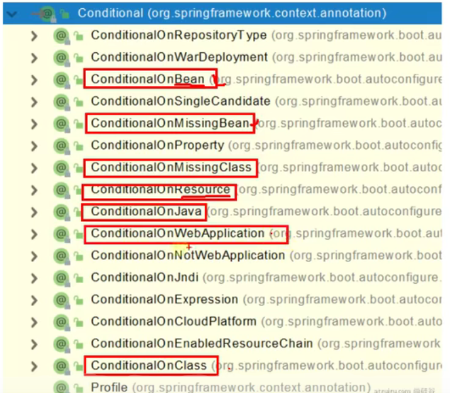

# Spring Boot2


[转载语雀，尚硅谷](https://www.bilibili.com/video/BV19K4y1L7MT?p=24&vd_source=855aa335184893bf6a3f789ef88beecb)

SpringBoot是整合Spring技术栈的一站式框架。

SpringBoot是简化Spring技术栈的快速开发脚手架

用来组装spring生态圈或整合技术栈，简化配置。能快速创建出生产级别的Spring应用。并引入了两套方案Reactive Stack 、Servlet Stack。

# 一、Spring Boot概述—基础入门

## 1、 Spring Boot 优缺点

人称版本帝，迭代快，需要时刻关注变化，社区活跃，bug少

### 1.1、Spring Boot优点

* 创建独立的Spring应用
* 内嵌web服务器 
  * ==**Tomcat**== letty or Undertow
* 自动starter依赖，简化构建配置
  * 如==**web场景**==（web starter）
* 自动配置Spring以及第三方功能
  * 简化配置
* 提供生产级别的监控、健康检查及外部化配置
* 无代码生成、无需编写XML
  * 基于自动配置

### 1.2、 SpringBoot缺点

- 封装太深，内部原理复杂，不容易精通

## 2、 时代应用背景

### 2.1、 微服务

- 微服务是一种架构风格
- 一个应用拆分为一组小型服务

- 每个服务运行在自己的进程内，也就是可独立部署和升级
- 服务之间使用轻量级HTTP交互

- 服务围绕业务功能拆分
- 可以由全自动部署机制独立部署

- 去中心化，服务自治。服务可以使用不同的语言、不同的存储技术

### 2.2、 分布式

#### 分布式的困难

- 远程调用
- 服务发现

- 负载均衡
- 服务容错

- 配置管理
- 服务监控

- 链路追踪
- 日志管理

- 任务调度
- ......

#### 分布式的解决

- SpringBoot + SpringCloud
- 

### 2.3、 云原生

- 服务<font color='red'>自愈</font>
- 弹性伸缩

- 服务隔离
- 自动化部署

- 灰度发布
- 流量治理

- ......


## 3、 入门案例

### 3.1、创建maven工程

### 3.2、引入依赖

```xml
<!--springboot项目所必须的-->	
<parent>
        <groupId>org.springframework.boot</groupId>
        <artifactId>spring-boot-starter-parent</artifactId>
        <version>2.3.4.RELEASE</version>
    </parent>

<!--web场景导入-->
    <dependencies>
        <dependency>
            <groupId>org.springframework.boot</groupId>
            <artifactId>spring-boot-starter-web</artifactId>
        </dependency>

    </dependencies>
```

### 3.3、创建主程序

```java
/**
 * 主程序类
 * @SpringBootApplication：这是一个SpringBoot应用
 */
@SpringBootApplication
public class MainApplication {

    public static void main(String[] args) {
        SpringApplication.run(MainApplication.class,args);
    }
}
```

### 3.4、编写业务

`@RestController`是==**@Controller和@ResponseBody**==的合体

```java
//@Controller
//@ResponseBody
@RestController
public class HelloWorldController {
    @RequestMapping("/hello")
    public String handle01(){
        return "Hello,Spring Boot 2!";
    }
}
```

### 3.5、测试

直接运行main方法

### 3.6、简化配置

所有配置整合统一到一个文件: ==**application.properties**==例如：

```properties
server.port=8888
```

### 3.7、简化部署

要创建一个可执行的 jar，我们需要添加 ==**spring-boot-maven-plugin**==给我们的 `pom.xml`，在执行`mvn package`命令生成==**可执行jar包**==。

```xml
<build>
    <plugins>
        <plugin>
            <groupId>org.springframework.boot</groupId>
            <artifactId>spring-boot-maven-plugin</artifactId>
        </plugin>
    </plugins>
</build>
```

使用 `java -jar`命令执行jar包：

```terminal
java -jar boot-01-helloworld-1.0-SNAPSHOT.jar
```

# 二、自动配置原理—基础入门

## 1、SpringBoot特点

### 2.1 依赖管理 ⭐

* 父项目做依赖管理

  * ```xml
    <!--父项目进行依赖管理 -->   
    <parent>
        <groupId>org.springframework.boot</groupId>
        <artifactId>spring-boot-starter-parent</artifactId>
        <version>2.3.4.RELEASE</version>
    </parent>
    
    <!--他的父项目-->
     <parent>
        <groupId>org.springframework.boot</groupId>
        <artifactId>spring-boot-dependencies</artifactId>
        <version>2.3.4.RELEASE</version>
      </parent>
    
    <!--spring-boot-dependencies几乎声明了所有开发中常用的依赖的版本号,自动版本仲裁机制-->
    ```

* 开发导入starter场景启动器

  * spring-boot-starter-* 是官方场景

  *  *-spring-boot-starter是第三方提供的场景

  * 只要引入starter，这个场景的所有常规需要的依赖我们都自动引入

  * SpringBoot所有支持的场景 https://docs.spring.io/spring-boot/docs/current/reference/html/using-spring-boot.html#using-boot-starter

  * 所有场景启动器最底层的依赖都会依赖这个：

  * ```xml
    <!--自动配置的核心依赖-->
    <dependency>
        <groupId>org.springframework.boot</groupId>
        <artifactId>spring-boot-starter</artifactId>
        <version>2.3.4.RELEASE</version>
        <scope>compile</scope>
    </dependency>
    ```

* 自动版本仲裁

  * 1、引入依赖默认都可以不写版本
    2、引入非 版本仲裁的jar，要写版本号。

- 可以修改默认版本号

  - ```xml
    <!--1、查看spring-boot-dependencies里面规定当前依赖的版本 用的 key。-->
    <!--2、在当前项目里面重写配置-->
    <project xmlns="http://maven.apache.org/POM/4.0.0"
             xmlns:xsi="http://www.w3.org/2001/XMLSchema-instance"
             xsi:schemaLocation="http://maven.apache.org/POM/4.0.0 http://maven.apache.org/xsd/maven-4.0.0.xsd">    
    <properties>
            <mysql.version>5.1.43</mysql.version>
        </properties>
    </project>
    ```

### 2.2 自动配置 ⭐

引入<font color='orange'>web场景</font>后

* 自动配置好Tomcat

  * 引入Tomcat依赖：

    ```xml
    <!--引入web场景包含此依赖 -->
    <dependency>
          <groupId>org.springframework.boot</groupId>
          <artifactId>spring-boot-starter-tomcat</artifactId>
          <version>2.3.4.RELEASE</version>
          <scope>compile</scope>
        </dependency>
    ```
    
    

* 自动配好<font color='orange'>SpringMVC</font>

  * 引入SpringMVC全套组件
  * 自动配好SpringMVC常用组件（如：上传所需配置的==**multipartResolver**==组件）

* 自动配好Web常见功能，如： 字符编码问题（<font color='orange'>characterEncodingFilter</font>）

  * 帮我们配置好了<font color='orange'>web开发常见场景</font>

* 默认的包结构

  * <font color='green'>主程序</font>所在<font color='orange'>包及其子包</font>的<font color='red'>组件</font>都被<font color='orange'>默认扫描</font>

  * 无需配置包扫描配置

  * 想要改变扫描路径则，==**@SpringBootApplication(scanBasePackages = "com.atguigu.boot.bean")**==

    * 或者**@ComponentScan指定**。

    * ```java
      @SpringBootApplication
      等同于
      @SpringBootConfiguration
      @EnableAutoConfiguration
      @ComponentScan("com.atguigu.boot")
      //详情请看@SpringBootApplication注解属性
      ```

* <font color='orange'>各种配置拥有默认值</font>

  * 默认配置最终都是映射到某个类上，如：MultipartProperties（配置 multipartResolver组件）

  * 配置文件值最终会绑定每个类上，这个类会在IOC容器中创建对象。

    * 如：application.properties中 改变上传文件大小配置：

      * ```properties
        spring.servlet.multipart.max-file-size=10MB
        ```

* <font color='orange'>按需加载</font>所有<font color='orange'>自动配置项</font>

  * <font color='red'>**引入哪些场景，则哪些场景==自动配置==才会开启**</font>

  * springBoot所有的自动配置功能在 <font color='orange'>spring-boot-autoconfigure</font>包里（在 spring-boot-starter中）

    * 可通过导入不导入，查看`spring-boot-autoconfigure`中自动配置场景是否生效。（爆红不生效）

    

## 2、容器功能

### 2.1、组件添加

#### 1、@configuration

1. 基本使用
   1. 配置类里面使用@Bean标注在方法上给容器注册组件，默认也是单实例的
   2. 配置类 == 一个配置文件  （配置类也在容器中也是一个组件）
2. **full模式与Lite模式**
   1. 该注解上的：<font color='orange'>proxyBeanMethods</font>属性为true（Full模式） 这是默认值
      1. 该配置类会被com.atguigu.boot.config.Myconfig$$EnhancerBySpringCGLIB$$24e71850@31611954代理。此时该代理对象调用的<font color='orange'>方法</font>默认就会检查（容器中是否有这个方法返回的组件），有就从容器中拿
   2. 该注解上的：<font color='orange'>proxyBeanMethods</font>属性为false（Lite模式）（不用检查快）
      1. 此时该配置类未被代理，外部调用该方法不会检查，只会生成新的对象
   3. 解决问题
      1. Full模式可以有效解决容器中组件的依赖。（<font color='orange'>都放在容器中，而不是所依赖的不在容器中</font>）
3. 最佳实战
   1. **配置类中注册的组件**之间无依赖关系用Lite模式加速容器启动过程，减少判断
   2. ** **之间有依赖关系，方法被调用得到组件单实例组件，用Full模式

#### 2、@Bean、@Component、@Controller、@Service、@Repository（注册组件）

1. @Bean中，`value`与`name`互为别名（互为别名：说这两个属性其实同一个含义）

   ```java
   @AliasFor("name")
       String[] value() default {};
   
       @AliasFor("value")
       String[] name() default {};
   	......
   //还有其它的
   ```

2. 其它的一样如下：

   ```java
   String value() default "";
   ```

#### 3、@ComponentScan（包扫描）、@import（导入组件）

1. @ComponentScan中，`basePackages`与 `value`互为别名

   ```java
   @AliasFor("basePackages")
       String[] value() default {};
   
       @AliasFor("value")
       String[] basePackages() default {};
   	......
   //还有其它的
   ```

2. @import

   1. 使用如下：（给容器自动创建出这两个类型的组件、默认组件的名字就是  <font color='red'>全类名</font>）
   
      ```java
      @Import({DBHelper.class,Pet.class})
      ```

#### 4、@Conditional

1. 条件装配：满足Conditional指定的条件，则进行组件注入

2. 其下派生很多注解

   

3. 使用例子如下：

   ```java
   //@ConditionalOnBean(name = "tom")//当有这个组件式，会触发标注的东西
   //@ConditionalOnMissingBean(name = "tom")//当没有这个组件式，会触发标注的东西
       @Bean
       public User user01(){
           User zhangsan = new User("张三", 18);
           zhangsan.setPet(tomcatPet());
           return zhangsan;
       }
    //   @Bean("tom")//自定义组件id为Tom
       public Pet tomcatPet(){
           return new Pet("Tomcat");
       }
   
   ```

### 2.2、原生配置文件引入	

#### 1、@ImportResource

```xml
======================beans.xml=========================
<?xml version="1.0" encoding="UTF-8"?>
<beans xmlns="http://www.springframework.org/schema/beans"
       xmlns:xsi="http://www.w3.org/2001/XMLSchema-instance"
       xmlns:context="http://www.springframework.org/schema/context"
       xsi:schemaLocation="http://www.springframework.org/schema/beans http://www.springframework.org/schema/beans/spring-beans.xsd http://www.springframework.org/schema/context https://www.springframework.org/schema/context/spring-context.xsd">

    <bean id="haha" class="com.atguigu.boot.bean.User">
        <property name="name" value="zhangsan"></property>
        <property name="age" value="18"></property>
    </bean>

    <bean id="hehe" class="com.atguigu.boot.bean.Pet">
        <property name="name" value="tomcat"></property>
    </bean>
</beans>
```


```java
@ImportResource("classpath:beans.xml")//使原始的配置文件生效
public class MyConfig {}

======================测试=================
        boolean haha = run.containsBean("haha");
        boolean hehe = run.containsBean("hehe");
        System.out.println("haha："+haha);//true
        System.out.println("hehe："+hehe);//true
```

### 2.3、配置绑定

使用Java读取到properties文件中的内容，并且把它封装到JavaBean中，以供随时使用；**(手动挡)**

```java
public class getProperties {
  	 @Bean
     public  JavaBean getJavaBean(){
         Properties pps = new Properties();
         pps.load(new FileInputStream("a.properties"));
         Enumeration enum1 = pps.propertyNames();//得到配置文件的名字
         while(enum1.hasMoreElements()) {
             String strKey = (String) enum1.nextElement();
             String strValue = pps.getProperty(strKey);
             System.out.println(strKey + "=" + strValue);
             ......//封装到JavaBean。
               return javaBean;
         }
     }
 }
```

#### 1、@component+@ConfigurationProperties（自动挡）


```java
/**
 * 只有在容器中的组件，才会拥有SpringBoot提供的强大功能。比如：@ConfigurationProperties
 */
//注册组件
@Component 这里注解顺序无所谓
//匹配application.properties中的mycar前缀,并把匹配上的 配置属性 装配该组件的 属性 上
@ConfigurationProperties(prefix = "mycar")
public class Car {

    private String brand;
    private Integer price;

    public String getBrand() {
        return brand;
    }
```

application.properties中：

```properties
mycar.name=BYD
mycar.price=999998
```

#### 2、@EnableConfigurationProperties+@ConfigurationProperties（自动挡）

开启Car配置绑定功能，并把这个Car这个组件自动注册到容器中。


```java
@EnableConfigurationProperties(Car.class) // 开启 Car 的属性配置并自动注入到容器中（源码中，这里大多都是xxxProperties.class，其中类的初始值已经设置好了。）
public class MyConfiguration {
}
@ConfigurationProperties(prefix = "mycar")
public class Car {

}
```

## 3、自动配置原理

### 3.1、引导加载自动配置类

```java
@SpringBootConfiguration
@EnableAutoConfiguration
@ComponentScan(excludeFilters = { @Filter(type = FilterType.CUSTOM, classes = TypeExcludeFilter.class),
		@Filter(type = FilterType.CUSTOM, classes = AutoConfigurationExcludeFilter.class) })
public @interface SpringBootApplication {
```

#### 1、@SpringApplication结构

1. **<font color='green'>@SpringBootApplication</font>**
   1. **@SpringBootConfiguration**
      1. <font color='red'>@Configuration</font>
   2. **@EnableAutoConfiguration**
      1. <font color='red'>@AutoConfigurationPackages</font>
         1. <font color='orange'>@Import(AutoConfigurationPackages.Registrar.class)</font>
      2. <font color='red'>@Import(AutoConfigurationImportSelector.class)</font>
   3. **@ComponentScan**

#### 2、自动配置包原理

```java
@Import(AutoConfigurationPackages.Registrar.class)//给容器中导入一个组件
public @interface AutoConfigurationPackage {}
//Registrar给容器中导入一系列组件
//将指定的一个包下的所有组件导入进来 MainApplication所在的包下。


//为什么？源码如下：
static class Registrar implements ImportBeanDefinitionRegistrar, DeterminableImports {

		@Override
		public void registerBeanDefinitions(AnnotationMetadata metadata, BeanDefinitionRegistry registry) {
/*打个断点*/		register(registry, new PackageImports(metadata).getPackageNames().toArray(new String[0]));
		}
  
选好代码片段 new PackageImports(metadata).getPackageNames() 右键选择 evaluate
计算的结果为：com.atguigu.boot（主类所在的包）
```

#### 3、初始化加载自动配置类

​	开始进行源码深入。

```java
@Import(AutoConfigurationImportSelector.class)
1、利用getAutoConfigurationEntry(annotationMetadata);
给容器中批量导入一些组件,进去...

2、调用List<String> configurations = getCandidateConfigurations(annotationMetadata, attributes) 获取到所有需要导入到容器中的配置类 进去...
  /*需要在这方法上打断点，查看configurations的内容，内容如图所示*/
```


```java
3、进入 List<String> configurations = SpringFactoriesLoader.loadFactoryNames(getSpringFactoriesLoaderFactoryClass(),
				getBeanClassLoader());
4、进入 return (List)loadSpringFactories(classLoader).getOrDefault(factoryTypeName, Collections.emptyList());的loadSpringFactories方法
3、可以知道它是 利用工厂加载 Map<String, List<String>> loadSpringFactories(@Nullable ClassLoader classLoader)；得到所有的组件

4、在方法中找到 Enumeration<URL> urls = classLoader != null ? classLoader.getResources("META-INF/spring.factories") : ClassLoader.getSystemResources("META-INF/spring.factories"); 


可知是从META-INF/spring.factories位置来加载一个文件。
结论：默认扫描我们当前系统里面所有META-INF/spring.factories位置的文件
```

**其中核心的是**：  <font color='orange'>spring-boot-autoconfigure-2.3.4.RELEASE.jar</font>包里面的<font color='orange'>META-INF/spring.factories</font>如下：


如图可知文件里面写死了spring-boot——启动就要给容器中加载的**所有配置类**

但是真正的不会加载那么多，那些生效那些不生效取决于接下来要说的按需装配。

### 3.2、按需开启自动配置项

虽然我们127个场景的所有自动配置启动的时候默认全部加载。<font color='orange'>xxxxAutoConfiguration</font>
按照条件装配规则（<font color='orange'>@Conditional</font>），<font color='orange'>最终会按需配置。</font>

容蠢机制：

```java
package org.springframework.boot.autoconfigure.web.servlet;
  		@Bean
		@ConditionalOnBean(MultipartResolver.class)  //容器中有这个类型组件
		@ConditionalOnMissingBean(name = DispatcherServlet.MULTIPART_RESOLVER_BEAN_NAME) //容器中没有这个名字 multipartResolver 的组件 
		public MultipartResolver multipartResolver(MultipartResolver resolver) {
            //给@Bean标注的方法传入了对象参数，这个参数的值就会从容器中找名字不合法的MultipartResolver，然后返回出去。
            //SpringMVC multipartResolver。防止有些用户配置的文件上传解析器不符合规范
			// Detect if the user has created a MultipartResolver but named it incorrectly
			return resolver;
		}
//给容器中加入了文件上传解析器；

```

### 3.3、修改默认配置

**SpringBoot默认会在底层配好所有的组件。但是如果用户自己配置了以用户的优先**	

```java
    @Bean
    @ConditionalOnMissingBean
    public CharacterEncodingFilter setCharacterEncodingFilter(){
        return new CharacterEncodingFilter();
    }
//容器中出现名为setCharacterEncodingFilter的CharacterEncodingFilter类型组件
```

> ## 总结

1. SpringBoot先加载所有的自动配置类<font color='orange'> xxxAutoConfiguration类</font>

2. 每个自动配置类按照条件进行生效，默认都会<font color='orange'>绑定配置文件指定的值</font>。都是从<font color='orange'>xxxProperties类</font>里面拿。xxxProperties类和配置文件进行了绑定。（通过[配置绑定](###2.3、配置绑定)的注解进行）

3. 生效的配置类就会给容器中装配很多组件  

4. 只要容器中有这些组件，相当于这些功能就有了

5. 定制化配置

   * 用户直接自己@Bean替换底层的组件（原理是先装载主程序所在的包的所有标记的组件，在根据条件进行按需装载其它组件）
   * 用户去看这个组件是获取的配置文件就去修改（看源码）

   **<font color='red'>xxxxxAutoConfiguration ---> 组件  ---> xxxxProperties里面拿值  ----> application.properties</font>**
   
   

### 3.4、最佳实践

* 引入场景依赖
  * [Developing with Spring Boot](https://docs.spring.io/spring-boot/docs/current/reference/html/using.html#using.build-systems.starters)
* 查看自动配置了哪些（可选）
  * 自己分析（看AutoConfiguration源码），引入场景对应的自动配置（一般都生效）
  * 配置文件中，debug=true，开启**自动配置报告**。运行后可以在输出中看到Negitive （不生效）与Positive（生效）。
* 是否需要修改
  * 参照文档修改配置项
    * [Common Application Properties (spring.io)](https://docs.spring.io/spring-boot/docs/current/reference/html/application-properties.html#application-properties)
    * 自己分析。xxxProperties绑定了配置文件的哪些。
  * 自定义加入或者替换组件
    * @Bean、@Component
  * **自定义器  xxxxxCustomizer**

## 4、开发小技巧

## 4.1、Lombok

简化JavaBean开发

```xml
<!--1、引入依赖-->
        <dependency>
            <groupId>org.projectlombok</groupId>
            <artifactId>lombok</artifactId>
        </dependency>
<!--2、idea中搜索、安装lombok插件-->
```

使用如下：

```java
===============================简化JavaBean开发===================================
@NoArgsConstructor//t无参构造
@AllArgsConstructor//全参构造
@Data//getter和setter
@ToString//toString
@EqualsAndHashCode//重写它们
public class User {

    private String name;
    private Integer age;
    private Pet pet;

    
}


================================简化日志开发===================================
@Slf4j//向类中注册日志变量：log
@RestController
public class HelloController {
    @RequestMapping("/hello")
    public String handle01(@RequestParam("name") String name){
        
        log.info("请求进来了....");
        
        return "Hello, Spring Boot 2!"+"你好："+name;
    }
}
```

## 4.2、dev-tools

```xml
<dependencies>
    <dependency>
        <groupId>org.springframework.boot</groupId>
        <artifactId>spring-boot-devtools</artifactId>
        <optional>true</optional>
    </dependency>
</dependencies>
```

Ctrl+F9；（假的热部署， loading static resource without no restarting）

真的热部署JRebel 得加钱

对页面修改好，不用restarting

## 4.3、Spring Initailzr向导 

### 1、自动依赖引入

图片略

### 2、自动创建项目结构

图片略

### 3、自动编写好主配置类

图片略

# 三、核心技术—核心功能

## 1、配置文件

### 1.1、文件类型

1. <font color='orange'>properties</font>
2. <font color='orange'>yaml</font>

### 1.2、yaml

YAML 是 "YAML Ain't Markup Language"（YAML 不是一种标记语言）的递归缩写。在开发的这种语言时，YAML 的意思其实是："Yet Another Markup Language"（仍是一种标记语言）。 

特点：<font color='red'>非常适合用来做以数据为中心的配置文件</font>

#### 基本语法

- key: value；kv之间有空格
- 大小写敏感

- 使用缩进表示层级关系
- 缩进默认不允许使用tab，只允许空格，IDEA放心大胆用

- 缩进的空格数不重要，只要相同层级的元素左对齐即可
- '#'表示注释

- 字符串无需加引号，加'  '则不转义（如符号 `\n` result: `\\n`），  " "则转义（如符号 `\n` result: `换行`）。

#### 数据类型

- 字面量：单个的、不可再分的值。date、boolean、string、number、null

  ```yaml
  k: v
  ```

- 对象：键值对的集合。map、hash、set、object 

  ```yml
  行内写法：  k: {k1:v1,k2:v2,k3:v3}
  #或
  k: 
  	k1: v1
    k2: v2
    k3: v3
  ```

- 数组：一组按次序排列的值。array、list、queue

  ```yml
  行内写法：  k: [v1,v2,v3]
  #或者
  k:
   - v1
   - v2
   - v3
  ```

  

#### 示例

```java
@Data
@Component
@ConfigurationProperties(prefix="Person")
public class Person {
	
	private String userName;
	private Boolean boss;
	private Date birth;
	private Integer age;
	private Pet pet;
	private String[] interests;
	private List<String> animal;
	private Map<String, Object> score;
	private Set<Double> salarys;
	private Map<String, List<Pet>> allPets;
}

@Data
public class Pet {
	private String name;
	private Double weight;
}
```


```yml
Person:
  user-name: zhangsan #userName: zhangsan  也行
  boss: false
  birth: 2021/12/30 12:30:00
  age: 18
  pet:
    name: Cat
    weight: 20.0
  interests: [篮球,乒乓球]
  animal:
    - 熊
    - 鸟
  score:
    english:
      first: 30
      secode: 40
      third: 50
    math: [13,140,144]
    chinese: {first: 128,secode: 136}
  salarys: [9,9,99,999]
  all-pets:
    sick:
      - {name: tom}
      - {name: jerry,weight: 40}
    health: [{name: mario,weight: 47}]
```

之后注入组件查看值就好了。

### 1.3、配置提示

```xml
<dependency>
			<groupId>org.springframework.boot</groupId>
			<artifactId>spring-boot-configuration-processor</artifactId>
  		<!-- 之后自己定义的也能提示-->
			<optional>true</optional>
		</dependency>

<plugin>
    <groupId>org.springframework.boot</groupId>
    <artifactId>spring-boot-maven-plugin</artifactId>
    <configuration>
        <excludes>
            <exclude>
                <groupId>org.springframework.boot</groupId>
                <artifactId>spring-boot-configuration-processor</artifactId>
<!--              打包的时候用完了，就扔掉。
-->               <!-- 辞退打工仔 养不起，-->
            </exclude>
        </excludes>
    </configuration>
</plugin>
```

​	

## 2、Web开发

### 2.1 SpringMVC自动配置概览

Spring Boot provides auto-configuration for Spring MVC that **works well with most applications.(大多场景我们都无需自定义配置)**

The auto-configuration adds the following features on top of Spring’s defaults:（自动配置在Spring默认的基础上添加了以下特征：）

- Inclusion of `ContentNegotiatingViewResolver` and `BeanNameViewResolver` beans.

- - 内容协商视图解析器和BeanName视图解析器

- Support for serving static resources, including support for WebJars (covered [later in this document](https://docs.spring.io/spring-boot/docs/current/reference/html/spring-boot-features.html#boot-features-spring-mvc-static-content))（本文档稍后将介绍）).

- - 静态资源（包括webjars）

- Automatic registration of `Converter`, `GenericConverter`, and `Formatter` beans.

- - 自动注册 `Converter，GenericConverter，Formatter `

- Support for `HttpMessageConverters` (covered [later in this document](https://docs.spring.io/spring-boot/docs/current/reference/html/spring-boot-features.html#boot-features-spring-mvc-message-converters)).

- - 支持 `HttpMessageConverters` （后来我们配合内容协商理解原理）

- Automatic registration of `MessageCodesResolver` (covered [later in this document](https://docs.spring.io/spring-boot/docs/current/reference/html/spring-boot-features.html#boot-features-spring-message-codes)).

- - 自动注册 `MessageCodesResolver` （国际化用）

- Static `index.html` support.

- - 静态index.html 页支持

- Custom `Favicon` support (covered [later in this document](https://docs.spring.io/spring-boot/docs/current/reference/html/spring-boot-features.html#boot-features-spring-mvc-favicon)).

- - 自定义 `Favicon`  

- Automatic use of a `ConfigurableWebBindingInitializer` bean (covered [later in this document](https://docs.spring.io/spring-boot/docs/current/reference/html/spring-boot-features.html#boot-features-spring-mvc-web-binding-initializer)).

- - 自动使用 `ConfigurableWebBindingInitializer` ，（DataBinder负责将请求数据绑定到JavaBean上）


> If you want to keep those Spring Boot MVC customizations and make more [MVC customizations](https://docs.spring.io/spring/docs/5.2.9.RELEASE/spring-framework-reference/web.html#mvc) (interceptors, formatters, view controllers, and other features), you can add your own `@Configuration` class of type `WebMvcConfigurer` but **without** `@EnableWebMvc`.
>
> **不用@EnableWebMvc注解。使用** `**@Configuration**` **+** `**WebMvcConfigurer**` **自定义规则**

> If you want to provide custom instances of `RequestMappingHandlerMapping`, `RequestMappingHandlerAdapter`, or `ExceptionHandlerExceptionResolver`, and still keep the Spring Boot MVC customizations, you can declare a bean of type `WebMvcRegistrations` and use it to provide custom instances of those components.
>
> **声明** `**WebMvcRegistrations**` **改变默认底层组件**

> If you want to take complete control of Spring MVC, you can add your own `@Configuration` annotated with `@EnableWebMvc`, or alternatively add your own `@Configuration`-annotated `DelegatingWebMvcConfiguration` as described in the Javadoc of `@EnableWebMvc`.
>
> **使用** `**@EnableWebMvc+@Configuration+DelegatingWebMvcConfiguration 全面接管SpringMVC**`

### 2.2 简单功能分析

#### （1 静态资源访问

##### a 静态资源目录

只要静态资源放在类路径下：**/static**(or **/public **or **resources** or **/META-INF/resources**)

访问：当前项目根路径/ + 静态资源名

原理：

静态映射是杠双星 /**

请求进来，先去照Controller看能不能处理。不能处理的所有请求又都交给静态资源处理器。静态资源也找不到则404页面。

##### b 静态资源访问前缀

```yml
spring:
  mvc:
  	#静态资源访问前缀 默认为/**，无前缀
    static-path-pattern: /我是前缀/**
    
```

通过快捷键Alt+左键点击该配置属性，查看源码**数据类型以及默认值**：

```java
	private String staticPathPattern = "/**";
```

##### c 静态资源资源路径设置

```java
spring:
  resources:
    static-locations: ["classpath:/a/","classpath:/b/"]
```

```java
	private static final String[] CLASSPATH_RESOURCE_LOCATIONS = { "classpath:/META-INF/resources/",
			"classpath:/resources/", "classpath:/static/", "classpath:/public/" };

	/**
	 * Locations of static resources. Defaults to classpath:[/META-INF/resources/,
	 * /resources/, /static/, /public/].
	 */
	private String[] staticLocations = CLASSPATH_RESOURCE_LOCATIONS;
```

##### d webjar

自动映射 <font color='red'>/webjars/**</font>

https://www.webjars.org/ jquery弄成依赖了

```xml

        <dependency>
            <groupId>org.webjars</groupId>
            <artifactId>jquery</artifactId>
            <version>3.5.1</version>
        </dependency>
```

访问地址：[http://localhost:8080/webjars/**jquery/3.5.1/jquery.js**](http://localhost:8080/webjars/jquery/3.5.1/jquery.js)   后面地址要按照依赖里面的包路径


#### （2 欢迎页支持

- 静态资源路径下  index.html

- - 可以配置静态资源路径
  - 但是不可以配置静态资源的访问前缀。否则导致 index.html不能被默认访问 （**新版本不知道解决没有**）

#### （3 自定义 Favicon

* favicon.ico 放在静态资源目录下即可。

- 但是不可以配置静态资源的访问前缀。否则导致 favicon.ico不能被默认访问（**新版本不知道解决没有**）

#### （4 **静态资源配置原理 ⭐⭐**

- SpringBoot启动默认加载  xxxAutoConfiguration 类（自动配置类）

- SpringMVC功能的自动配置类 WebMvcAutoConfiguration，生效

  - ```java
    @Configuration(proxyBeanMethods = false)
    @ConditionalOnWebApplication(type = Type.SERVLET)
    @ConditionalOnClass({ Servlet.class, DispatcherServlet.class, WebMvcConfigurer.class })
    @ConditionalOnMissingBean(WebMvcConfigurationSupport.class)
    @AutoConfigureOrder(Ordered.HIGHEST_PRECEDENCE + 10)
    @AutoConfigureAfter({ DispatcherServletAutoConfiguration.class, TaskExecutionAutoConfiguration.class,
    		ValidationAutoConfiguration.class })
    public class WebMvcAutoConfiguration {}
    ```

  - 他给容器配了什么，接下来分析他的静态内部类：

    - ```java
      	@Configuration(proxyBeanMethods = false)
      	@Import(EnableWebMvcConfiguration.class)
      	@EnableConfigurationProperties({ WebMvcProperties.class, ResourceProperties.class })
      	@Order(0)
      	public static class WebMvcAutoConfigurationAdapter implements WebMvcConfigurer {
      ```

    - 可以看到 WebMvcProperties ResourceProperties 配置绑定的类，进去看前缀：

    - ```java
      @ConfigurationProperties(prefix = "spring.mvc")
      public class WebMvcProperties {
      
      @ConfigurationProperties(prefix = "spring.resources", ignoreUnknownFields = false)
      public class ResourceProperties {
      ```

##### a 配置类只有一个有参构造器

```java
	//有参构造器所有参数的值都会从容器中确定
//ResourceProperties resourceProperties；获取和spring.resources绑定的所有的值的对象
//WebMvcProperties mvcProperties 获取和spring.mvc绑定的所有的值的对象
//ListableBeanFactory beanFactory Spring的beanFactory
//HttpMessageConverters 找到所有的HttpMessageConverters
//ResourceHandlerRegistrationCustomizer 找到 资源处理器的自定义器。=========
//DispatcherServletPath  
//ServletRegistrationBean   给应用注册Servlet、Filter....
	public WebMvcAutoConfigurationAdapter(ResourceProperties resourceProperties, WebMvcProperties mvcProperties,
				ListableBeanFactory beanFactory, ObjectProvider<HttpMessageConverters> messageConvertersProvider,
				ObjectProvider<ResourceHandlerRegistrationCustomizer> resourceHandlerRegistrationCustomizerProvider,
				ObjectProvider<DispatcherServletPath> dispatcherServletPath,
				ObjectProvider<ServletRegistrationBean<?>> servletRegistrations) {
			this.resourceProperties = resourceProperties;
			this.mvcProperties = mvcProperties;
			this.beanFactory = beanFactory;
			this.messageConvertersProvider = messageConvertersProvider;
			this.resourceHandlerRegistrationCustomizer = resourceHandlerRegistrationCustomizerProvider.getIfAvailable();
			this.dispatcherServletPath = dispatcherServletPath;
			this.servletRegistrations = servletRegistrations;
		}
```

##### b webjar、静态资源处理器的默认规则

找到 WebMvcAutoConfigurationAdapter类的 addResourceHandlers 方法

```java
@Override
		public void addResourceHandlers(ResourceHandlerRegistry registry) {
			if (!this.resourceProperties.isAddMappings()) {
				logger.debug("Default resource handling disabled");
				return;
			}
			Duration cachePeriod = this.resourceProperties.getCache().getPeriod();
			CacheControl cacheControl = this.resourceProperties.getCache().getCachecontrol().toHttpCacheControl();
			if (!registry.hasMappingForPattern("/webjars/**")) {
				customizeResourceHandlerRegistration(registry.addResourceHandler("/webjars/**")
						.addResourceLocations("classpath:/META-INF/resources/webjars/")
						.setCachePeriod(getSeconds(cachePeriod)).setCacheControl(cacheControl));
			}
			String staticPathPattern = this.mvcProperties.getStaticPathPattern();
			if (!registry.hasMappingForPattern(staticPathPattern)) {
				customizeResourceHandlerRegistration(registry.addResourceHandler(staticPathPattern)
						.addResourceLocations(getResourceLocations(this.resourceProperties.getStaticLocations()))
						.setCachePeriod(getSeconds(cachePeriod)).setCacheControl(cacheControl));
			}
		}

```

该类的

```java
if (!this.resourceProperties.isAddMappings()) {
				logger.debug("Default resource handling disabled");
				return;
			}
```

可知

```yml
spring:
  resources:
  # true 开启静态资源规则    false 禁用静态资源规则
    add-mappings: true
```


该类的

```java
//设置缓存时间，默认为 1 second					
Duration cachePeriod = this.resourceProperties.getCache().getPeriod();
			CacheControl cacheControl = this.resourceProperties.getCache().getCachecontrol().toHttpCacheControl();


			if (!registry.hasMappingForPattern("/webjars/**")) {
        //判断所有 资源处理器（ResourceHandlerRegistration）是否包含该映射。
//public boolean hasMappingForPattern(String pathPattern) {
//		for (ResourceHandlerRegistration registration : this.registrations) {
//			if (Arrays.asList(registration.getPathPatterns()).contains(pathPattern)) {
//				return true;
//			}
//		}
        //customizeResourceHandlerRegistration(ResourceHandlerRegistration registration) 方法目的是 注册自定义的webjars下的资源处理器
				customizeResourceHandlerRegistration(registry.addResourceHandler("/webjars/**")
						.addResourceLocations("classpath:/META-INF/resources/webjars/")
                                             //配置设定好的缓存参数
						.setCachePeriod(getSeconds(cachePeriod)).setCacheControl(cacheControl));
        
			}
			String staticPathPattern = this.mvcProperties.getStaticPathPattern();
			if (!registry.hasMappingForPattern(staticPathPattern)) {
				//注册自定义的静态资源处理器
        customizeResourceHandlerRegistration(registry.addResourceHandler(staticPathPattern)
						.addResourceLocations(getResourceLocations(this.resourceProperties.getStaticLocations()))
						.setCachePeriod(getSeconds(cachePeriod)).setCacheControl(cacheControl));
			}
```

可知

```yml
spring:
  resources:
    cache:
    #这是控制资源缓存的时间  没有默认值，为空，没有缓存控制
      period: 11000
```

##### c 欢迎页资源处理器规则

找到 WebMvcAutoConfigurationAdapter类的

```java
@Bean
		public WelcomePageHandlerMapping welcomePageHandlerMapping(ApplicationContext applicationContext,
				FormattingConversionService mvcConversionService, ResourceUrlProvider mvcResourceUrlProvider) {
    
//      HandlerMapping：处理器映射。保存了单个Handler能处理哪些请求。	
			WelcomePageHandlerMapping welcomePageHandlerMapping = new WelcomePageHandlerMapping(
					new TemplateAvailabilityProviders(applicationContext), applicationContext, getWelcomePage(),
					this.mvcProperties.getStaticPathPattern());
			welcomePageHandlerMapping.setInterceptors(getInterceptors(mvcConversionService, mvcResourceUrlProvider));
      //  该构造器如下：
      // 	WelcomePageHandlerMapping(TemplateAvailabilityProviders 				
      //	templateAvailabilityProviders,
//			ApplicationContext applicationContext, Optional<Resource> welcomePage, String //staticPathPattern) {
      // 欢迎页静态路径写死了，所以前面为什么用了staticPathPattern欢迎页就失效访问不到，用欢迎页必须是/**
      
	//	if (welcomePage.isPresent() && "/**".equals(staticPathPattern)) {
	//		logger.info("Adding welcome page: " + welcomePage.get());
	//		setRootViewName("forward:index.html");
//		}
	//	else if (welcomeTemplateExists(templateAvailabilityProviders, applicationContext)) {
     // 交由Controller 处理 /index 
//			logger.info("Adding welcome page template: index");
	//		setRootViewName("index");
//		}
//	}
			welcomePageHandlerMapping.setCorsConfigurations(getCorsConfigurations());
			return welcomePageHandlerMapping;
		}
```

方法

### 2.3 请求参数处理

#### （1 请求映射

##### a Rest风格使用与原理

* Rest使用

* Rest风格支持（使用HTTP请求方式动词来表示对资源的操作）

  * 以前： /getUser 获取用户 /deleteUser 删除用户 /editUser 修改用户 /saveUser 保存用户
  * 现在： /user GET-获取用户 DELETE-删除用户 PUT-修改用户 POST-保存用户
  * 核心Filter；HiddenHttpMethodFilter
    * 用法：表单method=post，隐藏域_method=put
    * SpringBoot中手动开启

* **其它Rest使用客户端工具**

  - 如PostMan直接发送Put、delete等方式请求，无需Filter。
  - Rest原理（表单提交要使用REST的时候，需要用Filter）

* 过程：

* - 请求是否正常，并且是POST

- - - 获取到**_method**的值。
    - 兼容以下请求；**PUT**.**DELETE**.**PATCH**
    - **原生request（post），包装模式HttpMethodRequestWrapper重写了HttpServletRequest接口的getMethod方法（该方法不是默认方法），返回的是传入的值。**
    - **过滤器链放行的时候用HttpMethodRequestWrapper的实例。以后的方法调用getMethod是调用他的**

  - - 

* 解释：

  * 到 WebMvcAutoConfiguration中找到与hiddenHttpMethodFilter相关的

  * ```java
    @Bean
    	@ConditionalOnMissingBean(HiddenHttpMethodFilter.class)
    	@ConditionalOnProperty(prefix = "spring.mvc.hiddenmethod.filter", name = "enabled", matchIfMissing = false)
    	public OrderedHiddenHttpMethodFilter hiddenHttpMethodFilter() {
    		return new OrderedHiddenHttpMethodFilter();
    	}
    
    ////////
    /*可知 
     * 生效需要满足容器中没有HiddenHttpMethodFilter且 spring.mvc.hiddenmethod.filter.enabled必须配置，且为true
     * 新建了OrderedHiddenHttpMethodFilter类
     * 查看该类代码与HiddenHttpMehodFilter部分代码：
      */
      
      public class OrderedHiddenHttpMethodFilter extends HiddenHttpMethodFilter implements OrderedFilter {
        public static final int DEFAULT_ORDER = -10000;
        private int order = -10000;
    
        public OrderedHiddenHttpMethodFilter() {
        }
    
        public int getOrder() {
            return this.order;
        }
    
        public void setOrder(int order) {
            this.order = order;
        }
    }
    //HiddenHttpMethodFilter部分代码：
    public class HiddenHttpMethodFilter extends OncePerRequestFilter {
    
    	private static final List<String> ALLOWED_METHODS =
    			Collections.unmodifiableList(Arrays.asList(HttpMethod.PUT.name(),
    					HttpMethod.DELETE.name(), HttpMethod.PATCH.name()));
    
    	/** Default method parameter: {@code _method}. */
    	public static final String DEFAULT_METHOD_PARAM = "_method";
    
    	private String methodParam = DEFAULT_METHOD_PARAM;
    //可知
    //  继承关系，和_methods的常量
    ```

* 扩展

  * 所以我们可以自定义HiddenHttpMethodFilter，来修改methodParam值达到修改**参数名**的目的

  * 自定义如下：

    * ```java
      public class HelloWorldController { 
      @RequestMapping(value = "/user",method = RequestMethod.GET)
          public String getUser(){
              return "GET-张三";
          }
      
          @RequestMapping(value = "/user",method = RequestMethod.POST)
          public String saveUser(){
              return "POST-张三";
          }
      
      
          @RequestMapping(value = "/user",method = RequestMethod.PUT)
          public String putUser(){
              return "PUT-张三";
          }
      
          @RequestMapping(value = "/user",method = RequestMethod.DELETE)
          public String deleteUser(){
              return "DELETE-张三";
          }
      
          //自定义filter后 public OrderedHiddenHttpMethodFilter hiddenHttpMethodFilter() { 方法不生效
          @Bean
          public HiddenHttpMethodFilter hiddenHttpMethodFilter(){
              HiddenHttpMethodFilter methodFilter = new HiddenHttpMethodFilter();
              methodFilter.setMethodParam("_m");
              return methodFilter;
          }
      }
      ```

      首页代码：

      ```html
      <form method="get" action="/user"  >
              <input name="_m" type="hidden" value="GET">
              <input value="GET提交" type="submit">
          </form>
          <form method="post" action="/user"  >
              <input name="_m" type="hidden" value="POST">
              <input value="POST提交" type="submit">
          </form>
          <form method="post" action="/user"  >
                 <input name="_m" type="hidden" value="PUT">
                  <input value="PUT提交" type="submit">
              </form>
          <form method="post" action="/user"  >
              <input name="_m" type="hidden" value="DELETE">
              <input value="DELETE提交" type="submit">
          </form>
      ```

##### b 请求映射原理


SpringMVC功能分析都从 org.springframework.web.servlet.DispatcherServlet-》doDispatch（）

开始解析该方法：

定位到是getHandler方法进行处理请求映射的

```java
				// Determine handler for the current request.
        //// 找到当前请求使用哪个Handler（Controller的方法）处理
        //返回的是执行链
				mappedHandler = getHandler(processedRequest);
```

其方法内容如下：

```java
protected HandlerExecutionChain getHandler(HttpServletRequest request) throws Exception {
		if (this.handlerMappings != null) {
			for (HandlerMapping mapping : this.handlerMappings) {
				HandlerExecutionChain handler = mapping.getHandler(request);
				if (handler != null) {
					return handler;
				}
			}
		}
		return null;
	}
```

打断点可知有5种类型的HandlerMapping


**RequestMappingHandlerMapping**：保存了所有@RequestMapping 和handler的映射规则。


调试找到 AbstractHandlerMethodMapping<T>的方法：

```java
protected HandlerMethod getHandlerInternal(HttpServletRequest request) throws Exception {
  //获取原生请求的路径
   String lookupPath = getUrlPathHelper().getLookupPathForRequest(request);
   request.setAttribute(LOOKUP_PATH, lookupPath);
  //mappingRegistry保存了处理器映射方法
   this.mappingRegistry.acquireReadLock();
   try {
     //查找处理器映射方法
      HandlerMethod handlerMethod = lookupHandlerMethod(lookupPath, request);
      return (handlerMethod != null ? handlerMethod.createWithResolvedBean() : null);
   }
   finally {
      this.mappingRegistry.releaseReadLock();
   }
}
```

进入到lookupHandlerMethod(lookupPath, request)方法中：（也是 AbstractHandlerMethodMapping<T>的方法）

```java
protected HandlerMethod lookupHandlerMethod(String lookupPath, HttpServletRequest request) throws Exception {
		List<Match> matches = new ArrayList<>();
  	//通过以路径为map的key，获取到自己写的Rest风格的4个控制器方法（控制器处理方法信息）（看图）
		List<T> directPathMatches = this.mappingRegistry.getMappingsByUrl(lookupPath);
		if (directPathMatches != null) {
      //在这里开始从以请求方法、请求参数等参数来继续筛选结果，找到符合的控制器处理方法，基本上在这就能唯一确定一个控制器方法了。
      //该方法把匹配的值放入matches中
			addMatchingMappings(directPathMatches, matches, request);
		}
  下面代码略
  。。。。。。。。
  。。。。。。。。
  。。。。。。。。 
```

所有的请求映射都在HandlerMapping中。

> #### 总结：

- 所有的请求映射都在HandlerMapping中。

- SpringBoot自动配置欢迎页的 WelcomePageHandlerMapping 。访问 /能访问到index.html；

- SpringBoot自动配置了默认 的 RequestMappingHandlerMapping

- 请求进来，挨个尝试所有的HandlerMapping看是否有请求信息。

  - 如果有就找到这个请求对应的handler

  - 如果没有就是下一个 HandlerMapping

- 我们需要一些自定义的映射处理，我们也可以自己给容器中放**HandlerMapping**。自定义 **HandlerMapping**

  - 代码如下：

  - ```java
    class 控制器{
      //由 DispatcherServlet从容器中拿到HandlerMapping类型的组件，封装到 handlerMappings集合中。
    //该集合是用到才会去加载，延迟加载。
      
      //设置顺序
      
      //自定义handlerMapping如下
     @Bean
        public aa handlerMapping(){
    
            aa a = new aa( );
          //设置顺序：必须继承AbstractHandlerMapping来继承order属性，没有设置的order的，会给一个最小优先权：值为23788923。
          //排列结果由DispatcherServlet类的initHandlerMappings方法的AnnotationAwareOrderComparator.sort(this.handlerMappings);方法生成。
            a.setOrder(1);
            return a;
        }
    
    }
    class aa extends AbstractHandlerMapping {
    
        @Override
        protected Object getHandlerInternal(HttpServletRequest request) throws Exception {
            return null;
        }
    }
    
    
    ```

#### （2 普通参数与基本注解

##### a 注解

@PathVariable、@RequestHeader、@ModelAttribute、@RequestParam、@CookieValue、@RequestBody

```java
// http://localhost:8080/car/2/owner/zhangsan?age=15&inters=game
    @GetMapping("/car/{id}/owner/{username}")
    @ResponseBody
    public Map<String,Object> getCar(
            @PathVariable("id") Integer id,
            @PathVariable("username") String name,
            @PathVariable Map<String,String>  pv,//这里的lei'xin新版本可能扩展了，可以看注解的注释信息
            @RequestHeader("User-Agent") String userAgent,
            @RequestHeader Map<String,String> header,
            @RequestParam("age") Integer age,
            @RequestParam("inters") List<String> inters,
            @RequestParam Map<String,String> params
            //你得设置，cookie 我的idea不帮我设没办法
//            @CookieValue("_ga") String _ga,
//            @CookieValue("_ga") Cookie cookie
            ){
        Map<String,Object> map=new HashMap<>(  );
        map.put("id",id);
        map.put("name",name);
        map.put("pathVariables 集合",pv);
        map.put("userAgent",userAgent);
        map.put("requestHeaders 集合",header);
        map.put("age",age);
        map.put("inters",inters);
        map.put("requestParams 集合",params);
//        map.put("_ga",_ga);
//        System.out.println(cookie );
        return map;
    }
 //   http://localhost:8080/save
 @ResponseBody
    @PostMapping("/save")
    public Map postMethod(@RequestBody String content){
        Map<String,Object> map=new HashMap<>();
        map.put("content",content);
        return map;
    }
 //   http://localhost:8080/goto
    @GetMapping("/goto")
    public String goToPage(HttpServletRequest request){
        request.setAttribute("msg","成功了");
        request.setAttribute("code","200");
        return "forward:/success";
    }
   // http://localhost:8080/success
    @GetMapping("/success")
    @ResponseBody
    public Map success(@RequestAttribute("msg") String msg,@RequestAttribute("code") Integer code){
        HashMap<String, Object> map = new HashMap<>( );
        map.put("msg",msg);
        map.put("code",code);
        return map;
    }
```

@MatrixVariable

```java
/**
     * 作用：运用在cookie被禁用的时候，通过矩阵变量传递jsessionId，这种方式叫做URL重写。
     * 1.语法：/请求路径：/cars/sell;low=34;brand=byd,audi,yd
     *
     * 2.SpringBoot默认是禁用了矩阵变量的功能
     * 3.矩阵变量必须有url路径变量才能被解析
     * 4.矩阵变量开启由谁控制？找到WebMvcAutoConfigurationAdapter的configurePathMatch方法，代码如下：
     */
public static class WebMvcAutoConfigurationAdapter implements WebMvcConfigurer{
@Override
		@SuppressWarnings("deprecation")
		public void configurePathMatch(PathMatchConfigurer configurer) {
			configurer.setUseSuffixPatternMatch(this.mvcProperties.getPathmatch().isUseSuffixPattern());
			configurer.setUseRegisteredSuffixPatternMatch(
					this.mvcProperties.getPathmatch().isUseRegisteredSuffixPattern());
			this.dispatcherServletPath.ifAvailable((dispatcherPath) -> {
				String servletUrlMapping = dispatcherPath.getServletUrlMapping();
				if (servletUrlMapping.equals("/") && singleDispatcherServlet()) {
					UrlPathHelper urlPathHelper = new UrlPathHelper();
					urlPathHelper.setAlwaysUseFullPath(true);
					configurer.setUrlPathHelper(urlPathHelper);
				}
			});
		}
}
/*
    可知手动开启原理：对于整个路径的处理，都是使用UrlPathHelper进行解析。UrlPathHelper类的removeSemicolonContent（移除分号内容）为true表示移除分号内容。为false就能支持矩阵变量了
	由于该方法是重写WebMvcConfigurer接口的且：
	If you want to keep those Spring Boot MVC customizations and make more [MVC customizations](https://docs.spring.io/spring/docs/5.2.9.RELEASE/spring-framework-reference/web.html#mvc) (interceptors, formatters, view controllers, and other features), you can add your own `@Configuration` class of type `WebMvcConfigurer` but **without** `@EnableWebMvc`.
	可以用@Configuration+WebMvcConfigurer的方式自定义规则
	自定义如下：（两种实现方式）
*/
@Configuration(proxyBeanMethods = false)
public class WebConfig {
    @Bean
    public WebMvcConfigurer webMvcConfigurer(){
        WebMvcConfigurer webMvcConfigurer = new WebMvcConfigurer( ) {
            @Override
            public void configurePathMatch(PathMatchConfigurer configurer) {
                UrlPathHelper urlPathHelper = new UrlPathHelper( );
                urlPathHelper.setRemoveSemicolonContent(false);
                configurer.setUrlPathHelper(urlPathHelper);
            }
        };
        return webMvcConfigurer;

    }
  
  //另一种方式
  @Configuration(proxyBeanMethods = false)
public class WebConfig implements WebMvcConfigurer {
    @Override
    public void configurePathMatch(PathMatchConfigurer configurer) {
        UrlPathHelper urlPathHelper = new UrlPathHelper( );
        urlPathHelper.setRemoveSemicolonContent(false);
        configurer.setUrlPathHelper(urlPathHelper);
    }
}
  //此时容器里有了两个WebMvcConfigurer，一个是默认的一个是自定义的。
```

接下来开始演示矩阵变量：

```java
  /**
     * 1.语法： 请求路径：http://localhost:8080/cars/sell;low=34;brand=byd,audi,yd
     * 2.矩阵变量必须有url路径变量才能被解析
     */
    @ResponseBody
    @GetMapping("/cars/{path1}")
    public Map carsSell(@MatrixVariable("low") Integer low,
                        @MatrixVariable("brand") List<String> brand,
                        @PathVariable("path1") String path){
        Map<String,Object> map=new HashMap<>(  );
        map.put("low",low);
        map.put("brand",brand);
        map.put("path",path);
        return map;
    }
    // http://localhost:8080/boss/1;age=20/2;age=10
    @ResponseBody
    @GetMapping("/boss/{bossId}/{empId}")
    public Map boss(@MatrixVariable(value = "age",pathVar = "bossId") Integer bossAge,
                    @MatrixVariable(value = "age",pathVar = "empId") Integer empAge,
                    @PathVariable("bossId") String bossId,
                    @PathVariable("empId") String empId){
        Map<String,Object> map = new HashMap<>();

        map.put("bossAge",bossAge);
        map.put("empAge",empAge);
        map.put("bossId",bossId);
        map.put("empId",empId);
        return map;

    }

```

