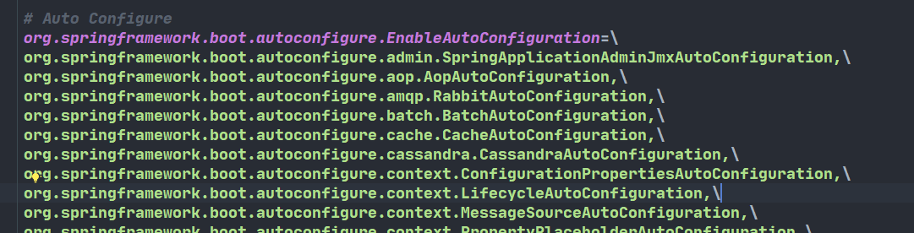

# Spring Boot2

<font color='orange'>版本为2.3.4</font>

[转载语雀，尚硅谷](https://www.bilibili.com/video/BV19K4y1L7MT?p=24&vd_source=855aa335184893bf6a3f789ef88beecb)

SpringBoot是整合Spring技术栈的一站式框架。

SpringBoot是简化Spring技术栈的快速开发脚手架

用来组装spring生态圈或整合技术栈，简化配置。能快速创建出生产级别的Spring应用。并引入了两套方案Reactive Stack 、Servlet Stack。

# 一、Spring Boot概述—基础入门

## 1、 Spring Boot 优缺点

人称版本帝，迭代快，需要时刻关注变化，社区活跃，bug少

### 1.1、Spring Boot优点

* 创建独立的Spring应用
* 内嵌web服务器 
  * ==**Tomcat**== letty or Undertow
* 自动starter依赖，简化构建配置
  * 如==**web场景**==（web starter）
* 自动配置Spring以及第三方功能
  * 简化配置
* 提供生产级别的监控、健康检查及外部化配置
* 无代码生成、无需编写XML
  * 基于自动配置

### 1.2、 SpringBoot缺点

- 封装太深，内部原理复杂，不容易精通

## 2、 时代应用背景

### 2.1、 微服务

- 微服务是一种架构风格
- 一个应用拆分为一组小型服务

- 每个服务运行在自己的进程内，也就是可独立部署和升级
- 服务之间使用轻量级HTTP交互

- 服务围绕业务功能拆分
- 可以由全自动部署机制独立部署

- 去中心化，服务自治。服务可以使用不同的语言、不同的存储技术

### 2.2、 分布式

#### 分布式的困难

- 远程调用
- 服务发现

- 负载均衡
- 服务容错

- 配置管理
- 服务监控

- 链路追踪
- 日志管理

- 任务调度
- ......

#### 分布式的解决

- SpringBoot + SpringCloud
- 

### 2.3、 云原生

- 服务<font color='red'>自愈</font>
- 弹性伸缩

- 服务隔离
- 自动化部署

- 灰度发布
- 流量治理

- ......


## 3、 入门案例

### 3.1、创建maven工程

### 3.2、引入依赖

```xml
<!--springboot项目所必须的-->	
<parent>
        <groupId>org.springframework.boot</groupId>
        <artifactId>spring-boot-starter-parent</artifactId>
        <version>2.3.4.RELEASE</version>
    </parent>

<!--web场景导入-->
    <dependencies>
        <dependency>
            <groupId>org.springframework.boot</groupId>
            <artifactId>spring-boot-starter-web</artifactId>
        </dependency>

    </dependencies>
```

### 3.3、创建主程序

```java
/**
 * 主程序类
 * @SpringBootApplication：这是一个SpringBoot应用
 */
@SpringBootApplication
public class MainApplication {

    public static void main(String[] args) {
        SpringApplication.run(MainApplication.class,args);
    }
}
```

### 3.4、编写业务

`@RestController`是==**@Controller和@ResponseBody**==的合体

```java
//@Controller
//@ResponseBody
@RestController
public class HelloWorldController {
    @RequestMapping("/hello")
    public String handle01(){
        return "Hello,Spring Boot 2!";
    }
}
```

### 3.5、测试

直接运行main方法

### 3.6、简化配置

所有配置整合统一到一个文件: ==**application.properties**==例如：

```properties
server.port=8888
```

### 3.7、简化部署

要创建一个可执行的 jar，我们需要添加 ==**spring-boot-maven-plugin**==给我们的 `pom.xml`，在执行`mvn package`命令生成==**可执行jar包**==。

```xml
<build>
    <plugins>
        <plugin>
            <groupId>org.springframework.boot</groupId>
            <artifactId>spring-boot-maven-plugin</artifactId>
        </plugin>
    </plugins>
</build>
```

使用 `java -jar`命令执行jar包：

```terminal
java -jar boot-01-helloworld-1.0-SNAPSHOT.jar
```

# 二、自动配置原理—基础入门

## 1、SpringBoot特点

### 2.1 依赖管理 ⭐

* 父项目做依赖管理

  * ```xml
    <!--父项目进行依赖管理 -->   
    <parent>
        <groupId>org.springframework.boot</groupId>
        <artifactId>spring-boot-starter-parent</artifactId>
        <version>2.3.4.RELEASE</version>
    </parent>
    
    <!--他的父项目-->
     <parent>
        <groupId>org.springframework.boot</groupId>
        <artifactId>spring-boot-dependencies</artifactId>
        <version>2.3.4.RELEASE</version>
      </parent>
    
    <!--spring-boot-dependencies几乎声明了所有开发中常用的依赖的版本号,自动版本仲裁机制-->
    ```

* 开发导入starter场景启动器

  * spring-boot-starter-* 是官方场景

  *  *-spring-boot-starter是第三方提供的场景

  * 只要引入starter，这个场景的所有常规需要的依赖我们都自动引入

  * SpringBoot所有支持的场景 https://docs.spring.io/spring-boot/docs/current/reference/html/using-spring-boot.html#using-boot-starter

  * 所有场景启动器最底层的依赖都会依赖这个：

  * ```xml
    <!--自动配置的核心依赖-->
    <dependency>
        <groupId>org.springframework.boot</groupId>
        <artifactId>spring-boot-starter</artifactId>
        <version>2.3.4.RELEASE</version>
        <scope>compile</scope>
    </dependency>
    ```

* 自动版本仲裁

  * 1、引入依赖默认都可以不写版本
    2、引入非 版本仲裁的jar，要写版本号。

- 可以修改默认版本号

  - ```xml
    <!--1、查看spring-boot-dependencies里面规定当前依赖的版本 用的 key。-->
    <!--2、在当前项目里面重写配置-->
    <project xmlns="http://maven.apache.org/POM/4.0.0"
             xmlns:xsi="http://www.w3.org/2001/XMLSchema-instance"
             xsi:schemaLocation="http://maven.apache.org/POM/4.0.0 http://maven.apache.org/xsd/maven-4.0.0.xsd">    
    <properties>
            <mysql.version>5.1.43</mysql.version>
        </properties>
    </project>
    ```

### 2.2 自动配置 ⭐

引入<font color='orange'>web场景</font>后

* 自动配置好Tomcat

  * 引入Tomcat依赖：

    ```xml
    <!--引入web场景包含此依赖 -->
    <dependency>
          <groupId>org.springframework.boot</groupId>
          <artifactId>spring-boot-starter-tomcat</artifactId>
          <version>2.3.4.RELEASE</version>
          <scope>compile</scope>
        </dependency>
    ```
    
    

* 自动配好<font color='orange'>SpringMVC</font>

  * 引入SpringMVC全套组件
  * 自动配好SpringMVC常用组件（如：上传所需配置的==**multipartResolver**==组件）

* 自动配好Web常见功能，如： 字符编码问题（<font color='orange'>characterEncodingFilter</font>）

  * 帮我们配置好了<font color='orange'>web开发常见场景</font>

* 默认的包结构

  * <font color='green'>主程序</font>所在<font color='orange'>包及其子包</font>的<font color='red'>组件</font>都被<font color='orange'>默认扫描</font>

  * 无需配置包扫描配置

  * 想要改变扫描路径则，==**@SpringBootApplication(scanBasePackages = "com.atguigu.boot.bean")**==

    * 或者**@ComponentScan指定**。

    * ```java
      @SpringBootApplication
      等同于
      @SpringBootConfiguration
      @EnableAutoConfiguration
      @ComponentScan("com.atguigu.boot")
      //详情请看@SpringBootApplication注解属性
      ```

* <font color='orange'>各种配置拥有默认值</font>

  * 默认配置最终都是映射到某个类上，如：MultipartProperties（配置 multipartResolver组件）

  * 配置文件值最终会绑定每个类上，这个类会在IOC容器中创建对象。

    * 如：application.properties中 改变上传文件大小配置：

      * ```properties
        spring.servlet.multipart.max-file-size=10MB
        ```

* <font color='orange'>按需加载</font>所有<font color='orange'>自动配置项</font>

  * <font color='red'>**引入哪些场景，则哪些场景==自动配置==才会开启**</font>

  * springBoot所有的自动配置功能在 <font color='orange'>spring-boot-autoconfigure</font>包里（在 spring-boot-starter中）

    * 可通过导入不导入，查看`spring-boot-autoconfigure`中自动配置场景是否生效。（爆红不生效）

    

## 2、容器功能

### 2.1、组件添加

#### 1、@configuration

1. 基本使用
   1. 配置类里面使用@Bean标注在方法上给容器注册组件，默认也是单实例的
   2. 配置类 == 一个配置文件  （配置类也在容器中也是一个组件）
2. **full模式与Lite模式**
   1. 该注解上的：<font color='orange'>proxyBeanMethods</font>属性为true（Full模式） 这是默认值
      1. 该配置类会被com.atguigu.boot.config.Myconfig$$EnhancerBySpringCGLIB$$24e71850@31611954代理。此时该代理对象调用的<font color='orange'>方法</font>默认就会检查（容器中是否有这个方法返回的组件），有就从容器中拿
   2. 该注解上的：<font color='orange'>proxyBeanMethods</font>属性为false（Lite模式）（不用检查快）
      1. 此时该配置类未被代理，外部调用该方法不会检查，只会生成新的对象
   3. 解决问题
      1. Full模式可以有效解决容器中组件的依赖。（<font color='orange'>都放在容器中，而不是所依赖的不在容器中</font>）
3. 最佳实战
   1. **配置类中注册的组件**之间无依赖关系用Lite模式加速容器启动过程，减少判断
   2. ** **之间有依赖关系，方法被调用得到组件单实例组件，用Full模式

#### 2、@Bean、@Component、@Controller、@Service、@Repository（注册组件）

1. @Bean中，`value`与`name`互为别名（互为别名：说这两个属性其实同一个含义）

   ```java
   @AliasFor("name")
       String[] value() default {};
   
       @AliasFor("value")
       String[] name() default {};
   	......
   //还有其它的
   ```

2. 其它的一样如下：

   ```java
   String value() default "";
   ```

#### 3、@ComponentScan（包扫描）、@import（导入组件）

1. @ComponentScan中，`basePackages`与 `value`互为别名

   ```java
   @AliasFor("basePackages")
       String[] value() default {};
   
       @AliasFor("value")
       String[] basePackages() default {};
   	......
   //还有其它的
   ```

2. @import

   1. 使用如下：（给容器自动创建出这两个类型的组件、默认组件的名字就是  <font color='red'>全类名</font>）
   
      ```java
      @Import({DBHelper.class,Pet.class})
      ```

#### 4、@Conditional

1. 条件装配：满足Conditional指定的条件，则进行组件注入

2. 其下派生很多注解

   

3. 使用例子如下：

   ```java
   //@ConditionalOnBean(name = "tom")//当有这个组件式，会触发标注的东西
   //@ConditionalOnMissingBean(name = "tom")//当没有这个组件式，会触发标注的东西
       @Bean
       public User user01(){
           User zhangsan = new User("张三", 18);
           zhangsan.setPet(tomcatPet());
           return zhangsan;
       }
    //   @Bean("tom")//自定义组件id为Tom
       public Pet tomcatPet(){
           return new Pet("Tomcat");
       }
   
   ```

### 2.2、原生配置文件引入	

#### 1、@ImportResource

```xml
======================beans.xml=========================
<?xml version="1.0" encoding="UTF-8"?>
<beans xmlns="http://www.springframework.org/schema/beans"
       xmlns:xsi="http://www.w3.org/2001/XMLSchema-instance"
       xmlns:context="http://www.springframework.org/schema/context"
       xsi:schemaLocation="http://www.springframework.org/schema/beans http://www.springframework.org/schema/beans/spring-beans.xsd http://www.springframework.org/schema/context https://www.springframework.org/schema/context/spring-context.xsd">

    <bean id="haha" class="com.atguigu.boot.bean.User">
        <property name="name" value="zhangsan"></property>
        <property name="age" value="18"></property>
    </bean>

    <bean id="hehe" class="com.atguigu.boot.bean.Pet">
        <property name="name" value="tomcat"></property>
    </bean>
</beans>
```


```java
@ImportResource("classpath:beans.xml")//使原始的配置文件生效
public class MyConfig {}

======================测试=================
        boolean haha = run.containsBean("haha");
        boolean hehe = run.containsBean("hehe");
        System.out.println("haha："+haha);//true
        System.out.println("hehe："+hehe);//true
```

### 2.3、配置绑定

使用Java读取到properties文件中的内容，并且把它封装到JavaBean中，以供随时使用；**(手动挡)**

```java
public class getProperties {
  	 @Bean
     public  JavaBean getJavaBean(){
         Properties pps = new Properties();
         pps.load(new FileInputStream("a.properties"));
         Enumeration enum1 = pps.propertyNames();//得到配置文件的名字
         while(enum1.hasMoreElements()) {
             String strKey = (String) enum1.nextElement();
             String strValue = pps.getProperty(strKey);
             System.out.println(strKey + "=" + strValue);
             ......//封装到JavaBean。
               return javaBean;
         }
     }
 }
```

#### 1、@component+@ConfigurationProperties（自动挡）


```java
/**
 * 只有在容器中的组件，才会拥有SpringBoot提供的强大功能。比如：@ConfigurationProperties
 */
//注册组件
@Component 这里注解顺序无所谓
//匹配application.properties中的mycar前缀,并把匹配上的 配置属性 装配该组件的 属性 上
@ConfigurationProperties(prefix = "mycar")
public class Car {

    private String brand;
    private Integer price;

    public String getBrand() {
        return brand;
    }
```

application.properties中：

```properties
mycar.name=BYD
mycar.price=999998
```

#### 2、@EnableConfigurationProperties+@ConfigurationProperties（自动挡）

开启Car配置绑定功能，并把这个Car这个组件自动注册到容器中。


```java
@EnableConfigurationProperties(Car.class) // 开启 Car 的属性配置并自动注入到容器中（源码中，这里大多都是xxxProperties.class，其中类的初始值已经设置好了。）
public class MyConfiguration {
}
@ConfigurationProperties(prefix = "mycar")
public class Car {

}
```

## 3、自动配置原理 ⭐⭐

### 3.1、引导加载自动配置类

```java
@SpringBootConfiguration
@EnableAutoConfiguration
@ComponentScan(excludeFilters = { @Filter(type = FilterType.CUSTOM, classes = TypeExcludeFilter.class),
		@Filter(type = FilterType.CUSTOM, classes = AutoConfigurationExcludeFilter.class) })
public @interface SpringBootApplication {
```

#### 1、@SpringApplication结构

1. **<font color='green'>@SpringBootApplication</font>**
   1. **@SpringBootConfiguration**
      1. <font color='red'>@Configuration</font>
   2. **@EnableAutoConfiguration**
      1. <font color='red'>@AutoConfigurationPackages</font>
         1. <font color='orange'>@Import(AutoConfigurationPackages.Registrar.class)</font>
      2. <font color='red'>@Import(AutoConfigurationImportSelector.class)</font>
   3. **@ComponentScan**

#### 2、自动配置包原理

```java
@Import(AutoConfigurationPackages.Registrar.class)//给容器中导入一个组件
public @interface AutoConfigurationPackage {}
//Registrar给容器中导入一系列组件
//将指定的一个包下的所有组件导入进来 MainApplication所在的包下。


//为什么？源码如下：
static class Registrar implements ImportBeanDefinitionRegistrar, DeterminableImports {

		@Override
      public void registerBeanDefinitions(AnnotationMetadata metadata, BeanDefinitionRegistry registry) {
/*打个断点*/		register(registry, new PackageImports(metadata).getPackageNames().toArray(new String[0]));
		}
  
选好代码片段 new PackageImports(metadata).getPackageNames() 右键选择 evaluate
计算的结果为：com.atguigu.boot（主类所在的包）
```

#### 3、初始化加载自动配置类

​	开始进行源码深入。

```java
@Import(AutoConfigurationImportSelector.class)
1、利用getAutoConfigurationEntry(annotationMetadata);
给容器中批量导入一些组件,进去...

2、调用List<String> configurations = getCandidateConfigurations(annotationMetadata, attributes) 获取到所有需要导入到容器中的配置类 进去...
  /*需要在这方法上打断点，查看configurations的内容，内容如图所示*/
```


```java
3、进入 List<String> configurations = SpringFactoriesLoader.loadFactoryNames(getSpringFactoriesLoaderFactoryClass(),
				getBeanClassLoader());
4、进入 return (List)loadSpringFactories(classLoader).getOrDefault(factoryTypeName, Collections.emptyList());的loadSpringFactories方法
3、可以知道它是 利用工厂加载 Map<String, List<String>> loadSpringFactories(@Nullable ClassLoader classLoader)；得到所有的组件

4、在方法中找到 Enumeration<URL> urls = classLoader != null ? classLoader.getResources("META-INF/spring.factories") : ClassLoader.getSystemResources("META-INF/spring.factories"); 


可知是从META-INF/spring.factories位置来加载一个文件。
结论：默认扫描我们当前系统里面所有META-INF/spring.factories位置的文件
```

**其中核心的是**：  <font color='orange'>spring-boot-autoconfigure-2.3.4.RELEASE.jar</font>包里面也有<font color='orange'>META-INF/spring.factories</font>如下：(2.7则是从每个包下的这个路径拿)



如图可知文件里面写死了spring-boot——启动就要给容器中加载的**所有配置类**

但是真正的不会加载那么多，那些生效那些不生效取决于接下来要说的按需装配。

### 3.2、按需开启自动配置项

虽然我们127个场景的所有自动配置启动的时候默认全部加载。<font color='orange'>xxxxAutoConfiguration</font>
按照条件装配规则（<font color='orange'>@Conditional</font>），<font color='orange'>最终会按需配置。</font>

容蠢机制：

```java
package org.springframework.boot.autoconfigure.web.servlet;
  		@Bean
		@ConditionalOnBean(MultipartResolver.class)  //容器中有这个类型组件
		@ConditionalOnMissingBean(name = DispatcherServlet.MULTIPART_RESOLVER_BEAN_NAME) //容器中没有这个名字 multipartResolver 的组件 
		public MultipartResolver multipartResolver(MultipartResolver resolver) {
            //给@Bean标注的方法传入了对象参数，这个参数的值就会从容器中找名字不合法的MultipartResolver，然后返回出去。
            //SpringMVC multipartResolver。防止有些用户配置的文件上传解析器不符合规范
			// Detect if the user has created a MultipartResolver but named it incorrectly
			return resolver;
		}
//给容器中加入了文件上传解析器；

```

### 3.3、修改默认配置

**SpringBoot默认会在底层配好所有的组件。但是如果用户自己配置了以用户的优先**	

```java
    @Bean
    @ConditionalOnMissingBean
    public CharacterEncodingFilter setCharacterEncodingFilter(){
        return new CharacterEncodingFilter();
    }
//容器中出现名为setCharacterEncodingFilter的CharacterEncodingFilter类型组件
```

> ## 总结

1. SpringBoot先加载所有的自动配置类<font color='orange'> xxxAutoConfiguration类</font>

2. 每个自动配置类按照条件进行生效，默认都会<font color='orange'>绑定配置文件指定的值</font>。都是从<font color='orange'>xxxProperties类</font>里面拿。xxxProperties类和配置文件进行了绑定。（通过[配置绑定](###2.3、配置绑定)的注解进行）

3. 生效的配置类就会给容器中装配很多组件  

4. 只要容器中有这些组件，相当于这些功能就有了

5. 定制化配置

   * 用户直接自己@Bean替换底层的组件（原理是先装载主程序所在的包的所有标记的组件，在根据条件进行按需装载其它组件）
   * 用户去看这个组件是获取的配置文件就去修改（看源码）

   **<font color='red'>xxxxxAutoConfiguration ---> 组件  ---> xxxxProperties里面拿值  ----> application.properties</font>**
   
   

### 3.4、最佳实践

* 引入场景依赖
  * [Developing with Spring Boot](https://docs.spring.io/spring-boot/docs/current/reference/html/using.html#using.build-systems.starters)
* 查看自动配置了哪些（可选）
  * 自己分析（看AutoConfiguration源码），引入场景对应的自动配置（一般都生效）
  * 配置文件中，debug=true，开启**自动配置报告**。运行后可以在输出中看到Negitive （不生效）与Positive（生效）。
* 是否需要修改
  * 参照文档修改配置项
    * [Common Application Properties (spring.io)](https://docs.spring.io/spring-boot/docs/current/reference/html/application-properties.html#application-properties)
    * 自己分析。xxxProperties绑定了配置文件的哪些。
  * 自定义加入或者替换组件
    * @Bean、@Component
  * **自定义器  xxxxxCustomizer**

## 4、开发小技巧

## 4.1、Lombok

简化JavaBean开发

```xml
<!--1、引入依赖-->
        <dependency>
            <groupId>org.projectlombok</groupId>
            <artifactId>lombok</artifactId>
        </dependency>
<!--2、idea中搜索、安装lombok插件-->
```

使用如下：

```java
===============================简化JavaBean开发===================================
@NoArgsConstructor//t无参构造
@AllArgsConstructor//全参构造
@Data//getter和setter
@ToString//toString
@EqualsAndHashCode//重写它们
public class User {

    private String name;
    private Integer age;
    private Pet pet;

    
}


================================简化日志开发===================================
@Slf4j//向类中注册日志变量：log
@RestController
public class HelloController {
    @RequestMapping("/hello")
    public String handle01(@RequestParam("name") String name){
        
        log.info("请求进来了....");
        
        return "Hello, Spring Boot 2!"+"你好："+name;
    }
}
```

## 4.2、dev-tools

```xml
<dependencies>
    <dependency>
        <groupId>org.springframework.boot</groupId>
        <artifactId>spring-boot-devtools</artifactId>
        <optional>true</optional>
    </dependency>
</dependencies>
```

Ctrl+F9；（假的热部署， loading static resource without no restarting）

真的热部署JRebel 得加钱

对页面修改好，不用restarting

## 4.3、Spring Initailzr向导 

### 1、自动依赖引入

图片略

### 2、自动创建项目结构

图片略

### 3、自动编写好主配置类

图片略

# 三、核心技术—核心功能

## 1、配置文件

### 1.1、文件类型

1. <font color='orange'>properties</font>
2. <font color='orange'>yaml</font>

### 1.2、yaml

YAML 是 "YAML Ain't Markup Language"（YAML 不是一种标记语言）的递归缩写。在开发的这种语言时，YAML 的意思其实是："Yet Another Markup Language"（仍是一种标记语言）。 

特点：<font color='red'>非常适合用来做以数据为中心的配置文件</font>

#### 基本语法

- key: value；kv之间有空格
- 大小写敏感

- 使用缩进表示层级关系
- 缩进默认不允许使用tab，只允许空格，IDEA放心大胆用

- 缩进的空格数不重要，只要相同层级的元素左对齐即可
- '#'表示注释

- 字符串无需加引号，加'  '则不转义（如符号 `\n` result: `\\n`），  " "则转义（如符号 `\n` result: `换行`）。

#### 数据类型

- 字面量：单个的、不可再分的值。date、boolean、string、number、null

  ```yaml
  k: v
  ```

- 对象：键值对的集合。map、hash、set、object 

  ```yml
  行内写法：  k: {k1:v1,k2:v2,k3:v3}
  #或
  k: 
  	k1: v1
    k2: v2
    k3: v3
  ```

- 数组：一组按次序排列的值。array、list、queue

  ```yml
  行内写法：  k: [v1,v2,v3]
  #或者
  k:
   - v1
   - v2
   - v3
  ```

  

#### 示例

```java
@Data
@Component
@ConfigurationProperties(prefix="Person")
public class Person {
	
	private String userName;
	private Boolean boss;
	private Date birth;
	private Integer age;
	private Pet pet;
	private String[] interests;
	private List<String> animal;
	private Map<String, Object> score;
	private Set<Double> salarys;
	private Map<String, List<Pet>> allPets;
}

@Data
public class Pet {
	private String name;
	private Double weight;
}
```


```yml
Person:
  user-name: zhangsan #userName: zhangsan  也行
  boss: false
  birth: 2021/12/30 12:30:00
  age: 18
  pet:
    name: Cat
    weight: 20.0
  interests: [篮球,乒乓球]
  animal:
    - 熊
    - 鸟
  score:
    english:
      first: 30
      secode: 40
      third: 50
    math: [13,140,144]
    chinese: {first: 128,secode: 136}
  salarys: [9,9,99,999]
  all-pets:
    sick:
      - {name: tom}
      - {name: jerry,weight: 40}
    health: [{name: mario,weight: 47}]
```

之后注入组件查看值就好了。

### 1.3、配置提示

```xml
<dependency>
			<groupId>org.springframework.boot</groupId>
			<artifactId>spring-boot-configuration-processor</artifactId>
  		<!-- 之后自己定义的也能提示-->
			<optional>true</optional>
		</dependency>

<plugin>
    <groupId>org.springframework.boot</groupId>
    <artifactId>spring-boot-maven-plugin</artifactId>
    <configuration>
        <excludes>
            <exclude>
                <groupId>org.springframework.boot</groupId>
                <artifactId>spring-boot-configuration-processor</artifactId>
<!--              打包的时候用完了，就扔掉。
-->               <!-- 辞退打工仔 养不起，-->
            </exclude>
        </excludes>
    </configuration>
</plugin>
```

​	

## 2、Web开发

### 2.1 SpringMVC自动配置概览

Spring Boot provides auto-configuration for Spring MVC that **works well with most applications.(大多场景我们都无需自定义配置)**

The auto-configuration adds the following features on top of Spring’s defaults:（自动配置在Spring默认的基础上添加了以下特征：）

- Inclusion of `ContentNegotiatingViewResolver` and `BeanNameViewResolver` beans.

- - 内容协商视图解析器和BeanName视图解析器

- Support for serving static resources, including support for WebJars (covered [later in this document](https://docs.spring.io/spring-boot/docs/current/reference/html/spring-boot-features.html#boot-features-spring-mvc-static-content))（本文档稍后将介绍）).

- - 静态资源（包括webjars）

- Automatic registration of `Converter`, `GenericConverter`, and `Formatter` beans.

- - 自动注册 `Converter，GenericConverter，Formatter `

- Support for `HttpMessageConverters` (covered [later in this document](https://docs.spring.io/spring-boot/docs/current/reference/html/spring-boot-features.html#boot-features-spring-mvc-message-converters)).

- - 支持 `HttpMessageConverters` （后来我们配合内容协商理解原理）

- Automatic registration of `MessageCodesResolver` (covered [later in this document](https://docs.spring.io/spring-boot/docs/current/reference/html/spring-boot-features.html#boot-features-spring-message-codes)).

- - 自动注册 `MessageCodesResolver` （国际化用）

- Static `index.html` support.

- - 静态index.html 页支持

- Custom `Favicon` support (covered [later in this document](https://docs.spring.io/spring-boot/docs/current/reference/html/spring-boot-features.html#boot-features-spring-mvc-favicon)).

- - 自定义 `Favicon`  

- Automatic use of a `ConfigurableWebBindingInitializer` bean (covered [later in this document](https://docs.spring.io/spring-boot/docs/current/reference/html/spring-boot-features.html#boot-features-spring-mvc-web-binding-initializer)).

- - 自动使用 `ConfigurableWebBindingInitializer` ，（DataBinder负责将请求数据绑定到JavaBean上）


> If you want to keep those Spring Boot MVC customizations and make more [MVC customizations](https://docs.spring.io/spring/docs/5.2.9.RELEASE/spring-framework-reference/web.html#mvc) (interceptors, formatters, view controllers, and other features), you can add your own `@Configuration` class of type `WebMvcConfigurer` but **without** `@EnableWebMvc`.
>
> **不用@EnableWebMvc注解。使用** `**@Configuration**` **+** `**WebMvcConfigurer**` **自定义规则**

> If you want to provide custom instances of `RequestMappingHandlerMapping`, `RequestMappingHandlerAdapter`, or `ExceptionHandlerExceptionResolver`, and still keep the Spring Boot MVC customizations, you can declare a bean of type `WebMvcRegistrations` and use it to provide custom instances of those components.
>
> **声明** `**WebMvcRegistrations**` **改变默认底层组件**

> If you want to take complete control of Spring MVC, you can add your own `@Configuration` annotated with `@EnableWebMvc`, or alternatively add your own `@Configuration`-annotated `DelegatingWebMvcConfiguration` as described in the Javadoc of `@EnableWebMvc`.
>
> **使用** `**@EnableWebMvc+@Configuration+DelegatingWebMvcConfiguration 全面接管SpringMVC**`

### 2.2 简单功能分析

#### （1 静态资源访问

##### a 静态资源目录

只要静态资源放在类路径下：**/static**(or **/public **or **resources** or **/META-INF/resources**)

访问：当前项目根路径/ + 静态资源名

原理：

静态映射是杠双星 /**

请求进来，先去照Controller看能不能处理。不能处理的所有请求又都交给静态资源处理器。静态资源也找不到则404页面。

##### b 静态资源访问前缀

```yml
spring:
  mvc:
  	#静态资源访问前缀 默认为/**，无前缀
    static-path-pattern: /我是前缀/**
    
```

通过快捷键Alt+左键点击该配置属性，查看源码**数据类型以及默认值**：

```java
	private String staticPathPattern = "/**";
```

##### c 静态资源资源路径设置

```java
spring:
  resources:
    static-locations: ["classpath:/a/","classpath:/b/"]
```

```java
	private static final String[] CLASSPATH_RESOURCE_LOCATIONS = { "classpath:/META-INF/resources/",
			"classpath:/resources/", "classpath:/static/", "classpath:/public/" };

	/**
	 * Locations of static resources. Defaults to classpath:[/META-INF/resources/,
	 * /resources/, /static/, /public/].
	 */
	private String[] staticLocations = CLASSPATH_RESOURCE_LOCATIONS;
```

##### d webjar

自动映射 <font color='red'>/webjars/**</font>

https://www.webjars.org/ jquery弄成依赖了

```xml

        <dependency>
            <groupId>org.webjars</groupId>
            <artifactId>jquery</artifactId>
            <version>3.5.1</version>
        </dependency>
```

访问地址：[http://localhost:8080/webjars/**jquery/3.5.1/jquery.js**](http://localhost:8080/webjars/jquery/3.5.1/jquery.js)   后面地址要按照依赖里面的包路径


#### （2 欢迎页支持

- 静态资源路径下  index.html

- - 可以配置静态资源路径
  - 但是不可以配置静态资源的访问前缀。否则导致 index.html不能被默认访问 （**新版本不知道解决没有**）

#### （3 自定义 Favicon

* favicon.ico 放在静态资源目录下即可。

- 但是不可以配置静态资源的访问前缀。否则导致 favicon.ico不能被默认访问（**新版本不知道解决没有**）

#### （4 **静态资源配置原理 ⭐⭐**

开始分析：

- SpringBoot启动默认加载  xxxAutoConfiguration 类（自动配置类）

- SpringMVC功能的自动配置类 WebMvcAutoConfiguration，生效


```java
@Configuration(proxyBeanMethods = false)
@ConditionalOnWebApplication(type = Type.SERVLET)
@ConditionalOnClass({ Servlet.class, DispatcherServlet.class, WebMvcConfigurer.class })
@ConditionalOnMissingBean(WebMvcConfigurationSupport.class)
@AutoConfigureOrder(Ordered.HIGHEST_PRECEDENCE + 10)
@AutoConfigureAfter({ DispatcherServletAutoConfiguration.class, TaskExecutionAutoConfiguration.class,
		ValidationAutoConfiguration.class })
public class WebMvcAutoConfiguration {}
```

- 他给容器配了什么，接下来分析他的静态内部类：


```java
	@Configuration(proxyBeanMethods = false)
	@Import(EnableWebMvcConfiguration.class)
	@EnableConfigurationProperties({ WebMvcProperties.class, ResourceProperties.class })
	@Order(0)
	public static class WebMvcAutoConfigurationAdapter implements WebMvcConfigurer {
```

- 可以看到 WebMvcProperties ResourceProperties 配置绑定的类，进去看前缀：

```java
@ConfigurationProperties(prefix = "spring.mvc")
public class WebMvcProperties {

@ConfigurationProperties(prefix = "spring.resources", ignoreUnknownFields = false)
public class ResourceProperties {
```

* 配置类只有一个有参构造器

```java
	//有参构造器所有参数的值都会从容器中确定
//ResourceProperties resourceProperties；获取和spring.resources绑定的所有的值的对象
//WebMvcProperties mvcProperties 获取和spring.mvc绑定的所有的值的对象
//ListableBeanFactory beanFactory Spring的beanFactory
//HttpMessageConverters 找到所有的HttpMessageConverters
//ResourceHandlerRegistrationCustomizer 找到 资源处理器的自定义器。=========
//DispatcherServletPath  
//ServletRegistrationBean   给应用注册Servlet、Filter....
	public WebMvcAutoConfigurationAdapter(ResourceProperties resourceProperties, WebMvcProperties mvcProperties,
				ListableBeanFactory beanFactory, ObjectProvider<HttpMessageConverters> messageConvertersProvider,
				ObjectProvider<ResourceHandlerRegistrationCustomizer> resourceHandlerRegistrationCustomizerProvider,
				ObjectProvider<DispatcherServletPath> dispatcherServletPath,
				ObjectProvider<ServletRegistrationBean<?>> servletRegistrations) {
			this.resourceProperties = resourceProperties;
			this.mvcProperties = mvcProperties;
			this.beanFactory = beanFactory;
			this.messageConvertersProvider = messageConvertersProvider;
			this.resourceHandlerRegistrationCustomizer = resourceHandlerRegistrationCustomizerProvider.getIfAvailable();
			this.dispatcherServletPath = dispatcherServletPath;
			this.servletRegistrations = servletRegistrations;
		}
```

##### a webjar、静态资源处理器的默认规则

找到 WebMvcAutoConfigurationAdapter类的 addResourceHandlers 方法

```java
@Override
		public void addResourceHandlers(ResourceHandlerRegistry registry) {
			if (!this.resourceProperties.isAddMappings()) {
				logger.debug("Default resource handling disabled");
				return;
			}
			Duration cachePeriod = this.resourceProperties.getCache().getPeriod();
			CacheControl cacheControl = this.resourceProperties.getCache().getCachecontrol().toHttpCacheControl();
			if (!registry.hasMappingForPattern("/webjars/**")) {
				customizeResourceHandlerRegistration(registry.addResourceHandler("/webjars/**")
						.addResourceLocations("classpath:/META-INF/resources/webjars/")
						.setCachePeriod(getSeconds(cachePeriod)).setCacheControl(cacheControl));
			}
			String staticPathPattern = this.mvcProperties.getStaticPathPattern();
			if (!registry.hasMappingForPattern(staticPathPattern)) {
				customizeResourceHandlerRegistration(registry.addResourceHandler(staticPathPattern)
						.addResourceLocations(getResourceLocations(this.resourceProperties.getStaticLocations()))
						.setCachePeriod(getSeconds(cachePeriod)).setCacheControl(cacheControl));
			}
		}

```

该类的

```java
if (!this.resourceProperties.isAddMappings()) {
				logger.debug("Default resource handling disabled");
				return;
			}
```

可知

```yml
spring:
  resources:
  # true 开启静态资源规则    false 禁用静态资源规则
    add-mappings: true
```

该类的

```java
//设置缓存时间，默认为 1 second					
Duration cachePeriod = this.resourceProperties.getCache().getPeriod();
			CacheControl cacheControl = this.resourceProperties.getCache().getCachecontrol().toHttpCacheControl();


			if (!registry.hasMappingForPattern("/webjars/**")) {
        //判断所有 资源处理器（ResourceHandlerRegistration）是否包含该映射。
//public boolean hasMappingForPattern(String pathPattern) {
//		for (ResourceHandlerRegistration registration : this.registrations) {
//			if (Arrays.asList(registration.getPathPatterns()).contains(pathPattern)) {
//				return true;
//			}
//		}
        //customizeResourceHandlerRegistration(ResourceHandlerRegistration registration) 方法目的是 注册自定义的webjars下的资源处理器
				customizeResourceHandlerRegistration(registry.addResourceHandler("/webjars/**")
						.addResourceLocations("classpath:/META-INF/resources/webjars/")
                                             //配置设定好的缓存参数
						.setCachePeriod(getSeconds(cachePeriod)).setCacheControl(cacheControl));
        
			}
			String staticPathPattern = this.mvcProperties.getStaticPathPattern();
			if (!registry.hasMappingForPattern(staticPathPattern)) {
				//注册自定义的静态资源处理器
        customizeResourceHandlerRegistration(registry.addResourceHandler(staticPathPattern)
						.addResourceLocations(getResourceLocations(this.resourceProperties.getStaticLocations()))
						.setCachePeriod(getSeconds(cachePeriod)).setCacheControl(cacheControl));
			}
```

可知

```yml
spring:
  resources:
    cache:
    #这是控制资源缓存的时间  没有默认值，为空，没有缓存控制
      period: 11000
```

##### c 欢迎页资源处理器规则

找到 WebMvcAutoConfigurationAdapter类的welcomePageHandlerMapping方法

```java
@Bean
		public WelcomePageHandlerMapping welcomePageHandlerMapping(ApplicationContext applicationContext,
				FormattingConversionService mvcConversionService, ResourceUrlProvider mvcResourceUrlProvider) {
    
//      HandlerMapping：处理器映射。保存了每个Handler能处理哪些请求。	
			WelcomePageHandlerMapping welcomePageHandlerMapping = new WelcomePageHandlerMapping(
					new TemplateAvailabilityProviders(applicationContext), applicationContext, getWelcomePage(),
					this.mvcProperties.getStaticPathPattern());
			welcomePageHandlerMapping.setInterceptors(getInterceptors(mvcConversionService, mvcResourceUrlProvider));
      //  该构造器如下：
      // 	WelcomePageHandlerMapping(TemplateAvailabilityProviders 				
      //	templateAvailabilityProviders,
//			ApplicationContext applicationContext, Optional<Resource> welcomePage, String //staticPathPattern) {
      // 欢迎页静态路径写死了，所以前面为什么用了staticPathPattern欢迎页就失效访问不到，用欢迎页必须是/**
      
	//	if (welcomePage.isPresent() && "/**".equals(staticPathPattern)) {
	//		logger.info("Adding welcome page: " + welcomePage.get());
	//		setRootViewName("forward:index.html");
//		}
	//	else if (welcomeTemplateExists(templateAvailabilityProviders, applicationContext)) {
     // 交由Controller 处理 /index 
//			logger.info("Adding welcome page template: index");
	//		setRootViewName("index");
//		}
//	}
			welcomePageHandlerMapping.setCorsConfigurations(getCorsConfigurations());
			return welcomePageHandlerMapping;
		}
```


### 2.3 请求参数处理

#### （1 请求映射

##### a Rest风格使用与原理

* Rest使用

* Rest风格支持（使用HTTP请求方式动词来表示对资源的操作）

  * 以前： /getUser 获取用户 /deleteUser 删除用户 /editUser 修改用户 /saveUser 保存用户
  * 现在： /user GET-获取用户 DELETE-删除用户 PUT-修改用户 POST-保存用户
  * 核心Filter；HiddenHttpMethodFilter
    * 用法：表单method=post，隐藏域_method=put
    * SpringBoot中手动开启

* 原理总结：

  * 过程描述：	

    * 请求是否正常，并且是POST

    - 获取到**_method**的值。
      - 兼容以下请求；**PUT**.**DELETE**.**PATCH**
      - **原生request（post），包装模式HttpMethodRequestWrapper重写了HttpServletRequest接口的getMethod方法（该方法不是默认方法），返回的是传入的值。**
      - **过滤器链放行的时候用HttpMethodRequestWrapper的实例。以后的方法调用getMethod是调用他的**


  - 扩展：
    - 所以我们可以自定义HiddenHttpMethodFilter，来修改methodParam值达到修改**参数名**的目的
    - **其它Rest使用客户端工具**
      - 表单提交要使用REST的时候，需要用Filter（Rest原理）
      - 如PostMan直接发送Put、delete等方式请求，无需Filter。


* 解释过程：

  到 WebMvcAutoConfiguration中找到与hiddenHttpMethodFilter相关的

  ```java
  @Bean
  	@ConditionalOnMissingBean(HiddenHttpMethodFilter.class)
  	@ConditionalOnProperty(prefix = "spring.mvc.hiddenmethod.filter", name = "enabled", matchIfMissing = false)
  	public OrderedHiddenHttpMethodFilter hiddenHttpMethodFilter() {
  		return new OrderedHiddenHttpMethodFilter();
  	}
  
  ////////
  /*可知 
   * 生效需要满足容器中没有HiddenHttpMethodFilter且 spring.mvc.hiddenmethod.filter.enabled必须配置，且为true
   * 新建了OrderedHiddenHttpMethodFilter类
   * 查看该类代码与HiddenHttpMehodFilter部分代码：
    */
    
    public class OrderedHiddenHttpMethodFilter extends HiddenHttpMethodFilter implements OrderedFilter {
      public static final int DEFAULT_ORDER = -10000;
      private int order = -10000;
  
      public OrderedHiddenHttpMethodFilter() {
      }
  
      public int getOrder() {
          return this.order;
      }
  
      public void setOrder(int order) {
          this.order = order;
      }
  }
  //HiddenHttpMethodFilter部分代码：
  public class HiddenHttpMethodFilter extends OncePerRequestFilter {
  
  	private static final List<String> ALLOWED_METHODS =
  			Collections.unmodifiableList(Arrays.asList(HttpMethod.PUT.name(),
  					HttpMethod.DELETE.name(), HttpMethod.PATCH.name()));
  
  	/** Default method parameter: {@code _method}. */
  	public static final String DEFAULT_METHOD_PARAM = "_method";
  
  	private String methodParam = DEFAULT_METHOD_PARAM;
  //可知
  //  继承关系，和_methods的常量
  ```

  自定义如下：

  ```java
  public class HelloWorldController { 
  @RequestMapping(value = "/user",method = RequestMethod.GET)
      public String getUser(){
          return "GET-张三";
      }
  
      @RequestMapping(value = "/user",method = RequestMethod.POST)
      public String saveUser(){
          return "POST-张三";
      }
  
  
      @RequestMapping(value = "/user",method = RequestMethod.PUT)
      public String putUser(){
          return "PUT-张三";
      }
  
      @RequestMapping(value = "/user",method = RequestMethod.DELETE)
      public String deleteUser(){
          return "DELETE-张三";
      }
  
      //自定义filter后 public OrderedHiddenHttpMethodFilter hiddenHttpMethodFilter() { 方法不生效
      @Bean
      public HiddenHttpMethodFilter hiddenHttpMethodFilter(){
          HiddenHttpMethodFilter methodFilter = new HiddenHttpMethodFilter();
          methodFilter.setMethodParam("_m");
          return methodFilter;
      }
  }
  ```

  首页代码：

  ```html
  <form method="get" action="/user"  >
          <input name="_m" type="hidden" value="GET">
          <input value="GET提交" type="submit">
      </form>
      <form method="post" action="/user"  >
          <input name="_m" type="hidden" value="POST">
          <input value="POST提交" type="submit">
      </form>
      <form method="post" action="/user"  >
             <input name="_m" type="hidden" value="PUT">
              <input value="PUT提交" type="submit">
          </form>
      <form method="post" action="/user"  >
          <input name="_m" type="hidden" value="DELETE">
          <input value="DELETE提交" type="submit">
      </form>
  ```

##### b 请求映射原理 ⭐⭐ 1


SpringMVC功能分析都从 org.springframework.web.servlet.DispatcherServlet-》doDispatch（）

开始解析该方法：

定位到是getHandler方法进行处理请求映射的

```java
				// Determine handler for the current request.
        //// 找到当前请求使用哪个Handler（Controller的方法）处理
        //返回的是执行链
				mappedHandler = getHandler(processedRequest);
```

其方法内容如下：

```java
protected HandlerExecutionChain getHandler(HttpServletRequest request) throws Exception {
		if (this.handlerMappings != null) {
			for (HandlerMapping mapping : this.handlerMappings) {
				HandlerExecutionChain handler = mapping.getHandler(request);
				if (handler != null) {
					return handler;
				}
			}
		}
		return null;
	}
```

打断点可知有5种类型的HandlerMapping


**RequestMappingHandlerMapping**：保存了所有@RequestMapping 和handler的映射规则。


调试找到 AbstractHandlerMethodMapping<T>的方法：

```java
protected HandlerMethod getHandlerInternal(HttpServletRequest request) throws Exception {
  //获取原生请求的路径
   String lookupPath = getUrlPathHelper().getLookupPathForRequest(request);
   request.setAttribute(LOOKUP_PATH, lookupPath);
  //mappingRegistry保存了处理器映射方法
   this.mappingRegistry.acquireReadLock();
   try {
     //查找处理器映射方法
      HandlerMethod handlerMethod = lookupHandlerMethod(lookupPath, request);
      return (handlerMethod != null ? handlerMethod.createWithResolvedBean() : null);
   }
   finally {
      this.mappingRegistry.releaseReadLock();
   }
}
```

进入到lookupHandlerMethod(lookupPath, request)方法中：（也是 AbstractHandlerMethodMapping<T>的方法）

```java
protected HandlerMethod lookupHandlerMethod(String lookupPath, HttpServletRequest request) throws Exception {
		List<Match> matches = new ArrayList<>();
  	//通过以路径为map的key，获取到自己写的Rest风格的4个控制器方法（控制器处理方法信息）（看图）
		List<T> directPathMatches = this.mappingRegistry.getMappingsByUrl(lookupPath);
		if (directPathMatches != null) {
      //在这里开始从以请求方法、请求参数等参数来继续筛选结果，找到符合的控制器处理方法，基本上在这就能唯一确定一个控制器方法了。
      //该方法把匹配的值放入matches中
			addMatchingMappings(directPathMatches, matches, request);
		}
  下面代码略
  。。。。。。。。
  。。。。。。。。
  。。。。。。。。 
```

所有的请求映射都在HandlerMapping中。

> #### 总结：

- 所有的请求映射都在HandlerMapping中。

- SpringBoot自动配置欢迎页的 WelcomePageHandlerMapping 。访问 /能访问到index.html；

- SpringBoot自动配置了默认 的 RequestMappingHandlerMapping

- 请求进来，挨个尝试所有的HandlerMapping看是否有请求信息。

  - 如果有就找到这个请求对应的handler

  - 如果没有就是下一个 HandlerMapping

- 我们需要一些自定义的映射处理，我们也可以自己给容器中放**HandlerMapping**。自定义 **HandlerMapping**

  - 代码如下：

  - ```java
    class 控制器{
      //由 DispatcherServlet从容器中拿到HandlerMapping类型的组件，封装到 handlerMappings集合中。
    //该集合是用到才会去加载，延迟加载。
      
      //设置顺序
      
      //自定义handlerMapping如下
     @Bean
        public aa handlerMapping(){
    
            aa a = new aa( );
          //设置顺序：必须继承AbstractHandlerMapping来继承order属性，没有设置的order的，会给一个最小优先权：值为23788923。
          //排列结果由DispatcherServlet类的initHandlerMappings方法的AnnotationAwareOrderComparator.sort(this.handlerMappings);方法生成。
            a.setOrder(1);
            return a;
        }
    
    }
    class aa extends AbstractHandlerMapping {
    
        @Override
        protected Object getHandlerInternal(HttpServletRequest request) throws Exception {
            return null;
        }
    }
    
    
    ```

[（3 参数处理原理 ⭐⭐ 2](#####（3 参数处理原理 ⭐⭐ 2)

#### （2 参数与注解

##### a 注解

1. @PathVariable、@RequestHeader、@ModelAttribute、@RequestParam、@CookieValue、@RequestBody、

```java
// http://localhost:8080/car/2/owner/zhangsan?age=15&inters=game
    @GetMapping("/car/{id}/owner/{username}")
    @ResponseBody
    public Map<String,Object> getCar(
            @PathVariable("id") Integer id,
            @PathVariable("username") String name,
            @PathVariable Map<String,String>  pv,//这里的类型新版本可能扩展了，可以看注解的注释信息
            @RequestHeader("User-Agent") String userAgent,
            @RequestHeader Map<String,String> header,
            @RequestParam("age") Integer age,
            @RequestParam("inters") List<String> inters,
            @RequestParam Map<String,String> params
            //你得设置，cookie 我的idea不帮我设没办法
//            @CookieValue("_ga") String _ga,
//            @CookieValue("_ga") Cookie cookie
            ){
        Map<String,Object> map=new HashMap<>(  );
        map.put("id",id);
        map.put("name",name);
        map.put("pathVariables 集合",pv);
        map.put("userAgent",userAgent);
        map.put("requestHeaders 集合",header);
        map.put("age",age);
        map.put("inters",inters);
        map.put("requestParams 集合",params);
//        map.put("_ga",_ga);
//        System.out.println(cookie );
        return map;
    }
 //   http://localhost:8080/save
 @ResponseBody
    @PostMapping("/save")
    public Map postMethod(@RequestBody String content){
        Map<String,Object> map=new HashMap<>();
        map.put("content",content);
        return map;
    }
 //   http://localhost:8080/goto
    @GetMapping("/goto")
    public String goToPage(HttpServletRequest request){
        request.setAttribute("msg","成功了");
        request.setAttribute("code","200");
        return "forward:/success";
    }
   // http://localhost:8080/success
    @GetMapping("/success")
    @ResponseBody
    public Map success(@RequestAttribute("msg") String msg,@RequestAttribute("code") Integer code){
        HashMap<String, Object> map = new HashMap<>( );
        map.put("msg",msg);
        map.put("code",code);
        return map;
    }
```

2. @MatrixVariable

```java
/**
     * 作用：运用在cookie被禁用的时候，通过矩阵变量传递jsessionId，这种方式叫做URL重写。
     * 1.语法：/请求路径：/cars/sell;low=34;brand=byd,audi,yd
     *
     * 2.SpringBoot默认是禁用了矩阵变量的功能
     * 3.矩阵变量必须有url路径变量才能被解析
     * 4.矩阵变量开启由谁控制？找到WebMvcAutoConfigurationAdapter的configurePathMatch方法，代码如下：
     */
public static class WebMvcAutoConfigurationAdapter implements WebMvcConfigurer{
@Override
		@SuppressWarnings("deprecation")
		public void configurePathMatch(PathMatchConfigurer configurer) {
			configurer.setUseSuffixPatternMatch(this.mvcProperties.getPathmatch().isUseSuffixPattern());
			configurer.setUseRegisteredSuffixPatternMatch(
					this.mvcProperties.getPathmatch().isUseRegisteredSuffixPattern());
			this.dispatcherServletPath.ifAvailable((dispatcherPath) -> {
				String servletUrlMapping = dispatcherPath.getServletUrlMapping();
				if (servletUrlMapping.equals("/") && singleDispatcherServlet()) {
					UrlPathHelper urlPathHelper = new UrlPathHelper();
					urlPathHelper.setAlwaysUseFullPath(true);
					configurer.setUrlPathHelper(urlPathHelper);
				}
			});
		}
}
/*
    可知手动开启原理：对于整个路径的处理，都是使用UrlPathHelper进行解析。UrlPathHelper类的removeSemicolonContent（移除分号内容）为true表示移除分号内容。为false就能支持矩阵变量了
	由于该方法是重写WebMvcConfigurer接口的且：
	If you want to keep those Spring Boot MVC customizations and make more [MVC customizations](https://docs.spring.io/spring/docs/5.2.9.RELEASE/spring-framework-reference/web.html#mvc) (interceptors, formatters, view controllers, and other features), you can add your own `@Configuration` class of type `WebMvcConfigurer` but **without** `@EnableWebMvc`.
	可以用@Configuration+WebMvcConfigurer的方式自定义规则
	自定义如下：（两种实现方式）
*/
@Configuration(proxyBeanMethods = false)
public class WebConfig {
    @Bean
    public WebMvcConfigurer webMvcConfigurer(){
        WebMvcConfigurer webMvcConfigurer = new WebMvcConfigurer( ) {
            @Override
            public void configurePathMatch(PathMatchConfigurer configurer) {
                UrlPathHelper urlPathHelper = new UrlPathHelper( );
                urlPathHelper.setRemoveSemicolonContent(false);
                configurer.setUrlPathHelper(urlPathHelper);
            }
        };
        return webMvcConfigurer;

    }
  
  //另一种方式
  @Configuration(proxyBeanMethods = false)
public class WebConfig implements WebMvcConfigurer {
    @Override
    public void configurePathMatch(PathMatchConfigurer configurer) {
        UrlPathHelper urlPathHelper = new UrlPathHelper( );
        urlPathHelper.setRemoveSemicolonContent(false);
        configurer.setUrlPathHelper(urlPathHelper);
    }
}
  //此时容器里有了两个WebMvcConfigurer，一个是默认的一个是自定义的。
```

接下来开始演示矩阵变量：

```java
  /**
     * 1.语法： 请求路径：http://localhost:8080/cars/sell;low=34;brand=byd,audi,yd
     * 2.矩阵变量必须有url路径变量才能被解析
     */
    @ResponseBody
    @GetMapping("/cars/{path1}")
    public Map carsSell(@MatrixVariable("low") Integer low,
                        @MatrixVariable("brand") List<String> brand,
                        @PathVariable("path1") String path){
        Map<String,Object> map=new HashMap<>(  );
        map.put("low",low);
        map.put("brand",brand);
        map.put("path",path);
        return map;
    }
    // http://localhost:8080/boss/1;age=20/2;age=10
    @ResponseBody
    @GetMapping("/boss/{bossId}/{empId}")
    public Map boss(@MatrixVariable(value = "age",pathVar = "bossId") Integer bossAge,
                    @MatrixVariable(value = "age",pathVar = "empId") Integer empAge,
                    @PathVariable("bossId") String bossId,
                    @PathVariable("empId") String empId){
        Map<String,Object> map = new HashMap<>();

        map.put("bossAge",bossAge);
        map.put("empAge",empAge);
        map.put("bossId",bossId);
        map.put("empId",empId);
        return map;

    }

```

##### b Servlet API

WebRequest、ServletRequest、MultipartRequest、HttpSession、javax.servlet.http.Pushbuilder、Principal、InputStream、Reader、HttpMethod、Locale、TimeZone、ZoneId

以上为**ServletRequestMethodArgumentResolver** （参数解析器）的支持的参数，源码如下：

```java
@Override
	public boolean supportsParameter(MethodParameter parameter) {
		Class<?> paramType = parameter.getParameterType();
		return (WebRequest.class.isAssignableFrom(paramType) ||
				ServletRequest.class.isAssignableFrom(paramType) ||
				MultipartRequest.class.isAssignableFrom(paramType) ||
				HttpSession.class.isAssignableFrom(paramType) ||
				(pushBuilder != null && pushBuilder.isAssignableFrom(paramType)) ||
				Principal.class.isAssignableFrom(paramType) ||
				InputStream.class.isAssignableFrom(paramType) ||
				Reader.class.isAssignableFrom(paramType) ||
				HttpMethod.class == paramType ||
				Locale.class == paramType ||
				TimeZone.class == paramType ||
				ZoneId.class == paramType);
	}
```

##### c 复杂参数

**Map**、**Model（map、model里面的数据会被放在request的请求域  request.setAttribute）、**Errors/BindingResult、**RedirectAttributes（ 重定向携带数据）**、**ServletResponse（response）**、SessionStatus、UriComponentsBuilder、ServletUriComponentsBuilder4432863

> **Map**、**Model（map、model里面的数据会被放在request的请求域  request.setAttribute）** 解释：

测试代码：

```java
 @GetMapping("/params")
    public String testParam(Map map, Model model,
                            HttpServletRequest request,
                            HttpServletResponse response){
        map.put("map","我是map");
        model.addAttribute("model","我是model");
        request.setAttribute("request","我是request");
        Cookie cookie = new Cookie("c1","v1" );
        cookie.setDomain("localhost");
        response.addCookie(cookie);
        return "forward:/success";
    }
   // http://localhost:8080/success
    @GetMapping("/success")
    @ResponseBody
    public Map success(
            @RequestAttribute(value = "msg",required = false) String msg,
            @RequestAttribute(value = "code",required = false) Integer code,
            HttpServletRequest request
    ){
        Object msg1=msg;
        HashMap<String, Object> hm = new HashMap<>( );
        Object map = request.getAttribute("map");
        Object model = request.getAttribute("model");
        Object requestKeyAndValue=request.getAttribute("request");
        hm.put("msg",msg);
        hm.put("msg1",msg1);
        hm.put("request",requestKeyAndValue);
        hm.put("map",map);
        hm.put("model",model);
        hm.put("request",requestKeyAndValue);
        return hm;
    }
```

开始调试：

找到Map和Model的解析器：（HandlerMethodArgumentResolver接口下的）MapMethodProcessor和 ModelMethodProcessor 

其解析方法相同，都是如下方法：

```java
@Override
	@Nullable
	public Object resolveArgument(MethodParameter parameter, @Nullable ModelAndViewContainer mavContainer,
			NativeWebRequest webRequest, @Nullable WebDataBinderFactory binderFactory) throws Exception {

		Assert.state(mavContainer != null, "ModelAndViewContainer is required for model exposure");
    //
		return mavContainer.getModel();
	}
```

查看 mavContainer.getModel();方法

可知返回的是 **BindingAwareModelMap** （它是Model 也是Map）


也就是说解析map和model是同一个对象，都是ModelAndViewContainer中引用的对象。


接着执行完方法并返回上一级方法，在这级方法中调用HandlerMethodReturnValueHandlerComposite.handleReturnValue

```java
this.returnValueHandlers.handleReturnValue(
      returnValue, getReturnValueType(returnValue), mavContainer, webRequest);
```

该方法内容如下：

```java
@Override
public void handleReturnValue(@Nullable Object returnValue, MethodParameter returnType,
      ModelAndViewContainer mavContainer, NativeWebRequest webRequest) throws Exception {
		//遍历支持处理返回值的返回值处理器
   HandlerMethodReturnValueHandler handler = selectHandler(returnValue, returnType);
   if (handler == null) {
      throw new IllegalArgumentException("Unknown return value type: " + returnType.getParameterType().getName());
   }
   handler.handleReturnValue(returnValue, returnType, mavContainer, webRequest);
}
```

找到 **ViewNameMethodReturnValueHandler** 返回值处理器（HandlerMethodReturnValueHandler 接口的）


继续解析：

```java
//调用该返回值处理器的方法
handler.handleReturnValue(returnValue, returnType, mavContainer, webRequest);

//该返回值处理器的方法：
	public void handleReturnValue(@Nullable Object returnValue, MethodParameter returnType,
			ModelAndViewContainer mavContainer, NativeWebRequest webRequest) throws Exception {

		if (returnValue instanceof CharSequence) {
			String viewName = returnValue.toString();
      //为ModelAndViewContainer中设置视图名：“forward:/success” 视图也称为地址
			mavContainer.setViewName(viewName);
			if (isRedirectViewName(viewName)) {
				mavContainer.setRedirectModelScenario(true);
			}
		}
		else if (returnValue != null) {
			// should not happen
			throw new UnsupportedOperationException("Unexpected return type: " +
					returnType.getParameterType().getName() + " in method: " + returnType.getMethod());
		}
	}
```

放在请求域的原理 在 [处理派发结果](#####5、处理派发结果)。

##### b 自定义对象参数

可以自动类型转换与格式化，可以级联封装。

测试代码

```java
/**
<form method="post" action="saveuser">
    姓名： <input name="name" value="张三"/> <br/>
    年龄： <input name="age" value="18"/> <br/>
    生日： <input name="birth" value="1990"/> <br/>
    宠物姓名：<input name="pet.name" value="猫猫"/><br/>
    宠物年龄：<input name="pet.age" value="3"/>
    <input type="submit" value="保存">
</form>
 */
@Data
public class Person {
    
    private String userName;
    private Integer age;
    private Date birth;
    private Pet pet;
    
}

@Data
public class Pet {

    private String name;
    private String age;

}
控制器：
  @ResponseBody
    @PostMapping("/saveuser")
    public User saveUser(User user ,HttpServletRequest request){
        System.out.println(user.toString() );
        return user;
    } 
```

#### （3 参数处理原理 ⭐⭐ 2

> #### 总结

* HandlerMapping中找到能处理请求的Handler（Controller.method()）
* 为当前Handler找一个适配器HandlerAdapter;如：RequestMappingHandlerAdapter
* 适配器在从所有解析器中选择合适的解析器解析所有参数，之后把解析后的值带上调用目标方法。


##### 1、HandlerAdapter

遍历适配器，找到合适的适配器：

```java
// Determine handler adapter for the current request.
//mappedHandler.getHandler()为 目标方法
				HandlerAdapter ha = getHandlerAdapter(mappedHandler.getHandler());
//返回目标适配器
```

所有适配器：


0 - 支持方法上标注@RequestMapping 

1 - 支持函数式编程的

调用目标方法的入口方法：

```java
// Actually invoke the handler.
//DispatcherServlet -- doDispatch
mv = ha.handle(processedRequest, response, mappedHandler.getHandler());
```

进入到RequestMappingHandlerAdapter类的invokeHandlerMethod中：

```java
ServletInvocableHandlerMethod invocableMethod = createInvocableHandlerMethod(handlerMethod);
if (this.argumentResolvers != null) {
   invocableMethod.setHandlerMethodArgumentResolvers(this.argumentResolvers);
}
if (this.returnValueHandlers != null) {
   invocableMethod.setHandlerMethodReturnValueHandlers(this.returnValueHandlers);
}
//可知 InvocableHandlerMethod封装了目标方法类、所有参数解析器、返回值解析器
```

##### 2、参数解析器 HandlerMethodArgumentResolver

确定将要执行的目标方法的每一个参数的值是什么;

SpringMVC目标方法能写多少种参数类型。取决于参数解析器。


##### 3、执行目标方法

进入到InvocableHandlerMethod的invokeForRequest方法中：

```java
@Nullable
public Object invokeForRequest(NativeWebRequest request, @Nullable ModelAndViewContainer mavContainer,
      Object... providedArgs) throws Exception {
	//返回所有参数的数据类型以及数据本身，如下图的8条数据：
  //方法参数解析流程在里面：
  //通过为每一位参数匹配一个参数解析器并解析。（参数类MethodParameter封装了两个关键信息 注解 和 参数类型）
   Object[] args = getMethodArgumentValues(request, mavContainer, providedArgs);
   if (logger.isTraceEnabled()) {
      logger.trace("Arguments: " + Arrays.toString(args));
   }
  //真正调用方法的在这，使用反射技术调用： Method.invoke(getBean(), args);
   return doInvoke(args);
}
```


##### 4、返回值处理器 

[（3 返回值处理器原理 ⭐⭐ 3.1](#####（3 返回值处理器原理 ⭐⭐ 3)

##### 5、处理派发结果

**processDispatchResult**(processedRequest, response, mappedHandler, mv, dispatchException);

renderMergedOutputModel(mergedModel, getRequestToExpose(request), response); 方法

```java
InternalResourceView：
@Override
	protected void renderMergedOutputModel(
			Map<String, Object> model, HttpServletRequest request, HttpServletResponse response) throws Exception {

		// Expose the model object as request attributes.
		exposeModelAsRequestAttributes(model, request);

		// Expose helpers as request attributes, if any.
		exposeHelpers(request);

		// Determine the path for the request dispatcher.
		String dispatcherPath = prepareForRendering(request, response);

		// Obtain a RequestDispatcher for the target resource (typically a JSP).
		RequestDispatcher rd = getRequestDispatcher(request, dispatcherPath);
		if (rd == null) {
			throw new ServletException("Could not get RequestDispatcher for [" + getUrl() +
					"]: Check that the corresponding file exists within your web application archive!");
		}

		// If already included or response already committed, perform include, else forward.
		if (useInclude(request, response)) {
			response.setContentType(getContentType());
			if (logger.isDebugEnabled()) {
				logger.debug("Including [" + getUrl() + "]");
			}
			rd.include(request, response);
		}

		else {
			// Note: The forwarded resource is supposed to determine the content type itself.
			if (logger.isDebugEnabled()) {
				logger.debug("Forwarding to [" + getUrl() + "]");
			}
			rd.forward(request, response);
		}
	}
```

其内的

```java
暴露模型作为请求域属性
// Expose the model object as request attributes.
		exposeModelAsRequestAttributes(model, request);
```


##### 细节（如何确定目标方法每一个参数的值？）

```java
============InvocableHandlerMethod==========================
protected Object[] getMethodArgumentValues(NativeWebRequest request, @Nullable ModelAndViewContainer mavContainer,
			Object... providedArgs) throws Exception {

		MethodParameter[] parameters = getMethodParameters();
		if (ObjectUtils.isEmpty(parameters)) {
			return EMPTY_ARGS;
		}

		Object[] args = new Object[parameters.length];
		for (int i = 0; i < parameters.length; i++) {
			MethodParameter parameter = parameters[i];
			parameter.initParameterNameDiscovery(this.parameterNameDiscoverer);
			args[i] = findProvidedArgument(parameter, providedArgs);
			if (args[i] != null) {
				continue;
			}
			if (!this.resolvers.supportsParameter(parameter)) {
				throw new IllegalStateException(formatArgumentError(parameter, "No suitable resolver"));
			}
			try {
				args[i] = this.resolvers.resolveArgument(parameter, mavContainer, request, this.dataBinderFactory);
			}
			catch (Exception ex) {
				// Leave stack trace for later, exception may actually be resolved and handled...
				if (logger.isDebugEnabled()) {
					String exMsg = ex.getMessage();
					if (exMsg != null && !exMsg.contains(parameter.getExecutable().toGenericString())) {
						logger.debug(formatArgumentError(parameter, exMsg));
					}
				}
				throw ex;
			}
		}
		return args;
	}
```

###### 1.挨个判断所有参数解析器那个支持解析这个参数

```java
	@Nullable
	private HandlerMethodArgumentResolver getArgumentResolver(MethodParameter parameter) {
		HandlerMethodArgumentResolver result = this.argumentResolverCache.get(parameter);
		if (result == null) {
			for (HandlerMethodArgumentResolver resolver : this.argumentResolvers) {
				if (resolver.supportsParameter(parameter)) {
					result = resolver;
					this.argumentResolverCache.put(parameter, result);
					break;
				}
			}
		}
		return result;
	}
```

###### 2.解析这个参数的值

调用各自 HandlerMethodArgumentResolver 的 resolveArgument 方法即可

#### （4 POJO数据绑定过程 ⭐

- **ServletModelAttributeMethodProcessor** 解析器 （HandlerMethodArgumentResolver，HandlerMethodReturnValueHandler接口），由它来解析（或者说数据绑定）

  该解析器会判断不是简单类型，则支持。

  简单类型判断：（在BeanUtil类中）

  ```java
  public static boolean isSimpleValueType(Class<?> type) {
  		return (Void.class != type && void.class != type &&
  				(ClassUtils.isPrimitiveOrWrapper(type) ||
  				Enum.class.isAssignableFrom(type) ||
  				CharSequence.class.isAssignableFrom(type) ||
  				Number.class.isAssignableFrom(type) ||
  				Date.class.isAssignableFrom(type) ||
  				Temporal.class.isAssignableFrom(type) ||
  				URI.class == type ||
  				URL.class == type ||
  				Locale.class == type ||
  				Class.class == type));
  	}
  ```

  调用该解析器解析方法：

  ```java
  @Override
  	@Nullable
  	public final Object resolveArgument(MethodParameter parameter, @Nullable ModelAndViewContainer mavContainer,
  			NativeWebRequest webRequest, @Nullable WebDataBinderFactory binderFactory) throws Exception {
  
  		Assert.state(mavContainer != null, "ModelAttributeMethodProcessor requires ModelAndViewContainer");
  		Assert.state(binderFactory != null, "ModelAttributeMethodProcessor requires WebDataBinderFactory");
  
  		String name = ModelFactory.getNameForParameter(parameter);
  		ModelAttribute ann = parameter.getParameterAnnotation(ModelAttribute.class);
  		if (ann != null) {
  			mavContainer.setBinding(name, ann.binding());
  		}
  
  		Object attribute = null;
  		BindingResult bindingResult = null;
  
  		if (mavContainer.containsAttribute(name)) {
  			attribute = mavContainer.getModel().get(name);
  		}
  		else {
  			// Create attribute instance
  			try {
           //构造目标参数（User类 为空）
  				attribute = createAttribute(name, parameter, binderFactory, webRequest);
  			}
  			catch (BindException ex) {
  				if (isBindExceptionRequired(parameter)) {
  					// No BindingResult parameter -> fail with BindException
  					throw ex;
  				}
  				// Otherwise, expose null/empty value and associated BindingResult
  				if (parameter.getParameterType() == Optional.class) {
  					attribute = Optional.empty();
  				}
  				bindingResult = ex.getBindingResult();
  			}
  		}
  
  		if (bindingResult == null) {
  			// Bean property binding and validation;
  			// skipped in case of binding failure on construction.
        //创建web数据绑定工厂  该conversionService中提供了 124个转换器
  			WebDataBinder binder = binderFactory.createBinder(webRequest, attribute, name);
  			if (binder.getTarget() != null) {
  				if (!mavContainer.isBindingDisabled(name)) {
            //真正进行绑定的入口方法
  					bindRequestParameters(binder, webRequest);
  				}
  				validateIfApplicable(binder, parameter);
  				if (binder.getBindingResult().hasErrors() && isBindExceptionRequired(binder, parameter)) {
  					throw new BindException(binder.getBindingResult());
  				}
  			}
  			// Value type adaptation, also covering java.util.Optional
  			if (!parameter.getParameterType().isInstance(attribute)) {
         
  				attribute = binder.convertIfNecessary(binder.getTarget(), parameter.getParameterType(), parameter);
  			}
  			bindingResult = binder.getBindingResult();
  		}
  
  		// Add resolved attribute and BindingResult at the end of the model
  		Map<String, Object> bindingResultModel = bindingResult.getModel();
  		mavContainer.removeAttributes(bindingResultModel);
  		mavContainer.addAllAttributes(bindingResultModel);
  
  		return attribute;
  	}
  
  ```

  124个类型转换器：

  


* WebDataBinder binder = binderFactory.createBinder(webRequest, attribute, name);
* WebDataBinder :web数据绑定器，将请求参数的值绑定到指定的JavaBean里面

* WebDataBinder 利用它里面的 Converters 将请求数据转成指定的数据类型。再次封装到JavaBean中
* GenericConversionService：在设置每一个值的时候，找它里面的所有converter那个可以将这个数据类型（request带来参数的字符串）转换到指定的类型（JavaBean -- Integer）

```java
@Nullable
public GenericConverter find(TypeDescriptor sourceType, TypeDescriptor targetType) {
   // Search the full type hierarchy
  查找支持的类型转换器
   List<Class<?>> sourceCandidates = getClassHierarchy(sourceType.getType());
   List<Class<?>> targetCandidates = getClassHierarchy(targetType.getType());
   for (Class<?> sourceCandidate : sourceCandidates) {
      for (Class<?> targetCandidate : targetCandidates) {
         ConvertiblePair convertiblePair = new ConvertiblePair(sourceCandidate, targetCandidate);
         GenericConverter converter = getRegisteredConverter(sourceType, targetType, convertiblePair);
         if (converter != null) {
            return converter;
         }
      }
   }
   return null;
}
```

转换器接口：

@FunctionalInterface**public interface** Converter<S, T>

###### 自定义转换器示例

实现WebMvcConfigurer接口中addFormatters方法：

```java
/*
<form method="post" action="saveuser">
    姓名： <input name="name" value="张三"/> <br/>
    年龄： <input name="age" value="18"/> <br/>
    生日： <input name="birth" value="1990"/> <br/>
    啊啊啊 <input name="pet" value="猫哥,4">
    <input type="submit" value="保存">
</form>	
*/
/**
	 * Add {@link Converter Converters} and {@link Formatter Formatters} in addition to the ones
	 * registered by default.
	 */
@Configuration(proxyBeanMethods = )
	public class WebConfig implements WebMvcConfigurer {
    @Override
    public void addFormatters(FormatterRegistry registry) {
        registry.addConverter(new Converter<String, Pet>( ) {
            @Override
            public Pet convert(String source) {
                String[] split = source.split(",");
              if(!StringUtils.is)
                Pet pet = new Pet( );
                pet.setName(split[0]);
                pet.setAge(Integer.valueOf(split[1]));
                return pet;
            }
        });

    }

}
```

### 2.4 数据响应与内容协商


#### 1、响应JSON

##### （1 jackson.jar+@ResponseBody

其场景依赖：

```xml
        <dependency>
            <groupId>org.springframework.boot</groupId>
            <artifactId>spring-boot-starter-web</artifactId>
        </dependency>
web场景自动引入了json场景
    <dependency>
      <groupId>org.springframework.boot</groupId>
      <artifactId>spring-boot-starter-json</artifactId>
      <version>2.3.4.RELEASE</version>
      <scope>compile</scope>
    </dependency>

```


给控制器方法标有@ResponseBody的，并返回相关类型的，最后会给前端自动返回json数据；

##### （2 SpringMVC到底支持哪些返回值

```java
ModelAndView
Model
View
ResponseEntity 
ResponseBodyEmitter
StreamingResponseBody
HttpEntity
HttpHeaders
Callable
DeferredResult
ListenableFuture
CompletionStage
WebAsyncTask
有 @ModelAttribute 且为对象类型的
@ResponseBody 注解 ---> RequestResponseBodyMethodProcessor；
```

##### （3 返回值处理器原理 ⭐⭐ 3

> #### 总结

* 1、返回值处理器判断是否支持这种类型返回值 supportsReturnType
* 2、返回值处理器调用 handleReturnValue 进行处理
* 3、RequestResponseBodyMethodProcessor 可以处理返回值标了@ResponseBody 注解的。
* 4、其底层利用 MessageConverters 进行处理。（主要内容：内容协商、类型转换）
  * 1、**内容协商**
    * （1 浏览器默认会以请求头的方式告诉服务器他能接受什么样的内容类型
    * （2 服务器最终根据自己自身的能力，决定服务器能生产出什么样内容类型的数据
    * （3 之后进行最佳匹配

  * 2、**类型转换**
  * SpringMVC会挨个遍历所有容器底层的 HttpMessageConverter ，看谁能处理？
    *  （1 得到MappingJackson2HttpMessageConverter可以将对象写为json
    *  （2 利用MappingJackson2HttpMessageConverter将对象转为json再写出去。


接着执行完方法并返回上一级方法，在这级方法中调用favor-parameterHandlerMethodReturnValueHandlerComposite.handleReturnValue

```java
this.returnValueHandlers.handleReturnValue(
      returnValue, getReturnValueType(returnValue), mavContainer, webRequest);
```

该方法内容如下：

```java
@Override
public void handleReturnValue(@Nullable Object returnValue, MethodParameter returnType,
      ModelAndViewContainer mavContainer, NativeWebRequest webRequest) throws Exception {
		//遍历支返回值处理器，判断是否支持这种类型返回值
   HandlerMethodReturnValueHandler handler = selectHandler(returnValue, returnType);
   if (handler == null) {
      throw new IllegalArgumentException("Unknown return value type: " + returnType.getParameterType().getName());
   }
   handler.handleReturnValue(returnValue, returnType, mavContainer, webRequest);
}
```

找到 **相关的** 返回值处理器（HandlerMethodReturnValueHandler 接口的）


```java
	RequestResponseBodyMethodProcessor类的
@Override
	public void handleReturnValue(@Nullable Object returnValue, MethodParameter returnType,
			ModelAndViewContainer mavContainer, NativeWebRequest webRequest)
			throws IOException, HttpMediaTypeNotAcceptableException, HttpMessageNotWritableException {
	mavContainer.setRequestHandled(true);
	ServletServerHttpRequest inputMessage = createInputMessage(webRequest);
	ServletServerHttpResponse outputMessage = createOutputMessage(webRequest);

	// Try even with null return value. ResponseBodyAdvice could get involved.
    // 使用消息转换器进行写出操作 RequestResponseBodyMethodProcessor  
	writeWithMessageConverters(returnValue, returnType, inputMessage, outputMessage);
}
```

##### （4 HttpMessageConverter原理  ⭐

###### 1. MessageConvert规范


###### 2. 默认的MessageConverter


> 0 - 只支持Byte类型的
>
> 1 - String
>
> 2 - String
>
> 3 - Resource
>
> 4 - ResourceRegion
>
> 5 - DOMSource.**class**\SAXSource.**class**\ StAXSource.**class**\StreamSource.**class**\Source.**class**
>
> **6 -** MultiValueMap
>
> 7 - **canWriter直接返回true** 
>
> **8 - canWriter直接返回true**
>
> **9 - 支持注解方式xml处理的。**


最终 MappingJackson2HttpMessageConverter  把对象转为JSON（利用底层的jackson的objectMapper转换的）


[（4 内容协商原理 3.1 ⭐⭐](#####4 内容协商原理 3.1 ⭐⭐)

#### 2、内容协商

根据客户端接收能力不同，返回不同媒体类型的数据。

##### （1 引入依赖

目的，协商后转application/xml类型

```xml
 <dependency>
            <groupId>com.fasterxml.jackson.dataformat</groupId>
            <artifactId>jackson-dataformat-xml</artifactId>
</dependency>
```

##### （2 postman分别测试返回json和xml

只需要改变请求头中Accept字段。Http协议中规定的，告诉服务器本客户端可以接收的数据类型。


##### （3 开启浏览器参数方式内容协商功能

```yml
spring:
  mvc:
    contentnegotiation:
    #请求参数
      favor-parameter: true 
      #  * Whether the path extension in the URL path should be used to determine the
      #  * requested media type. If enabled a request "/users.pdf" will be interpreted as
      #  * a request for "application/pdf" regardless of the 'Accept' header.
      #  */
      # favor-path-extension: true 

```

测试请求：

http://localhost:8080/test/person?format=json

[http://localhost:8080/test/person?format=](http://localhost:8080/test/person?format=json)xml

追踪：其作用于 ContentNegotiationConfigurer的buildContentNegotiationManager()方法的ContentNegotiationManagerFactoryBean 的build（）中：

```java
public ContentNegotiationManager build() {
		List<ContentNegotiationStrategy> strategies = new ArrayList<>();

		if (this.strategies != null) {
			strategies.addAll(this.strategies);
		}
		else {
			if (this.favorPathExtension) {
				PathExtensionContentNegotiationStrategy strategy;
				if (this.servletContext != null && !useRegisteredExtensionsOnly()) {
					strategy = new ServletPathExtensionContentNegotiationStrategy(this.servletContext, this.mediaTypes);
				}
				else {
					strategy = new PathExtensionContentNegotiationStrategy(this.mediaTypes);
				}
				strategy.setIgnoreUnknownExtensions(this.ignoreUnknownPathExtensions);
				if (this.useRegisteredExtensionsOnly != null) {
					strategy.setUseRegisteredExtensionsOnly(this.useRegisteredExtensionsOnly);
				}
				strategies.add(strategy);
			}
			if (this.favorParameter) {
				ParameterContentNegotiationStrategy strategy = new ParameterContentNegotiationStrategy(this.mediaTypes);
				strategy.setParameterName(this.parameterName);
				if (this.useRegisteredExtensionsOnly != null) {
					strategy.setUseRegisteredExtensionsOnly(this.useRegisteredExtensionsOnly);
				}
				else {
					strategy.setUseRegisteredExtensionsOnly(true);  // backwards compatibility
				}
				strategies.add(strategy);
			}
			if (!this.ignoreAcceptHeader) {
				strategies.add(new HeaderContentNegotiationStrategy());
			}
			if (this.defaultNegotiationStrategy != null) {
				strategies.add(this.defaultNegotiationStrategy);
			}
		}
		
		this.contentNegotiationManager = new ContentNegotiationManager(strategies);

		// Ensure media type mappings are available via ContentNegotiationManager#getMediaTypeMappings()
		// independent of path extension or parameter strategies.

		if (!CollectionUtils.isEmpty(this.mediaTypes) && !this.favorPathExtension && !this.favorParameter) {
			this.contentNegotiationManager.addFileExtensionResolvers(
					new MappingMediaTypeFileExtensionResolver(this.mediaTypes));
		}

		return this.contentNegotiationManager;
	}

```

其默认的this.mediaTypes通过WebMvcConfigurationSupport类的

```java
protected Map<String, MediaType> getDefaultMediaTypes() {
		Map<String, MediaType> map = new HashMap<>(4);
		if (romePresent) {
			map.put("atom", MediaType.APPLICATION_ATOM_XML);
			map.put("rss", MediaType.APPLICATION_RSS_XML);
		}
		if (jaxb2Present || jackson2XmlPresent) {
			map.put("xml", MediaType.APPLICATION_XML);
		}
		if (jackson2Present || gsonPresent || jsonbPresent) {
			map.put("json", MediaType.APPLICATION_JSON);
		}
		if (jackson2SmilePresent) {
			map.put("smile", MediaType.valueOf("application/x-jackson-smile"));
		}
		if (jackson2CborPresent) {
			map.put("cbor", MediaType.APPLICATION_CBOR);
		}
		return map;
	}

```

判断值存在该类的静态块中：


this.contentNegotiationManager = new ContentNegotiationManager(strategies);如下：

```java
public ContentNegotiationManager(Collection<ContentNegotiationStrategy> strategies) {
   Assert.notEmpty(strategies, "At least one ContentNegotiationStrategy is expected");
   this.strategies.addAll(strategies);
   for (ContentNegotiationStrategy strategy : this.strategies) {
      if (strategy instanceof MediaTypeFileExtensionResolver) {
         this.resolvers.add((MediaTypeFileExtensionResolver) strategy);
      }
   }
}
```

创建结果如下：


##### （4 内容协商原理 3.1 ⭐⭐

* 1、判断当前响应头中是否已经有确定的媒体类型。（是的话，直接跳到7）

* 2、获取客户端（PostMan、浏览器）支持接收的内容类型（获取客户端Accept请求头字段）【application/xml】

  * contentNegotiationManager 内容协商管理器 默认使用基于请求头的策略
  * 
  * HeaderContentNegotiationStrategy  确定客户端可以接收的内容类型
  * 

* 3、遍历循环所有当前系统的 **MessageConverter**，看谁支持操作这个对象（Person 源）

* 4、找到支持操作Person的converter，把converter支持的媒体类型统计出来。

* 5、客户端需要【application/xml】。服务端能力【10种、json、xml】

* 

  6、进行内容协商的最佳匹配媒体类型

  - 7、用 支持 将对象转为 最佳匹配媒体类型 的converter。调用它进行转化 。


导入了jackson处理xml的包，xml的converter就会自动进来：

```java
WebMvcConfigurationSupport类：
jackson2XmlPresent = ClassUtils.isPresent("com.fasterxml.jackson.dataformat.xml.XmlMapper", classLoader);

if (jackson2XmlPresent) {
			Jackson2ObjectMapperBuilder builder = Jackson2ObjectMapperBuilder.xml();
			if (this.applicationContext != null) {
				builder.applicationContext(this.applicationContext);
			}
			messageConverters.add(new MappingJackson2XmlHttpMessageConverter(builder.build()));
		}
```

[（1 视图解析原理 ⭐⭐ 4](#####（1 视图解析原理 ⭐⭐ 4)

##### （5 自定义MessageConverter

> **实现多协议数据兼容。json、xml、x-guigu**

**0、**@ResponseBody 响应数据出去 调用 **RequestResponseBodyMethodProcessor** 处理

1、Processor 处理方法返回值。通过 **MessageConverter** 处理

2、所有 **MessageConverter** 合起来可以支持各种媒体类型数据的操作（读、写）

3、内容协商找到最终的 **messageConverter**；

SpringMVC自定义基本与WebMvcConfigurer相关。

```java
@Configuration(proxyBeanMethods = false)
public class WebConfig implements WebMvcConfigurer {
  
      @Override
    public void extendMessageConverters(List<HttpMessageConverter<?>> converters) {
        converters.add(new GGHttpMessageConverter());
    }
@Override
    public void configureContentNegotiation(ContentNegotiationConfigurer configurer) {
        MediaType mediaType = MediaType.parseMediaType("application/cat-climb;charset=UTF-8");
        Charset charset = mediaType.getCharset( );

        Map<String,MediaType> map=new HashMap<>( );
       
        map.put("cat",mediaType);
        ParameterContentNegotiationStrategy Parameterstrategy = new ParameterContentNegotiationStrategy(map);
       
        HeaderContentNegotiationStrategy HeaderStrategy= new HeaderContentNegotiationStrategy();// //由于自定义后，默认的内容协商直接报废所以需要添加HeaderStrategy (默认策略有头策略，在配置中设置了的jackson请求参数策略报废了)
        Parameterstrategy.setParameterName("power");
        configurer.strategies(Arrays.asList(Parameterstrategy,HeaderStrategy));

    }
}

class GGHttpMessageConverter implements  HttpMessageConverter<User>{


    @Override
    public boolean canRead(Class<?> clazz, MediaType mediaType) {
        //这是与@RequestBody相关的
        return false;
    }

    @Override
    public boolean canWrite(Class<?> clazz, MediaType mediaType) {
        return clazz==User.class&&
                mediaType!=null?getSupportedMediaTypes().contains(mediaType):true;
    }

    @Override
    public List<MediaType> getSupportedMediaTypes() {
        MediaType mediaType = MediaType.parseMediaType("application/cat-climb;charset=UTF-8");
//        MediaType mediaType = new MediaType("application","cat-climb",StandardCharsets.UTF_8);

        return Arrays.asList(
                mediaType,
        );
    }

    @Override
    public User read(Class<? extends User> clazz, HttpInputMessage inputMessage) throws IOException, HttpMessageNotReadableException {
        return null;
    }

    @Override
    public void write(User user, MediaType contentType, HttpOutputMessage outputMessage) throws IOException, HttpMessageNotWritableException {
        String data;
        if (user.getPet()!=null){
            data=user.getName()+";"+user.getAge()+";"+user.getPet().getName()+";"+user.getPet().getAge();
        }else {
            data=user.getName()+";"+user.getAge()+";"+user.getPet();
        }
        //application/xx 客户端不支持或不认识的话，解析类型为 application/octet-stream （转为下载流文件） 但实际的content-type显示为text/xx
        //text/xx 客户端不支持或不认识的话，解析类型为 text/plain （纯文本） 但实际的content-type显示为text/xx

        MediaType mediaType = MediaType.parseMediaType("text/plain;charset=UTF-8");
        outputMessage.getHeaders().setContentType(mediaType);
        OutputStream body = outputMessage.getBody( );
        body.write(data.getBytes());
    }


}
```


**有可能我们添加的自定义的功能会覆盖默认很多功能，导致一些默认的功能失效。**

**大家考虑，上述功能除了我们完全自定义外？SpringBoot有没有为我们提供基于配置文件的快速修改媒体类型功能？怎么配置呢？【提示：参照SpringBoot官方文档web开发内容协商章节】**

### 2.5 视图解析与模板引擎

视图解析：**SpringBoot默认不支持 JSP（jar包不支持），需要引入第三方模板引擎技术实现页面渲染。**

#### 1、视图解析


##### （1 视图解析原理 ⭐⭐ 4

* 1、目标方法处理的过程中，所有数据都会被放在ModelAndlViewContainer里面。包括数据和视图地址

* 2、方法的参数是一个自定义类型对象（从请求参数中确定的），把他重新放在ModelAndViewContainer
* 3、任何目标方法执行完成以后都会返回ModelAndView（数据和视图地址），但我知道的@ResponseBody没有ModelAndView
* 4、processDispatchResult 处理派发结果（页面该如何响应）
  * 1、render(mv,request,response);进行页面渲染逻辑。
    * 1、根据控制器方法的String返回值得到View对象【View对象 定义了页面的渲染逻辑】
      * （1 所有的视图解析器尝试是否能根据当前返回值得到View对象。（遍历）
      * （2 得到 redirect:/main.html --> ThymeleafViewResolver --> new RedirectView()
      * （3 COntentNegotiationViewResolver 里面包含了下面所有的视图解析器，内部还是利用下面所有视图解析器得到视图对象。
      * （4 view.render(mv.getModelInternal(),request,response);视图对象调用自定义的render进行页面渲染工作


* 视图解析：

  * 返回值以forward:开始 ：new InternalResourceView(forwardUrl); -->转发 gequest.getRequestDispatcher(path).forward(request,response);

  * 返回值以redirect:开始：new RedirectView() --> render就是重定向 response.sendRedirect(encodedURL); 

  * 返回值是普通字符串：new ThymeleafView()

    


自定义视图解析器+自定义视图；


#### 2、模板引擎-Thymeleaf

[Tutorial: Using Thymeleaf](https://www.thymeleaf.org/doc/tutorials/3.0/usingthymeleaf.html)

##### （1 thymeleaf简介

Thymeleaf is a modern server-side Java template engine for both web and standalone environments, capable of processing HTML, XML, JavaScript, CSS and even plain text.

现代化、服务端Java模板引擎

##### （2 基本语法

###### 1、表达式

| 表达式名字 | 语法   | 用途                               |
| ---------- | ------ | ---------------------------------- |
| 变量取值   | ${...} | 获取请求域、session域、对象等值    |
| 选择变量   | *{...} | 获取上下文对象值                   |
| 消息       | #{...} | 获取国际化等值                     |
| 链接       | @{...} | 生成链接 自动加上context-path      |
| 片段表达式 | ~{...} | jsp:include 作用，引入公共页面片段 |

###### 2、字面量

文本值: **'one text'** **,** **'Another one!'** **,…**数字: **0** **,** **34** **,** **3.0** **,** **12.3** **,…**布尔值: **true** **,** **false**

空值: **null**

变量： one，two，.... 变量不能有空格

###### 3、文本操作

字符串拼接: **+**

变量替换: **|The name is ${name}|** 

###### 4、数学运算

运算符: + , - , * , / , %

###### 5、布尔运算

运算符:  **and** **,** **or**

一元运算: **!** **,** **not** 

###### 6、比较运算

比较: **>** **,** **<** **,** **>=** **,** **<=** **(** **gt** **,** **lt** **,** **ge** **,** **le** **)**等式: **==** **,** **!=** **(** **eq** **,** **ne** **)** 

###### 7、条件运算

If-then: **(if) ? (then)**

If-then-else: **(if) ? (then) : (else)**

Default: (value) **?: (defaultvalue)** 

###### 8、特殊操作

无操作： _

##### （3 设置属性值-th:attr

设置单个值

```html
<form action="subscribe.html" th:attr="action=@{/subscribe}">
  <fieldset>
    <input type="text" name="email" />
    <input type="submit" value="Subscribe!" th:attr="value=#{subscribe.submit}"/>
  </fieldset>
</form>
```

设置多个值

```html

```

以上两个的代替写法 th:xxxx

```html
<input type="submit" value="Subscribe!" th:value="#{subscribe.submit}"/>
<form action="subscribe.html" th:action="@{/subscribe}">
```

##### （4 迭代

```html
<tr th:each="prod : ${prods}">
  <td th:text="${prod.name}">Onions></td>
	<td th:text="${prod.price}">2.41</td>
  <td th:text="${prod/inStock}? #{true} : #{false}">yes</td>
</tr>

<tr th:each="prod,iterStat : ${prods}" th:class="${iterStat.odd}? 'odd'">
  <td th:text="${prod.name}">Onions</td>
  <td th:text="${prod.price}">2.41</td>
  <td th:text="${prod.inStock}? #{true} : #{false}">yes</td>
</tr>
```

##### （5 条件运算

```html

<a href="comments.html"
th:href="@{/product/comments(prodId=${prod.id})}"
th:if="${not #lists.isEmpty(prod.comments)}">view</a>
```

[#lists](https://www.thymeleaf.org/doc/tutorials/3.0/usingthymeleaf.html#expression-utility-objects)

```html
<div th:switch="${user.role}">
  <p th:case="'admin'">User is an administrator</p>
  <p th:case="#{roles.manager}">User is a manager</p>
  <p th:case="*">User is some other thing</p>
</div>
```

##### （6 属性优先级

[Attribute Precedence](https://www.thymeleaf.org/doc/tutorials/3.0/usingthymeleaf.html#attribute-precedence)


#### 3、thymeleaf使用

##### （1 引入Starter

```xml
        <dependency>
            <groupId>org.springframework.boot</groupId>
            <artifactId>spring-boot-starter-thymeleaf</artifactId>
        </dependency>
```

##### （2 自动配置好了thymeleaf

```java
@Configuration(proxyBeanMethods = false)
@EnableConfigurationProperties(ThymeleafProperties.class)
@ConditionalOnClass({ TemplateMode.class, SpringTemplateEngine.class })
@AutoConfigureAfter({ WebMvcAutoConfiguration.class, WebFluxAutoConfiguration.class })
public class ThymeleafAutoConfiguration { }
```

自动配好的策略

- 1、所有thymeleaf的配置值都在 ThymeleafProperties
- 2、配置好了 **SpringTemplateEngine** 
- **3、配好了** **ThymeleafViewResolver** 
- 4、我们只需要直接开发页面

配置好的前后缀：

```java
	public static final String DEFAULT_PREFIX = "classpath:/templates/";

	public static final String DEFAULT_SUFFIX = ".html";  //xxx.html
```

##### （3 页面开发

```html
<!DOCTYPE html>
<html lang="en" xmlns:th="http://www.thymeleaf.org">
<head>
    <meta charset="UTF-8">
    <title>Title</title>
</head>
<body>
    <h1 th:text="${msg}">没有</h1>
    <h2>
        <a th:href="${link}">哈哈</a>
        <a th:href="@{/link}">试试</a>
    </h2>
</body>
</html>
```

加入

```
server:
  servlet:
    context-path: /aa
```

后：

**@{/link}**被解析为 **/aa/link** '/'必须得写，不然直接解析为 **link**

##### （4 构建后台管理系统

###### 1、项目创建

thymeleaf、web-starter、devtools、lombok

###### 2、静态资源处理

自动配置好，我们只需要把所有静态资源放到 static 文件夹下。（注意：template中的模板文件需要走服务器才能访问）

###### 3、路径构建

th:action="@{/login}"

###### 4、模板抽取

th:insert/replace/include

###### 5、页面跳转

登录表单：


```java
   @GetMapping({"/login","/"})
    public String toLogin(Model model){
        return "login";
    }
    @PostMapping("/login")
    public String login(User user, HttpSession session,Model model){
        if(StringUtils.hasLength(user.getUserName())&&user.getPassword().equals("123456")){

            //把登陆成功的用户保存起来
            session.setAttribute("loginUser",user);
            //登录成功重定向到main.html;  重定向防止表单重复提交
            return "redirect:/main.html";
        }else{
            model.addAttribute("msg","用户名或密码错误");
            //回到登录页面
            return "login";
        }
    }
    @GetMapping("/main.html")
    public String mainPage(HttpSession session ,Model model){
        if (!StringUtils.isEmpty(session.getAttribute("loginUser"))){
            return "main";
        }else{
            model.addAttribute("msg","请登录");

            return "login";
        }
    }
```

###### 6、数据渲染

```java
 @GetMapping("/dynamic_table")
    public String toDynamicTable(Model model){
        //表格内容的遍历
        List<User> users = Arrays.asList(new User("zhangsan", "123456"),
                new User("lisi", "123444"),
                new User("haha", "aaaaa"),
                new User("hehe ", "aaddd"));
        model.addAttribute("users",users);
        return "table/dynamic_table";
    }
```

```html
  <tr class="gradeX" th:each="user,stat : ${users}">
                                        <th>#</th>
                                        <th>[[${user.userName}]]</th>
                                        <th>[[${user.password}]]</th>
                                    </tr>
```

###### 7、参考路径

```html
<base href="http://localhost:8080/">
  可以避免该html文件中绝对路径以访问路径为参照
例如：访问：http://localhost:8080/sd/sdjidgjh
文件资源路径：css/aji
html文件中的路径为：http://localhost:8080/sd/css/aji 不能访问
```


### 2.6 拦截器

#### 1、HandlerInterceptor接口

```java
/**
 * 登录检查
 * 1、配置好拦截器要拦截哪些请求
 * 2、把这些配置放在容器中
 */
@Slf4j
public class LoginInterceptor implements HandlerInterceptor {

    /**
     * 目标方法执行之前
     * @param request
     * @param response
     * @param handler
     * @return
     * @throws Exception
     */
    @Override
    public boolean preHandle(HttpServletRequest request, HttpServletResponse response, Object handler) throws Exception {

        String requestURI = request.getRequestURI();
        log.info("preHandle拦截的请求路径是{}",requestURI);

        //登录检查逻辑
        HttpSession session = request.getSession();

        Object loginUser = session.getAttribute("loginUser");

        if(loginUser != null){
            //放行
            return true;
        }

        //拦截住。未登录。跳转到登录页
        request.setAttribute("msg","请先登录");
      //重定向请求域失效，取不出msg
//        re.sendRedirect("/");
        request.getRequestDispatcher("/").forward(request,response);
        return false;
    }

    /**
     * 目标方法执行完成以后
     * @param request
     * @param response
     * @param handler
     * @param modelAndView
     * @throws Exception
     */
    @Override
    public void postHandle(HttpServletRequest request, HttpServletResponse response, Object handler, ModelAndView modelAndView) throws Exception {
        log.info("postHandle执行{}",modelAndView);
    }

    /**
     * 页面渲染以后
     * @param request
     * @param response
     * @param handler
     * @param ex
     * @throws Exception
     */
    @Override
    public void afterCompletion(HttpServletRequest request, HttpServletResponse response, Object handler, Exception ex) throws Exception {
        log.info("afterCompletion执行异常{}",ex);
    }
}
```

#### 2、配置拦截器

```java
/**
 * 1、编写一个拦截器实现HandlerInterceptor接口
 * 2、拦截器注册到容器中（实现WebMvcConfigurer的addInterceptors）
 * 3、指定拦截规则【如果是拦截所有，静态资源也会被拦截】
 */
@Configuration
public class AdminWebConfig implements WebMvcConfigurer {

    @Override
    public void addInterceptors(InterceptorRegistry registry) {
        registry.addInterceptor(new LoginInterceptor())
                .addPathPatterns("/**")  //所有请求都被拦截包括静态资源
                .excludePathPatterns("/","/login","/css/**","/fonts/**","/images/**","/js/**"); //放行的请求
    }
}
```

#### 3、拦截器原理 ⭐

* 1、根据当前请求，找到**HandlerExexutionchain**【包含处理请求的handler以及handler的所有拦截器】

* 2、先来<font color='orange'>顺序执行</font>所有拦截器的prehandler方法
* （1 如果当前拦截器prehandler返回为true。则执行下一个拦截器的preHandle
* （2 如果当前拦截器返回为false。直接 倒序执行所有**已经执行了preHandle**的拦截器的after

* 3、如果任何一个拦截器返回false。直接跳出不执行目标方法

* 4、所有拦截器都返回True。执行目标方法
* 5、倒序执行所有拦截器的postHandle方法
* 6、前面的步骤有任何异常都会直接倒序触发 afterCompletion
* 7、页面成功渲染完成以后，也会倒序触发afterCompletion


### 2.7、文件上传

#### （1 页面表单

```html
<form method="post" action="/upload" enctype="multipart/form-data">
    <input type="file" name="file"><br>
    <input type="submit" value="提交">
</form>
```

#### （2 文件上传代码


```java
    /**
     * MultipartFile 自动封装上传过来的文件
     * @param email
     * @param username
     * @param headerImg
     * @param photos
     * @return
     */
//上传空，email，username会变成文件在 MultipartFile中，length会大于>0，但isEmpty还是true
    @PostMapping("/upload")
//形参可以没有注解
    public String upload(@RequestParam("email") String email,
                         @RequestParam("username") String username,
                         @RequestPart("headerImg") MultipartFile headerImg,
                         @RequestPart("photos") MultipartFile[] photos) throws IOException {

        log.info("上传的信息：email={}，username={}，headerImg={}，photos={}",
                email,username,headerImg.getSize(),photos.length);

        if(!headerImg.isEmpty()){
            //保存到文件服务器，OSS服务器
            String originalFilename = headerImg.getOriginalFilename();
            headerImg.transferTo(new File("H:\\cache\\"+originalFilename));
        }

        if(photos.length > 0){
            for (MultipartFile photo : photos) {
                if(!photo.isEmpty()){
                    String originalFilename = photo.getOriginalFilename();
                    photo.transferTo(new File("H:\\cache\\"+originalFilename));
                }
            }
        }

        return "main";
    }

```

#### （3 文件上传的自动配置原理 ⭐

==文件上传自动配置类-MultipartAutoConfiguration-MultipartProperties==

* 自动配置好了 StandardServletMultipartResolver【文件上传解析器】，bean名为multipartResolver
* 原理步骤
  * 1、请求进来使用文件上传解析器判断（isMultipart）并封装（resovlerMultipart，返回MultipartHttpServletRequest）文件上传请求
  * 2、参数解析器来解析请求中的文件内容封装MultipartFile（其实在checkMultipart()方法中就已经解析了，只不过他拿到了，说是解析的）
  * 将request中文件信息封装为一个Map；MultValueMap<String,MultipartFile>
* 工具类使用：
  * FileCopyUtils（File o,File d）。实现文件流的拷贝


### 2.8、异常处理

#### 1、 错误处理

##### （1 默认规则

* 默认情况夏，Spring Boot提供 ==/error==处理所有错误的映射

* 对于机器客户端，它将生成==JSON==响应，其中包含错误，HTTP状态和异常消息的详细信息。对与浏览器客户端，响应一个“==whitePage==”错误视图，以HTML格式呈现相同的数据。

  

##### （2 异常处理自动配置原理

* EroorMvcAutoConfiguration 自动配置异常处理规则
  * 容器中的组件：类型：DefaultErrorAttributes -> id:  errorAttributes
    * **public class** **DefaultErrorAttributes** **implements** **ErrorAttributes**,**HandlerExceptionResolver**
    * DefaultErrorAttributes: 定义错误页面中可以包含哪些数据。
    * 
  * 容器中的组件：类型 BasicErrorController --> id: basicErrorController（json+白页适配响应）
    * 处理默认 /error 路径的请求，页面响应 new ModelAndView("error",model);
    * 容器中有组件View --> id是error（响应默认错误页）类型：**ErrorMvcAutoConfiguration.StaticView**
    * 容器中放组件BeanNameViewResovler（视图解析器）；按照返回的视图名作为组件的id去容器中找View对象
  * 容器中的组件：类型：DefualtErrorViewResolver -> id: conventionErrorViewResolver
    * 如果发生错误，会以HTTP的状态码作为视图页地址（viewName），找到真正的页面
    * error/404、5xx、3xx.html
* 如果想要返回页面；就会找error视图【**StaticView**】。(默认是一个白页)
* 

#####  （3 异常处理步骤流程

* 1、 执行目标方法（mv = ha.handle(processedRequest, response, mappedHandler.getHandler());），目标方法运行期间有任何异常都会被catch、而且标志当前请求结束；并且用 ==dispatchException==。

* 2、进入视图解析流程（页面渲染）

processDispatchResult(processedRequest, response, mappedHandler, **mv**, **dispatchException**);

* 3、mv=**processHandlerException（）**（抛出处理方法器异常）处理handler发生的异常，处理完成返回ModelAndView；【这里流程它抛出了异常】

  * （1 遍历所有的handlerExceptionResolvers【**处理器异常解析器**】，看谁能处理当前异常，==都不能抛出异常==。 

  * 

  * （2 系统默认的 异常解析器

  * 

    * 1、DefaultErrorAttributer先来处理异常。把异常信息保存到request域，并且返回null；

    * 2、默认没有任何人能处理异常，所以异常会被抛出

      * （1 如果没有任何人能处理最终底层就会发送==/error==请求【转发】。会被底层的BasicErrorController处理
      * （2 解析错误视图：遍历所有的ErrorViewResolver看谁能解析
      * 

      * （3 **默认的** **DefaultErrorViewResolver ,作用是把响应状态码作为错误页的地址，error/500.html** 
      * （4 模板引擎最终响应这个页面 error/500.html（或者error/5xx.html）

##### （4 定制错误处理逻辑

* 自定义错误页

  * error/404.html error/5xx/html;有精确的错误状态码页面就匹配精确，没有就找4xx.html；如果都没有就触发百页。

* @ControllerAdvice+@ExceptionHandler处理全局异常；底层是 ==ExceptionHandlerExceptionResolver==支持的。

* @ResponseStatus+自定义异常；底层是ResponseStatusExceptionResolver，把responseStatus注解的信息用底层调用response.sendError(statusCode,resolvedReason); 【tomcat发送的/error】

* Spring底层的异常：如类型转换异常。由DefaultHandlerExceptionResolver处理框架底层的异常。

  * response.sendError(HttpServletResponse.**SC_BAD_REQUEST**, ex.getMessage()); 
  * 当spring底层也不能处理时，交由tomcat提供的空白页。
  * 

* 自定义实现HandlerExceptionResolver处理异常；可以作为默认的全局异常处理规则。

* 

* **ErrorViewResolver**  实现自定义处理异常；【不常用】

  > 一些总结

  1. response.sendError。error请求就会转给controller
  2. 你的异常没有任何人能处理。tomcat底层response.sendError。error请求就会转给controller
  3. basicErrorController要去的页面地址是ErrorViewResolver

###### 1 自定义全局异常处理代码1

```java
/**
 * 处理整个web应用的异常
 */
@ControllerAdvice
public class GlobalExceptionHandler {
    /**
     * 返回值观看源码得：视图地址或ModelAndView
     */
    @ExceptionHandler({ArithmeticException.class})
    public String handlerArithExceptionHandler(){
        return "main";
    }
}
```

###### 2 自定义异常处理代码2


```java
if(users.size()>2){
    throw  new UserManyException(  );
}
```

```java
/**
 * 能抛出得异常: RuntimeException
 */
@ResponseStatus(code=HttpStatus.FORBIDDEN,reason = "用户太多")
public class UserManyException extends RuntimeException  {
    public UserManyException() {

    }
    public UserManyException(String message) {
        super(message);
    }
}
```


###### 3 自定义底层异常处理代码3

```java
/**
 * 因为要遍历HandlerExceptionResolver，可能其他的处理。所以给它优先级，让它优先处理
 */
public class CustomerHandlerExceptionResolver implements HandlerExceptionResolver {
    @Override
    public ModelAndView resolveException(HttpServletRequest request, HttpServletResponse response, Object handler, Exception ex) {
        try {
            response.sendError(511,"这异常真妙！");
        } catch (IOException e) {
            e.printStackTrace( );
        }
        //返回他是为了结束遍历
        return new ModelAndView(  ); 
    }
}
```

###### 4 自定义异常处理代码4

略


### 2.9、Web原生组件注入（Servlet、Filter、Listener）⭐

#### 1、使用Servlet API

@ServletComponentScan(basePackages="com.example.admin")指定原生Servlet组件都放在那里

@WebServlet(urlPatterns="/my"): 效果：直接效应，没有经过Spring的拦截器。

@WebFilter（urlPatterns={"/css/*","images"}）

@WebListener


扩展：DispatchServlet 如何注册进来

* (DispatcherServletAutoConfiguration)容器中自动配置了 DispatcherServlet, 属性绑定到 WebMvcProperties；对应的配置文件配置项时 ==spring.mvc==

* 通过 

* ```java
  DispatcherServletRegistrationBean registration = new DispatcherServletRegistrationBean(dispatcherServlet, webMvcProperties.getServlet().getPath());
  ```

  

* 把DispatcherServlet配置进来（DispatcherServletRegistrationBean 的父类ServletRegistrationBean ）

* 其默认的映射路径是 ==/==


Tomcat-Servlet；

多个Servlet都能处理到同一层路径，精确优选原则

A： /my/

B： /my/1

当访问同层路径：/my/1，精确匹配的是B。当访问同层路径：/my/2，不精确匹配的是A。

#### （1 WebServlet


```java
@Slf4j
@WebServlet(urlPatterns = {"/my"})
public class MyServlet extends HttpServlet {
    @Override
    protected void doGet(HttpServletRequest req, HttpServletResponse resp) throws ServletException, IOException {
        resp.getWriter().print("6666");
    }
}
```

#### （2 WebFilter

```java
@Slf4j
@WebFilter(urlPatterns = {"/css/*","/images/*","/js/*"})
public class MyFilter implements Filter {
    @Override
    public void init(FilterConfig filterConfig) throws ServletException {
        log.info("项目初始化完成Filter");
    }

    @Override
    public void doFilter(ServletRequest servletRequest, ServletResponse servletResponse, FilterChain filterChain) throws IOException, ServletException {
            log.info("MyFilter工作");
        filterChain.doFilter(servletRequest,servletResponse );
    }
    @Override
    public void destroy() {
        log.info("Filter销毁");
    }
}
```

#### （3 WebListener

```java
@Slf4j
@WebListener
public class MyListener implements ServletContextListener {
    @Override
    public void contextInitialized(ServletContextEvent sce) {
      log.info("初始化完成Listener");
    }

    @Override
    public void contextDestroyed(ServletContextEvent sce) {
        log.info("销毁Listener");
    }
}
```

#### （4 扫描

```java
@ServletComponentScan(basePackages = {"com.example.springboot2admin"})
```

#### 2、使用RegistrationBean

ServletRegistrationBean`, `FilterRegistrationBean`, and `ServletListenerRegistrationBean

```java
@Configuration(proxyBeanMethods = true) //保证依赖的组件始终是单例
public class MyRegistConfig {
    @Bean
    public ServletRegistrationBean<MyServlet> servletRegistrationBean(){
        MyServlet myServlet = new MyServlet( );////proxyBeanMethods起作用
        return new ServletRegistrationBean<>(myServlet,"/my","/my1sd");
    }
    @Bean
    public FilterRegistrationBean<MyFilter> filterRegistrationBean(){
        MyFilter myFilter = new MyFilter( );
        FilterRegistrationBean<MyFilter> filterFilterRegistrationBean = new FilterRegistrationBean<>( );
        filterFilterRegistrationBean.setFilter(myFilter);
        filterFilterRegistrationBean.setUrlPatterns(Arrays.asList("/css/*","/fonts/**" ));
        return filterFilterRegistrationBean;
//        return new FilterRegistrationBean<>(myFilter,servletRegistrationBean());//proxyBeanMethods起作用
    }
    @Bean
    public ServletListenerRegistrationBean<MyListener> servletListenerRegistrationBean(){
        MyListener myListener = new MyListener( );
        return new ServletListenerRegistrationBean<>(myListener);
    }
}
```

不用写webFilter webServlet WebListener和扫描

### 2.10、嵌入式Servlet容器

#### 1、切换嵌入式Servlet容器

* 默认支持的webServer
  * ==Tomcat==, ==Jetty==, or ==Undertow==
  * ServletWebServerApplicationContext 该容器启动寻找ServletWebServerFactory 并引导创建服务器
  * 切换服务器


​	排除web场景默认的tomcat场景

```xml
<dependency>
    <groupId>org.springframework.boot</groupId>
    <artifactId>spring-boot-starter-web</artifactId>
    <exclusions>
        <exclusion>
            <groupId>org.springframework.boot</groupId>
            <artifactId>spring-boot-starter-tomcat</artifactId>
        </exclusion>
    </exclusions>
</dependency>
```

在导入该场景：

| `spring-boot-starter-jetty` | Starter for using Jetty as the embedded servlet container. An alternative to [`spring-boot-starter-tomcat`](https://docs.spring.io/spring-boot/docs/current/reference/html/using.html#spring-boot-starter-tomcat) |
| --------------------------- | :----------------------------------------------------------: |

> ### 原理

* SpringBoot应用启动发现当前是Web应用。【web场景包-该包有tmocat】
* web应用会创建一个web版的ioc容器 ==ServletWebServerApplicationContext==
* ServletWebServerApplicationContext 启动的时候寻找==ServletWebServerFactory== (Servlet 的web服务器工厂【不同类型的】-->创建该类型工厂指定的类型的Servlet 的web服务器)【工厂多了报错：源码】
* SpringBoot底层默认有很多的WebServer工厂；<font color='orange'>TomcatServletWebServerFactory</font>`, `<font color='orange'>JettyServletWebServerFactory</font>`, or `<font color='orange'>UndertowServletWebServerFactory</font>
* 底层直接会有一个自动配置类。**ServletWebSererFactoryAtuoConfiguration**
* ServletWebSererFactoryAtuoConfiguration导入了==ServletWebServerFactoryconfiguration==（配置类）
* ServletWebServerFactoryconfiguration配置类 根据动态判断系统中到底导入了那个Web服务器的包。（默认是web-starter导入tomcat包），容器中就有**TomcatServletWebServerFactory**
* TomcatServletWebServerFactory创建除Tomcat服务器并启动；**TomcatWebServer ** 的构造器拥有初始化方法initialize---this.tomcat.start();
* 内嵌服务器，就是手动把启动服务器的代码调用 （tomcat核心jar包存在）

#### 2、定制Servlet容器

* 实现 WebServerFactoryCustomizer<configurableServletWebServletFactory>
  * 把配置文件的值和 servletWebServerFactory 进行绑定
* 修改配置文件server.xxx
* 直接自定义ConfigurableServletWebServerFactory
* xxxxCustomizer：定制化器，可以改变xxxx的默认规则

```java
import org.springframework.boot.web.server.WebServerFactoryCustomizer;
import org.springframework.boot.web.servlet.server.ConfigurableServletWebServerFactory;
import org.springframework.stereotype.Component;

@Component
public class CustomizationBean implements WebServerFactoryCustomizer<ConfigurableServletWebServerFactory> {

    @Override
    public void customize(ConfigurableServletWebServerFactory server) {
        server.setPort(9000);
    }

}
```

### 2.11、定制化原理 ⭐⭐⭐⭐⭐

#### 1、定制化的常见方式

* 修改配置文件；
* xxxCUstomizer；
* 编写自定义的配置类 xxxCOnfiguration; + @Bean替换、增加容器中默认组件；视图解析器
* **Web应用 编写一个配置类实现 WebMvcConfigurer 既可定制化web功能；+ @Bean给容器中再扩展一些组件**

```java
@Configuration
public class AdminWebConfig implements WebMvcConfigurer
```

* ==EnableWebMvc== + WebMvcConfigurer——@Bean 可以全面接管SpringMVC，所有规则全部自己重新配置；实现定制和扩展功能
* 原理
  * 1、WebMvcAutoConfiguration 默认的SpringMVC的自动配置功能类。静态资源、欢迎页...
  * 2、一旦使用@EnableWebMvc。会@Import（DelegatingWebMvcConfiguration.class)
  * 3、DelegatingWebMvcConfiguration的作用，只保证SpringMVC最基本的使用
    * **把所有系统中的WebMvcConfigurer拿过来**。所有功能的定制都是这些WebMvcCOnfigurer 合起来一起生效
    * 自动配置了一些非常底层的组件。RequestMappingHandlerMapping、这些组件依赖的组件都是从容器中获取
    * public class DelegatingWebMvcConfiguration extends **WebMvcConfigurationSupport**
  * 4、WebMVCAutoConfiguration里面的配置要能生效必须 **@ConditionalOnMissingBean(WebMvcConfigurationSupport.class)**
  * 5、@EnableWebMvc 导致了WebMvcAutoConfiguration没有生效

#### 2、原理分析套路

**场景starter** - xxxAutoConfiguration - 导入xx组件 -- 绑定 xxxProperties -- **绑定配置文件项**

## 3、数据访问

### 1、SQL

#### 1、数据库自动配置

###### 1、导入JDBC场景

```xml
        <dependency>
            <groupId>org.springframework.boot</groupId>
            <artifactId>spring-boot-starter-data-jdbc</artifactId>
        </dependency>
        
```


数据库驱动？

**为什么导入JDBC场景，官方不导入驱动？官方不知道我们接下要操作什么数据库。**

数据库版本和驱动版本对应

```xml
默认版本：<mysql.version>8.0.22</mysql.version>

        <dependency>
            <groupId>mysql</groupId>
            <artifactId>mysql-connector-java</artifactId>
<!--            <version>5.1.49</version>-->
        </dependency>
想要修改版本
1、直接依赖引入具体版本（maven的就近依赖原则）
2、重新声明版本（maven的属性的就近优先原则）
    <properties>
        <java.version>1.8</java.version>
        <mysql.version>5.1.49</mysql.version>
    </properties>
```

###### 2、分析自动配置

* 自动配置类 DataSourceAutoConfiguration: 数据源的自动配置

  * 修改数据源相关配置的：spring.datasource
  * 数据库连接池的配置，是自己容器中没有【DataSource.class】才自动配置的
  * 底层配置好的连接池是：==HikariDataSource==

  ```java
  	@Configuration(proxyBeanMethods = false)
  	@Conditional(PooledDataSourceCondition.class)
  	@ConditionalOnMissingBean({ DataSource.class, XADataSource.class })
  	@Import({ DataSourceConfiguration.Hikari.class, DataSourceConfiguration.Tomcat.class,
  			DataSourceConfiguration.Dbcp2.class, DataSourceConfiguration.OracleUcp.class,
  			DataSourceConfiguration.Generic.class, DataSourceJmxConfiguration.class })
  	protected static class PooledDataSourceConfiguration
  ```

* DataSourceTransactionManagerAutoConfiguration： 事务管理器的自动配置

* JdbcTemplateAutoConfiguration：**JdbcTemplate的自动配置，可以来对数据库进行crud**

* - 可以修改这个配置项@ConfigurationProperties(prefix = **"spring.jdbc"**) 来修改JdbcTemplate
  - @Bean@Primary    JdbcTemplate；容器中有这个组件
  - JndiDataSourceAutoConfiguration： jndi的自动配置
  - XADataSourceAutoConfiguration： 分布式事务相关的

* 

* 

###### 3、修改配置项

```yml
spring:
  datasource:
    url: jdbc:mysql://localhost:3306/db_account
    username: root
    password: 123456
    driver-class-name: com.mysql.jdbc.Driver
```

###### 4、测试

```java
@Slf4j
@SpringBootTest
class Boot05WebAdminApplicationTests {

    @Autowired
    JdbcTemplate jdbcTemplate;


    @Test
    void contextLoads() {

//        jdbcTemplate.queryForObject("select * from account_tbl")
//        jdbcTemplate.queryForList("select * from account_tbl",)
        Long aLong = jdbcTemplate.queryForObject("select count(*) from account_tbl", Long.class);
        log.info("记录总数：{}",aLong);
    }

}
```


#### 2、使用Druid数据源

https://github.com/alibaba/druid

整合第三方技术的两种方式

- 自定义
- 找starter

##### 1、自定义方式

###### （1 创建数据源

```java
        <dependency>
            <groupId>com.alibaba</groupId>
            <artifactId>druid</artifactId>
            <version>1.1.17</version>
        </dependency>

<bean id="dataSource" class="com.alibaba.druid.pool.DruidDataSource"
		destroy-method="close">
		<property name="url" value="${jdbc.url}" />
		<property name="username" value="${jdbc.username}" />
		<property name="password" value="${jdbc.password}" />
		<property name="maxActive" value="20" />
		<property name="initialSize" value="1" />
		<property name="maxWait" value="60000" />
		<property name="minIdle" value="1" />
		<property name="timeBetweenEvictionRunsMillis" value="60000" />
		<property name="minEvictableIdleTimeMillis" value="300000" />
		<property name="testWhileIdle" value="true" />
		<property name="testOnBorrow" value="false" />
		<property name="testOnReturn" value="false" />
		<property name="poolPreparedStatements" value="true" />
		<property name="maxOpenPreparedStatements" value="20" />

```

###### （2 StatViewServlet

StatViewServlet的用途包括：

- 提供监控信息展示的html页面
- 提供监控信息的JSON API

```java
	<servlet>
		<servlet-name>DruidStatView</servlet-name>
		<servlet-class>com.alibaba.druid.support.http.StatViewServlet</servlet-class>
	</servlet>
	<servlet-mapping>
		<servlet-name>DruidStatView</servlet-name>
		<url-pattern>/druid/*</url-pattern>
	</servlet-mapping>
```

###### （3 StatFilter

用于统计监控信息；如SQL监控、URI监控

```java
需要给数据源中配置如下属性；可以允许多个filter，多个用，分割；如：

<property name="filters" value="stat,slf4j" />
```

==慢SQL记录配置==

```
<bean id="stat-filter" class="com.alibaba.druid.filter.stat.StatFilter">
    <property name="slowSqlMillis" value="10000" />
    <property name="logSlowSql" value="true" />
</bean>

使用 slowSqlMillis 定义慢SQL的时长
```

##### 2、使用官方starter方式

```java
        <dependency>
            <groupId>com.alibaba</groupId>
            <artifactId>druid-spring-boot-starter</artifactId>
            <version>1.1.17</version>
        </dependency>
```

###### （1 分析自动配置

* 扩展配置项 **springdatasource.druid**
* DruidSPringAopCofiguration.class 监控SpringBean的；配置项： **spring.datasource.druid.aop-patterns**
* DruidStatViewServletConfiguration.**class**,监控页的配置：**spring.datasource.druid.stat-view-servlet；**
*  DruidWebStatFilterConfiguration.**class**, web监控配置；**spring.datasource.druid.web-stat-filter；**

- DruidFilterConfiguration.**class**}) 所有Druid自己filter的配置

所有的支持配置的filter

```java
private static final String FILTER_STAT_PREFIX = "spring.datasource.druid.filter.stat";
private static final String FILTER_CONFIG_PREFIX = "spring.datasource.druid.filter.config";
private static final String FILTER_ENCODING_PREFIX = "spring.datasource.druid.filter.encoding";
private static final String FILTER_SLF4J_PREFIX = "spring.datasource.druid.filter.slf4j";
private static final String FILTER_LOG4J_PREFIX = "spring.datasource.druid.filter.log4j";
private static final String FILTER_LOG4J2_PREFIX = "spring.datasource.druid.filter.log4j2";
private static final String FILTER_COMMONS_LOG_PREFIX = "spring.datasource.druid.filter.commons-log";
private static final String FILTER_WALL_PREFIX = "spring.datasource.druid.filter.wall";
```

###### （2 配置示例

spring:
  datasource:
    url: jdbc:mysql://localhost:3306/db_account
    username: root
    password: 123456
    driver-class-name: com.mysql.jdbc.Driver

```yml
spring:
  datasource:
    url: jdbc:mysql://localhost:3306/db_account
    username: root
    password: 123456
    driver-class-name: com.mysql.jdbc.Driver

    druid:
      aop-patterns: com.atguigu.admin.*  #监控SpringBean
      filters: stat,wall     # 底层开启功能，stat（sql监控），wall（防火墙）

      stat-view-servlet:   # 配置监控页功能
        enabled: true
        login-username: admin
        login-password: admin
        resetEnable: false

      web-stat-filter:  # 监控web
        enabled: true
        urlPattern: /*
        exclusions: '*.js,*.gif,*.jpg,*.png,*.css,*.ico,/druid/*'


      filter:
        stat:    # 对上面filters里面的stat的详细配置
          slow-sql-millis: 1000
          logSlowSql: true
          enabled: true
        wall:
          enabled: true
          config:
            drop-table-allow: false

```


```yml
  filter:
    stat:    # 对上面filters里面的stat的详细配置
      slow-sql-millis: 1000
      logSlowSql: true
      enabled: true
    wall:
      enabled: true
      config:
        drop-table-allow: false
```

#### 3、整合MyBatis操作

```xml
        <dependency>
            <groupId>org.mybatis.spring.boot</groupId>
            <artifactId>mybatis-spring-boot-starter</artifactId>
            <version>2.1.4</version>
        </dependency>
```


##### 1、配置模式

* 全局配置文件
* SqlSessionFactory 自动配置好了
* SqlSession 自动配置了 **SqlSessionTemplate 组合了SqlSession**
* @Import(**AutoConfiguredMapperScannerRegistrar**.**class**）
* Mapper： 只要我们写的操作MyBatis的接口标注了 **@Mapper 就会被自动扫描进来**

```java
@EnableConfigurationProperties(MybatisProperties.class) ： MyBatis配置项绑定类。
@AutoConfigureAfter({ DataSourceAutoConfiguration.class, MybatisLanguageDriverAutoConfiguration.class })
public class MybatisAutoConfiguration{}

@ConfigurationProperties(prefix = "mybatis")
public class MybatisProperties
```


```yaml
# 配置mybatis规则
mybatis:
  config-location: classpath:mybatis/mybatis-config.xml  #全局配置文件位置
  mapper-locations: classpath:mybatis/mapper/*.xml  #sql映射文件位置
  
Mapper接口--->绑定Xml
<?xml version="1.0" encoding="UTF-8" ?>
<!DOCTYPE mapper
        PUBLIC "-//mybatis.org//DTD Mapper 3.0//EN"
        "http://mybatis.org/dtd/mybatis-3-mapper.dtd">
<mapper namespace="com.atguigu.admin.mapper.AccountMapper">
<!--    public Account getAcct(Long id); -->
    <select id="getAcct" resultType="com.atguigu.admin.bean.Account">
        select * from  account_tbl where  id=#{id}
    </select>
</mapper>
```

配置 **private** Configuration **configuration**; mybatis.**configuration下面的所有，就是相当于改mybatis全局配置文件中的值**

```yaml
# 配置mybatis规则
mybatis:
#  config-location: classpath:mybatis/mybatis-config.xml
  mapper-locations: classpath:mybatis/mapper/*.xml
  configuration:
    map-underscore-to-camel-case: true
    
 可以不写全局；配置文件，所有全局配置文件的配置都放在configuration配置项中即可
 
#  config-location 和 configuration只能存在一个
```

- 导入mybatis官方starter
- 编写mapper接口。标准@Mapper注解
- 编写sql映射文件并绑定mapper接口
- 在application.yaml中指定Mapper配置文件的位置，以及指定全局配置文件的信息 （建议；**配置在mybatis.configuration**）

SqlSessionTemplate 使用：

```java
@AutoWired
private SqlSessionTemplate  s;
```


##### 2、注解模式

```java
@Mapper
public interface CityMapper {

    @Select("select * from city where id=#{id}")
    public City getById(Long id);
}

```

##### 3、混合模式

```java
@Mapper
public interface CityMapper {

    @Select("select * from city where id=#{id}")
    public City getById(Long id);
    public void insert(City city);

}

```

**最佳实战：**

- 引入mybatis-starter
- **配置application.yaml中，指定mapper-location位置即可**
- 编写Mapper接口并标注@Mapper注解
- 简单方法直接注解方式
- 复杂方法编写mapper.xml进行绑定映射
- *@MapperScan("com.atguigu.admin.mapper") 简化，其他的接口就可以不用标注@Mapper注解*

#### 4、整合Mybatis—Plus 完成CURD

###### 1、整合MyBatisPlus

```xml
        <dependency>
            <groupId>com.baomidou</groupId>
            <artifactId>mybatis-plus-boot-starter</artifactId>
            <version>3.4.1</version>
        </dependency>
```

自动配置

* MybatisPlusAutoConfiguration配置雷，MybatisPlusProperties配置项绑定。mybatis-plus：xxx就是对mybatis-plus的定制
* SqlSessionFactory自动配置好。底层是容器中默认的数据源
* mapperLocations自动配置好的。有默认值：classpatch*:/mapper/**/*.xml；任意包的类路径下的所有mapper文件夹下任意路径下的所有xml都是sql映射文件。建议以后sql映射文件，放在mapper下
* 容器中页自动配置好了 SqlSessionTemplate

* @Mapper 标注的接口也会被自动扫描；建议直接 @MapperScan("**com.atguigu.admin.mapper**")批量扫描就行了

**优点：**

只需要我们的Mapper继承**BaseMapper**就可以拥有crud能力

```java
@Mapper
public interface UserMapper implements BaseMapper<User>{}

public interface UserService extend IService<User>{}

@Service
public class UserServiceImpl extend ServiceImpl<UserMapper,User> implements UserService{}
```

###### 2、CURD功能

```java
    @GetMapping("/user/delete/{id}")
    public String deleteUser(@PathVariable("id") Long id,
                             @RequestParam(value = "pn",defaultValue = "1")Integer pn,
                             RedirectAttributes ra){

        userService.removeById(id);

        ra.addAttribute("pn",pn);
        return "redirect:/dynamic_table";
    }


    @GetMapping("/dynamic_table")
    public String dynamic_table(@RequestParam(value="pn",defaultValue = "1") Integer pn,Model model){
        //表格内容的遍历
//        response.sendError
//     List<User> users = Arrays.asList(new User("zhangsan", "123456"),
//                new User("lisi", "123444"),
//                new User("haha", "aaaaa"),
//                new User("hehe ", "aaddd"));
//        model.addAttribute("users",users);
//
//        if(users.size()>3){
//            throw new UserTooManyException();
//        }
        //从数据库中查出user表中的用户进行展示

        //构造分页参数
        Page<User> page = new Page<>(pn, 2);
        //调用page进行分页
        Page<User> userPage = userService.page(page, null);


//        userPage.getRecords()
//        userPage.getCurrent()
//        userPage.getPages()


        model.addAttribute("users",userPage);

        return "table/dynamic_table";
    }
```

### 2、NoSql

#### 1、Redis自动配置

```xml
        <dependency>
            <groupId>org.springframework.boot</groupId>
            <artifactId>spring-boot-starter-data-redis</artifactId>
        </dependency>
```


自动配置：

* RedisAutoConfiguration 自动配置类。RedisProperties 属性类 --> **spring.redis.xxx是对redis的配置**
* 连接工厂是准备好的。**Lettuce**ConnectionConfiguration【类场景中】、**Jedis**ConnectionConfiguration

* **自动注入了RedisTemplate**<**Object**, **Object**> ： xxxTemplate；

- **自动注入了StringRedisTemplate；k：v都是String**

* **底层只要我们使用** **StringRedisTemplate、****RedisTemplate就可以操作redis**


**edis环境搭建**

**1、阿里云按量付费redis。经典网络**

**2、申请redis的公网连接地址**

**3、修改白名单  允许0.0.0.0/0 访问**

#### 2、RedisTemplate与Lettuce

```java
    @Test
    void testRedis(){
        ValueOperations<String, String> operations = redisTemplate.opsForValue();

        operations.set("hello","world");

        String hello = operations.get("hello");
        System.out.println(hello);
    }
```

#### 3、切换Jedis

```xml
<!--        导入jedis-->
        <dependency>
            <groupId>redis.clients</groupId>
            <artifactId>jedis</artifactId>
        </dependency>
```

```yaml
spring:
  redis:
      host: r-bp1nc7reqesxisgxpipd.redis.rds.aliyuncs.com
      port: 6379
      password: lfy:Lfy123456
      client-type: jedis
      jedis:
        pool:
          max-active: 10
```

另一种方法可以用maven排除spring-boot-starter-data-redis的Lettue，就不用指定类型了

## 4、单元测试

### 1、JUnit5的变化

**Spring Boot 2.2.0 版本开始引入 JUnit 5 作为单元测试默认库**

作为最新版本的JUnit框架，JUnit5与之前版本的Junit框架有很大的不同。由三个不同子项目的几个不同模块组成。

> **JUnit 5 = JUnit Platform + JUnit Jupiter + JUnit Vintage**

**JUnit Platform**: Junit Platform是在JVM上启动测试框架的基础，不仅支持Junit自制的测试引擎，其他测试引擎也都可以接入。

**JUnit Jupiter**: JUnit Jupiter提供了JUnit5的新的编程模型，是JUnit5新特性的核心。内部 包含了一个**测试引擎**，用于在Junit Platform上运行。

**JUnit Vintage**: 由于JUint已经发展多年，为了照顾老的项目，JUnit Vintage提供了兼容JUnit4.x,Junit3.x的测试引擎。


注意：

**SpringBoot 2.4 以上版本移除了默认对** **Vintage 的依赖。如果需要兼容junit4需要自行引入（不能使用junit4的功能 @Test****）**

**JUnit 5’s Vintage Engine Removed from** `**spring-boot-starter-test,如果需要继续兼容junit4需要自行引入vintage**`

[JUnit 5 User Guide](https://junit.org/junit5/docs/current/user-guide/)

```xml
<dependency>
  <groupId>org.springframework.boot</groupId>
  <artifactId>spring-boot-starter-test</artifactId>
  <scope>test</scope>
</dependency>
```

现在版本：

```java
@SpringBootTest
class Boot05WebAdminApplicationTests {
    @Test
    void contextLoads() {

    }
}
```

以前：

**@SpringBootTest + @RunWith(SpringTest.class)**

SpringBoot整合Junit以后。

- 编写测试方法：@Test标注（注意需要使用junit5版本的注解）
- Junit类具有Spring的功能，@Autowired、比如 @Transactional 标注测试方法，测试完成后自动回滚


### 2、JUnit5常用注解

[JUnit5的注解与JUnit4的注解有所变化](https://junit.org/junit5/docs/current/user-guide/#writing-tests-annotations)

- **@Test :**表示方法是测试方法。但是与JUnit4的@Test不同，他的职责非常单一不能声明任何属性，拓展的测试将会由Jupiter提供额外测试
- **@ParameterizedTest :**表示方法是参数化测试，下方会有详细介绍
- **@RepeatedTest :**表示方法可重复执行，下方会有详细介绍
- **@DisplayName :**为测试类或者测试方法设置展示名称
- **@BeforeEach :**表示在每个单元测试之前执行
- **@AfterEach :**表示在每个单元测试之后执行
- **@BeforeAll :**表示在所有单元测试之前执行
- **@AfterAll :**表示在所有单元测试之后执行
- **@Tag :**表示单元测试类别，类似于JUnit4中的@Categories
- **@Disabled :**表示测试类或测试方法不执行，类似于JUnit4中的@Ignore
- **@Timeout :**表示测试方法运行如果超过了指定时间将会返回错误
- **@ExtendWith :**为测试类或测试方法提供扩展类引用

```java
import org.junit.jupiter.api.Test; //注意这里使用的是jupiter的Test注解！！


public class TestDemo {

  @Test
  @DisplayName("第一次测试")
  public void firstTest() {
      System.out.println("hello world");
  }
```

### 3、断言（assertions）

断言（assertions）是测试方法中的核心部分，用来对测试需要满足的条件进行验证。**这些断言方法都是 org.junit.jupiter.api.Assertions 的静态方法**。JUnit 5 内置的断言可以分成如下几个类别：

**检查业务逻辑返回的数据是否合理。**

**所有的测试运行结束以后，会有一个详细的测试报告；**

（1 简单断言

用来对单个值进行简单的验证。如：

| 方法            | 说明                                 |
| --------------- | ------------------------------------ |
| assertEquals    | 判断两个对象或两个原始类型是否相等   |
| assertNotEquals | 判断两个对象或两个原始类型是否不相等 |
| assertSame      | 判断两个对象引用是否指向同一个对象   |
| assertNotSame   | 判断两个对象引用是否指向不同的对象   |
| assertTrue      | 判断给定的布尔值是否为 true          |
| assertFalse     | 判断给定的布尔值是否为 false         |
| assertNull      | 判断给定的对象引用是否为 null        |
| assertNotNull   | 判断给定的对象引用是否不为 null      |

```java
@Test
@DisplayName("simple assertion")
public void simple() {
     assertEquals(3, 1 + 2, "simple math");
     assertNotEquals(3, 1 + 1);

     assertNotSame(new Object(), new Object());
     Object obj = new Object();
     assertSame(obj, obj);

     assertFalse(1 > 2);
     assertTrue(1 < 2);

     assertNull(null);
     assertNotNull(new Object());
}
```

#### （2 数组断言

通过 assertArrayEquals 方法来判断两个对象或原始类型的数组是否相等

```java
@Test
@DisplayName("array assertion")
public void array() {
 assertArrayEquals(new int[]{1, 2}, new int[] {1, 2});
}
```

#### （3 组合断言

assertAll 方法接受多个 org.junit.jupiter.api.Executable 函数式接口的实例作为要验证的断言，可以通过 lambda 表达式很容易的提供这些断言

```java
@Test
@DisplayName("assert all")
public void all() {
 assertAll("Math",
    () -> assertEquals(2, 1 + 1),
    () -> assertTrue(1 > 0)
 );
}
```

#### （4 异常断言

在JUnit4时期，想要测试方法的异常情况时，需要用**@Rule**注解的ExpectedException变量还是比较麻烦的。而JUnit5提供了一种新的断言方式**Assertions.assertThrows()** ,配合函数式编程就可以进行使用。

```java
@Test
@DisplayName("异常测试")
public void exceptionTest() {
    ArithmeticException exception = Assertions.assertThrows(
           //比较异常，相同不抛出
 ArithmeticException.class, () -> System.out.println(1 % 0));

}
```

#### （5 超时断言

Junit5还提供了**Assertions.assertTimeout()** 为测试方法设置了超时时间

```java
@Test
@DisplayName("超时测试")
public void timeoutTest() {
    //如果测试方法时间超过1s将会异常
    Assertions.assertTimeout(Duration.ofMillis(1000), () -> Thread.sleep(500));
}
```

#### （6 快速失败

通过 fail 方法直接使得测试失败

```java
@Test
@DisplayName("fail")
public void shouldFail() {
  int i=33;
 	System.out.println("SSS" );
  fail("This should fail");
 System.out.println("后面不执行" );

}
```

### 4、前置条件

JUnit 5 中的前置条件（**assumptions【假设】**）类似于断言，不同之处在于**不满足的断言会使得测试方法失败**，而不满足的**前置条件只会使得测试方法的执行终止**。前置条件可以看成是测试方法执行的前提，当该前提不满足时，就没有继续执行的必要。

```java
@DisplayName("前置条件")
public class AssumptionsTest {
 private final String environment = "DEV";
 
 @Test
 @DisplayName("simple")
 public void simpleAssume() {
    assumeTrue(Objects.equals(this.environment, "DEV"));
    assumeFalse(() -> Objects.equals(this.environment, "PROD"));
 }
 
 @Test
 @DisplayName("assume then do")
 public void assumeThenDo() {
    assumingThat(
       Objects.equals(this.environment, "DEV"),
       () -> System.out.println("In DEV")
    );
 }
}
```

assumeTrue 和 assumFalse 确保给定的条件为 true 或 false，不满足条件会使得测试执行终止。assumingThat 的参数是表示条件的布尔值和对应的 Executable 接口的实现对象。只有条件满足时，Executable 对象才会被执行；当条件不满足时，测试执行并不会终止。

### 5、嵌套测试

JUnit 5 可以通过 Java 中的内部类和@Nested 注解实现嵌套测试，从而可以更好的把相关的测试方法组织在一起。在内部类中可以使用@BeforeEach 和@AfterEach 注解，而且嵌套的层次没有限制。

```java
package com.atguigu.admin;


import org.junit.jupiter.api.BeforeEach;
import org.junit.jupiter.api.DisplayName;
import org.junit.jupiter.api.Nested;
import org.junit.jupiter.api.Test;
import org.junit.jupiter.params.ParameterizedTest;
import org.junit.jupiter.params.provider.MethodSource;
import org.junit.jupiter.params.provider.ValueSource;

import java.util.EmptyStackException;
import java.util.Stack;
import java.util.stream.Stream;

import static org.junit.jupiter.api.Assertions.*;

@DisplayName("嵌套测试")
public class TestingAStackDemo {

    Stack<Object> stack;


    @ParameterizedTest
    @DisplayName("参数化测试")
    @ValueSource(ints = {1,2,3,4,5})
    void testParameterized(int i){
        System.out.println(i);
    }


    @ParameterizedTest
    @DisplayName("参数化测试")
    @MethodSource("stringProvider")
    void testParameterized2(String i){
        System.out.println(i);
    }


    static Stream<String> stringProvider() {
        return Stream.of("apple", "banana","atguigu");
    }

    @Test
    @DisplayName("new Stack()")
    void isInstantiatedWithNew() {
        new Stack<>();
        //嵌套测试情况下，外层的Test不能驱动内层的Before(After)Each/All之类的方法提前/之后运行
        assertNull(stack);
    }

    @Nested
    @DisplayName("when new")
    class WhenNew {

        @BeforeEach
        void createNewStack() {
            stack = new Stack<>();
        }

        @Test
        @DisplayName("is empty")
        void isEmpty() {
            assertTrue(stack.isEmpty());
        }

        @Test
        @DisplayName("throws EmptyStackException when popped")
        void throwsExceptionWhenPopped() {
            assertThrows(EmptyStackException.class, stack::pop);
        }

        @Test
        @DisplayName("throws EmptyStackException when peeked")
        void throwsExceptionWhenPeeked() {
            assertThrows(EmptyStackException.class, stack::peek);
        }

        @Nested
        @DisplayName("after pushing an element")
        class AfterPushing {

            String anElement = "an element";

            @BeforeEach
            void pushAnElement() {
                stack.push(anElement);
            }

            /**
             * 内层的Test可以驱动外层的Before(After)Each/All之类的方法提前/之后运行
             */
            @Test
            @DisplayName("it is no longer empty")
            void isNotEmpty() {
                assertFalse(stack.isEmpty());
            }

            @Test
            @DisplayName("returns the element when popped and is empty")
            void returnElementWhenPopped() {
                assertEquals(anElement, stack.pop());
                assertTrue(stack.isEmpty());
            }

            @Test
            @DisplayName("returns the element when peeked but remains not empty")
            void returnElementWhenPeeked() {
                assertEquals(anElement, stack.peek());
                assertFalse(stack.isEmpty());
            }
        }
    }
}

```

### 6、参数化测试

参数化测试是JUnit5很重要的一个新特性，它使得用不同的参数多次运行测试成为了可能，也为我们的单元测试带来许多便利。


利用**@ValueSource**等注解，指定入参，我们将可以使用不同的参数进行多次单元测试，而不需要每新增一个参数就新增一个单元测试，省去了很多冗余代码。


**@ValueSource**: 为参数化测试指定入参来源，支持八大基础类以及String类型,Class类型

**@NullSource**: 表示为参数化测试提供一个null的入参

**@EnumSource**: 表示为参数化测试提供一个枚举入参

**@CsvFileSource**：表示读取指定CSV文件内容作为参数化测试入参

**@MethodSource**：表示读取指定方法的返回值作为参数化测试入参(注意方法返回需要是一个流)

> 当然如果参数化测试仅仅只能做到指定普通的入参还达不到让我觉得惊艳的地步。让我真正感到他的强大之处的地方在于他可以支持外部的各类入参。如:CSV,YML,JSON 文件甚至方法的返回值也可以作为入参。只需要去实现**ArgumentsProvider**接口，任何外部文件都可以作为它的入参。

```
@ParameterizedTest
@ValueSource(strings = {"one", "two", "three"})
@DisplayName("参数化测试1")
public void parameterizedTest1(String string) {
    System.out.println(string);
    Assertions.assertTrue(StringUtils.isNotBlank(string));
}


@ParameterizedTest
@MethodSource("method")    //指定方法名
@DisplayName("方法来源参数")
public void testWithExplicitLocalMethodSource(String name) {
    System.out.println(name);
    Assertions.assertNotNull(name);
}

static Stream<String> method() {
    return Stream.of("apple", "banana");
}
```

### 7、迁移指南

在进行迁移的时候需要注意如下的变化：

- 注解在 org.junit.jupiter.api 包中，断言在 org.junit.jupiter.api.Assertions 类中，前置条件在 org.junit.jupiter.api.Assumptions 类中。
- 把@Before 和@After 替换成@BeforeEach 和@AfterEach。
- 把@BeforeClass 和@AfterClass 替换成@BeforeAll 和@AfterAll。
- 把@Ignore 替换成@Disabled。
- 把@Category 替换成@Tag。
- 把@RunWith、@Rule 和@ClassRule 替换成@ExtendWith。

## 5、指标监控

### 1、SpringBoot Actuator

#### 1、简介

未来每一个微服务在云上部署以后，我们都需要对其进行监控、追踪、审计、控制等。SpringBoot就抽取了Actuator场景，使得我们每个微服务快速引用即可获得生产级别的应用监控、审计等功能。

```xml
        <dependency>
            <groupId>org.springframework.boot</groupId>
            <artifactId>spring-boot-starter-actuator</artifactId>
        </dependency>
```

#### 2、 1.x与2.x的不同


#### 3、如何使用

* 引入场景

* 访问 http://localhost:8080/actuator/**

* 暴露所有监控信为HTTP

  ```yaml
  management:
  	endpoints:
  		enable-by-default: true #暴露所有端点信息
  	web:
  		exposure:
  			inclue: '*' #以web方式暴露
  ```

* 测试

http://localhost:8080/actuator/beans

http://localhost:8080/actuator/configprops

http://localhost:8080/actuator/metrics

http://localhost:8080/actuator/metrics/jvm.gc.pause

[http://localhost:8080/actuator/](http://localhost:8080/actuator/metrics)endpointName/detailPath

#### 4、可视化 ⭐⭐


https://github.com/codecentric/spring-boot-admin

> ### 简单使用

另开一个项目：（指标管理服务器）

```xml
<dependency>
    <groupId>de.codecentric</groupId>
    <artifactId>spring-boot-admin-starter-server</artifactId>
    <version>2.5.1</version>
</dependency>
<dependency>
    <groupId>org.springframework.boot</groupId>
    <artifactId>spring-boot-starter-web</artifactId>
</dependency>
```

在被监控的指标项目导入：（客户端）

```xml
<dependency>
    <groupId>de.codecentric</groupId>
    <artifactId>spring-boot-admin-starter-client</artifactId>
    <version>2.5.1</version>
</dependency>
```

 客户端：

```properties
#指定监管服务器
spring.boot.admin.client.url=http://localhost:8888  
#监控项目名：true为ip false hostname
spring.boot.admin.client.instance.prefer-ip: true
#指定暴露端点
management.endpoints.web.exposure.include=*  
```


### 2、 Actuator Endpoint

#### 1、最常使用的端点

| ID                 | 描述                                                         |
| ------------------ | ------------------------------------------------------------ |
| `auditevents`      | 暴露当前应用程序的审核事件信息。需要一个`AuditEventRepository组件`。 |
| `beans`            | 显示应用程序中所有Spring Bean的完整列表。                    |
| `caches`           | 暴露可用的缓存。                                             |
| `conditions`       | 显示自动配置的所有条件信息，包括匹配或不匹配的原因。         |
| `configprops`      | 显示所有`@ConfigurationProperties`。                         |
| `env`              | 暴露Spring的属性`ConfigurableEnvironment`                    |
| `flyway`           | 显示已应用的所有Flyway数据库迁移。 需要一个或多个`Flyway`组件。 |
| `health`           | 显示应用程序运行状况信息。                                   |
| `httptrace`        | 显示HTTP跟踪信息（默认情况下，最近100个HTTP请求-响应）。需要一个`HttpTraceRepository`组件。 |
| `info`             | 显示应用程序信息。                                           |
| `integrationgraph` | 显示Spring `integrationgraph` 。需要依赖`spring-integration-core`。 |
| `loggers`          | 显示和修改应用程序中日志的配置。                             |
| `liquibase`        | 显示已应用的所有Liquibase数据库迁移。需要一个或多个`Liquibase`组件。 |
| `metrics`          | 显示当前应用程序的“指标”信息。                               |
| `mappings`         | 显示所有`@RequestMapping`路径列表。                          |
| `scheduledtasks`   | 显示应用程序中的计划任务。                                   |
| `sessions`         | 允许从Spring Session支持的会话存储中检索和删除用户会话。需要使用Spring Session的基于Servlet的Web应用程序。 |
| `shutdown`         | 使应用程序正常关闭。默认禁用。                               |
| `startup`          | 显示由`ApplicationStartup`收集的启动步骤数据。需要使用`SpringApplication`进行配置`BufferingApplicationStartup`。 |
| `threaddump`       | 执行线程转储。                                               |

如果您的应用程序是Web应用程序（SpringMVC，Spring WebFlux或Jersey），则可以使用以下附加端点：

| ID           | 描述                                                         |
| ------------ | ------------------------------------------------------------ |
| `heapdump`   | 返回`hprof`堆转储文件。                                      |
| `jolokia`    | 通过HTTP暴露JMX bean（需要引入Jolokia，不适用于WebFlux）。需要引入依赖`jolokia-core`。 |
| `logfile`    | 返回日志文件的内容（如果已设置`logging.file.name`或`logging.file.path`属性）。支持使用HTTP`Range`标头来检索部分日志文件的内容。 |
| `prometheus` | 以Prometheus服务器可以抓取的格式公开指标。需要依赖`micrometer-registry-prometheus`。 |

最常用的Endpoint

* Health：监控状况
* Metrics：运行时指标
* Loggers：日志记录

#### 2、Health Endpoint

健康检查端点，我们一半用于在云平台，平台会定时的检查应用的监控状况，我们就需要Health Endpoint可以为平台返回当前应用的一系列组件健康状况的集合。

重要的几点：

* health endpoint返回的结果，应该是一系列健康检查后的一个汇总报告
* 很多的健康检查默认已经自动配置好了，比如：数据库、redis等
* 可以很容易的添加自定义的健康检查机制


#### 3、Metrics Endpoint

提供详细的、层级的、空间指标信息，这些信息可以被push（主动推送）或者pull（被动获取）方式得到；

* 通过Metrics对接多种监控系统
* 简化核心Metrics开发
* 添加自定义Metrics或者扩展已有Metrics


#### 4、管理Endpoints


###### 1、开启与禁用Endpoints

* 默认所有额Endpoint除过shutdown都是开启的。
* 需要开启或者禁用某个Endpoint。配置模式为management.endpoint.<**endpointName**>.enabled = true

```yaml
management:
  endpoint:
    beans:
      enabled: true
```

* 或者禁用所有的Endpoint然后手动开启指定的Endpoint

```yaml
management:
  endpoints:
    enabled-by-default: false
  endpoint:
    beans:
      enabled: true
    health:
      enabled: true
```

###### 2、暴露Endpoints

支持暴露方式

* HTTP：默认只暴露health和info Endpoint
* JMX：默认暴露所有Endpoint
* 除过health和info，剩下的Endpoint都应该进行保护访问。如果引入SpringSecurity，则会默认配置安全访问规则

| ID                 | JMX  | Web  |
| ------------------ | ---- | ---- |
| `auditevents`      | Yes  | No   |
| `beans`            | Yes  | No   |
| `caches`           | Yes  | No   |
| `conditions`       | Yes  | No   |
| `configprops`      | Yes  | No   |
| `env`              | Yes  | No   |
| `flyway`           | Yes  | No   |
| `health`           | Yes  | Yes  |
| `heapdump`         | N/A  | No   |
| `httptrace`        | Yes  | No   |
| `info`             | Yes  | Yes  |
| `integrationgraph` | Yes  | No   |
| `jolokia`          | N/A  | No   |
| `logfile`          | N/A  | No   |
| `loggers`          | Yes  | No   |
| `liquibase`        | Yes  | No   |
| `metrics`          | Yes  | No   |
| `mappings`         | Yes  | No   |
| `prometheus`       | N/A  | No   |
| `scheduledtasks`   | Yes  | No   |
| `sessions`         | Yes  | No   |
| `shutdown`         | Yes  | No   |
| `startup`          | Yes  | No   |
| `threaddump`       | Yes  | No   |

### 3、定制Endpoint

#### 1、定制Health信息

```java
import org.springframework.boot.actuate.health.Health;
import org.springframework.boot.actuate.health.HealthIndicator;
import org.springframework.stereotype.Component;

@Component
public class MyHealthIndicator implements HealthIndicator {

    @Override
    public Health health() {
        int errorCode = check(); // perform some specific health check
        if (errorCode != 0) {
            return Health.down().withDetail("Error Code", errorCode).build();
        }
        return Health.up().build();
    }

}

构建Health
Health build = Health.down()
                .withDetail("msg", "error service")
                .withDetail("code", "500")
                .withException(new RuntimeException())
                .build();
```


```yaml
management:
    health:
      enabled: true
      show-details: always #总是显示详细信息。可显示每个模块的状态信息
```

```java
@Component
public class MyComHealthIndicator extends AbstractHealthIndicator {

    /**
     * 真实的检查方法
     * @param builder
     * @throws Exception
     */
    @Override
    protected void doHealthCheck(Health.Builder builder) throws Exception {
        //mongodb。  获取连接进行测试
        Map<String,Object> map = new HashMap<>();
        // 检查完成
        if(1 == 2){
//            builder.up(); //健康
            builder.status(Status.UP);
            map.put("count",1);
            map.put("ms",100);
        }else {
//            builder.down();
            builder.status(Status.OUT_OF_SERVICE);
            map.put("err","连接超时");
            map.put("ms",3000);
        }


        builder.withDetail("code",100)
                .withDetails(map);

    }
}
```

#### 2、定制info信息

常用两种方式

###### 1、编写配置文件

```yml
info:
  appName: boot-admin
  version: 2.0.1
  mavenProjectName: @project.artifactId@  #使用@@可以获取maven的pom文件值
  mavenProjectVersion: @project.version@
```

###### 2、编写InfoContributor

```java
import java.util.Collections;

import org.springframework.boot.actuate.info.Info;
import org.springframework.boot.actuate.info.InfoContributor;
import org.springframework.stereotype.Component;

@Component
public class ExampleInfoContributor implements InfoContributor {
    @Override
    public void contribute(Info.Builder builder) {
        builder.withDetail("example",
                Collections.singletonMap("key", "value"));
    }
}
```

http://localhost:8080/actuator/info 会输出以上方式返回的所有info信息

#### 3、定制Metrics信息

###### 1、SpringBoot支持自动适配的Metrics

- JVM metrics, report utilization of:

- - Various memory and buffer pools
  - Statistics related to garbage collection
  - Threads utilization
  - Number of classes loaded/unloaded

- CPU metrics
- File descriptor metrics
- Kafka consumer and producer metrics
- Log4j2 metrics: record the number of events logged to Log4j2 at each level
- Logback metrics: record the number of events logged to Logback at each level
- Uptime metrics: report a gauge for uptime and a fixed gauge representing the application’s absolute start time
- Tomcat metrics (`server.tomcat.mbeanregistry.enabled` must be set to `true` for all Tomcat metrics to be registered)
- [Spring Integration](https://docs.spring.io/spring-integration/docs/5.4.1/reference/html/system-management.html#micrometer-integration) metrics

###### 2、增加定制Metrics

```java
class MyService{
    Counter counter;
    public MyService(MeterRegistry meterRegistry){
         counter = meterRegistry.counter("myservice.method.running.counter");
    }

    public void hello() {
        counter.increment();
    }
}
```

http://localhost:8080/actuator/metrics/myservice.method.running.counter

//也可以使用下面的方式

```java
（没看懂 待处理）
@Bean
MeterBinder queueSize(Queue queue) {
    return (registry) -> Gauge.builder("queueSize", queue::size).register(registry);
}
```

#### 4、定制Endpoint

```java
@Component
@Endpoint(id = "container")
public class DockerEndpoint {


    @ReadOperation
    public Map getDockerInfo(){
        return Collections.singletonMap("info","docker started...");
    }

    @WriteOperation
    private void restartDocker(){
        System.out.println("docker restarted....");
    }

}
```

http://localhost:8080/actuator/container

场景：开发**ReadinessEndpoint**来管理程序是否就绪，或者**Liveness****Endpoint**来管理程序是否存活；

当然，这个也可以直接使用 https://docs.spring.io/spring-boot/docs/current/reference/html/production-ready-features.html#production-ready-kubernetes-probes

## 6、原理解析

### 1、Profile功能

为了方便多环境适配，springboot简化了profile功能。

三个文件

<font color='green'>application.properties</font>

<font color='orange'>application.prod</font>

<font color='red'>application.test</font>


#### 1、application-profile功能

* 默认配置文件 application.yaml；任何时候都会加载
* 指定环境配置文件 application-{env}.yaml
* 激活指定环境
  * 配置文件激活
  * 命令行激活：java -jar xxx.jar --spring.profile.active=prod --person.name=haha
    * 修改配置文件的任意值，命令行优先。
  * 默认配置与环境配置同时生效
  * 同名配置项，profile（环境）配置优先

#### 2、@Profile条件装配功能

```java
@Configuration(proxyBeanMethods = false)
///不知道少了Configuration注解和Bean、Component注解等下面注解还有作用吗
@Profile("production")
public class ProductionConfiguration{
    // ...
}
```

#### 3、profile分组

```properties
spring.profiles.group.production[0]=prod
spring.profiles.group.production[1]=test
#激活某个组
spring.profiles.active=production  
```


### 2、外部化配置

https://docs.spring.io/spring-boot/docs/current/reference/html/spring-boot-features.html#boot-features-external-config

1. Default properties (specified by setting `SpringApplication.setDefaultProperties`).
2. `@PropertySource` annotations on your `@Configuration` classes. Please note that such property sources are not added to the `Environment` until the application context is being refreshed. This is too late to configure certain properties such as `logging.*` and `spring.main.*` which are read before refresh begins.
3. **Config data (such as** `**application.properties**` **files)**
4. A `RandomValuePropertySource` that has properties only in `random.*`.
5. OS environment variables.
6. Java System properties (`System.getProperties()`).
7. JNDI attributes from `java:comp/env`.
8. `ServletContext` init parameters.
9. `ServletConfig` init parameters.
10. Properties from `SPRING_APPLICATION_JSON` (inline JSON embedded in an environment variable or system property).
11. Command line arguments.
12. `properties` attribute on your tests. Available on `@SpringBootTest` and the [test annotations for testing a particular slice of your application](https://docs.spring.io/spring-boot/docs/current/reference/html/spring-boot-features.html#boot-features-testing-spring-boot-applications-testing-autoconfigured-tests).
13. `@TestPropertySource` annotations on your tests.
14. [Devtools global settings properties](https://docs.spring.io/spring-boot/docs/current/reference/html/using-spring-boot.html#using-boot-devtools-globalsettings) in the `$HOME/.config/spring-boot` directory when devtools is active.

#### 1、外部配置源

常用：**Java属性文件**、**YAML文件**、**环境变量**、**命令行参数**；

#### 2、配置文件查找位置

(1) classpath 根路径

(2) classpath 根路径下config目录

(3) jar包当前目录

(4) jar包当前目录的config目录

(5) /config子目录的直接子目录

#### 3、配置文件加载顺序：

1. 　当前jar包内部的application.properties和application.yml
2. 　当前jar包内部的application-{profile}.properties 和 application-{profile}.yml
3. 　引用的外部jar包的application.properties和application.yml
4. 　引用的外部jar包的application-{profile}.properties 和 application-{profile}.yml

#### 4、指定环境优先，外部优先，后面的可以覆盖前面的同名配置项


### 3、自定义starter

#### 1、starter启动原理

- starter-pom引入 autoconfigurer 包


- autoconfigure包中配置使用 **META-INF/spring.factories** 中 **EnableAutoConfiguration 的值，使得项目启动加载指定的自动配置类**
- **编写自动配置类 xxxAutoConfiguration -> xxxxProperties**

- - **@Configuration**
  - **@Conditional**
  - **@EnableConfigurationProperties**
  - **@Bean**

**引入starter** **--- xxxAutoConfiguration --- 容器中放入组件 ---- 绑定xxxProperties ----** **配置项**


#### 2、自定义starter

**atguigu-hello-spring-boot-starter（启动器）**

**atguigu-hello-spring-boot-starter-autoconfigure（自动配置包）**

xxxxxx（测试）项目

步骤：

1. 新建一个空项目
2. 创建maven项目（启动器）并放入空项目里，创建SpringInitir项目（自动配置包）并放入空项目里
3. 在 启动器 项目里pom.xml引入 自动配置包 项目依赖
4. 编写自动配置类，以及相关组件（参照其他）
5. 在类目录下创建 META-INF/spring.factories，并放入自动配置类限定名（参照其他）
6. 之后运行maven clean、install装到maven本地仓库里。
7. 调用测试项目运行就好了。


### 4、SpringBoot原理

Spring原理【[Spring注解](https://www.bilibili.com/video/BV1gW411W7wy?p=1)】、**SpringMVC**原理、**自动配置原理**、SpringBoot原理

#### 1、SpringBoot启动过程

- 创建 **SpringApplication**

- - 保存一些信息。
  - 判定当前应用的类型。ClassUtils。Servlet
  - **bootstrappers****：初始启动引导器（**List<Bootstrapper>**）：去spring.factories文件中找** org.springframework.boot.**Bootstrapper**
  - 找 **ApplicationContextInitializer**；去**spring.factories****找** ==ApplicationContextInitializer==

- - - List<ApplicationContextInitializer<?>> **initializers**

- - **=找** **ApplicationListener  ；应用监听器。**去**spring.factories****找** ==ApplicationListener==

- - - List<ApplicationListener<?>> **listeners**

- 运行 **SpringApplication**

- - **StopWatch**
  - **记录应用的启动时间**
  - **创建引导上下文（Context环境）****createBootstrapContext()**

- - - 获取到所有之前的 **bootstrappers 挨个执行** intitialize() 来完成对引导启动器上下文环境设置

- - 让当前应用进入**headless**模式。**java.awt.headless**
  - **获取所有** **RunListener****（运行监听器）【为了方便所有Listener进行事件感知】**

- - - getSpringFactoriesInstances 去**spring.factories****找** ==SpringApplicationRunListener==. 

- - 遍历 **SpringApplicationRunListener 调用 starting 方法；**

- - - **相当于通知所有感兴趣系统正在启动过程的人，项目正在 starting。**

- - 保存命令行参数；ApplicationArguments
  - 准备环境 prepareEnvironment（）;

- - - 返回或者创建基础环境信息对象。**StandardServletEnvironment**
    - **配置环境信息对象。**

- - - - **读取所有的配置源的配置属性值。**

- - - 绑定环境信息
    - 监听器调用 listener.environmentPrepared()；通知所有的监听器当前环境准备完成

- - 创建IOC容器（createApplicationContext（））

- - - 根据项目类型（Servlet）创建容器，
    - 当前会创建 **AnnotationConfigServletWebServerApplicationContext**

- - **准备ApplicationContext IOC容器的基本信息**  **prepareContext()**

- - - 保存环境信息
    - IOC容器的后置处理流程。
    - 应用初始化器；applyInitializers；

- - - - 遍历所有的 **ApplicationContextInitializer 。调用** **initialize.。来对ioc容器进行初始化扩展功能**
      - 遍历所有的 listener 调用 **contextPrepared。EventPublishRunListenr；通知所有的监听器****contextPrepared**

- - - **所有的监听器 调用** **contextLoaded。通知所有的监听器** **contextLoaded；**

- - **刷新IOC容器。**refreshContext

- - - 创建容器中的所有组件（Spring注解）

- - 容器刷新完成后工作？afterRefresh
  - 所有监听 器 调用 listeners.**started**(context); **通知所有的监听器** **started**
  - **调用所有runners；**callRunners()

- - - **获取容器中的** ==ApplicationRunner==
    - **获取容器中的**  ==CommandLineRunner==
    - **合并所有runner并且按照@Order进行排序**
    - **遍历所有的runner。调用 run** **方法**

- - **如果以上有异常，**

- - - **调用Listener 的 failed**

- - **调用所有监听器的 running 方法**  listeners.running(context); **通知所有的监听器** **running** 
  - **running如果有问题。继续通知 failed 。****调用所有 Listener 的** **failed；****通知所有的监听器** **failed**

```java
public interface Bootstrapper {

	/**
	 * Initialize the given {@link BootstrapRegistry} with any required registrations.
	 * @param registry the registry to initialize
	 */
	void intitialize(BootstrapRegistry registry);

}
```


```java
@FunctionalInterface
public interface ApplicationRunner {

	/**
	 * Callback used to run the bean.
	 * @param args incoming application arguments
	 * @throws Exception on error
	 */
	void run(ApplicationArguments args) throws Exception;

}
```

```java
@FunctionalInterface
public interface CommandLineRunner {

	/**
	 * Callback used to run the bean.
	 * @param args incoming main method arguments
	 * @throws Exception on error
	 */
	void run(String... args) throws Exception;

}
```

#### 2、Application Events and Listeners

https://docs.spring.io/spring-boot/docs/current/reference/html/spring-boot-features.html#boot-features-application-events-and-listeners

**ApplicationContextInitializer**

**ApplicationListener**

**SpringApplicationRunListener**


#### 3、ApplicationRunner 与 CommandLineRunner
