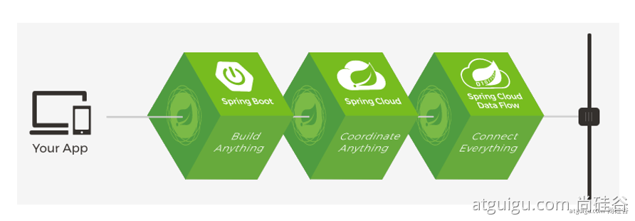

# Spring Boot


 `@EnableAutoConfiguration`。此注解告知 Spring Boot 根据您添加的 jar 依赖来“猜测”您想如何配置 Spring 并进行自动配置，由于 ==**spring-boot-starter-web**== 添加了 Tomcat 和 Spring MVC，auto-configuration（自动配置）将假定您要开发 web 应用并相应设置了 Spring。


main 方法通过调用 `run` 来委托 Spring Boot 的 `SpringApplication` 类，`SpringApplication` 类将引导我们的应用，启动 Spring，然后启动自动配置的 Tomcat web 服务器。我们需要将 `Example.class`  作为一个参数传递给 `run` 方法来告知 `SpringApplication`，它是 Spring 主组件。

 `mvn spring-boot:run`

```java
<?xml version="1.0" encoding="UTF-8"?>
<project xmlns="http://maven.apache.org/POM/4.0.0" xmlns:xsi="http://www.w3.org/2001/XMLSchema-instance"
    xsi:schemaLocation="http://maven.apache.org/POM/4.0.0 https://maven.apache.org/xsd/maven-4.0.0.xsd">
    <modelVersion>4.0.0</modelVersion>

    <groupId>com.example</groupId>
    <artifactId>myproject</artifactId>
    <version>0.0.1-SNAPSHOT</version>

    <parent>
        <groupId>org.springframework.boot</groupId>
        <artifactId>spring-boot-starter-parent</artifactId>
        <version>2.5.4</version>
    </parent>
    <dependencies>
        <dependency>
            <groupId>org.springframework.boot</groupId>
            <artifactId>spring-boot-starter-web</artifactId>
        </dependency>
    </dependencies>
    <!-- Additional lines to be added here... -->
    <build>
        <plugins>
            <plugin>
                <groupId>org.springframework.boot</groupId>
                <artifactId>spring-boot-maven-plugin</artifactId>
            </plugin>
        </plugins>
    </build>
</project>
```


材料清单

https://github.com/spring-projects/spring-boot/blob/v2.0.0.RELEASE/spring-boot-project/spring-boot-dependencies/pom.xml

## 配置类

但我们通常建议主配置源为 `@Configuration` 类

## 自动配置

您需要通过将 `@EnableAutoConfiguration` 或者 `@SpringBootApplication` 注解添加到其中一个 `@Configuration` 类之上以启用自动配置。


@SpringBootApplication` 注解相当于使用 `@Configuration`、`@EnableAutoConfiguration` 和 `@ComponentScan


# Spring Boot2

SpringBoot是整合Spring技术栈的一站式框架。

SpringBoot是简化Spring技术栈的快速开发脚手架

用来组装spring生态圈或整合技术栈，简化配置。能快速创建出生产级别的Spring应用。并引入了两套方案Reactive Stack 、Servlet Stack。

# 一、Spring Boot概述

## 1、 Spring Boot 优缺点

人称版本帝，迭代快，需要时刻关注变化，社区活跃，bug少

### 1.1、Spring Boot优点

* 创建独立的Spring应用
* 内嵌web服务器 
  * ==**Tomcat**== letty or Undertow
* 自动starter依赖，简化构建配置
  * 如==**web场景**==（web starter）
* 自动配置Spring以及第三方功能
  * 简化配置
* 提供生产级别的监控、健康检查及外部化配置
* 无代码生成、无需编写XML
  * 基于自动配置

### 1.2、 SpringBoot缺点

- 封装太深，内部原理复杂，不容易精通

## 2、 时代应用背景

### 2.1、 微服务

- 微服务是一种架构风格
- 一个应用拆分为一组小型服务

- 每个服务运行在自己的进程内，也就是可独立部署和升级
- 服务之间使用轻量级HTTP交互

- 服务围绕业务功能拆分
- 可以由全自动部署机制独立部署

- 去中心化，服务自治。服务可以使用不同的语言、不同的存储技术

### 2.2、 分布式

#### 分布式的困难

- 远程调用
- 服务发现

- 负载均衡
- 服务容错

- 配置管理
- 服务监控

- 链路追踪
- 日志管理

- 任务调度
- ......

#### 分布式的解决

- SpringBoot + SpringCloud
- 

### 2.3、 云原生

- 服务自愈
- 弹性伸缩

- 服务隔离
- 自动化部署

- 灰度发布
- 流量治理

- ......


## 3、 入门案例

### 3.1、创建maven工程

### 3.2、引入依赖

```xml
<parent>
        <groupId>org.springframework.boot</groupId>
        <artifactId>spring-boot-starter-parent</artifactId>
        <version>2.3.4.RELEASE</version>
    </parent>


    <dependencies>
        <dependency>
            <groupId>org.springframework.boot</groupId>
            <artifactId>spring-boot-starter-web</artifactId>
        </dependency>

    </dependencies>
```

### 3.3、创建主程序

```java
/**
 * 主程序类
 * @SpringBootApplication：这是一个SpringBoot应用
 */
@SpringBootApplication
public class MainApplication {

    public static void main(String[] args) {
        SpringApplication.run(MainApplication.class,args);
    }
}
```

### 3.4、编写业务

`@RestController`是==**@Controller和@ResponseBody**==的合体

```java
//@Controller
//@ResponseBody
@RestController
public class HelloWorldController {
    @RequestMapping("/hello")
    public String handle01(){
        return "Hello,Spring Boot 2!";
    }
}
```

### 3.5、测试

直接运行main方法

### 3.6、简化配置

所有配置整合统一到一个文件: ==**application.properties**==例如：

```properties
server.port=8888
```

### 3.7、简化部署

要创建一个可执行的 jar，我们需要添加 ==**spring-boot-maven-plugin**==给我们的 `pom.xml`，在执行`mvn package`命令生成==**可执行jar包**==。

```xml
<build>
    <plugins>
        <plugin>
            <groupId>org.springframework.boot</groupId>
            <artifactId>spring-boot-maven-plugin</artifactId>
        </plugin>
    </plugins>
</build>
```

使用 `java -jar`命令执行jar包：

```terminal
java -jar boot-01-helloworld-1.0-SNAPSHOT.jar
```

# 二、自动配置原理

## 1、SpringBoot特点

### 2.1 依赖管理

* 父项目做依赖管理

  * ```xml
    依赖管理    
    <parent>
        <groupId>org.springframework.boot</groupId>
        <artifactId>spring-boot-starter-parent</artifactId>
        <version>2.3.4.RELEASE</version>
    </parent>
    
    他的父项目
     <parent>
        <groupId>org.springframework.boot</groupId>
        <artifactId>spring-boot-dependencies</artifactId>
        <version>2.3.4.RELEASE</version>
      </parent>
    
    spring-boot-dependencies几乎声明了所有开发中常用的依赖的版本号,自动版本仲裁机制
    ```

* 开发导入starter场景

  * spring-boot-starter-* 是官方场景

  *  *-spring-boot-starter是第三方提供的场景

  * 只要引入starter，这个场景的所有常规需要的依赖我们都自动引入

  * SpringBoot所有支持的场景 https://docs.spring.io/spring-boot/docs/current/reference/html/using-spring-boot.html#using-boot-starter

  * 所有场景启动器最底层的都依赖：

  * ```xml
    <dependency>
        <groupId>org.springframework.boot</groupId>
        <artifactId>spring-boot-starter</artifactId>
        <version>2.3.4.RELEASE</version>
        <scope>compile</scope>
    </dependency>
    ```

* 自动版本仲裁

  * 1、引入依赖默认都可以不写版本
    2、引入非版本仲裁的jar，要写版本号。

- 可以修改默认版本号

  - ```xml
    1、查看spring-boot-dependencies里面规定当前依赖的版本 用的 key。
    2、在当前项目里面重写配置
        <properties>
            <mysql.version>5.1.43</mysql.version>
        </properties>
    ```

### 2.2 自动配置

引入web场景后

* 自动配置好Tomcat

  * 引入Tomcat依赖：

    ```xml
     <dependency>
          <groupId>org.springframework.boot</groupId>
          <artifactId>spring-boot-starter-tomcat</artifactId>
          <version>2.3.4.RELEASE</version>
          <scope>compile</scope>
        </dependency>
    ```

    

* 自动配好SpringMVC

  * 引入SpringMVC全套组件
  * 自动配好SpringMVC常用组件（如：上传所需配置的==**multipartResolver**==组件）

* 自动配好Web常见功能，如： 字符编码问题（filter）

  * 帮我们配置好了web开发常见场景

* 默认的扫描包结构

  * ==**主程序所在包及其子包**==的组件都被默认扫描

  * 无需配置包扫描配置

  * 改变扫描路径：==**@SpringBootApplication(scanBasePackages = "com.atguigu.boot.bean")**==

    * 或者**@ComponentScan指定**。

    * ```java
      @SpringBootApplication
      等同于
      @SpringBootConfiguration
      @EnableAutoConfiguration
      @ComponentScan("com.atguigu.boot")
      详情请看@SpringBootApplication注解属性
      ```

* 各种配置拥有默认值

  * 默认配置最终都是映射到某个类上，如：MultipartProperties（配置 multipartResolver组件）

  * 配置文件值最终会绑定每个类上，这个类会在容器中创建对象。

    * 如：application.properties中 改变上传文件大小配置：

      * ```properties
        spring.servlet.multipart.max-file-size=10MB
        ```

* 按需加载所有自动配置项

  * 引入哪些场景，则哪些场景自动配置才会开启

  * springBoot所有的自动配置功能在 `spring-boot-autoconfigure`包里。

    * 可通过导入不导入，查看`spring-boot-autoconfigure`中自动配置场景是否生效。（爆红不生效）

    

## 2、容器功能

