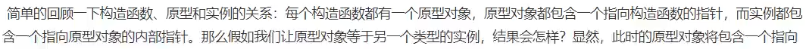
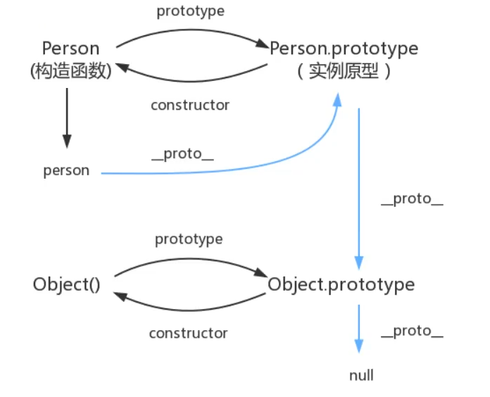

# JavaScript

# 一、JavaScript概述

## 1、JS是什么

JS是一门世界上最流行的脚本语言。

* ==**脚本语言**==：不需要编译，运行过程中有js解释器（js引擎）==**逐行来进行解释并执行**==。
* 可以基于Node.js（不更新了，作者不爽，要开发Deno）技术进行服务器端编程
* 是一门面向对象语言

## 2、JS作用

* 表单动态效验
* 网页特效
* 服务端开发（Node.js）
* 桌面程序（Electron）
* App（Cordova）
* 控制硬件-物联网（Ruff）
* 游戏开发（cocos2d-js）

## 3、HTML/CSS/JS的关系

* 标记语言——描述类语言
  * HTML是身体
  * CSS是装饰
* 脚本语言——编程类语言
  * JS是动作

## 4、浏览器执行JS介绍

浏览器分为：

* 渲染引擎
  * 用来解析HTML与CSS，俗称内核
    * 如：chorme的blink，老版本的webkit
* JS引擎
  * JS解释器。读取JS一条代码并执行
    * 如：chorme的V8

## 5、JS组成

* [ECMASCript](https://baike.baidu.com/item/ECMAScript/1889420)（JS语法）
* **DOM**（页面文档对象模型）
  * 是处理可扩展标记语言的标准编程`接口`，通过它可以操作页面上的各种元素。
* **BOM**（浏览器对象模型）
  * 通过它可以操作浏览器。
    * 如：弹出对话框、控制跳转、获取分辨率等。

# 二、入门

## 1、引入JavaScript

script标签type属性默认为==**“text/javascript”**==。

* ==**行内**==
  * 些在HTML标签的事件属性中
  * HTML使用双引号，JS使用单引号
  * 可读性差
  * 特殊情况下使用
* ==**内嵌**==
  * 常用方式
* ==**外部**==
  * 规范
  * 注意事项：
    * 必须是双标签
    * 必须没内容

```html
<!DOCTYPE html>
<html>
    <head>
        <title>js1</title>
        <!-- 1、内嵌式js -->
        <!-- <script>
            alert('s');
        </script> -->
        <!-- 3、外部js（外部引用js） -->
        <!-- <script src="my.js">
        </script> -->
    </head>
    <body>
        <!-- 2、行内式js -->
        <!-- <input type="button" value="aa" onclick="alert('ss')"/> -->
        <!--这里也可以放
        <script></script>-->
    </body>
</html>
```

my.js文件：

```js
alert('sss')
```

## 2、基本语法

### 2.1、注释

* 单行注释 `//`
* 多行注释 `/**/`

### 2.2、变量

* 声明变量
  * `var age;` (var为 variable的意思)

* 赋值 
  * `age=18`

### 2.3、变量作用域

* var变量（过时）

  * 在最外层函数的外部声明var变量，作用域是==**全局的**==。并且可以在window中使用。
    * 啥是window？
      * 类似所有变量所在的命名空间。
  * 
  * var声明的变量会被==**undefined初始化**==。
  * var可以重新声明同名的变量，会覆盖。（缺陷）
  * 变量提升
    * 一种JS机制：变量和函数声明会移至作用域==**顶部**==。（函数优先）
  * 函数作用域（和let体现为for循环）

* let变量（ES6 这更好）

  * 不会自动初始化
  * 在最外层函数的外部声明var变量，作用域是全局的。==**不可以**==在window中使用。
  * 变量提升
    * 一种JS机制：变量和函数声明会移至作用域==**顶部**==。
  * 块级作用域（这更好）
  * 作用域内不会重新声明

* 

  > 注意：JS有个严格检查模式
  >
  > 启用：必须在代码第一行加入`‘use strict’;`
  >
  > 作用：预防JS随意性出现的问题
  >
  > 


### 2.4、if、for、switch语句

* 分号必须写（不写系统帮忙写，消耗资源，可能写错位置）
* 跟java一样 略

### 2.5、 IO语句

| 方法             | 说明                           | 归属   |
| ---------------- | ------------------------------ | ------ |
| alert(msg)       | 浏览器弹出警示框               | 浏览器 |
| console.log(msg) | 浏览器控制台打印输出信息       | 浏览器 |
| prompt(info)     | 浏览器弹出输入框，用户可以输入 | 浏览器 |

### 2.6、数据类型

* number

  * 不区分小数和整数

  * ```js
    123
    123.1
    1.123e3
    -99
    NaN 这个与所有数值都不相等，包括自己 通过isNaN(NaN)来判断
    Infinity
    ```

  * 尽量==**避免**==使用==**浮点数进行运算**==，存在精度损失。

* 字符

* 字符串

* 布尔值

* null 

* undefined

* 数组

  * 数组元素类型可以不同，数组是中括号[]

  * ```js
    var arr =[1,2,3,4,'ss'.null,true];//比下面的代码可读性高
    new Array(1,2,3,4,'hello');
    ```

  * 

* 对象

  * 是大括号{}

  * ```js
    var person={
    	name:'qinjiang',
        age:3,
        tags: ['js','java','...']
    };
    var myName=person.name;
    ```

### 2.7、运算符

```
== 类型不一样，值一样，为true
==== 类型一样，值一样，为true
```

其它与java差不多。

### 2.8 关键字使用

> ##### typeof

```js
var x1=1;
var x2='s ';
typeof x1  //return number
typeof x2  //return string
```

### 2.9异常使用

```js
throw 'not a number';
```


## 3、流程控制

forEach()

```js
arr.forEach(function (e){
    console.log(e)
})//遍历数组
```

for  in

```js
//for in 存在漏洞 新增元素，下标不变 SE 5 
//arr.name='123';
for(var num in arr){ // num存的不是元素，是下标（不要用就行）
 	console.log(arr[num])
}
for(var num of arr){ // num存的是元素
 	console.log(arr[num])
}
```

​	

# 三、基础

## 1、数据类型

### 1.1、字符串

1. 需要用单引号或双引号

2. 注意转义字符 `\`

   ```
   \'
   \n
   \t
   \u4e2d   \u#### Unicode字符
   \x41   ASCLL字符
   ```

3. 多行字符串编写

   ```js
   var a='sjij
   		sdji
   		sdoj';
   ```

4. 模板字符串

   ```
   var a='name';
   var b='hello${a}';  //el表达式
   ```

   

5. 字符串不可变

6. 常用方法

   ```js
   var a='aaasd';
   a.toUpperCase();
   a.toLowerCase();
   a.indexOf('字符');  //返回索引
   a.substring(1,3);// 包含前面不包含后面 [1,3)
   ```

### 1.2、 数组

1. Arrray可以包含任意的数据类型

2. 数组字符串可变 

   > 注意：
   >
   > 给数组length赋值，数组长度会发生变化。赋值过小元素就会丢失。数组越界undefined

3. 常用方法

   ```js
   let arr =[1,2,3,4,'ss'.null,true];
   arr.indexOf('元素'); //返回索引
   arr.slice(1,3) //[ ) 返回新数组
   arr.push('1') //栈压入
   arr.pop()//栈弹出
   arr.unshift('1') //栈压入
   arr.shift()//栈弹出
   arr.sort()//排序
   arr.reverse()
   arr.concat([1,2,3])//拼接 返回新数组
   arr.join('-')//使用特定的字符串连接 返回字符串
   arr.fill(1) //注意会降维 有值和无值都会填充
   
   ```

4. 多维数组

   ```js
   var arr=[[1,2],[3,4]];
   arr[1][1] //result: 4
   ```

   

### 1.3、对象

1. {}表示一个对象，若干键值对描述属性：xxx:xxx，多个属性之间使用逗号隔开，最后一个属性不加逗号！

```js
var person={
    name:'wujian',
    age:3,
    email:'24736743@qq.com',
    score:0
}
paerson.name='min';

```

2. 调用一个不存在的属性不会报错，只会返回undefined

3. 动态的删减属性

4. ```javascript
   delete person.name //返回true
   ```

5. 动态的添加属性

   ```js
   person.haha='haha'//返回 'haha'
   ```

6. 健必须是字符串，值是任意对象。

7. 判断属性( 方法 )是否在这个对象中

   ```js
   'age' in person//返回true or false
   //继承的
   'toString' in person
   ```

   

8. 常用方法

   ```js
   person.hasOwnProperty('toString'); //不是自身拥有的方法 返回 false
   ```

### 1.4、Map和Set

SE6新特性

Map：

```java
let map=new Map([['tom',100],['aa',70]]);
var score=map.get('tom');
map
console.log(score);
```

Set：无序不重复的集合

```java
 let set=new Set([1,2,2,2,3]);
console.log(set);
console.log(set.delete(2));
console.log(set.has(2));
```

## 2、函数

函数也可以看作是变量

> ##### 定义函数

方式一：

```js
function abs(x){
    if(x>0){
        return x;
    }else{
        return -x;
    }
}
//如果没有执行return，返回结果为undefined
```

 方式二：

```js
var abs =function(x){

}
```

> ##### 调用函数

```js
abs(10);
abs(-10); 
```

> ##### arguments

`arguments`是一个关键字，代表传递进来的所有的参数是一个数组

```js
function abs(x){
    console.log('x=>'+x);
    for(let i=0;i<arguments.length;i++){
        console.log(arguments[i]);
    }
    if(x>0){
        return x;
    }else{
        return -x;
    }
}
```

> ##### rest

ES6引入的新特性，湖区出来已经定义的参数之外的所有参数

rest参数只能写在最后面，必须用…

```js
 function mul(a,b,...rest){
     console.log('a=>'+a);
     console.log(argumnets[i]);
     console.log(rest);
 }
mul(3,4,1,2)
a=>3
b=>4
(2) [1,2]

```

## 3、变量

var、let、const（常量大写就行）

使用var / let / const 声明的局部变量都会被绑定到 Local 对象。注：Script对象、Window对象、Local对象三者是平行并列关系。(待处理)

#### 3.1、作用域

> ##### var

* 函数作用域
* 全局作用域（可以通过window访问）
* 变量作用域提升
* for 循环体 bug（for循环体外能访问）
* 变量作用域内可重新声明
* 自动初始化为undefined

> ##### let

* 函数作用域
* 全局作用域（不可以通过window访问）
* 变量作用域提升
* for 循环体 bug修复（for循环体外不能访问）

* 变量作用域内不可重新声明
* 不自动初始化

## 4、方法

放在对象中的函数

> #####  方式一

```js
var wuwu={
    name:'dog',
    birth:2020,
	age:function(){
        var now=new Date().getFullYear();
        return now-this.birth;
    }}  

```

> ##### 方式二

```js
function getAge(){
     var now=new Date().getFullYear();
     return now-this.birth;
}
var wuwu={
    name:'dog',
    birth:2020,
    age:getAge
}
```

> ##### this apply

this 默认指向调用对象或者说是所在对象

apply改变this指向：

```js
function getAge(){
     var now=new Date().getFullYear();
     return now-this.birth;
}
var wuwu={
    name:'dog',
    birth:2020,
    age:getAge
}
getAge.apply(wuwu,[]);//等价于wuwu.getAge() //[]为函数参数	
```

## 5、内部对象

> 标准对象

```js
typeof 123
'number'
typeof "123"
'string'
typeof undefined
'undefined'
typeof []
'object'
typeof {}
'object'
typeof Math.abs
'function'
typeof NaN
'number'
typeof null
'object'
typeof true
'boolean'
```

### 5.1、Date

```js
 let date=new Date();
now.getFullYear();
now.getMonth();//0~11
now.getDay();//0~7
now.getHours();//时 0~23
now.getMinutes();//分0~59
now.getSeconds();//秒0~59
now.getTime();//时间戳
console.log();

```

```js
date.toDateString()
'Thu Nov 18 2021'
date.toUTCString()
'Thu, 18 Nov 2021 07:59:13 GMT'
date.toGMTString()
'Thu, 18 Nov 2021 07:59:13 GMT'
date.toISOString()
'2021-11-18T07:59:13.355Z'
date.toJSON()
'2021-11-18T07:59:13.355Z'
date.toLocaleDateString()
'2021/11/18'
date.toLocaleString()
'2021/11/18 下午3:59:13'
date.toLocaleTimeString()
'下午3:59:13'
date.toString()
'Thu Nov 18 2021 15:59:13 GMT+0800 (中国标准时间)'
date.toTimeString()
'15:59:13 GMT+0800 (中国标准时间)'

```

### 5.2、JSON对象

早期，所有数据传输习惯使用XML文件！

* [JSON](https://baike.baidu.com/item/JSON)([JavaScript](https://baike.baidu.com/item/JavaScript) Object Notation, JS 对象简谱) 是一种轻量级的数据交换格式。
* 简洁和清晰的层次结构使得 JSON 成为理想的数据交换语言。
* 有效提升网络传输效率。

。BSON是二进制JSON。

在JS一切皆为对象、任何JS支持的类型都可以用JSON来表示。

JSON字符串和JS对象转化：

```js
let user={
    name:'a',
    gender:'remale',
    age:18
}
let str=JSON.stringify(user);
console.log(str);
let obj=JSON.parse(str);
console.log(obj);
```


## 6、面向对象编程

什么是面向对象？

* 类：模板。
* 对象：具体的实例。

==**JS转换下思维：**==

原型：模板 原型对象（比如ren对象，其原想是ren原型对象。对象和原型对象区分开）

对象：具体的实例。


> ##### 原型对象

以前的（人变鸟，很随意，跟继承差不多，但思维有点）：

```js
   let ren= {
            name: "haoren",
            age: 18,
            do: function(){
                console.log("run...");
            }
        };
        let Bird={
            do:function(){
                console.log("fly...");
            }
        };
            let wu={
                name:"wuge",
                age:22
            };
            // wu.__proto__=ren;
            wu.__proto__=Bird; 

       function Student(name){
            this.name=name;
        }
        //给Student原型增加方法
        Student.prototype.hello=function(){
            alert('hello');
        };
        // 调用
        Students.prototype.hello();

```

> ##### class 继承

现在的（ES6，class关键字）

```js
  class Student{
            //构造器不能重载(好像是java简化版,其它的没试过)
            // constructor(){
            //
            // }
            constructor(name){
                this.name=name;
            }
            hello(){
                alert('hello');
            }
        }
        class BigStudent extends Student{
            constructor(name,age){
                //super()
                super(name);
                this.age=age;
            }
        }
        let stu1=new Student('1');
        let stu2=new BigStudent("xiaoming",18);
        console.log(stu1.hello());
```

> ##### 原型链

 在JS中，每个函数都有一个prototype属性，这属性指向函数的`原型对象`。

 简单的回顾一下构造函数、原型和实例的关系：每个构造函数都有一个原型对象，原型对象都包含一个指向构造函数的指针，而实例都包含一个指向原型对象的内部指针。那么假如我们让原型对象等于另一个类型的实例，结果会怎样？显然，此时的原型对象将包含一个指向另一个原型的指针，相应地，另一个原型中也包含着一个指向另一个构造函数的指针。假如另一个原型又是另一个类型的实例，那么上述关系依然成立。如此层层递进，就构成了实例与原型的链条。这就是所谓的原型链的基本概念。——摘自==**《javascript高级程序设计》**==

Object.prototype为null






> ##### prototype和\_\_proto\_\_ 头疼问题

prototype函数有，对象没有

```js
function Fn() {
        }
        var fn = new Fn()
        Fn.prototype===fn.__proto__ ;
```

其它不深入。待处理

## 7、操作BOM对象

> ##### 浏览器介绍

JS和浏览器的关系？

JS诞生是为了能够让它在浏览器中运行。

BOM：浏览器对象模型。

内核如下：

* IE 6~11
* Chrome
* Safari
* FireFox
* Opera

三方：（能切换内核）

* QQ浏览器
* 360浏览器

### 7.1、window

window代表浏览器窗口

```js
window.innerHeight
149
window.innerWidth
1920
window.outerHeight
1040
window.outerWidth
1920
```

### 7.2、Navigator（不建议使用）

Navigator封装了浏览器的信息

```js
navigator.appName
'Netscape'
navigator.appVersion
'5.0 (Windows NT 10.0; Win64; x64) AppleWebKit/537.36 (KHTML, like Gecko) Chrome/95.0.4638.54 Safari/537.36'
navigator.userAgent
'Mozilla/5.0 (Windows NT 10.0; Win64; x64) AppleWebKit/537.36 (KHTML, like Gecko) Chrome/95.0.4638.54 Safari/537.36'
navigator.platform
'Win32'
```

大多数时候，我们不会使用navigator对象，因为会被认为修改，不建议使用这些属性来判断和编写代码。

### 7.3、screen

代表屏幕尺寸

```js
screen.width
1920
screen.height
1080
```

### 7.4、location（重要）

location代表当前页面的URL信息

```js
location.host
'www.baidu.com'
location.href
'https://www.baidu.com/'
//刷新网页
location.reload()
//
location.assign('https://www.bilibili.com/')
```

### 7.5、document

document 代表当前的页面，HTML DOM文档树。

```js
document.title
'百度一下，你就知道'
document.title='1'
'1'
document.getElementById('#1')//获取具体的树节点
null
document.getElementsByClassName('.1')
HTMLCollection []
```

cookie劫持原理（也就是单点登录）

```js
document.cookie
'PSTM=1636547731; BAIDUID=6A2211CB60F30F2D4C56C115FC0DA053:FG=1; BD_UPN=12314753; BIDUPSID=837546D6F55D01AB96E9C036C266EF99; BD_HOME=1; H_PS_PSSID=34442_35104_31253_35237_34967_35049_34584_34504_35246_34812_34814_26350_35145; BA_HECTOR=0h2hagaka02h842h5r1gphnu10r'
```

服务器端可以设置cookie：httpOnly 使cookie安全

### 7.6、history（不建议使用）

```js
history.back()//后退
history.forward()//前进
```

## 8、操作DOM对象（重点）

> ##### 核心

浏览器网页就是一个DOM属性结构！

*  更新：更新DOM节点
* 遍历DOM节点：得到DOM节点
* 删除：删除一个DOM节点
* 添加：添加一个新的节点

### 8.1、获取节点

要操作一个DOM节点，就必须要先获得这个

DOM节点

```js
<body>
<div id="father">
    <h1>1</h1>
    <p id="p1">2</p>
    <p class="p2">3</p>
</div>
<script>
        //script脚本放后面别放前面，因为还没加载。

        let h1=document.getElementsByTagName('h1');//返回类型为HttpCollection[]
        let p1=document.getElementById('p1');//返回类型为HTMLElement（不规范 待处理 我不知道咋读）
        let p2=document.getElementsByClassName('p2');//返回类型为HttpCollection[]
        let father=document.getElementById('father');//返回类型为HTMLElement（不规范 待处理 我不知道咋读）

</script>
</body>

</html>

```

```js
//获取父节点的儿子节点
father.children
HTMLCollection(3) [h1, p#p1, p.p2, p1: p#p1]
father.childNodes
NodeList(7) [text, h1, text, p#p1, text, p.p2, text]
father.lastChild
#text //把标签的换行符解析成节点了
father.lastChild
#text
             
```

### 8.2、更新节点

操作文本、包含HTML的文本与CSS

```js
p1.innerText='22'
'22'
p1.innerHTML='<strong>123</strong>'
'<strong>123</strong>'
p1.style.color='red';
"red"
p1.style.fontSize='200px';
"200px"
p2[0].style.padding='20px'
'20px'
h11[0].
```

### 8.3、删除节点

删除节点的步骤：先获取父节点，再通过父节点删除自己（可以自杀remove()）

```html
<body>
  <div id="id1">
    <h1>标题一</h1>
      <p id="p1">p1</p>
      <p class="p2">p2</p>
  </div>
<script>
    let p1=document.getElementById('p1');
    let father=p1.parentElement;
    father.removeChild(p1);
    
</script>
</body>
```

```js
father.children
HTMLCollection(2) [h1, p.p2]
father.childNodes
NodeList(6) [text, h1, text, text, p.p2, text]
```

>  注意：删除多个节点的时候，children是再时刻变化的，删除节点的时候一定要注意

### 8.4、插入节点

**追加**`xxx.append()`

**插入**`xxx.insertBefore(newNode,targetNode).`

```js
head>
    <meta charset="UTF-8">
    <title>Title</title>
</head>
<body>
  <p id="js">JavaScript</p>
  <div id="list">
      <p id="se">JavaSE</p>
      <p id="ee">JavaEE</p>
      <p id="me">JavaME</p>
  </div>

<script>
    let js =document.getElementById('js');
    let list=document.getElementById('list');
    list.append(js);
    var newP=document.createElement('p');
    newP.innerText='123';
    list.append(newP);
    let myScript =document.createElement('script');
    myScript.setAttribute('type','text/javascript');
    list.append(myScript);
    list.insertBefore(js,document.getElementById('ee'));
</script>
</body>
```

## 9、操作表单（验证）

包括

1. 文本框 `<input type="text">`
2. 下拉框 `<select>`
3. 单选框 `<input type="radio">`
4. 多选框`<input type="checkbox">`
5. 隐藏域`<input type="hidden">`
6. 密码框`<input type="password">`
7. ……

表单目的：提交信息

```js
<body>
//onsubmit为true则放行
<form action="https://www.baidu.com/" method="post" onsubmit="aa()">
    <input type="text" name="account" value="" id="account"/>
    <input type="password" value="" id="input-password"/>
    <input type="hidden" id="md5-password" name="password">
    <input type="radio" name="sex" value="boy">
    <input type="radio" name="sex" value="gril">
    <button type="submit" >提交</button>

</form>
<script>

    let inputs=document.getElementsByTagName('input');
    //inputs[4].value 是写死的，为gril
    inputs[4].checked = true;
    function aa(){
        let pwd=document.getElementById('input-password');
        let md5_pwd=document.getElementById('md5-password');
        md5_pwd.value=md5(pwd.value);
        return true;
    }
</script>
</body>
```

## 10、JQuery

JQuery是 JavaScript 库。

如何使用：导入script和看JQuery API （网上有）

一般公式：

> ##### $(selector).action()

例子如下：

```js
$('#root').click()
$('#root').text()
$('#root').html()
$('#root').show()
$('#root').hide()//本质display：none
$('#root').toggle()//切换隐藏和显示
$('#root').css({"color","red"})


$(document).ready(function(){})
等价于
$(function{})

$ajax()
```

# ==**小技巧**==与需要的应用

巩固js（看Jquery源码，看游戏源码在源码之家）

巩固HTML CSS（扒网站，全部下载下来，删除掉非核心代码（也就是不影响布局 看效果））

layer 弹窗组件

elementUI

# 补充：

### 操作表单需要补充

# 其它：

### HTMLCollection与NodeList

### Object.defineproperty

可以用来数据代理

```js
<body>
    <script>
        let number=18;
        let person={
            name:'张三',
            sex:'男'
        }
        Object.defineProperty(person,'age'{
            enumerable:true,//控制属性是否可以被枚举，默认值是false
            writable:true,//控制属性是否可以被修改，默认值是false
            configurable:true,//控制属性是否可以被删除，默认值false
            //当有人读取person的age属性时，get函数（getter）就会被调用，且返回值就是age的值
            get(){
                console.log('有人读取age属性了')
            },
            //当有人修改person的age属性时，set函数（setter）就会被调用，且会收到修改的具体值
            set(value){
                console.log('有人修改了age属性，且值是',value);
                number=value;
            }
        });
    </script>
```


# 参考资料

#### GMT 

格林尼治所在地的标准时间（前世界时）

#### UTC

使用原子钟，世界标准时间（新时间时）

#### CST（central Standard Time）

#### ISO

表示时间的一种格式


