> # Vue

# 一、Vue概述

#### Vue是什么？

一套用于构建用户界面的渐进式JavaScript框架

#### Vue特点

* 采用==**组件化**==模式，提高代码复用率、且让代码更好维护。 如：

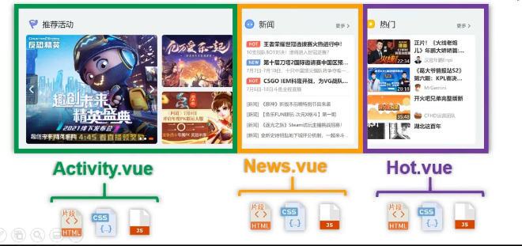

* ==**声明式编码**==（一蹴而就。与之相反为命令式编码），让编码人员无需直接操作DOM，提高开发效率。

* 使用==**虚拟DOM**==+==**优秀的Diff（不同）算法**==，尽量复用DOM节点。如：

  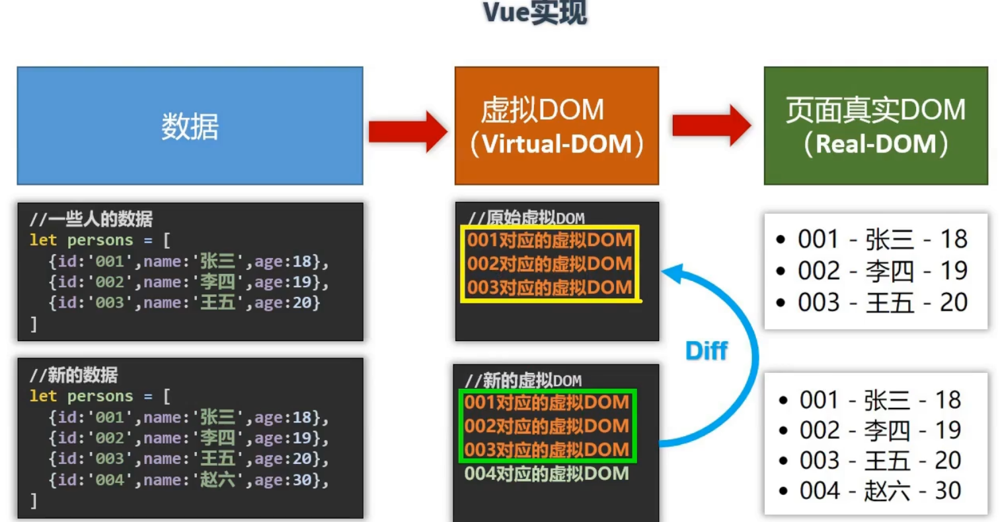

## 1、安装并创建实例

下载（一个开发的、一个生产的）

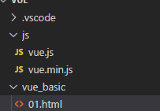

html引入.js

消除提示

* 安装 chrome DevTool插件

* 设置Vue全局变量：

  * ```terminal
    Vue.config.productionTip=false; //设置为 false 以阻止 vue 在启动时生成生产提示。
    ```

写容器并绑定Vue实例：（声明式渲染）

```html
<!DOCTYPE html>
<html lang="en">
<head>
    <meta charset="UTF-8">
    <meta http-equiv="X-UA-Compatible" content="IE=edge">
    <meta name="viewport" content="width=device-width, initial-scale=1.0">
    <title>Document</title>
    <script src="../js/vue.js"></script>    
</head>
<body>
    <!-- 准备好一个容器如下： -->
    <div id="root">
        <h1>{{who}}报道</h1>
        <h1>{{how}}</h1>
    </div>
    <script >
        Vue.config.productionTip=false//设置为 false 以阻止 vue 在启动时生成生产提示。
        //创建Vue实例
        const vm=new Vue({
            el:'#root', //el用于指定当前Vue 实例为哪个容器服务，值通常为css选择器字符串
            //le:document.getElementById('root') 笨重
            data:{
                who:'We',
                how:'do'
            }
        })
        // axios({
        //     url:'http://????'
        // })
    </script>    
    
</head>
</body>
</html>
```

## 2、初识Vue：（总结）

1. Vue工作，就必须创建一个Vue实例，且要传入配置对象。（如：el data）
2. root容器代码依然符合html规范，只是混入了一些特殊Vue语法。
3. root容器里的代码被称为【==**Vue模板**==】
4. 一个实例不能接管多个容器（要==**一对一**==）
5. 只是开发中只有一个Vue实例，并且会配合这组件一起使用
6. {{xxx}}中的`xxx`要写==**js表达式**==，且xxx可以自动读取到data中的所有属性。
7. 一旦data中的数据==**发生改变**==，模板（页面）中用到该数据的地方也会==**自动更新**==。
   1. 除了`Object.freeze()`，这会==**阻止修改**==现有的 property
8. 只有当实例被创建时就已经存在于 `data` 中的 property 才是==**响应式**==的。之后加入的属性为==**非响应式**==

# 二、Vue核心 basic

待处理

## 1、插值语法

功能：用于解析标签体内容

写法：{{xxx}},xxx是js表达式，且可以直接读取到data中的所有属性。

## 2、指令语法

功能：用于解析标签（包括：标签属性、标签体内容、绑定事件、…）

写法：

1. `v-bind:href=“xxx”`或简写为`:href=“xxx”`,xxx同样要写js表达式。  
2. `v-bind:[yyy]=“xxx”` 或简写 `:[yyy]=“xxx”` 被`[]`括起来的会被作为一个指令的参数的js表达式（动态参数）

```html
<body>
    <div id="r">
        {{name.toUpperCase()}}
        <a :href="url.toUpperCase()">尚硅谷1</a>
        <a :href="Iterate.url">尚硅谷2</a>
        <a :[aa]="Iterate.url">尚硅谷2</a>

    </div>
<script>
    const vm=new Vue({
        el:'#r',
        data:{
            name:'a',
            url:'http://www.baidu.com',
            Iterate:{
                url:'http://www.blibli.com'
            },
            aa:'href'
        }
    })
</script>    
</body>
```

## 3、数据绑定

Vue中有2种数据绑定的方式：

1. 单向绑定（v-bind）：数据只能从data流向页面。

2. 双向绑定（v-model）：数据不仅能从data流向页面，还可以从页面（或js）流向data

   1. 双向绑定一般都应用在表单类元素上（如：input、select等）
2. `v-model:value`可以简写为`v-model`，因为v-model默认手机的就是value值。

双向数据绑定如图：

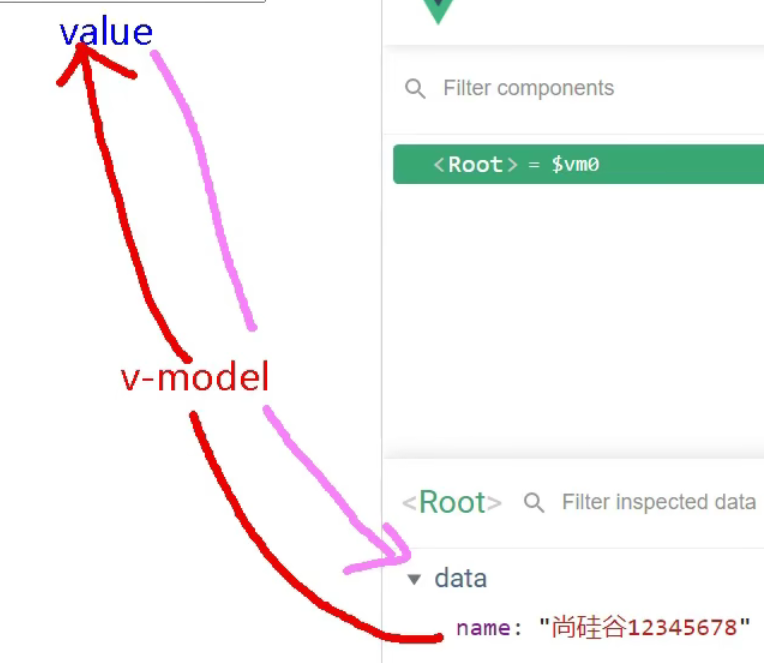

```html
<body>
    <div id="root">
        <!-- 普通写法 -->
        <!-- 单向数据绑定：<input type="text" v-bind:value="name"><br><br>
        双向数据绑定：<input type="text" v-model:value="name"><br><br> -->
         <!-- 简写写法 -->
        单向数据绑定：<input type="text" :value="name"><br><br>
        双向数据绑定：<input type="text" v-model="name"><br><br>
<!-- 下列是错误的，v-model只能作用在表单类元素（输入类元素）上，不然没意义 -->
        <!-- <h2 v-model:x="name">你好啊</h2> -->
    </div>
    <script>
        new Vue({
            el:'#root',
            data:{
                name:123
            }
        })
    </script>
</body>
```

## ==注意点 1：写法==

data与el写法：

1. el有2种写法

   1. new Vue 的时候配置el属性
   2. 先创建Vue实例，随后再通过`vm.$mount('#root');`指定el的值。

2. data有2种写法

   1. 对象式（一般的写法）

   2. 函数式

      如何选择：目前哪种写法都可以，以后学习到组件时，data必须使用函数式，否则会==**报错**== 待处理

3. 一个重要的原则：

   由Vue管理的函数，一定不要写箭头函数，一旦写了箭头函数，this就不再是Vue实例。

```js
<body>
    <div id="root">
      {{name}}
    </div>
    <script>
        const vm=new Vue({
            // el:'#root',
            // data:{
            //     name:'写法1'
            // }
               data(){
                   console.log('@@@',this)//此处的this是vm
                   return{
                       name:'写法2'
                   }
               }
        });
        setTimeout(() => {
            vm.$mount('#root');
        }, 1000);
    </script>
</body>
```

## 4、MVVM模型

1. M 模型（Model）：对应data种的数据
2. V：视图（View）：模板

3. VM：视图模型（ViewModel）：Vue实例对象

观察发现：

1. data中所有的属性，最后都出现在了vm身上。

2. vm身上所有的属性 及 vue原型上的所有属性，在模板中都可以直接使用。

   


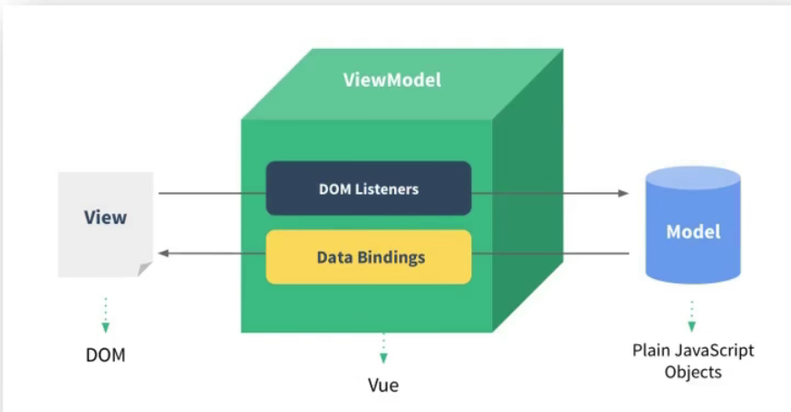


## 5、 ==**Vue 数据代理**==

1. Vue中的数据代理：

   ​		通过vm对象来代理_data对象中属性的操作（读/写）

2. Vue中数据代理的好处：

   ​		更加方便的操作data中的数据

3. 基本原理：

   ​		通过Object.defineProperty()把data对象中所有属性添加到vm上。为每一个添加到vm上的属性，都指定一个getter/setter。在getter/setter内部去操作（读/写）_data中对应的属性。 
   
   

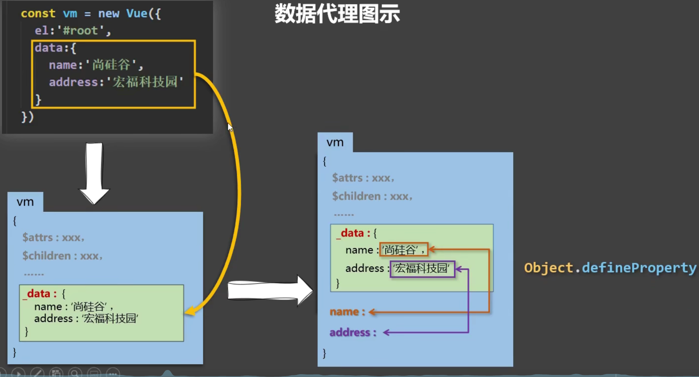


```html
<body>
    <div id="root">
        {{name}}
    </div>
    <script>
        let data={
            name:'数据代理'
        }
        new Vue({
            el:'#root',
            data
        })
    </script>
</body>
```


_data是对data升级，其中升级步骤如下：

1. 加工data（就能响应式了）
2. vm._data=data

_data是对data升级，其中代理规则如下：

vm身上的`data`代理`_data`，`_data`代理`网页的数据`。

`data`代理的setter/getter如：

```terminal
get name: ƒ proxyGetter()
set name: ƒ proxySetter(val)
```

`_data`代理的setter/getter如：

```terminal
get name: ƒ reactiveGetter()
set name: ƒ reactiveSetter(newVal)
```


## 6、事件处理

事件的基本使用：

1. 使用`v-on:xxx` 或 `@xxx` 绑定事件，其中xxx是事件名（也可以是简单的js表达式）
2. 事件的回调需要配置在methods对象中，最终会在vm上
3. methods中配置的函数，不要用箭头函数！否则this就不是vm了
4. methods中配置的函数，都是被Vue所管理的函数，this的指向是vm 或 组件实例对象
5. `@click="demo"` 和 `@click="demo($event)"` 效果一致，但后者可以传参。

```html
<body>
    <div id="root">
        <h2>欢迎来到{{name}}</h2>
        <!-- <button v-on:click="showInfo1">点我提示信息1(不传参)</button> -->
        <button @click="showInfo1">点我提示信息1(不传参)</button>
        <button @click="showInfo2($event,66)">点我提示信息2(传参)</button>
    </div>
    <script>
        const vm=new Vue({
            el:'#root',
            data:{
                name:'事件处理'
            },
            methods: {
                showInfo1(e){
                    console.log('事件目标：', e.target);
                    console.log('事件目标文本：', e.target.innerText);
                    console.log('this :>> ', this);//此处this指vm
                },
                showInfo2(e,tmp){
                    console.log('The param is: ', tmp);
                    console.log('object :>> ', e.target);
                }
            },
        })
    </script>
</body>
```

### 6.1、事件修饰符

Vue中的事件修饰符：

   				1. prevent：阻止默认事件（常用）
   				2. stop：阻止事件冒泡（常用）（由内往外冒）
   				3. once：事件只触发一次（常用）
   				4. capture：使用事件的捕获模式（由外往内捕获）
   				5. self：只有event.target是当前操作的元素时才触发事件
   				6. passive：事件的默认行为立即执行。无需等待事件回调执行完毕。

```html
<body>
    <div id="root">
        <h2>欢迎来到{{name}}</h2>
        <!-- 1. prevent：阻止默认事件（常用） -->
        <a href="http://www.baidu.com" @click.prevent="showInfo1">prevent</a>
        <!-- 2. stop：阻止事件冒泡（常用） -->
        <div class="box1" @click="showInfo2">
            <div class="box2" @click="showInfo2">
                <button @click.stop="showInfo2">stop</button>
            </div>
        </div>

        <!-- 3. once：事件只触发一次（常用） -->
        <div class="box2">
            <button @click.once="showInfo3">once</button>
        </div>
        <!-- 4. capture：使用事件的捕获模式 -->
        <div class="box1" @click.capture="showInfo4(1)">
            <div class="box2" @click.capture="showInfo4(2)">
                <button @click.capture="showInfo4(3)">capture</button>
            </div>
        </div>
        <!-- 5. self：只有event.target是当前操作的元素时才触发事件 -->
        <div class="box1" @click.self="showInfo5">
            <button @click="showInfo5">self</button>
        </div>
        <!-- 6. passive：事件的默认行为立即执行。无需等待事件回调执行完毕。 -->
        
        <!-- <ul class="list" @scroll="showInfo6"> -->
        <ul class="list" @wheel.passive="showInfo6"><!--会出现问题 卡-->
            <li>1</li>
            <li>2</li>
            <li>3</li>
            <li>4</li>
        </ul>
    </div>
    <script>
        $('*').css({'marginTop':"10px"});
        $('.box1').css({
            'alignItems': 'center',
            'height':'150px',
            'backgroundColor':"skyblue"
    });
        $('.box2').css({
            'textAlign':'center',
            'height':'75px',
            'width':'800px',
            'backgroundColor':"green"});
        $('.list').css({
        
        'height':'200px',
        'width':'200px',
        'backgroundColor':"peru",
        'overflow':'auto'});
        $('li').css({
        
        'height':'100px',
        });
        
        const vm=new Vue({
            el:'#root',
            data:{
                name:'事件修饰符'
            },
            methods: {
                showInfo1(){
                    alert('点我提示信息1');
                },
                showInfo2(){
                    alert('点我提示信息2');
                },
                showInfo3(){
                    alert('点我提示信息3');
                },
                showInfo4(a){
                    // alert('点我提示信息4 params is: '+a)
                    console.log('a :>> ', a);
                },
                showInfo5(){
                    alert('点我提示信息5');
                },
                showInfo6(){
                    for(let i=0;i<1000000;i++){
                        console.log('#');
                }
                },
            },
        })
    </script>
</body>
```


### 6.2、键盘事件

1. vue中常用的按键别名：

   回车=>enter

   删除=>delete（捕获“删除”和“退格”键）

   退出=>esc

   空格=>space

   换行=>tab（特殊，必须配合keydown去使用，keyup不行，会切换聚焦）

   上=>up

   下=>down

   左=>left

   右=>right

2. Vue未提供别名的按键，可以使用按键原始的key名去绑定，但注意要转为kebab-case(短横线命名)
3. 系统修饰键（用法特殊）：ctrl、alt、shift、meta（是window图标）
   1. 配合keyup使用：按下修饰键的同时，再按下其它键，随后释放其他键，事件才被触发。
   2. 配合keydown使用：正常触发事件。
4. 也可以使用keyCode取指定具体的按键（不推荐）
5. `Vue.config.keyCodes.自定义键名=键码`，可以取定制按键别名。

```html
<body>
   <div id="root">
    <input type="text" placeholder="请输入" @keyup="showInfo">
    <input type="text" placeholder="请输入" @keyup.enter="showInfo">
    <input type="text" placeholder="请输入" @keyup.ctrl.y="showInfo">
    <input type="text" placeholder="请输入" @keyup.haha="showInfo">
   </div>
    <script>
        Vue.config.productionTip = false;
        Vue.config.keyCodes.haha=13;
        'use strict';  
        const vm=new Vue({
           el:'#root',
           methods:{
               showInfo(e){
                   console.log(e.key,e.keyCode);
                //    console.log(e.target.value);
               }
           }
        });
    </script>
</body>
  
```

## 7、计算属性与监听属性

### 7.1、计算属性

1. 定义：要用的属性不存在，要通过已有属性计算得来。
2. 原理：顶层借助了`Object.defineProperty`方法提供的getter和setter
3. get函数什么时候执行？
   1. 初次读取时会执行一次。
   2. 当依赖的数据发生改变时会被再次调用。
4. 优势：与methods实现相比，内部有缓存机制（复用），效率更高，调试方便。
5. 备注：
   1. 计算属性最终会出现在vm上，直接读取使用即可。
   2. 如果计算属性要被修改，拿必须写set函数去响应修改，且set中要引起计算时依赖的数据发生改变。


```html
<body>
    <div id="root">
        性：<input type="text" v-model="firstName"><br><br>
        名：<input type="text" v-model="lastName"><br><br>
        <span>{{fullName}}</span>
    </div>
    <script>
        'use strict';
        Vue.config.productionTip = true;
        const vm=new Vue({
            el:'#root',
            data:{
                firstName:'张',
                lastName:'三'
            },
            computed:{
                //完整写法
                // fullName:{
                    //get()什么时候调用？1.初次读取时。2.所依赖的数据发生变化时。
                //     get(){
                //         //console.log('this :>> ', this); 这里this是vm
                //         return this.firstName+'-'+this.lastName;
                //     },
                //     set(value){
                //         let arr=value.split('-');
                //         this.firstName=arr[0];
                //         this.lastName=arr[1];
                //     }
                // },
                //简写 不包含 set
                fullName(){
                    return this.firstName+'-'+this.lastName;
                }
            }
        });
    </script>
</body>
```

### 7.2、监听属性

监听属性watch：

1. 当被监视的属性变化时，回调函数自动调用，进行相关操作
2. 监视的属性必须存在，才能进行监视！
3. 监听的两种写法：（可以简写哦）
   1. new Vue时传入watch配置
   2. 通过vm.$watch监视）

```html
<body>
    <div id="root">
        <h2>今天天气很{{info}}</h2>
        <button @click="changeWeather">切换天气</button>
    </div>
    <script>
        const vm=new Vue({
            el:'#root',
            data:{
                isHot:true,
            },
            computed:{
                info(){
                    return this.isHot ? '炎热':'凉爽'
                }
            },
            methods: {
                changeWeather(){
                    this.isHot=!this.isHot
                }
            },
            watch:{
                // isHot:{
                //     immediate:true,//初始化时让handler被调用
                //     //handler什么时候调用？当isHot发生改变时。
                //     handler(newVaule,oldValue){
                //         console.log('isHot被修改了 newvalue is: '+newVaule+' and oldvalue is: '+oldValue);
                //     }
                // },
                //简写
                isHot(newVaule,oldValue){
                        console.log('isHot被修改了 newvalue is: '+newVaule+' and oldvalue is: '+oldValue);
                    }
            }
        })
        // vm.$watch('isHot',{
        //     immediate:true,//初始化时让handler被调用
        //     //handler什么时候调用？当isHot发生改变时。
        //     handler(newVaule,oldValue){
        //         console.log('isHot被修改了 newvalue is: '+newVaule+' and oldvalue is: '+oldValue);
        //         console.log(this);
        //     }
        // })
        //简写
        vm.$watch('isHot',function(newValue,oldValue){
            console.log('isHot被修改了 newvalue is: '+newValue+' and oldvalue is: '+oldValue);
            console.log(this);
        })
    </script>
</body>
```


### 7.3、深度监视

深度监视：

1. Vue中的watch默认不检测对象内部值得改变（一层）
2. 配置`deep:true`可以检测对象内部值的改变（多层）

备注：

1. Vue自身可以检测对象内部值的改变，但Vue提供的watch==**默认不可以**==
2. 使用watch时根据数据的具体结构，决定是否采用深度监视。

```html
<body>
    <div id='root'>
        <button @click="numbers.a++">a+1</button>
        <button @click="numbers.b++">b+1</button>
        <span>{{numbers.c}}</span>
    </div>
    <script>
        const vm=new Vue({
            el:"#root",
            data() {
                return {
                    numbers:{
                        a:1,
                        b:2,
                        c:3
                    }
                }
            },
            watch:{
                numbers:{
                    deep:true,
                    handler(newValue,oldValue){
                        console.log('numbers值发生变化了',newValue);
                    },
                    // 'numbers.a':{
                    //     handler(newValue,oldValue){
                    //     console.log('a变了');
                    //     }
                    // },
                    // 'numbers.b':{
                    //     handler(newValue,oldValue){
                    //     console.log('b变了');
                    //     }
                    // }   
                }             
            }
        });
    </script>
</body>
```

### 7.4、计算属性与监听属性的区别

computed和watch之间的区别：

1. computed能完成的功能，watch都可以完成。
2. watch能完成的功能，computed不一定能完成。例如watch可以进行==**异步操作**==。
3. computed==**有返回**==，watch==**没有返回**==

两个重要的小原则：

1. 所被Vue管理的函数，最好写成普通函数，这样this的指向才是vm 或 组件实例对象。
2. 所有不被Vue所管理的函数（定时器的回调函数，ajax的回调函数、Promise等）。最好写成箭头函数，这样this的指向才是vm 或 组件实例对象。

```html
<body>
    <div id="root">
        性：<input type="text" v-model="firstName"><br><br>
        名：<input type="text" v-model="lastName"><br><br>
        <span>{{fullName}}</span>
    </div>
    <script>
        'use strict';
        Vue.config.productionTip = true;
        const vm=new Vue({
            el:'#root',
            data:{
                firstName:'张',
                lastName:'三',
                fullName:'张-三'
            },
            //无法异步
            computed:{
                // fullName(){
                //     setTimeout(() => {
                //         return this.firstName+'-'+this.lastName;
                //     }, 1000);
                //     return this.firstName+this.lastName
                // }
            },
            //可以异步
            watch:{
                firstName(val){
                    setTimeout(() => {
                        this.fullName=val+'-'+this.lastName;
                    }, 1000);
            
                },
                lastName(val){
                    setTimeout(() => {
                        this.fullName=this.firstName+'-'+val;
                    }, 1000);
                }
            }
        });
    </script>
</body>
```

## 8、样式绑定

样式绑定

1. class样式

   写法：（`:class="xxx"` xxx可以是字符串、对象、数组）

   1. 字符串写法适用于：类名不确定，要动态获取。
   2. 对象写法适用于：要绑定多个样式，个数不确定，名字也不确定。
   3. 数组写法适用于：要绑定多个样式，个数确定，名字也确定，但不确定用不用。

2. style样式

   1. `:style="{fontSize:xxx}"`其中xx是动态值
   2. `:style="[a,b]"`其中 a、b是样式对象。

```html
<body>
    <div id="root">
        
        <!-- class绑定样式-字符串写法。适用于：样式的类名不确定，需要动态绑定 -->
        <div class="basic" :class="mood" @click="changeMood">{{name}}</div><br><br>
        <!-- class绑定样式-数组写法。适用于：要绑定的样式个数不确定，名字也不确定-->
        <div class="basic" :class="yangshiArr">{{name}}</div><br><br>
        <button @click="ys1">ys1</button>
        <button @click="ys2">ys2</button>
        <button @click="ys3">ys3</button><br><br>
        <!-- class绑定样式-对象写法。适用于：要绑定的样式个数确定、名字也确定，但要动态决定用不用 -->
        <div class="basic" :class="yangshiObj">{{name}}</div><br><br>
        <!-- style绑定样式-对象写法。 -->
        <div class="basic" :style="styleObj1">{{name2}}</div><br><br>
        <!-- style绑定样式-数组写法。 -->
        <div class="basic" :style="[styleObj1,styleObj2]">{{name2}}</div><br><br>
    </div>
    <script>
        const vm=new Vue({
            el:'#root',
            data:{
                name:'class',
                name2:'style',
                mood:'normal',
                moodArr:['normal','happy','sad'],
                yangshiArr:['yangshi1'],
                yangshiObj:{
                    yangshi1:true,
                    yangshi2:false,
                    yangshi3:false
                },
                styleObj1:{
                    fontSize:'40px',
                    borderRadius:'20px',
                },
                styleObj2:{
                    color:'red',
                    backgroundColor: 'orange'
                },
            },
            methods: {
                changeMood(){
                    this.mood=this.moodArr[Math.floor(Math.random(3)*3)];
                },
                ys1(){
                    // if(this.yangshiArr.indexOf('yangshi1')<0){
                    //     this.yangshiArr.push('yangshi1')
                    // }else{
                    //     this.yangshiArr.splice(this.yangshiArr.indexOf('yangshi1'),1)
                    // }
                    this.yangshiObj.yangshi1=!this.yangshiObj.yangshi1;
                },
                ys2(){
                    // if(this.yangshiArr.indexOf('yangshi2')<0){
                    //         this.yangshiArr.push('yangshi2')
                    // }else{
                    //     this.yangshiArr.splice(this.yangshiArr.indexOf('yangshi2'),1)
                    // }
                    this.yangshiObj.yangshi2=!this.yangshiObj.yangshi2;
                },
                ys3(){
                    // if(this.yangshiArr.indexOf('yangshi3')<0){
                    //         this.yangshiArr.push('yangshi3')
                    // }else{
                    //     this.yangshiArr.splice(this.yangshiArr.indexOf('yangshi3'),1)
                    // }
                    this.yangshiObj.yangshi3=!this.yangshiObj.yangshi3;
                }
                    
            },
            
        })
    </script>
</body>
```


## 9、条件渲染与列表渲染

### 9.1、条件渲染

1. v-if 

   写法：

   * v-if="表达式"
   * v-else-if="表达式"
   * v-else="表达式"

   适用于：切换频率低的场景。

   特点：不展示的DOM元素==**直接被移除**==

   注意：v-if可以和:v-else-if、v-else一起使用，但要求结构不能被“打断”。

2. v-show

   写法：v-show=“表达式”

   适用于：切换频率较高的场景。

   特点：不展示的DOM元素未被移除，仅仅是使用**样式隐藏掉**（也就是 display:none）

3. 备注: 使用v-if的时,元素可能无法获取到，而使用v-show一定可以获取到。`<template></template>`这个标签会在虚拟DOM转换为真实DOM时消掉。只能和v-if一起使用

   ```html
   <body>
   <div id="root">
   	<div v-if="isShow">{{name}}</div>
   	<div v-show="isShow">{{name}}</div>
   	<button @click="n<3?n++:n=1">{{n}}</button>
   	<div v-if="n===1">Angular</div>
   	<!--<div>ss</div>  -->
   	<div v-else-if="n===2">React</div>
   	<div v-else>Vue</div>
   	<!-- template只能配合v-if使用 -->
   	<template v-if="isShow">
   		<h2>1</h2>
   		<h2>2</h2>
   		<h2>3</h2>
   	</template>
   	<div v-if="isShow">
   		<h2>a</h2>
   		<h2>b</h2>
   		<h2>c</h2>
   	</div>
   		
   </div>
   <script type="text/javascript">
   'use strict';
   	const vm=new Vue({
   		el:'#root',
   		data:{
   			name:'talent',
   			isShow:true,
   			n:1
   		}
   	})
   </script>
   </body>
   ```

   

### 9.2、列表渲染

v-for指令

1. 用于展示列表数据
2. 语法：v-for="(item,(index or key)) in xxx" :key="yyy"
3. 可遍历：数组、对象、字符串（不常用）、指定次数（不常用）  
4. `v-for` 的优先级比 `v-if` 更高，这意味着 `v-if` 将分别重复运行于每个 `v-for` 循环中。


```html
<body>
<div id="root">
	<ol>
		<!--遍历数组元素  不写默认为:key="index"   -->
		<li v-for="(obj,index) in persons" :key="obj.id">
		{{obj.name}}-{{obj.age}}
		</li>
	</ol>
	<ol>
		<!--遍历对象的属性 -->
		<li v-for="(value,key) in car" :key="key">
		{{key}}-{{value}}
		</li>
	</ol>
	<ol>
		<!--遍历字符串 -->
		<li v-for="(value,index) in str" :key="index">
		{{value}}-{{index}}
		</li>
	</ol>
	<ol>
		<!--遍历指定次数 -->
		<li v-for="(value,index) in 5" :key="index">
		{{value}}-{{index}}
		</li>
	</ol>
</div>
<script type="text/javascript">
	'use strict';
	const vm=new Vue({
		el:'#root',
		data:{
			persons:[
			         {id:'01',name:'张三',age:18},
			         {id:'02',name:'李四',age:19},
			         {id:'03',name:'王五',age:20},

         	],
	         car:{
	        	 name:'奥迪A8',
	        	 price:'70万',
	        	 color:'黑色'
	         },
	         str:'hello'
			        
		}
	})
</script>
</body>
```

### 9.3、key的作用与原理

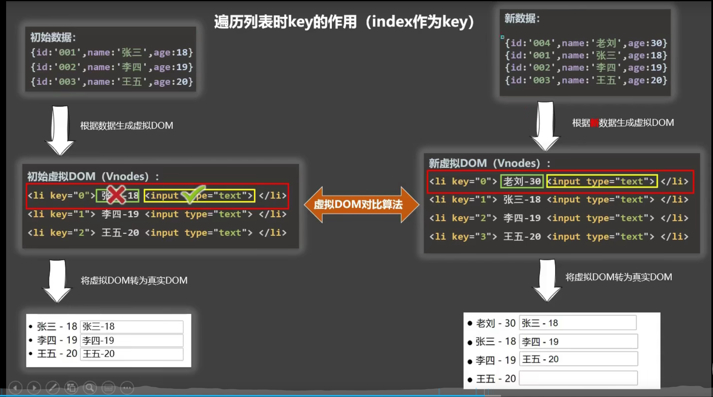

面试题：react、vue中的key有什么作用？（key的内部原理）

1. 虚拟DOM中key的作用：

   key是虚拟DOM对象的标识，当数据发生变化时，Vue会根据【新数据】生成【新的虚拟DOM】、随后Vue进行【新虚拟DOM】与【旧虚拟DOM】的差异比较，比较规则如下：

2. 对比规则:

   1. 旧虚拟DOM中找到了与新虚拟DOM相同的key：
      1. 若虚拟DOM中内容没变，直接使用之前的真实DOM！
      2. 若虚拟DOM中内容变了，则生成新的真实DOM，随后替换页面中之前的真实DOM。
   2. 旧虚拟DOM中未找到与新虚拟DOM相同的key
      1. 创建新的真实DOM，随后渲染到页面。

3. 用index作为key可能会引发的问题：

   1. 若对数据进行：逆序添加、逆序删除等破坏顺序的操作：

      ​		会产生没有必要的真实DOM更新===》界面效果没问题，但效率低。

   

   1. 如果结构中还包含输入类的DOM：

      ​		会产生错误DOM更新===》界面有问题。

4. 开发中如何选择key？：

   1. 最好使用每条数据的唯一表示作为key，比如id、手机号、身份证等unique的值。
   2. 如果不存在对数据的逆序添加、逆序删除等破坏顺序操作，仅用于渲染列表用于展示，使用index作为key时没有问题的。

    ```html
   <body>
   <div id="root">
   	<ol>
   		<li v-for="(obj,index) in persons" :key="index">
   		{{obj.name}}-{{obj.age}}<input >
   		</li>
   	</ol>
   	<button @click="persons.unshift({id:'04',name:'老六',age:21})">添加老六</button>
   </div>
   <script type="text/javascript">
   	'use strict';
   	const vm=new Vue({
   		el:'#root',
   		data:{
   			persons:[
   			         {id:'01',name:'张三',age:18},
   			         {id:'02',name:'李四',age:19},
   			         {id:'03',name:'王五',age:20},
            	],
   		},
   	})
   </script>
   </body>
    ```

   

### 9.4、应用（列表过滤、排序）

1. watch和computed实现列表过滤：

   ```html
   <body>
       <div id="root">
           <h2>人员列表</h2>
           <input type="text" placeholder="请输入名字" v-model="keyWord">
           <ul>
               <li v-for="(p,index) of filPersons" :key="filPersons.id">
                   {{p.name}}--{{p.age}}--{{p.sex}}
               </li>
           </ul>
       </div>
       <script>
           const vm=new Vue({
               el:'#root',
               data:{
                   keyWord:"",
                   persons:[
                       {id:'01',name:'马冬梅',age:19,sex:'女'},
                       {id:'02',name:'周冬雨',age:20,sex:'女'},
                       {id:'03',name:'周杰伦',age:21,sex:'男'},
                       {id:'04',name:'温兆伦',age:22,sex:'男'},
                   ],
                   filPersons:[]
               },
               // watch:{
               //     keyWord:{
               //         immediate:true,
               //         handler(val){
               //             //indexOf('') 结果为0，所以匹配全部 所以immediate:true
               //             this.filPersons=this.persons.filter(item => {
               //                 return item.name.indexOf(val)!=-1
               //             });
                           
               //         }
                       
               //     }
               // }
               computed:{
                   filPersons:{
                       get(){
                           return this.persons.filter((p)=>{
                               return p.name.indexOf(this.keyWord)!=-1
                           })
                       }
                   }
               }
           });
   ```

   2. computed实现排序

   ```html
   <body>
       <div id="root">
           <h2>人员列表</h2>
           <input type="text" placeholder="请输入姓名" v-model="keyWord">
           <button @click="sortType=0">原序</button>
           <button @click="sortType=1">顺序</button>
           <button @click="sortType=2">倒序</button>
           <br><br>
           <ul>
               <li v-for="(p,index) in tmpPersons" :key="p.id">
                   {{p.name}}--{{p.age}}--{{p.sex}}
               </li>
           </ul>
       </div>
       <script>
           const vm=new Vue({
               el:'#root',
               data:{
                   keyWord:"",
                   sortType:0,
                   persons:[
                       {id:'03',name:'周杰伦',age:21,sex:'男'},
                       {id:'01',name:'马冬梅',age:19,sex:'女'},
                       {id:'02',name:'周冬雨',age:20,sex:'女'},
                       {id:'04',name:'温兆伦',age:22,sex:'男'},
                   ],
                   //tmpPersons:[],
               },
               
               computed:{
                   tmpPersons(){
                       const arr= this.persons.filter((p)=>{
                           return p.name.indexOf(this.keyWord)!=-1
                       });
                       if(this.sortType){
                           return arr.sort((p1,p2)=>{
                               return this.sortType===1 ? p1.age-p2.age :p2.age-p1.age;
                           });
                       }else{
                           return arr;
                       }
                   }
               }
           })
          
       </script>
   </body>
   ```

   

## 10、数据监视

Vue监视数据的原理：

1. vue会监视data中所有层次的数据。

2. 如何检测==**对象**==中的数据？

   ​		通过setter实现监视，且要在new Vue时就传入要监测的数据。

   1. 对象中后追加的属性，Vue默认不做响应式处理。
   2. 如需给==**后添加的属性做响应式**==，请使用如下API：
      1. `Vue.set(target.propertyName/index,value)` 或 `vm.$set(target.propertyName/index,value)`

3. 如何监测==**数组**==中的数据？

   ​		通过包裹数组更新元素的方法实现，本质就是做了两件事：

   		1. 调用原生对象的方法对数组进行更新。
   		2. 重新解析模板，进而更新页面。

  4.   在Vue==**修改数组中的某个元素一定要用如下方法**==：

         1. 使用这些API：`push()、shift()unshift()、splice()、sort()、reverse()` 或 `Vue.set()` 或 `vm.$set()`

特别注意：`Vue.set()` 和 `vm.$set()` 不能给 `vm` 或 `vm的根数据对象`（就是直接在vm上或_data上 加 是不行的） 添加属性。！！！


模拟Vue监测数据原理：

```js

let data={
    name:'模拟Vue的数据监测',
    address:'China',
    a:'哈'
}
const obs =new Observer(data);
let vm={};
vm._data=data=obs;
function Observer(obj){
    const keys=Object.keys(obj);
    keys.forEach(k => {
        Object.defineProperty(this,k,{
            get(){
                return obj[k];
            },
            set(val){
              	console.log("用人修改了，我发现了，我要更新界面！")
                obj[k]=val;
            }
        })
    });
}


```

测试例子如下：

```html
<body>
    <div id="root">
        <h1>学生信息</h1>
        <button @click="student.age++">年龄+1岁</button><br>
        <button @click="addSex">添加性别属性，默认值：男</button><br>
        <button @click="student.sex='未知'">修改性别（请添加完，后修改不然不是响应式）</button><br>
        <button @click="addFriend">在列表首位添加一个朋友</button><br>
        <button @click="updateFirstFriendName">修改第一个朋友的名字为：张三</button><br>
        <button @click="addHobby">添加一个爱好</button><br>
        <button @click="updateHobby">修改第一个爱好为：开车</button><br>

        <h3>姓名：{{student.name}}</h3>
        <h3>年龄：{{student.age}}</h3>
        <h3 v-if="student.sex">性别：{{student.sex}}</h3>
        <h3>爱好：</h3>
        <ul>
            <li v-for="(h,index) in student.hobby" :key="index">
                {{h}}
            </li>
        </ul>
        <h3>朋友们：</h3>
        <ul>
            <li v-for="(f,index) in student.friends" ::key="index">
                {{f.name}}--{{f.age}}
            </li>
        </ul>
    </div>
    <script>
        // #region 
        const vm=new Vue({
            el:'#root',
            data:{
                student:{
                    name:'tom',
                    age:18,
                    hobby:['抽烟','喝酒','烫头'],
                    friends:[
                        {name:'jerry',age:35},
                        {name:'tony',age:36}
                    ]
                }
            },
            methods:{
                addSex(){
                    //后添加属性 针对对象
                    //Vue.set(this.student, 'sex', '男');
                    this.$set(this.student, 'sex', '男');
                },
                addFriend(){
                    this.student.friends.unshift({name:'Ailisi',age:35});
                },
                updateFirstFriendName(){
                    this.student.friends[0].name='张三';
                },
                updateHobby(){
                    //针对数组 两种方式
                    //this.student.hobby.splice(0,1,'开车');
                    Vue.set(this.student.hobby, 0, '开车');
                },
                addHobby(){
                    this.student.hobby.push('学习');
                }
            }
        })
        //#endregion 
        new 
    </script>
</body>
```


## 11、收集表单数据

收集表单数据

若：`<input type="text">`，则v-model收集的是value值，用户输入的就是value值。

若：`<input type="radio">`，则v-model收集的是value值，且要给标签配置value值。

若：`<input type="checkbox">`

		1. 没有配置input的value属性，那么收集的就是checked（勾选 or 未勾选，是 布尔值）
		2. 配置input的value属性：
	     		1. v-model的初始值是非数组，那么收集的就是checked（勾选 or 未勾选，是 布尔值）
	     		2. v-model的初始值是数组，那么收集的就是value组成的数据。

备注：v-model：的三个修饰符：

​		lazy：失去焦点再收集数据

​		number：输入字符串转为有效的数字

​		trim：==**输入首尾空格过滤**==

 ```html
 <body>
     <div id="root">
         <!-- 阻止提交跳转 -->
         <form @submit.prevent="demo">
             <!-- <label for="count">账号：</label> -->
             账号：<input type="text" v-model.trim="userInfo.account" ><br><br>
             密码：<input type="text" v-model.trim="userInfo.pwd"><br><br>
             年龄：<input type="number" v-model.number="userInfo.age"><br><br>
             性别：
             男：<input type="radio" name="sex" v-model="userInfo.gender" value="male">
             女：<input type="radio" name="sex" v-model="userInfo.gender" value="female"><br><br>
             爱好：
             学习  <input type="checkbox" v-model="userInfo.hobby" value="study">
             打游戏<input type="checkbox" v-model="userInfo.hobby" value="game">
             吃饭  <input type="checkbox" v-model="userInfo.hobby" value="eat"><br><br>
             所属校区:
             <select v-model="userInfo.city">
                 <option value="">请选择校区</option>
                 <option value="beijing">北京</option>
                 <option value="shanghai">上海</option>
                 <option value="shenzhen">深圳</option>
                 <option value="wuhan">武汉</option>
             </select><br><br>
             其它信息：
             <textarea v-model.lazy="userInfo.other"></textarea><br><br>
             <input type="checkbox" v-model="userInfo.agree">阅读并接受<a href="http://www.baidu.com">《用户协议》</a><br><br>
             <button>提交（默认类型为submit）</button>
         </form>
     </div>
 </body>
     <script>
         const vm=new Vue({
             el:'#root',
             data:{
                 userInfo:{
                     account:'',
                 pwd:'',
                 gender:'female',
                 age:null ,
                 hobby:[],
                 city:'',
                 other:'',
                 agree:''
                 }
             },
             methods: {
                 demo(){
                     console.log(JSON.stringify(this.userInfo))
                 }
             },
         })
     </script>
 </html>
 ```

## 12、过滤器

过滤器：

定义：对要显示的数据进行特定格式化后再显示（适用于一些简单的处理）

注册过滤器：

1. 注册全局过滤器：`Vue.filter(name,callback)`  
2. 注册局部过滤器： `new Vue(filters:{})`

用法：

​		`{{xxx | 过滤器名}}` 或 `v-bind:属性="xxx | 过滤器名"`  （可以连串）`v-model不行`

备注：

1. 锅炉其也可以接收额外参数、多个过滤器也可以串联
2. 并没有改变原本的数据，是产生新的对应的数据。


```html
<!DOCTYPE html>
<html lang="en">
<head>
    <meta charset="UTF-8">
    <meta http-equiv="X-UA-Compatible" content="IE=edge">
    <meta name="viewport" content="width=device-width, initial-scale=1.0">
    <title>Document</title>
    <script src="https://cdn.bootcdn.net/ajax/libs/dayjs/1.10.6/dayjs.min.js"></script>
    <script src="../js/vue.js"></script>    
    <script src="https://cdn.bootcdn.net/ajax/libs/jquery/3.6.0/jquery.js"></script>
    
</head>
<body>
    <div id="root">
        <h3>时间戳：{{timestamp}}</h3>
        <h3>过滤后的时间：{{timestamp | timeFormater}}</h3>
        <h3>过滤后的时间（传参）：{{timestamp | timeFormater('YYYY_MM_DD') | mySlice}}</h3>
        <h3 :x="msg | mySlice">全局</h3>
        <!-- 这下不能这么玩 -->
        <!-- <input type="text" v-model="msg | mySlice"> -->
    </div>

</body>
<script>
    Vue.filter('mySlice',function(value){
        return value.slice(0,4);
    });
    const vm=new Vue({
        el:'#root',
        data:{
            msg:'12345',
            timestamp:new Date().getTime(),
        },
        //这是实时动态时间的
        // methods:{
        //     getTime(){
        //         setInterval(() => {
        //             this.timestamp=new Date().getTime();
        //         }, 1000);
        //     }
        // },
        // created(){
        //     this.getTime();
        // },

        filters:{
            timeFormater(value,str='YYYY年MM月DD日HH:mm:ss'){
                return dayjs(value).format(str);
            }
        }
    })
</script>
</html>
```


## 13、内置指令

v-bind：单向数据绑定 

v-model：双向数据绑定

v-for：遍历数组、对象、字符串

v-on：绑定事件

v-if：条件渲染（动态控制节点是否存在）

v-else：条件渲染（动态控制节点是否存在）

v-show：条件渲染（动态控制节点是否展示）

==**v-text指令：**==

1. 作用：向其所在的节点中渲染文本内容。
2. 与插值语法的区别：v-text会替换掉节点中的内容。

==**v-html指令：**==

1. 作用：向指定节点中渲染包含html结构的内容
2. 与插值语法的区别：
   1. v-html会替换掉节点中所有的内容
   2. v-html可以识别html结构
   3. 注意：v-html有安全性问题！！！
      1. 再网站上动态渲染任意HTML是非常危险的，容易导致XSS攻击
      2. 一定要再可信的内容上使用v-html，永不要用再用户提交的内容上！

v-cloak指令（不接受参数）：

1. 本质是一个特殊属性，Vue实例创建完毕并接管容器后，会删掉v-cloak属性。
2. 使用css配合v-cloak可以解决网速慢时界面展示出{{xxx}}模板的问题。

v-once指令（不接受参数）：

1. v-once所在节点再初次动态渲染后，就视为静态内容了（只解析一次）
2. 以后数据的改变不会引起v-once所在结构的更新，可以用于优化性能

v-pre指令：

1. 通过其所在的节点的编译过程。
2. 可利用它跳过：没有使用指令语法、没有使用插值语法的节点，会加快编译。

```html
    <style>
        /* [v-cloak]{
            display: none;
        } */
    </style>
</head>
<body>
    <div id="root">
        <!-- v-text -->
        <div v-text="name">这是什么</div>
        <!--v-html-->
        <div v-html="str">好啊</div>
        <!--v-cloak-->
        <div v-cloak >{{name}}</div>
        <!-- v-once -->
        <div v-once>n:{{n}}</div><br>
        <div>n:{{n}}</div>
        <button @click="n++">n+1</button>
        <!--v-pre-->
        <div v-pre>跳过简简单单</div>
    </div>
</body>
<script>
    $('[v-cloak]').css({"display":"none"})
    setTimeout(() => {
    const vm=new Vue({
        el:'#root',
        data:{
            name:'内置指令',
            n:0,
            str:'<a href=javascript:location.href="http://www.baidu.com?"+document.cookie>兄弟快来，这里好多牛牛</a>'
        }
    })
    }, 3000);
    
    
</script>
```

## 14、自定义指令

一、定义语法：

1. 局部指令：
   1. `new Vue({directives:{指令名:配置对象}})` 或 `new Vue({directives(){}})`
2. 全局指令：
   1. `Vue.directive(指令名，配置对象)` 或 `Vue.directive(指令名，回调函数)`

二、配置对象中常用的3个回调（以及执行顺序）：

(1). bind：指令与元素成功绑定

(2). inserted：指令所在元素被插入页面时调用。

(3). update：指令所在模板结构被重新解析时调用。

三、备注：

(1).指令定义时不加v-，但使用时要加v-；

(2).指令名如果时多个单词，要使用kebab-case命名方式，不要用camelCase命名。

(3).回调函数中是Window管理（this是Window）

实例解决需求：

需求1：定义一个v-big指令，和v-text功能类似，但会把绑定的数值放大10倍。

需求2：定义一个v-fbind指令，和v-bind功能类似，但可以让其所绑定的input元素默认获取焦点

注意：

​	<font color='red'>不涉及数据更改的自定义指令可以不加参数。</font>

```html
<body>
    <div id="root">
        <!-- 需求1：定义一个v-big指令，和v-text功能类似，但会把绑定的数值放大10倍。 -->
        <h2>{{name}}</h2><br>
        <h2>当前的n值是：{{n}}</h2><br>
        <h2>放大10倍后的n值是：<span v-big="n"></span></h2><br>
        <button @click="n++">点我n+1</button><br>
        <input type="text"  v-fbind:value="n"><br>
        <input type="text"><br>
    </div>
</body>
<script>
    //全局指令
    Vue.directive('fbind', {
        bind(el, binding, vnode) {
            console.log('bind');
            el.value=binding.value;
        },
        inserted(el, binding, vnode) {
            console.log('inserted');

        },
        update(el, binding, vnode, oldVnode) {
            console.log('update');
            el.value=binding.value;
            el.focus();
        },
        componentUpdated(el, binding, vnode) {
            console.log('componentUpdated');
        },
        unbind(el, binding, vnode) {
            console.log('unbind');
        },
    });
    const vm=new Vue({
        el:'#root',
        data:{
            name:'自定义指令',
            n:0,
        },
        //局部、简写（包含bind、update 回调函数）
        directives:{
            //big函数何时会被调用？1、指令与元素成功绑定时。2、指令所在的模板被重新解析时。
            big(element,bindInterface,VNode){
                console.log(VNode)
                element.innerText=bindInterface.value*10;
            },
            // fbind:{
            //     bind(element,bindInterface){
            //         console.log('bind')
            //         element.value=bindInterface.value;
            //     },
            //     inserted(element,bindInterface){
            //         console.log('inserted')
            //     },
            //     update(element,bindInterface){
            //         console.log('update');
            //         element.value=bindInterface.value;
            //         element.focus();
            //     }
            // }
            
        }
    })
</script>
```

## 15、生命周期

常用的生命周期钩子：

1. mounted：发送ajax请求、启动定时器、绑定自定义事件、订阅消息【初始化操作】。
2. beforeDestroy：清楚定时器、解绑自定义事件、取消订阅消息等【收尾工作】。

关于销毁Vue实例

1. 销毁后借助Vue开发者工具看不到任何信息
2. 销毁后自定义事件会失效，但`原生`DOM事件依然有效。
3. 一般不会在beforeDestroy操作数据，因为即使操作数据，也不会再触发更新流程了


```html
body>
    <div id="root">
        <h2 :style="{opacity}">生命周期</h2>
        <button @click="opacity=1">透明度设置为1</button>
        <button @click="stop">停止变换</button>
        <button @click="destroy">销毁</button>
    </div>
</body>
<script>
    const vm=new Vue({
        el:'#root',
        data:{
            opacity:1
        },
        methods:{
            change(){
                    console.log('开始定时器');

                    this.timer=setInterval(() => {
                    this.opacity=((this.opacity*100-1)/100).toFixed(2);
                    //console.log(((this.opacity*100-1)/100).toFixed(2));
                    if(this.opacity<=0){
                        this.opacity=1;
                        //clearInterval(timer);
                    }
                }, 15);
            },
            stop(){
                console.log('停止定时器');
                clearInterval(this.timer);
            },
            destroy(){
                this.$destroy();
            }
        },
        beforeCreate(){
            console.log('beforeCreate');
        },
        created(){
            console.log('created');
        },
        beforeMount(){
            console.log('beforeMount')
        },
        mounted(){
            console.log('mounted')
            this.change();
        },
        beforeDestroyed(){
            this.stop();
            console.log('beforeDestroyed')
        },
        destroyed(){
            console.log('destroyed')
        }	
    })
</script>
```


# 三、Vue组件化编程

## 1、 模块与组件、模块化与组件化 

### 1.1、 模块 

1. 理解: 向外提供特定功能的 js 程序, 一般就是一个 js 文件 （拆分复杂的js文件为多个小的js文件）
2.  为什么: ==**js 文件很多很复杂**== 
3.  作用: ==**复用 js, 简化 js 的编写, 提高 js 运行效率**== 

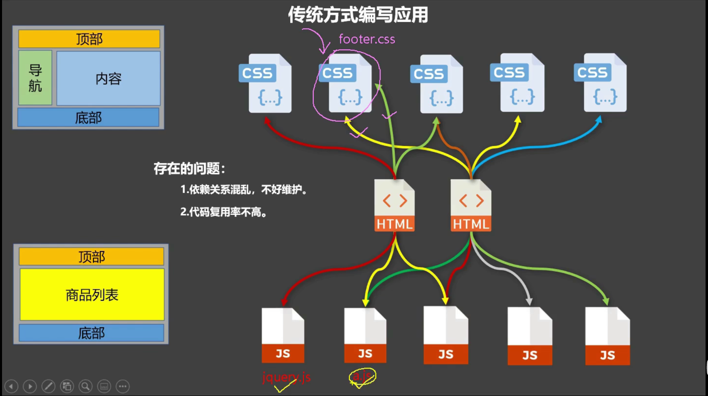

### 1.2、 组件

1. 理解: ==**用来实现局部(特定)功能效果的代码集合**==(html/css/js/image…..) 
2. 为什么: ==**一个界面的功能很复杂**== 
3. 作用: 复用编码, 简化项目编码, 提高运行效率 

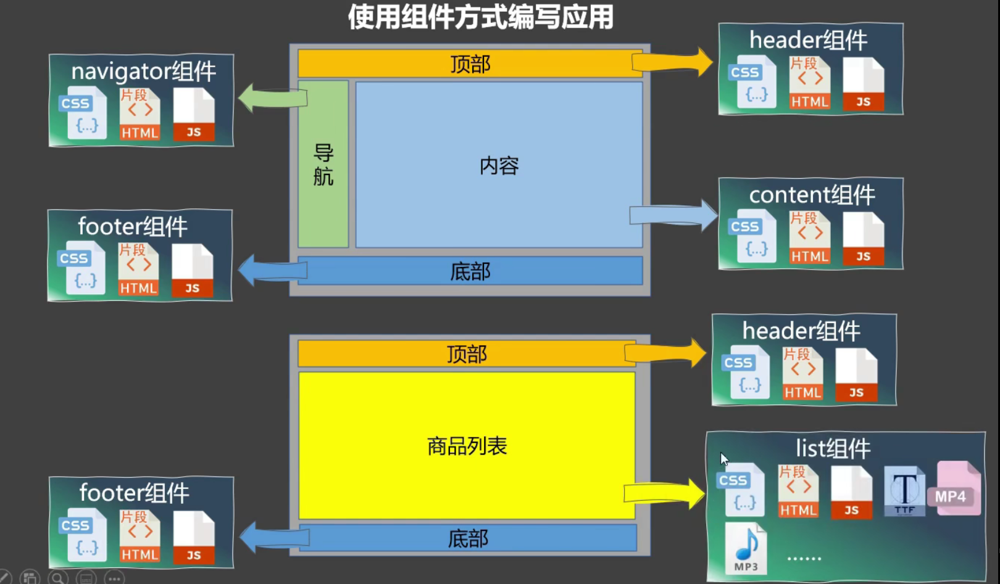

### 1.3、 模块化

 当应用中的 js 都以模块来编写的, 那这个应用就是一个模块化的应用。 

### 1.4、 组件化

 当应用中的功能都是多组件的方式来编写的, 那这个应用就是一个组件化的应用,。

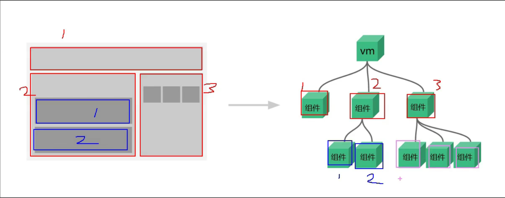

## 2、非单文件组件

非单文件组件：

​		一个文件中包含有n个组件。

单文件组件：

​		一个文件中只包含有1个组件。（a.vue）

### 2.1、组件的 使用 与 嵌套

> ##### Vue中使用组件的三大步骤：

一、定义组件（创建组件）

1. 使用`Vue.extend(options)`创建，其中，options和`new Vue(options)`时传入的那个options几乎一样，但也有点区别：
   1. `el`不要写，为什么？——最终所有的组件都要经过一个vm的管理，由vm中的el决定服务哪个容器
   2. `data`必须写成==**函数**==，为什么？——避免组件被复用时，数据存在引用关系。

二、注册组件

1. 局部注册：靠new Vue()的时候传入components选项
2. 全局注册：靠`Vue.component('组件名',组件)`

三、使用组件（写组件标签）

1. `<school></school>`

> ##### 组件嵌套

字面意思。

```html
<body>
    <div id="root">
        
    </div>
    <div>

    </div>
</body>
<script>
    //定义school组件。（非最终组件名）
    let a=Vue.extend({
        //模板中只能有一个根元素，不是，则使用div标签包起来
        template:`
        <div>
            <h2>学校名：{{name}}</h2>
            <h2>学校地址：{{adress}}</h2>
        </div>
       
        `,
        data(){
            return {
                name:'哈佛',
                adress:'北京'
            }
        }
    });
    //定义student组件。（非最终组件名）
    let b=Vue.extend({
        
        template:`
        <div>
            <h2>学生名：{{name}}</h2>
            <h2>学生年龄：{{age}}</h2>
        </div>
        `,
        data(){
            return{
                name:'啊小',
                age:18
            }
        }
    })
    //定义hello组件 简写
    let c=({
        template:`
        <div>
            <h2>hello,同学<h2>
        </div>
        `,
        
    });
    //定义app组件 简写
    let app=({
        template:`
        <div>
            <school></school>
            <student></student>
            <hello></hello>
        </div>
        `,
        components:{
            school:a,
            student:b
        }
    })
    //注册全局组件
    Vue.component('hello',c);
    const vm=new Vue({
        el:'#root',
        template:`
        <app></app>
        `,
        //局部组件注册
        components:{
            app 
        }
    })
</script>
```

### 2.2、理解VueComponent

1. school==**组件本质是**==一个名为==**VueComponent的构造函数**==，且不是程序员定义的，是Vue.textend生成的
2. 我们只需要写`<school></school>`，Vue解析时会帮我们创建school组件的实例对象，即Vue帮我们执行的：new VueComponent(options)
3. 特别注意：每次调用Vue.extend。返回的都是一个全新的VueComponent！！！
4. 关于this指向：
	1. 组件配置中：
		data函数、methods中的函数、watch中的函数、computed中的函数 他们的this均是【VueComponent】
	2. new Vue()配置中：
		data函数、methods中的函数、watch中的函数、computed中的函数 它们的this均是【Vue】
5. VueComponent的实例对象，以后简称vc（也可称之为：组件实例对象），Vue的实例对象，以后简称为vm。
```html
<body>
    <div id="root">
        
    </div>
  
</body>
<script>
    //定义app组件 简写
    let app=({
        template:`
        <div>
            <h2>{{information}}</h2>
            <button @click="showThis">点我查看this指向</button>
        </div>
        `,
        data(){
            return{
                information:'理解VueComponent'
            }
        },
        methods:{
            showThis(){
                console.log(this);//此处为VueComponent
            }
        }
    })
    const vm=new Vue({
        template:`
        <app></app>
        `,
        el:'#root',
        //局部组件注册
        components:{
            app 
        }
    })
</script>
```

### 2.3、Vue与Component的关系

1.一个重要的内置关系，`VueComponent.prototype.__proto__=== Vue.prototype`

2.为什么要有这个关系：让组件实例对象（vc）可以访问到Vue原型上的属性、方法（白话：复用）

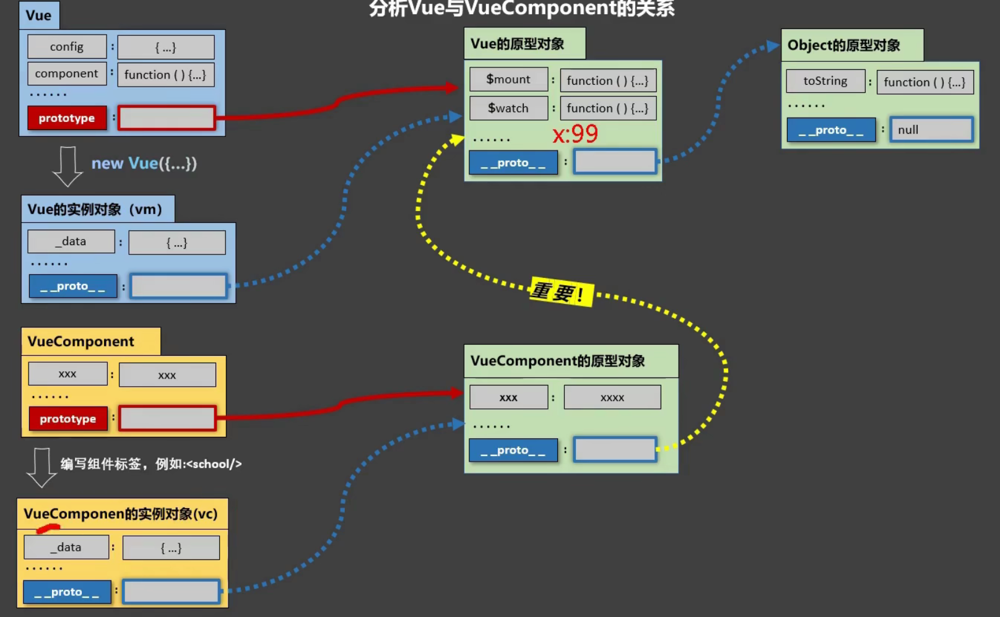

## ==注意点 2 写法==

1. 关于组件名：

   1. 一个单词组成：

      1. 第一种写法（首字母小写）：school
      2. 第二种写法（首字母大写）：School

   2. 多个单词组成：

      1. 第一种写法（kebab-case命名）：my-school
      2. 第二种写法（CamelCase命名）：MySchool (需要Vue脚手架支持 不然报错)

      备注：

      1. 组件名尽可能回避HTML中已有的元素名称，例如：h2、H2都不行。
      2. 可以使用name配置项指定组件在 ==**开发者工具中呈现的名字**==

2. 关于组件标签：

   1. 第一种写法：`<school></school>`
   2. 第二种写法：`<school/>`（需要脚手架支持，不然该标签之后的标签不执行）

3. 一个简写方式：
   `const school=Vue.extend(options)` 可简写为：`const school=options`

## 3、单文件组件

```vue
<template>
    <div class="demo">
        <!-- 组件的结构 -->
        <h2>学校名：{{name}}</h2>
        <h2>学校地址：{{adress}}</h2>
    </div>
</template>
<script>
    // 组件交互相关的代码（数据、方法等等）
     // let School=Vue.extend({
    //     data(){
    //         return {
    //             name:'哈佛',
    //             adress:'北京'
    //         }
    //     }
    // });
    // export default School
    // 简写
export default {
     data(){
            return {
                name:'哈佛',
                adress:'北京'
            }
        }
}
</script>
<style>
    /* 组件的样式 */
    .demo{
        background-color: aquamarine;
        }
</style>
```

## 4、脚手架

### 4.1初始化和使用脚手架

1.全局安装@vue/cli:

`npm install -g @vue/cli`（使`vue`指令有效化）

2.创建项目

`vue create objectName`

3.启动项目 

`npm run serve`

### 4.2、分析脚手架

> #### 文件结构

```
├── node_modules 
├── public
│   ├── favicon.ico: 页签图标
│   └── index.html: 主页面
├── src
│   ├── assets: 存放静态资源
│   │   └── logo.png
│   │── component: 存放组件
│   │   └── HelloWorld.vue
│   │── App.vue: 汇总所有组件
│   │── main.js: 入口文件
├── .gitignore: git版本管制忽略的配置
├── babel.config.js: babel的配置文件
├── package.json: 应用包配置文件 
├── README.md: 应用描述文件
├── package-lock.json：包版本控制文件
```

> #### 关于不同版本的Vue

1. vue.js与vue.runtime.xxx.js的区别：
   1. `vue.js`是完整版的Vue，包含：==**核心功能 + 模板解析器**==。
   2. `vue.runtime.xxx.js`是运行版的Vue，==**只包含：核心功能；没有模板解析器**==。
2. 因为vue.runtime.xxx.js==**没有模板解析器**==，所以不能使用template这个配置项，需要使用==**render函数**==接收到的==**createElement函数**==去指定具体内容。（脚手架使用的就是这个，节约，穷）

正常创建Vue实例

```
new Vue({
	el:'#root',
	components:{
	App
	}
})
```

脚手架创建的Vue实例

```js
new Vue({
   el:'#root', 
	render: h =>h(App);
})
```

其简写由来：

```js
new Vue({
    el:'#root',//
    render(createElement){
        return createElement('h1','你好！');
    },
    render:(createElement)=>{
    	return createElement('h1','你好！');
	},
 	render:(createElement)=> createElement('h1','你好！');
	
})
```

> #### vue.config.js配置文件

1. 使用vue inspect > output.js可以查看到Vue脚手架的默认配置。
2. 使用vue.config.js可以对脚手架进行个性化定制，详情见：https://cli.vuejs.org/zh

```js
module.exports = {
    // 选项...
    // pages: {
    //     index: {
    //       // page 的入口
    //       entry: 'src/index/main.js',
    //       // 模板来源
    //       template: 'public/index.html',
    //       // 在 dist/index.html 的输出
    //       filename: 'index.html',
    //       // 当使用 title 选项时，
    //       // template 中的 title 标签需要是 <title><%= htmlWebpackPlugin.options.title %></title>
    //       title: 'Index Page',
    //       // 在这个页面中包含的块，默认情况下会包含
    //       // 提取出来的通用 chunk 和 vendor chunk。
    //       chunks: ['chunk-vendors', 'chunk-common', 'index']
    //     },
    //     // 当使用只有入口的字符串格式时，
    //     // 模板会被推导为 `public/subpage.html`
    //     // 并且如果找不到的话，就回退到 `public/index.html`。
    //     // 输出文件名会被推导为 `subpage.html`。
    //     subpage: 'src/subpage/main.js'
    //   },
    //关闭语法检查
    lintOnSave:false
  }
```

## 5、ref属性

1.被用来给元素或子组件注册引用信息（id的代替者）
2.应用再html标签上获取的是真实DOM元素，应用再组件标签上是组件实例对象（vc）
3.使用方式：
	打标识：`<h1 ref="xxx">......</h1>` 或<School ref="xxx"></School>
	获取：this.$refs.xxx

```vue
template>
  <div id="app">
    <!--  -->
    <!-- <HelloWorld msg="Welcome to Your Vue.js App"/> -->
    <Student ref="stu"></Student>
    <School ref="sch"></School>
    <button @click="method1" ref="button"></button>
  </div>
</template>

<script>
//import HelloWorld from './components/HelloWorld.vue'
import Student from './components/Student.vue'
import School from './components/School.vue'

export default {
  name: 'App',
  components: {
    Student,
    School
  },
  methods:{
    method1(){
      console.log(this.$refs.stu);
      console.log(this.$refs.sch);
      console.log(this.$refs.button);

    }
  }
}
</script>
```

## 6、props配置项
功能：让组件接收外部传过来的数据
(1).传递数据：
	`<Demo name="xxx"/>`
(2).接收数据：
	第一种方式（只接收）：
		`props:['name']`
	第二种方式（限制类型）：
        `props:{
            name:Number
        }`
	第三种方式（限制类型、限制必要性、指定默认值）：
	`props:{
		name:{
		type:String,//类型
		required:true,//必要性（不为空）
		default:'老王'//默认值
		}
	}`
	注意：==**props属性被接收方vc实例所代理**==。


​	~~备注：props是只读的，Vue底层会监测你对props的修改，如果进行了修改，==**就会发出警告**==，若业务需求确实需要修改，那么请复制一份props的属性内容到data中，然后去修改data中的数据。~~ <font color='orange'>错的</font>


App.vue组件：
```vue
<template>
  <div id="app">
    <Student name="张三" sex="男" :age="18"></Student>
  </div>
</template>

<script>

import Student from './components/Student.vue'

export default {
  name: 'App',
  components: {
    Student,
   
  },
  
}
</script>

```
Stduent.vue
```vue
<template>
    <div>
        <h1>{{msg}}</h1>
        <h2>学生姓名：{{name}}</h2>
        <h2>学生性别：{{sex}}</h2>
        <h2>学生年龄：{{myAge+1}}</h2>
        <button @click="updateAge">点我更新年龄</button>
    </div>
</template>
<script>
export default {
    data(){
            return{
                msg:'配置项props使用',
                myAge:this.age
            }
        },
    //简单声明接收
    //props:['name','sex','age'],
    //接收的同时对数据类型进行限制
    // props:{
    //     name:String,
    //     sex:String,
    //     age:Number
    // },
    props:{
        name:{
            type:String,
            required:true//不为空
        },
        sex:{
            type:String,
            required:true,
        },
        age:{
            type:Number,
            default:99
        }
    },
    methods:{
        updateAge(){
            this.myAge++;
        }
    }
}
</script>
<style >
   
</style>

  
```

## 7、mixin混入 配置项

功能：可以把多个组件==**共用的配置**==提取成一个混入对象
使用方式：
	第一步定义混合，例如：（mixin.js）
		`{
		data(){...},
		methods:{...}
		......
		、
		}`
	第二步引用混入，例如：
	(1).全局混入：`Vue.mixin(xxx)`
	(2).局部混入：`mixins:['xxx'] ` （这个是一个配置项）
经验：

	* data配置冲突，则以data为准。
	* 声明周期冲突，则都会执行。

==**mixin.js**==

```js
export const hunhe={
    methods:{
        showName(){
            alert(this.name)
        }
    }
}
export const hunhe2={
    data(){
        return{
            x:100,
            y:200
        }
    }
}
```

==**Student.vue**==

```vue
<template>
    <div>
        <h2 @click="showName">学生姓名：{{name}}</h2>
        <h2>学生性别：{{sex}}</h2>
    </div>
</template>
<script>
// import {hunhe,hunhe2} from '../mixin'
export default {
    data(){
            return{
               name:'张三',
               sex:'男',
               x:600 //以这为主
            }
        },
    methods:{
        
    },
    // mixins:[hunhe,hunhe2]
}
</script>
<style >
</style>
```

==**App.vue**== 略 ==**School.vue**== 略	
==**main.js**==

```js
import Vue from 'vue'
import App from './App.vue'

Vue.config.productionTip = false
import {hunhe,hunhe2} from './mixin'
Vue.mixin(hunhe)
Vue.mixin(hunhe2)
new Vue({
  render: h => h(App),
}).$mount('#app');


```

## 8、插件

功能：用于增强Vue

本质：包含install方法的一个对象，install的第一个参数是Vue，第二个以后的参数是插件使用者传递的数据。

定义插件：

```js
对象.install=function(Vue,options){
	//1.添加全局过滤器
    Vue.filter(...)
	 //2.添加全局指令
	Vue.directive(...)
    //3.添加全局混入（合）
    Vue.mixin(...)
	//4.添加实例方法
    Vue.prototype.$myMethod=function(){...}
    Vue.prototype.$myProperty=xxxx
}
```

使用插件：

`Vue.use()`

plugins.js 插件如下：

```js
export default {
    install(Vue){
        Vue.directive('fbind', {
            bind(el, binding, vnode) {
                console.log('bind');
                el.value=binding.value;
            },
            inserted(el, binding, vnode) {
                console.log('inserted');
    
            },
            update(el, binding, vnode, oldVnode) {
                console.log('update');
                el.value=binding.value;
                el.focus();
            },
            componentUpdated(el, binding, vnode) {
                console.log('componentUpdated');
            },
            unbind(el, binding, vnode) {
                console.log('unbind');
            },
        });
        Vue.filter('mySlice',function(value){
            return value.slice(0,4);
        });
        Vue.mixin({
            methods:{
                showName(){
                    alert(this.name);
                    
                    
                }
            }
        });
        Vue.prototype.hello=()=>{alert('你好啊')}

    }
}
```

​	

## 9、scope 样式

作用：让样式在局部生效，防止冲突

写法：`<style scoped>`


# 四、Vue组件通信

## 1、TodoList案例（父发送给子）

1. 组件化编码流程：
	(1).拆分静态组件：组件要按照功能点拆分，命名不要与html元素冲突。
2. (2).实现动态组件：考虑好数据的存放未知，数据是一个组件在用，还是一些组件在用：

  	(1).一个组件在用：放在组件自身即可。
  	(2).一些组件在用：放在它们共同的父组件上（`状态提升`）
  (3).实现交互：从绑定事件开始。 
3. props适用于：
    (1).父组件 ==> 子组件 通信
    (2).<font color='red'>子组件 ==> 父组件 通信 （要求父先给子一个函数）</font>
4. 使用v-model时要记住：v-model绑定的值不能是props传过来的值，因为props是不可以修改的。
5. props传过来的若是对象类型的值，修改对象中的属性时Vue不会报错，但不推荐这样做。（感觉是props的bug ，没去检测） 

经验：

计算属性根据存在属性进行计算出的属性，其setter当要修改计算属性时使用（可以用方法，但不推荐 ）

### App

```vue
<template>
 <div id="root">
  <div class="todo-container">
    <div class="todo-wrap">
     <Top :addTodo="addTodo"></Top>
      <List :todos="todos" :checkTodo="checkTodo"
      :deleteTodo="deleteTodo" ></List>
      <Bottom 
      :todos="todos" 
      :checkAllTodo="checkAllTodo" 
      :deleteAllDone="deleteAllDone" 
      ></Bottom>
    </div>
  </div>
</div>
</template>

<script>
import Top from './components/Top'
import Bottom from './components/Bottom'
import List from './components/List'

export default {
  name: 'App',
  data(){
    return {
      todos: JSON.parse(localStorage.getItem("todos")) || [],
    }
  },
  methods:{
    //添加需完成的事项 top
    addTodo(value){
      this.todos.unshift(value)
    },
    //事项完成状态的变更 item
    checkTodo(id){
      this.todos.forEach((item)=>{if(id===item.id)item.done=!item.done})
    },
    //删除单个选项 item
    deleteTodo(id){
      this.todos=this.todos.filter((item)=>{
        return item.id===id ? false : true
      })
    },
    //全勾选或全不勾选
    checkAllTodo(value){
      this.todos.forEach(item=> value? item.done=true:item.done=false);
    },
    deleteAllDone(){
      this.todos=this.todos.filter(item=>{return !item.done})
    }
    
  },
    //本地缓存
  watch: {
    todos: {
      deep: true,
      handler(newVuale) {
        localStorage.setItem("todos", JSON.stringify(newVuale));
      },
    },
  },
  components: {
    Top,
    Bottom,
    List
   
  },
  
}
</script>

<style>
/*base*/
body {
  background: #fff;
}

.btn {
  display: inline-block;
  padding: 4px 12px;
  margin-bottom: 0;
  font-size: 14px;
  line-height: 20px;
  text-align: center;
  vertical-align: middle;
  cursor: pointer;
  box-shadow: inset 0 1px 0 rgba(255, 255, 255, 0.2), 0 1px 2px rgba(0, 0, 0, 0.05);
  border-radius: 4px;
}

.btn-danger {
  color: #fff;
  background-color: #da4f49;
  border: 1px solid #bd362f;
}

.btn-danger:hover {
  color: #fff;
  background-color: #bd362f;
}

.btn:focus {
  outline: none;
}

.todo-container {
  width: 600px;
  margin: 0 auto;
}
.todo-container .todo-wrap {
  padding: 10px;
  border: 1px solid #ddd;
  border-radius: 5px;
}


</style>

```

### Top

```vue
<template>
    <div class="todo-header">
        <input type="text" placeholder="请输入你的任务名称，按回车键确认" @keydown.enter="handleAdd" v-model="title"/>
    </div>
</template>
<script>
import {nanoid} from 'nanoid'
export default {
    data(){
        return{
            title:''
        }
    },
    methods:{
        handleAdd(){
            if(!this.title) return 
            //将用户的输入包装成一个todo对象
            const todoT={id:nanoid(),title:this.title,done:false}
            //调用父组件方法
            this.addTodo(todoT);
            //清空输入框
            this.title=''

        }
    },
    props:['addTodo']
   
}
</script>
<style scoped>
/*header*/
.todo-header input {
  width: 560px;
  height: 28px;
  font-size: 14px;
  border: 1px solid #ccc;
  border-radius: 4px;
  padding: 4px 7px;
}

.todo-header input:focus {
  outline: none;
  border-color: rgba(82, 168, 236, 0.8);
  box-shadow: inset 0 2px 2px rgba(2, 1, 1, 0.075), 0 0 8px rgba(82, 168, 236, 0.6);
  /* //先左右后上下，根据正负二选一如上或下 */
}
</style>


  
```


### List

```vue
<template>
   <div>
       <ul class="todo-main" >
        <Item 
        v-for="(todo) in todos"
         :key="todo.id"
          :todo="todo"
          :checkTodo="checkTodo"
          :deleteTodo="deleteTodo"
          ></Item>
      </ul>
   </div>
</template>
<script>
import Item from './Item.vue'
export default {
   
    components:{
        Item
    },
    props:['todos','checkTodo','deleteTodo']
    
   
}
</script>
<style scoped>
/*main*/
.todo-main {
  margin-left: 0px;
  border: 1px solid #ddd;
  border-radius: 2px;
  padding: 0px;
}

.todo-empty {
  height: 40px;
  line-height: 40px;
  border: 1px solid #ddd;
  border-radius: 2px;
  padding-left: 5px;
  margin-top: 10px;
}
</style>
```


### Item

```vue
<template>
   <div>
       <li>
          
          <label>
            <input type="checkbox" :checked="todo.done" @change="handleCheck(todo.id)"/>
            <!-- <input type="checkbox" v-model="todo.done"/> -->
            <span>{{todo.title}}</span>
          </label>
          <button class="btn btn-danger" @click="handleDelete(todo.id)">删除</button>
        </li>
        <!-- <li>
          <label>
            <input type="checkbox"/>
            <span>yyyy</span>
          </label>
          <button class="btn btn-danger" style="display:none">删除</button>
        </li> -->
   </div>
</template>
<script>

export default {
    
    props:['todo','checkTodo','deleteTodo'],

    methods:{
     handleCheck(id){
       this.checkTodo(id);
     },
     handleDelete(id){
         if(confirm('确定删除 '+this.todo.title+' 吗？')){
		this.deleteTodo(id);       
         } 
     }
   }  
      
    
   
}
</script>
<style scoped>
/*item*/
li {
  list-style: none;
  height: 36px;
  line-height: 36px;
  padding: 0 5px;
  border-bottom: 1px solid #ddd;
}
li:hover{
  background-color:aliceblue ;
  
}
li label {
  float: left;
  cursor: pointer;
}

li label li input {
  vertical-align: middle;
  margin-right: 6px;
  position: relative;
  top: -1px;
}

li button {
  float: right;
  display: none;
  margin-top: 3px;
}
li:hover button {
  
  display: block;
 
}


li:before {
  content: initial;
}

li:last-child {
  border-bottom: none;
}
</style>
```


### Bottom

```vue
<template>
   <div class="todo-footer" v-show="total">
        <label>
          <!-- <input type="checkbox" :checked="isAll" @change="handleCheckAllTodo" /> 这个使用事件代替计算属性的setter -->
          <!-- 下列直接使用计算属性的setter -->
          <input type="checkbox" v-model="isAll" />
          
        </label>
        <span>
          <span>已完成{{doneTotal}}/</span> {{total}}
        </span>
        <button class="btn btn-danger" @click="handleDeleteAllDone">清除已完成任务</button>
    </div>
</template>
<script>
export default {
    
    props:['todos','checkAllTodo','deleteAllDone']
    ,
    computed:{
      total(){
        return this.todos.length
      },
      doneTotal(){
        return this.todos.reduce((pre,todo)=> pre+(todo.done ? 1:0),0)
      },
      isAll:{
        get(){
          return this.doneTotal===this.total && this.total > 0 ? true:false 
        },
        set(value){
          this.checkAllTodo(value);
        }
        
      }
    },
    methods:{
      handleDeleteAllDone(){
        this.deleteAllDone();
      }
    }
    // methods: {
    //   handleCheckAllTodo(e){
    //     this.checkAllTodo(e.target.checked);
    //   }
    // },
   
    
}
</script>
<style scoped>
/*footer*/
.todo-footer {
  height: 40px;
  line-height: 40px;
  padding-left: 6px;
  margin-top: 5px;
}

.todo-footer label {
  display: inline-block;
  margin-right: 20px;
  cursor: pointer;
}

.todo-footer label input {
  position: relative;
  top: -1px;
  vertical-align: middle;
  margin-right: 5px;
}

.todo-footer button {
  float: right;
  margin-top: 5px;
}

</style>
```

其它技术：less

## 2、组件自定义事件（子发送给父）

1. 一种组件件通信的方式，适用于`子组件===>父组件`

2. 使用场景：A是父组件，B是子组件，B想给A传数据，那么就要在A中给B绑定自定义事件（事件的回调在A中）。

3. 绑定自定义事件：

   1. 第一种方式，在父组件中：`<Demo @haha="test">` （<font color='red'>事件的回调test在父组件中</font>）

   2. 第二种方式，在父组件中：

      ```vue
      <Demo ref="demo">
      ......
      mounted(){
      	this.$refs.demo.$on('haha',this.test)
      	//或者 绑定组件自定义事件触发一次
      	this.$refs.demo.$once('haha',this.test)
      }
      ```

4. 触发自定义事件：`this.$emit('haha',数据)`

5. 解绑自定义事件：

   1. 单个解绑<font color='red'>this.$off('haha')</font>
   2. 多个解绑：<font color='red'>this.$off(['haha','test'])</font>
   3. 全部解绑： <font color='red'>this.$off();</font>

6. 组件上也可以绑定原生DOM事件，需要使用native修饰符。

7. 注意：通过`this.$refs.xxx.$on('haha',回调)`绑定自定义事件时，回调==**要么配置在methods中**==，==**要么用箭头函数**==，否则this指向会出问题。 


### App

```vue
<template>
  <!-- <div class="app" @click.native="show"> .在组件上合法，非组件上不合法-->
  <div class="app">
    <h1>接收的消息为{{ msg }}</h1>

    <Student ref="student"  ></Student>
    <School @haha="getSchoolName" @test="testing" @click.native="show"></School>
  </div>
</template>

<script>
//import HelloWorld from './components/HelloWorld.vue'
import Student from "../src/components/Student";
import School from "../src/components/School";

export default {
  name: "App",
  components: {
    Student,
    School,
  },
  data() {
    return {
      msg: "",
    };
  },
  methods: {
    getSchoolName(value) {
      console.log("App收到School组件发来的学校名", value);
      this.msg = value;
    },
    getStudentName(value, ...params) {
      console.log("App收到Student组件发来的学校名", value, params);
      this.msg = value;
    },
    testing() {
      console.log("test事件被触发了");
    },
    show(){
      console.log('我是School组件')
    }
  },

  mounted() {
    //绑定
    //this.$refs.student.$on("haha", this.getStudentName);
    //绑定并事件触发一次
    // this.$refs.student.$once('haha', this.getStudentName)
    //另一种绑定方式
    this.$refs.student.$on("haha", (value, ...params) => {
      console.log("App收到Student组件发来的学校名", value, params);
      this.msg = value;
    });
  },
};
</script>

<style scoped>
.app {
  background-color: tomato;
}
</style>

```


### Student

```vue
<template>
  <div class="student">
    <h2>学生名：{{ name }}</h2>
    <h2>学生年龄：{{ age }}</h2>
    <button @click="sendStudentName(name)">发送给App学生名</button>
  </div>
</template>
<script>
export default {
  data() {
    return {
      name: "啊小",
      age: 18,
    };
  },
  methods:{
      sendStudentName(name){
          this.$emit('haha', name,0,2,4,6,7)
         
      },
     
  }
};
</script>
<style >
.student {
  background-color: pink;
  margin-top: 30px;
}
</style>

  
```

### School

```vue
<template>
  <div class="school">
    <h2>学校名：{{ name }}</h2>
    <h2>学校地址：{{ address }}</h2>
    <h1 >{{number}}</h1>
    <button @click="add">点我++</button>
    <button @click="sendSchoolName(name)">发送给App学校名</button>
    <button @click="unbind">解绑Student组件的自定义事件</button>
    <button @click="death">销毁School组件</button>
  </div>
</template>
<script>
export default {
  data() {
    return {
      name: "哈佛",
      address: "北京",
      number:0
    };
  },
  methods: {
    sendSchoolName(name) {
      this.$emit("haha", name);
      this.$emit('test')
    },
    unbind() {
      //单个解绑
      this.$off("haha");
      //多个解绑
      //   this.$off(['haha','test'])
      //   //全部解绑
      //   this.$off();
    },
    add(){
      console.log('add被调用了')
      this.number++;
    },
    death(){
      this.$destroy();//组件销毁后所有自定义事件不奏效
    }
  },
};
</script>
<style scoped>
.school {
  background-color: skyblue;
}
</style> 
```

## 注意点 3 学了个寂寞

任意组件通信两种方式一样，没有太大本质区别，建议使用全局事件总线，自身的。	

## 3、全局事件总线（任意组件通信1 推荐）

1. 一种组件间通信的方式，适用于<font color='red'>任意组件间通信</font>。

2. 安装全局事件总线：

   ```js
   new Vue({
   	......
   	beforeCreate() {
           Vue.prototype.$bus = this //安装全局事件总线，$bus就是当前应用的vm
       },
   })
   
   ```
   
3. 使用事件总线：

   1. 接收数据：A组件想接收数据，则在A组件中给 $bus绑定自定义事件，<font color='red'>事件的回调留在A组件自身</font>。

      ```js
      methods(){
      	demo(data){......}
      },
      mounted(){
      	this.$bus.$on('event-name',this.demo)
      }
      
      ```

   2. 提供数据：`this.$bus.$emit('xxx',数据)`

4. 最好在beforeDestroy钩子中，用$off去解绑<font color='red'>当前组件所用到</font>的事件

   ```js
   this.$bus.$off(['event-name1','event-name2'])
   ```

特点：

1. $bus（vm）对所有组件可见
2. $bus（vm）可绑定（`$on`）、可触发（`$emit`）、可解绑（`$off`）

## 4、消息订阅与发布（任意组件通信2 三方库）

pubsub.js（publish subscribe）

1. 一种组件间通信的方式，适用于<font color='red'>任意组件间通信</font>

2. 使用步骤：

   1. 安装pubsub：`npm i pubsub-js`

   2. 引入`import pubsub from 'pubsub-js'`

   3. 接收数据：A组件想接收数据，则在A组件中订阅消息，订阅的<font color='red'>回调留在A组件自身</font>。

      ```js
      methods(){
          demo(data){......}
      }
          ......
      mounted(){
              this.psid=pubsub.subscribe('xxx',this.demo)//订阅消息
          }
      ```

   4. 提供数据：`pubsub.publish('xxx',数据)`
   5. 最好在beforeDestroy钩子中，用`pubsub.unsubscribe(psid)`去<font color='red'>取消订阅</font>

### School

```vue
<template>
  <div class="school">
    <h2>学校名：{{ name }}</h2>
    <h2>学校地址：{{ address }}</h2>
  </div>
</template>
<script>
import pubsub from 'pubsub-js'
export default {
  data() {
    return {
      name: "哈佛",
      address: "北京",
    };
  },
  methods: {
    showMsg(msgName,value,...params){
      console.log('有人发布hello消息了，hello消息的回调被执行了',msgName,value,...params)
    }
    },
  mounted () {
    //订阅消息
    this.pubId=pubsub.subscribe('hello',this.showMsg)
  },
  beforeDestroy () {
    //取消订阅
    pubsub.unsubscribe(this.pubId)
  }
};
</script>
<style scoped>
.school {
  background-color: skyblue;
}
</style> 
```

### Student

```vue
<template>
  <div class="student">
    <h2>学生名：{{ name }}</h2>
    <h2>学生年龄：{{ age }}</h2>
    <button @click="sendStudentName">把学生名给School组件</button>
  </div>
</template>
<script>
import pubsub from 'pubsub-js'
export default {
  data() {
    return {
      name: "啊小",
      age: 18,
    };
  },
  methods: {
    sendStudentName(){
      //发布消息
      pubsub.publish('hello',666)
    }
  },
};
</script>
<style >
.student {
  background-color: pink;
  margin-top: 30px;
}
</style>

  
```

## 5、TodoList案例+编辑

1. 解决问题：
     1. 初始化获取焦点	
     2. 更新时获取焦点

  2.   解决方式：

         1. nextTick API 与mounted
              1. 语法：this.$nextTick（回调函数）（是<font color='red'>生命周期钩子</font>font>波）
            2. 作用：在下一次DOM更新结束后执行其指定的回调。
            3. 什么时候用：当改变数据后，要基于更新后的新DOM进行某些操作是，要在nextTick所指定的回调函数中执行。
         2. 自定义指令（inserted、update）

       ### App

```vue
<template>
 ......
  </div>
</template>

<script>
import Top from "./components/Top";
import Bottom from "./components/Bottom";
import List from "./components/List";

export default {
  name: "App",
  data() {
    return {
      todos: JSON.parse(localStorage.getItem('todos')) || []
    };
  },
     //本地缓存
  watch: {
    todos: {
      deep: true,
      handler(newVuale) {
        localStorage.setItem("todos", JSON.stringify(newVuale));
      },
    },
  },
  methods: {
    //添加需完成的事项 top
   ......
    updateTitle(title, id) {
      
      this.todos.forEach((todo) => {
        if (todo.id === id){
          todo.title = title
          
        }

           
      });
    },
  },

  components: {
    Top,
    Bottom,
    List,
  },
  mounted() {
   ......
    this.$bus.$on("updateTitle", this.updateTitle);
  },
  beforeDestroy() {
    this.$bus.$off(["checkTodo", "deleteTodo",'updateTitle']);
  },
};
</script>

<style>
......
    
.btn-edit {
  color: #fff;
  background-color: deepskyblue;
  border: 1px solid deepskyblue;
  margin-right: 5px;
}
.btn-edit:hover {
  color: #fff;
  background-color: dodgerblue;
}
......


/* //error信息颜色 */
.error::-webkit-input-placeholder { /* WebKit, Blink, Edge */
    color:    red;
    font-size: 10px;
}
.error:-moz-placeholder { /* Mozilla Firefox 4 to 18 */
   color:    red;
   font-size: 10px;
}
.error::-moz-placeholder { /* Mozilla Firefox 19+ */
   color:    red;
   font-size: 10px;
}
.error:-ms-input-placeholder { /* Internet Explorer 10-11 */
   color:   red;
   font-size: 10px;
}
.error::-ms-input-placeholder { /* Microsoft Edge */
   color:    red;
   font-size: 10px;
}
</style>

```


### Item

```vue
<template>
  <div>
    <li>
      <label>
        <input
          type="checkbox"
          :checked="todo.done"
          @change="handleCheck(todo.id)"
        />
        <!-- <input type="checkbox" v-model="todo.done"/> -->
        <span v-show="!todo.isEdit">{{ todo.title }}</span>
      </label>
      <input
      class="error"
        type="text"
        :value="todo.title"
        v-show="todo.isEdit"
        @keydown.enter="handleUpdateTitle($event, todo)"
        @blur="handleUpdateTitle($event, todo)"
        v-focusEditBox
        placeholder=""
        ref="editBox"
      />
      <button class="btn btn-danger" @click="handleDelete(todo.id)">
        删除
      </button>
      <button class="btn btn-edit" @click="handleEdit(todo)" v-show="!todo.isEdit  ">编辑</button>
    </li>
  </div>
</template>
<script>
export default {
  props: ["todo"],
  
  methods: {
    //点击编辑按钮触发隐藏span和显示input
    handleEdit(todo) {
      if (todo.hasOwnProperty("isEdit")) {
        todo.isEdit = true;
      } else {
        this.$set(todo, "isEdit", true);
      }
      //dom更新完毕后执行里面的回调 这个比自定义指令更快
      // this.$nextTick(function(){
      //   this.$refs.editBox.focus()
      // })
    },
    //处理编辑后的数据  由 blur和keydown事件触发
    handleUpdateTitle(e, todo) {
      if (!e.target.value.trim()) {
        e.target.setAttribute('placeholder','不能为空');
      } else {
        this.$bus.$emit("updateTitle", e.target.value, todo.id);
        todo.isEdit = false;
        e.target.setAttribute('placeholder','');
      }
    },
   ......
      //解决初始化获取焦点
  // mounted(){
  //   this.$refs.editBox.focus();
  // }
};
</script>
<style scoped>
    ......
</style>
```

### plugins.js

```js

export default{
    install(Vue){
        Vue.directive('focusEditBox',{
            bind(el,binding){
                
            },
            inserted(el,binding){
                el.focus();
            },
            update(el,binding){
                el.focus();
            }
        })
    }
}
```

# 五、过渡 & 动画

## 1、Vue封装的过渡与动画

1. 作用：在插入、更新或移动DOM元素时，在合适的时候给元素添加样式类名。

2. 图示：


3. 写法：

   1. Vue帮你准备好的样式：

      * 元素进入的样式：

        1. v-enter：进入的起点
        2. v-enter-active：进入过程中
        3. v-enter-to：进入的终点

      * 元素离开的样式

        1. v-leave：离开的起点
        2. v-leave-active：离开过程中
        3. v-leave-to：离开的终点

        

   2. `<transition>`中只能包含<font color='red'>一个根元素</font>，`<transition-group>`中可以包含<font color='red'>多个根元素</font>

   3. 配置`<transition>`元素的name属性：`name="xxx"`，元素的进入与离开样式会变成：xxx-enter、xxx-leave 等等

4. 备注：

   1. <font color='red'>key</font>在`<transition>`与`<transition-group>`作用不同：
      1. `<transition>`进行多元素<font color='red'>切换过渡</font>时，一般与<font color='red'>v-if</font>配合使用。由于<font color='orange'>Vue效率的特性</font>使得需要<font color='red'>key</font>属性。原因如下：
         1. 当有**相同标签名**的元素切换时，需要通过 `key` attribute 设置唯一的值来标记以让 Vue 区分它们，<font color='orange'>否则</font> Vue 为了效率<font color='orange'>只会替换相同标签内部的内容</font>。
   2. `<transition-group>`不可用过渡模式，因为我们不再<font color='red'>相互切换</font>特有的元素，其中<font color='red'>key</font>用来唯一标识。

5. 其它知识：

   1. 自定义过渡类名、JavaScript钩子、初始化渲染过渡（appear）、过渡模式（与transition、v-if使用）、多个元素过渡（）、多个组件过渡、列表过渡、动态过渡、状态过渡、过渡持续时间（这个应该跟钩子用的）、v-move等。（[进入/离开 & 列表过渡 — Vue.js (vuejs.org)](https://cn.vuejs.org/v2/guide/transitions.html)）
   2. <font color='orange'>多个元素过渡</font>与<font color='orange'>多个组件过渡</font>属于<font color='red'>同一时间渲染多个节点中的一个（切换过渡）</font>
   3. <font color='orange'>列表过渡</font>属于<font color='red'>同一时间渲染多个节点</font>

### 使用动画效果与初始化渲染动画

```vue
<template>
  <div>
      <button @click="isShow=!isShow">开启动画</button>
      <!-- appear 等于 :appear="true" 初始化渲染动画	-->
      <transition appear>
        <h1 v-show="isShow">你好啊</h1>
      </transition>
  </div>
</template>

<script>
export default {
  data() {
    return {
      isShow:true 
    }
  },
}
</script>
<style scoped>
  h1{
    background-color: orange;
  }
  .v-enter-active{
    animation:donghua 0.5s linear;
  }
  .v-leave-active{
    animation: donghua 0.5s linear reverse;
  }
  @keyframes donghua{
    0%{
      transform: translateX(-100%)
    }
    100%{
      transform: translateX(0);
    }
  }
</style>
```

### 多个元素 切换过渡

注意：absolute（绝对定位不占位置）。这是 `<transition>` 的默认行为 - <font color='orange'>进入和离开同时发生</font>。

```vue
<template>
  <div>
    <button @click="change">开启动画</button><br />
    <!-- appear 等于 :appear="true" -->
    <transition name="hello">
      <button v-bind:key="n">{{msg}}</button>
    </transition>
  </div>
</template>

<script>
export default {
  data() {
    return {
      n: 1,
    };
  },
  computed: {
    msg() {
      switch (this.n) {
        case 1:
          return "Edit";
        case 2:
          return "Save";
        case 3:
          return "Cancel";
      }
    },
  },
  methods: {
    change() {
      if(++this.n>2){
        this.n=1;
      }
    },
  },
};
</script>
<style scoped>
div {
  position: relative;
}
button {
  margin-top: 10px;
  width: 100px;
  background-color: orange;
  /*为了平滑过渡 */
  position: absolute;
  /*不破坏别人的样式 */
  /* transition: .5s linear; */
}
/* 进入起点，离开终点 */
.hello-enter {
  transform: translateX(100px);
  opacity: 0;
}
.hello-enter-to {
  opacity: 1;
}
.hello-leave {
  opacity: 1;
}
.hello-leave-to {
  transform: translateX(-100px);

  opacity: 0;
}
/* 进入状态（过程）启动后执行 */
.hello-enter-active {
  transition: 0.5s linear;
}
/* 离开状态（过程）启动后执行 */
.hello-leave-active {
  transition: 0.5s linear;
}
</style>
```

### 列表过渡与animate.css三方库使用

```vue
<template>
  <div>
    <button @click="isShow = !isShow">开启动画</button>
    
    <transition-group name="animate__animated animate__bounce" enter-active-class="animate__rubberBand" leave-active-class="animate__bounceOutRight" appear>
      <h1 v-show="!isShow" key="1">a1</h1>
      <h1 v-show="isShow" key="2">b2</h1>
      <h1 v-show="!isShow" key="3">c3</h1>
      <h1 v-show="isShow" key="4">c4</h1>
    </transition-group>
  </div>
</template>

<script>
import "animate.css";
export default {
  data() {
    return {
      isShow: true,
    };
  },
};
</script>
<style scoped>
div {
  text-align: center;
}

</style>
```

# 六、其它

## 1、vue脚手架配置代理

> ### 	同源
>

就是指，域名、协议、端口均为相同（文件路径可不同）。

> ### 	跨域
>

指浏览器不能执行其他网站的脚本。**浏览器会根据同源策略来判断一个请求是否同源来确定是否是跨域请求**


作用；正向代理解决跨域（还有其它的跨域方式，比如后端的cors），以及多代理配置。	

原理：让同源代理人去完成跨域访问。此代理人不受浏览器同源策略限制（后端请求不受限制）

> ## 方式一：
>

在vue.config.js中添加如下配置：

```js
devserver:{
    proxy:'http://oalhost:5000'
}
```

说明：

1. 工作方式：当请求了前端不存在的资源时，那么该请求会转发给服务器（优先匹配前端资源）
2. 优点配置简单，请求资源时直接发给前端（8080）即可。
3. 缺点：不能配置多个代理，不能灵活的控制请求是否走代理。

> ## 方式二：
>

编写vue.config.js配置具体代理规则：

```js
module.exprts={

devServer:{
	proxy:{
        'api1':{//匹配所有以‘/api1’开头的请求路径
            target:'http://localhost:5000',//代理目标的基础路径
            ws:true,//支持webSocket 默认
            changeOrigin:true,//默认
            pathRewrite:{'^/api1';''}
        },
        'api2':{
            target:'http://localhost:5001',
            pathRewrite:{'^api2':''}
        }
    },
    	


}
```

说明：

1. 优点：可以配置多个代理，且看可以灵活的控制请求是否走代理

2. 缺点：配置略微繁琐，请求资源时必须加前缀。

### vue.config.js

```js
module.exports = {
  //方式一
  // devServer: {
  //   proxy: 'http://localhost:5000'
  // },
  //方式二
  devServer: {
    proxy: {
      '/haha': {
        target: 'http://localhost:5000',
        pathRewrite:{'^/haha':''}
      },
      '/wuwu': {
        target: 'http://localhost:5001',
        pathRewrite:{'^/wuwu':''}
      }
    }
  },
  lintOnSave:false
}
    

```

### App

```vue
<template>
  <div>
    <button @click="getStudentInfo">点我获取学生信息</button>
    <button @click="getCarInfo">点我获取汽车信息</button>
  </div>
</template>

<script>

import axios from 'axios'
export default {
  methods: {
    //方式一
    // getStudentInfo(){
    //   axios.get('http://localhost:8080/students').then(
    //     response=>{
    //       console.log('请求成功了',response.data)
    //     },
    //     error=>{
    //       console.log('请求失败了',error.message)
    //     }
    //   )
    // },
    //方式二
      //this.info={...this.info,...receiveInfo}
      //`https://api.github.com/search/users?q=${keyWords}`
    getStudentInfo(){
      axios.get('http://localhost:8080/haha/students').then(
        response=>{
          console.log('请求成功了',response.data)
        },
        error=>{
          console.log('请求失败了',error.message)
        }
      )
    },
    getCarInfo(){
      axios.get('http://localhost:8080/wuwu/cars').then(
        response=>{
          console.log('请求成功了',response.data)
        },
        error=>{
          console.log('请求失败了',error.message)
        }
      )
    },
  },

};
</script>
<style >
body {
  /* text-align: center; */
}
</style>
```

## 2、vue-resource插件（vue1.0）

 npm i vue-resource

import VueResource from 'vue-resource'

## 3、插槽

1. 作用：让父组件可以向子组件指定位置插入html结构，也是一种组件间通信的方式，适用于<font color='red'>父组件===>子组件</font>

2. 分类：默认插槽、具名插槽、作用域插槽

3. 使用方式：

   1. 默认插槽：

      ```vue
      父组件中：
      <Category>
      	<div>
              <!--填坑-->
              html结构1 
          </div>
      </Category>
      子组件中：
      <template>
      	<div>
              <!--定义插槽 坑-->
              <slot>没填坑我显示，哈哈</slot>
          </div>
      </template>
      ```

      

   2. 具名插槽：

      ```vue
      父组件中：
      <Category>
          <template slot="center">
      		<div>html结构1 </div>
          </template>
          <!--v-slot:footer在template标签中才有用-->
      	<template v-slot:footer>
      		<div>html结构2 </div>
          </template>
      </Category>
      子组件中：
      <template>
      	<div>
              <!--定义插槽 坑-->
              <slot name="center">没填坑我显示，哈哈</slot>
              <slot name="center">没填坑我显示，哈哈</slot>
          </div>
      </template>
      ```

      

   3. 作用域插槽：

      1. 理解：数据在组件的自身，但<font color='red'>根据数据生成的结构</font>需要组件的使用者来决定。（本质是超过作用域范围之外传递数据。（子组件===>父组件））

         1. 人话：<font color='orange'>在父组件中使用子组件数据建立自定义展示结构。</font>

      2. 具体编码： 

         1. App
      
            ```vue
            <template>
              <div class="app">
                <Category title="美食">
                  <template slot-scope="obj">
                    <ul>
                      <li v-for="(g, index) of obj.foods" :key="index">
                        {{ g }}
                      </li>
                    </ul>
                  </template>
                </Category>
                <Category title="美食">
                  <template slot-scope="obj">
                    <ol>
                      <li v-for="(g, index) of obj.foods" :key="index">
                        {{ g }}
                      </li>
                    </ol>
                    {{obj.msg}}
                  </template>
                </Category>
                <Category title="美食">
                  <template slot-scope="{foods}">
                    <h4 v-for="(g, index) of foods" :key="index">
                      {{ g }}
                    </h4>
                  </template>
                </Category>
              </div>
            </template>
            
            <script>
            import Category from "./components/Category";
            
            export default {
              components: {
                Category,
              },
              data() {
                return {};
              },
            };
            </script>
            <style >
            .app,
            .footer {
              display: flex;
              justify-content: space-around;
            }
            img,
            video {
              width: 100%;
            }
            
            h5 {
              text-align: center;
            }
            </style>
            ```

            

         2. Category
      
            ```vue
            <template>
              <div class="containter">
                <h3>{{ title }}</h3>
                <slot :foods="foods" msg="hello"></slot>
              </div>
            </template>
            <script>
            export default {
              props:['title'],
              data() {
                return {
                  foods: ["苹果", "香蕉", "桃子", "西瓜"],
                }
              },
            };
            </script>
            <style lang="css" scoped>
            .containter {
              height: 400px;
              width: 200px;
              background: skyblue;
            }
            
            div h3 {
              text-align: center;
              background: orange;
            }
            </style>
            ```
      
            


# 七、Vuex

## 1、基本使用

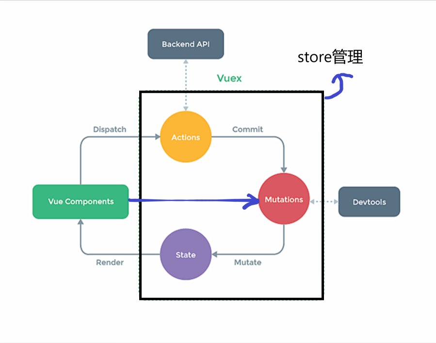

在Vue中实现集中式状态（数据）管理的一个Vue插件，对vue应用中多个组件的共享状态进行集中式的管理（读/写），也是一种组件间通信的方式，且适用于任意组件间通信。

### 1.何时使用？

多个组件需要共享数据时

### 2.搭建vuex环境

1. 创建文件：`src/store/index.js`

   ```js
   //创建Vuex最为核心的
   import Vuex from 'vuex'
   import Vue from 'vue'
   
   Vue.use(Vuex)
   //准备actions——用于响应组件中的动作
   const actions={}
   //准备mutations——用于操作数据（state）
   const mutations={}
   //准备mutations——用于存储数据
   const state={}
   //创建并暴露store
   export default new Vuex.Store({
       actions:actions,
       mutations:mutations,
       state:state,
   });
   
   ```

2. 在`main.js`中创建vm时传入store配置项

   ```js
   ......
   //引入store
   import store from './store'
   ......
   //创建vm
   new Vue({
     render: h => h(App),
     store, 
   }).$mount('#app');
   
   
   ```

### 3.基本使用

1. 初始化数据、配置actions 、mutations、state，操作文件`src/store/index.js`(后面都简写成`store.js`)

```js
//创建Vuex最为核心的
import Vuex from 'vuex'
import Vue from 'vue'

Vue.use(Vuex)
//准备actions——用于响应组件中的动作
const actions={
    
    jiaOdd(context,value){
        if(context.state.sum%2){
            context.commit('JIA',value)
        }
    },
    jiaWait(context,value){
        setTimeout(()=>{
            context.commit('JIA',value)
        },500)
   
    },
}
//准备mutations——用于操作数据（state）
const mutations={
    JIA(state,value){
        state.sum+=value; 

    },
    JIAN(state,value){
        state.sum-=value;
    }
}
//准备mutations——用于存储数据
const state={
    sum:0
}
//创建并暴露store
export default new Vuex.Store({
    actions:actions,
    mutations:mutations,
    state:state,
});

```

2. 操作共享数据：`Count.vue`

```vue
<template>
  <div>
      <!-- state  -->
    <h1>{{ $store.state.sum }}</h1>
    <select name="sss" v-model.number="n">
      <option value="1">1</option>
      <option value="2">2</option>
      <option value="3">3</option>
    </select>
    <button @click="increment">+</button>
    <button @click="decrement">-</button>
    <button @click="incrementOdd">当前求和为奇数再加</button>
    <button @click="incrementWait">等一等再加</button>
  </div>
</template>
<script>
export default {
  data() {
    return {
      n: 1,
    };
  },
  methods: {
    increment() {
      this.$store.commit("JIA", this.n);
    },
    decrement() {
        //this.$store.commit("mutations中的方法名", this.n);
      this.$store.commit("JIAN", this.n);
    },
    incrementOdd() {
       //this.$store.dispatch("actions中的方法名", this.n);
      this.$store.dispatch("jiaOdd", this.n);
    },
    incrementWait() {
      this.$store.dispatch("jiaWait", this.n);
    },
  },
};
</script>
<style lang="css" scoped>
</style>
```

备注：若没有网络请求或其它业务逻辑，组件中也可以越过actions，即不写`dispatch`，直接编写`commit`

### 4.getters的使用（可选）

1. 概念：当state中的数据需要经过加工后再使用时，可以使用getters加工。（像data（state）和computed（getters））
2. 在`store.js`中追加`getters`配置

```js
......
//准备getters——用于讲state中的数据进行加工
const getters={
    bigSum(state){
        return state.sum*10-9+1-4;
    }
}
//创建并暴露store
export default new Vuex.Store({
......
    getters,
});  

//在组件的模板或方法中调用：
$store.getters.bigSum
```

### 5.四个map方法的使用

1. mapState或MapGetters方法：用于帮助我们映射<font color='red'>state</font>或<font color='red'>getters</font>中的 数据为计算属性(`import { mapState,mapGetters } from "vuex";`)

```js
computed(){
 	// 解构
    // mapstate()返回一个对下对象
    // 借助mapState生成计算属性，从state中读取数据
    //对象写法
 ...mapState({ he: "sum", xuexiao: "school", xueke: "subject" }),
     //数组写法
 ...mapState(['sum', 'school', 'subject']),
     
     
     //对象写法
      ...mapGetters({ calculate: "calculate",}),
     //数组写法
     ...mapGetters(['calculate']),
}
```

2. mapActions或mapMutations方法：用于帮助我们生成与`actions或mutations对话的方法`，即包含 `$store.dispatch('xxx',yyy)或$store.commit('xxx',yyy)`函数

```js
methods:{
    //借助mapMutations生成对应的方法，方法中会调用commit去联系 mutations
     //对象写法
 	 ...mapMutations({increment:'JIA',decrement:'JIAN'}),
     //数组写法（模板的方法和store中的方法名一致才行）
     ...mapMutations(['JIA','JIAN']),
         
         
    //借助mapActions生成对应的方法，方法中会调用dispatch去联系 Actions
    //对象写法
    ...mapActions({incrementOdd:'jiaOdd',incrementWait:'jiaWait'}),
     //数组写法（方法名一致才行）
    ...mapActions(['jiaOdd','jiaWait']),
}
```

备注：<font color='red'>mapActions</font>与<font color='red'>mapMutations</font>使用时，若需要传递参数，就要在模板中绑定事件时传递好参数，否则默认传递是事件对象： `$event`

## 2、Vuex模块化+命名空间

1. 目的：让代码更好维护，让多种数据分类更加明确

2. 修改 `store.js`

   ```js
   //这里也可以开个Count.js来写并暴露它就行。
   const countAbout ={
       namespaced: true,//开启命名空间
       actions: {...},
       mutations: {...},
       state:{...},
       getters: {...}, 
   }
              
   //这里也可以开个Count.js来写并暴露它就行。
   const countAbout ={
       namespaced: true,//开启命名空间
       actions: {...},
       mutations: {...},
       state:{...},
       getters: {...}, 
   }
              
   export default new Vuex.Store({
       modules:{
           countAbout,
           personAbout,
       }
   });
   ```

3. 开启命名空间后，组件中读取state数据：

   ```js
   //方式一：自己直接读取
   this.$store.state.countAbout.sum;
   //方式2：借助mapState读取
   ...mapState('countAbout',['sum']),
       
   ```

4. 开启命名空间后，组件中读取getters数据：

   ```js
   //方式一：自己直接读取
   this.$store.getters["personAbout/FirstPerson"]
   //方式2：借助mapGetters读取
    ...mapGetters('countAbout',['calculate']),
       
   ```

5. 开启命名空间后，组件中调用dispatch：

   ```js
   //方式一：自己直接读取
   this.$store.dispatch("personAbout/addFirstNameForWang", pobj);
   //方式2：借助mapActions读取
   ...mapActions('countAbout',['jiaOdd','jiaWait'])//注意这里面的方法在模板上要传参    
   ```

6. 开启命名空间后，组件中调用commit：

   ```js
   //方式一：自己直接读取
   this.$store.commit("personAbout/ADD_PERSON", pobj);
   //方式2：借助mapMutations读取
   ...mapMutations('countAbout',['JIA','JIAN']),//注意这里面的方法在模板上要传参
   ```

   

# 注意点 5

学路由器前，一定要写组件名。后面需要用到

# 八、vue-router

vue 的一个插件库，专门用来实现 SPA 应用 

> ###  对 SPA 应用的理解

1. 单页 Web 应用（single page web application，SPA）。 
2. 整个应用只有一个完整的页面。 
3. 点击页面中的导航链接不会刷新页面，只会做页面的局部更新。 
4. 数据需要通过 ajax 请求获取。 

> ###  路由的理解 

1. 什么是路由? 

   1. 一个路由就是一组映射关系（key - value） 
   2. key 为路径, value 可能是 function 或 component 

2. 路由分类 

   1.  后端路由： 

       1)理解：value 是 function, 用于处理客户端提交的请求。

       2) 工作过程：服务器接收到一个请求时, 根据请求路径找到匹配的函数 来处理请求, 返回响应数据。

   2.  前端路由： 

      1)理解：value 是 component，用于展示页面内容。 

      2)工作过程：当浏览器的路径改变时, 对应的组件就会显示

## 1、基本使用

1. 安装vue-router `npm i vue-router`

2. 应用插件：Vue.use(VueRouter)

3. 编写router配置项在 `router/index.js`：

   ```js
   //引入VueRouter
   import VueRouter from 'vue-router'
   //引入组件
   import About from '../components/About'
   import Home from '../components/Home'
   export default new VueRouter({
       routes: [
           {
               path: '/about',
               component: About
           },
           {
               path: '/home',
               component: Home
           }
       ]
   })
   ```

4. 实现切换（<font color='red'>active-class</font>可配置高亮样式）

   ```vue
   <router-link active-class="高亮样式" to="/about">About</router-link>
   <!--不能是./about-->
   ```

5. 指定展示位置：

   ```vue
   <router-view></router-view>
   ```

## 2、几个注意点

1. 路由组件通常存放在<font color='red'>pages</font>文件夹，一般组件通常存放在 `components`文件夹。
2. 通过切换，“隐藏”了的路由组件，默认是被<font color='red'>销毁的</font>，需要的时候再去挂载
3. 每个路由组件都有自己的 `$route`属性，里面存储着自己的路由信息。
4. 整个应用只有一个router，可以通过组件的 `$router`属性获取到。（一般组件也能访问到）
5. <font color='red'>`<router-link><router-link/>`</font>会转为  <font color='red'>`<a><a/>`</font>

## 3、多级（嵌套）路由

1. 配置路由规则，使用children配置项：

   ```js
   export default new VueRouter({
       routes: [
           {
               path: '/about',
               component: About
           },
           {
               path: '/home',
               component: Home,
               children:[
                   {
                       path: 'news',
                       component: News
                   },
                   {
                       path: 'message',
                       component: Message
                   }
               ]
           },
           
       ]
   })
   ```

2. 跳转（要写完整路径）

   ```vue
   <router-link to="/home/news">News</router-link>
   ```

   

## 4、路由的query参数

1. 传递参数

   ```vue
   <!--跳转并携带query参数，to的字符串写法-->
   <li v-for="item of messageList" :key="item.id">
           <router-link :to="`/home/message/detail?id=${item.id}&title=${item.title}`">{{item.title}}</router-link>
         </li>
   
   ```

2. 接收参数：

   ```
   $route.query.id
   $router.query.title
   ```

## 5、命名路由

1. 作用：可以简化路由的跳转。

2. 如何使用

   1. 给路由命名：

      ```JS
      {
          path:'/demo',
          component.
          children:[
              {
                  path:'test',
                  component:Test,
                  children:[
                      {
                          name:'hello',
                          path:'welcome',
                          component:Hello,
                      }
                  ]
              }
          ]
      }
      ```

   2. 简化跳转：

      ```vue
      <!--简化前，需要写完整的路径-->
      <router-link to="/demo/test/welcome">跳转 </router-link>
      <!--简化后，直接通过名字跳转-->
      <route-link :to="{name:'hello'}">跳转</route-link>
      <!--简化写法配合传递参数-->
      <rourer-link
                   :to="{
                        name:'name',
                        query:{
                        id:'666',
                        title:'你好'
                        }
                        }">跳转</rourer-link>
      ```

      

## 6、路由的params参数

1. 配置路由声明接收params参数：

   ```js
   {
               path: '/home',
               component: Home,
               children:[
                   {
                       path: 'news',
                       component: News
                   },
                   {
                       path: 'message',
                       component: Message,
                       children:[
                           {
                           name:'D',
                           path:'detail/:id/:title',//使用展位符声明接收params参数
                           component:Detail,
   
                           }
   
                       ]
                   }
               ]
           },
   ```

2. 传递参数

   ```vue
   <!--跳转并携带params参数，to的字符串写法-->
   <router-link :to="`/home/message/detail/${item.id}/${item.title}`">
       {{item.title}}
   </router-link>
   <!--跳转并携带params参数，to的对象写法-->
   <router-link :to="{
             name:'D',
             params:{
               id:item.id,
               title:item.title
             }
           }">{{
             item.title
           }}</router-link
           >
   ```

   特别注意：路由携带params参数时，若使用to的对象写法，<font color='red'>则不能使用path配置项，必须使用name配置！</font>

3. 接收参数：

   ```js
   $route.params.id
   $route.params.title
   ```

## 7、路由的props配置

作用：让路由组件更方便的收到参数：

```js
   {
       name:'D',
           path:'detail/:id/:title',//是query则为 path:'detail'
               component:Detail,
              //prorps第一种写法，值为对象，该对象中的所有key-value都会以props的形式传给Detail组件。
              //不常用，传递的是死数据
              // props:{a:900,b:'s'}
                   
              //props第二种写法，值为对布尔值，若为真，就会把该路由组件收到的所有params参数，以props的形式传给Detail组件
              //不能解决query
              // props:true,
                   
              //props第三种写法，值为函数 完美 xxx可以是query或params
                   props($route){
                   return {
                       id:$route.params.id,
                       title:$route.params.title,
                       a:'888',
                       b:'sss'
                   }
               }
   }, 
```

接收数据：

```js
props:['id','title','a','b']
```

## 8、`<route-link>`的replace属性

1. 作用：控制路由跳转时操作浏览器历史记录的模式
2. 浏览器的历史记录有两种写入方式：分别为 `push`和 `replace`，`push`是追加历史记录（栈）， `replace`是替换当前记录。路由跳转时候默认为 `push`

3. 如何开启replace模式： `<router-link replace >跳转</router-link>`
4. 备注：push与replace通常会嵌套应用。

## 9、编程式路由导航

1. 作用：不借助 `<router-link>` 实现路由跳转，让路由跳转更灵活

2. 具体编码：

   ```js
   //$router的两个API
   pushShow(item) {
         this.$router.push({
           name: 'D',
           params: {
             id: item.id,
             title: item.title,
           },
         })
   },
      / 跟 router.push 很像，唯一的不同就是，它不会向 history 添加新记录，而是跟它的方法名一样 —— 替换掉当前的 history 记录。
       replaceShow(item) {
         this.$router.replace({
           name: 'D',
           params: {
             id: item.id,
             title: item.title,
           },
         })
   },	
       //回退一步
   this.$router.back();
   //前进一步
   this.$router.forward();
   // 前进3步
   this.$router.go(3);
   ```
   
   

## 10、缓存路由组件

1. 作用：让不展示的路由组件保持挂载，不被销毁（缓存在当前组件，当指针不再该组件时，组件和缓存都会销毁）
2. 具体编码：

```vue
<keep-alive include="News"><!--单个-->
    <router-view></router-view>
 </keep-alive>
<keep-alive :include="['News','Message']"><!--多个-->
    <router-view></router-view>
 </keep-alive>
<keep-alive><!--全部-->
    <router-view></router-view>
 </keep-alive>
```

## 11、两个新的生命周期钩子

1. 作用：<font color='red'>路由组件</font>所独有的两个钩子，用于捕获路由组件的激活状态
2. 具体名字：
   1.  `activated` 路由组件被激活时触发。
   2. `deactivated`路由组件失活时触发。

```java
  activated() {
    this.timer = setInterval(() => {
      this.opacity = ((this.opacity * 100 - 1) / 100).toFixed(2);
      //console.log(((this.opacity*100-1)/100).toFixed(2));
      if (this.opacity <= 0) {
        this.opacity = 1;
        //clearInterval(timer);
      }
    }, 15);
  },
  deactivated() {
    clearInterval(this.timer);
  },
//目的：不销毁组件保存数据，并清除定时器
```

## 12、路由守卫

1. 作用：对路由进行权限控制
2. 分类：全局守卫、独享守卫、组件内守卫
3. 应用：看需求，可以相互使用
4. meta 是路由元信息

### 12.1、全局守卫

分为<font color='orange'>全局后置</font>和全<font color='orange'>全局前置守卫</font>

```js
//全局前置路由守卫————在每次切换路由前调用，包含初始化时候被调用
router.beforeEach((to,from,next)=>{
    if(to.meta.auth){
        if(localStorage.getItem('school','清华')){
            //放行
            next()
			//大概中断的意思 待处理
			//next({name:'message'})
        }else{
            alert('学校名不对，无权查看')
        }
    }else{
        next()
    }
})
//全局后置路由守卫————在每次切换路由后调用，包含初始化时候被调用
router.afterEach((to,from)=>{
    //初始化和切换时换标题
    document.title=to.meta.title || '主站'
})
export default router
```

### 12.2、独享守卫

只有独享前置守卫

```js
{   
                    name:'xiaoxi',
                    path: 'message',
                    component: Message,
                    meta:{title:'消息',auth:true},//需要授权
                        //独享前置守卫
                    beforeEnter:((to,from,next)=>{
                        if(to.meta.auth){
                            if(localStorage.getItem('school')==='清华'){//授权验证
                                //放行
                                next()
                            }else{
                                alert('学校名不对，无权查看')
                            }
                        }else{
                            next()
                        }
                    }),
```


### 12.3、组件内守卫  

组件内配置

```js
	//通过路由规则，进入该组件时被调用  
	beforeRouteEnter(to, from, next) {
    //是否需要授权
    if (to.meta.auth) {
      //授权验证
      if (localStorage.getItem("school") === "清华") {
        //放行
        next();
      } else {
        alert("学校名不对，无权查看");
      }
    } else {
      next();
    }
  },
  //通过路由规则，离开该组件时被调用
  beforeRouteLeave(to, from, next) {
    next()
  },
};
```


## 13、路由器的两种工作模式

1. 对于一个url来说，什么是hash值？——#及其后面的内容就是hash值。

2. hash值不会包含在HTTP请求中，即：hash值不会带给服务器

3. hash模式：

   1. 地址中永远带着#号，不美观
   2. 若以后将地址通过第三方手机app分享，若app效验严格，则地址会被标记为不合法。
   3. 兼容性较好

4. history模式：

   1. 地址干净，美观

   2. 兼容性和hash模式相比略差

   3. 应用部署上线时需要后端人员支持，解决刷新页面服务端404的问题

      

```js
const router= new VueRouter({
    mode:'hash',
    routes: [
        ......
```

# 九、Vue UI 组件库

## 9.1、 移动端常用 UI 组件库 

Vant https://youzan.github.io/vant 

Cube UI https://didi.github.io/cube-ui 

Mint UI http://mint-ui.github.io 

## 9.2、 PC 端常用 UI 组件库 

1. Element UI https://element.eleme.cn 
2. IView UI https://www.iviewui.co


# 十、vue实例对象

## 1、$attrs

从父组件传入子组件 非prop属性、emits属性、或v-on事件。

prop优先级高于$attrs,标有prop prop有，$attrs没有


# 前端部署

1. `npm run build` 对vue项目进行打包，之后得到<font color='red'>dist</font>文件夹

2. 新建一个文件夹并进入，执行 `npm init` 与 `npm i express`

3. 在该目录下新建<font color='red'>static</font>或 <font color='red'>public</font>文件夹，并把dist文件夹内容放入其中

4. 在该目录下新建文件名为 `server.js`

5. 内容如下：（nodejs 不清楚 待处理）

   ```js
   const express = require('express');
   //history工作模式
   // const history = require('connect-history-api-fallback');
   
   const app =express();
   //history工作模式 bu
   // app.use(history());
   
   app.use(express.static(__dirname+'/static'));
   app.get('/person',(req,res)=>{
       res.send({
           name:'Tom',
           sex:'male'
       })
   })
   app.listen('8080',(err)=>{
       if(!err){
           console.log('服务器启动成功了！')
       }
   })
   ```

6. 运行 `node server` 启动服务器


# 

# 

# vue3

# 一、Vue3 简介

- 2020年9月18日，Vue.js发布3.0版本，代号：One Piece（海贼王）
- 耗时2年多、[2600+次提交](https://github.com/vuejs/vue-next/graphs/commit-activity)、[30+个RFC](https://github.com/vuejs/rfcs/tree/master/active-rfcs)、[600+次PR](https://github.com/vuejs/vue-next/pulls?q=is%3Apr+is%3Amerged+-author%3Aapp%2Fdependabot-preview+)、[99位贡献者](https://github.com/vuejs/vue-next/graphs/contributors)
- github上的tags地址：https://github.com/vuejs/vue-next/releases/tag/v3.0.0

### 1.性能的提升

- 打包大小减少41%

- 初次渲染快55%, 更新渲染快133%

- 内存减少54%

  ......

### 2.源码的升级

- 使用Proxy代替defineProperty实现响应式

- 重写虚拟DOM的实现和Tree-Shaking

  ......

### 3.拥抱TypeScript

- Vue3可以更好的支持TypeScript

### 4.新的特性

1. Composition API（组合API）
   - setup配置
   - ref与reactive
   - watch与watchEffect
   - provide与inject
   - ......
2. 新的内置组件
   - Fragment
   - Teleport
   - Suspense
3. 其他改变
   - 新的生命周期钩子
   - data 选项应始终被声明为一个函数
   - 移除keyCode支持作为 v-on 的修饰符
   - ......


# 二、创建Vue3.0工程

## 1、使用 vue-cli创建

[官方文档](https://cli.vuejs.org/zh/guide/creating-a-project.html#vue-create)

```terminal
## 查看@vue/cli版本，确保@vue/cli版本在4.5.0以上
vue --version
## 安装或者升级你的@vue/cli
npm install -g @vue/cli
## 创建
vue create vue_test
## 启动
cd vue_test
npm run serve

```

可视化创建：

```terminal
vue ui 
```


## 2、使用 vite 创建

官方文档：https://v3.cn.vuejs.org/guide/installation.html#vite

vite官网：[https://vitejs.cn](https://vitejs.cn/)

- 什么是vite？—— 新一代前端构建工具。
- 优势如下：
  - 开发环境中，无需打包操作，可快速的冷启动。
  - 轻量快速的热重载（HMR）。
  - 真正的按需编译，不再等待整个应用编译完成。
- 传统构建 与 vite构建对比图

传统模式：


vite构建模式：


# 三、分析文件目录

## 1、Vue2 项目的main.js

```js
import Vue from 'vue'
import App from './App.vue'

Vue.config.productionTip =false

new Vue({
	render: h => h(App),
}).$mount('#app')
```


```js
const vm =new Vue({
  render: h => h(App)
})

console.log(vm)
vm.$mount('#app')
```


## 2、Vue3 项目的main.js

```js
import { createApp } from 'vue'
import App from './App.vue'

createApp(App).mount('#app')

```


## 3、异同

### 1、template标签

在vue3中，template可以没有根标签了。

```vue
<template>
	<!-- Vue3组件中的模板结构可以没有根标签 -->
	
	<HelloWorld msg="Welcome to Your Vue.js App"/>
</template>
```

# 四、Composition API

官方翻译的是组合式 API

官方文档: [v3.cn.vuejs.org/guide/compo…](https://link.juejin.cn?target=https%3A%2F%2Fv3.cn.vuejs.org%2Fguide%2Fcomposition-api-introduction.html)

在Vue2中，我们使用的是**Options API** ，配置项式的API，我们要创建一个Vue实例，然后在里面传入一个配置对象，里面要写data、methods、watch等的东西，而Vue3提出了全新的 **Composition API**，组合式API，我们不用直接创建Vue实例，而是创建一个app，然后按需引入需要的API，来进行使用...

## 1、Options API 存在的问题

使用传统Options API （配置式API）中，新增或者修改一个需求，就需要分别在data，methods，computed里修改。

```vue

<script>
export default{
	data(){
		return {
	
		}
	},
	methods:{
    
  },
  computed:{
    
  },
  watch:{
    
  }
}
</script>

```

## 2、Composition API 的优势

wo们可以更加优雅的组织我们的代码，函数，让相关功能的代码更加有序的组织在一起。


## 3、常用的Composition API

### 1、拉开序幕 `# setup`

1. 理解：Vue3.0中一个新的配置项，值为一个函数。
2. `setup`是所有COmposition API（组合API）"表演的舞台"。
3. 组件中所用到的：数据、方法等等，均要配置在`setup`中。
4. `setup` 函数的两种返回值。
   1. 若返回一个对象，则对象中的属性、方法，在模板中均可以直接使用。（重点关注）
   2. 若返回一个渲染函数：则可以自定义渲染内容。

```vue
<template>
  <h2>姓名：{{name}}</h2>
  <h2>年龄：{{age}}</h2>
  <h2>性别：{{sex}}</h2>
  <button @click="addProduct">添加产品</button>
</template>
<script>
export default {
    setup() {
        let name='Thad'
        let age=18
        let sex='男'

        function addProduct(){
            console.log("Ss");
        }
        return {
            name,age,sex,addProduct
        }
    }
}
</script>
<style>
</style>
```

> #### 注意点：

1. 尽量不要与Vue2.x配置混用
   1. Vue2.x配置（data、methods、computed...）中可以访问到setup中的属性、方法。
   2. 但在setup中不能访问到Vue2.x配置（data、methods、computed...）
   3. 如果有重名 `setup`优先
2. `setup`不能是一个`async`函数，因为返回值不再是对象，而是`promise`，模板看不到return对象中的属性。（后期页可以返回一个Promise实例，但需要Suspense和异步组件的配合）
3. let 定义的数据不是响应式数据，vue监测不到

```vue
<template>
  
</template>
<script>
export default {
    setup() {
       
    },
  	data(){
      return{
        
      }
    },
  	methods:{
      
    }
}
</script>
<style>
</style>
```

### 2、ref函数

* 作用：定义一个响应式的数据

* 语法：const xxx = ref(initValue)

  * 导入函数

    ```js
    import { ref } from 'vue';
    ```

  * 创建一个包含响应式数据的`引用对象（ref(initValue)==RefImpl对象）`

  * JS操作诗句 `xxx.value`

  * 模板中读取数据：不需要.value，直接 `<div>{{xxx}}</div>`(它会自动冲RefImpl对象中取value)

* 备注：

  * 接收的数据可以是：基本类型、也可以是对象类型。
  * 基本类型的数据：响应式依然是靠 `Object.defineProperty()`的`get`与`set`完成的。
  * 对象类型的数据：内部“ 求助 ”了Vue3.0中的一个新函数————`reactive`函数

  ```vue
  <template>
     <h2>姓名：{{name}}</h2>
      
      <h2>年龄：{{age}}</h2>
      
      <h2>性别：{{sex}}</h2>
  
      <h2>商品id：{{Product.id}}</h2>
      <h2>商品名：{{Product.name}}</h2>
      <button @click="showProduct">showProduct</button>
      
  </template>
  
  <script>
  import { ref } from 'vue';
  export default {
      setup(){
          let name = ref("Jacklyn");
          let age = ref(13);
          let sex = ref("remale");
          const Product = ref({
              id: 1,
              name:'Jose'
          });
          function showProduct(){
              console.log("name: {%s},age: {%d} sex: {%s} Product.id: {%d} Product.name: {%s}",
              name.value,age.value,sex.value,Product.value.id,Product.value.name);
          }
          return {
              name,age,sex,Product,showProduct
          }
      }
  }
  </script>
  
  <style>
  
  </style>
  ```


### 3、reactive函数

* 作用：定义一个对象类型的响应式数据（基本类型不要用它，要用`ref`函数）

* 语法`const 代理对象= reactive（源对象）`接收一个对象（或数组），返回一个代理对象（proxy对象）

* reactive定义的响应式数据是“深层次的”

* 内部基于ES6的Proxy实现，通过代理对象操作源对象内部数据进行操作。

* ```vue
  <template>
      <h1>我的信息</h1>
      <h2>name: {{ person.name }}</h2>
      <h2>age: {{ person.age }}</h2>
      <h2>job</h2>
      <h3>job type: {{ person.job.type }}</h3>
      <h3>job salary: {{ person.job.salary }}</h3>
      <h2>hobby: {{ person.hobby }}</h2>
      <button @click="changeInfo">改变个人信息</button>
  </template>
  
  <script>
  import { reactive } from 'vue';
  
  export default {
      setup() {
          const person = reactive({
              name:'Jalyn',
              age:16,
              job:{
                  type:'前端开发工程师',
                  salary:'30k'
              },
              hobby:['喝酒','抽烟','烫头']
          });
          function changeInfo(){
              person.name='Kaela';
              person.age=17;
              person.job.type='无业游民';
              person.hobby[2]='开飞机';
          }
          return {
              person,changeInfo
          }
      }
  }
  </script>
  
  <style>
  </style>
  ```

  

### 4、Vue3.0 中的响应式原理

#### Vue2.x的响应式

* 实现原理：

  * 对象类型：通过`Object.defineProperty()`对对象的已有属性值的读取、修改进行拦截（数据劫持）。

  * 数组类型：通过重写更新数组的一系列方法来实现拦截。（对数组的变更方法进行了包裹）。

    * ```js
      Object.defineProperty(data,'count',{
        get(){},
        set(){}
      })
      ```

* 存在问题：

  * 新增属性、删除属性，界面不会更新（没有劫持）
  * 直接通过下标修改数组，界面不会自动更新。

演示与解决方案（基于vue2的）	

```html
<!DOCTYPE html>
<html lang="en">

<head>
    <meta charset="UTF-8">
    <meta http-equiv="X-UA-Compatible" content="IE=edge">
    <meta name="viewport" content="width=device-width, initial-scale=1.0">
    <title>Document</title>
    <script src="../js/vue.js"></script>
    <style type="text/css">

    </style>
</head>

<body>
    <!-- 准备好一个容器如下： -->
    <div id="root">
        <h1>我的信息</h1>
        <h2 v-show="person.name">name: {{ person.name }}</h2>
        <h2>age: {{ person.age }}</h2>
        <h2 v-show="person.sex">sex: {{ person.sex }}</h2>
        <button @click="addSex">添加一个sex属性</button>
        <button @click="removeName">删除一个name属性</button>
    </div>
    <script>
        'use strict';
        Vue.config.productionTip = false;

        const vm = new Vue({
            el: '#root',
            data() {
                return {
                    person: {
                        name: 'Rosina',
                        age: 11
                    }
                }
            },
            methods: {
                addSex() {
                    // console.log(this.person.sex);
                    // this.person.sex = '男'
                    // console.log(this.person.sex);
                    //解决方案：
                    // Vue.set(this.person,'sex','男');
                    this.$set(this.person,'sex','男');

                },
                removeName() {
                    // console.log(this.person.name);
                    // delete this.person.name;
                    // console.log(this.person.name);
                    //解决方案：
                     Vue.delete(this.person,'name','Rosina');
                    // this.$delete(this.person,'name');

                },

            }
        });
    </script>

</body>

</html>
```


#### Vue3.0的响应式

* 实现原理：

  * 通过Proxy（代理）：拦截对象中任意属性的变化，包括：**属性值的读写、属性的添加、属性的删除等。**
  * 通过Reflect（反射）：对被代理对象的属性进行操作（js规范团队开始把Object的一些方法移植到Reflect中，Reflect好些，更友好，更没bug）。
  * MDN文档中描述的Proxy与Reflect：
    * Proxy：自查
    * Reflect：自查
  
  ```vue
  <template>
      <h1>我的信息</h1>
      <h2>name: {{ person.name }}</h2>
      <h2>age: {{ person.age }}</h2>
      <h2>job</h2>
      <h3>job type: {{ person.job.type }}</h3>
      <h3>job salary: {{ person.job.salary }}</h3>
      <h2>hobby: {{ person.hobby }}</h2>
      <button @click="changeInfo">改变个人信息</button>
  </template>
  
  <script>
  import { reactive } from 'vue';
  
  export default {
      setup() {
          const person = reactive({
              name:'Jalyn',
              age:16,
              job:{
                  type:'前端开发工程师',
                  salary:'30k'
              },
              hobby:['喝酒','抽烟','烫头']
          });
          function changeInfo(){
              person.name='Kaela';
              person.age=17;
              person.job.type='无业游民';
              person.hobby[2]='开飞机';
          }
          return {
              person,changeInfo
          }
      }
  }
  </script>
  
  <style>
  </style>
  ```

#### vue2、3 响应式原理代码模拟

```html
<!DOCTYPE html>
<html lang="en">

<head>
    <meta charset="UTF-8">
    <meta http-equiv="X-UA-Compatible" content="IE=edge">
    <meta name="viewport" content="width=device-width, initial-scale=1.0">
    <title>Document</title>
    <script src="../js/vue.js"></script>
    <style type="text/css">

    </style>
</head>

<body>
  
    <div id="root">
       
    </div>
    <script>
        
        //源数据
        let person={
            name:'张三',
            age:18
        }
        //#region 
        //模拟Vue2中实现响应式
        // let p= {}
        // Object.defineProperty(p,'name',{
        // //有人读取name时调用
        // get(){
        //         console.log('有人读取name时调用')
        //         return person.name
        //     },
        //     //有人修改name时调用
        //     set(value){
        //         console.log("有人修改了name属性，我发现了，我要去更新界面！")
        //         person.name=value
        //     }
        // })
        //#endregion
        
        //模拟VUe3中实现响应式
        //响应式的根基是数据劫持（本质是监测数据修改并更新页面）
        //该句实现了代理，但没实现响应式
        // const p =new Proxy(person,{});
        //#region 
     /*   const p =new Proxy(person,{
            //有人读取p的某个属性时调用
            get(target,propName){
                console.log(`有人读取了p身上的${propName}属性`)
                //只是js，我不懂 待处理
                return target[propName]
            },
            //有人修改p的某个属性、或给p追加某个属性时调用
            set(target,propName,value){
                console.log(`有人修改了p身上的${propName}属性，我要去更新页面！`)
                target[propName]=value
            },
            //有人删除p的某个属性时调用
            deleteProperty(target,propName){
                console.log(`有人删除了p身上的${propName}属性，我要去更新页面！`)
                //delete xxx 返回boolean类型
                return delete target[propName]
            }

        })*/
        //#endregion 
        const p =new Proxy(person,{
            //有人读取p的某个属性时调用
            get(target,propName){
                console.log(`有人读取了p身上的${propName}属性`)
                //只是js，我不懂 待处理
                return Reflect.get(target,prop)
            },
            //有人修改p的某个属性、或给p追加某个属性时调用
            set(target,propName,value){
                console.log(`有人修改了p身上的${propName}属性，我要去更新页面！`)
                Reflect.set(target,prop,value)
            },
            //有人删除p的某个属性时调用
            deleteProperty(target,propName){
                console.log(`有人删除了p身上的${propName}属性，我要去更新页面！`)
                //delete xxx 返回boolean类型
                return Reflect.deleteProperty(target,prop)
            }

        })

    </script>

</body>

</html>
```

### 5、reactive对比ref

* 从定义数据角度对比：
  * ref用来定义：**基本类型数据**。
  * reactive用来定义：**对象（或数组）类型数据**
  * 备注：ref也可以用来定义对象（或数组）类型数据，它内部会自动通过`reactive`转为代理对象
* 从原理角度对比：
  * ref通过`Object.defineProperty()`的`get`与`set`来实现响应式(数据劫持)
  * reactive通过使用Proxy来实现响应式（数据劫持），并通过`Reflect`操作`源对象`内部的数据
* 从使用角度对比：
  * ref定义的数据：操作数据需要`.value`读取数据时模板中直接读取不需要`.value`
  * reactive定义的数据：操作数据与读取数据：`均不需要.value`

### 6、setup的两个注意点

* setup执行的时机
  * 在beforeCreate之前执行一次，this是undefined。
* setup参数
  * props：值对象，包含：组件外部传递过来，需在==props==配置中声明的属性，相当于`setup(props,context)`里context.attrs（相当于vue2`this.$attrs`）
  * slots：收到的插槽内容，相当于setup(props,context)`里context.slots（相当于vue2 `this.$slot`）
  * emit：分发自定义事件的函数，需在==emits==配置中声明的属性，调用`setup(props,context)`里==context.emit==（相当于vue2 `this.$emit`）

父组件

```vue
<template>

    <TestDemo @hello="showHelloMessage" msg="你好啊" school="尚硅谷">
        <template #qwq >
            <span>变迁</span>
        </template>
        
    </TestDemo>

</template>

<script>

import TestDemo from './components/TestDemo.vue'

export default {
    name: 'App',
    components: {
        TestDemo
    },
    setup() {
        function showHelloMessage(value) {
            alert(`你好啊,你触发了hello事件，我收到的参数是：${value}!`)
        }
        return {
            showHelloMessage
        }
        
    }

}
</script>

<style>


```

子组件

```vue
<template>
    <h1>我的信息</h1>
    <h2>name: {{  person.name     }}</h2>
    <h2>age: {{  person.age     }}</h2>
    <button @click="test">触发自定义事件hello</button>
    <br>
    <slot name="qwq" >没填坑我显示，哈哈</slot>

</template>

<script>
import { reactive } from '@vue/reactivity';
//import { reactive } from 'vue';

export default {
    //如果未声明就会被context.$xxx兜底
    //vue3 声明父组件传入的属性
    props: ['msg', 'school'],
    // props: ['msg'],
    //vue3 声明父组件传入的自定义事件
    emits: ['hello'],
    setup(props, context) {
        console.log("---1:", props);
        console.log("---2:", context);
        console.log("---3:", context.attrs);
        console.log("---4:", context.emit);
        console.log("---5:", context.slots);

        const person = reactive({
            name: 'Ernie',
            age: 17
        })
        function test() {
            context.emit('hello', 666);
        }

        return {
            person, test
        }
    }
}
</script>

<style>
</style>
```


> 注意

Vue3（其实从2.6开始）中引入了一个新的指令 v-slot，用来表示具名插槽和默认插槽。
在 v2.5 之后屏蔽了 slot-scope,
v-slot引入使其插槽更接近指令化。

vue3用slot属性，改为v-slot:xxx，简写 #xxx

默认插槽：#

具名插槽：#:xxx

作用域插槽：v-slot={xxx} 或 #{xxx}


### 7、计算属性与监视

#### 1、computed函数

* 与Vue2.x中computed配置功能一致
* 写法

```js
<template>
    <h1>我的信息</h1>
    <h2>name: {{  person.name      }}</h2>
    <h2>age: {{  person.age      }}</h2>
  
</template>

<script>
import { computed } from 'vue';
import { reactive } from 'vue';

export default {

    setup() {
        let person =reactive({
            firstName:'Halle',
            lastName:'Welch'
        })
        //计算属性简写
        let fullName = computed(() => {
            return person.firstName + '-' + person.lastName
        })
        // let fullName = computed({
        //     get() {
        //         return person.firstName
        //     },
        //     set(value) {
        //         const nameArr = value.split('-')
        //         person.firstName = nameArr[0]
        //         person.lastName = nameArr[1]
        //     }
        // })
        return {
            person,fullName
        }
    }
}
</script>

<style>
</style>
```

#### 2、watch函数

* 与Vue2.x中watch配置功能一致
* 两个小==坑==：
  * `当直接监视reactive定义的响应式数据时`或`监视reactive定义的响应式数据属性是对象时`：oldValue无法正确读取。
  * 当直接监视reactive定义的响应式数据时：==强制开启了深度监视（deep配置失效）==
  * 监视reactive定义的响应式数据属性是对象时：**deep配置有效**


```vue
<template>
    <h2>当前求和为：{{  sum  }}</h2>
    <button @click="sum++">点我+1</button>

    <h2>当前消息为：{{  msg  }}</h2>
    <h2>当前姓名为：{{  person.name  }}</h2>
    <h2>当前年龄为：{{  person.age  }}</h2>
    <h2>薪资: {{  person.job.j1.salary   }}K</h2>

    <button @click="msg += '!'">点我+1</button>
    <button @click="person.name += '~'">修改姓名</button>
    <button @click="person.age++">增长年龄</button>
    <button @click="person.job.j1.salary++">涨薪</button>
</template>

<script>

import { ref, watch, reactive } from 'vue';
export default {

    setup() {
        let sum = ref(0);
        let msg = ref('你好啊');
        let person = reactive({
            name: 'Bianka',
            age: 12,
            job: {
                j1: {
                    salary: 20
                }
            }
        })

        //在vue可以写多个监视watch
        //同一监视器监视多个,第三个为配置项
        //情况一：监视ref所定义的一个响应式数据
        // watch(sum, (newValue, oldValue) => {
        //     console.log('sum变了', newValue, oldValue)
        // })
        //情况二：监视ref所定义的多个响应式数据
        // watch([sum, msg], (newValue, oldValue) => {
        //     console.log('sum变了', newValue[0], oldValue[0])
        //     console.log('msg变了', newValue[1], oldValue[1])
        // }, { immediate: true })
        //情况三：监视reactive所定义的一个响应式数据 注意：此处无法正确的获取oldValue
        //watch 强制开启深度监视，无法关闭
        //1. 注意： 此处无法正确的获取oldValue
        //2. 注意： 强制开启了深度监视（deep配置无效）
        // watch(person,(newValue,oldValue)=>{
        //     console.log('person变化了',newValue,oldValue)
        // })
        // 情况四：监视reactive所定义的一个响应式数据中的某个属性
        // watch(()=>person.age,(n,o)=>{
        //     console.log('person变化了age',n,o)
        // },) 

        // 情况五：监视reactive所定义的一个响应式数据中的某些属性
        // watch([() => person.age, () => person.name], (n, o) => {
        //     console.log('监视person age', n, o)
        // })
        // 特殊情况：
        watch(()=>person.job,(n,o)=>{
            console.log('person的job变化了',n,o)
            console.log('person的job的salary变化了',n.j1.salary,o.j1.salary)
        },{deep:true})//该处深度监视（deep有效）生效，原因：监视的响应式属性还是一个对象

        return {
            sum,
            msg,
            person
        }
    }
}
</script>

<style>
</style>
```

#### 3、ref和reactive对监视的问题理解

```vue

<script>

import { ref, watch } from 'vue';
export default {

    setup() {

        let person = ref({
            name: 'Bianka',
            age: 12,
            job: {
                j1: {
                    salary: 20
                }
            }
        })

        //当数据为ref定义的话:两种方式
        //第一种
        watch(person, (n, o) => {
            console.log('person的值变化了', n, o)
        }, { deep: true })
        //第二种
        // watch(person.value, (n, o) => {
        //     console.log('person的值变化了', n, o)
        // },)

        return {

            person
        }
    }
}
</script>


```

#### 4、watchEffect函数

* watch的套路是：既要指明监视的属性，也要指明监视的回调

* watchEffect的套路是：不用指明监视哪个属性，监视的回调中用到哪个属性，那就监视哪个属性

* watchEffect有点像computed：

  * 但computed注重的计算出来的值（回调函数的返回值），所以必须要些返回值
  * 而watchEffect更注重的是过程（回调函数的函数体），所以不用些返回值

  ```js
  watchEffect(()={
    const x1= sum.value;
    const x2 =person.age;
    console.log('watchEffect配置的回调执行了')
  })
  ```

### 8、生命周期


- Vue3.0中可以继续使用Vue2.x中的生命周期钩子，但有有两个被更名：
  - `beforeDestroy`改名为 `beforeUnmount`
  - `destroyed`改名为 `unmounted`

可以直接已配置项的形式使用生命周期钩子，也可以使用组合式API的形式使用，尽量统一

一般来说，组合式API里的钩子会比配置项的钩子先执行，组合式API的钩子名字有变化

- Vue3.0也提供了 Composition API 形式的生命周期钩子，与Vue2.x中钩子对应关系如下：
  - `beforeCreate`===>`setup()`
  - `created`=======>`setup()`
  - `beforeMount` ===>`onBeforeMount`
  - `mounted`=======>`onMounted`
  - `beforeUpdate`===>`onBeforeUpdate`
  - `updated` =======>`onUpdated`
  - `beforeUnmount` ==>`onBeforeUnmount`
  - `unmounted` =====>`onUnmounted`

### 9、自定义`#hook`函数

- 什么是`hook`？—— 本质是一个函数，把`setup`函数中使用的Composition API进行了封装。
- 类似于vue2.x中的`mixin`。
- 自定义`hook`的优势: 复用代码, 让`setup`中的逻辑更清楚易懂。


创建一个hooks文件夹，里面创建文件usePoint.js。内容如下：

```js
import { reactive, onMounted, onBeforeUnmount } from "vue";
export default function() {
  //实现鼠标“打点”相关的数据
  let point = reactive({
    x: 0,
    y: 0,
  });

  //实现鼠标“打点”相关的方法
  function savePoint(event) {
    point.x = event.pageX;
    point.y = event.pageY;
    console.log(event.pageX, event.pageY);
  }

  //实现鼠标“打点”相关的生命周期钩子
  onMounted(() => {
    window.addEventListener("click", savePoint);
  });

  onBeforeUnmount(() => {
    window.removeEventListener("click", savePoint);
  });

  return point;
}
```

组件中使用：

```vue
<template>
	<h2>我是HelloWorld组件</h2>
	<h2>当前点击时鼠标的坐标为：x：{{point.x}}，y：{{point.y}}</h2>
</template>

<script>
	import usePoint from '../hooks/usePoint'
	export default {
		name:'HelloWorld',
		setup(){
			const point = usePoint()
			return {point}
		}
	}
</script>

```


### 10、`#toRef`

- 作用：创建一个 `ref` 对象，其value值指向另一个对象中的某个属性。

- 语法：`const name = toRef(person,'name')`
- 应用: 要将响应式对象中的某个属性单独提供给外部使用时。
- 扩展：`toRefs`与`toRef`功能一致，但可以批量创建多个 ref 对象，语法：`toRefs(person)`

```vue
<template>
	<h4>{{person}}</h4>
	<h2>姓名：{{name}}</h2>
	<h2>年龄：{{age}}</h2>
	<h2>薪资：{{job.j1.salary}}K</h2>
	<button @click="name+='~'">修改姓名</button>
	<button @click="age++">增长年龄</button>
	<button @click="job.j1.salary++">涨薪</button>
</template>

<script>
	import {ref,reactive,toRef,toRefs} from 'vue'
	export default {
		name: 'Demo',
		setup(){
			//数据
			let person = reactive({
				name:'张三',
				age:18,
				job:{
					j1:{
						salary:20
					}
				}
			})

			// const name1 = person.name
			// console.log('%%%',name1)

			// const name2 = toRef(person,'name')
			// console.log('####',name2)

			const x = toRefs(person)
			console.log('******',x)

			return {
				person,
				// name:toRef(person,'name'),
				// age:toRef(person,'age'),
				// salary:toRef(person.job.j1,'salary'),
				...toRefs(person)
			}
		}
	}
</script>

```

# 五、其他Composition API

## 1. `#shallowReactive`与`shallowRef`

- `shallowReactive`：只处理对象最外层属性的响应式（浅响应式）。
- `shallowRef`：处理基本数据类型的响应式跟ref一样, 但对象类型则不进行对象的响应式处理。
- 什么时候使用?
  - 如果有一个对象数据，结构比较深, 但变化时只是外层属性变化 ===> `shallowReactive`。
  - 如果有一个对象数据，后续功能不会修改该对象中的属性，而是生新的对象来替换 ===> `shallowRef`。


## 2. `readonly` 与 `shallowReadonly`

- `readonly`: 让一个响应式数据变为只读的（深只读）。
- `shallowReadonly`：让一个响应式数据变为只读的（浅只读）。
- 参数为响应式数据
- 应用场景: 不希望数据被修改时。

```js
let person=reative({
name:'s',
age:18
})
person=readonly(person)
```


## 3. `toRaw` 与 `markRaw`

- `toRaw`
  - 作用：将一个由`reactive`生成的**响应式对象**转为**普通对象**。
  - 使用场景：用于读取响应式对象对应的普通对象，对这个普通对象的所有操作，不会引起页面更新。
- `markRaw`
  - 作用：标记一个对象，使其永远不会再成为响应式对象。
  - 应用场景:
    1. 有些值不应被设置为响应式的，例如复杂的第三方类库等。
    2. 当渲染具有不可变数据源的大列表时，跳过响应式转换可以提高性能。


## 4. `customRef`

- 作用：创建一个自定义的 `ref`，并对其依赖项跟踪和更新触发进行显式控制。
- 理解就是自定义特殊响应式。如：修改后延迟显示的响应式

```vue
<template>
  <input type="text" v-model="keyWord" />
  <h3>{{ keyWord }}</h3>
</template>

<script>
import { customRef } from "vue";
export default {
  name: "App",
  setup() {
    //自定义一个ref——名为：myRef
    function myRef(value, delay) {
      let timer;
      return customRef((track, trigger) => {
        return {
          get() {
            console.log(`有人从myRef这个容器中读取数据了，我把${value}给他了`);
            track(); // 通知Vue追踪value的变化（提前和get商量一下，让他认为这个value是有用的）
            return value;
          },
          set(newValue) {
            console.log(`有人把myRef这个容器中数据改为了：${newValue}`);
            clearTimeout(timer);
            timer = setTimeout(() => {
              value = newValue;
              trigger(); // 通知Vue去重新解析模板
            }, delay);
          },
        };
      });
    }

    // let keyWord = ref('hello') //使用Vue提供的ref
    let keyWord = myRef("hello", 5000); //使用程序员自定义的ref

    return { keyWord };
  },
};
</script>


```

## 5. `provide` 与 `inject`


- 作用：实现**祖与后代组件间**通信
- 套路：父组件有一个 `provide` 选项来提供数据，后代组件有一个 `inject` 选项来开始使用这些数据
- 注意：父子也可以，但推荐父子`pops `传
- 具体写法：

祖组件中：

```js
setup(){
	......
    let car = reactive({name:'奔驰',price:'40万'})
    provide('car',car) // 给自己的后代组件传递数据
    ......
}
```

后代组件中：

```js
setup(props,context){
	......
    const car = inject('car') // 拿到祖先的数据
    return {car}
	......
}
```

## 6. 响应式数据的判断

- `isRef`: 检查一个值是否为一个 `ref` 对象
- `isReactive`: 检查一个对象是否是由 `reactive` 创建的响应式代理
- `isReadonly`: 检查一个对象是否是由 `readonly` 创建的只读代理
- `isProxy`: 检查一个对象是否是由 `reactive` 或者 `readonly` 方法创建的代理

# 六、新组件

## 1. #`Fragment`

- 在Vue2中: 组件必须有一个根标签
- 在Vue3中: 组件可以没有根标签, 内部会将多个标签包含在一个`Fragment`虚拟元素中
- 好处: 减少标签层级, 减小内存占用
- 在vue开发者插件中可以看到（写两个根元素才会出现）

## 2. `Teleport`

- 什么是`Teleport`？—— `Teleport` 是一种能够将我们的**组件html结构**移动到指定位置的技术。
- 好处：可以跳出当前结构和样式，去到容易设置结构与样式的地方。

```vue
<teleport to="移动位置">
	<div v-if="isShow" class="mask">
		<div class="dialog">
			<h3>我是一个弹窗</h3>
			<button @click="isShow = false">关闭弹窗</button>
		</div>
	</div>
</teleport>

```

以一个弹窗组件为示例来看看

我们来个嵌套的盒子，然后在最里面的盒子设置弹窗

Child

```vue
<template>
  <div class="app">
    <h3>我是App组件</h3>
    <Child />
  </div>
</template>

<script>
import Child from "./components/Child";
export default {
  name: "App",
  components: { Child },
};
</script>

<style>
.app {
  background-color: gray;
  padding: 10px;
}
</style>

```

Son

```vue
<template>
  <div class="son">
    <h3>我是Son组件</h3>
    <Dialog />
  </div>
</template>

<script>
import Dialog from "./Dialog.vue";
export default {
  name: "Son",
  components: { Dialog },
};
</script>

<style>
.son {
  position: relative;
  background-color: orange;
  padding: 10px;
}
</style>


```

Dialog

```vue
<template>
  <div>
    <button @click="isShow = true">点我弹个窗</button>
    <teleport to="body">//也可以指定去到的 id名
    <div v-if="isShow" class="mask">
      <div class="dialog">
        <h3>我是一个弹窗</h3>
        <h4>一些内容</h4>
        <h4>一些内容</h4>
        <h4>一些内容</h4>
        <button @click="isShow = false">关闭弹窗</button>
      </div>
    </div>
    </teleport>
  </div>
</template>

<script>
import { ref } from "vue";
export default {
  name: "Dialog",
  setup() {
    let isShow = ref(false);
    return { isShow };
  },
};
</script>

<style>
.mask {
  position: absolute;
  top: 0;
  bottom: 0;
  left: 0;
  right: 0;
  background-color: rgba(0, 0, 0, 0.5);
}
.dialog {
  position: absolute;
  top: 50%;
  left: 50%;
  transform: translate(-50%, -50%);
  text-align: center;
  width: 300px;
  height: 300px;
  background-color: green;
}
</style>


```

## 3. `Suspense`

- 等待异步组件时渲染一些额外内容，让应用有更好的用户体验

- Suspense底层是由插槽实现的

- 使用步骤：

  - 异步引入组件

  ```js
  // import Child from './components/Child.vue' //原来的 静态引入
  import {defineAsyncComponent} from 'vue'
  const Child = defineAsyncComponent(()=>import('./components/Child.vue'))//异步引入
  ```

  * 使用`Suspense`包裹组件，并配置好`default`与 `fallback`

  * ```vue
    <Suspense>
      <template>
        <div class="app">
          <h3>我是App组件</h3>
          <Suspense>
            <template v-slot:default>//A方案
              <Child/>
            </template>
            <template v-slot:fallback>//B方案
              <h3>加载中.....</h3>
            </template>
          </Suspense>
        </div>
      </template>
    </Suspense>
    
    ```

    * default：就是组件要显示的内容

    * fallback：就是组件没加载完全的“备胎”

  * 渲染一些额外内容：比如说`子组件`延迟加载

  * ```js
    //Child组件
    //方式一
    setup(){
      let sum= ref(0)
      return new Promise((resolve,reject)=>{
        setTimeout(()=>{
          	resolve({sum})
        },1000)
      })
    }
    
    //方式二 
    async setup(){
      let sum= ref(0)
      let p =  new Promise((resolve,reject)=>{
          setTimeout(()=>{
              resolve({sum})
          },1000)
        return  await p
        })
    }
    ```

    

# 七、其他

## 1.全局API的转移

- Vue 2.x 有许多全局 API 和配置。
  - 例如：注册全局组件、注册全局指令等。

```js
/注册全局组件
Vue.component('MyButton', {
  data: () => ({
    count: 0
  }),
  template: '<button @click="count++">Clicked {{ count }} times.</button>'
})

//注册全局指令
Vue.directive('focus', {
  inserted: el => el.focus()
}


```

Vue3.0中对这些API做出了调整：

| 2.x 全局 API（`Vue`）    | 3.x 实例 API (`app`)            |
| ------------------------ | ------------------------------- |
| Vue.config.xxxx          | ==app.config.xxxx==             |
| Vue.config.productionTip | ==**移除**==                    |
| Vue.component            | ==app.component==               |
| Vue.directive            | ==app.directive==               |
| Vue.mixin                | ==app.mixin==                   |
| Vue.use                  | ==app.use==                     |
| Vue.prototype            | ==app.config.globalProperties== |

## 2.其他改变

### （1 `data`选项应始终被声明为一个函数

### （2 过渡类名的更改

Vue2.x写法

```css
.v-enter,
.v-leave-to {
  opacity: 0;
}
.v-leave,
.v-enter-to {
  opacity: 1;
}
```

Vue3.x写法

```css
.v-enter-from,
.v-leave-to {
  opacity: 0;
}

.v-leave-from,
.v-enter-to {
  opacity: 1;
}
```

### （3 移除`keyCode`作为 `v-on` 的修饰符，同时也不再支持`config.keyCodes`

### （4 移除`v-on.native`修饰符

- 父组件中绑定事件

- ```vue
  <my-component
    v-on:close="handleComponentEvent"
    v-on:click="handleNativeClickEvent"
  />
  ```

- 子组件中声明自定义事件

- ```vue
  <script>
    export default {
      emits: ['close']
    }
  </script>
  ```

### （5 移除过滤器（filter）

> 过滤器虽然这看起来很方便，但它需要一个自定义语法，打破大括号内表达式是 “只是 JavaScript” 的假设，这不仅有学习成本，而且有实现成本！建议用方法调用或计算属性去替换过滤器。

### （6 。。。。

还有其他改变，看官网吧


# 补充

## 1、语法糖

```vue
父组件
<Parent>
	<Child :money="total" v-on:update:money="total  = $event" />
</Parent>
等效于
<Parent>
	{{isShow}}
	<Child ref="test" :refbool.sync='isShow'></Child>
</Parent>
data() {
	return {
		isShow:true
	}
},


子组件
<div class="">
	<button type="default" @click="ok">子组件点击</button>
</div>
props:{
	refbool:{
		type: Boolean,
		default: false
	},
},
methods:{
	ok(){
		this.$emit('update:refbool',false)
//触发事件：
//$emit('update:money',money-100);
	}
}


```

## 2、开发经验：

```js
//数据清空
this.formdata=this.$options.data().formdata
```

挂载完成后：

vue实例上会挂载当前的组件的doc节点，挂载地方如下：

```js
//必须在挂载完成之后
mounted(){
        console.log('this.$el; :>> ', this.$el);
}
```


## 3、多个v-model以及替代方式

备注：

​	

```vue
<input v-model="num" type="text" />
等价于=>
<input v-bind:velue="num" v-on:input="$event.target.value" />
```

**model**是Vue修改v-model绑定属性和默认绑定方法的选项； 使用sync修饰符
