# 一、数据库概述

## 1. 为什么要使用数据库

* 持久化(persistence)： <font color='orange'>把数据保存到可掉电式存储设备中以供之后使用</font> 。大多数情况下，特别是企
  业级应用， <font color='orange'>数据持久化意味着将内存中的数据保存到硬盘上加以”固化”</font> ，而持久化的实现过程大多
  通过各种关系数据库来完成。

* 持久化的主要作用是<font color='orange'> 将内存中的数据存储在关系型数据库中 </font>，当然也可以存储在磁盘文件、XML数
  据文件中。

  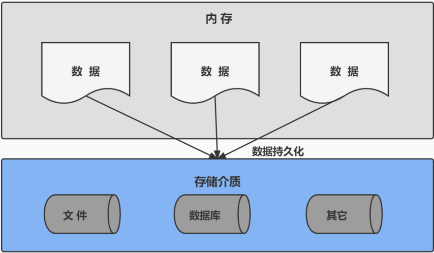

**DB：数据库（Database）**

即存储数据的“仓库”，其本质是一个文件系统。它保存了一系列有组织的数据。

**DBMS：数据库管理系统（Database Management System）**

是一种操纵和管理数据库的大型软件，用于建立、使用和维护数据库，对数据库进行统一管理和控
制。用户通过数据库管理系统访问数据库中表内的数据。

**SQL：结构化查询语言（Structured Query Language）**

专门用来与数据库通信的语言。

## 2. 数据库与数据库管理系统

### 2. 1 数据库的相关概念

### 2. 2 数据库与数据库管理系统的关系

数据库管理系统(DBMS)可以管理多个数据库，一般开发人员会针对每一个应用创建一个数据库。为保存应用中实体的数据，一般会在数据库创建多个表，以保存程序中实体用户的数据。数据库管理系统、数据库和表的关系如图所示：

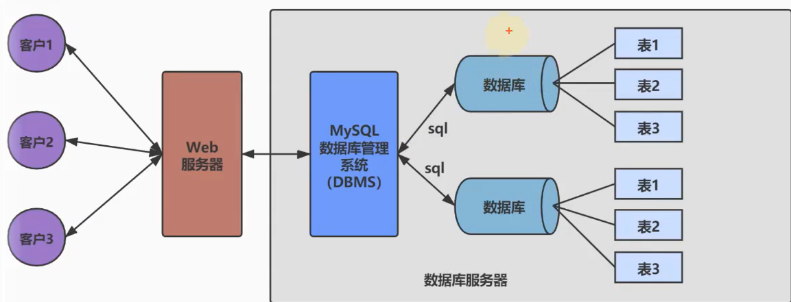

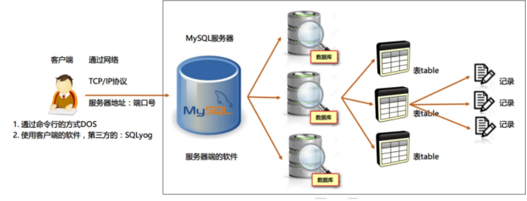

### 2. 3 常见的数据库管理系统排名(DBMS)

目前互联网上常见的数据库管理软件有Oracle、MySQL、MS SQL Server、DB2、PostgreSQL、Access、
Sybase、Informix这几种。以下是 2021 年 **DB-Engines Ranking** 对各数据库受欢迎程度进行调查后的统计结
果：（查看数据库最新排名: **https://db-engines.com/en/ranking** ）

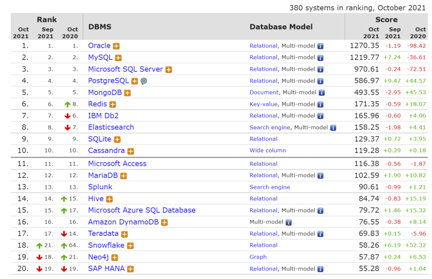

对应的走势图：（ **https://db-engines.com/en/ranking_trend** ）

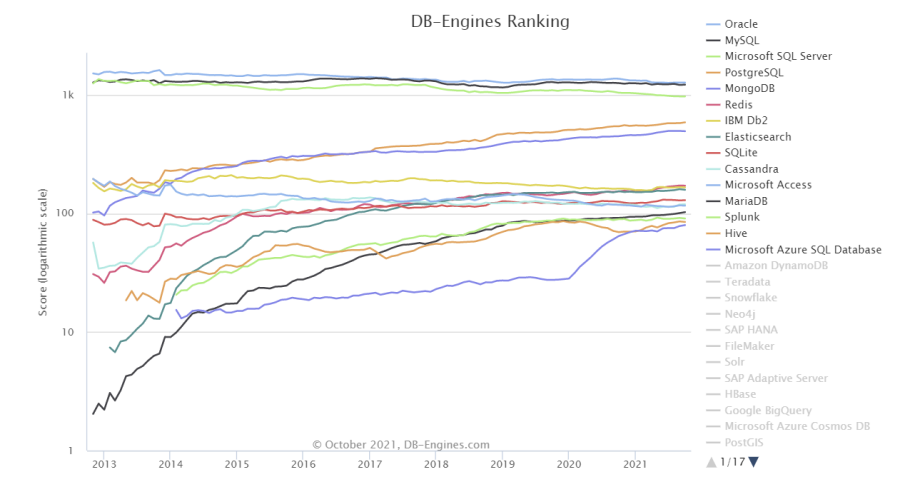

### 2. 4 常见的数据库介绍

**Oracle**

1979 年，Oracle 2 诞生，它是第一个商用的 RDBMS（关系型数据库管理系统）。随着 Oracle 软件的名气
越来越大，公司也改名叫 Oracle 公司。

2007 年，总计 85 亿美金收购BEA Systems。

2009 年，总计 74 亿美金收购SUN。此前的 2008 年，SUN以 10 亿美金收购MySQL。意味着Oracle 同时拥有了
MySQL 的管理权，至此 Oracle 在数据库领域中成为绝对的领导者。

2013 年，甲骨文超越IBM，成为继Microsoft后全球第二大软件公司。

如今 Oracle 的年收入达到了 400 亿美金，足以证明商用（收费）数据库软件的价值。

**SQL Server**

SQL Server 是微软开发的大型商业数据库，诞生于 1989 年。C#、.net等语言常使用，与WinNT完全集
成，也可以很好地与Microsoft BackOffice产品集成。

**DB**

IBM公司的数据库产品,收费的。常应用在银行系统中。

**PostgreSQL**

PostgreSQL 的稳定性极强，最符合SQL标准，开放源码，具备商业级DBMS质量。PG对数据量大的文本以
及SQL处理较快。

**SyBase** 北京宏福校区：010-56253825 深圳西部硅谷校区：0755-23060254 上海大江商厦校区：021-

已经淡出历史舞台。提供了一个非常专业数据建模的工具PowerDesigner。

**SQLite**

嵌入式的小型数据库，应用在手机端。 零配置，SQlite3不用安装，不用配置，不用启动，关闭或者配置
数据库实例。当系统崩溃后不用做任何恢复操作，再下次使用数据库的时候自动恢复。

**informix**

IBM公司出品，取自Information 和Unix的结合，它是第一个被移植到Linux上的商业数据库产品。仅运行
于unix/linux平台，命令行操作。 性能较高，支持集群，适应于安全性要求极高的系统，尤其是银行，证
券系统的应用。

## 3. MySQL介绍

### 3. 1 概述

- MySQL是一个`开放源代码的关系型数据库管理系统`，由瑞典MySQL AB（创始人Michael Widenius）公司 1995 年开发，迅速成为开源数据库的 No.1。
- 2008 被`Sun`收购（ 10 亿美金）， 2009 年Sun被`Oracle`收购。`MariaDB`应运而生。（MySQL 的创造者担心 MySQL 有闭源的风险，因此创建了 MySQL 的分支项目 MariaDB）
- MySQL6.x 版本之后分为`社区版`和`商业版`。
- MySQL是一种关联数据库管理系统，将数据保存在不同的表中，而不是将所有数据放在一个大仓库内，这样就增加了速度并提高了灵活性。
- MySQL是开源的，所以你不需要支付额外的费用。
- MySQL是可以定制的，采用了`GPL（GNU General Public License）`协议，你可以修改源码来开发自己的MySQL系统。
- MySQL支持大型的数据库。可以处理拥有上千万条记录的大型数据库。
- MySQL支持大型数据库，支持 5000 万条记录的数据仓库， 32 位系统表文件最大可支持`4GB`， 64 位系统支持最大的表文件为`8TB`。
- MySQL使用`标准的SQL数据语言形式`。
- MySQL可以允许运行于多个系统上，并且支持多种语言。这些编程语言包括C、C++、Python、Java、Perl、PHP和Ruby等。

### 3. 2 MySQL发展史重大事件

MySQL的历史就是整个互联网的发展史。互联网业务从社交领域、电商领域到金融领域的发展，推动着
应用对数据库的需求提升，对传统的数据库服务能力提出了挑战。高并发、高性能、高可用、轻资源、
易维护、易扩展的需求，促进了MySQL的长足发展。

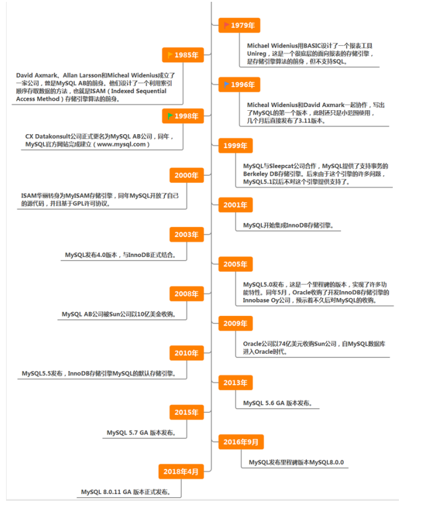

### 1. 4 关于MySQL 8. 0

==MySQL从5.7版本直接跳跃发布了8.0版本，==可见这是一个令人兴奋的里程碑版本。MySQL 8版本在功能上
做了显著的改进与增强，开发者对MySQL的源代码进行了重构，最突出的一点是多MySQL Optimizer优化
器进行了改进。不仅在速度上得到了改善，还为用户带来了更好的性能和更棒的体验。

### 1.5 Why choose MySQL?


为什么如此多的厂商要选用MySQL？大概总结的原因主要有以下几点：

1. 开放源代码，使用成本低。
2. 性能卓越，服务稳定。
3. 软件体积小，使用简单，并且易于维护。
4. 历史悠久，社区用户非常活跃，遇到问题可以寻求帮助。
5. 许多互联网公司在用，经过了时间的验证。

### 1.6 Oracle vs MySQL

Oracle 更适合大型跨国企业的使用，因为他们对费用不敏感，但是对性能要求以及安全性有更高的要
求。

MySQL 由于其 `体积小、速度快、总体拥有成本低，可处理上千万条记录的大型数据库，尤其是开放源码`
`这一特点，使得很多互联网公司、中小型网站选择了MySQL作为网站数据库` （Facebook，Twitter，
YouTube，阿里巴巴/蚂蚁金服，去哪儿，美团外卖，腾讯）。

## 4. RDBMS 与 非RDBMS

从排名中我们能看出来，关系型数据库绝对是 DBMS 的主流，其中使用最多的 DBMS 分别是 Oracle、
MySQL 和 SQL Server。这些都是关系型数据库（RDBMS）。

### 4.1 关系型数据库(RDBMS)

#### 4. 1. 1 实质

- 这种类型的数据库是==最古老==的数据库类型，关系型数据库模型是把复杂的数据结构归结为简单的==二元关系==（即二维表格形式）。

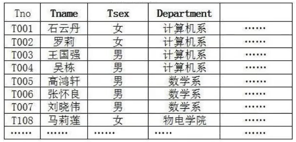

- 关系型数据库以==行(row)==和==列(column)==的形式存储数据，以便于用户理解。这一系列的行和列被称为==表（table）==，一组表组成了一个==库（database）==

* 表与表之间的数据记录有关系(relationship)。现实世界中的各种实体以及实体之间的各种联系均用
  ==关系模型==来表示。关系型数据库，就是建立在==关系模型==基础上的数据库。
* SQL 就是关系型数据库的查询语言。

#### 4. 1. 2 优势

- 复杂查询 可以用SQL语句方便的在一个表以及多个表之间做非常复杂的数据查询。
- 事务支持 使得对于安全性能很高的数据访问要求得以实现。

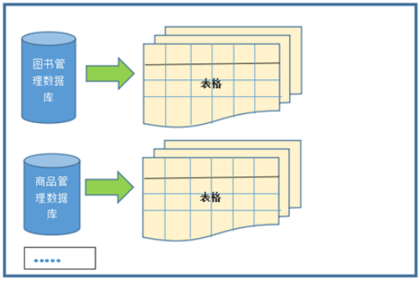

### 4. 2 非关系型数据库(非RDBMS)

#### 4. 2. 1 介绍

`非关系型数据库` ，可看成传统关系型数据库的功能==阉割版本==，基于键值对存储数据，不需要经过SQL层的解析，==性能非常高==。同时，通过减少不常用的功能，进一步提高性能。目前基本上大部分主流的非关系型数据库都是免费的。

#### 4. 2. 2 有哪些非关系型数据库

相比于 SQL，NoSQL 泛指非关系型数据库，包括了榜单上的键值型数据库、文档型数据库、搜索引擎和
列存储等，除此以外还包括图形数据库。也只有用 NoSQL 一词才能将这些技术囊括进来。

**键值型数据库**

键值型数据库通过 Key-Value 键值的方式来存储数据，其中 Key 和 Value 可以是简单的对象，也可以是复
杂的对象。Key 作为唯一的标识符，优点是查找速度快，在这方面明显优于关系型数据库，缺点是无法
像关系型数据库一样使用条件过滤（比如 WHERE），如果你不知道去哪里找数据，就要遍历所有的键，
这就会消耗大量的计算。

键值型数据库典型的使用场景是作为==内存缓存==。`Redis`是最流行的键值型数据库。

**文档型数据库**

此类数据库可存放并获取文档，可以是XML、JSON等格式。在数据库中文档作为处理信息的基本单位，一个文档就相当于一条记录。文档数据库所存放的文档，就相当于键值数据库所存放的“值”。MongoDB
是最流行的文档型数据库。此外，还有CouchDB等。

**搜索引擎数据库**

虽然关系型数据库采用了索引提升检索效率，但是针对全文索引效率却较低。搜索引擎数据库是应用在
搜索引擎领域的数据存储形式，由于搜索引擎会爬取大量的数据，并以特定的格式进行存储，这样在检
索的时候才能保证性能最优。核心原理是“倒排索引”。

典型产品：Solr、Elasticsearch、Splunk 等。

**列式数据库**

列式数据库是相对于行式存储的数据库，Oracle、MySQL、SQL Server 等数据库都是采用的行式存储
（Row-based），而列式数据库是将数据按照列存储到数据库中，这样做的好处是可以大量降低系统的
I/O，适合于分布式文件系统，不足在于功能相对有限。典型产品：HBase等。

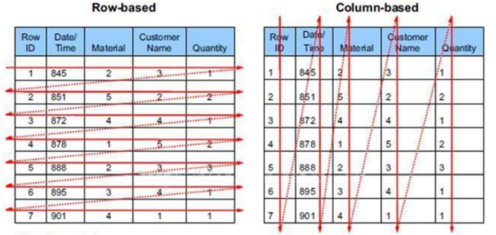

##### 图形数据库

图形数据库，利用了图这种数据结构存储了实体（对象）之间的关系。图形数据库最典型的例子就是社交网络中人与人的关系，数据模型主要是以节点和边（关系）来实现，特点在于能高效地解决复杂的关系问题。图形数据库顾名思义，就是一种存储图形关系的数据库。它利用了图这种数据结构存储了实体（对象）之间的关系。关系型数据用于存储明确关系的数据，但对于复杂关系的数据存储却有些力不从心。如社交网络中人物之间的关系，如果用关系型数据库则非常复杂，用图形数据库将非常简单。典型产品：Neo4J、InfoGrid等。


#### 4. 2. 3 NoSQL的演变

由于 SQL 一直称霸 DBMS，因此许多人在思考是否有一种数据库技术能远离 SQL，于是 NoSQL 诞生了，
但是随着发展却发现越来越离不开 SQL。到目前为止 NoSQL 阵营中的 DBMS 都会有实现类似 SQL 的功
能。下面是“NoSQL”这个名词在不同时期的诠释，从这些释义的变化中可以看出 ==NoSQL 功能的演变==：

1970 ：NoSQL = We have no SQL

1980 ：NoSQL = Know SQL

2000 ：NoSQL = No SQL!

2005 ：NoSQL = Not only SQL

2013 ：NoSQL = No, SQL!

NoSQL 对 SQL 做出了很好的补充，比如实际开发中，有很多业务需求，其实并不需要完整的关系型数据
库功能，非关系型数据库的功能就足够使用了。这种情况下，使用==性能更高、成本更低==的非关系型数据
库当然是更明智的选择。比如：日志收集、排行榜、定时器等。

### 4. 3 小结

NoSQL 的分类很多，即便如此，在 DBMS 排名中，还是 SQL 阵营的比重更大，影响力前 5 的 DBMS 中有
4 个是关系型数据库，而排名前 20 的 DBMS 中也有 12 个是关系型数据库。所以说，掌握 SQL 是非常有
必要的。整套课程将围绕 SQL 展开。

## 5. 关系型数据库设计规则

关系型数据库的典型数据结构就是数据表，这些数据表的组成都是结构化的（Structured）。
将数据放到表中，表再放到库中。
一个数据库中可以有多个表，每个表都有一个名字，用来标识自己。表名具有唯一性。
表具有一些特性，这些特性定义了数据在表中如何存储，类似Java和Python中 “类”的设计。

### 5. 1 表、记录、字段

E-R（entity-relationship，实体-联系）模型中有三个主要概念是：==实体集、属性、联系集==。
一个实体集（class）对应于数据库中的一个表（table），一个实体（instance）则对应于数据库表
中的一行（row），也称为一条记录（record）。一个属性（attribute）对应于数据库表中的一列
（column），也称为一个字段（field）。

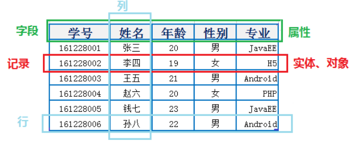

**ORM思想 (Object Relational Mapping)体现：** 

- 数据库中的一个表 <---> Java或Python中的一个类
- 表中的一条数据 <---> 类中的一个对象（或实体）
- 表中的一个列 <----> 类中的一个字段、属性(field)

### 5. 2 表的关联关系

表与表之间的数据记录有关系(relationship)。现实世界中的各种实体以及实体之间的各种联系均用
关系模型来表示。
四种：==一对一关联、一对多关联、多对多关联、**自我引用**==

#### 5.2.1 一对一关联（one-to-one）

- 在实际的开发中应用不多，因为一对一可以创建成一张表。
- 举例：设计==学生表==：学号、姓名、手机号码、班级、系别、身份证号码、家庭住址、籍贯、紧急联系人、...
  - 拆为两个表：两个表的记录是一一对应关系。
  - ==基础信息表==（常用信息）：学号、姓名、手机号码、班级、系别
  - ==档案信息表==（不常用信息）：学号、身份证号码、家庭住址、籍贯、紧急联系人、...
- 两种建表原则：
  - 外键唯一：主表的主键和从表的外键（唯一），形成主外键关系，外键唯一。
  - 外键是主键：主表的主键和从表的主键，形成主外键关系。

#### 5.2.2 一对多关系（one-to-many）

- 常见实例场景：客户表和订单表，分类表和商品表，部门表和员工表。

  - ##### 举例：

    - 员工表：编号、姓名、...、所属部门
    - 部门表：编号、名称、简介

- 一对多建表原则：在从表(多方)创建一个字段，字段作为外键指向主表(一方)的主键

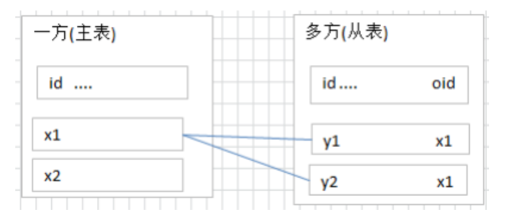

#### 5. 2. 3 多对多（many-to-many）

- 要表示多对多关系，必须创建第三个表，该表通常称为==联接表==，它将多对多关系划分为两个一对多关系。将这两个表的主键都插入到第三个表中。

- 举例 1 ：学生-课程

  - ==学生信息表==：一行代表一个学生的信息（学号、姓名、手机号码、班级、系别...）
  - ==课程信息表==：一行代表一个课程的信息（课程编号、授课老师、简介...）
  - ==选课信息表==：一个学生可以选多门课，一门课可以被多个学生选择

- 举例 2 ：产品-订单

- “订单”表和“产品”表有一种多对多的关系，这种关系是通过与“订单明细”表建立两个一对多关系来定义的。一个订单可以有多个产品，每个产品可以出现在多个订单中。

  - ==产品表==：“产品”表中的每条记录表示一个产品。
  - ==订单表==：“订单”表中的每条记录表示一个订单。
  - ==订单明细表==：每个产品可以与“订单”表中的多条记录对应，即出现在多个订单中。一个订单可以与“产品”表中的多条记录对应，即包含多个产品。

- 举例 3 ：用户-角色

- 多对多关系建表原则：需要创建第三张表，中间表中至少两个字段，这两个字段分别作为外键指向各自一方的主键。

  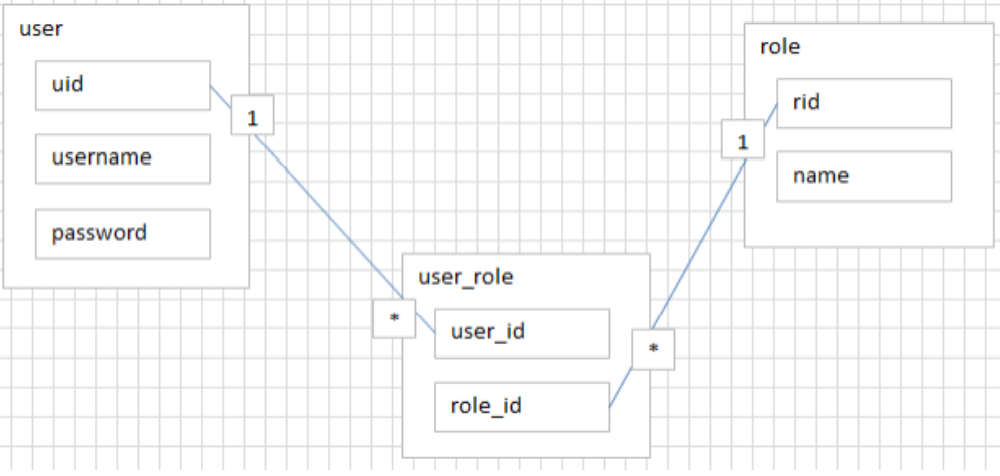

#### 5.3.4 自我引用(Self reference)

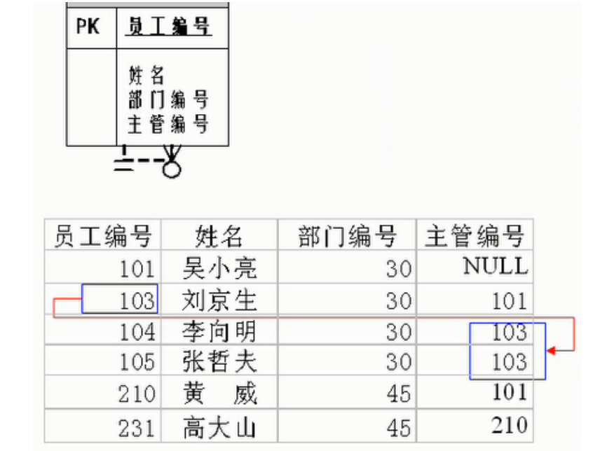


# 二、基本操作与目录结构

## 1. MySQL操作

### 1.1 对库操作。

```mysql
    -- 查看数据库的创建信息:
    show create database 数据库名;
    -- 结果：
    +----------+---------------------------------------------------------------------------------------------------------------------------------+
    | Database | Create Database                                                                                                                 |
    +----------+---------------------------------------------------------------------------------------------------------------------------------+
    | mysql    | CREATE DATABASE `mysql` /*!40100 DEFAULT CHARACTER SET utf8mb4 COLLATE utf8mb4_0900_ai_ci */ /*!80016 DEFAULT ENCRYPTION='N' */ |
    +----------+---------------------------------------------------------------------------------------------------------------------------------+


    -- 展示所有数据库：
    show databses;

    -- 创建数据库：
    create database 数据库名;

    -- 使用或者说选择数据库：
    use database 数据库名;

    -- 删除数据库：小心，use了也能删。
    drop database 数据库名;

```
### 1.2 对表操作

```mysql
-- 查看表的创建信息:
show create table 表名;
-- 结果：
+-------+-------------------------------------------------------------------------------------------------------------------------------------------    -----------------------------------------------------------------------------+
| Table | Create Table                                                                                                                                                                                                                  |
+-------+------------------------------------------------------------------------------------------------------------------------------------------------------------------------------------------------------------------------+
| user  | CREATE TABLE `user` (
  `id` bigint NOT NULL,
  `name` varchar(20) CHARACTER SET utf8mb3 COLLATE utf8_general_ci DEFAULT NULL,
  PRIMARY KEY (`id`)
) ENGINE=InnoDB DEFAULT CHARSET=utf8mb4 COLLATE=utf8mb4_0900_ai_ci |
+-------+------------------------------------------------------------------------------------------------------------------------------------------------------------------------------------------------------------------------+

-- 查看表的字段信息:
desc 表名;

-- 创建表 
create Table: CREATE TABLE `student` (
`id` int(11) NOT NULL,
`name` varchar(20) DEFAULT NULL,
PRIMARY KEY (`id`)
)
ENGINE=InnoDB DEFAULT CHARSET=utf8


-- 查看某个库的所有表格1：
show tables from 数据库名;

-- 已经选择了某个数据库，查看该数据库下的所有表格：
show tables;

-- 删除表
drop table 表名;
```

### 1.3 解决字符集

#### a ==解决全局配置字符集问题==

1. 检查全局配置

   ```mysql
   show variables like 'character_%';
   show variables like 'collation_%';
   ```

2. 修改mysql的数据目录下的my.ini配置文件

   ```properties
   [mysql]
   default-character-set=utf8 #默认字符集
   [mysqld] # 大概在76行左右，在其下添加
   ...
   character-set-server=utf8
   collation-server=utf8_general_ci
   ```

3. 重启服务

4. 重新检查全局配置  

#### b ==解决表字符集问题==

```mysql
alter table 表名charset utf8;  
```
#### c ==解决数据库字符集问题==

```mysql
alter database 数据库名 charset utf8; 
--或者
create database 数据库名 charset Latin1;
```
### 1.4 解决其它问题
1. **问题**： 在连接MySQL8时出现“Authentication plugin 'caching_sha2_password' cannot be loaded”错误。

   **原因**：由于出现这个原因是MySQL8之前的版本中加密规则是mysql_native_password，而在MySQL8之后，加密规则是caching_sha2_password。

   **解决办法**：
   第一种：升级图形工具。
   第二种：使用命令：

   ```mysql
   #使用mysql数据库
   use mysql;
   
   #修改'root'@'localhost'用户的密码规则和密码
   ALTER USER 'root'@'localhost' IDENTIFIED WITH mysql_native_password BY 'abc123'
   
   #刷新权限
   FLUSH PRIVILEGES;
   ```


## 2. 目录结构

| bin目录                                     | 所有MySQL的可执行文件。如：mysql.exe |
| ------------------------------------------- | ------------------------------------ |
| MySQLInstanceConfig.exe                     | 数据库的配置向导，在安装时出现的内容 |
| data目录                                    | 系统数据库所在的目录                 |
| my.ini文件                                  | MySQL的主要配置文件                  |
| c:\ProgramData\MySQL\MySQL Server 8.0\data\ | 用户创建的数据库所在的目录           |

# 三、基本SELECT语句

## 1. SQL概述

### 1.1 SQL背景知识
* 1946 年，世界上第一台电脑诞生，如今，借由这台电脑发展起来的互联网已经自成江湖。在这几十
  年里，无数的技术、产业在这片江湖里沉浮，有的方兴未艾，有的已经几幕兴衰。但在这片浩荡的
  波动里，有一门技术从未消失，甚至“老当益壮”，那就是 SQL。
    * 45 年前，也就是 1974 年，IBM 研究员发布了一篇揭开数据库技术的论文《SEQUEL：一门结构
  化的英语查询语言》，直到今天这门结构化的查询语言并没有太大的变化，相比于其他语
  言， SQL 的半衰期可以说是非常长 了。

* 不论是前端工程师，还是后端算法工程师，都一定会和数据打交道，都需要了解如何又快又准确地
  提取自己想要的数据。更别提数据分析师了，他们的工作就是和数据打交道，整理不同的报告，以
  便指导业务决策。

* SQL（Structured Query Language，结构化查询语言）是使用关系模型的数据库应用语言， 与数据直
  接打交道 ，由 IBM 上世纪70年代开发出来。后由美国国家标准局（ANSI）开始着手制定SQL标准，
  先后有 SQL-86 ， SQL-89 ， SQL-92 ， SQL-99 等标准。
    * SQL 有两个重要的标准，分别是 SQL92 和 SQL99，它们分别代表了 92 年和 99 年颁布的 SQL 标
  准，我们今天使用的 SQL 语言依然遵循这些标准

* 不同的数据库生产厂商都支持SQL语句，但都有特有内容。

  

### 1.2 SQL分类
* **DDL（Data Definition Languages、数据定义语言）**，这些语句定义了不同的数据库、表、视图、索
  引等数据库对象，还可以用来创建、删除、修改数据库和数据表的结构。
    * CREATE \ ALTER \ DROP \ RENAME \ TRUNCATE
* **DML（Data Manipulation Language、数据操作语言）**，用于添加、删除、更新和查询数据库记
  录，并检查数据完整性。
    * SELECT \ UPDATE \ DELETE \ INSERT
* DCL**（Data Control Language、数据控制语言）**，用于定义数据库、表、字段、用户的访问权限和
  安全级别。
    * COMMIT \ ROLLBACK \ SAVEPOINT \  GRANT \ REVOKE


> 因为查询语句使用的非常的频繁，所以很多人把查询语句单拎出来一类：`DQL`（数据查询语言）。
> 还有单独将 COMMIT 、 ROLLBACK 取出来称为`TCL` （Transaction Control Language，事务控制语
> 言）。

## 2 SQL语言的规则与规范

* SQL 可以写在一行或者多行。为了提高可读性，各子句分行写，必要时使用缩进
* 每条命令以 ; 或 \g 或 \G 结束
* 关键字不能被缩写也不能分行
* 关于标点符号

    * 必须保证所有的()、单引号、双引号是成对结束的
    * 必须使用英文状态下的半角输入方式
    * 字符串型和日期时间类型的数据可以使用单引号（' '）表示
    * 列的别名，尽量使用双引号（" "），而且不建议省略as
    
### 2.1 SQL大小写规范 （建议遵守）
* **MySQL 在 Windows 环境下是大小写不敏感的**
* **MySQL 在 Linux 环境下是大小写敏感的**
    * 数据库名、表名、表的别名、变量名是严格区分大小写的
    * 关键字、函数名、列名(或字段名)、列的别名(字段的别名) 是忽略大小写的。
* **推荐采用统一的书写规范：**
    * 数据库名、表名、表别名、字段名、字段别名等都小写
    * SQL 关键字、函数名、绑定变量等都大写

### 2.2 注 释

可以使用如下格式的注释结构：

```mysql
单行注释：#注释文字(MySQL特有的方式)
单行注释：-- 注释文字(--后面必须包含一个空格。)
多行注释：/* 注释文字 */
```

### 2.3 命名规则（暂时了解）
* 数据库、表名不得超过30个字符，变量名限制为29个
* 必须只能包含 A–Z, a–z, 0–9, _共63个字符
* 数据库名、表名、字段名等对象名中间不要包含空格
* 同一个MySQL软件中，数据库不能同名；同一个库中，表不能重名；同一个表中，字段不能重名
* 必须保证你的字段没有和保留字、数据库系统或常用方法冲突。如果坚持使用，请在SQL语句中使
用`（**着重号**）引起来
* 保持字段名和类型的一致性，在命名字段并为其指定数据类型的时候一定要保证一致性。假如数据
类型在一个表里是整数，那在另一个表里可就别变成字符型了
例如：
```mysql
-- 因为order是保留字，所以要着重符号。
CREATE TABLE `order`(...);
```
### 2.4 执行SQL脚本

```mysql
source SQL脚本的路径
```

## 3.基本的SELECT语句

### 3.1 SELECT...

```mysql
SELECT 1;
SELECT 9/2;

-- DUAL是伪表
SELECT 1+1 FROM DUAL;
```

### 3.2 SELECT...FROM

* 语法：

  `SELECT` 标识选择哪些列
  `FROM` 标识从哪个表中选择

```mysql
SELECT *
FROM departments;
```

> `*`表示全部列。
>
> 一般来说不建议列全部列，除非全部都用得到，因为效率问题。

选择特定的列：

```mysql
SELECT department_id, location_id
FROM departments;
```
### 3.3 列的别名

重命名一个列。

**在列名和别名之间加入关键字AS，别名使用双引号。**

```mysql
-- 例如：
SELECT last_name AS name, commission_pct comm
FROM employees;

SELECT last_name "Name", salary*12 "Annual Salary"
FROM employees;


```


### 3.4 去除重复行

```mysql
-- 默认情况下，查询会返回全部行。
SELECT DISTINCT department_id
FROM employees;
```
> DISTINCT 其实是对**后面所有列名的组合**进行去重

### 3.5 空值参与运算

* 所有运算符或列值遇到null值，==运算的结果都为null==
* null不等同于0，''，'null'

例如：

```mysql
-- 错误，空值参与运算 commission_pct可能为空的设定
SELECT employee_id,salary "月工资",salary * (1 + commission_pct) * 12 "年工资"
FROM employees; 

-- 正确，空值不参与运算
SELECT employee_id,salary "月工资",salary * (1 + isNull(commission_pct,0)) * 12 "年工资"
FROM employees;


```
### 3.6 使用常数列

```mysql
SELECT User, '哈士奇' AS xxx FROM user;
-- 结果：
+------------------+--------+
| User             | xxx    |
+------------------+--------+
| mysql.infoschema | 哈士奇 |
| mysql.session    | 哈士奇 |
| mysql.sys        | 哈士奇 |
| root             | 哈士奇 |
+------------------+--------+
```
### 3.7 显示表结构

```mysql
DESC 表名;
DESCRIBE 表名;

-- 结果：
+----------------+-------------+------+-----+---------+-------+
| Field | Type | Null | Key | Default | Extra |
+----------------+-------------+------+-----+---------+-------+
| employee_id | int(6) | NO | PRI | 0 | |
| first_name | varchar(20) | YES | | NULL | |
| last_name | varchar(25) | NO | | NULL | |
| email | varchar(25) | NO | UNI | NULL | |
| phone_number | varchar(20) | YES | | NULL | |
| hire_date | date | NO | | NULL | |
| job_id | varchar(10) | NO | MUL | NULL | |
| salary | double(8,2) | YES | | NULL | |
| commission_pct | double(2,2) | YES | | NULL | |
| manager_id | int(6) | YES | MUL | NULL | |
| department_id | int(4) | YES | MUL | NULL | |
+----------------+-------------+------+-----+---------+-------+
```

### 3.8 SELECT...FROM...WHERE

* 语法：
    SELECT 字段1,字段2
    FROM 表名
    WHERE 过滤条件
    * 使用WHERE 子句，将不满足条件的行过滤掉
    * **WHERE子句紧随 FROM子句**
* 举例

```mysql
SELECT employee_id, last_name, job_id, department_id
FROM employees
WHERE department_id = 90 ;

-- 结果
+-------------+-----------+---------+---------------+
| employee_id | last_name | job_id  | department_id |
+-------------+-----------+---------+---------------+
|         100 | King      | AD_PRES |            90 |
|         101 | Kochhar   | AD_VP   |            90 |
|         102 | De Haan   | AD_VP   |            90 |
+-------------+-----------+---------+---------------+

SELECT * FROM employees WHERE last_name='king';
-- 结果
+-------------+------------+-----------+-------+--------------------+------------+---------+----------+----------------+------------+---------------+
| employee_id | first_name | last_name | email | phone_number       | hire_date  | job_id  | salary   | commission_pct | manager_id | department_id |
+-------------+------------+-----------+-------+--------------------+------------+---------+----------+----------------+------------+---------------+
|         100 | Steven     | King      | SKING | 515.123.4567       | 1987-06-17 | AD_PRES | 24000.00 |           NULL |       NULL |            90 |
|         156 | Janette    | King      | JKING | 011.44.1345.429268 | 1996-01-30 | SA_REP  | 10000.00 |           0.35 |        146 |            80 |
+-------------+------------+-----------+-------+--------------------+------------+---------+----------+----------------+------------+---------------+
```
> MySQL不严谨，**查询字符串不区分大小写**,不符合标准ANSI，Oracle不是这样的哦。

# 四、运算符
## 1. 算数运算符

| 符号 |          说明          |
| :--: | :--------------------: |
|  +   |       加法运算符       |
|  -   |       减法运算符       |
|  *   |       乘法运算符       |
|  /   |     DIV 除法运算符     |
|  %   | MOD 求模（求余）运算符 |

### 1.1 加法与减法运算符


```mysql
SELECT 100, 100 + 0, 100 - 0, 100 + 50, 100 + 50 -30, 100 + 35.5, 100 - 35.5,1+null
FROM dual;
-- Result：
+-----+---------+---------+----------+--------------+------------+------------+--------+
| 100 | 100 + 0 | 100 - 0 | 100 + 50 | 100 + 50 -30 | 100 + 35.5 | 100 - 35.5 | 1+null |
+-----+---------+---------+----------+--------------+------------+------------+--------+
| 100 |     100 |     100 |      150 |          120 |      135.5 |       64.5 |   NULL |
+-----+---------+---------+----------+--------------+------------+------------+--------+
```

结论：

* 一个整数类型的值对整数进行加法和减法操作，结果还是一个整数；
* 一个整数类型的值对浮点数进行加法和减法操作，结果是一个浮点数；
* 加法和减法的优先级相同，进行先加后减操作与进行先减后加操作的结果是一样的；
* 在Java中，+的左右两边如果有字符串，那么表示字符串的拼接。但是在MySQL中+只表示数
值相加。如果遇到非数值类型，先尝试转成数值（**隐式转换**），==如果转失败，就按0计算==。（补充：MySQL
中字符串拼接要使用字符串函数CONCAT()实现）

### 1.2 乘法与除法运算符

```mysql
SELECT 100,100*1,100*1.0,100/1.0,100/2,100+2*5/2,100/3,100 DIV 0
FROM DUAL;
-- 结果：
+-----+-------+---------+----------+---------+-----------+---------+-----------+
| 100 | 100*1 | 100*1.0 | 100/1.0  | 100/2   | 100+2*5/2 | 100/3   | 100 DIV 0 |
+-----+-------+---------+----------+---------+-----------+---------+-----------+
| 100 |   100 |   100.0 | 100.0000 | 50.0000 |  105.0000 | 33.3333 |      NULL |
+-----+-------+---------+----------+---------+-----------+---------+-----------+
```

结论：
* 一个数乘以整数1和除以整数1后仍得原数；
* 一个数乘以浮点数1和除以浮点数1后变成浮点数，数值与原数相等；
* **一个数除以整数后，不管是否能除尽，结果都为一个浮点数，并保留到小数点后4位；**
* 乘法和除法的优先级相同，进行先乘后除操作与先除后乘操作，得出的结果相同。
* 在数学运算中，0不能用作除数，在MySQL中，**一个数除以0为NULL。**

### 1.3 求模（求余）运算符

```mysql
SELECT 12 % 3, 12 % 5,12 MOD -5,-12 % 5,-12 %-5
FROM DUAL;

-- Result：
+--------+--------+-----------+---------+---------+
| 12 % 3 | 12 % 5 | 12 MOD -5 | -12 % 5 | -12 %-5 |
+--------+--------+-----------+---------+---------+
|      0 |      2 |         2 |      -2 |      -2 |
+--------+--------+-----------+---------+---------+
```
结论：

* 模数为什么，结果就为什么。如模是负数，那结果结果就是正数。

## 2. 比较运算符

|   符号   |      说明      |
| :------: | :------------: |
|    =     |   等于运算符   |
|   <=>    | 安全等于运算符 |
| <>（!=） |  不等于运算符  |
|    <     |   小于运算符   |
|    <=    | 小于等于运算符 |
|    >     |   大于运算符   |
|    >=    | 大于等于运算符 |


### 2.1 等于运算符

```mysql

#字符串存在隐式转换，如果转换数值不成功，则看做0
SELECT 1=2,1!=2,1='1',1='a',0='a'
FROM DUAL;

-- Result:
+-----+------+-------+-------+-------+
| 1=2 | 1!=2 | 1='1' | 1='a' | 0='a' |
+-----+------+-------+-------+-------+
|   0 |    1 |     1 |     0 |     1 |
+-----+------+-------+-------+-------+

#两边都是字符串的话，则按照ANSI的比较规则进行比较。
SELECT 'a'='a','ab'='ab','a'='b'
FROM DUAL;
+---------+-----------+---------+
| 'a'='a' | 'ab'='ab' | 'a'='b' |
+---------+-----------+---------+
|       1 |         1 |       0 |
+---------+-----------+---------+

#只要有null参与判断，结果就为null
SELECT 1=NULL,NULL=NULL;
+--------+-----------+
| 1=NULL | NULL=NULL |
+--------+-----------+
|   NULL |      NULL |
+--------+-----------+

SELECT last_name,salary
FROM employees
WHERE commission_pct=NULL; #没有任何结果。

--Result：
Empty set (0.00 sec) 
```
结论：
* 等号运算符（=）判断等号两边的值、字符串或表达式是否相等，如果相等则返回1，不相等则返回
0。
* 在使用等号运算符时，遵循如下规则：
    * 如果等号两边的值、字符串或表达式都为字符串，则MySQL会按照字符串进行比较，**其比较的**
    **是每个字符串中字符的ANSI编码是否相等。**
    * 如果等号两边的值都是整数，则MySQL会按照整数来比较两个值的大小。
    * 如果等号两边的值一个是整数，另一个是字符串，**则MySQL会将字符串转化为数字进行比较。**
    * 如果等号两边的值、字符串或表达式中有一个为NULL，**则比较结果为NULL。**


### 2.2 安全等于运算符

与等于运算符唯一的==区别==就是 <=> 可以用来对NULL进行判断。**当两个操作数均为NULL时，其返回值为1，而不为NULL;当一个操作数为NULL时，其返回值为0。**

```mysql
SELECT 1 <=> 2, 1 <=> '1', 1 <=> 'a', 0 <=> 'a'
FROM DUAL;

--Result：
+---------+-----------+-----------+-----------+
| 1 <=> 2 | 1 <=> '1' | 1 <=> 'a' | 0 <=> 'a' |
+---------+-----------+-----------+-----------+
|       0 |         1 |         0 |         1 |
+---------+-----------+-----------+-----------+
SELECT 1 <=> NULL, NULL <=> NULL
FROM DUAL;

--Result:
+------------+---------------+
| 1 <=> NULL | NULL <=> NULL |
+------------+---------------+
|          0 |             1 |
+------------+---------------+

#找绩点为空的用户
SELECT last_name,salary,commission_pct
FROM employees
WHERE commission_pct <=> NULL;

--Result：
+-------------+----------+----------------+
| last_name   | salary   | commission_pct |
+-------------+----------+----------------+
| King        | 24000.00 |           NULL |
| Kochhar     | 17000.00 |           NULL |
| De Haan     | 17000.00 |           NULL |
| Hunold      |  9000.00 |           NULL |
| Ernst       |  6000.00 |           NULL |
| Austin      |  4800.00 |           NULL |
| Pataballa   |  4800.00 |           NULL |
| Lorentz     |  4200.00 |           NULL |


#找绩点不为空的用户
SELECT last_name,commission_pct FROM employees WHERE !(commission_pct <=> NULL); 
#或者
SELECT last_name,commission_pct FROM employees WHERE NOT commission_pct <=> NULL;

--Result：

+------------+----------------+
| last_name  | commission_pct |
+------------+----------------+
| Russell    |           0.40 |
| Partners   |           0.30 |
| Errazuriz  |           0.30 |
| Cambrault  |           0.30 |
| Zlotkey    |           0.20 |
| Tucker     |           0.30 |
| Bernstein  |           0.25 |
| Hall       |           0.25 |

```

### 2.3 不等于运算符


```mysql
 SELECT 1 <> 1,1!=2,'a'!='b',(3+4) <>(2+6), 'a'!=NULL,NULL<>NULL;
 +--------+------+----------+---------------+-----------+------------+
| 1 <> 1 | 1!=2 | 'a'!='b' | (3+4) <>(2+6) | 'a'!=NULL | NULL<>NULL |
+--------+------+----------+---------------+-----------+------------+
|      0 |    1 |        1 |             1 |      NULL |       NULL |
+--------+------+----------+---------------+-----------+------------+
```

## 3. 非符号运算符

| 运算符       | 名称             | 注意                                         | 示例 |
| ------------ | ---------------- | -------------------------------------------- | ---- |
| IS NULL      | 为空运算符       |                                              |      |
| IS NOT NULL  | 不为空运算符     |                                              |      |
| LEAST        | 最小值运算符     |                                              |      |
| GREATEST     | 最大值运算符     |                                              |      |
| BETWEEN AND  | 两值之间的运算符 | 第一个为下限，第二个为上限，反过来没有结果。 |      |
| ISNULL       | 为空运算符       | 要（）                                       |      |
| IN           | 属于运算符       | 要（）                                       |      |
| NO IN        | 不属于运算符     | 要（）                                       |      |
| LIKE         | 模糊匹配运算符   |                                              |      |
| REGEXP\RLIKE | 正则表达式运算符 | 两个都一样                                   |      |

### IS NULL / IS NOT NULL / ISNULL()

```MYSQL
SELECT last_name,salary,commission_pct FROM employees WHERE commission_pct IS NOT NULL;
SELECT last_name,salary,commission_pct FROM employees WHERE commission_pct IS NULL;
SELECT last_name,salary,commission_pct FROM employees WHERE ISNULL(commission_pct);
```

### LEAST() / GREATEST()

```mysql
SELECT LEAST('A','S','B'),GREATEST('A','S','B');
+--------------------+-----------------------+
| LEAST('A','S','B') | GREATEST('A','S','B') |
+--------------------+-----------------------+
| A                  | S                     |
+--------------------+-----------------------+


SELECT first_name,last_name,LEAST(first_name,last_name) FROM employees ;
+-------------+-------------+-----------------------------+
| FIRST_NAME  | LAST_NAME   | LEAST(first_name,last_name) |
+-------------+-------------+-----------------------------+
| Steven      | King        | King                        |
| Neena       | Kochhar     | Kochhar                     |
| Lex         | De Haan     | De Haan                     |
| Alexander   | Hunold      | Alexander                   |
| Bruce       | Ernst       | Bruce                       |
| David       | Austin      | Austin                      | 
```

### BETWEEN 下限 AND 上限（包括上下限）

```mysql
SELECT employee_id,last_name,salary FROM employees WHERE salary BETWEEN 6000 AND 8000;
+-------------+-----------+---------+
| employee_id | last_name | salary  |
+-------------+-----------+---------+
|         104 | Ernst     | 6000.00 |
|         111 | Sciarra   | 7700.00 |
|         112 | Urman     | 7800.00 |
|         113 | Popp      | 6900.00 |

SELECT employee_id,last_name,salary FROM employees WHERE salary BETWEEN 8000 AND 6000;
SELECT employee_id,last_name,salary FROM employees WHERE salary>=8000 AND salary<=6000;
Empty set (0.00 sec)
SELECT employee_id,last_name,salary FROM employees WHERE salary>=8000 OR salary<=6000;
+-------------+-------------+----------+
| employee_id | last_name   | salary   |
+-------------+-------------+----------+
|         100 | King        | 24000.00 |
|         101 | Kochhar     | 17000.00 |
|         102 | De Haan     | 17000.00 |
|         103 | Hunold      |  9000.00 |
|         104 | Ernst       |  6000.00 |
|         105 | Austin      |  4800.00 |
```

### IN / NOT IN

```mysql
SELECT last_name,salary,department_id
FROM employees
WHERE salary NOT IN (6000,7000,8000);
+-------------+----------+---------------+
| last_name   | salary   | department_id |
+-------------+----------+---------------+
| King        | 24000.00 |            90 |
| Kochhar     | 17000.00 |            90 |
| De Haan     | 17000.00 |            90 |

SELECT last_name,salary,department_id
FROM employees
WHERE salary IN (6000,7000,8000);
+-----------+---------+---------------+
| last_name | salary  | department_id |
+-----------+---------+---------------+
| Ernst     | 6000.00 |            60 |
| Weiss     | 8000.00 |            50 |
| Olsen     | 8000.00 |            80 |
| Tuvault   | 7000.00 |            80 |
| Smith     | 8000.00 |            80 |
| Sewall    | 7000.00 |            80 |
| Grant     | 7000.00 |          NULL |
| Fay       | 6000.00 |            20 |
+-----------+---------+---------------+
```

### LIKE

```mysql
SELECT last_name FROM employees WHERE last_name LIKE 'a%';
+-----------+
| last_name |
+-----------+
| Austin    |
| Atkinson  |
| Ande      |
| Abel      |
+-----------+

# _ 代表不确定的一个字符
SELECT last_name FROM employees WHERE last_name LIKE '_a%';
+-----------+
| last_name |
+-----------+
| Pataballa |
| Faviet    |
| Raphaely  |
| Baida     |
| Kaufling  |
| Nayer     |
| Landry    |

# \ 代表转义字符
SELECT last_name FROM employees WHERE last_name LIKE '\_a%';
+-----------+
| last_name |
+-----------+
| _Pataballa |
| _Faviet    |
| _Raphaely  |

#  ESCAPE 指定某个符号为转义字符
SELECT last_name FROM employees WHERE last_name LIKE '@_a%' ESCAPE '@';
+-----------+
| last_name |
+-----------+
| _Austin   |
| _Atkinson |
| _Ande     |
| _Abel     |
+-----------+
```

### REGEXP | RLIKE

```mysql
SELECT 'shkstart' REGEXP '^s', 'shkstart' REGEXP 't$', 'shkstart' REGEXP 'hk';
+------------------------+------------------------+------------------------+
| 'shkstart' REGEXP '^s' | 'shkstart' REGEXP 'T$' | 'shkstart' REGEXP 'hk' |
+------------------------+------------------------+------------------------+
|                      1 |                      1 |                      1 |
+------------------------+------------------------+------------------------+

#不区分大小写
SELECT last_name FROM employees WHERE last_name RLIKE '^s';

#可区分大小写 
#5.7直接支持 
#8报错
#Character set 'utf8_general_ci' cannot be used in conjunction with 'binary' in call to regexp_like.
SELECT last_name FROM employees WHERE last_name RLIKE BINARY '^s';
```

> 注意

BINARY可以区分大小写。原理待处理 （但不走索引待处理）

## 4. 逻辑运算符

逻辑运算符主要用来判断表达式的真假，在MySQL中，逻辑运算符的返回结果为1、0或者NULL。

| 运算符     | 作用     |
| ---------- | -------- |
| NOT 或 ！  | 逻辑非   |
| AND 或 &&  | 逻辑与   |
| OR 或 \|\| | 逻辑或   |
| XOR        | 逻辑异或 |

```mysql
SELECT NOT 1, NOT 0, NOT(1+1), NOT !1, NOT NULL;
+-------+-------+----------+--------+----------+
| NOT 1 | NOT 0 | NOT(1+1) | NOT !1 | NOT NULL |
+-------+-------+----------+--------+----------+
|     0 |     1 |        0 |      1 |     NULL |
+-------+-------+----------+--------+----------+
```

## 5. 位运算符

| 运算符 | 作用     |
| ------ | -------- |
| &      | 按位与   |
| \|     | 按位或   |
| ^      | 按位异或 |
| ~      | 按位取反 |
| >>     | 按位右移 |
| <<     | 按位左移 |


```mysql
 SELECT 12 & 5, 12 | 5,12 ^ 5 FROM DUAL;
 +--------+--------+--------+
| 12 & 5 | 12 | 5 | 12 ^ 5 |
+--------+--------+--------+
|      4 |     13 |      9 |
+--------+--------+--------+
```

## 6. 运算符优先级

数字编号越大，优先级越高。


# 五、 排序和分页

## 1. 排序

### 1.1 排序规则

* 使用 ORDER BY 子句排序
  *  **ASC（ascend）: 升序** ==（默认）==
  * **DESC（descend）:降序** 
* ORDER BY 子句在SELECT语句的结尾（在where之后，LIMIT之前，因为sql执行顺序问题）。

### 1.2 单列排序

```mysql
#默认升序
SELECT employee_id,last_name,salary FROM employees ORDER BY salary;
+-------------+-------------+----------+
| employee_id | last_name   | salary   |
+-------------+-------------+----------+
|         132 | Olson       |  2100.00 |
|         128 | Markle      |  2200.00 |
|         136 | Philtanker  |  2200.00 |
#降序
SELECT employee_id,last_name,salary FROM employees ORDER BY salary DESC;

```

### 1.2 多列排序

* **当第一列出现相同值才会对第二列排序，依次类推**
* 排序列的值为NULL，放在最前面

```mysql
SELECT last_name, department_id, salary
FROM employees
ORDER BY department_id, salary DESC;
+-------------+---------------+----------+
| last_name   | department_id | salary   |
+-------------+---------------+----------+
| Grant       |          NULL |  7000.00 |
| Whalen      |            10 |  4400.00 |
| Hartstein   |            20 | 13000.00 |
| Fay         |            20 |  6000.00 |
| Raphaely    |            30 | 11000.00 |
| Khoo        |            30 |  3100.00 |

-- 查询邮箱中包含 e 的员工信息，并先按邮箱的字节数降序，再按部门号升序。
SELECT employee_id,last_name,email,department_id FROM employees 
WHERE email REGEXP '[e]'
ORDER BY LENGTH(email) DESC,department_id;
+-------------+------------+----------+---------------+
| employee_id | last_name  | email    | department_id |
+-------------+------------+----------+---------------+
|         201 | Hartstein  | MHARTSTE |            20 |
|         114 | Raphaely   | DRAPHEAL |            30 |
|         119 | Colmenares | KCOLMENA |            30 |
|         186 | Dellinger  | JDELLING |            50 |
|         191 | Perkins    | RPERKINS |            50 |
```

> 注意

我们可以<font color='orange'>使用列的别名，进行排序</font>，**但列的别名不能在WHERE中使用。**（sql执行顺序问题）

```mysql
#使用列的别名，进行排序
SELECT employee_id,salary,salary * 12 annual_sal FROM employees ORDER BY annual_sal;
+-------------+----------+------------+
| employee_id | salary   | annual_sal |
+-------------+----------+------------+
|         132 |  2100.00 |   25200.00 |
|         128 |  2200.00 |   26400.00 |
|         136 |  2200.00 |   26400.00 |
|         127 |  2400.00 |   28800.00 |
|         135 |  2400.00 |   28800.00 |

#报错 Unknown column 'annual_sal' in 'where clause'
SELECT employee_id,salary,salary * 12 annual_sal FROM employees WHERE annual_sal > 81600;
```

## 2. 分页

### 2.1 背景

* 背景1：查询返回的记录太多了，查看起来很不方便，怎么样能够实现分页查询呢？ 
* 背景2：表里有 4 条数据，我们只想要显示第 2、3 条数据怎么办呢？

### 2.2 实现规则

* 分页原理 所谓分页显示，就是将数据库中的结果集，一段一段显示出来需要的条件。 

* MySQL中使用 LIMIT 实现分页

* 格式：

  * ```mysql
    LIMIT [位置偏移量,] 条目数（也称为 “每页条数”）
    LIMIT 0,条目数  /*等效于*/ LIMIT 条目数
    ```

    

举例：

```mysql
-- 前10条记录：
SELECT employee_id,first_name FROM employees LIMIT 0,10;
-- 或者
SELECT employee_id,first_name FROM employees LIMIT 10;
-- 第11至20条记录：
SELECT employee_id,first_name FROM employees LIMIT 10,10;
-- 第21至30条记录：
SELECT employee_id,first_name FROM employees LIMIT 20,10;

```

> MySQL 8.0新特性
>
> * 简而言之 LIMIT 条目数 OFFSET 偏移量
>
>   ```mysql
>   -第21至30条记录：
>   SELECT employee_id,first_name FROM employees  LIMIT  10 OFFSET 20;
>   +-------------+------------+
>   | employee_id | first_name |
>   +-------------+------------+
>   |         120 | Matthew    |
>   |         121 | Adam       |
>   |         122 | Payam      |
>   |         123 | Shanta     |
>   |         124 | Kevin      |
>   |         125 | Julia      |
>   |         126 | Irene      |
>   |         127 | James      |
>   |         128 | Steven     |
>   |         129 | Laura      |
>   +-------------+------------+
>   ```


* <font color='green'>分页显式公式：（当前页数-1）*每页条数，每页条数</font>

  * ```mysql
    SELECT * FROM table
    LIMIT(PageNo - 1)*PageSize,PageSize;
    ```

* 注意：LIMIT 子句必须放在整个SELECT语句的最后！

* SQL执行顺序 WHERE -> ORDER BY -> LIMIT

### 2.3 拓展

在不同的 DBMS 中使用的关键字可能不同。在 MySQL、PostgreSQL、MariaDB 和 SQLite 中使用 LIMIT 关 键字，而且需要放到 SELECT 语句的最后面。

* 如果是 SQL Server 和 Access，需要使用 TOP 关键字，比如：

  * ```SQL
    SELECT TOP 5 name, hp_max FROM heros ORDER BY hp_max DESC
    ```

* 如果是 DB2，使用 FETCH FIRST 5 ROWS ONLY 这样的关键字：

  * ```
    SELECT name, hp_max FROM heros ORDER BY hp_max DESC FETCH FIRST 5 ROWS ONLY
    
    ```

* 如果是 Oracle，你需要基于 ROWNUM 来统计行数：

  * ```MYSQL
    SELECT rownum,last_name,salary FROM employees WHERE rownum < 5 ORDER BY salary DESC;
    #该语句先取前5数据在排序，需要子查询来先排序后取前5数据
    #纠正后
    SELECT rownum,last_name,salary FROM (last_name,salary FROM employees ORDER BY salary DESC) WHERE rownum < 5;
    ```

  

# 六、多表查询

多表查询，也称为**关联查询**，指两个或更多个表一起完成查询操作。

前提条件：这些一起查询的表之间是有关系的（一对一，一对多），他们之间一定是有关联字段，**这个关联字段可能建立了外键，也可能没有建立外键。**

## 1、 笛卡尔积（交叉连接）

* 解释：

  * 笛卡尔积也称为==交叉连接==，英文是 ==CROSS JOIN==。**在多表查询中这是一种错误的实现方式**（能执行），这叫做**笛卡尔积的错误。**

  * 错误原因：

    * 因为每个员工都与每个部门匹配了一遍。（就笛卡尔积原理），所以需要添加连接条件

      

* 作用：
  * 可以把任意表进行连接，即使这两张表不相关。

* 错误方式

  * 笛卡尔积出现情况如下：

    ```sql
    SELECT last_name,department_name FROM employees,departments;
    SELECT last_name,department_name FROM employees CROSS JOIN departments;
    SELECT last_name,department_name FROM employees INNER JOIN departments;
    ```

* 笛卡尔积的错误产生条件

  * 省略多个表的连接条件（或关联条件）
  * 连接条件（或关联条件）无效
  * 所有表中的所有行互相连接

* 正确方式

  * 在 WHERE 加入有效的连接条件

    * 例如：

      * ```sql
        SELECT employee_id,department_name
        FROM employees,departments
        WHERE employees.department_id=departments.department_id;
        #记录为106条 连接条件
        ```

* 使用建议
  * 从sql优化的角度，建议多表查询时，每个字段前都指明其所在的表
  * 给表起了别名的话，则必须使用表的别名，而不能在使用表的原名


运用：

```sql
# 查询员工的employee_id,last_name,department_name,city
SELECT employee_id,last_name,department_name,city
FROM employees e,departments d,locations l
WHERE e.department_id==d.department_id
AND d.location_id=l.location_id
```

演绎式思维：  提出问题-》解决问题

归纳式：总--分

## 2、分类

角度1： 等值连接 vs 非等值连接

角度2： 自连接 vs 非自连接

角度3： 内连接 vs 外连接

### 1、非等值连接

多表连接中的连接条件，不是等号连接就是非等值连接。

表描述：

​	员工表、薪资等级表（之间没有外键关联）

查询员工的last_name，薪资，薪资等级


```sql
SELECT e.last_name,e.salary,g.grade_level
    -> FROM employees e,job_grades g
    -> WHERE e.salary BETWEEN g.lowest_sal AND g.highest_sal;
    
 
    +-------------+----------+-------------+
| last_name   | salary   | grade_level |
+-------------+----------+-------------+
| King        | 24000.00 | E           |
| Kochhar     | 17000.00 | E           |
| De Haan     | 17000.00 | E           |
| Hunold      |  9000.00 | C           |
| Ernst       |  6000.00 | C           |
| _Austin     |  4800.00 | B           |
| Pataballa   |  4800.00 | B           |
```

### 2、自连接

自己表和自己表连接

```sql
 #查询员工的名字与其管理者的名字
SELECT e1.first_name,e2.first_name FROM employees e1,employees e2
WHERE e1.manager_id=e2.employee_id;
  
+-------------+-----------+
| 员工名      | 管理者名  |
+-------------+-----------+
| Neena       | Steven    |
| Lex         | Steven    |
| Alexander   | Lex       |
| Bruce       | Alexander |
| David       | Alexander
```

### 3、内连接和左、右（外）连接

* 内连接：

  * 也就是满足等值连接或非等值连接的行。

    * ```sql
      SELECT employee_id,department_name
      FROM employees,departments
      WHERE employees.department_id=departments.department_id;
      #记录为106条 连接条件
      #SQL92语法实现内连接：见上，略
      #SQL99语法。。。。。：
      SELECT employee_id,department_name,city
      FROM employees JOIN [INNER] departments ON employees.department_id=departments.department_id JOIN locations ON dpartment.location_id=locations.location_id;
      ```

      

* 外连接(全外连接)：

  * 不满足等值连接或非等值连接的行

  * 分类：

    * 左外连接

      * 除了满足等值连接或非等值连接的行外，还返回左表中不满足连接条件的行（**FORM 的 表的 顺序确定 左右**）

      * ```sql
        #SQL92语法实现外连接：MYSQL不支持抱歉，但Orcle支持 内容如下
        SELECT employee_id,department_name
        FROM employees,departments
        WHERE employees.department_id=departments.department_id(+);#理解就是把腿增高
        #SQL99
        SELECT employee_id,department_name
        FROM employees LEFT [OUTER] JOIN departments
        ON employees.department_id=departments.department_id;
        ```

        

    * 右外连接

      * 除了满足等值连接或非等值连接的行外，还返回右表中不满足连接条件的行

    * 满外连接（全外连接）

      * 除了满足等值连接或非等值连接的行外，还返回左、右表中不满足连接条件的行

      * ```sql
        #SQL99 MySQL也不支持这种写法 ，但Oracle支持
        SELECT employee_id,department_name 
        FROM employees FULL [OUTER] JOIN departments
        ON employees.department_id=departments.department_id;
        ```


MySQL满外连接不支持怎么办？使用UNION 和 7种join组合

### 4、UNION 使用

**合并查询结果**

* 作用：

  * 利用UNION关键字，可以给出多条SELECT语句，并将他们的结果组合成单个结果集。

* 前提条件

  * 两个表对应的列数和数据类型必须相同，兵器相互对应
  * 各个SELECT语句之间使用UNION或UNION ALL 关键字分隔

* 语法格式

  * ```sql
    SELECT column，.. FROM table1
    UNION [ALL]
    SELECT column, ... FROM table2
    ```

* **UNION**

  * UNION操作符返回两个查询的结果集的并集，去除重复记录

* **UNION ALL**

  * 操作符返回两个查询的结果集的并集，不去重。（更纯粹）,效率更高


### 5、七种SQL JOINS的实现

SQL99语法：


```sql
#中图 内连接 #106条
SELECT e.employee_id,p.department_name
FROM employees e JOIN departments p
ON e.department_id=p.department_id

#左上图 左外连接 #107
SELECT e.employee_id,p.department_name
FROM employees e LEFT JOIN departments p
ON e.department_id=p.department_id

#右上图 右外连接 #122
SELECT e.employee_id,p.department_name
FROM employees e RIGHT JOIN departments p
ON e.department_id=p.department_id

#左图 A - A∩B # 1
SELECT e.employee_id,p.department_name
FROM employees e LEFT JOIN departments p
ON e.department_id=p.department_id
WHERE p.department_id IS NULL
#或 WHERE e.department_id IS NULL

#右图 B - B∩A # 16
SELECT e.employee_id,p.department_name
FROM employees e RIGHT JOIN departments p
ON e.department_id=p.department_id
WHERE e.department_id IS NULL
-- WHERE p.department_id IS NULL 这为 0条 注意
为什么会这样呢？
一：看哪张表需要不满连接条件（也就是外连接）的记录
二：看连接键是这个表的主键还是外键
三：分辨：若没有外键的表需要不满连接条件的记录，则主键为NULL 记录也为0了（WHERE p.department_id IS NULL （像上面的一样	））

#左下图 全外连接
	#第一种方式 #123
	SELECT e.employee_id,p.department_name
	FROM employees e LEFT JOIN departments p
	ON e.department_id=p.department_id
	UNION
	SELECT e.employee_id,p.department_name
	FROM employees e RIGHT JOIN departments p
	ON e.department_id=p.department_id
	WHERE e.department_id IS NULL

	#第二种方式
	SELECT e.employee_id,p.department_name
	FROM employees e RIGHT JOIN departments p
	ON e.department_id=p.department_id
	UNION
	SELECT e.employee_id,p.department_name
	FROM employees e LEFT JOIN departments p
	ON e.department_id=p.department_id
	WHERE p.department_id IS NULL

-- 右下图 
#右下图 # 17
#左图 + 右图 A ∪B- A∩B 或者 (A - A∩B) ∪ （B - A∩B）
SELECT e.employee_id,p.department_name
FROM employees e LEFT JOIN departments p
ON e.department_id=p.department_id
WHERE p.department_id IS NULL
UNION ALL #效率更高
SELECT e.employee_id,p.department_name
FROM employees e RIGHT JOIN departments p
ON e.department_id=p.department_id
WHERE e.department_id IS NULL
```

### 6、SQL99语法新特性

#### 6.1 自然连接

SQL99在SQL92的基础上提供了一些特殊语法，比如 ==NATURAL JOIN== 用来表示自然连接。我们可以把自然连接理解为SQL92中的等值连接。它会帮你自动查询两张连接表中 ==所有相同的字段==，然后进行==等值连接==

* 不足：
  * 多个连接条件就不太好了，可选性差。

* 在SQL92标准中：

  * ```sql
    SELECT employee_id,last_name,department_name
    FROM employees e JOIN departments d
    ON e.department_id = d.department_id
    AND e.manager_id = d.manager_id
    ```

* 在SQL99中你可以写成：

  * ```sql
    SELECT employee_id,last_name,department_name
    FROM employees e NATURAL JOIN departments d;
    ```

    

#### 6.2 USING 连接

* 指定数据表里的同名字段（同名列）进行等值连接。

* 前提条件：

  * 只能配合JOIN一起使用：

    ```sql
    SELECT employee_id,last_name,department_name
    FROM USING(department_id);
    ```

* 作用：
  * 简化==JOIN ON==的等值连接


### 7、表连接约束

* WHERE: 适用于所有关联查询
* ==ON==: 只能和JOIN一起使用，只能写关联条件。虽然关联条件可以放在WHERE中和其他条件一起写，但分开写可读性更好。
* USING: 
  * 只能和JOIN一起使用，而且要求两个关联字段在关联表中名称一致，而且只能表示关联字段值相等。

> 注意

我们要==控制连接表的数量==。多表连接就相当于嵌套for循环一样，非常消耗资源，会让SQL查询性能下降的很严重，因此不要连接不必要的表。在许多DBMS中，也都会有最大连接表的限制。


> 【强制】超过三个表禁止join。需要join的字段，**数据类型保持绝对一致**；多表关联查询时，保证被关联的字段需要有**索引**
>
> 说明：即使双表join也要注意表索引、SQL性能。
>
> 来源：阿里巴巴《Java开发手册》
>
> 性能原因：待处理

## 3、必要练习

```sql
#中图 内连接 #106条
SELECT e.employee_id,p.department_name
FROM employees e JOIN departments p
ON e.department_id=p.department_id

#左上图 左外连接 #107
SELECT e.employee_id,p.department_name
FROM employees e LEFT JOIN departments p
ON e.department_id=p.department_id

#右上图 右外连接 #122
SELECT e.employee_id,p.department_name
FROM employees e RIGHT JOIN departments p
ON e.department_id=p.department_id

#左图 A - A∩B # 1
SELECT e.employee_id,p.department_name
FROM employees e LEFT JOIN departments p
ON e.department_id=p.department_id
WHERE p.department_id IS NULL
#或 WHERE e.department_id IS NULL

#右图 B - B∩A # 16
SELECT e.employee_id,p.department_name
FROM employees e RIGHT JOIN departments p
ON e.department_id=p.department_id
WHERE e.department_id IS NULL
-- WHERE p.department_id IS NULL 这为 0条 注意
#左下图 全外连接
	#第一种方式 #123
	SELECT e.employee_id,p.department_name
	FROM employees e LEFT JOIN departments p
	ON e.department_id=p.department_id
	UNION
	SELECT e.employee_id,p.department_name
	FROM employees e RIGHT JOIN departments p
	ON e.department_id=p.department_id
	WHERE e.department_id IS NULL

	#第二种方式
	SELECT e.employee_id,p.department_name
	FROM employees e RIGHT JOIN departments p
	ON e.department_id=p.department_id
	UNION
	SELECT e.employee_id,p.department_name
	FROM employees e LEFT JOIN departments p
	ON e.department_id=p.department_id
	WHERE p.department_id IS NULL

-- 右下图 
#右下图 # 17
#左图 + 右图 A ∪B- A∩B 或者 (A - A∩B) ∪ （B - A∩B）
SELECT e.employee_id,p.department_name
FROM employees e LEFT JOIN departments p
ON e.department_id=p.department_id
WHERE p.department_id IS NULL
UNION ALL #效率更高
SELECT e.employee_id,p.department_name
FROM employees e RIGHT JOIN departments p
ON e.department_id=p.department_id
WHERE e.department_id IS NULL


#显示所有员工的姓名，部门号和名称
SELECT CONCAT(e.first_name,e.last_name) emp_name,p.department_id,p.department_name
FROM employees e LEFT JOIN departments p
ON e.department_id=p.department_id


#查询90号部门员工的job_id和90号部门的location_id
SELECT e.job_id,d.location_id
FROM employees e JOIN departments d 
ON e.department_id=d.department_id
WHERE d.department_id=90

#选择所有有奖金的员工的last_name,department_name,location_id,city
SELECT e.last_name,d.department_name,l.location_id,l.city
FROM employees e LEFT JOIN departments d
ON 
e.department_id=d.department_id
LEFT JOIN locations l
ON
d.location_id=l.location_id
WHERE e.commission_pct IS NOT NULL

#选择city在Toronto工作的员工的last_name,job_id,department_id,department_name

SELECT e.last_name,job_id,d.department_id,d.department_name
FROM employees e  JOIN departments d
ON e.department_id=d.department_id
JOIN locations l
ON
d.location_id=l.location_id
WHERE
l.city='Toronto'
#sql 92
SELECT e.last_name,job_id,d.department_id,d.department_name
FROM employees e,departments d,locations l
WHERE e.department_id=d.department_id
AND d.location_id=l.location_id
AND l.city='Toronto'

#查询员工所在的部门名称，部门地址，姓名，工作，工资，其中员工所在部门名称为‘Executive’
SELECT d.department_name,l.street_address,CONCAT(e.first_name,e.last_name) emp_name,j.job_title,e.salary
FROM employees e RIGHT JOIN departments d#查询主对象是部门，这个部门可能没有人
ON e.department_id=d.department_id
LEFT JOIN locations l#可能这是假部门
ON d.location_id=l.location_id
LEFT JOIN jobs j#可能这员工被白嫖
ON e.job_id=j.job_id
WHERE d.department_name='Executive'

#选择指定员工的姓名，员工号，以及他的管理者的姓名和员工号，结果类似于下面的格式
SELECT CONCAT(e.first_name,e.last_name),e.employee_id,CONCAT(m.first_name,m.last_name),m.employee_id
FROM employees e
LEFT JOIN employees m
ON e.manager_id=m.employee_id

#查询哪个部门没有员工 #可以子查询
SELECT d.* 
FROM departments d
LEFT JOIN employees e
ON d.department_id=e.department_id
WHERE 
e.department_id IS NULL

#查询哪个城市没有部门
SELECT * 
FROM locations l
LEFT JOIN 
departments d
ON 
l.location_id=d.location_id
WHERE
d.location_id IS NULL

#查询部门名为 Sales 或 IT 的员工信息
SELECT e.*
FROM employees e
JOIN departments d
ON e.department_id=d.department_id
WHERE
d.department_name IN ('Sales','IT')

```


# 七、单行函数

函数是封装

* 分类
  * 定义角度
    * 内置函数
    * 自定义函数
  * 功能角度
    * 数值函数、字符串函数、日期和时间函数、流程控制函数、加解密函数、获取MySQL信息函数、聚合函数（或分组函数）等
  * 从函数定义结构角度
    * 单行函数
    * 聚合函数
  * 


1、不同DBMS函数的差异

​	我们在使用SQL语言的时候，不是直接和这门语言打交道，而是通过它使用不同的数据库软件，即DBMS。**DBMS之间的差异性很大，远大于同一个语言不同版本之间的差异**。实际上，只有很少的函数是被DBMS同时支持的。比如，大多数DBMS使用（||）或者（+）来做拼接符，而在MySQL中的字符串拼接函数为concat()。大部分DBMS会有自己特定的函数，这就意味着**采用SQL函数的代码可移植性很差的**，因此在使用函数的时候需要特别注意。


* 单行函数 
  * 操作数据对象 
  * 接受参数返回一个结果 
  * 只对一行进行变换 
  * 每行返回一个结果 
  * 可以嵌套 
  * 参数可以是一列或一个值

## 1、数值函数

### （1 基本函数

|       ABS(x)        |                        返回x的绝对值                         |
| :-----------------: | :----------------------------------------------------------: |
|       SIGN(X)       |          返回X的符号。正数返回1，负数返回-1，0返回0          |
|        PI()         |                        返回圆周率的值                        |
| CEIL(x)，CEILING(x) |          返回大于或等于某个值的最小整数 天花板 一样          |
|      FLOOR(x)       |             返回小于或等于某个值的最大整数 地板              |
|  LEAST(e1,e2,e3…)   |                      返回列表中的最小值                      |
| GREATEST(e1,e2,e3…) |                      返回列表中的最大值                      |
|      MOD(x,y)       |                      返回X除以Y后的余数                      |
|       RAND()        |                       返回0~1的随机值                        |
|       RAND(x)       | 返回0~1的随机值，其中x的值用作种子值，相同的X值会产生相同的随机 数 |
|      ROUND(x)       |        返回一个对x的值进行四舍五入后，最接近于X的整数        |
|     ROUND(x,y)      | 返回一个对x的值进行四舍五入后最接近X的值，并保留到小数点后面Y位 |
|    TRUNCATE(x,y)    |                 返回数字x截断为y位小数的结果                 |
|       SQRT(x)       |           返回x的平方根。当X的值为负数时，返回NULL           |
|     RADIANS(x)      |            将角度转化为弧度，其中，参数x为角度值             |
|     DEGREES(x)      |            将弧度转化为角度，其中，参数x为弧度值             |

```sql
SELECT
ABS(-123),ABS(32),SIGN(-23),SIGN(43),PI(),CEIL(32.32),CEILING(-43.23),FLOOR(32.32),
FLOOR(-43.23),MOD(12,5)
FROM DUAL;
```


```sql
SELECT RAND(),RAND(),RAND(10),RAND(10),RAND(-1),RAND(-1)
FROM DUAL;

```


```sql
SELECT
ROUND(12.33),ROUND(12.343,2),ROUND(12.324,-1),TRUNCATE(12.66,1),TRUNCATE(12.66,-1)
FROM DUAL;
```


```sql
SELECT RADIANS(30),RADIANS(60),RADIANS(90),DEGREES(2*PI()),DEGREES(RADIANS(90))
FROM DUAL;
```

### （2 三角函数

| SIN(x)     | 返回x的正弦值，其中，参数x为弧度值                           |
| ---------- | ------------------------------------------------------------ |
| ASIN(x)    | 返回x的反正弦值，即获取正弦为x的值。如果x的值不在-1到1之间，则返回NULL |
| COS(x)     | 返回x的余弦值，其中，参数x为弧度值                           |
| ACOS(x)    | 返回x的反余弦值，即获取余弦为x的值。如果x的值不在-1到1之间，则返回NULL |
| TAN(x)     | 返回x的正切值，其中，参数x为弧度值                           |
| ATAN(x)    | 返回x的反正切值，即返回正切值为x的值                         |
| ATAN2(m,n) | 返回两个参数的反正切值                                       |
| COT(x)     | 返回x的余切值，其中，X为弧度值                               |

```sql
SELECT SIN(RADIANS(30)),DEGREES(ASIN(1)),TAN(RADIANS(45)),DEGREES(ATAN(1)),DEGREES(ATAN2(1,1) ) FROM DUAL;
```


### （3 其他数学函数

| POW(x,y)，POWER(X,Y) |                    返回x的y次方 一样                     |
| :------------------: | :------------------------------------------------------: |
|        EXP(X)        |     返回e的X次方，其中e是一个常数，2.71828182845904      |
|    LN(X)，LOG(X)     | 返回以e为底的X的对数，当X <= 0 时，返回的结果为NULL 一样 |
|       LOG10(X)       |   返回以10为底的X的对数，当X <= 0 时，返回的结果为NULL   |
|       LOG2(X)        |       返回以2为底的X的对数，当X <= 0 时，返回NULL        |

```sql
mysql> SELECT POW(2,5),POWER(2,4),EXP(2),LN(10),LOG10(10),LOG2(4)
-> FROM DUAL;
+----------+------------+------------------+-------------------+-----------+---------+
| POW(2,5) | POWER(2,4) | EXP(2) | LN(10) | LOG10(10) | LOG2(4) |
+----------+------------+------------------+-------------------+-----------+---------+
| 32 | 16 | 7.38905609893065 | 2.302585092994046 | 1 | 2 |
+----------+------------+------------------+-------------------+-----------+---------+
1 row in set (0.00 sec)

```

### （4 进制转换函数

| BIN(x)        | 返回x的二进制编码             |
| ------------- | ----------------------------- |
| HEX(x)        | 返回x的十六进制编码           |
| OCT(x)        | 返回x的八进制编码             |
| CONV(x,f1,f2) | x进制由f1之指定，返回f2进制数 |

```sql
mysql> SELECT BIN(10),HEX(10),OCT(10),CONV(10,2,8)
-> FROM DUAL;
+---------+---------+---------+--------------+
| BIN(10) | HEX(10) | OCT(10) | CONV(10,2,8) |
+---------+---------+---------+--------------+
| 1010 | A | 12 | 2 |
+---------+---------+---------+--------------+
1 row in set (0.00 sec)
```

## 2、 字符串函数

|             ASCII(S)             |             返回字符串S中的第一个字符的ASCII码值             |
| :------------------------------: | :----------------------------------------------------------: |
|          CHAR_LENGTH(s)          |      返回字符串s的字符数。作用与CHARACTER_LENGTH(s)相同      |
|            LENGTH(s)             |              返回字符串s的字节数，和字符集有关               |
|     CONCAT(s1,s2,......,sn)      |               连接s1,s2,......,sn为一个字符串                |
|  CONCAT_WS(x, s1,s2,......,sn)   |                     x为分隔符，其他同上                      |
| NSERT(str, idx, len, replacestr) | 将字符串str从第idx位置开始，len个字符长的子串替换为字符串replacestr |
|        REPLACE(str, a, b)        |           用字符串b替换字符串str中所有出现的字符串           |
|       UPPER(s) 或 UCASE(s)       |               将字符串s的所有字母转成大写字母                |
|       LOWER(s) 或LCASE(s)        |               将字符串s的所有字母转成小写字母                |
|           LEFT(str,n)            |                 返回字符串str最左边的n个字符                 |
|           RIGHT(str,n)           |                 返回字符串str最右边的n个字符                 |
|       LPAD(str, len, pad)        |   用字符串pad对str最左边进行填充，直到str的长度为len个字符   |
|       RPAD(str ,len, pad)        |   用字符串pad对str最右边进行填充，直到str的长度为len个字符   |
|             LTRIM(s)             |                    去掉字符串s左侧的空格                     |
|             RTRIM(s)             |                    去掉字符串s右侧的空格                     |
|         TRIM(s1 FROM s)          |                  去掉字符串s开始与结尾的s1                   |
|     TRIM(LEADING s1 FROM s)      |                    去掉字符串s开始处的s1                     |
|     TRIM(LEADING s1 FROM s)      |                    去掉字符串s结尾处的s1                     |
|          REPEAT(str, n)          |                     返回str重复n次的结果                     |
|             SPACE(n)             |                         返回n个空格                          |
|          STRCMP(s1,s2)           |               比较字符串s1,s2的ASCII码值的大小               |
|       SUBSTR(s,index,len)        | 返回从字符串s的index位置其len个字符，作用与SUBSTRING(s,n,len)、 MID(s,n,len)相同 |
|        LOCATE(substr,str)        | 返回字符串substr在字符串str中首次出现的位置，作用于POSITION(substr IN str)、INSTR(str,substr)相同。未找到，返回0 |
|        ELT(m,s1,s2,…,sn)         | 返回指定位置的字符串，如果m=1，则返回s1，如果m=2，则返回s2，如 果m=n，则返回sn |
|       FIELD(s,s1,s2,…,sn)        |          返回字符串s在字符串列表中第一次出现的位置           |
|        FIND_IN_SET(s1,s2)        | 返回字符串s1在字符串s2中出现的位置。其中，字符串s2是一个以逗号分 隔的字符串 |
|            REVERSE(s)            |                     返回s反转后的字符串                      |
|      NULLIF(value1,value2)       | 比较两个字符串，如果value1与value2相等，则返回NULL，否则返回 value1 |

> 注意：MySQL中，字符串的位置是从1开始的。

```sql
SELECT FIELD('mm','hello','ssm','amma'),FIND_IN_SET('mm','hello,mm,amma'),
FIELD('mm','hello','mm','amma')
 FROM DUAL;
```


```sql
mysql> SELECT NULLIF('mysql','mysql'),NULLIF('mysql', '');
+-------------------------+---------------------+
| NULLIF('mysql','mysql') | NULLIF('mysql', '') |
+-------------------------+---------------------+
| NULL | mysql |
+-------------------------+---------------------+
1 row in set (0.00 sec)
```


## 3、日期和时间函数

**参数 date、time、timeN 没有啥意思，日期、时间和日期时间 都行。嗷呜~**

#### 1、获取日期、时间

| 函数                                                         | 用法                            |
| ------------------------------------------------------------ | ------------------------------- |
| CURDATE() ，CURRENT_DATE()                                   | 返回当前日期，只包含年、 月、日 |
| CURTIME() ， CURRENT_TIME()                                  | 返回当前时间，只包含时、 分、秒 |
| NOW() / SYSDATE() / CURRENT_TIMESTAMP() / LOCALTIME() / LOCALTIMESTAMP() | 返回当前系统日期和时间          |
| UTC_DATE()                                                   | 返回UTC（世界标准时间） 日期    |
| UTC_TIME()                                                   | 返回UTC（世界标准时间） 时间    |

```sql
SELECT 
CURDATE(),CURRENT_DATE(),
CURTIME(),CURRENT_TIME(),
NOW() , SYSDATE() , CURRENT_TIMESTAMP() , LOCALTIME() ,LOCALTIMESTAMP() ;
```


#### 2、日期与时间戳的转换

| 函数                     | 用法                                                         |
| ------------------------ | ------------------------------------------------------------ |
| UNIX_TIMESTAMP()         | 以UNIX时间戳的形式返回当前时间。SELECT UNIX_TIMESTAMP() - >1634348884 |
| UNIX_TIMESTAMP(date)     | 将时间date以UNIX时间戳的形式返回。                           |
| FROM_UNIXTIME(timestamp) | 将UNIX时间戳的时间转换为普通格式的时间                       |


```sql
mysql> SELECT
    -> UNIX_TIMESTAMP(),UNIX_TIMESTAMP(NOW()),FROM_UNIXTIME(UNIX_TIMESTAMP())  ;
+------------------+-----------------------+---------------------------------+
| UNIX_TIMESTAMP() | UNIX_TIMESTAMP(NOW()) | FROM_UNIXTIME(UNIX_TIMESTAMP()) |
+------------------+-----------------------+---------------------------------+
|       1666579958 |            1666579958 | 2022-10-24 10:52:38             |
+------------------+-----------------------+---------------------------------+
1 row in set (0.00 sec)
```

#### 3、获取月份、星期、星期数、天数等函数

| 函数                                     | 用法                                             |
| ---------------------------------------- | ------------------------------------------------ |
| YEAR(date) / MONTH(date) / DAY(date)     | 返回具体的日期值                                 |
| HOUR(time) / MINUTE(time) / SECOND(time) | 返回具体的时间值                                 |
| MONTHNAME(date)                          | 返回月份：January，..                            |
| DAYNAME(date)                            | 返回星期几：MONDAY，TUESDAY.....SUNDAY           |
| WEEKDAY(date)                            | 返回周几，注意，周1是0，周2是1，。。。周日是6    |
| QUARTER(date）                           | 返回日期对应的季度，范围为1～4                   |
| WEEK(date) ， WEEKOFYEAR(date)           | 返回一年中的第几周                               |
| DAYOFYEAR(date)                          | 返回日期是一年中的第几天                         |
| DAYOFMONTH(date)                         | 返回日期位于所在月份的第几天                     |
| DAYOFWEEK(date)                          | 返回周几，注意：周日是1，周一是2，。。。周六是 7 |


```sql
SELECT YEAR(CURDATE()),MONTH(CURDATE()),DAY(CURDATE()),
HOUR(CURTIME()),MINUTE(NOW()),SECOND(SYSDATE())
FROM DUAL;
```


```sql
SELECT MONTHNAME('2021-10-26'),DAYNAME('2021-10-26'),WEEKDAY('2021-10-26'),
QUARTER(CURDATE()),WEEK(CURDATE()),DAYOFYEAR(NOW()),
DAYOFMONTH(NOW()),DAYOFWEEK(NOW())
FROM DUAL;
```


| 函数                    | 用法                                       |
| ----------------------- | ------------------------------------------ |
| EXTRACT(type FROM date) | 返回指定日期中特定的部分，type指定返回的值 |


```sql
mysql> SELECT EXTRACT(MINUTE FROM NOW()),EXTRACT( WEEK FROM NOW());
+----------------------------+---------------------------+
| EXTRACT(MINUTE FROM NOW()) | EXTRACT( WEEK FROM NOW()) |
+----------------------------+---------------------------+
|                         59 |                        43 |
+----------------------------+---------------------------+


mysql> SELECT EXTRACT( QUARTER FROM NOW()),EXTRACT( MINUTE_SECOND FROM NOW());
+------------------------------+------------------------------------+
| EXTRACT( QUARTER FROM NOW()) | EXTRACT( MINUTE_SECOND FROM NOW()) |
+------------------------------+------------------------------------+
|                            4 |                                5941 |
+------------------------------+------------------------------------+
1 row in set (0.00 sec)
```

#### 4、时间和秒钟转换的函数

| 函数                 | 用法                                          |
| -------------------- | --------------------------------------------- |
| TIME_TO_SEC(time)    | 将 time 转化为秒并返回结果值。                |
| SEC_TO_TIME(seconds) | 将 seconds 描述转化为包含小时、分钟和秒的时间 |

```sql
| TIME_TO_SEC(NOW()) |
+--------------------+
| 78774 |
+--------------------+
1 row in set (0.00 sec)
```


```sql
mysql> SELECT SEC_TO_TIME(78774);
+--------------------+
| SEC_TO_TIME(78774) |
+--------------------+
| 21:52:54 |
+--------------------+
1 row in set (0.12 sec)
 
```

#### 5、计算时间间隔函数

##### **第一组**

| 函数                                                         | 用法                                 |
| ------------------------------------------------------------ | ------------------------------------ |
| DATE_ADD(datetime, INTERVAL expr type)， ADDDATE(date,INTERVAL expr type) | 返回date与INTERVAL指定的时间间隔的和 |
| DATE_SUB(date,INTERVAL expr type)， SUBDATE(date,INTERVAL expr type) | 返回date与INTERVAL指定的时间间隔的差 |


```sql
mysql> SELECT ADDDATE('2021-10-21 23:32:12',INTERVAL 1 SECOND) AS col3,
    -> DATE_ADD('2021-10-21 23:32:12',INTERVAL '1_1' MINUTE_SECOND) AS col4,
    -> DATE_ADD(NOW(), INTERVAL -1 YEAR) AS col5, #可以是负数
    -> DATE_ADD(NOW(), INTERVAL '1_1' YEAR_MONTH) AS col6 #需要单引号
    -> FROM DUAL;
+---------------------+---------------------+---------------------+---------------------+
| col3                | col4                | col5                | col6                |
+---------------------+---------------------+---------------------+---------------------+
| 2021-10-21 23:32:13 | 2021-10-21 23:33:13 | 2021-10-24 11:19:52 | 2023-11-24 11:19:52 |
+---------------------+---------------------+---------------------+---------------------+
1 row in set (0.00 sec)


mysql> SELECT DATE_SUB('2021-01-21',INTERVAL 31 DAY) AS col1,
    -> SUBDATE('2021-01-21',INTERVAL 31 DAY) AS col2,
    -> DATE_SUB('2021-01-21 02:01:01',INTERVAL '1 1' DAY_HOUR) AS col3
    -> FROM DUAL;
+------------+------------+---------------------+
| col1       | col2       | col3                |
+------------+------------+---------------------+
| 2020-12-21 | 2020-12-21 | 2021-01-20 01:01:01 |
+------------+------------+---------------------+
1 row in set (0.00 sec)
```

##### **第二组** 存在部分其他函数

| 函数                         | 用法                                                         |
| ---------------------------- | ------------------------------------------------------------ |
| ADDTIME(time1,time2)         | 返回time1加上time2的时间。当time2为一个数字时，代表的是 秒 ，可以为负数 |
| SUBTIME(time1,time2)         | 返回time1减去time2后的时间。当time2为一个数字时，代表的 是 秒 ，可以为负数 |
| DATEDIFF(date1,date2)        | 返回date1 - date2的日期间隔天数                              |
| TIMEDIFF(time1, time2)       | 返回time1 - time2的时间间隔，单位是时间                      |
| FROM_DAYS(N)                 | 返回从0000年1月1日起，N天以后的日期                          |
| TO_DAYS(date)                | 返回日期date距离0000年1月1日的天数                           |
| LAST_DAY(date)               | 返回date所在月份的最后一天的日期                             |
| MAKEDATE(year,n)             | 针对给定年份与所在年份中的天数返回一个日期                   |
| MAKETIME(hour,minute,second) | 将给定的小时、分钟和秒组合成时间并返回                       |
| PERIOD_ADD(time,n)           | 返回time加上n后的时间                                        |

```sql
SELECT
ADDTIME(NOW(),20),SUBTIME(NOW(),30),SUBTIME(NOW(),'1:1:3'),DATEDIFF(NOW(),'2021-10-
01'),
TIMEDIFF(NOW(),'2021-10-25 22:10:10'),FROM_DAYS(366),TO_DAYS('0000-12-25'),
LAST_DAY(NOW()),MAKEDATE(YEAR(NOW()),12),MAKETIME(10,21,23),PERIOD_ADD(20200101010101,
10)
FROM DUAL;
```

```sql
mysql> SELECT ADDTIME(NOW(), 50);
+---------------------+
| ADDTIME(NOW(), 50) |
+---------------------+
| 2019-12-15 22:17:47 |
+---------------------+
1 row in set (0.00 sec)

mysql> SELECT SUBTIME(NOW(), '1:1:1');
+-------------------------+
| SUBTIME(NOW(), '1:1:1') |
+-------------------------+
| 2019-12-15 21:23:50 |
+-------------------------+
1 row in set (0.00 sec)


mysql> SELECT SUBTIME(NOW(), '-1:-1:-1');
+----------------------------+
| SUBTIME(NOW(), '-1:-1:-1') |
+----------------------------+
| 2019-12-15 22:25:11 |
+----------------------------+
1 row in set, 1 warning (0.00 sec)

mysql> SELECT FROM_DAYS(366);
+----------------+
| FROM_DAYS(366) |
+----------------+
| 0001-01-01 |
+----------------+
1 row in set (0.00 sec)

mysql> SELECT MAKEDATE(2020,1);
+------------------+
| MAKEDATE(2020,1) |
+------------------+
| 2020-01-01 |
+------------------+
1 row in set (0.00 sec)

mysql> SELECT MAKEDATE(2020,32);
+-------------------+
| MAKEDATE(2020,32) |
+-------------------+
| 2020-02-01 |
+-------------------+
1 row in set (0.00 sec)

mysql> SELECT MAKETIME(1,1,1);
+-----------------+  
| MAKETIME(1,1,1) |
+-----------------+
| 01:01:01 |
+-----------------+
1 row in set (0.00 sec)

SELECT PERIOD_ADD(20200101010101,1);
| PERIOD_ADD(20200101010101,1) |
+------------------------------+
| 20200101010102 |
+------------------------------+
1 row in set (0.00 sec)

mysql> SELECT TO_DAYS(NOW());
+----------------+
| TO_DAYS(NOW()) |
+----------------+
| 737773 |
+----------------+
1 row in set (0.00 sec)
```

举例：查询 7 天内的新增用户数有多少？

```sql
SELECT COUNT(*) as num FROM new_user WHERE TO_DAYS(NOW())-TO_DAYS(regist_time)<=7
```


#### 6、日期的格式化与解析

| 函数                              | 用法                                       |
| --------------------------------- | ------------------------------------------ |
| DATE_FORMAT(date,fmt)             | 按照字符串fmt格式化日期date值              |
| TIME_FORMAT(time,fmt)             | 按照字符串fmt格式化时间time值              |
| GET_FORMAT(date_type,format_type) | 返回日期字符串的显示格式                   |
| STR_TO_DATE(str,fmt)              | 按照字符串fmt对str进行解析，解析为一个日期 |

上述 ==非GET_FORMAT==函数中fmt参数常用的格式符：

| 格式符 | 说明                                                    | 格式符 | 说明                                                      |
| ------ | ------------------------------------------------------- | ------ | --------------------------------------------------------- |
| %Y     | 4位数字表示年份                                         | %y     | 表示两位数字表表示年份                                    |
| %M     | 月名表示月份（January，....）                           | %m     | 两位数字表示月份（01，02，03,....）                       |
| %b     | 缩写的月名（Jan,Feb,....)                               | %c     | 数字表示月份（1，2，3...)                                 |
| %D     | 英文后缀表示月中的天数（1st,2nd,3rd,...）               | %d     | 两位数字表示月中的天数（01,02）                           |
| %e     | 数字形式表示月中的天数（1,2,3,4,5）                     |        |                                                           |
| %H     | 24小时制（01，02）                                      | %h和%I | 12小时制（01,02..）                                       |
| %k     | 数字形式的小时，24小时制（1,2,3）                       | %l     | 数字形式表示小时，12小时制                                |
| %i     | 两位数字表示分钟                                        | %S和%s | 两位数字表示秒                                            |
| %w     | 以数字表示周中的天数（0=Sunday,1=Monday)                |        |                                                           |
| %j     | 以3位数字表示年中的天数（001,002...)                    | %U     | 以数字表示年终的第几周，（1，2，3）其中Sunday为周中第一天 |
| %u     | 以数字表示年中的第几周（1，2，3）其中Monday为周中第一天 |        |                                                           |
| %T     | 24小时制                                                | %r     | 12小时制                                                  |
| %p     | AM或PM                                                  | %%     | 表示%                                                     |

GET_FORMAT函数中date_type和format_type参数取值如下：


## 4、流程控制函数

| 函数                                                         | 用法                                          |
| ------------------------------------------------------------ | --------------------------------------------- |
| IF(value,value1,value2)                                      | 如果value的值返回value1，否则返回value2       |
| IFNULL(value1,value2)                                        | 如果value1不为NULL,返回value1，否则返回value2 |
| CASE WHEN 条件1 THEN 结果1 WHEN 条件2 结果2 ... [ELSE 结果值] END | 相当于java的else if语句                       |
| CASE expr WHEN 常量值1 THEN 结果值1 WHEN 常量值2 THEN 结果值2 ... [ELSE 值n] END | 相当于java的switch语句                        |

```sql
SELECT IF(1 > 0,'正确','错误')
->正确
SELECT IFNULL(null,'Hello Word')
->Hello Word

SELECT CASE
WHEN 1 > 0
THEN '1 > 0'
WHEN 2 > 0
THEN '2 > 0'
ELSE '3 > 0'
END
->1 > 0

SELECT CASE 1
WHEN 1 THEN '我是1'
WHEN 2 THEN '我是2'
ELSE '你是谁'

```

```sql
SELECT employee_id,salary, CASE WHEN salary>=15000 THEN '高薪'
WHEN salary>=10000 THEN '潜力股'
WHEN salary>=8000 THEN '屌丝'
ELSE '草根' END "描述"
FROM employees;
```

```sql
SELECT oid,`status`, CASE `status` WHEN 1 THEN '未付款'
WHEN 2 THEN '已付款'
WHEN 3 THEN '已发货'
WHEN 4 THEN '确认收货'
ELSE '无效订单' END
FROM t_order;

mysql> SELECT CASE WHEN 1 > 0 THEN 'yes' WHEN 1 <= 0 THEN 'no' ELSE 'unknown' END;
+---------------------------------------------------------------------+
| CASE WHEN 1 > 0 THEN 'yes' WHEN 1 <= 0 THEN 'no' ELSE 'unknown' END |
+---------------------------------------------------------------------+
| yes                                                                 |
+---------------------------------------------------------------------+
1 row in set (0.01 sec)
```

计算工资（细节就是为null的换成0）

```sql
SELECT employee_id,12 * salary * (1 + IFNULL(commission_pct,0))
FROM employees;
```

练习：**查询部门号为 10,20, 30 的员工信息, 若部门号为 10, 则打印其工资的 1.1 倍, 20 号部门, 则打印其 工资的 1.2 倍, 30 号部门打印其工资的 1.3 倍数，其他部门1.4倍。**

```sql
SELECT e.first_name,CASE e.department_id 
WHEN 10 THEN 1.1*e.salary
WHEN 20 THEN 1.2*e.salary
WHEN 30 THEN 1.3*e.salary
ELSE 1.4*e.salary 
END details
FROM 
employees e 
WHERE
e.department_id IN (10,20,30);
```

## 5、加密与解密函数

| 函数                        | 用法                                                         |
| --------------------------- | ------------------------------------------------------------ |
| PASSWORD(str)               | 返回字符串str的加密版本，41位长的字符串，加密结果==不可逆==，常用于用户的密码加密==MYSQL8 no_support== |
| MD5(str)                    | 返回字符串str的md5加密后的值，也是一种加密方式。若参数为 NULL，则会返回NULL |
| SHA(str)                    | 从原明文密码str计算并返回加密后的密码字符串，当参数为 NULL时，返回NULL。 ==SHA加密算法比MD5更加安全 。== |
| ENCODE(value,password_seed) | 返回使用password_seed作为加密串加密value==MYSQL8 no_support== |
| DECODE(value,password_seed) | 返回使用password_seed作为加密串解密value ==MYSQL8 no_support== |

## 6、MySQL信息函数

| 函数                                                | 用法                                                     |
| --------------------------------------------------- | -------------------------------------------------------- |
| VERSION()                                           | 返回当前版本号                                           |
| CONNECTION_ID()                                     | 返回当前MySQL服务器的连接数                              |
| USER(),CURRENT_USER()、SYSTEM_USER()\SESSION_USER() | 返回当前连接MySQL的用户名，返回结果格式为“主机名@用户名” |
| CHARSET(value)                                      | 返回字符串value自变量的字符集                            |
| COLLATION(value)                                    | 返回字符串value的比较规则                                |


```sql
mysql> SELECT DATABASE();
+------------+
| DATABASE() |
+------------+
| test |
+------------+
1 row in set (0.00 sec)

mysql> SELECT USER(), CURRENT_USER(), SYSTEM_USER(),SESSION_USER();
+----------------+----------------+----------------+----------------+
| USER() | CURRENT_USER() | SYSTEM_USER() | SESSION_USER() |
+----------------+----------------+----------------+----------------+
| root@localhost | root@localhost | root@localhost | root@localhost |
+----------------+----------------+----------------+----------------+

mysql> SELECT CHARSET('ABC');
+----------------+
| CHARSET('ABC') |
+----------------+
| utf8mb4 |
+----------------+
1 row in set (0.00 sec)

mysql> SELECT COLLATION('ABC');
+--------------------+
| COLLATION('ABC') |
+--------------------+
| utf8mb4_general_ci |
+--------------------+
1 row in set (0.00 sec)
```

## 7、其他函数

| 函数                           | 用法                                                         |
| ------------------------------ | ------------------------------------------------------------ |
| FORMAT(value,n)                | 返回对数字value进行格式化后的结果数据。n表示==四舍五入==后保留到小数点后n位 |
| CONV(vale,from,to)             | 将value的值进行不同进制之间的转换                            |
| INET_ATON(ipvalue)             | 将以点分隔的IP地址转化位一个数字                             |
| INET_NOTOA(value)              | 将数字形式的IP地址转化为以点分隔的IP地址                     |
| BENCHMARK(n,expr)              | 将表达式expr重复执行n次。用于测试MySQL处理expr表达式所耗费的时间 |
| CONVERT(value USING char_code) | 将value所使用的字符编码修改为char_code                       |

# 八、聚合函数

* why
  * 聚合函数作用于一组数据，并对一组数据返回一个值。

* 语法
  * 


## 1、常用聚合函数

* AVG/SUM

  * 只是用于数值类型的字段（或变量）：

  * ```SQL
    SELECT AVG（salary）,SUM(salary),AVG(salary)*107
    FROM employees;
    
    ```

  * 如果是其他类型的，就没有什么意义：

  * ```sql
    SELECT SUM(last_name),AVG(last_name),SUM(hire_date)
    FROM
    employees;
    
    虽然会有结果：
    0,0,数字,
    ```

* MAX/MIN

  * 适用于数值、字符串类型、日期时间类型的字段（或变量）

    * ```sql
      SELECT MAX (last_name),MAX(salary),MIN(salary)
      FROM employees;
      ```

* COUNT  

  * 作用：计算指定字段在查询结果中出现的个数

  * ```sql
    
    SELECT COUNT(employee_id),COUNT(*),COUNT(1),COUNT(2),COUNT(commission_pct)
    FROM 
    employees;
    
    +--------------------+----------+----------+----------+-----------------------+
    | COUNT(employee_id) | COUNT(*) | COUNT(1) | COUNT(2) | COUNT(commission_pct) |
    +--------------------+----------+----------+----------+-----------------------+
    |                107 |      107 |      107 |      107 |                    35 |
    +--------------------+----------+----------+----------+-----------------------+
    ```

  * 怎么选取好呢？

    * **应选取COUNT(1)、COUNT(*)，**选取指定字段有可能某条记录该字段为NULL不被记录。
    * count(*)会统计值为 NULL 的行，而 count(列名)不会统计此列为 NULL 值的行。

  * 原理：

    * COUNT(1)一行记录封装成1对象
    * COUNT(*)对一行记录封装成`*`对象

* 总下结：
  * 从count引入的问题我们可知，AVG/SUM/MIN/MAX选取字段可能会产生的非预期的结果。

## 2、GROUP BY

* 作用：

  * 将表中的数据分成若干组

* 语法：

  * ```sql
    SELECT column,group_function(column)
    FROM table
    [WHERE condition]
    [GROUP BY gourp_by_expression]
    [ORDER BY column];
    ```

* 结论：

  1. SELECT中出现的非组函数的字段必须声明在group by 中
  2. group by 声明在 select、where后面，order by前面，limit则在order by后面。
  3. MySQL中GOURP BY中使用WITH ROLLUP,把整个数据看成一组进行计算，并加入结果集中
  4. with rollup 与 order by 相互排斥


```sql
#需求：查询各个部门的平均工资，最高工资
SELECT department_id,AVG(IFNULL(salary,0)),MAX(salary)
FROM employees
GROUP BY
department_id;

#需求：查询各个job_id的平均工资
SELECT job_id,AVG(IFNULL(salary,0))
FROM employees
GROUP BY
job_id;

#需求：查询各个department_id,job_id的平均工资
SELECT department_id,job_id,AVG(salary)
FROM employees
GROUP BY job_id,department_id
#方式2
SELECT department_id,job_id,AVG(salary)
FROM employees
GROUP BY department_id,job_id
#过程不一样，结果一样

#这样是错误的，job_id有很多
#结论1：
#SELECT中出现的非组函数的字段必须声明在group by 中
SELECT department_id,job_id,AVG(salary)
FROM employees
GROUP BY department_id;

#结论2：group by 声明在 select、where后面，order by前面，limit则在order by后面。
#结论3：MySQL中GOURP BY中使用WITH ROLLUP,把整个数据看成一组进行计算，并加入结果集中
SELECT department_id,AVG(salary)
FROM employees
GROUP BY department_id WITH ROLLUP;

#以下语句错误
SELECT department_id,AVG(salary) avg_sal
FROM employees
GROUP BY department_id WITH ROLLUP
ORDER BY avg_sal ASC;

#结论4：with rollup 与 order by 相互排斥
#
```


